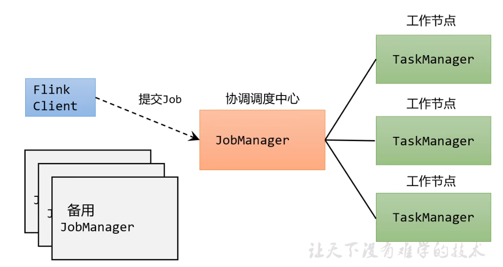
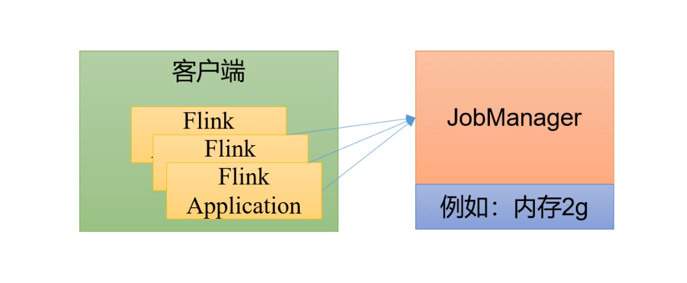
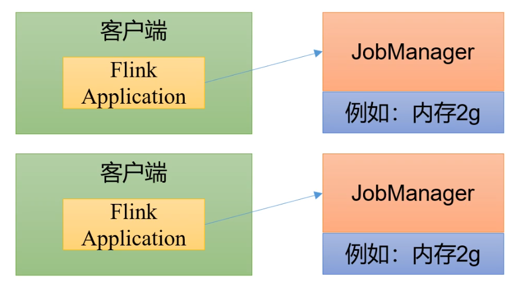
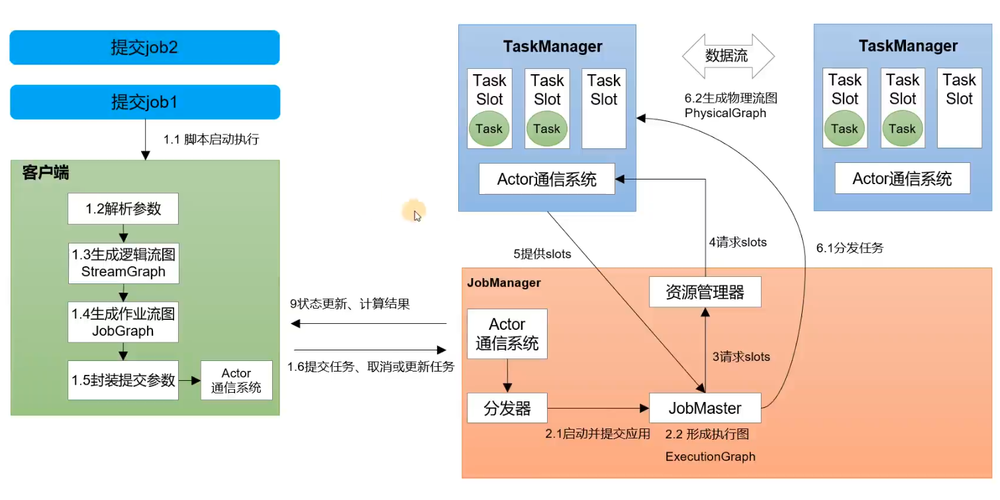
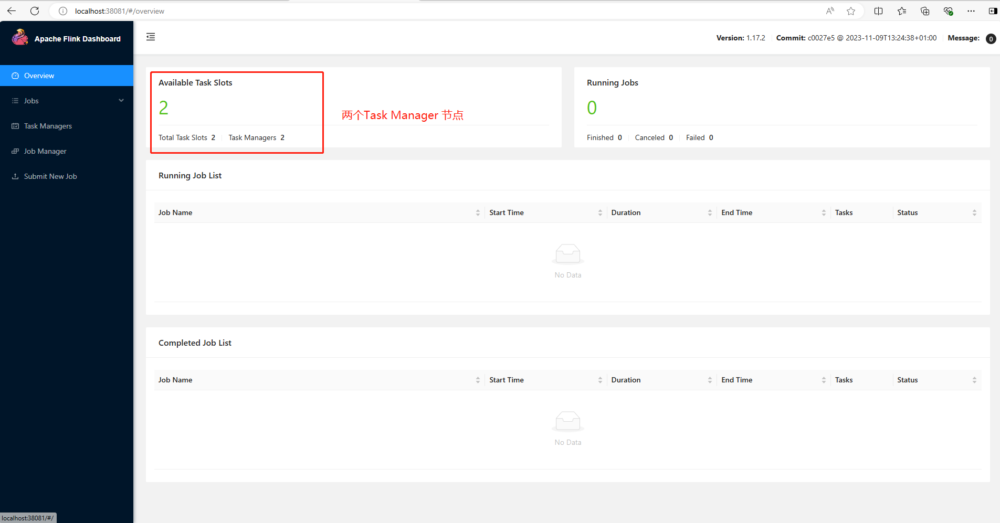

[toc]

# Flink笔记1

当前使用Flink版本为： Flink-1.17.2

## Flink介绍

[Apache Flink官网 https://flink.apache.org/](https://flink.apache.org/)

Apache Flink 是一个开源的分布式数据处理框架，旨在处理实时数据流和批处理数据。它提供了高性能、高吞吐量的数据流处理引擎，允许开发者编写复杂的流处理应用程序，处理来自多种数据源的数据流。

> Flink的应用场景
- 电商和市场营销：实时数据报表，实时推荐。
- 物联网（IOT）：传感器的实时数据采集，实时交通运输等。
- 物流服务业：订单实时更新，信息实时推送。
- 金融业：业务实时结算，业务实时监测。

如图所示，各种各样的数据经过Flink计算处理之后，可以传输给应用，日志，数据库等。


> Flink的主要特点和特性如下
1. 流处理模型: 支持事件驱动的流处理模型，能够处理无界和有界的数据流，并提供了精确的事件时间处理机制。
2. 状态管理: 内置支持状态管理，允许在流处理应用中有效地管理和访问状态，以实现更复杂的业务逻辑。
3. 容错性: 具备高度的容错性，通过检查点（checkpoint）机制和分布式快照（snapshot）技术，能够在节点故障时保证数据不丢失并恢复到一致状态。
4. 可扩展性: 可以水平扩展以处理大规模数据集和高并发的数据处理任务，支持在集群中动态分配和调度任务。
5. 与其他系统集成: 支持各种存储系统（如 Kafka、Hadoop HDFS）、消息队列系统（如 RabbitMQ）、数据仓库（如 Hive）、以及其他计算框架（如 Apache Spark）无缝集成，使其成为现代大数据处理生态系统中的一个重要组成部分。

总之，Apache Flink 是一个强大而灵活的数据流处理框架，用于实时数据流处理和批处理任务，广泛应用于大数据分析、实时数据仓库、监控和警报、实时推荐等领域。

> 什么是有界数据流和无界数据流？

- 无界数据流：是指该数据流只有开始，没有结束。即无界数据流会无休止的产生数据。因此无界数据流的数据需要长期持续处理。

- 有界数据流：是指该数据库有开始，有结束。即有界数据流可以在获取到所有数据之后再进行计算处理。因此有界数据流处理也被称为批量数据处理。

> Flink 和 SparkStreaming 的区别

1. 处理模型上：Flink采用的是基于事件时间的处理模型。Spark Streaming使用的是微批处理模型。
2. 状态管理：Flink 提供了内置的状态管理机制，支持在流处理过程中有效管理和访问状态。Spark Streaming 不提供状态管理机制。
3. 延迟和吞吐量: Flink 通常能够实现更低的处理延迟。Spark Streaming 的微批处理模型会导致一定的批处理延迟。
4. 容错性: Flink 使用分布式快照技术来实现高效的容错性。Spark Streaming 通过 Spark 的 RDD lineage 来实现容错性。


### Flink的两个重要概念：JobManager 和 TaskManager

> JobManager（作业管理器）

在 Apache Flink 中，JobManager 是 Flink 的主要协调节点和控制中心。它负责管理和调度整个作业的执行过程。

JobManager 的主要职责包括:
1. 作业管理与调度:
    - 接收来自客户端的作业提交请求，并将作业转化为作业图（JobGraph）。
    - 将作业图分解为任务（Tasks）并分配给集群中的 TaskManager 执行。
    - 协调任务的执行顺序和并行度，确保作业能够按照预期的流程执行。
2. 故障恢复: 
    - 监控整个作业的执行状态和 TaskManager 的健康状况。
    - 在 TaskManager 失效或者任务执行失败时，负责重新调度任务实例以保证作业的完成。
3. 资源管理：
    - 与资源管理器（如 YARN、Kubernetes 或者自带的 Standalone 部署）进行交互，以获取运行作业所需的计算资源（CPU、内存等）。
    - 动态地管理集群中 TaskManager 的数量和资源配置，以适应作业的需求变化。

总之，JobManager 在 Flink 中是非常重要的组件，它负责管理整个作业的生命周期，保证作业能够高效、可靠地在Flink集群中运行并完成。

> TaskManager（任务管理器）

在 Apache Flink 中，TaskManager 是执行作业任务的工作组件。TaskManager 负责实际执行作业中定义的各个任务（Tasks）。

TaskManager 的主要职责包括：
1. 任务执行: 接收来自 JobManager 的任务部署描述，并根据描述实例化并执行具体的任务。
2. 状态管理：负责管理和维护任务执行过程中的状态。包括任务运行时的数据状态和状态变化等。
3. 数据交换与通信：处理与其他 TaskManager 之间的数据交换和通信。
4. 资源管理：管理 TaskManager 节点上的计算资源，包括 CPU、内存等资源的分配和利用。

在一个 Flink 集群中，通常会有多个 TaskManager 节点组成，每个 TaskManager 可以同时执行一个或多个任务，具体取决于作业的并行度设置和资源配置。并且 TaskManager 负责从输入源接收数据、执行数据转换操作（如 map、reduce 等）、并将结果输出到外部系统或下游任务。

通过多个 TaskManager 的协同工作，Flink 能够实现高吞吐量和低延迟的流处理能力。

如图所示，Flink内部的工作流程如下。


### Flink集群的架构

当我们安装部署多个Flink，组成Flink集群的时候。需要遵循一主多从的架构方式。即一个Flink节点作为 JobManager 主节点，其他Flink节点作为 TaskManager 从节点。

### Flink集群的运行模式

集群的运行模式是指，在不同的场景下集群资源的使用和分配方式，会有所区别。

Flink集群主要有以下三种运行模式：会话模式（session mode）, 单作业模式（per-job mode）, 应用模式(application mode)。

> 会话模式（session mode）

会话模式是指：集群启动时所有资源都已经确定，集群中的作业会互相竞争集群中的资源。



会话模式中的集群资源已经固定下来。因此会话模式适合小规模，执行时间短的大量作业。

> 单作业模式（per-job mode）

单作业模式：提交到Flink集群中的每个作业job都独立运行。每个作业有自己独立的资源调度和状态管理。



Flink的单作业模式，需要依赖一些资源管理框架才能运行。例如Hadoop Yarn , K8S等。

> 应用模式

应用模式是指：不使用客户端。直接把应用提交到JobManager中运行。一个JobManager运行一个应用。应用结束后，JobManager就关闭了。


### Flink集群的部署模式

部署模式是指在不同的应用场景下，Flink集群有不同的安装部署的方式。

> Standalone 模式

Standalone 模式是指独立运行Flink集群，不依赖任何外部资源管理平台。缺点是无法自动扩展资源，必须手动扩展资源。

Standalone 模式一般在开发或测试场景下使用。                                                                                                                             

> YARN 模式

客户端把Flink的应用程序提交给Hadoop Yarn 的 ResourceManager。ResourceManager会向 Yarn的NodeManager 申请容器。在这些容器上，Flink会部署JobManager和TaskManager实例节点，并且启动Flink集群。Flink会根据运行在JobManager上的作业，动态分配TaskManager的资源。

> K8S模式

暂无

## Flink的作业提交流程

如图所示，是Flink 在 Standalone 模式下的作业提交流程图


> JobManager 作业管理器

JobManager 是Flink集群中的任务管理和调度的核心，是执行的主进程。JobManager包含三个子组件。
- jobMaster: 负责单独处理作业job。即每个job有自己对应的jobMaster
- 资源管理器：负责Flink集群中的资源分配和管理，在Flink集群中只有一个。
- 分发器：主要负责提供接口给客户端进行调用。并且为每一个新提交的作业job 启动一个新的jobMaster。

> TaskManager 任务管理器

TaskManager是Flink中的工作进程，具体的计算工作是它来做的。每一个TaskManager都包含了一定数量的任务槽（task slot）。


## Flink的核心概念

### 并行度

如果处理的数据量很大，我们可以把一个算子，复制到多个节点上。并把数据分配到各个节点上的算子中执行。这样一来相当于把一个算子拆分为多个并行的算子，从而实现并行计算。

一个算子（方法）的拆分个数，称之为并行度。

### 算子链

一个数据流在算子之间传输数据的方式，可以是一对一的直通模式，也可以是打乱之后的重分区模式。

### 任务槽（Task Slot）

Flink中的每一个TaskManager 都是一个JVM进程。它可以启动多个独立的线程，来并行执行多个子任务。

为了控制TaskManager并行执行任务的数量，我们需要在TaskManager上对每个任务运行时所占用的资源做出了划分。即任务槽。

每个任务槽 就是 TaskManager 上的资源的一个固定大小的小资源。这个小资源用来独立执行一个子任务的。


## Flink的安装和部署 

此处部署三个Flink节点，其中一个主节点，两个从节点。

节点容器 | 负责的组件
------------ | -------------
myflink01 容器 | JobManager管理组件
myflink02 容器 | TaskManager工作组件
myflink03 容器 | TaskManager工作组件

按顺序执行下面的docker命令

```shell
# 下载flink镜像，该镜像包含flink 1.17.2 ，scala 2.12  和 jdk11
docker pull flink:1.17.2-scala_2.12-java11

# 创建flink网络,flink的各个节点都连接用一个网络
docker network create my-flink-net

# 部署 myflink01 容器
docker run  -itd --name=myflink01 --network my-flink-net  -p 38081:8081 --env FLINK_PROPERTIES="jobmanager.rpc.address: myflink01" flink:1.17.2-scala_2.12-java11 jobmanager

# 部署 myflink02 容器  
docker run -itd --name=myflink02  --network my-flink-net  --env FLINK_PROPERTIES="jobmanager.rpc.address: myflink01" flink:1.17.2-scala_2.12-java11 taskmanager 

# 部署 myflink03 容器  
docker run -itd --name=myflink03  --network my-flink-net  --env FLINK_PROPERTIES="jobmanager.rpc.address: myflink01" flink:1.17.2-scala_2.12-java11 taskmanager 

```

Flink集群部署成功后，浏览器访问`http://localhost:38081`，可以看到myflink01 容器的UI管理界面。




### 配置文件

我们需要修改配置文件中的配置。

flink的配置文件是容器中的 `/opt/flink/conf/flink-conf.yaml`

flink-conf.yaml配置解释
```yaml
# jobmanager进程内存大小配置，默认为1600M
jobmanager.memory.process.size: 1600m

# taskmanager进程内存大小配置，默认为1728M
taskmanager.memory.process.size: 1728m

# taskmanager进程能分配的slot数量设置，默认为1。 slot是指taskmanager中具体运行一个任务需要分配的计算资源。
taskmanager.numberOfTaskSlots: 1

# 任务执行的并行度，默认为1
parallelism.default: 1

```


> myflink01 容器 

flink-conf.yaml文件
```yaml
# jobmanager节点地址
jobmanager.rpc.address: myflink01
# 0.0.0.0 表示都可以访问，无限制
jobmanager.bind-host: 0.0.0.0

```

修改workers文件，把TaskManager工作组件的容器名称填写进去
```
myflink02
myflink03
```

修改master文件，把JobManager管理组件的容器名称填写进去
```
myflink01:8081
```
 
## DataStream API

DataStream API 是 Flink 的核心层API。一个Flink应用程序，其实就是使用 DataStream API 对数据的各种转换处理。

具体来说，Flink的应用程序的代码，主要包括以下几个步骤：
1. 获取执行环境。
2. 读取数据源。
3. 进行数据处理。
4. 输出计算结果。
5. 开始执行。
 