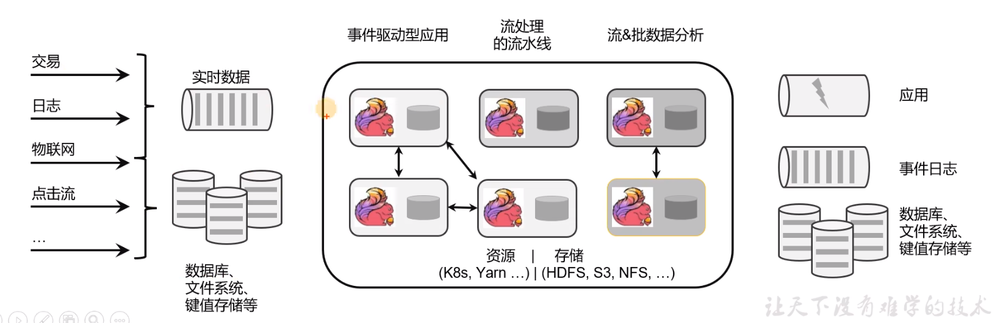

[toc]

# Flink笔记1

当前使用Flink版本为： Flink-1.17.2

## Flink介绍

[Apache Flink官网 https://flink.apache.org/](https://flink.apache.org/)

Apache Flink 是一个开源的分布式数据处理框架，旨在处理实时数据流和批处理数据。它提供了高性能、高吞吐量的数据流处理引擎，允许开发者编写复杂的流处理应用程序，处理来自多种数据源的数据流。

> Flink的应用场景
- 电商和市场营销：实时数据报表，实时推荐。
- 物联网（IOT）：传感器的实时数据采集，实时交通运输等。
- 物流服务业：订单实时更新，信息实时推送。
- 金融业：业务实时结算，业务实时监测。

> Flink的主要特点和特性如下
1. 流处理模型: 支持事件驱动的流处理模型，能够处理无界和有界的数据流，并提供了精确的事件时间处理机制。
2. 状态管理: 内置支持状态管理，允许在流处理应用中有效地管理和访问状态，以实现更复杂的业务逻辑。
3. 容错性: 具备高度的容错性，通过检查点（checkpoint）机制和分布式快照（snapshot）技术，能够在节点故障时保证数据不丢失并恢复到一致状态。
4. 可扩展性: 可以水平扩展以处理大规模数据集和高并发的数据处理任务，支持在集群中动态分配和调度任务。
5. 与其他系统集成: 支持各种存储系统（如 Kafka、Hadoop HDFS）、消息队列系统（如 RabbitMQ）、数据仓库（如 Hive）、以及其他计算框架（如 Apache Spark）无缝集成，使其成为现代大数据处理生态系统中的一个重要组成部分。

总之，Apache Flink 是一个强大而灵活的数据流处理框架，用于实时数据流处理和批处理任务，广泛应用于大数据分析、实时数据仓库、监控和警报、实时推荐等领域。

> 什么是有界数据流和无界数据流？

- 无界数据流：是指该数据流只有开始，没有结束。即无界数据流会无休止的产生数据。因此无界数据流的数据需要长期持续处理。

- 有界数据流：是指该数据库有开始，有结束。即有界数据流可以在获取到所有数据之后再进行计算处理。因此有界数据流处理也被称为批量数据处理。

> Flink 和 SparkStreaming 的区别

1. 处理模型上：Flink采用的是基于事件时间的处理模型。Spark Streaming使用的是微批处理模型。
2. 状态管理：Flink 提供了内置的状态管理机制，支持在流处理过程中有效管理和访问状态。Spark Streaming 不提供状态管理机制。
3. 延迟和吞吐量: Flink 通常能够实现更低的处理延迟。Spark Streaming 的微批处理模型会导致一定的批处理延迟。
4. 容错性: Flink 使用分布式快照技术来实现高效的容错性。Spark Streaming 通过 Spark 的 RDD lineage 来实现容错性。

> Flink的功能示意图

如图所示，各种各样的数据经过Flink计算处理之后，可以传输给应用，日志，数据库等。

总体来说，Apache Flink 更适合对低延迟和高吞吐量有较高要求的实时数据处理应用，而 Spark Streaming 则更适合需要与现有 Spark 框架进行无缝集成的场景，同时能够接受稍高延迟的应用。

### Flink的集群节点

Flink的关键节点主要是下面两个：
- JobManager（作业管理器）：JobManager 是 Flink 的主节点，负责整个作业的协调和管理。它接收客户端提交的作业，并进行作业调度、任务分配和资源管理。JobManager 还负责作业的故障恢复和状态管理，确保作业的高可用性和正确性。
- TaskManager（任务管理器）：TaskManager 是 Flink 集群中的工作节点，负责执行具体的任务。每个 TaskManager 可以运行一个或多个任务，具体任务由 Task Slots 管理。TaskManager 负责从输入源接收数据、执行数据转换操作（如 map、reduce 等）、并将结果输出到外部系统或下游任务。

如图所示

我们再安装部署Flink的时候，主要也是对这个两个节点模块进行配置。

## Flink的安装和部署
