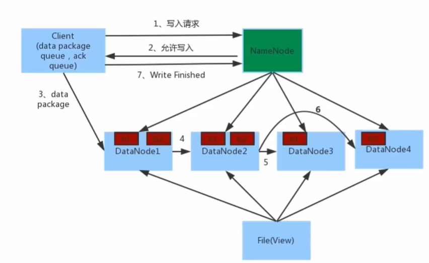
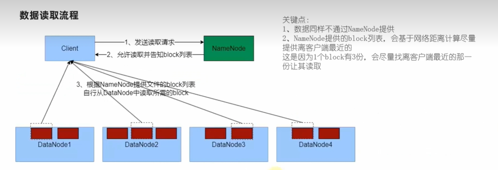
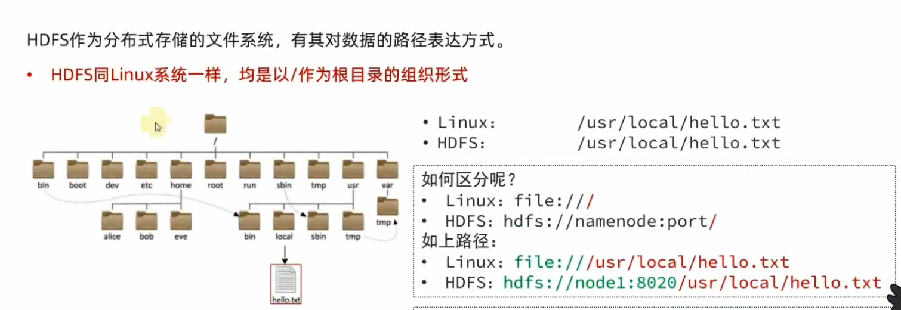
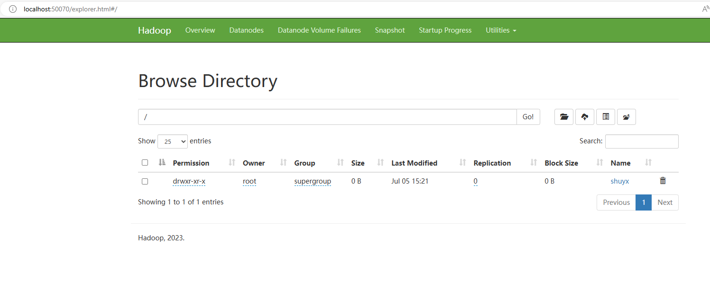

[toc]

# Hadoop笔记2

## HDFS文件系统的使用

### HDFS文件系统存储原理

当文件上传到HDFS系统的时候。HDFS将文件分割成固定大小的块（默认64MB或128MB），并将这些块存储在不同的DataNode上。每个块会被复制到多个DataNode（默认3个副本），以确保数据的可靠性。

> 客户端向HDFS写入数据时。数据写入流程如下
1. 客户端向NameNode发起请求，客户端向NameNode请求写入文件。
2. NameNode会对这个请求进行判断。若满足条件后，NameNode会向客户端告诉DataNode的地址。
3. 客户端会把数据分割成块，并向指定的DataNode发送数据块。
4. 被写入数据的DataNode会同时进行数据块的副本复制工作，并发接收的数据块分发给其他DataNode。
5. 如图所示，客户端将数据块写入第一个DataNode，第一个DataNode再将数据块复制到第二个DataNode，依此类推。
6. 写入完成后客户端会通知NameNode，NameNode会进行元数据记录。



关键点注意：

1. NameNode节点是不负责数据的写入工作，只负责元数据记录和权限审批工作。
2. 客户端会直接向距离自己最近的DataNode，写入数据。不会同时与多个DataNode交互。
3. 数据的副本赋值工作，由DataNode之间自行完成。与客户端和NameNode无关。

> 客户端向HDFS系统读取数据时，数据读取流程如下
1. 客户端向NameNode请求读取文件。
2. NameNode判断客户端的权限后，若允许，则向客户端返回该文件的各个文件块所在的DataNode列表。
3. 客户端直接从各个DataNode读取文件块数据，并在本地合并这些数据块，恢复成完整的文件。



### 命令行操作HDFS集群

当我们在Hadoop容器中配置好HDFS集群后，便可以操作HDFS集群。

> 启动HDFS集群/关闭HDFS集群

在NameNode主角色节点的容器中，执行下面命令。
```sh
# 启动hdfs集群
start-dfs.sh
# 关闭hdfs集群
stop-dfs.sh
```

> 单独启动或关闭某个角色的进程

在某一个Hadoop容器中执行下面命令

```sh
# 语法格式
hdfs --daemon (start|status|stop) (namenode|secondarynamenode|datanode)

# 例如关闭namenode进程
hdfs --daemon stop namenode
# 启动datanode进程
hdfs --daemon start datanode
# 查询secondarynamenode进程信息
hdfs --daemon status secondarynamenode

```

### HDFS文件系统的目录结构

HDFS文件系统的目录结构与Linux系统的目录结构是相似的。



一般情况下系统会自动识别出这个是linux系统的文件，还是hdfs系统的文件。从而自动添加协议头。

### 命令行操作HDFS文件系统

下面介绍一些常用的文件操作，更多操作请查看Hadoop官网。

> 在hdfs中查询目录

```sh
# 语法格式，path为目录完整路径,-h更好显示文件大小，-R 递归查询目录及其子目录
hdfs dfs -ls [-h] [-R] <path>

# 例如查询hdfs文件系统的根目录
hdfs dfs -ls /
# 递归查询根目录，及其子目录
hdfs dfs -ls -R /
```

> 在hdfs中创建目录

```sh
# 语法格式，path为目录完整路径,-p递归创建子目录
hdfs dfs -mkdir [-p] <path>

# 例如在根目录下创建一个shuyx目录
hdfs dfs -mkdir /shuyx
# 递归创建/aaa/bbb目录
hdfs dfs -mkdir -p /aaa/bbb
```

> 上传文件到hdfs中

```sh
# 语法格式，-f 覆盖目标文件，-p 保留权限，src 本地文件路径(linux系统的) ，dst 目标文件路径(hdfs系统的)
hdfs dfs -put [-f] [-p] <src> <dst>

# 创建a.txt文件
$ touch a.txt
# 把本地的a.txt文件 上传到hdfs系统的 /shuyx目录中
$ hdfs dfs -put a.txt /shuyx
# 查询hdfs的/shuyx目录
$ hdfs dfs -ls /shuyx
Found 2 items
-rw-r--r--   2 root supergroup          0 2024-07-05 06:35 /shuyx/a.txt
drwxr-xr-x   - root supergroup          0 2024-07-05 06:23 /shuyx/aaa
```

> 查看hdfs中的文件内容

```sh
# 语法格式 src 文件路径(hdfs系统的)
hdfs dfs -cat <src>
# 对于大文件，使用 管道符配合more。可以翻页查看
hdfs dfs -cat <src> | more 

# 查看hdfs系统中的/shuyx/a.txt文件内容
hdfs dfs -cat /shuyx/a.txt
# 若 a.txt是大文件,则可以使用下面命令
hdfs dfs -cat /shuyx/a.txt | more 
```

> 下载HDFS中的文件到本地系统中

```sh
# 语法格式 -f 覆盖目标文件，-p 保留权限，src 本地文件路径(hdfs系统的) ，dst 目标路径(linux系统的)
hdfs dfs -get [-f] [-p] <src> <dst>

# 下载hdfs系统中的/shuyx/a.txt文件，到当前目录中。 .表示当前目录
hdfs dfs -get -f /shuyx/a.txt .
```

> 复制HDFS中的文件

```sh
# 语法格式 -f 覆盖目标文件，src 本地文件路径(hdfs系统的) ，dst 目标路径(hdfs系统的)
hdfs dfs -cp [-f] <src> <dst>

# 复制hdfs系统中的/shuyx/a.txt文件，到/shuyx/aaa目录中
hdfs dfs -cp /shuyx/a.txt /shuyx/aaa
# 复制hdfs系统中的/shuyx/a.txt文件，到/shuyx目录中,并重命名为aa.txt
hdfs dfs -cp /shuyx/a.txt /shuyx/aa.txt
```

> 将本地文件的内容追加数据到hdfs的文件中

```sh
# 语法格式 src 本地文件路径(linux系统的) ，dst 目标路径(hdfs系统的)
hdfs dfs -appendToFile <src> <dst>

# 把本地的a.txt的文件内容，追加到hdfs系统的/shuyx/a.txt文件中。
hdfs dfs -appendToFile a.txt /shuyx/a.txt
```

> hdfs中的文件移动

```sh
# 语法格式 src 本地文件路径(hdfs系统的) ，dst 目标路径(hdfs系统的)
hdfs dfs -mv <src> <dst>

# 移动/shuyx/a.txt文件，到/shuyx/aaa目录中,并重命名为ccc.txt
hdfs dfs -mv /shuyx/a.txt /shuyx/aaa/ccc.txt
``` 

> hdfs中的文件删除

```sh
# 语法格式 -r 递归删除，适用于删除目录及其子目录
hdfs dfs -rm -r <src>

# 删除/shuyx/a.txt文件
hdfs dfs -rm /shuyx/a.txt
# 删除/shuyx/aaa 目录
hdfs dfs -rm -r /shuyx/aaa
``` 

### 图形化界面操作HDFS文件系统

点击导航栏的Utilities -> Browse the file system。就可以看到下面的界面。

在该界面中，可以简单的查看HDFS文件系统中的文件。


注意：界面上操作是有权限限制的，无法新增，删除，修改文件。


### HDFS系统中自定义设置文件副本数量

在HDFS系统中文件会被复制成多个副本来保障文件的数据安全。默认情况下一个文件会被复制成3个副本，保存至HDFS系统中。但是我们也可以自己自定义设置这个副本数量。

在hdfs-site.xml中配置下面的属性。
```xml
<!-- 设置hdfs文件系统中，文件的副本数量。默认为3 -->
<property>
    <name>dfs.replication</name>
    <value>3</value>
</property>
```

注意如果需要修改这个属性，我们需要在每一台Hadoop的服务器上的hdfs-site.xml中配置该属性。

## YARN资源调度组件的使用

当我们成功部署并启动YARN集群后，可以在YARN集群中运行各种程序。

YARN作为资源调度框架，其本身提供资源提供给各种程序运行。常见程序如下
- MapReduce程序
- Spark程序
- Flink程序

### 在YARN中执行单词计数程序wordcount

单词计数程序wordcount是MapReduce内置的一些模板程序。我们直接使用即可。

这个模板程序都存储在hadoop安装目录中的share/hadoop/mapeduce/hadoop-mapreduce-example-3.3.6.jar包中。

执行模板程序的命令如下
```sh
# 语法如下
hadoop jar 程序包文件 java类名 [参数1]...[参数2]....
```

> 执行单词计数程序wordcount 流程如下

1. 准备一个单词计数文件 test.txt 内容如下

```
hello jack julia michael
hello michael bob apple
hello julia banana
```

2. 将该文件上传到hadoop的hdfs文件系统的/wordcount/input目录中

```sh
# 在hdfs系统中创建/wordcount/input目录
hdfs dfs -mkdir -p /wordcount/input
# 将本地的文件上传到该目录中
hdfs dfs -put test.txt /wordcount/input/
# 查询/wordcount/input/目录
hdfs dfs -ls -R /wordcount
```

3. 运行单词计数程序wordcount 

```sh
# 运行 hadoop-mapreduce-examples-3.3.6.jar 包中的wordcount程序
# 源目录是/wordcount/input，结果目录是/wordcount/output
hadoop jar /usr/local/hadoop/share/hadoop/mapreduce/hadoop-mapreduce-examples-3.3.6.jar wordcount /wordcount/input /wordcount/output
```

4. 查询单词计数结果

```sh
# 打开/wordcount/output/part-r-00000文件
> hadoop fs -cat /wordcount/output/part-r-00000
apple 1
banana 1
bob 1
hello 3
jack 1
julia 2
michael 2
```


