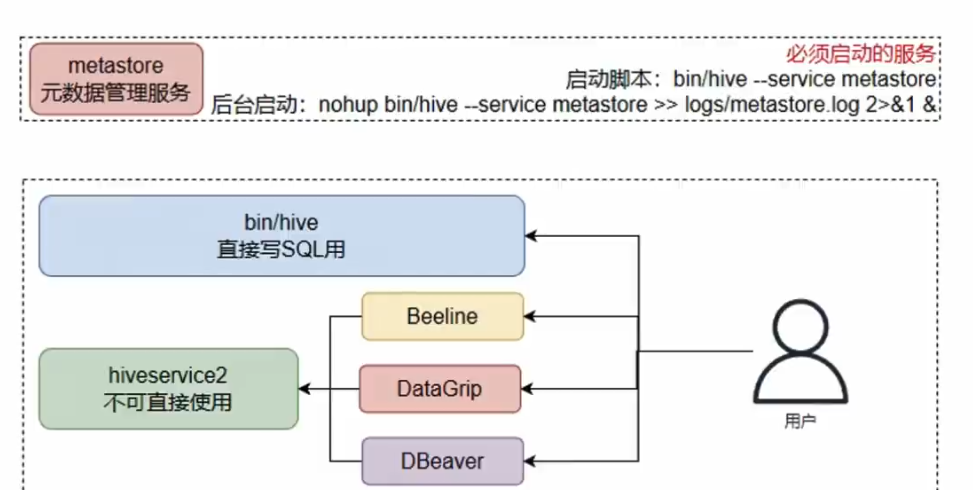

[toc]

# Hive笔记1 (未完成)

Hive版本为4.0.0，而hadoop的版本为3.3.6。

目前Hive 4.0.0 是与 Hadoop 3.3.x 兼容的最新版本。

## Hive介绍

[Hive官网 https://hive.apache.org/](https://hive.apache.org/)

> Hive是什么?

Hive 全称是Apache Hive。

Apache Hive 是一个建立在 Hadoop 上的数据仓库基础架构，用于提供数据汇总、查询和分析。它提供了类似于SQL的查询语言——HiveQL（或 HQL），用于查询和分析存储在Hadoop分布式文件系统（HDFS）中的大数据集。

Hive 是为了支持结构化数据分析而设计的，可以处理大规模数据，并且可以与其他Hadoop生态系统工具集成，如Hadoop MapReduce、HDFS、Apache Spark等。它的查询语言类似于传统的SQL，因此熟悉SQL的开发人员可以很快上手。

总体来说，Hive 是一个基于 Hadoop 的数据仓库解决方案。

> Hive的执行流程

用户可以在Hive中使用 HQL 语句（类SQL语句）进行查询和操作大数据集。

即Hive将 HQL 语句转换为MapReduce程序，之后MapReduce程序在Hadoop的MapReduce组件中进行分布式计算，最后得出计算结果。


> Hive的主要组件

Apache Hive 是一个大数据仓库基础架构，它由多个组件组成，每个组件负责不同的功能和任务。以下是 Apache Hive 的主要组件。

- Hive Metastore：是 Hive 的元数据存储和管理组件。它保存了关于 Hive 表、分区、列和分布式存储的元数据信息。Metastore 通常与关系型数据库（如MySQL、PostgreSQL等）配合使用，用于持久化存储元数据。
- Hive Server: 该组件提供了与 Hive 进行交互的接口，允许用户和客户端通过 JDBC 或 Thrift API客户端 提交 HiveQL 查询和命令。
- Hive CLI: 该组件是一个命令行工具，允许用户直接在终端中输入 HiveQL 查询和命令，并与 Hive 交互。
- Hive Driver: 是连接 Hive 到执行引擎（如MapReduce）的桥梁。它负责将用户提交的 HiveQL 查询转换为任务，并通过执行引擎执行并获取结果。
- Hive Execution Engine: 是负责实际执行 HiveQL 查询的组件。Apache Hive 支持多种执行引擎，包括 MapReduce、Spark等。选择不同的执行引擎可以根据查询类型、性能需求和环境进行优化。 
....


## Hive的安装部署

注意事项
1. Hive需要依赖Hadoop。因此Hive容器要与Hadoop容器互相通信。即两个容器之间要在用一个网络中。
2. 部署Hive集群和部署单节点的Hive是不一样的。下面是部署单节点的Hive容器。

> 下载Hive镜像

```shell
docker pull apache/hive:4.0.0
```

> 创建和运行Hive容器

```shell
docker run -d --name myHive-hiveserver2 --network my-hadoop-net -p 10000:10000 -p 10002:10002 --env SERVICE_NAME=hiveserver2 apache/hive:4.0.0

docker run -d --name myHive-metastore --network my-hadoop-net -p 39083:9083 --env SERVICE_NAME=metastore apache/hive:4.0.0

# 10002端口 Hive 提供了一个 Web UI 界面，用于通过浏览器进行交互和管理 Hive 服务。可以通过10002端口来访问UI界面。
# 10000端口 Hive允许客户端通过10000端口与 Hive 进行交互，执行查询和管理作业等操作。
# 9083端口：9083端口是Hive的元数据存储端口，从而管理 Hive中的元数据信息，如表的结构、位置等。
```


## Hive客户端

Beeline 是Hive内置的一个命令行客户端。Beeline通过JDBC协议和HiveServer2服务进行互相通信。

HiveServer2 是Hive内置的一个服务，提供接口给其他客户端连接。可以连接HiveServer2服务的客户端有。
- Hive内置的beelne客户端工具（命令行工具）。
- 第三方的图形化SQL工具。如果DataGrip，DBeaver等



简而言之，客户端必须通过 HiveServer2 服务，才能使用Hive。

> 启动 HiveServer2 服务


## Hive的使用

下面先通过Beeline客户端，连接HiveServer2服务。

```shell
# 启动beeline客户端
bin/beeline
# 连接HiveServer2服务
beeline> !connect jdbc:hive2://myHive:10000: root
```

之后都是通过Beeline客户端操作Hive。

### 数据库操作

> 创建数据库

```shell
# 创建数据库，名字为db_name
create database [if not exists] db_name;

# 创建数据库并指定存储位置
create database [if not exists] db_name location '/usr/xxx';

# 查询所有数据库
show databases;

# 切换数据库
use db_name;

# 查询某个数据库详细信息
desc database db_name;

# 删除空数据库,若库中包含表，则无法删除
drop database db_name;

# 强制删除数据库，库中的表一并删除。
drop database db_name cascade;

```

注意：在Hive中数据库的本质就是HDFS文件系统中的某个.db后缀文件夹。

默认数据库的存放路径是在HDFS的`/usr/hive/warehouse`目录中。也可以通过location关键字指定数据库的存储位置。

### 表操作

```shell
# 创建一个基础表，示例如下
create table table_name(
    id INT,
    name STRING,
    gender String
);

# 删除表
drop table table_name;

## 清空表
truncate table table_name;

## 表重命名
alter table old_name rename to new_name;

## 修改表属性，例如注释等
alter table table_name set TBLproperties('comment'='new_comment');

## 添加列名
alter table table_name add columns(column1 int , column2 string);

## 修改列名,此处把column1列改为new_column1列。注意类型无法更改
alter table table_name change column1 new_column1 int;

```

### 基本查询

Hive的查询语句,基本上与SQL的查询语句类似

```shell
# 查询语法
select 查询列1,查询列2... 
from table_name
[where 查询条件] 
[Group 分组条件]
[Having 聚合条件]
[order 排序条件]
[limit 分页条件]

# 例如

# 查询全表数据
select * from table_name;

# 查询特定列信息
select id,name,gender from table_name;

# 查询表有多少条数据
select count(*) from table_name;

# 根据id>10条件查询
select * from table_name where id > 10;

# 模糊查询
select * from table_name where name like '%广东%';

# 分组查询
select * from table_name Group by id;

```


### 数据类型

Hive中的基本数据类型如下
```shell
# 数值型
TINYINT — 微整型，只占用1个字节，只能存储0-255的整数。
SMALLINT – 小整型，占用2个字节，存储范围–32768 到 32767。
INT – 整型，占用4个字节，存储范围-2147483648到2147483647。
BIGINT – 长整型，占用8个字节，存储范围-2^63到2^63-1。

# 布尔型
BOOLEAN — TRUE/FALSE

# 浮点型
FLOAT – 单精度浮点数。
DOUBLE – 双精度浮点数。

# 字符串型
STRING – 不设定长度。

# 日期类型
timestamp - 时间戳
date - 日期
```


