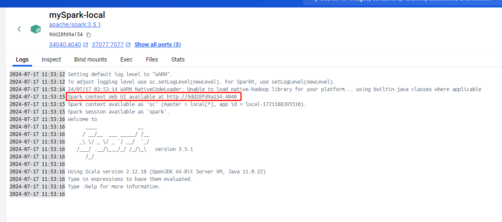
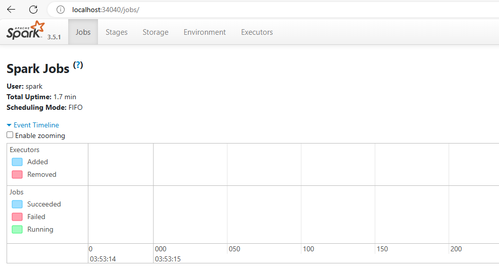
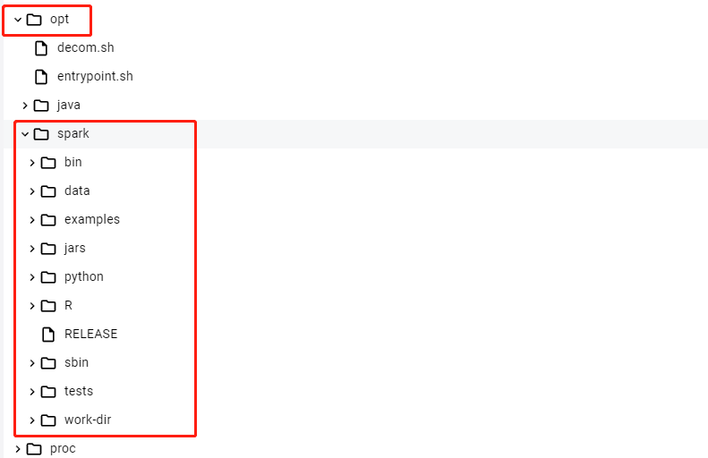
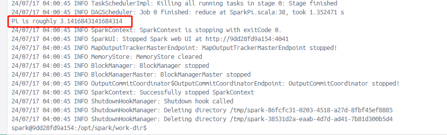

[toc]

# Spark笔记1

## Spark介绍

Spark是一个基于内存的快速，通用，可扩展的大数据分布式计算引擎。它提供了一整套开发 API，包括流计算和机器学习。

Spark 的一个显著特点是它能够在内存中进行迭代计算，从而加快数据处理速度。尽管 Spark 是用 Scala语言 开发的，但它也为 Java、Scala、Python 和 R 等高级编程语言提供了开发接口。

> Spark的特点

- 速度：Spark 基于内存计算，能够比基于磁盘的计算快很多。
- 易用性：Spark 支持多种语言操作，包括 Java、Scala、Python 和 R。
- 通用性：Spark 提供了多种组件，可以支持不同类型的计算任务，包括批处理、交互式查询、流处理、机器学习和图形处理等。
- 兼容性：Spark 可以与多种数据源集成，包括 Hadoop 分布式文件系统（HDFS）、Apache HBase 和 Amazon S3 等。
- 容错性：Spark 提供了弹性分布式数据集（RDD）抽象，可以帮助开发人员更快地构建容错应用程序

### Spark的角色架构

Spark 在分布式计算中的角色架构主要包括以下几个角色：

> Driver 驱动器
- 主要负责 Spark 应用程序的整体控制和调度。
- 负责将用户程序转化为任务并在集群上执行。
- 维护了整个应用程序的执行进度和状态。

> Executor 执行器
- 在集群节点上执行实际的任务。
- 负责接收来自 Driver 的任务并执行。
- 通过执行任务来处理和存储数据。

> Cluster Manager 集群管理者
- 负责管理集群资源，如节点的分配和调度。
- Spark 支持多种集群管理器，如 Standalone、YARN、Mesos 等。

在 Spark 应用程序运行期间，Driver 和 Executor 是最关键的两个角色。Driver 负责整体的控制和协调，而 Executor 则是具体执行计算任务的实体。Cluster Manager 则是在集群级别上进行资源管理和调度的组件。

### Spark的核心模块

Spark的核心模块如图所示


> Spark Core 核心模块

Spark Core 是 Spark 的基础，它提供了内存计算的能力，是分布式处理大数据集的基础。

它将分布式数据抽象为弹性分布式数据集（RDD），并提供了对 RDD 的操作接口。所有其他组件都建立在 Spark Core 的基础之上。

> Spark SQL 结构化数据模块

Spark SQL 是一个用于处理结构化数据的 Spark 组件。它允许使用 SQL 语句查询数据。

Spark 支持多种数据源，包括 Hive 表、Parquet 和 JSON 等。

> Spark Streaming 实时计算模块

Spark Streaming 是一个用于处理动态数据流的 Spark 组件。它提供数据流处理的功能，基于微批处理的模式来处理数据流。

> Spark MLlib 机器学习模块

Spark MLlib 是 Spark 的机器学习库。

它提供了常用的机器学习算法和实用程序，包括分类、回归、聚类、协同过滤、降维等。MLlib 还提供了一些底层优化原语和高层流水线 API，可以帮助开发人员更快地创建和调试机器学习流水线。

> Spark GraphX 图计算模块

Spark GraphX 是 Spark 的图形计算库。它提供了一种分布式图形处理框架，可以帮助开发人员更快地构建和分析大型图形。 


### Spark的运行模式

Spark 支持多种运行模式，包括 local 本地模式、standalone 独立集群模式、Mesos 模式、YARN 模式和 Kubernetes 模式。

1. local 本地模式（又称单机模式）

在本地模式下，Spark 应用程序会在单个机器上运行。这种模式适用于开发和测试，但不适用于生产环境。

2. standalone 独立集群模式。（国内不常用）

在 Standalone 模式下，Spark 自带了一个简单的集群管理器，可以独立运行在一个 Spark-only 的集群上。

这种模式下，Spark 的 Driver 和 Executor 进程都运行在 Spark 管理的节点上。Standalone 模式适合于简单的开发、测试和小规模部署。

3. YARN 模式

YARN 是 Apache Hadoop 的资源管理器，Spark 可以使用 Apache Hadoop的 YARN 组件来进行资源和任务调度。Spark 的 Driver 和 Executor 都作为 YARN 的应用程序来执行。

这种模式下，Spark 可以与其他 Hadoop 生态系统的应用程序共享同一集群资源。

4. Mesos 模式 

Mesos 是一个通用的集群管理器，Spark 可以作为 Mesos 上的一个框架运行。

在 Mesos 模式下，Spark 应用程序会连接到一个 Apache Mesos 集群，并在集群中运行。这种模式支持动态资源分配和细粒度资源共享，目前国内使用较少。

5. Kubernetes 模式

在 Kubernetes 模式下，Spark 应用程序会连接到一个 Kubernetes 集群，并在集群中运行。每个 Spark Executor 都作为一个 Kubernetes Pod 运行。

这种模式对于在云原生环境中运行 Spark 应用程序非常有用，可以有效地利用 Kubernetes 提供的弹性和资源管理能力。

> 如何选择Spark的运行模式？

- 如果你已经在使用 Hadoop 的 YARN 或 Mesos 作为集群管理器，那么将 Spark 部署为这些平台的应用程序可能是最方便的选择。
- 如果你正在寻求简单的部署和管理，可以考虑使用 Standalone 模式。
- 如果你的环境是基于 Kubernetes ，那么 Kubernetes 模式可能是最合适的选择

每种模式都有其特定的优势和适用场景，因此根据具体需求进行选择是非常重要的。

## Spark 安装部署

下面使用的是 Spark的 local 本地模式。

### docker 安装 Spark

```shell
# 下载spark镜像
docker pull apache/spark:3.5.1

# 运行spark容器
docker run -d -it --name mySpark-local -p 37077:7077 -p 34040:4040 -p 28088:8080 apache/spark:3.5.1 /opt/spark/bin/spark-shell


```

spark容器运行界面

Spark的WEB UI界面


spark容器中的spark目录位置在 /opt/spark 中


- bin目录存储二进制脚本文件
- data目录存储spark产生的数据
- examples目录存储spark的模板案例
....


Spark内置了许多模板案例，我们可以使用spark计算圆周率
```shell
# 进入到容器终端中,执行下面命令
# 执行spark-examples_2.12-3.5.1.jar包中的SparkPi类程序10次。从而计算出圆周率。
$ /opt/spark/bin/spark-submit --class org.apache.spark.examples.SparkPi --master local[2] /opt/spark/examples/jars/spark-examples_2.12-3.5.1.jar 100

# /opt/spark/bin/spark-submit 提交脚本
# --class 表示要执行程序的主类
# --master 是指提供的计算资源。local表示由自已提供计算资源。 
# 并且 local表示单线程计算，local[K] 表示 k个线程计算， local[*] 表示使用最大线程计算。
```

计算圆周率运行截图如下



## Spark Core

### RDD介绍

RDD（Resilient Distributed Dataset，弹性分布式数据集）是 Apache Spark 中的基本抽象概念，它代表了可以并行操作的、可容错的数据集合。

RDD 也是 Spark 提供的一种基础数据结构，它具有以下特性和优势：
1. 分布式数据集：RDD 会把数据集合分成多个分区（partitions），这些分区可以分布在集群的不同节点上进行并行处理。
2. 容错性：RDD 具备容错特性，即在节点发生故障时，能够自动恢复数据并保持计算的一致性。
3. 不可变性：RDD 的数据结构是不可变的，一旦创建就不能修改。这样的设计使得RDD更容易进行并行处理，因为每个分区的数据都可以独立处理，而不会影响其他分区。
4. 惰性计算：RDD 支持惰性计算（lazy evaluation），只有在需要计算结果时才会真正执行计算操作，这种延迟计算的机制有助于优化整体的执行流程和性能。
5. 可操作性：RDD 提供了多种操作（transformations 和 actions），可以对数据进行转换（如 map、filter、reduce 等）和获取结果（如 collect、count 等），支持复杂的数据处理任务。

> RDD 支持两类操作：
1. Transformations（转换操作）：转换操作会从一个 RDD 创建一个新的 RDD，常见的转换操作有 map、filter、flatMap、reduceByKey 等。这些操作不会立即计算出结果，而是定义一个计算流程。
2. Actions（行动操作）：行动操作会触发实际的计算，并返回结果给驱动程序或将结果写入外部系统（如文件系统）。常见的行动操作有 collect、count、saveAsTextFile 等。

> RDD 的数据处理流程

在 Spark 中，RDD 的数据处理流程由以下几个步骤组成：
1. 创建RDD：通过外部数据源或者在程序中通过并行化集合来创建RDD。
2. 转换操作：对RDD中的数据进行处理操作。
    - Map：对RDD中的每个元素应用一个函数，返回一个新的RDD。
    - Filter：根据指定的条件过滤RDD中的元素，生成一个新的RDD。
    - FlatMap：与Map类似，但每个输入元素可以映射到多个输出元素。
    - ReduceByKey：对具有相同键的元素进行合并操作，生成一个新的RDD。
    - Join：将两个RDD进行连接操作。
    - 等等其他转换操作。这些转换操作不会立即执行，而是构建一个操作图DAG来描述计算流程。
3. 行动操作：Spark 会按照 操作图DAG 上定义的计算流程进行实际计算，产生结果或者影响外部存储系统。
    - Collect：将RDD中的所有元素返回到驱动程序。
    - Count：统计RDD中元素的个数。
    - SaveAsTextFile：将RDD的内容保存到文本文件中或其他外部存储系统。
    - 等等其他行动操作。这些行动操作会触发实际的计算并生成结果或将结果写入外部存储。
4. 缓存和持久化：可以选择将RDD缓存在内存中或持久化到磁盘，以便在多次使用中提高计算性能和计算效率。
5. 销毁和回收：在 RDD 不再需要时，Spark 会自动管理RDD内部数据的销毁和资源的回收。

### RDD的使用

#### RDD的创建

创建RDD的多种方式
- 从外部数据源创建：可以从文件（如文本文件、JSON 文件）、HDFS、数据库（如Hive、HBase）、现有的 Scala 集合等数据源中创建 RDD。
- 通过转换操作创建：可以通过对现有的 RDD 执行转换操作（如 map、filter、reduceByKey 等）来创建新的 RDD。
- 并行化集合：可以通过在驱动程序中并行化现有的 Scala 集合来创建 RDD。


> ① java代码如下

添加依赖
```xml
<dependency>
    <groupId>org.apache.spark</groupId>
    <artifactId>spark-core_2.12</artifactId>
    <version>3.5.1</version>
</dependency>
<dependency>
    <groupId>org.slf4j</groupId>
    <artifactId>slf4j-nop</artifactId>
    <version>1.7.2</version>
</dependency>
```

java代码如下
```java
package org.example;
import org.apache.spark.SparkConf;
import org.apache.spark.api.java.JavaSparkContext;
public class Spark01 {
    public static void main(String[] args) {

        //构建spark配置
        final SparkConf sparkConf = new SparkConf();
        sparkConf.setMaster("local");
        sparkConf.setAppName("mySparkAPP-01");
        //构建spark的运行环境
        final JavaSparkContext javaSparkContext = new JavaSparkContext(sparkConf);

        List<String> list = Arrays.asList("xiaoming", "zhangsan", "tiantian");
        JavaRDD<String> rdd = javaSparkContext.parallelize(list);

        List<String> collect = rdd.collect();
        for (String str : collect) {
            System.out.println(str);
        }

        //关闭环境
        javaSparkContext.close();

    }
}

```

运行该程序需要设置JVM参数（IDEA对该程序添加JVM option）。参数如下
```
-XX:+IgnoreUnrecognizedVMOptions
--add-opens=java.base/java.lang=ALL-UNNAMED
--add-opens=java.base/java.lang.invoke=ALL-UNNAMED
--add-opens=java.base/java.lang.reflect=ALL-UNNAMED
--add-opens=java.base/java.io=ALL-UNNAMED
--add-opens=java.base/java.net=ALL-UNNAMED
--add-opens=java.base/java.nio=ALL-UNNAMED
--add-opens=java.base/java.util=ALL-UNNAMED
--add-opens=java.base/java.util.concurrent=ALL-UNNAMED
--add-opens=java.base/java.util.concurrent.atomic=ALL-UNNAMED
--add-opens=java.base/sun.nio.ch=ALL-UNNAMED
--add-opens=java.base/sun.nio.cs=ALL-UNNAMED
--add-opens=java.base/sun.security.action=ALL-UNNAMED
--add-opens=java.base/sun.util.calendar=ALL-UNNAMED
--add-opens=java.security.jgss/sun.security.krb5=ALL-UNNAMED

```