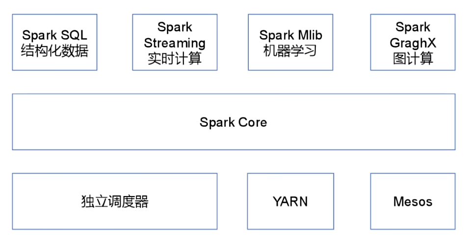

[toc]

# Spark笔记1

## Spark介绍

Spark是一个基于内存的快速，通用，可扩展的大数据分布式计算引擎。它提供了一整套开发 API，包括流计算和机器学习。

Spark 的一个显著特点是它能够在内存中进行迭代计算，从而加快数据处理速度。尽管 Spark 是用 Scala语言 开发的，但它也为 Java、Scala、Python 和 R 等高级编程语言提供了开发接口。

> Spark的特点

- 速度：Spark 基于内存计算，能够比基于磁盘的计算快很多。
- 易用性：Spark 支持多种语言操作，包括 Java、Scala、Python 和 R。
- 通用性：Spark 提供了多种组件，可以支持不同类型的计算任务，包括批处理、交互式查询、流处理、机器学习和图形处理等。
- 兼容性：Spark 可以与多种数据源集成，包括 Hadoop 分布式文件系统（HDFS）、Apache HBase 和 Amazon S3 等。
- 容错性：Spark 提供了弹性分布式数据集（RDD）抽象，可以帮助开发人员更快地构建容错应用程序

### Spark的角色架构

Spark 在分布式计算中的角色架构主要包括以下几个角色：

> Driver 驱动器
- 主要负责 Spark 应用程序的整体控制和调度。
- 负责将用户程序转化为任务并在集群上执行。
- 维护了整个应用程序的执行进度和状态。

> Executor 执行器
- 在集群节点上执行实际的任务。
- 负责接收来自 Driver 的任务并执行。
- 通过执行任务来处理和存储数据。

> Cluster Manager 集群管理者
- 负责管理集群资源，如节点的分配和调度。
- Spark 支持多种集群管理器，如 Standalone、YARN、Mesos 等。

在 Spark 应用程序运行期间，Driver 和 Executor 是最关键的两个角色。Driver 负责整体的控制和协调，而 Executor 则是具体执行计算任务的实体。Cluster Manager 则是在集群级别上进行资源管理和调度的组件。

### Spark的核心模块

Spark的核心模块如图所示

> Spark Core 核心模块

Spark Core 是 Spark 的基础，它提供了内存计算的能力，是分布式处理大数据集的基础。

它将分布式数据抽象为弹性分布式数据集（RDD），并提供了对 RDD 的操作接口。所有其他组件都建立在 Spark Core 的基础之上。

> Spark SQL 结构化数据模块

Spark SQL 是一个用于处理结构化数据的 Spark 组件。它允许使用 SQL 语句查询数据。

Spark 支持多种数据源，包括 Hive 表、Parquet 和 JSON 等。

> Spark Streaming 实时计算模块

Spark Streaming 是一个用于处理动态数据流的 Spark 组件。它提供数据流处理的功能，基于微批处理的模式来处理数据流。

> Spark MLlib 机器学习模块

Spark MLlib 是 Spark 的机器学习库。

它提供了常用的机器学习算法和实用程序，包括分类、回归、聚类、协同过滤、降维等。MLlib 还提供了一些底层优化原语和高层流水线 API，可以帮助开发人员更快地创建和调试机器学习流水线。

> Spark GraphX 图计算模块

Spark GraphX 是 Spark 的图形计算库。它提供了一种分布式图形处理框架，可以帮助开发人员更快地构建和分析大型图形。 

### Spark的运行模式

Spark 支持多种运行模式，包括 local 本地模式、standalone 独立集群模式、Mesos 模式、YARN 模式和 Kubernetes 模式。

- local 本地模式：在本地模式下，Spark 应用程序会在单个机器上运行，不需要连接到集群。这种模式适用于开发和测试，但不适用于生产环境。
- standalone 独立集群模式：在独立模式下，Spark 应用程序会连接到一个独立的 Spark 集群，并在集群中运行。这种模式适用于小型集群，但不支持动态资源分配。
- Mesos 模式：在 Mesos 模式下，Spark 应用程序会连接到一个 Apache Mesos 集群，并在集群中运行。这种模式支持动态资源分配和细粒度资源共享，目前国内使用较少。
- YARN 模式：在 YARN 模式下，Spark 应用程序会连接到一个 Apache Hadoop YARN 集群，并在集群中运行。这种模式支持动态资源分配和与其他 Hadoop 生态系统组件的集成，Spark在Yarn模式下是不需要Master和Worker的。
- Kubernetes 模式：在 Kubernetes 模式下，Spark 应用程序会连接到一个 Kubernetes 集群，并在集群中运行。这种模式支持动态资源分配和容器化部署。

