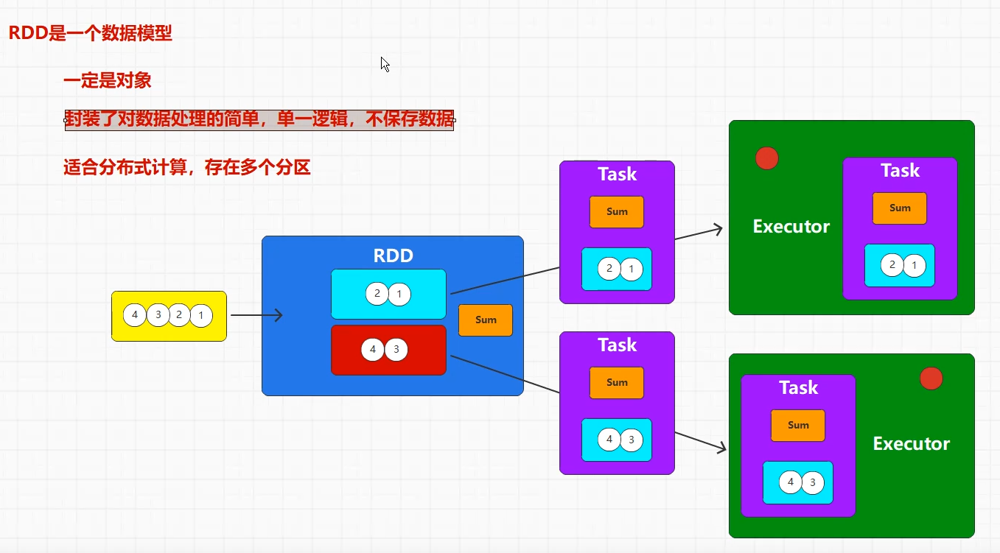
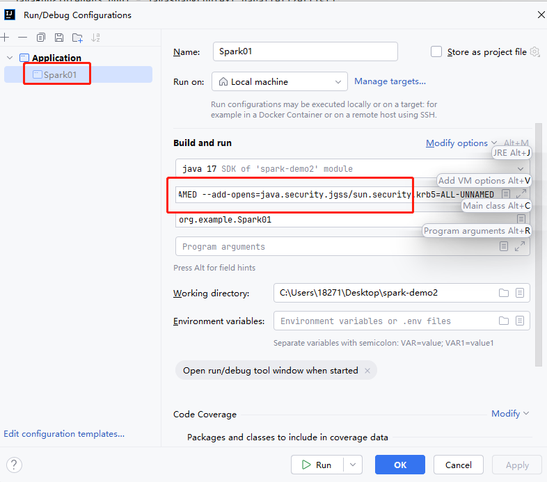
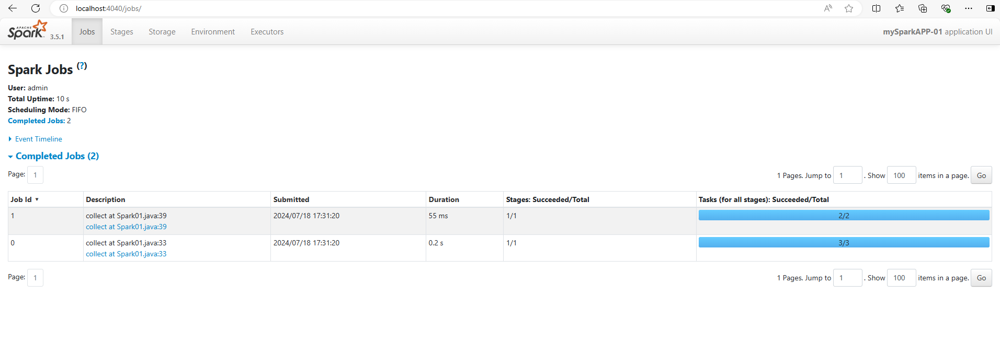

[toc]

# Spark笔记1

## Spark介绍

Spark是一个基于内存的快速，通用，可扩展的大数据分布式计算引擎。它提供了一整套开发 API，包括流计算和机器学习。

Spark 的一个显著特点是它能够在内存中进行迭代计算，从而加快数据处理速度。尽管 Spark 是用 Scala语言 开发的，但它也为 Java、Scala、Python 和 R 等高级编程语言提供了开发接口。

> Spark的特点

- 速度：Spark 基于内存计算，能够比基于磁盘的计算快很多。
- 易用性：Spark 支持多种语言操作，包括 Java、Scala、Python 和 R。
- 通用性：Spark 提供了多种组件，可以支持不同类型的计算任务，包括批处理、交互式查询、流处理、机器学习和图形处理等。
- 兼容性：Spark 可以与多种数据源集成，包括 Hadoop 分布式文件系统（HDFS）、Apache HBase 和 Amazon S3 等。
- 容错性：Spark 提供了弹性分布式数据集（RDD）抽象，可以帮助开发人员更快地构建容错应用程序

### Spark的角色架构

Spark 在分布式计算中的角色架构主要包括以下几个角色：

> Driver 驱动器
- 主要负责 Spark 应用程序的整体控制和调度。
- 负责将用户程序转化为任务并在集群上执行。
- 维护了整个应用程序的执行进度和状态。

> Executor 执行器
- 在集群节点上执行实际的任务。
- 负责接收来自 Driver 的任务并执行。
- 通过执行任务来处理和存储数据。

> Cluster Manager 集群管理者
- 负责管理集群资源，如节点的分配和调度。
- Spark 支持多种集群管理器，如 Standalone、YARN、Mesos 等。

在 Spark 应用程序运行期间，Driver 和 Executor 是最关键的两个角色。Driver 负责整体的控制和协调，而 Executor 则是具体执行计算任务的实体。Cluster Manager 则是在集群级别上进行资源管理和调度的组件。

### Spark的核心模块

Spark的核心模块如图所示


> Spark Core 核心模块

Spark Core 是 Spark 的基础，它提供了内存计算的能力，是分布式处理大数据集的基础。

它将分布式数据抽象为弹性分布式数据集（RDD），并提供了对 RDD 的操作接口。所有其他组件都建立在 Spark Core 的基础之上。

> Spark SQL 结构化数据模块

Spark SQL 是一个用于处理结构化数据的 Spark 组件。它允许使用 SQL 语句查询数据。

Spark 支持多种数据源，包括 Hive 表、Parquet 和 JSON 等。

> Spark Streaming 实时计算模块

Spark Streaming 是一个用于处理动态数据流的 Spark 组件。它提供数据流处理的功能，基于微批处理的模式来处理数据流。

> Spark MLlib 机器学习模块

Spark MLlib 是 Spark 的机器学习库。

它提供了常用的机器学习算法和实用程序，包括分类、回归、聚类、协同过滤、降维等。MLlib 还提供了一些底层优化原语和高层流水线 API，可以帮助开发人员更快地创建和调试机器学习流水线。

> Spark GraphX 图计算模块

Spark GraphX 是 Spark 的图形计算库。它提供了一种分布式图形处理框架，可以帮助开发人员更快地构建和分析大型图形。 


### Spark的运行模式

Spark 支持多种运行模式，包括 local 本地模式、standalone 独立集群模式、Mesos 模式、YARN 模式和 Kubernetes 模式。

1. local 本地模式（又称单机模式）

在本地模式下，Spark 应用程序会在单个机器上运行。这种模式适用于开发和测试，但不适用于生产环境。

2. standalone 独立集群模式。（国内不常用）

在 Standalone 模式下，Spark 自带了一个简单的集群管理器，可以独立运行在一个 Spark-only 的集群上。

这种模式下，Spark 的 Driver 和 Executor 进程都运行在 Spark 管理的节点上。Standalone 模式适合于简单的开发、测试和小规模部署。

3. YARN 模式

YARN 是 Apache Hadoop 的资源管理器，Spark 可以使用 Apache Hadoop的 YARN 组件来进行资源和任务调度。Spark 的 Driver 和 Executor 都作为 YARN 的应用程序来执行。

这种模式下，Spark 可以与其他 Hadoop 生态系统的应用程序共享同一集群资源。

4. Mesos 模式 

Mesos 是一个通用的集群管理器，Spark 可以作为 Mesos 上的一个框架运行。

在 Mesos 模式下，Spark 应用程序会连接到一个 Apache Mesos 集群，并在集群中运行。这种模式支持动态资源分配和细粒度资源共享，目前国内使用较少。

5. Kubernetes 模式

在 Kubernetes 模式下，Spark 应用程序会连接到一个 Kubernetes 集群，并在集群中运行。每个 Spark Executor 都作为一个 Kubernetes Pod 运行。

这种模式对于在云原生环境中运行 Spark 应用程序非常有用，可以有效地利用 Kubernetes 提供的弹性和资源管理能力。

> 如何选择Spark的运行模式？

- 如果你已经在使用 Hadoop 的 YARN 或 Mesos 作为集群管理器，那么将 Spark 部署为这些平台的应用程序可能是最方便的选择。
- 如果你正在寻求简单的部署和管理，可以考虑使用 Standalone 模式。
- 如果你的环境是基于 Kubernetes ，那么 Kubernetes 模式可能是最合适的选择

每种模式都有其特定的优势和适用场景，因此根据具体需求进行选择是非常重要的。

## Spark 安装部署

下面使用的是 Spark的 local 本地模式。

### docker 安装 Spark

```shell
# 下载spark镜像
docker pull apache/spark:3.5.1

# 运行spark容器
docker run -d -it --name mySpark-local -p 37077:7077 -p 34040:4040 -p 28088:8080 apache/spark:3.5.1 /opt/spark/bin/spark-shell


```

spark容器运行界面

Spark的WEB UI界面


spark容器中的spark目录位置在 /opt/spark 中


- bin目录存储二进制脚本文件
- data目录存储spark产生的数据
- examples目录存储spark的模板案例
....


Spark内置了许多模板案例，我们可以使用spark计算圆周率
```shell
# 进入到容器终端中,执行下面命令
# 执行spark-examples_2.12-3.5.1.jar包中的SparkPi类程序10次。从而计算出圆周率。
$ /opt/spark/bin/spark-submit --class org.apache.spark.examples.SparkPi --master local[2] /opt/spark/examples/jars/spark-examples_2.12-3.5.1.jar 100

# /opt/spark/bin/spark-submit 提交脚本
# --class 表示要执行程序的主类
# --master 是指提供的计算资源。local表示由自已提供计算资源。 
# 并且 local表示单线程计算，local[K] 表示 k个线程计算， local[*] 表示使用最大线程计算。
```

计算圆周率运行截图如下


## Spark Core

### RDD介绍

RDD（Resilient Distributed Dataset，弹性分布式数据集）是 Apache Spark 中的基本抽象概念，它代表了可以并行操作的、可容错的数据集合。

RDD 是 Spark 提供的一种基础数据结构，它具有以下特性和优势：
1. 分布式数据集：RDD 会把数据集合分成多个分区（partitions），这些分区可以分布在集群的不同节点上进行并行处理。
2. 容错性：RDD 具备容错特性，即在节点发生故障时，能够自动恢复数据并保持计算的一致性。
3. 不可变性：RDD 的数据结构是不可变的，一旦创建就不能修改。这样的设计使得RDD更容易进行并行处理，因为每个分区的数据都可以独立处理，而不会影响其他分区。
4. 惰性计算：RDD 支持惰性计算（lazy evaluation），只有在需要计算结果时才会真正执行计算操作，这种延迟计算的机制有助于优化整体的执行流程和性能。
5. 可操作性：RDD 提供了多种操作（transformations 和 actions），可以对数据进行转换（如 map、filter、reduce 等）和获取结果（如 collect、count 等），支持复杂的数据处理任务。

<font color="red">简而言之，RDD相当于java中的一个集合。RDD这个集合底层使用了特殊的数据结构，从而实现了各种特性。并且RDD这个集合也封装了一些方法，用来处理RDD中的数据。</font>

> RDD 支持两类操作：
1. Transformations（转换操作）：转换操作会从一个 RDD 创建一个新的 RDD，常见的转换操作有 map、filter、flatMap、reduceByKey 等。这些操作不会立即计算出结果，而是定义一个计算流程。
2. Actions（行动操作）：行动操作会触发实际的计算，并返回结果给驱动程序或将结果写入外部系统（如文件系统）。常见的行动操作有 collect、count、saveAsTextFile 等。

> RDD 的数据处理流程

在 Spark 中，RDD 的数据处理流程由以下几个步骤组成：
1. 创建RDD：通过外部数据源或者在程序中通过并行化集合来创建RDD。
2. 转换操作：对RDD中的数据进行处理操作。
    - Map：对RDD中的每个元素应用一个函数，返回一个新的RDD。
    - Filter：根据指定的条件过滤RDD中的元素，生成一个新的RDD。
    - FlatMap：与Map类似，但每个输入元素可以映射到多个输出元素。
    - ReduceByKey：对具有相同键的元素进行合并操作，生成一个新的RDD。
    - Join：将两个RDD进行连接操作。
    - 等等其他转换操作。这些转换操作不会立即执行，而是构建一个操作图DAG来描述计算流程。
3. 行动操作：Spark 会按照 操作图DAG 上定义的计算流程进行实际计算，产生结果或者影响外部存储系统。
    - Collect：将RDD中的所有元素返回到驱动程序。
    - Count：统计RDD中元素的个数。
    - SaveAsTextFile：将RDD的内容保存到文本文件中或其他外部存储系统。
    - 等等其他行动操作。这些行动操作会触发实际的计算并生成结果或将结果写入外部存储。
4. 缓存和持久化：可以选择将RDD缓存在内存中或持久化到磁盘，以便在多次使用中提高计算性能和计算效率。
5. 销毁和回收：在 RDD 不再需要时，Spark 会自动管理RDD内部数据的销毁和资源的回收。

### RDD的内部

当集合数据或者第三方的数据源的数据，转换为RDD的时候。这些数据会存储在RDD的不同分区当中。

除此之外，RDD内部也存在方法逻辑，这些方法逻辑用于数据计算处理。



如图所示，一个数据源转换为RDD。这个RDD中存在两个分区，每个分区存储两个元素数据。并且RDD中存在方法逻辑sum。

当需要对RDD的数据进行方法计算的时候，RDD会把分区数据和方法逻辑打包为Task任务。执行器会对每个任务中的数据和方法进行并行计算处理。


### RDD的使用

创建RDD的多种方式
- 从外部数据源创建：可以从文件（如文本文件、JSON 文件）、HDFS、数据库（如Hive、HBase）、现有的集合等数据源中创建 RDD。
- 通过转换操作创建：可以通过对现有的 RDD 执行转换操作（如 map、filter、reduceByKey 等）来创建新的 RDD。
- 并行化集合：可以通过在驱动程序中并行化现有的集合来创建 RDD。

> ① java代码如下

添加依赖
```xml
<dependency>
    <groupId>org.apache.spark</groupId>
    <artifactId>spark-core_2.12</artifactId>
    <version>3.5.1</version>
</dependency>
<dependency>
    <groupId>org.slf4j</groupId>
    <artifactId>slf4j-nop</artifactId>
    <version>1.7.2</version>
</dependency>
```

代码
```java
package org.example;
import org.apache.spark.SparkConf;
import org.apache.spark.api.java.JavaRDD;
import org.apache.spark.api.java.JavaSparkContext;
import java.util.Arrays;
import java.util.List;

public class Spark01 {
    public static void main(String[] args) {

        //构建spark配置
        SparkConf sparkConf = new SparkConf();
        sparkConf.setMaster("local");
        sparkConf.setAppName("mySparkAPP-01");
        //构建spark的运行环境
        JavaSparkContext javaSparkContext = new JavaSparkContext(sparkConf);

        //1 创建集合(内存中的数据)
        List<String> list = Arrays.asList("xiaoming", "zhangsan", "tiantian");
        //把集合转换为RDD对象,设置分片数量为3
        //Spark在读取集合数据的时候，设置分区有3种可能
        // 1. 优先使用方法参数
        // 2. 可以通过配置spark.default.parallelism 来设置分区数量
        // 3. 最后使用当前系统的cpu核心数
        JavaRDD<String> rdd1 = javaSparkContext.parallelize(list,3);
        //打印rdd1中的数据
        List<String> collect1 = rdd1.collect();
        collect1.forEach(System.out::println);

        //2 把文件（磁盘中的数据）转换为RDD对象,设置最小分区数量为2
        JavaRDD<String> rdd2 = javaSparkContext.textFile("C:\\Users\\18271\\Desktop\\test.txt",2 );
        //打印rdd2中的数据
        rdd2.collect().forEach(System.out::println);

        //暂停100s,在程序结束之前可以访问Spark的监控页面。
        Thread.sleep(1000000L);
        //关闭环境
        javaSparkContext.close();
    }
}

//运行结果
//xiaoming zhangsan tiantian

```


运行该程序需要设置JVM参数（）。需要在IDEA中对Spark01.java程序添加JVM option。如图所示



参数如下
```
-XX:+IgnoreUnrecognizedVMOptions
--add-opens=java.base/java.lang=ALL-UNNAMED
--add-opens=java.base/java.lang.invoke=ALL-UNNAMED
--add-opens=java.base/java.lang.reflect=ALL-UNNAMED
--add-opens=java.base/java.io=ALL-UNNAMED
--add-opens=java.base/java.net=ALL-UNNAMED
--add-opens=java.base/java.nio=ALL-UNNAMED
--add-opens=java.base/java.util=ALL-UNNAMED
--add-opens=java.base/java.util.concurrent=ALL-UNNAMED
--add-opens=java.base/java.util.concurrent.atomic=ALL-UNNAMED
--add-opens=java.base/sun.nio.ch=ALL-UNNAMED
--add-opens=java.base/sun.nio.cs=ALL-UNNAMED
--add-opens=java.base/sun.security.action=ALL-UNNAMED
--add-opens=java.base/sun.util.calendar=ALL-UNNAMED
--add-opens=java.security.jgss/sun.security.krb5=ALL-UNNAMED
```

另外当程序在运行过程中的时候。我们可以访问`http://localhost:4040`可以看到Spark的监控页面。



### RDD的方法

RDD中内置了许多方法，方便我们对RDD中的数据进行各种各样的处理。

RDD方法主要分为两大类：转换算子和动作算子两类。它们在处理RDD时具有不同的作用和行为。
1. 转换算子（转换方法）：用于把原始 RDD 进行转换来生成新的 RDD。Spark不会立即执行转换算子，而是等到执行 行动算子 时才会执行转换算子。
2. 行动算子（行动方法）：对RDD进行实际计算操作。Spark会立即执行 行动算子，并且会产生一个输出结果到驱动程序或者写入外部存储系统（比如HDFS、数据库等）。

RDD方法中处理数据的种类分为两类：单值数据和键值数据两类。
1. 单值数据：类似字符串，对象，集合等数据。
2. 键值数据：类似 K-V 键值对数据。

#### 转换算子（转换方法）- 单值数据

下面是处理单值数据的常用转换方法。

> map(func)方法: 对RDD中的每个元素数据，用函数func进行处理。最终返回一个新的RDD。

```java
public class Spark01 {
    public static void main(String[] args) {
        //构建spark配置
        SparkConf sparkConf = new SparkConf();
        sparkConf.setMaster("local");
        sparkConf.setAppName("mySparkAPP-01");
        //构建spark的运行环境
        JavaSparkContext javaSparkContext = new JavaSparkContext(sparkConf);

        //创建集合(内存中的数据)
        List<Integer> list = Arrays.asList(1,2,3,4);
        //将集合转换为RDD对象
        JavaRDD<Integer> rdd1 = javaSparkContext.parallelize(list);

        //打印旧的RDD的数据
        System.out.println("旧的RDD为");
        rdd1.collect().forEach(System.out::println);

        //调用map方法，把旧RDD转换为新RDD
        //转换方法：将RDD的每个元素*2
        Function<Integer, Integer> f = new Function<>() {
            @Override
            public Integer call(Integer integer) throws Exception {
                return integer*2;
            }
        };
        JavaRDD<Integer> rdd2 = rdd1.map(f);

        //打印新的RDD的数据
        System.out.println("新的RDD为");
        //collect方法将RDD转换为集合
        rdd2.collect().forEach(System.out::println);

        //关闭spark环境
        javaSparkContext.close();
    }
}

//运行结果如下
// 旧的RDD为1234
// 新的RDD为2468

```

> filter(func)方法: 根据给定的函数 func 对 RDD 进行过滤，返回一个包含符合条件元素的新 RDD。如果满足过滤条件（返回true或1）则数据保留。不满足（返回false或0）则数据清除。

```java
// ............
//将集合转换为RDD对象
JavaRDD<Integer> rdd1 = javaSparkContext.parallelize(Arrays.asList(1,2,3,4));

//调用filter方法，把旧RDD过滤转换为新RDD
//过滤方法：过滤奇数. lamda表达式
JavaRDD<Integer> rdd2 =rdd1.filter(
        (x)->{
            //偶数返回true，奇数返回false
            return x % 2 == 0 ? true: false;
        }
);


// ............
//运行结果
// 旧的RDD为1234
// 新的RDD为24
```

> flatMap(func)方法: 与 map 方法类似，但每个输入元素可以映射到多个输出元素。

flat是扁平化的意思。flatMap方法是将RDD的数据进行扁平化处理。 

例如:对于集合，扁平化处理就是把集合中的元素单独处理。对于数组，扁平化处理就是把数组中的元素单独处理。

```java
//....
//将多个List集合转换为RDD
JavaRDD<List<Integer>> rdd1 = javaSparkContext.parallelize(Arrays.asList(Arrays.asList(1,2),Arrays.asList(3,4)));

//调用flatMap 扁平化处理方法，把旧RDD的数据拆分为单个数据，并返回。最终转换为一个新的RDD
// 写法一： 
JavaRDD<Integer> rdd2 =rdd1.flatMap(new FlatMapFunction<List<Integer>, Integer>() {
    @Override
    public Iterator<Integer> call(List<Integer> integers) throws Exception {
        //通过迭代方法，将集合的元素返回
        return integers.iterator();
    }
});

//写法二： lamda表达式
JavaRDD<Integer> rdd3 =rdd1.flatMap(list -> list.iterator());

//打印新的RDD的数据
System.out.print("新的RDD为");
rdd2.collect().forEach(System.out::print);

//运行结果
// 新的RDD为1234

```

写法一与写法二效果相同。

> groupBy(func)方法：按照指定规则对RDD中的数据进行分组，生成 `(key, Iterable[values])` 形式的新 RDD。

groupBy方法的逻辑：给每一个数据添加与一个标记(返回值，分组名称)，相同标记的数据会放置到同一个组中。从而实现分组的效果。

```java
//........
//集合数据转换为RDD
JavaRDD<Integer> rdd1 = javaSparkContext.parallelize(Arrays.asList(1,2,3,4));

// groupBy方法 对RDD的数据进行分组
// 此处的JavaRDD类转换为JavaPairRDD类。即单值数据的RDD，转换为键值对数据的RDD。
JavaPairRDD<Object, Iterable<Integer>> rdd2 = rdd1.groupBy(new Function<Integer, Object>() {
    //分组逻辑，返回值是分组名称。
    @Override
    public Object call(Integer num) throws Exception {
        //将偶数分为A组，奇数分为B组
        return num % 2 == 0 ? "A组" : "B组";
    }
});

//打印新的RDD的数据
System.out.print("新的RDD为");
rdd2.collect().forEach(System.out::print);

//运行结果
// 新的RDD为(B组,[1, 3])(A组,[2, 4])

```

注意：groupBy方法会将单值数据的RDD，转换为键值对数据的RDD。即JavaRDD类转换为JavaPairRDD类。

并且groupBy方法的底层是groupByKey方法

> distinct()方法：去除RDD中重复的元素，返回一个新的RDD。

```java
//......
//集合数据转换为RDD
JavaRDD<Integer> rdd1 = javaSparkContext.parallelize(Arrays.asList(1,2,2,2,3,3,4));

// distinct方法 对RDD的数据进行去重
JavaRDD<Integer> rdd2 = rdd1.distinct();
System.out.print("新的RDD为");
rdd2.collect().forEach(System.out::print);

//运行结果
//新的RDD为4132

```

distinct方法的底层有分区+shuffle（洗牌）的实现方式。

一般情况下，不同分区有相同数据的时候，单纯的去重无法去除。即不同分区之间的数据是独立的。

但是当通过shuffle操作，将各个分区的数据先聚合在一起，然后进行去重操作。最后再把去重后的数据分配到各个分区中。这种情况下才能实现数据去重的效果。


> sortBy(func,ascending,numPartitions)方法：对RDD中的数据按照指定规则进行排序，返回一个新的RDD。

sortBy方法接受三个参数:
- func 函数为排序逻辑。
- ascending 为true是升序，false为降序。
- numPartitions为分区数量

```java
//......
JavaRDD<Integer> rdd1 = javaSparkContext.parallelize(Arrays.asList(1,2,6,2,3,3,4));
// sortBy方法 对RDD的数据进行排序
JavaRDD<Integer> rdd2 = rdd1.sortBy(num-> num,true,2);

System.out.print("新的RDD为");
rdd2.collect().forEach(System.out::print);

//运行结果
// 新的RDD为1223346
```

由于RDD中的不同分区的数据是互相独立的，为了实现RDD内各个分区的数据都进行排序。因此sortBy方法的底层实现了shuffle（洗牌）。即先把分区中的数据聚合再一起，再排序，最后把排好序的数据分配给各个分区。


#### 转换算子（转换方法）- 键值对数据

下面是处理键值对数据的常用转换方法。这些转换方法大多是处理键值对数据中的value,而key保持不变。

在java语言中，元组类相当于键值对数据。

> mapValues(func)方法：对RDD中的每个键值对数据的value，用函数func进行处理。最终返回一个新的RDD。

```java
public class Spark01 {
    public static void main(String[] args) throws InterruptedException {
        //构建spark配置
        SparkConf sparkConf = new SparkConf();
        sparkConf.setMaster("local");
        sparkConf.setAppName("mySparkAPP-01");
        //构建spark的运行环境
        JavaSparkContext javaSparkContext = new JavaSparkContext(sparkConf);

        //构建元组对象
        Tuple2<String, Integer> a = new Tuple2<String, Integer>("a", 1);
        Tuple2<String, Integer> b = new Tuple2<String, Integer>("b", 2);
        Tuple2<String, Integer> c = new Tuple2<String, Integer>("c", 3);
        List<Tuple2<String, Integer>> list = Arrays.asList(a, b, c);
        //将元组集合转换为 键值对数据RDD
        JavaPairRDD<String, Integer> pairRDD1 = javaSparkContext.parallelizePairs(list);
        System.out.println("旧的RDD为：");
        pairRDD1.collect().forEach(System.out::println);

        //mapValues方法，让每个键值对数据的value*2
        //lamda表达式
        JavaPairRDD<String, Integer> pairRDD2 = pairRDD1.mapValues(value -> value * 2);
        System.out.println("新的RDD为");
        pairRDD2.collect().forEach(System.out::println);

        //关闭spark环境
        javaSparkContext.close();
    }

}

//运行结果
// 旧的RDD为：
// (a,1)
// (b,2)
// (c,3)
// 新的RDD为
// (a,2)
// (b,4)
// (c,6)

```

> mapToPair(func)方法：可以将RDD中的单值数据转化为键值对数据。

在某些情况下，我们通常需要先将单值数据转化为键值对数据，然后再进行下一步处理。

除了mapToPair方法，groupBy方法也会将单值数据的RDD，转换为键值对数据的RDD。

```java
public class Spark01 {
    public static void main(String[] args) throws InterruptedException {
        //构建spark配置
        SparkConf sparkConf = new SparkConf();
        sparkConf.setMaster("local");
        sparkConf.setAppName("mySparkAPP-01");
        //构建spark的运行环境
        JavaSparkContext javaSparkContext = new JavaSparkContext(sparkConf);

        //将集合数据转换为RDD
        JavaRDD<Integer> rdd = javaSparkContext.parallelize(Arrays.asList(1, 2, 3, 4));
        System.out.println("旧的RDD为");
        rdd.collect().forEach(System.out::println);
        
        //把单值数据的RDD 转换为 键值对数据的RDD，其中key为字符串，value为整数
        JavaPairRDD<String, Integer> pairRDD = rdd.mapToPair(num -> new Tuple2<>(String.valueOf(num), num * 2));
        System.out.println("新的RDD为");
        pairRDD.collect().forEach(System.out::println);
        //关闭spark环境
        javaSparkContext.close();
    }
}

//运行结果
// 旧的RDD为
// 1
// 2
// 3
// 4
// 新的RDD为
// (1,2)
// (2,4)
// (3,6)
// (4,8)

```

> groupByKey()方法：把键值对RDD中有相同key的value进行分组。返回一个新的RDD。

```java
//。。。。。。。。
//构建元组集合
List<Tuple2<String, Integer>> list = Arrays.asList(
        new Tuple2<String, Integer>("a", 1),
        new Tuple2<String, Integer>("b", 2),
        new Tuple2<String, Integer>("b", 4),
        new Tuple2<String, Integer>("c", 3),
        new Tuple2<String, Integer>("c", 3));

//将元组集合转换为 键值对数据RDD
JavaPairRDD<String, Integer> pairRDD1 = javaSparkContext.parallelizePairs(list);
System.out.println("旧的RDD为：");
pairRDD1.collect().forEach(System.out::println);

//groupByKey方法，把键值对RDD中有相同key的value进行分组。返回一个新的RDD。
JavaPairRDD<String, Iterable<Integer>> pairRDD2 = pairRDD1.groupByKey();
System.out.println("新的RDD为");
pairRDD2.collect().forEach(System.out::println);
//。。。。。。。。

//运行结果
// 旧的RDD为：
// (a,1)
// (b,2)
// (b,4)
// (c,3)
// (c,3)
// 新的RDD为
// (a,[1])
// (b,[2, 4])
// (c,[3, 3])

```

> reduceByKey(func)方法：把键值对RDD中有相同key的value按照指定函数进行两两聚合处理。

两两聚合处理是指把多个数据依次两个两个处理。

```java
//构建元组集合
List<Tuple2<String, Integer>> list = Arrays.asList(
        new Tuple2<String, Integer>("a", 1),
        new Tuple2<String, Integer>("b", 2),
        new Tuple2<String, Integer>("b", 4),
        new Tuple2<String, Integer>("c", 3),
        new Tuple2<String, Integer>("c", 3));

//将元组集合转换为 键值对数据RDD
JavaPairRDD<String, Integer> pairRDD1 = javaSparkContext.parallelizePairs(list);
System.out.println("旧的RDD为：");
pairRDD1.collect().forEach(System.out::println);

//reduceByKey，把键值对RDD中有相同key的value都相加。
JavaPairRDD<String, Integer> pairRDD2 = pairRDD1.reduceByKey(new Function2<Integer, Integer, Integer>() {
    @Override
    public Integer call(Integer v1, Integer v2) throws Exception {
        //将多个value进行相加操作
        return v1 + v2;
    }
});
System.out.println("新的RDD为");
pairRDD2.collect().forEach(System.out::println);

//运行结果
// 旧的RDD为：
// (a,1)
// (b,2)
// (b,4)
// (c,3)
// (c,3)
// 新的RDD为
// (a,1)
// (b,6)
// (c,6)

```

> sortByKey()方法：把键值对RDD中的键值对数据，按照key进行排序。默认为升序。

```java
//构建元组集合
List<Tuple2<String, Integer>> list = Arrays.asList(
        new Tuple2<String, Integer>("a", 1),
        new Tuple2<String, Integer>("b", 2),
        new Tuple2<String, Integer>("b", 4),
        new Tuple2<String, Integer>("c", 3),
        new Tuple2<String, Integer>("c", 5));

//将元组集合转换为 键值对数据RDD
JavaPairRDD<String, Integer> pairRDD1 = javaSparkContext.parallelizePairs(list);
System.out.println("旧的RDD为：");
pairRDD1.collect().forEach(System.out::println);

//sortByKey方法，对RDD进行排序
JavaPairRDD<String, Integer> pairRDD2 = pairRDD1.sortByKey();
System.out.println("新的RDD为");
pairRDD2.collect().forEach(System.out::println)

//运行结果
// 旧的RDD为：
// (a,1)
// (b,2)
// (b,4)
// (c,3)
// (c,5)
// 新的RDD为
// (a,1)
// (b,2)
// (b,4)
// (c,3)
// (c,5)
```

#### 行动算子（动作方法）

Spark 中的行动算子（Action）是用来触发对 RDD 的实际计算操作并返回结果的操作。行动算子会导致 Spark 作业的执行，因此它们是导致实际计算发生的触发点。

下面是常见的行动算子及其作用。

> collect()方法：将RDD中的所有元素作为一个数组或列表返回。适用于小数据集，不适合大规模数据集，因为会将数据存储在内存中。

```java
public class Spark01 {
    public static void main(String[] args) throws InterruptedException {
        //构建spark配置
        SparkConf sparkConf = new SparkConf();
        sparkConf.setMaster("local");
        sparkConf.setAppName("mySparkAPP-01");
        //构建spark的运行环境
        JavaSparkContext javaSparkContext = new JavaSparkContext(sparkConf);
        //将集合转换为RDD对象
        JavaRDD<Integer> rdd1 = javaSparkContext.parallelize(Arrays.asList(1,2,3,4));

        //collect方法将RDD转换为集合
        List<Integer> collect = rdd1.collect();

        //打印RDD的数据
        System.out.println("RDD为");
        collect.forEach(System.out::println);
        //关闭spark环境
        javaSparkContext.close();
    }
}

```

> count()方法：获取 RDD 在执行操作后的元素个数。

```java
//将集合转换为RDD对象
JavaRDD<Integer> rdd1 = javaSparkContext.parallelize(Arrays.asList(1,2,3,4));
//count方法
long count = rdd1.count();
System.out.println("RDD中数据的数量为 "+count);
```

> first()方法：返回 RDD 中的第一个元素。

```java
//将集合转换为RDD对象
JavaRDD<Integer> rdd1 = javaSparkContext.parallelize(Arrays.asList(1,2,3,4));
//first方法
Integer first = rdd1.first();
System.out.println("RDD的第一个元素为 "+first);
```

> take()方法：返回 RDD 中的前 n 个元素作为数组。

```java
//将集合转换为RDD对象
JavaRDD<Integer> rdd1 = javaSparkContext.parallelize(Arrays.asList(1,2,3,4));
//take方法
List<Integer> take = rdd1.take(3);
//打印
take.forEach(System.out::println);
```
 
> saveAsTextFile()方法：将 RDD 的数据保存为文本文件或者存储在指定路径下。

```java
//将集合转换为RDD对象
JavaRDD<Integer> rdd1 = javaSparkContext.parallelize(Arrays.asList(1,2,3,4));
//saveAsTextFile方法
rdd1.saveAsTextFile("C:\\Users\\18271\\Desktop\\a.txt");
```

> foreach(func)方法：对 RDD 中的每个元素用指定的函数进行处理。

```java
//将集合转换为RDD对象
JavaRDD<Integer> rdd1 = javaSparkContext.parallelize(Arrays.asList(1,2,3,4));
//foreach方法 lambda表达式
rdd1.foreach(num-> System.out.println(num));

//运行结果
// 1
// 2
// 3
// 4

```

> countByKey()方法：统计键值对RDD中的各个key的个数。

```java
//构建元组集合
List<Tuple2<String, Integer>> list = Arrays.asList(
        new Tuple2<String, Integer>("a", 1),
        new Tuple2<String, Integer>("b", 2),
        new Tuple2<String, Integer>("b", 4),
        new Tuple2<String, Integer>("c", 3),
        new Tuple2<String, Integer>("c", 5));

//将元组集合转换为 键值对数据RDD
JavaPairRDD<String, Integer> pairRDD1 = javaSparkContext.parallelizePairs(list);
//countByKey方法
Map<String, Long> stringLongMap = pairRDD1.countByKey();
System.out.println("RDD为："+stringLongMap);

//运行结果
//RDD为：{a=1, b=2, c=2}

```

