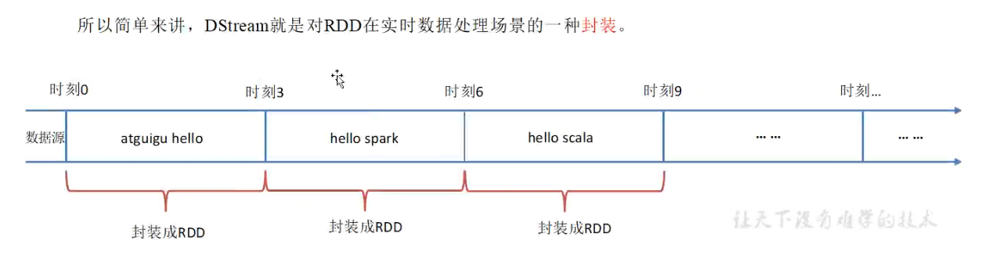

[toc]

# Spark笔记1

当前使用Spark版本为： spark-3.5.1

## Spark SQL 结构化数据处理模块

> 什么是Spark SQL？

Spark SQL 是 Apache Spark 中的一个模块，主要针对结构化数据处理。它提供了用于处理结构化数据的高级抽象和工具，使得开发人员可以使用 SQL 或类似 SQL 的语言（如DataFrame API 和 Dataset API）来查询和分析数据。  

<font color="red">Spark SQL本质上是对RDD的封装。RDD，DataFrame，Dataset都是Spark平台下的分布式弹性数据集，为处理超大型数据提供便利。</font>

> Spark SQL的主要功能和特性如下
1. SQL接口: 允许用户通过标准的 SQL 查询语言来查询数据。
2. 优化器和执行引擎: Spark SQL 引入了 Catalyst 优化器和 Tungsten 执行引擎，能够在查询执行之前优化逻辑计划并生成高效的物理执行计划。
3. 数据源集成: 支持多种数据源，包括 Hive、Parquet、JSON、JDBC 等。可以直接在这些数据源上使用Spark SQL 进行数据操作。
4. 与其他 Spark 组件的集成: Spark SQL 与 Spark 的其他核心组件（如 Spark Core、Spark Streaming、MLlib 等）紧密集成，可以与这些组件配合使用。
5. DataFrame API: DataFrame 可以看作是一张表，具有行和列的概念。可以通过DataFrame API将非结构化数据转换为结构化数据。
6. Dataset API: 类似于 DataFrame，但具有类型安全性，支持更复杂的数据结构和操作。


> Spark SQL 和 RDD 的区别

1. Spark SQL是建立在RDD之上的高级抽象，提供了用于结构化数据处理的API和工具。支持使用标准的SQL语言进行数据查询和分析。
2. 相比RDD，Spark SQL引入了优化器（Catalyst）和执行引擎（Tungsten），能够生成更高效的执行计划，从而提升查询性能。
3. RDD适合于需要精细控制和灵活性的数据处理场景，可以处理非结构化和半结构化的数据。Spark SQL更适合于结构化数据处理，适合于需要高性能查询和分析的应用场景。

总体来说，RDD提供了更底层和灵活的数据处理能力，适合于需要精细控制的复杂数据处理场景；而Spark SQL提供了更高级别的结构化数据处理抽象和优化能力，适合于大规模数据查询和分析。

在实际使用中，可以根据具体的数据处理需求和性能要求选择合适的API和抽象层次。


### Spark SQL的使用

> ① 添加依赖

```xml
<dependency>
    <groupId>org.apache.spark</groupId>
    <artifactId>spark-sql_2.12</artifactId>
    <version>3.5.1</version>
</dependency>
<!--下面是可选依赖，主要是为了解决程序无法运行的问题-->
<dependency>
    <groupId>org.slf4j</groupId>
    <artifactId>slf4j-nop</artifactId>
    <version>1.7.2</version>
</dependency>
```

> ② 准备一个json文本文件。内容如下所示

```json
{"id": "12121","name": "xiaoming","age": 12}
{"id": "12131","name": "xiaohei","age": 12}
{"id": "12145","name": "xiaosa","age": 23}
```

> ③ 代码如下

```java
package org.example;
import org.apache.spark.SparkConf;
import org.apache.spark.api.java.JavaRDD;
import org.apache.spark.api.java.JavaSparkContext;
import org.apache.spark.sql.Dataset;
import org.apache.spark.sql.Row;
import org.apache.spark.sql.SparkSession;

import java.util.Arrays;

public class SparkSQL01 {
    public static void main(String[] args) throws InterruptedException {
        //构建spark的会话对象
        SparkSession sparkSession = SparkSession
                .builder()
                .master("local[2]")   //使用两个线程
                .appName("mySparkSQL_App")
                .getOrCreate();

        //读取json文件数据，将其转换为Dataset<Row>数据。 RDD->Dataset
        Dataset<Row> ds = sparkSession.read().json("C:\\Users\\18271\\Desktop\\user.json");
        System.out.println("ds -----------");
        ds.show();

        //将Dataset<Row>数据 转换为视图，方便通过SQL进行处理。即将非结构化数据 -> 结构化数据
        //视图名称为user_json
        ds.createOrReplaceTempView("user_json");

        //编写sql语句并执行
        Dataset<Row> sqlds01 = sparkSession.sql("select * from user_json");
        //展示效果
        System.out.println("sqlds01 -----------");
        sqlds01.show();

        //编写sql语句并执行
        Dataset<Row> sqlds02 = sparkSession.sql("select name from user_json");
        //展示效果
        System.out.println("sqlds02 -----------");
        sqlds02.show();

        //暂停100s,在程序结束之前可以访问Spark的监控页面。
        Thread.sleep(1000000L);
        //关闭spark会话，释放资源
        sparkSession.close();
    }

}

//运行结果如下
// ds -----------
// +---+-----+--------+
// |age|   id|    name|
// +---+-----+--------+
// | 12|12121|xiaoming|
// | 12|12131| xiaohei|
// | 23|12145|  xiaosa|
// +---+-----+--------+

// sqlds01 -----------
// +---+-----+--------+
// |age|   id|    name|
// +---+-----+--------+
// | 12|12121|xiaoming|
// | 12|12131| xiaohei|
// | 23|12145|  xiaosa|
// +---+-----+--------+

// sqlds02 -----------
// +--------+
// |    name|
// +--------+
// |xiaoming|
// | xiaohei|
// |  xiaosa|
// +--------+

```

运行该程序需要设置JVM参数（）。需要在IDEA中对SparkSQL01.java程序添加JVM option。

类似的如图所示


参数如下
```
-XX:+IgnoreUnrecognizedVMOptions
--add-opens=java.base/java.lang=ALL-UNNAMED
--add-opens=java.base/java.lang.invoke=ALL-UNNAMED
--add-opens=java.base/java.lang.reflect=ALL-UNNAMED
--add-opens=java.base/java.io=ALL-UNNAMED
--add-opens=java.base/java.net=ALL-UNNAMED
--add-opens=java.base/java.nio=ALL-UNNAMED
--add-opens=java.base/java.util=ALL-UNNAMED
--add-opens=java.base/java.util.concurrent=ALL-UNNAMED
--add-opens=java.base/java.util.concurrent.atomic=ALL-UNNAMED
--add-opens=java.base/sun.nio.ch=ALL-UNNAMED
--add-opens=java.base/sun.nio.cs=ALL-UNNAMED
--add-opens=java.base/sun.security.action=ALL-UNNAMED
--add-opens=java.base/sun.util.calendar=ALL-UNNAMED
--add-opens=java.security.jgss/sun.security.krb5=ALL-UNNAMED
```

另外当程序在运行过程中的时候。我们可以访问`http://localhost:4040`可以看到Spark的监控页面。


### 自定义udf函数

在某些情况下，光靠SQL无法满足一些复杂的逻辑。因此Spark SQL提供了一种方式，可以在SQL中增加自定义的方法来实现复杂逻辑。这种自定义方法叫做udf函数。

注意：需要先把udf函数注册到spark中，才能在SQL中使用该函数。

<font color="red">注意：udf函数会对表格中的每行数据都进行单独处理。即每一行数据都使用一次udf函数。但是不会将每行数据进行聚合处理</font>

案例代码1如下。查询所有name的值，并给name值加上前缀。
```java
public class SparkSQL01 {
    public static void main(String[] args) throws InterruptedException {
        //构建spark的会话对象
        SparkSession sparkSession = SparkSession
                .builder()
                .master("local")   //使用两个线程
                .appName("mySparkSQL_App")
                .getOrCreate();

        //读取json文件数据，将其转换为Dataset<Row>数据。 RDD->Dataset
        Dataset<Row> ds = sparkSession.read().json("C:\\Users\\18271\\Desktop\\user.json");
        ds.createOrReplaceTempView("user_json");

        //编写sql语句并执行
        Dataset<Row> sqlds01 = sparkSession.sql("select * from user_json");
        //展示效果
        System.out.println("sqlds01 -----------");
        sqlds01.show();

        //注册一个udf函数到spark中
        //register方法需要有三个参数：函数名称，函数逻辑，函数返回值
        //UDF1<String, String>中 UDF1代表一个参数，并且第一个泛型代表参数类型，第二个泛型代表返回值类型
        sparkSession.udf().register("addPrefixName", new UDF1<String, String>() {
            @Override
            public String call(String s) throws Exception {
                //给输入的参数加上前缀
                return "PrefixName：" + s;
            }
        }, DataTypes.StringType);

        //编写sql语句并执行。查询所有name列的值，并通过addPrefixName函数进行处理
        Dataset<Row> sqlds02 = sparkSession.sql("select addPrefixName(name) from user_json");
        //展示效果
        System.out.println("sqlds02 -----------");
        sqlds02.show();

        //关闭spark会话，释放资源
        sparkSession.close();
    }

}

//运行结果如下
// sqlds01 -----------
// +---+-----+--------+
// |age|   id|    name|
// +---+-----+--------+
// | 12|12121|xiaoming|
// | 12|12131| xiaohei|
// | 23|12145|  xiaosa|
// +---+-----+--------+

// sqlds02 -----------
// +--------------------+
// | addPrefixName(name)|
// +--------------------+
// |PrefixName：xiaoming|
// | PrefixName：xiaohei|
// |  PrefixName：xiaosa|
// +--------------------+

```

### 自定义udaf函数

<font color="red">udaf函数相比udf函数会对表格中的每行数据进行聚合处理。即对所有行的数据进行处理，从而产生一个结果。</font>

Spark 3.x 版本推荐使用新建类，并继承 Aggregator类的方式来自定义udaf函数。

实现方式太麻烦，暂不写。

### SparkSQL的数据源

SparkSQL可以从多个不同的数据源上读取并加载数据到Spark中。

> csv文件

csv (Comma Separated Values)文件。是一种纯文本文件，用于存储表格和电子表格信息。内容通常是由文本、数字或日期组成的表格。使用将数据存储在表中的程序可以轻松导入和导出CSV文件。

① 准备一个csv文件。文件内容如下
```
id,name,age,address
1002,xiaoming,12,wuhan
1003,xiaohong,14,beijing
1005,xiaoqiang,11,guangzhou
```

csv文件通常能够被excel软件打开并编辑。下图是excel打开这个csv文件。


② 编写代码
```java
public class SparkSQL01 {
    public static void main(String[] args) throws InterruptedException {
        //构建spark的会话对象
        SparkSession sparkSession = SparkSession
                .builder()
                .master("local")   //使用两个线程
                .appName("mySparkSQL_App")
                .getOrCreate();

        //读取csv文件中每一行的内容，并将其转换为Dataset对象
        Dataset<Row> ds = sparkSession.read()
                .option("header",true)  //设置表头为true，表示csv文件的第一行数据为表头
                        .option("seq",",") //设置csv文件中的数据直接的分隔符为逗号（默认）。也可以设置为其他符号。
                        .csv("C:\\Users\\18271\\Desktop\\a.csv");
        //展示ds中的数据
        ds.show();

        //关闭spark会话，释放资源
        sparkSession.close();
    }
}
//运行结果
// +----+---------+---+---------+
// |  id|     name|age|  address|
// +----+---------+---+---------+
// |1002| xiaoming| 12|    wuhan|
// |1003| xiaohong| 14|  beijing|
// |1005|xiaoqiang| 11|guangzhou|
// +----+---------+---+---------+
```

> json文件

 ① 准备一个json文件。文件内容如下
```
{"id": "12121","name": "xiaoming","age": 12}
{"id": "12131","name": "xiaohei","age": 12}
{"id": "12145","name": "xiaosa","age": 23}
```

<font color="red">注意：这个文件中的每一行内容符合json格式，但是组合在一起不符合json文件的格式。因此这个json文件会报错。本质原因是SparkSQL是对RDD的封装，而RDD读取文件的方式是Hadoop的方式，即按行读取。</font>

② 编写代码
```java
public class SparkSQL01 {
    public static void main(String[] args) throws InterruptedException {
        //构建spark的会话对象
        SparkSession sparkSession = SparkSession
                .builder()
                .master("local")   //使用两个线程
                .appName("mySparkSQL_App")
                .getOrCreate();

        //读取json文件中每一行的内容，并将其转换为Dataset对象
        Dataset<Row> ds = sparkSession.read()
                .json("C:\\Users\\18271\\Desktop\\user.json");
        //展示ds中的数据
        ds.show();

        //关闭spark会话，释放资源
        sparkSession.close();
    }

}
//运行结果
// +---+-----+--------+
// |age|   id|    name|
// +---+-----+--------+
// | 12|12121|xiaoming|
// | 12|12131| xiaohei|
// | 23|12145|  xiaosa|
// +---+-----+--------+
```

> mysql数据库

① 导入mysql依赖

```java
public class SparkSQL01 {
    public static void main(String[] args) throws InterruptedException {
        //构建spark的会话对象
        SparkSession sparkSession = SparkSession
                .builder()
                .master("local")   //使用两个线程
                .appName("mySparkSQL_App")
                .getOrCreate();

        //设置访问数据库的用户名，密码
        Properties properties = new Properties();
        properties.setProperty("user","root");
        properties.setProperty("password","123456");

        //读取mysql中sys_user表的数据
        Dataset<Row> ds = sparkSession.read()
                .jdbc("jdbc:mysql://localhost:3306/shuyx_website_db","sys_user",properties);
        //展示ds中的数据
        ds.show();

        //把ds中的数据，保存到mysql中，新的表名为sys_user_test
        ds.write().jdbc("jdbc:mysql://localhost:3306/shuyx_website_db","sys_user_test",properties);

        //关闭spark会话，释放资源
        sparkSession.close();
    }
}
//运行结果
// +---+-------------+------+-----------+------+---------+--------+
// | id|        email|gender|      phone|status|user_name|password|
// +---+-------------+------+-----------+------+---------+--------+
// |  3|  xxx@xxx.com|     1|18265985698|     0| xiaohong|  1da2d1|
// |  4|1234@1234.com|     1|18265985698|     0| xiaohong|  1da2d1|
// |  5|1234@1234.com|     1|18265985698|     0| xiaohong|  1da2d1|
// |  6|1234@1234.com|     0|18265985698|     0| xiaohong|  1da2d1|
// |  7|1234@1234.com|     0|18265985698|     0| xiaohong|  456789|
// |  8|    aa@xx.com|     0|18265985698|     0|  xiaohei|  123456|
// +---+-------------+------+-----------+------+---------+--------+
```

如下所示是通过SparkSQL将数据保存到mysql数据库中。SparkSQL会创建新的表，给表头设置字段以及对于的数据类型。

对于字符串数据，其数据类型都设置为longtext。
```sql
CREATE TABLE `sys_user_test` (
  `id` bigint DEFAULT NULL,
  `email` longtext COLLATE utf8mb4_general_ci,
  `gender` longtext COLLATE utf8mb4_general_ci,
  `phone` longtext COLLATE utf8mb4_general_ci,
  `status` longtext COLLATE utf8mb4_general_ci,
  `user_name` longtext COLLATE utf8mb4_general_ci,
  `password` longtext COLLATE utf8mb4_general_ci
) ENGINE=InnoDB DEFAULT CHARSET=utf8mb4 COLLATE=utf8mb4_general_ci;
```

> Hive数据库

暂时不写


## Spark Streaming 实时数据处理模块

> 什么是实时数据处理？

- 实时数据处理是指数据处理的延迟以毫秒为单位。
- 准实时数据处理是指数据的处理的延迟以秒，分钟为单位。
- 离线数据处理是指数据的处理的延迟以小时，天为单位。

> 什么是Spark Streaming

Spark Streaming 是 Apache Spark 提供的一个组件模块,用于处理实时数据流。它允许开发者使用 Spark 的强大计算能力来处理连续的实时数据，而不是传统的静态数据集。

> Spark Streaming的功能和特性如下
1. 实时数据处理: Spark Streaming 可以从多种数据源（如 Kafka、Flume等）接收数据流，并以微批处理的方式进行实时计算和处理。
2. 灵活的数据操作: 支持对数据流进行复杂的数据操作，如窗口操作、状态管理等，使得开发者可以进行更复杂的实时分析和处理。
3. 与 Spark 生态的集成: 可以与 Spark 的各个组件模块等无缝集成。

> Spark Streaming的应用场景
- 实时数据分析和监控: 可以用于监控系统状态、实时报警、实时指标计算等。
- 实时数据清洗和转换: 可以对数据进行清洗、格式化、转换，使其适合后续的分析和存储。
- 实时推荐系统: 可以基于用户实时行为数据进行实时推荐。

> Spark Streaming的工作原理

Spark Streaming 将实时数据流划分为小的微批次，每个微批次都作为一个 RDD 来处理。并且 Spark Streaming 运行在 Spark 的集群上，因此每个微批次的数据会被分布式处理，最终生成的结果可以存储到文件系统、数据库或输出到外部系统。

因此 Spark Streaming 提供了一个强大的框架和工具集，使得开发者能够高效地处理和分析实时数据流，从而在实时数据处理领域提供了广泛的应用可能性。

> Spark Streaming的架构图


### DStream 

Apache Spark Streaming中的DStream（Discretized Stream，离散化流）是一种高级抽象类。主要用于处理实时数据流。

在DStream的内部，每个时间区间内收到的数据都会转换为RDD存在，而DStream就是由这些RDD组成的数据流。

并且 DStream 可以从各个数据源（如Kafka、Flume、Kinesis等）中获取数据，并根据时间区间将其切分成一个个RDD。每个RDD包含特定时间段（默认为3秒）内接收到的数据。

如图所示


> DStream类提供了一系列方法，用于对实时数据流进行操作和转换。

1. 基本转换操作：
    - map(func)：对DStream中的每个元素应用函数func，生成一个新的DStream。
    - flatMap(func)：对DStream中的每个元素应用函数func，将每个元素映射为多个元素，生成一个新的DStream。
    - filter(func)：对DStream中的每个元素应用函数func，返回结果为true的元素，生成一个新的DStream。
    - reduce(func)：对DStream中的元素应用函数func进行聚合操作，生成一个新的DStream。

2. 输出操作：
    - foreachRDD(func)：对DStream中的每个RDD应用函数func，可以用来将RDD中的数据写入外部系统或执行自定义的操作。
    - saveAsTextFiles(prefix)：将DStream中的数据保存为文本文件。
    - print(): 打印DStream中的数据，通常用于开发或调试。
3. 窗口操作：
    - window(windowLength, slideInterval)：定义一个滑动窗口来对DStream中的数据进行处理。windowLength表示窗口的长度（以时间单位表示），slideInterval表示窗口之间滑动的时间间隔。
4. 状态操作：
    - updateStateByKey(func)：通过给定的状态更新函数func，为每个键（key）维护一个状态，用来跨批次执行状态管理。
5. 连接操作：
    - union(otherStream)：将当前DStream与另一个DStream连接起来，生成一个新的DStream，包含两个DStream的数据。
6. 输入源操作：
    - transform(func)：使用给定的函数func转换DStream中的数据，func接收原始DStream并返回新的DStream。
7. 停止操作：
    - stop()：停止接收新数据，并停止处理现有数据。

<font color="red">注意：这些方法看起来是处理整个DStream流，但是每个DStream流的内部是由许多RDD批次组成的，因此这些方法实际上是处理到每个RDD的。</font>

### Spark Streaming的使用

> ① 添加依赖

```xml
<dependency>
    <groupId>org.apache.spark</groupId>
    <artifactId>spark-streaming_2.12</artifactId>
    <version>3.5.1</version>
</dependency>
<!--下面是可选依赖，主要是为了解决程序无法运行的问题-->
<dependency>
    <groupId>org.slf4j</groupId>
    <artifactId>slf4j-nop</artifactId>
    <version>1.7.2</version>
</dependency>
```

> ② 代码如下

```java
import org.apache.spark.SparkConf;
import org.apache.spark.streaming.Duration;
import org.apache.spark.streaming.api.java.JavaStreamingContext;

public class SparkStreaming01 {
    public static void main(String[] args) throws InterruptedException {
        //配置spark
        SparkConf sparkConf = new SparkConf();
        sparkConf.setMaster("local");
        sparkConf.setAppName("mySparkStreaming_App");
        //创建Spark Streaming 上下文对象，3秒为一个周期
        JavaStreamingContext jsc = new JavaStreamingContext(sparkConf,new Duration(3*1000L));

        //启动数据采集器
        jsc.start();

        //等待数据采集器的结束，如果数据采集器停止运行，则main线程会执行后面的代码。（若后面无代码，则main线程停止运行）
        jsc.awaitTermination();
    }

}

```

运行该程序需要设置JVM参数（）。需要在IDEA中对SparkStreaming01.java程序添加JVM option。

类似的如图所示


参数如下
```
-XX:+IgnoreUnrecognizedVMOptions
--add-opens=java.base/java.lang=ALL-UNNAMED
--add-opens=java.base/java.lang.invoke=ALL-UNNAMED
--add-opens=java.base/java.lang.reflect=ALL-UNNAMED
--add-opens=java.base/java.io=ALL-UNNAMED
--add-opens=java.base/java.net=ALL-UNNAMED
--add-opens=java.base/java.nio=ALL-UNNAMED
--add-opens=java.base/java.util=ALL-UNNAMED
--add-opens=java.base/java.util.concurrent=ALL-UNNAMED
--add-opens=java.base/java.util.concurrent.atomic=ALL-UNNAMED
--add-opens=java.base/sun.nio.ch=ALL-UNNAMED
--add-opens=java.base/sun.nio.cs=ALL-UNNAMED
--add-opens=java.base/sun.security.action=ALL-UNNAMED
--add-opens=java.base/sun.util.calendar=ALL-UNNAMED
--add-opens=java.security.jgss/sun.security.krb5=ALL-UNNAMED
```

### Socket网络数据流处理

使用Spark Streaming去处理网络数据流Socket。每3秒从网络数据流中获取数据，转换为数据模型，并进行计算处理。

```java
public class SparkStereaming01 {
    public static void main(String[] args) throws InterruptedException {
        //配置spark
        SparkConf sparkConf = new SparkConf();
        sparkConf.setMaster("local");
        sparkConf.setAppName("mySparkStreaming_App");

        //设置spark Streaming 上下文 每3秒为一个周期
        JavaStreamingContext jsc = new JavaStreamingContext(sparkConf,new Duration(3*1000));

        //监听 localhost:8080 的网络数据流socket，转换为数据模型
        JavaReceiverInputDStream<String> socketDs = jsc.socketTextStream("localhost", 8080);
        //将数据模型中的数据打印出来
        socketDs.print();

        //启动数据采集器
        jsc.start();

        //等待数据采集器的结束，如果数据采集器停止运行，则main线程会执行后面的代码。（若后面无代码，则main线程停止运行）
        jsc.awaitTermination();

    }
}

//运行结果,每3秒监听一次
// -------------------------------------------
// Time: 1721698266000 ms
// -------------------------------------------

// -------------------------------------------
// Time: 1721698269000 ms
// -------------------------------------------

// -------------------------------------------
// Time: 1721698272000 ms
// -------------------------------------------
// .......

```
