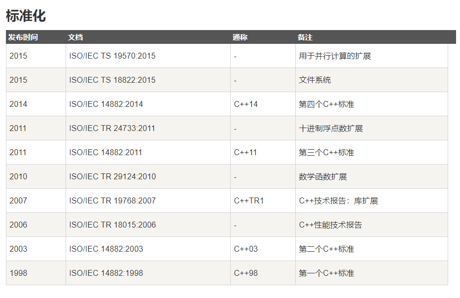
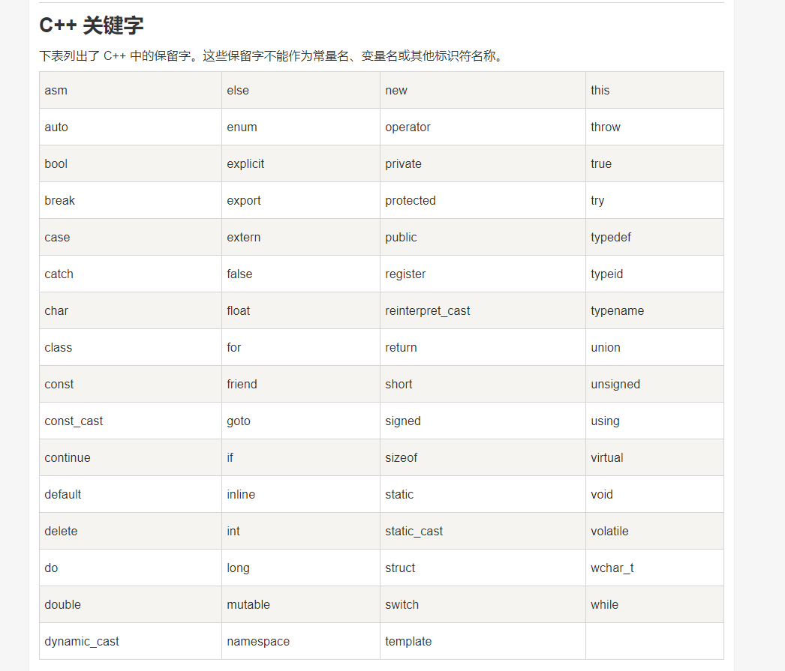
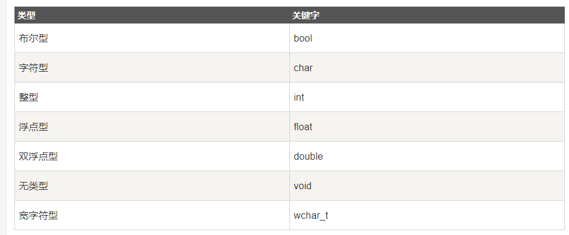
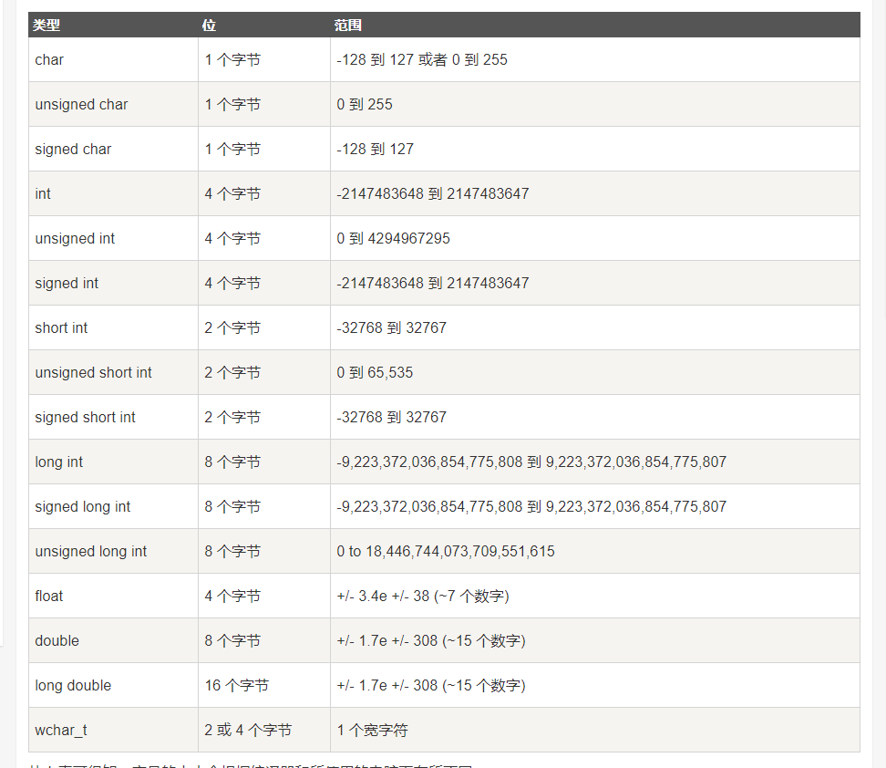
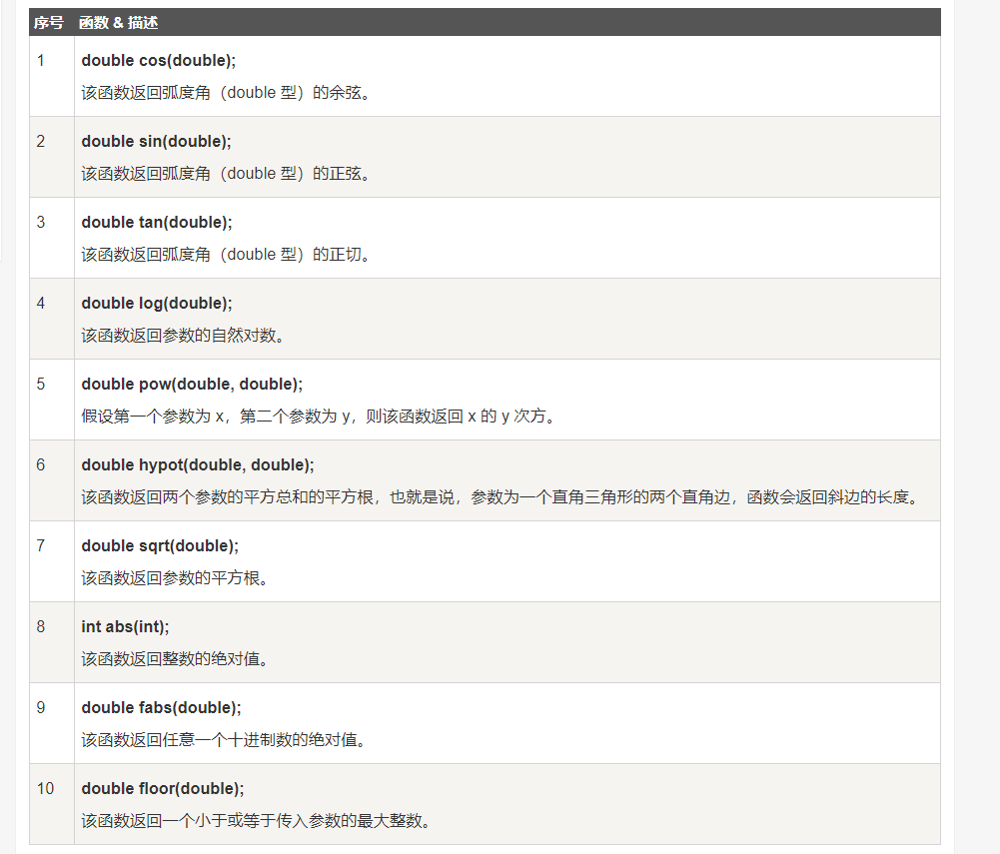
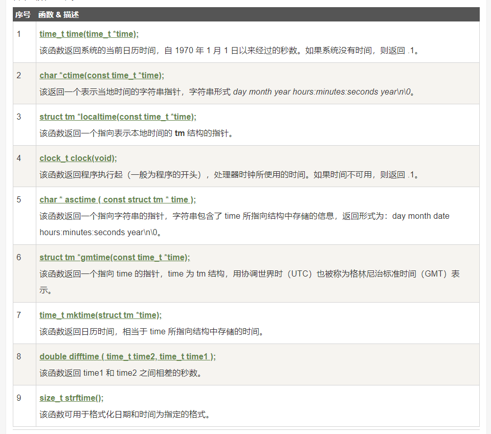
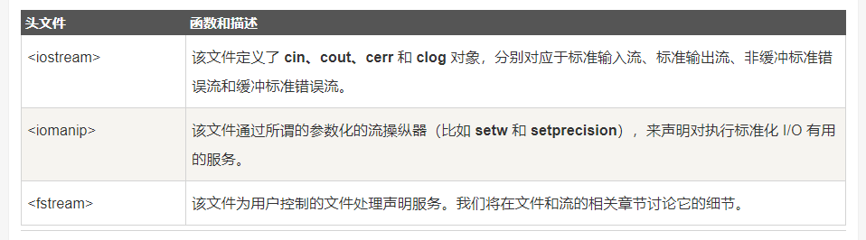

# C++基础（主要编写C++特有的，不同与C语言的部分）

资料来源：[菜鸟教程](http://www.runoob.com/cplusplus/cpp-tutorial.html)

<font color="red">!!! 建议先看C语言</font>

## 1. 概述：

C++ 进一步扩充和完善了 C 语言，是一种面向对象的程序设计语言。
C++ 是 C 的一个超集，事实上，<font color="red">任何合法的 C 程序都是合法的 C++ 程序。</font>

> C++ 完全支持面向对象的程序设计，包括面向对象开发的四大特性：封装,抽象,继承,多态.




## 2. 基本语法：

### 1.第一个C++程序:

```c
#include <iostream>
using namespace std;
 
// main() 是程序开始执行的地方
 
int main()
{
   cout << "Hello World"; // 输出 Hello World
   return 0;
}
```

> 讲解程序：
> 头文件 iostream : 头文件包含了程序中必需的或有用的信息
>  using namespace std; 告诉编译器使用 std 命名空间。
>  cout `<<` "Hello World"; 打印输出语句。
>  return 0; 终止 main( )函数，并向调用进程返回值 0。
> 在 C++ 中，分号是语句结束符。也就是说，每个语句必须以分号结束。它表明一个逻辑实体的结束。
> **C++ 是区分大小写的编程语言**

### 2. C++ 标识符:

标识符是用来标识变量、函数、类、模块，或任何其他用户自定义项目的名称。
**一个标识符以字母 A-Z 或 a-z 或下划线 _ 开始，后跟零个或多个字母、下划线和数字（0-9）。**

<font color="red">C++ 标识符内不允许出现标点字符，比如 @、& 和 %</font>




### 3.注释：

与C语言注释一样。

### 4.数据类型：

七种基本的 C++ 数据类型：


<font color="red">部分变量类型：</font>



## 3. Lambda 函数与表达式：

C++11 提供了对匿名函数的支持,称为 Lambda 函数(也叫 Lambda 表达式)。

<font color="red">Lambda 表达式把函数看作对象。比如可以将它们赋给变量和作为参数传递，还可以像函数一样对其求值。</font>

完整格式：

```c
[capture](parameters) mutable ->return-type{statement}
```

> [capture] 捕捉列表: 能够捕捉上下文中的变量以供Lambda函数使用;
> **[ ]是Lambda引出符。编译器根据该引出符判断接下来的代码是否是Lambda函数**
> (parameters)：形参列表。
> mutable修饰符: 在使用该修饰符时，参数列表不可省略（即使参数为空）;
> ->return-type：返回类型。用于追踪返回类型形式声明函数的返回类型。
> {statement}：函数体。内容与普通函数一样，不过除了可以使用参数之外，<font color="blue">还可以使用所有捕获的变量。</font>

例如：

```c
[](int x, int y) -> int { int z = x + y; return z + x; }
```

## 4. C++数字：

### 1. 定义数字：

```c
 // 数字定义
   short  s;
   int    i;
   long   l;
   float  f;
   double d;
```

### 2. 数学运算：

**引用数学头文件 &lt;cmath&gt;**




## 5. C++ 中的 String 类:

**引入  &lt; string &gt; 头文件**

DEMO：
```c
#include <iostream>
#include <string>
using namespace std;
int main ()
{
   string str1 = "Hello";
   string str2 = "World";
   string str3;
   int  len ;
   // 复制 str1 到 str3
   str3 = str1;
   cout << "str3 : " << str3 << endl;
   // 连接 str1 和 str2
   str3 = str1 + str2;
   cout << "str1 + str2 : " << str3 << endl;
   // 连接后，str3 的总长度
   len = str3.size();
   cout << "str3.size() :  " << len << endl;
   return 0;
}
```

### 1. 把一串数字组成的字符串，对其中的数字进行求和（★★★）

<h3>DEMO</h3>

```c
string n;
int sum=0;     //n的各个位数之和
cin>>"shu ru n: ">>n;	
for(int i=0;i<n.size();i++){
	sum = sum+n[i]-'0' ;		//sum是n的各个数之和 
}
cout<<"sum is "<<sum
```

运行结果：
```
shu ru n: 123456789
sum is 45
```

## 6. C++ 引用：

**引用变量是一个别名,一旦把引用初始化为某个变量，就可以使用该引用名称或变量名称来指向变量。**

### 1. 引用与指针的区别：

1. 不存在空引用。引用必须连接到一块合法的内存。可以存在Null指针。
2. 一旦引用被初始化为一个对象，就不能被指向到另一个对象。指针可以在任何时候指向到另一个对象。
3. 引用必须在创建时被初始化。指针可以在任何时间被初始化。

### 2. 创建引用：

```c
int i = 17;
int&  r = i;   //& 读作引用
```

DEMO:
```c
#include <iostream>
using namespace std;
int main ()
{
   // 声明简单的变量
   int    i;
   double d;
   // 声明引用变量
   int&    r = i;
   double& s = d;
   i = 5;
   cout << "Value of i : " << i << endl;
   cout << "Value of i reference : " << r  << endl;
   d = 11.7;
   cout << "Value of d : " << d << endl;
   cout << "Value of d reference : " << s  << endl;
   return 0;
}
```

### 3. 把引用作为函数参数:

C++ 支持把引用作为参数传给函数，这比传一般的参数更安全。

DEMO:
```c
// 函数声明
void swap(int& x, int& y);
// 函数定义
void swap(int& x, int& y)
{
   int temp;
   temp = x; /* 保存地址 x 的值 */
   x = y;    /* 把 y 赋值给 x */
   y = temp; /* 把 x 赋值给 y  */
   return;
}
```


### 4. 把引用作为函数返回值：

当函数返回一个引用时，则返回一个指向返回值的隐式指针。这样，函数就可以放在赋值语句的左边。
<font color="red">当返回一个引用时，要注意被引用的对象不能超出作用域。</font>

DEMO:
```c
double vals[] = {10.1, 12.6, 33.1, 24.1, 50.0};
double& setValues( int i )
{
  return vals[i];   // 返回第 i 个元素的引用
}
// 要调用上面定义函数的主函数
int main ()
{
   cout << "改变前的值" << endl;
   for ( int i = 0; i < 5; i++ )
   {
       cout << "vals[" << i << "] = ";
       cout << vals[i] << endl;
   }
   setValues(1) = 20.23; // 改变第 2 个元素
   setValues(3) = 70.8;  // 改变第 4 个元素
   cout << "改变后的值" << endl;
   for ( int i = 0; i < 5; i++ )
   {
       cout << "vals[" << i << "] = ";
       cout << vals[i] << endl;
   }
   return 0;
}
```

运行结果：
```
改变前的值
vals[0] = 10.1
vals[1] = 12.6
vals[2] = 33.1
vals[3] = 24.1
vals[4] = 50
改变后的值
vals[0] = 10.1
vals[1] = 20.23
vals[2] = 33.1
vals[3] = 70.8
vals[4] = 50
```

## 7. 日期 & 时间:

引用头文件 &lt;ctime&gt;

<font color="red">关于日期和时间的重要函数:</font>



## 8. 基本的输入输出:

**I/O 库头文件:**



### 1. 标准输出流（cout）：

cout 是 iostream 类的一个实例，cout 是与流插入运算符 `<<` 结合使用的。

<font color="red">endl 用于在行末添加一个换行符 \n </font>

```c
cout << "Value of str is : " << str << endl;
```

### 2. 标准输入流（cin）:

cin 是 iostream 类的一个实例。cin 是与流提取运算符 >> 结合使用的

```c
cout << "请输入您的名称： ";
```

<font color="red">运算符 >> 在一个语句中可以多次使用:</font>

```c
cin >> name >> age;    //相当于下面两个语句
cin >> name;
cin >> age;
```


## 9. 命名空间:

命名空间: 用来区分不同库中相同名称的函数、类、变量等。
<font color="red">使用了命名空间即定义了上下文。本质上，命名空间就是定义了一个范围。</font>

### 1. 定义命名空间：

```c
namespace namespace_name {
   // 代码声明
}
```

<font color="blue">调用带有命名空间的函数或变量，需要在前面加上命名空间的名称:</font>

```c
namespace_name::code;  // code 可以是变量或函数
```

DEMO:
```c
#include <iostream>
using namespace std;
// 第一个命名空间
namespace first_space{
   void func(){
      cout << "Inside first_space" << endl;
   }
}
// 第二个命名空间
namespace second_space{
   void func(){
      cout << "Inside second_space" << endl;
   }
}
int main ()
{
   // 调用第一个命名空间中的函数
   first_space::func();
   // 调用第二个命名空间中的函数
   second_space::func(); 
   return 0;
}

```

运行结果：
```
Inside first_space
Inside second_space
```


### 2. using 指令

可以使用 using namespace 指令，这样在使用命名空间时就可以不用在前面加上命名空间的名称。
这个指令会告诉编译器，后续的代码将使用指定的命名空间中的名称。

DEMO:
```c
#include <iostream>
using namespace std;
namespace first_space{
   void func(){
      cout << "Inside first_space" << endl;
   }
}

using namespace first_space;
int main ()
{
   // 调用第一个命名空间中的函数
   func();
   return 0;
}
```

运行结果：
```
Inside first_space
```


### 3. 嵌套的命名空间:

命名空间可以嵌套，可以在一个命名空间中定义另一个命名空间
```c
namespace namespace_name1 {
   // 代码声明
   namespace namespace_name2 {
      // 代码声明
   }
}
```

```c
// 访问 namespace_name2 中的成员
using namespace namespace_name1::namespace_name2;
// 访问 namespace:name1 中的成员
using namespace namespace_name1;
```


## 10. 栈的用法:

**使用栈，要先包含头文件： #include&lt;stack&gt;**

栈的定义：
```c
stack <int>stk;        //整型栈
stack <string>stk;     //字符串栈
```

栈的基本方法：
```c
s.push(item);		//将item压入栈顶
s.pop();			//删除栈顶的元素，但不会返回该元素
s.top();			//返回栈顶的元素，但不会删除
s.size();			//返回栈中元素的个数
s.empty();			//检查栈是否为空，如果为空返回true，否则返回false 
```

<h3>PAT算法举例-说反话</h3>

>输入例子:
Hello World Here I Come
>输出例子:
Come I Here World Hello

```c
#include <iostream>
#include <string>
#include<stack>    //引入栈的数据结构
using namespace std;
int main()
{
	string str;       //字符串变量
	int a;           //记录栈内元素个数
	stack<string> stk;
	do{
		cin>>str;                //使用cin从键盘输入字符串时，读取到空格就断开
		stk.push(str);
	}while(cin.get()!='\n');     //读入回车符，停止while循环
	a=stk.size();               //栈内元素个数
	for(int i=0;i<a-1;i++){     //除了栈底元素，其余元素全部输出，后面有空格
		cout<<stk.top()<<" ";
		stk.pop();             //移除栈顶元素，让下一个元素变成栈顶
	}
	cout<<stk.top();           //输出最后一个栈底元素，后面没有空格
return 0;
}
```