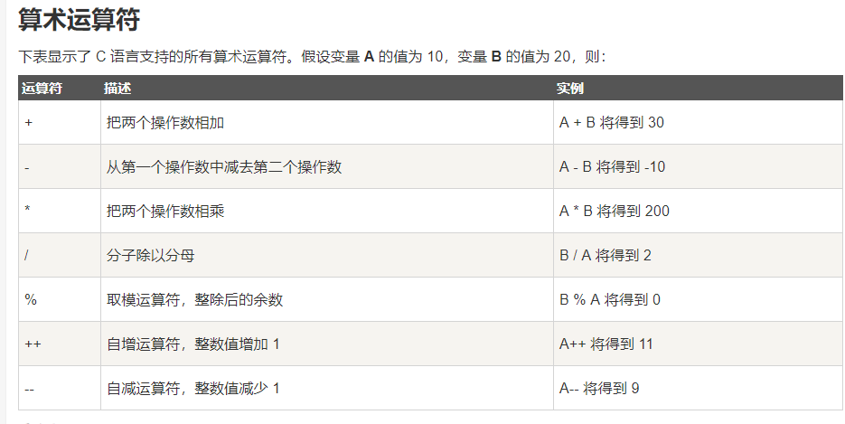
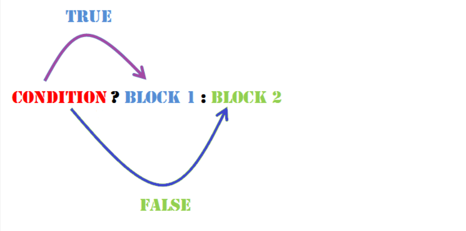

# C语言基础

## 0.关于计算机程序的简单介绍：

### 1.什么是计算机程序：

<font color="red">是计算机能识别和执行的一系列指令！</font>

### 2.什么是计算机语言：

<font color="red">

1. 计算机和人都能识别的语言。
2. 计算机语言的发展阶段：
    1. 机器语言阶段：由计算机能识别和接受的机器指令组成，机器指令由一些二进制代码组成。
    2. 汇编语言（低级语言）阶段：用一些英文字母与数字表示一个指令，例如：‘ADD’表示加法。难以普及。
    3. 高级语言阶段：由人使用的自然语言与数学语言组成。

</font>

### 3.什么是编译：

<font color="red">

把源程序（高级语言编写的程序）------> 目标程序（机器指令程序）

</font>


### 4.高级语言经历的不同阶段：

<font color="red">

1. 非结构化语言阶段：
    编程风格随意，只要符合语法规则即可。没有严格的规范，程序流程可以随意跳转。在后期，使得程序难以阅读和维护。
2. 结构化语言阶段：
    规定程序由良好的基本数据结构组成，程序流程不许随意跳转，程序从上往下执行程序。
    这是基于面向过程的语言，编写程序需要具体到每一个细节。缺点是，当编写大规模程序时，无法得心应手。
3. 面向对象语言阶段：
    将现实世界的事物抽象成对象，现实世界中的关系抽象成类、继承，帮助人们实现对现实世界的抽象与数字建模。通过面向对象的方法，更利于用人理解的方式对复杂系统进行分析、设计与编程。

</font>

## 1.介绍与C编译器：

C语言是一门面向过程的计算机编程语言,与C++，Java等面向对象的编程语言有所不同。

### 1.C 编译器：
源代码是人类可读的代码，它需要"被编译"，转为机器语言，这样 CPU 可以按给定的机器语言指令执行程序。
**C 语言编译器用于把源代码编译成最终的可执行程序。**

## 2.第一个hello world：

①：创建hello.cpp文件：

<font color="red">
注意：.c后缀是C语言的源程序文件，.cpp后缀是C++语言的源程序文件。c++兼容c语言的绝大部分语法特性。
</font>

hello.cpp
```c
#include <stdio.h>     // #include <stdio.h> 是预处理器指令，告诉 C 编译器在实际编译之前要包含 stdio.h 文件。
int main()        //int main() 是主函数，程序从main函数开始执行。
{
    /*  这是一段注释 , 此处的内容会被编译器忽略. */
   printf("Hello, World! \n");   
   //printf(...) 是C中一个的函数，用于把内容打印到控制台上。
   //  \n ： 表示换行输出。
   return 0;    // return 0; 用于终止 main() 函数，并返回值 0。
}
```

<font color="red">
ps:

1. 每个C语言程序都必须有一个main函数。
2. `#include <stdio.h>`的作用是用来提供函数的声明与宏的定义。
3. “stdio.h”是系统提供的一个文件，里面存放了输入输出函数的相关信息。
4. ".h"的意思是指头文件。
5. 程序总是从main函数开始执行。
6. C语言本身不提供输入输出函数。scanf与printf函数是库函数，由`<stdio.h>`头文件提供。

</font>

②：编译 & 执行 C 程序：

> 当你执行程序后，您可以看到在控制台屏幕上显示 "Hello World".

## 2-5. 算法的简单介绍：

<font color="red">程序=算法+数据结构</font>

>数据结构：数据的类型和数据的组织形式。
>算法：计算机进行操作的步骤。

### 1.算法的特性：

1. 有穷性： 一个算法应包含有限的步骤，不能是无限的。
2. 确定性： 算法的每一个步骤都是确定的，不能是模糊的。
3. 有零个或多个输入： 输入指算法在运行过程中从外界获取的数据信息。
4. 有一个或多个输出： 算法得到的结果就是算法的输出，没有输出的算法是没有意义的。
5. 有效性：算法的每个步骤都是有效执行并得到确定的结果。


### 2.表示算法：

1. 用自然语言表示算法。
2. 用流程图表示算法。
3. 用三种基本结构表示算法：
    1. 顺序结构
    2. 选择结构
    3. 循环结构:分为 当型（while）循环结构，直到型（until）循环结构。
4. 用N-S流程图表示算法。
5. 用伪代码表示算法。
6. 用计算机语言表示算法。

## 3.基本语法：

### 1. 分号 ;

分号是语句结束符。也就是说，每个语句必须以分号结束。它表明一个逻辑实体的结束。

### 2. 注释:

注释是程序中的帮助文本，它们会被编译器忽略。
<font color="red">注意：在字符串中的“//”和“/* ...  */”，不是注释，只是作为字符串的一部分。</font>

①：单行注释：
```
//
```
②：多行注释：
```
/* ...  */
```

### 3.常量：
1. 常量是固定值，在程序执行期间不会改变，常量的值在定义后不能进行修改。
2. 常量可以是任何的基本数据类型。

①：定义常量：
在 C 中，有两种简单的定义常量的方式：
1. 使用 #define 预处理器。
2. 使用 const 关键字。

```c
#include <stdio.h>
#define A 10      //使用#define预处理器 定义一个常量 a,a的值为10 
#define B 5
int main()
{
   const int C = 20;     //用const关键字， 定义一个常量c,c的值为10 
   int s;  
   s = A * B;
   printf("value of s : %d", s);
   printf("\n");                       //换行 
   printf("value of C : %d", C);
   return 0;
}
```

<font color="red">

PS：
const 并不是去定义一个常量，而是去改变一个变量的存储类，把该变量所占的内存变为只读。

</font>

#### 1.整型常量：
整数常量可以是十进制、八进制或十六进制的常量。前缀指定基数：0x 或 0X 表示十六进制，0 表示八进制，不带前缀则默认表示十进制。

DEMO:
```c
85         /* 十进制 */
0213       /* 八进制 */
0x4b       /* 十六进制 */
30         /* 整数 */
30u        /* 无符号整数 , u 表示无符号整数（unsigned）*/
30l        /* 长整数  , l 表示长整数（long）*/
30ul       /* 无符号长整数 */

```

#### 1-5：实型常量：

    由十进制小数与指数形式组成。如：123.234 或 12.34e3(代表12.34*10*10*10)


#### 2.浮点常量:
浮点常量由整数部分、小数点、小数部分和指数部分组成。
DEMO：
```c
3.14159       /* 合法的 */
314159E-5L    /* 合法的 */
510E          /* 非法的：不完整的指数 */
210f          /* 非法的：没有小数或指数 */
.e55          /* 非法的：缺少整数或分数 */
```

#### 3.字符常量(单个字符):
1. 字符常量是括在单引号中，例如，'x' 可以存储在 char 类型的简单变量中。
2. 字符常量也可以是一个转义字符（例如 '\t'）。

<font color="red">转义字符：表示把 “\”后面的字符转换为其他的意义。例如：“\n”中的n代表换行符。 </font>


#### 4.字符串常量（多个字符）：
字符串字面值或常量是括在双引号 " " 中的。例如：“123”，“boy”等


#### 5. 符号常量：

用#define指令，指定一个符号名称代表一个常量。

`# define PI 3.14  `
表示程序中的PI都代表3.14。


### 4.变量★★★：

1. 变量是程序可操作的存储单元的名称（使用变量好记忆）。每个变量都有特定的数据类型，类型决定了变量存储的大小和布局。
2. 在程序运行期间变量的值可改变。
3.  变量必须先定义，后使用。
4. 变量名实际是一个名字，代表一个存储地址。
5. <font color="red">从变量中取值，实际是通过变量名找到相应的内存地址，从那个地址中读取数据。</font>

<font color="red">变量的名称可以由字母、数字和下划线字符组成。它必须以字母或下划线开头。大写字母和小写字母是不同的，因为 C 是大小写敏感的。</font>

①：变量定义：
变量定义就是告诉编译器在何处创建变量的存储，以及如何通过数据类型创建变量的存储大小。

②：变量初始化：
变量可以在声明的时候被初始化（指定一个初始值）。

<font color="red">注：若变量没有初始化，则变量值根据数据类型的不同，而不同。为0或null或未定义</font>


```c
int    i, j, k;   //此处定义一个int类型变量i,j,k。 
char   c, ch;
float  f, salary;   
double d;  
int b=10;    //定义一个变量b，并初始化为 10（在b的存储空间存放数据10）
```

### 5. 标识符

标识符是用来标识变量、函数，或任何其他用户自定义的名称。

C语言规定一个标识符只能以字母,数字,下划线组成，并且第一个字符必须是字母或下划线。

<font color="red">
C 是区分大小写的编程语言。因此，在 C 中，M和m是两个不同的标识符。
</font>


### 6.数据类型：

**数据类型就是对数据分配存储单元的安排，包括存储单元的长度（占多少字节）以及数据的存储形式。**

```
数据类型分为：
1. 基本类型：
   1. 整型类型：
      1.int （基本整型）
      2.short int 或 short （短整型） 
      3.长整型： long int 或long
      4.双长整型（C99新增加的） long long int
      5.字符型： char
      6.布尔型（C99新增加的） bool
   
   2. 浮点类型：
      1. 单精度浮点型：float
      2. 双精度浮点型：double

2. 枚举类型（enum）与空类型（void）

3. 派生类型：
   1.指针类型：*
   2.数组类型：[]
   3.结构体类型： struct
   4.共用体类型： union
   5.函数类型。
```

①：整数类型：


<font color="red">

1. 在C++中，int类型占4个字节（32位）
2. 双长整型long long占8个字节，这是C99新增加的类型。
3. sizeof 是测量类型或变量长度的函数。
    `sizeof(short) << sizeof(int) << sizeof(long) << sizeof(long long)`

</font>


②：浮点类型：
浮点型数据是具有小数点的实数。实数是以指数的形式存在在存储单元中，它的小数点位置可以变动，所以实数的指数形式称为浮点数。


<font color="red">注意：1. 在C++中，long double 类型占8个字节（64位）</font>

③：void 类型：


④：字符型数据：
大多数系统采用ASCII字符集，其包括127个字符。

<font color="red">

注意：
1. 字符1 与 整数1 是不同的概念。字符1表示形为‘1’的符号。
2. 字符在内存中以ASCII码的形式存储，占1个字节。
3. 整数是以整数的方式存储，占4个字节。

</font>


### 7.运算符：

运算符是一种告诉编译器执行特定的数学或逻辑操作的符号。

#### ①：算术运算符：



<font color="blue">

注意：
1. 若除数或被除数中有一个负值，则结果是不一致的。
例如：-5/3 有的系统中结果为-2，有的系统结果为-1.
2. 在C++中，采用向零靠拢的方式。-5/3 结果就是-1

</font>


<font color="red">

a++,a-- 与 ++a,--a 的区别：
1. a++,a-- ：在使用a之后，把a的值加1或减1
2. ++a,--a : 在使用a之前，把a的值加1或减1

</font>

```c
#include <stdio.h>
int main()
{
   int c;
   int a = 10;
   printf(" a的初始值是 10 \n");
   printf(" a++,a-- 是先赋值后运算：\n");

   c = a++; 
   printf(" c = a++ 的c值是 %d\n", c );
   printf(" a 的值是 %d\n", a );
   
   a = 10;
   c = a--; 
   printf(" c = a-- 的c值是 %d\n", c );
   printf(" a 的值是 %d\n", a );

   printf("++a ,--a 是先运算后赋值：\n");
   a = 10;
   c = ++a; 
   printf(" c = ++a 的c值是 %d\n", c );
   printf(" a 的值是 %d\n", a );
   
   a = 10;
   c = --a; 
   printf("  c = --a 的c值是 %d\n", c );
   printf(" a 的值是 %d\n", a );
}
```


#### ②：关系运算符:
假设变量 A 的值为 10，变量 B 的值为 20，则：


<font color="red">

优先级别：
1. `>,<,<=,>=`之间优先级相同
2. "==,!="之间优先级相同
3.  1的优先级 > 2的优先级。
4. ==算法运算符 > 关系运算符 > 赋值运算符==

</font>

#### ③：逻辑运算符：

假设变量 A 的值为 1，变量 B 的值为 0，则：


#### ④：赋值运算符：


<font color="red">

注意：
1. 赋值运算符是从右-左的方式运算。
2. a=b=5 等价于 a=(b=5)

</font>

#### ⑤：杂项运算符：


DEMO:
```c
#include <stdio.h>
int main()
{
   int a;
   int b;

   /* 三元运算符实例 */
   a = 10;
   b = (a == 1) ? 20: 30;
   printf( "b 的值是 %d\n", b );    //b 的值是 30
 
   b = (a == 10) ? 20: 30;
   printf( "b 的值是 %d\n", b );   //b 的值是 20
}
```

#### ⑥：C 中的运算符优先级（下图是从高到低排列）：

运算符的优先级确定表达式的组合。这会影响到一个表达式如何计算。

<font color="blue">

在表达式求值时：
1. 先按运算符优先级别。
2. 若两侧优先级别相同，则先左后右。

</font>


#### ⑦：不同类型数据的混合运算：

如果一个运算符两侧的数据类型不同，则会先转换为相同的数据类型，在进行运算。

<font color="blue">

规律
1. int,float --> double
2. char字符类型会把其的ASCII码转换为double或int，在进行运算。char --> double 或 int 

</font>

#### ⑧. 类型转换:

##### 1.赋值过程的类型转换：

转换规则：

1. 浮点数--> 整型 ： 舍弃小数部分，在转换为整型。
2. 整型--> 浮点数 ： 数值不变，但以浮点数形式存储。如：23-> 23.0
3. double --> float : 整数部分不变，小数部分只取6-7位。如：123.22111131222222 -> 123.221111
4. 字符型 --> 整型 : 把字符的ASCII的码赋值给整型。

##### 2.强制类型转换：

强制类型转换是把变量从一种数据类型转换为另一种数据类型。

语法：
```c
(type_name) expression
```

例如：
```
double(a);   //把a转换为double类型
int(x+y);    
(float)(5%3);
```

DEMO:
```c
#include <stdio.h>

main()
{
   int sum = 17, count = 5;
   double mean;

   mean = (double) sum / count;   //int类型的sum被强转为double类型
   printf("Value of mean : %f\n", mean );
}
```


### 8. 格式字符与输入输出函数：

格式字符：


<font color="red">

注意:
1. %f  : 用来输出或读取float。
2. %lf : 用来输出或读取double。
3. %m.nf : 指定数据宽度与小数位数。表示指定数据占m列，其中小数部分占n列。如："%7.2f" 表示保留两位小数，对小数点后第三位四舍五入。

</font>

#### 1. 格式输出函数： scanf()函数 与 printf() 函数:

> scanf()函数: 从<font color="red">键盘读取输入的数据.</font>
> printf()函数: <font color="red">函数把输出的数据写入到标准输出流屏幕。</font>

DEMO:

**执行 scanf()函数，printf() 函数需要 stdio.h 头文件（标准输入输出头文件)）**
```c
#include <stdio.h>    // 执行 printf() 函数需要该库
int main( ) {
   int i;
   printf( "Enter a value :");
   scanf("%d", &i);   //表示scanf函数输入3个数据到地址为&i的内存单元
   printf( "\nYou entered:%d ",i);  
   printf("\n");
   return 0;
}
```

**在读取字符串时，只要遇到一个空格，scanf()函数就会停止读取，所以 "this is test" 对 scanf() 来说是三个字符串。**

<font color="red">

注意:
1. &i : &为取地址符，&i表示变量i在内存的地址。

</font>


#### 2. 字符串输入输出函数 --- gets()函数 与 puts() 函数：

> gets() 函数： 键盘读取数据，直到读到一个终止符或 EOF，就停止读取。
> puts() 函数：把字符串或字符数组中的内容写入到屏幕上。

DEMO：
```c
#include <stdio.h>
 
int main( )
{
   char str[100];
   printf( "Enter a value :");
   gets( str );         //从键盘读取数据，并写入到str中
   printf( "\nYou entered: ");
   puts( str );         //把str的数据写入到屏幕中。
   return 0;
}
```

#### 3. 单个字符输入输出函数：putchar() , getchar() :

```c
#include <stdio.h>
int main(void){	
    char ch;	
    while ((ch = getchar()) != '#')		
        putchar(ch);            //putchar（）用来显示参数所表示字符	
    return 0;
}

```

<font color="red">

注意:
1. getchar()函数只能接受一个字符，若想输入多个字符要用多个getchar函数。
2. putchar(ch)函数作用是输出字符ch的值，只能输出单个字符。

</font>

## 4.条件语句：

C 语言把任何非零和非空的值定为 true，把零或 null 定为 false。

### 1. if 语句:


Demo:
```c
#include <stdio.h>
 
int main ()
{
   int a = 10;
   /* 使用 if 语句检查布尔条件 */
   if( a < 20 )
   {
       /* 如果条件为真，则输出下面的语句 */
       printf("a 小于 20\n" );
   }
   printf("a 的值是 %d\n", a);
   return 0;
}
```


### 2. if...else 语句:


DEMO：
```c
#include <stdio.h>
int main ()
{
   /* 局部变量定义 */
   int a = 100;
   /* 检查布尔条件 */
   if( a < 20 )
   {
       /* 如果条件为真，则输出下面的语句 */
       printf("a 小于 20\n" );
   }
   else
   {
       /* 如果条件为假，则输出下面的语句 */
       printf("a 大于 20\n" );
   }
   printf("a 的值是 %d\n", a);
   return 0;
}
```

<h4>①：一个 if 语句后可添加多个可选的 else if语句，这可用于测试多种条件.</h4>

DEMO:
```c
if(boolean_expression 1)
{
   /* 当布尔表达式 1 为真时执行 */
}
else if( boolean_expression 2)
{
   /* 当布尔表达式 2 为真时执行 */
}
else if( boolean_expression 3)
{
   /* 当布尔表达式 3 为真时执行 */
}
else 
{
   /* 当上面条件都不为真时执行 */
}
```

<font color="red">

当使用 if...else if...else 语句时，以下几点需要注意：
1. 一个 if 后可跟零个或一个 else，else 必须在所有 else if 之后。
2. 一个 if 后可跟零个或多个 else if，else if 必须在 else 之前。
3. 一旦某个 else if 匹配成功，其他的 else if 或 else 将不会被测试。

</font>


<h4>②：嵌套 if 语句：一个 if 或 else if 语句内使用另一个 if 或 else if 语句</h4>

DEMO:
```c
if( boolean_expression 1)
{
   /* 当布尔表达式 1 为真时执行 */
   if(boolean_expression 2)
   {
      /* 当布尔表达式 2 为真时执行 */
   }else{
   }
}else{
    if(boolean_expression 3)
   {
   }else{
   }
}
```

### 3. switch 语句 ---多分支选择语句:

switch 语句可用于菜单处理。
**一个 switch 语句允许测试一个变量等于多个值时的情况。每个值称为一个 case，且被测试的变量会对每个 switch case 进行检查。**


语法：
```c
switch(expression){
    case constant-expression  :
       statement(s);
       break; /* 可选的 */
    case constant-expression  :
       statement(s);
       break; /* 可选的 */
    .

    /* 您可以有任意数量的 case 语句 */
    default : /* 可选的 */
       statement(s);
}
```
<font color="red">

switch 语句必须遵循下面的规则：
1. switch 语句中的 expression ，必须是一个整型或字符类型。
2. 在一个 switch 中可以有任意数量的 case 语句。
每个 case 后跟一个常量。如：case:'A':
3. case 后面的值 必须与 switch 中的变量具有相同的数据类型。
4. 当switch的表达式值 等于某个 case 中的常量时，case 后面的语句将被执行，直到遇到 break 语句为止。
5. 当遇到 break 语句时，switch 终止，控制流将跳转到 switch 语句的下一个语句。
6. 不是每一个 case 都需要包含 break。如果 case 语句不包含 break，控制流将会 继续 后续的 case，直到遇到 break 为止。
7. 一个 switch 语句可以有一个可选的 default，出现在 switch 的结尾。default可用于在上面所有 case 都不为真时执行一个任务。default 中的 break 语句不是必需的。
8. 每个case的值不能相同。

</font>

<h4>①：嵌套 switch 语句:</h4>

把一个 switch 作为一个外部 switch 的语句序列的一部分，即可以在一个 switch 语句内使用另一个 switch 语句。即使内部和外部 switch 的 case 常量包含共同的值，也没有矛盾。

DEMO:
```c
switch(ch1) {
    case 'A': 
      printf("这个 A 是外部 switch 的一部分" );
      switch(ch2) {
         case 'A':
            printf("这个 A 是内部 switch 的一部分" );
            break;
         case 'B': /* 内部 B case 代码 */
      }
      break;
    case 'B': /* 外部 B case 代码 */
}
```

<h4>②：多个case可以共用一组执行语句:</h4>

```
case 'A':
case 'B':
case 'C':
    printf("this a b c");

```

### 4. 三目运算符（? : 运算符）:

语法：
`表达式1 ? 表达式2 : 表达式3;`



例如：
```c
max=(a>b)?a:b;  //若a>b,则把a赋值给max，否则把b赋值给max
```

## 5.循环结构语句：

### 1.while 循环：

只要给定的条件为真，C 语言中的 while 循环语句会重复执行一个目标语句。


<font color="red">
while 循环的关键点是: 循环可能一次都不会执行。当条件为 false 时，会跳过循环主体，直接执行紧接着 while 循环的下一条语句。
</font>

DEMO:
```c
#include <stdio.h>
int main ()
{
   int a = 10;
   /* while 循环执行 */
   while( a < 20 )
   {
      printf("a 的值： %d\n", a);
      a++;
   }
   return 0;
}
```


### 2. for 循环:

for 循环允许您编写一个执行指定次数的循环控制结构。

语法：
```c
for ( init; condition; increment )
{
   statement(s);
}
//或
for ( 表达式1; 表达式2; 表达式3 )
{
   statement(s);
}
```

注意：
1. init 会首先被执行，且只会执行一次。也可以不在这里写任何语句，只要有一个分号出现即可。
2. 接下来，会判断 condition。如果为真，则执行循环主体。如果为假，则结束for循环。
3. 在执行完 for 循环主体一次后，会跳回上面的 increment 语句。该语句允许您更新循环控制变量。该语句可以留空，只要在条件后有一个分号出现即可。
4. 之后condition条件会再次被判断。如果为真，则执行循环，这个过程会不断重复循环主体，然后增加数值，再然后重新判断条件。在条件变为假时，for 循环终止。


DEMO：
```c
#include <stdio.h>
int main ()
{
   /* for 循环执行 */
   for( int a = 10; a < 20; a = a + 1 )
   {
      printf("a 的值： %d\n", a);
   }
   return 0;
}
```

运行结果：
```
a 的值： 10
a 的值： 11
a 的值： 12
a 的值： 13
a 的值： 14
a 的值： 15
a 的值： 16
a 的值： 17
a 的值： 18
a 的值： 19
```

<h4>①：表达式1的语句可以省略:</h4>

```c
for(;i<100;i++){

 }
```

<h4>②：表达式2的语句可以省略:</h4>

```c
for(int i=0;;i++){
    //此时循环无终止进行下去。
 }
```

<h4>③：表达式1和表达式3的语句可以有多个表达式:</h4>

```c
for(i=0,sum=0;i<100;i++,j++){
 }
```

<h4>④：for循环嵌套:</h4>

```c
for(){
    for(){
    }
 }
```


### 3. do...while 循环:

do...while 循环是先无条件的执行循环体，在检查循环条件。
do...while 循环会至少执行一次循环


DEMO：
```c
#include <stdio.h>
 
int main ()
{
  
   int a = 10;

   /* do 循环执行 */
   do
   {
       printf("a 的值： %d\n", a);
       a = a + 1;
   }while( a < 20 );
 
   return 0;
}
```

### 4.嵌套循环:

C 语言允许在一个循环内使用另一个循环。循环之间可以是不同类型的

#### 1. 嵌套 for 循环:

语法：
```c
for (initialization; condition; increment/decrement)
{
    statement(s);

    /* 内部循环*/

    for (initialization; condition; increment/decrement)
    {
        statement(s);
        ... ... ...
    }
    ... ... ...
}
```


#### 2. 嵌套 while 循环:

语法：
```c
while (condition1)
{
    statement(s);

    while (condition2)     /* 内部循环*/
    {
        statement(s);
        ... ... ...
    }
    ... ... ...
}
```


#### 3.嵌套 do...while 循环：

语法：
```c
do
{
    statement(s);

                      /* 内部循环*/
    do
    {
        statement(s);
        ... ... ...
    }while (condition2);
    ... ... ...
    
}while (condition1);
```


### 5.循环控制语句：

循环控制语句改变你代码的执行顺序。通过它你可以实现代码的跳转。


#### 1.break 语句:

提前终止各个循环或 switch 语句，程序流将执行各个循环或 switch 的下一条语句。

<font color="red">

break 语句注意：
1. 当 break 语句出现在一个循环内时，循环会立即终止，且程序流将跳出循环。
2. 它可用于终止 switch 语句中的一个 case。
3. 如果您使用的是嵌套循环，break 语句会停止执行最内层的循环，然后开始执行该块之后的下一行代码。
4. break语句不能单独使用。

</font>


DEMO:
```c
#include <stdio.h>
 
int main ()
{
   int a = 10;
   while( a < 20 )
   {
      printf("a 的值： %d\n", a);
      a++;
      if( a > 15)
      {
                         /* 使用 break 语句终止while循环 */
          break;
      }
   }
 
   return 0;
}
```

#### 2.continue 语句:

continue 会提前结束本次循环，强迫开始下一次循环。

<font color="red">

continue 语句注意：
1. 对于 for 循环，continue 语句执行后自增语句仍然会执行。
2. 对于 while 和 do...while 循环，continue 语句重新执行条件判断语句。

</font>


DEMO:
```c
#include <stdio.h>
 
int main ()
{
   int a = 10;
   /* do..while 循环执行 */
   do
   {
      if( a == 15)
      {
         a = a + 1;
         continue;    /* continue 语句 */
      }
      printf("a 的值： %d\n", a);
      a++;
   }while( a < 20 );
   return 0;
}
```


运行结果：<font color="red">没有15</font>
```
a 的值： 10
a 的值： 11
a 的值： 12
a 的值： 13
a 的值： 14
a 的值： 16
a 的值： 17
a 的值： 18
a 的值： 19
```

#### 3.goto 语句：★★★ 不建议使用：

goto 语句允许把控制无条件转移到同一函数内的被标记的语句。

语法：
```c
goto label;
..

label: statement;
```

<font color="red">注意：label 可以是任何除 C 关键字以外的纯文本，它可以设置在 C 程序中 goto 语句的前面或者后面。</font>


DEMO:
```c
#include <stdio.h>
int main ()
{
   int a = 10;
   LOOP:do         //这里为LOOP，是do循环
   {
      if( a == 15)
      {
         a = a + 1;
         goto LOOP;    //使用goto 语句，跳到 LOOP 哪里。
      }
      printf("a 的值： %d\n", a);
      a++;
   }while( a < 20 );
   return 0;
}

```

运行结果：<font color="red">没有15</font>
```
a 的值： 10
a 的值： 11
a 的值： 12
a 的值： 13
a 的值： 14
a 的值： 16
a 的值： 17
a 的值： 18
a 的值： 19
```

### 6.无限for循环：

for 循环在传统意义上可用于实现无限循环。

```c
#include <stdio.h>
int main ()
{
   for( ; ; )
   {
      printf("该循环会永远执行下去！\n");
   }
   return 0;
}
```

<font color="red">
注意：您可以在命令窗口中按 Ctrl + C 键终止无限循环。
</font>

## 6. 数组：

数组是一组有序数据的集合，数组的每一个元素都属于同一个数据类型。

> 1. 数组中的每个元素可以通过索引访问。
> 2. 所有的数组都是由连续的内存位置组成。最低的地址对应第一个元素，最高的地址对应最后一个元素。


### 1.一维数组：

#### 1. 定义一维数组及其初始化:

①：指定大小的数组，不初始化列表：
`int a[10];  //数组长度为10，表示a数组有10个元素,数组元素为 a[0]~a[9]`
②：在定义数组时，对数组元素赋值
`int a[3] = {1,2,4};   //数组初始化元素为 a[0]=1，a[1]=2，a[2]=4，`
③：指定数组大小，但初始化列表不完全时，系统将未初始化列表的元素初始化为0：
`int a[10] = {1,2};   //数组大小为10，数组初始化元素为1，2 ，其余8个初始化元素为0`
④：不指定大小的数组，数组大小由初始化列表元素个数决定：
`int a[] = {1,2,4};   //数组初始化元素为 1，2，4，因此数组大小为3 `
⑤：只给数组的一部分元素赋值：
`int a[10] = {1,2};   //数组前2个元素的值为1，2 ，其余8个元素为0`


注意：
1. 数组的下标是从0开始。
2. a[2+3]; // 是合法的。
3. 定义a[10]数组后，会在内存划分一片存储空间，用以存放10个整型元素。这片空间的大小为 4*10=40字节。
4. 对于整型数组，未被初始化的元素，系统会自动初始化为0，对于字符型数组，会自动初始化为'\0',若是指针型数组，则初始化为NULL，即空指针。


#### 2. 访问一维数组元素：


语法：
数组名[下标];

```c
double salary = balance[4];   //把数组中第 5 个元素的值赋给 salary 变量
```

```c
#include <stdio.h>
 
int main ()
{
   int n[ 10 ]; /* n 是一个包含 10 个整数的数组 */
   int i,j;
 
   /* 初始化数组元素 */         
   for ( i = 0; i < 10; i++ )
   {
      n[ i ] = i + 100; /* 设置元素 i 为 i + 100 */
   }
   
   /* 输出数组中每个元素的值 */
   for (j = 0; j < 10; j++ )
   {
      printf("Element[%d] = %d\n", j, n[j] );
   }
 
   return 0;
}
```

### 3. 二维数组：

多维数组最简单的形式是二维数组。一个二维数组，在本质上，是一个一维数组的列表。

> 定义数组：

语法：
类型 二维数组名[常量][常量]
```c
int arrayName[3][4];   //声明一个 3 行 4 列的二维int整型数组.
```


注意：
1. 数组中的每个元素是使用形式为 a[i][j] 的元素名称来标识的，其中 a 是数组名称，i 和 j 是 a 中每个元素的下标。
2. 在定义数组时，i表示行数，j表示列数。
3. 在内存中，各元素是连续存放的，不是二维的，是线性的。
a[0][0] ---> .... ---> a[0][3] ---> a[1][0] ---> ... --->a[1][3] ---> a[2][0] ---> ...


> ①：初始化二维数组:

```c
int a[3][4];   //定义数组。
//初始化数组，并给数组元素赋值。
int b[3][4] = {     
 {0, 1, 2, 3} ,   /*  初始化索引号为 0 的行 */
 {4, 5, 6, 7} ,   /*  初始化索引号为 1 的行 */
 {8, 9, 10, 11}   /*  初始化索引号为 2 的行 */
};     
//初始化数组
int a[3][4] = {0,1,2,3,4,5,6,7,8,9,10,11};  
```

> ②：访问二维数组元素：

二维数组中的元素是通过使用下标（即数组的行和列）来访问的。在引用数组元素时，下标值应该在数组范围内。

`int val = a[2][3];  //获取数组中第 3 行第 4 个元素`

### 3. 字符数组：

字符型数据是以ASCII代码的形式存放在存储单元中。

<font color="red">
注意：C语言中没有字符串类型，字符串是存放在字符型数组中的。
</font>


#### 1.  定义字符数组：

```c
char c[10];  //定义字符数组，长度为10
```

#### 2. 字符数组的初始化及其引用：

```c
char c[10]={'i',' ','a','m',' ','y','o','u'};   //占8个字符，不包括空字符

char c[]={'i',' ','a','m',' ','y','o','u','\0'}; //占9个字符，包括空字符

char c[]="i am you";    //占9个字符，包括空字符

//1. 其余被初始化的元素，会被自动初始化为'\0'.
//2. 初始化字符数组时，可以省略数组长度。
//3. 使用方式，与其他数组相同。
```

#### 3.字符串和字符串结束标志:

<font color="red">

注意：
1. C系统在使用字符数组存储字符串变量时，会自动加上一个'\0'来作为结束符。
2. 例如："happy"有5个字符，但在数组中占6个字符，最后一个的'\0'是系统自动加上去的。
3. '\0'是ASCII表中0号字符。它不是一个可显示的字符，它代表空操作符,即什么也不做，只用来表示辨别的标记。
4. printf函数，每输出一个字符检查下一个字符是否为'\0',是就停止输出。
5. 字符数组并不要求最后一个字符为'\0'。可以不包含'\0'.

</font>

#### 4.字符数组中字符串的替换:

```c
char c[]="i am happy";

//若输入hello给数组的前5个元素重新赋值。
//则数组的内容为： "hellohappy\0"
```

#### 5.字符数组的输入输出：

> 方式①：逐个输出字符，用"%c"格式符。
> 方式②：整个字符串一次性输入或输出。用"%s"格式符。


<font color="red">注意</font>

1. 用"%s"格式符输出字符串时，printf函数中使用字符数组名，而不是数组元素名。
```c
char c[10];
printf("%s",c);
```

2. 用"%s"格式符输出字符串时，输出遇到'\0'结束。
3. 若一个字符数组中包含多个'\0'，则遇到第一个'\0'输出就结束。
4. 可用scanf函数输入一个字符串。
```c
char c[10];
scanf("%s",c);
```
5. 使用scanf函数时，系统会把字符串之间的空格字符作为间隔符。
```c
char c[20];   
scanf("%s",c);
//若输入： how are you
//则数组的结果为：how
```


### 4. 字符串处理函数：

下面的函数并非c语言组成部分。要在程序中使用，应加上"string.h"头文件。

```c
#include<string.h>
```

#### 1.puts,gets输入输出函数：

在基本语法中有。

#### 2.strcat----字符串连接函数：

语法：
```c
strcat(字符数组1，字符数组2);  
//把字符串2接到字符串1的后面，放到字符数组1中。
```

<font color="red">
注意：
1. 字符数组1必须要大。
2. 连接时，字符串1后面的'\0'取消，只在新字符串最后保留'\0'。
</font>


#### 3.strcpy,strncpy ----字符串复制函数：

语法：
```c
strcpy(字符数组，字符串);  
//把字符串复制字符数组中。

strncpy(字符数组，字符串,字符个数); 
strncpy(c，str1,2); 
//把字符串str1的前2个字符复制到字符数组c中。
```

#### 4.strcmp ---字符串比较函数：

语法：
```c
strcmp(字符串1，字符串2);  
//比较字符串1与字符串2。
```

<font color="red">

比较规则：
1. 若全部字符相同，则两个字符串相同，返回0。
2. 若出现不相同的字符，则以第一对不相同的字符比较，注意小写字母比大写字母大。
3. 字符串1>字符串2，则返回正数。
4. 字符串1<字符串2，则返回负数。

</font>

#### 5.strlen ---测字符串长度函数：

语法：
```c
strlen(字符数组);
//测试字符串实际长度的函数，不包括'\0'
```


#### 6. strlwr，strupr ---转换为小写,大写函数：

语法：
```c
strlwr(字符串);
//把字符串大写字母转换为小写字母。

strupr(字符串);
//把字符串小写字母转换为大写字母。
```

### 5. 从函数返回数组:

从函数返回一个一维数组，您必须声明一个返回指针的函数，

`int * myFunction(){} `


DEMO---(C 不支持在函数外返回局部变量的地址，除非定义局部变量为 static 变量)：
```c
#include <stdio.h>
#include <stdlib.h>
#include <time.h>
 
/* 要生成和返回随机数 数组的函数 */
int * getRandom( )
{
  static int  r[10];
  int i;
  for ( i = 0; i < 10; ++i)
  {
     r[i] = rand();
     printf( "r[%d] = %d\n", i, r[i]);
  }
  return r;
}
 
/* 要调用上面定义函数的主函数 */
int main ()
{
   /* 一个指向整数的指针 */
   int *p;
   int i;
   p = getRandom();
   for ( i = 0; i < 10; i++ )
   {
       printf( "*(p + %d) : %d\n", i, *(p + i));
   }
   return 0;
}
```

### 6. 指向数组的指针：

通过指定不带索引的数组名称来生成一个指向数组中第一个元素的指针。

> 数组名是一个指向数组中第一个元素的常量指针.

```c
double a[50];     //a 是一个指向 &a[0] 的指针，即数组 a 的第一个元素的地址。
```

```c
double *p;         //声明指针p

double a[10];      // 声明数组a
 
p = a;            //指针p 指向 数组a
```

<font color="red">
可以使用 *p)、*(p+2) 等来访问数组、*(p+1元素
</font>


## 7. 函数：

函数是一组一起执行一个特定功能的语句。每个 C 程序都至少有一个main（）主函数。

<font color="red">
1. 函数间可以互相调用，但不能调用main函数。
2. main函数是被操作系统调用的。 
</font>

### 1.创建函数：

语法：
```c
函数返回类型 函数名( 形参参数列表 )
{
    函数体;
   return 函数返回值;    //类型与函数的返回类型相同。
}
```

<font color="red">

注意：
1. 函数返回值  ：函数返回的值的数据类型,当 函数返回值 是void时，函数不需要返回值。
2. 函数名 ：函数名称。函数名和参数列表要一起看。区别同名函数要看参数列表。
3. 形参参数列表 : 类似函数暴露在外的接口，可以通过该接口向函数传递一个值。参数是可选的，也就是说，函数列表可以不包含参数。
4. 函数体 ：函数主体包含一组执行特定功能的语句
5. 函数的返回值是通过函数的返回值获得。

</font>

DEMO：
```c
/* 函数返回两个数中较大的那个数 */
int max(int num1, int num2)    //函数通过参数列表，可以从函数外部获取数据。然后再函数内部加工这些数据
{
   /* 局部变量声明 */
   int result;
   if (num1 > num2)
      result = num1;
   else
      result = num2;
   return result;            //通过返回值，把加工好的数据放到函数外。
}


// ------ 定义空函数A：

void A(){}

```

### 2. 函数声明:

函数声明 ：告诉编译器函数名称及如何调用函数，一般写在开头。
<font color="red">函数的实际主体可以单独定义。</font>

方式①：
```c
int max(int num1, int num2);
```

方式②：（<font color="red">函数声明中，参数的名称并不重要，只有参数的类型是必需的。</font>）
```c
int max(int, int);
```

### 3. 调用函数（3种）:

通过调用函数来完成已特定的功能

语法：
```c
函数名(实参列表);
```

> 方式①：函数调用语句：
`max(a, b);`
> 方式②：函数表达式：
`sum_max=max(a, b);`
> 方式③：函数参数--函数可以作为另一个函数的参数：
`d=max(a,max(b,c));`

DEMO：
```c
#include <stdio.h>
/* 函数声明 */
int max(int num1, int num2);
int main ()
{
   int a = 100;
   int b = 200;
   int ret;
   ret = max(a, b);          /* 调用max函数来获取最大值 */
   printf( "Max value is : %d\n", ret );
   return 0;
}
 

/* max函数 */
int max(int num1, int num2) 
{
   int result;
   if (num1 > num2)
      result = num1;
   else
      result = num2;
   return result; 
}
```


### 4. 函数调用时的数据传递:

形式参数：定义函数时括号里的参数。
实际参数：调用函数时括号里的参数。

<font color="blue">

1. 在调用函数时，形参会从实参获取对应的数值。该值在函数调用期间有效，参
与函数内部的运算。
2. 形参在函数未调用时，它们不占内存单元。在函数调用时，形参才会被临时分配内存单元。
3. 调用结束，形参单元被释放。
4. 实参与形参类型相同或赋值相容。

</font>


### 5. 数组作为函数参数:

可以通过指定不带索引的数组名称来给函数传递一个指向数组的指针。

> ①：数组元素作为函数参数：

<font color="red">数组元素可以用作函数实参，但不能用作函数形参。</font>

```c
max(b,a[i]);
```

> ②：用一维数组名作为函数参数：

<font color="red">用一维数组名作为函数参数，传递的是数组首元素的值或地址</font>

```c
int max(int num,int a[]);  //定义max函数时，形参数组不指定大小。
max(b,a);
```

> ③：多维数组元素作为函数参数：
```c
int max(int a[][4]);
max(a);
```

> ④：形式参数是一个已定义大小的数组.
```c
void functionName(int param[10]){ }
```

> ⑤：形式参数是一个未定义大小的数组.
```c
void functionName(int param[]){ }
```

DEMO:
```c
#include <stdio.h>
 
/* 函数声明 */
double getAverage(int arr[], int size);
 
int main ()
{
   /* 带有 5 个元素的整型数组 */
   int balance[5] = {1000, 2, 3, 17, 50};
   double avg;
 
   /* 传递一个指向数组的指针作为参数 */
   avg = getAverage( balance, 5 ) ;
 
   /* 输出返回值 */
   printf( "平均值是： %f ", avg );
    
   return 0;
}
 
double getAverage(int arr[], int size)
{
  int    i;
  double avg;
  double sum;
 
  for (i = 0; i < size; ++i)
  {
    sum += arr[i];
  }
 
  avg = sum / size;
 
  return avg;
}
```


### 6.两种向函数传递参数的方式：

#### 1.传值方式：

<font color="red">
注意： 函数内形式参数值的变化不会改变用于调用函数的实际参数。
</font>

DEMO；
```c
#include <stdio.h>
 
/* 函数声明 */
void swap(int x, int y);
 
int main ()
{
   int a = 100;
   int b = 200;
 
   printf("交换前，a 的值： %d\n", a );
   printf("交换前，b 的值： %d\n", b );
 
   /* 调用函数来交换值 */
   swap(a, b);
 
   printf("交换后，a 的值： %d\n", a );
   printf("交换后，b 的值： %d\n", b );
 
   return 0;
}


/* 函数定义 */
void swap(int x, int y)
{
   int temp;
   temp = x; /* 保存 x 的值 */
   x = y;    /* 把 y 赋值给 x */
   y = temp; /* 把 temp 赋值给 y */
   return;
}
```

运行结果：(虽然在函数内改变了 a 和 b 的值，但是实际上 a 和 b 的值没有发生变化。)
```
交换前，a 的值： 100
交换前，b 的值： 200
交换后，a 的值： 100
交换后，b 的值： 200
```

<font color="red">

分析：
1. 主函数向swap函数，传递a,b的值。传递的只是数值，不是变量本身。
2. 实际上是 a,b的实际数值复制给函数的形式参数x,y.
3. 因此上面的程序中a,b的值始终没有改变。

</font>


#### 2. 引用方式(这里涉及到指针的内容，请先了解指针):

通过指针传递方式，当对形参的指向操作时，就相当于对实参本身进行的操作。

<font color="red">形参为指向实参地址的指针。=====当改变形参的值，就相当与改变实参地址上的数据，就相当于改变实参的数值。</font>

DEMO：
```c
#include <stdio.h>
/* 引用方式的函数声明 */
void swap(int *x, int *y);
int main ()
{
   int a = 100;
   int b = 200;
   printf("交换前，a 的值： %d\n", a );
   printf("交换前，b 的值： %d\n", b );
   /* 调用函数来交换值
    * &a 表示指向 a 的指针，即变量 a 的地址 
    * &b 表示指向 b 的指针，即变量 b 的地址 
   */
   swap(&a, &b);
   printf("交换后，a 的值： %d\n", a );
   printf("交换后，b 的值： %d\n", b );
   return 0;
}

void swap(int *x, int *y)
{
   int temp;
   temp = *x;    /* 保存地址 x 的值 */
   *x = *y;      /* 把 y 赋值给 x */
   *y = temp;    /* 把 temp 赋值给 y */
   return;
}
```

运行结果：(引用调用在函数内改变了 a 和 b 的值，实际上也改变了函数外 a 和 b 的值。)
```
交换前，a 的值： 100
交换前，b 的值： 200
交换后，a 的值： 200
交换后，b 的值： 100
```

### 7.内部函数，外部函数：

根据函数能否被其他源文件调用,将函数区分为内部函数，外部函数。

#### 1.内部函数（静态函数）：

<font color="red">内部函数的作用域仅限于所在文件内。</font>

形式：
`static 类型名 函数名(形参表);`

#### 2.外部函数：

<font color="red">外部函数可供其他文件调用。C语言规定，若在定义函数时，省略static，则默认为外部函数</font>

形式：
`extern 类型名 函数名(形参表);`


## 8. 变量作用域：

作用域是变量所存在的能够生效的区域，超过该区域变量就不能被访问

<font color="red">

C 语言中有三个地方可以声明变量：
1. 在函数或块内部的声明的变量-----局部变量。
2. 在所有函数外部的声明的变量，包括主函数main -----全局变量。
3. 函数的形参。

</font>

> ①：当局部变量被定义时，系统不会对其初始化，您必须自行对其初始化。
> ②：定义全局变量时，系统会自动对其初始化，


### 1. 局部变量：

局部变量只能被最近函数或该代码块内部的语句使用,局部变量在函数外部是不可知的。

DEMO(<font color="red">该运行程序会报错</font>):
```c
#include <stdio.h>
int main ()
{
  /* 局部变量声明 */
  int a, b;
  {
   int c=100;       //变量c在代码快中，代码块外部访问不到该变量c
  }
  /* 实际初始化 */
  a = 10;
  b = 20;
  printf ("value of a = %d, b = %d and c = %d\n", a, b, c);
  return 0;
}
```


### 2. 全局变量：

全局变量在整个程序生命周期内都是有效的，在任意的函数内部能访问全局变量。

DEMO；
```c
#include <stdio.h>
/* 全局变量声明 */
int g;
int main ()
{
  /* 局部变量声明 */
  int a, b;
  /* 实际初始化 */
  a = 10;
  b = 20;
  g = a + b;
  printf ("value of a = %d, b = %d and g = %d\n", a, b, g);
  return 0;
}
```


<font color="red">
PS:局部变量和全局变量的名称可以相同，但是在函数内，局部变量的值会覆盖全局变量的值。
</font>

### 3. 形式参数:

函数的参数，形式参数，被当作该函数内的局部变量，它们会优先覆盖全局变量。

DEMO；
```c
#include <stdio.h>
/* 全局变量声明 */
int a = 20;
int main ()
{
  /* 在主函数中的局部变量声明 */
  int a = 10;
  int b = 20;
  int c = 0;
  int sum(int, int);
  printf ("value of a in main() = %d\n",  a);
  c = sum( a, b);
  printf ("value of c in main() = %d\n",  c);
  return 0;
}
 
/* 添加两个整数的函数 */
int sum(int a, int b)
{
    printf ("value of a in sum() = %d\n",  a);
    printf ("value of b in sum() = %d\n",  b);
    return a + b;
}

```


## 9. 指针：

<font color="red">
c语言的地址包括位置信息与该数据的类型信息。
地址=位置信息(内存编号))+数据类型信息。
</font>


### 1. & 取地址符：

&a,准确的说是“整型变量a的地址”，系统可能会分配2000~2003的四个字节给变量a。

```c
int  a;
printf("a 变量的地址： %p\n", &a  );
//
//系统首先通过变量名找到地址，再根据int来从该地址取出4个字节，按十进制的格式输出。
```


### 2. 指针变量

指针：将地址形象化为"指针"。意思是通过指针能找到它指向的内存单元。
指针变量是存放地址的变量。指针变量的值是地址。

> ①：定义指针变量：

<font color="red">星号是用来指定一个变量是指针变量，不同数据类型的指针之间的区别是，指针所指向的变量或常量的数据类型不同。</font>

```c
int    *ip;    /* 定义一个整型的指针变量ip */
double *dp;  
float  *fp;    
char   *ch;   
```

使用步骤：
1. 定义一个指针变量。
2. 把变量地址赋值给指针。
3. 访问指针变量中可用地址的值


```C
   int  var = 20;  
   int  *ip;        /* 定义一个整型的指针变量ip  */
   ip = &var;  /* 把var的地址存储在指针变量ip中 */
   printf("Value of *ip variable: %d\n", *ip );
```

<font color="red">

0.  第二行语句中 *ip表示ip为指针变量，*没有指向的意思。
1.  printf输出语句中的 * 表示指向，*ip表示指针变量ip指向的变量，即变量var。
2.  一个指针变量只能指向同一个类型。
3. 一个变量的指针包含两个含义：第一个：纯地址（内存编号）。第二个：存储单元的数据类型。

</font>

> ②：引用指针变量：
```c
int *p;
int a;
p=&a; //把a的地址信息存储到指针变量p中。

// 输出指针变量p指向的变量a的值
printf("%d",*p);  
// 以十进制的格式输出指针变量p的值，即a的地址信息。
printf("%d",p);
*p=1; //表示把1的值赋给指针变量p指向的变量a，等价于 a=1

```

<font color="blue">

★★★★
1. 在定义指针变量的时候：`int *p;` 中 `*p` 声明p是一个指针变量。
2. 在其他场合中 `*p`表示指针变量p指向的对象。
★★★★

</font>


### 3. NULL空指针：

赋为 NULL 值的指针被称为空指针。

```c
int  *a = NULL;
printf("a 的值是 %p\n", a  );   // a 的值是 0
```

<font color="red">PS:如果指针包含空值（零值）,表明该指针不指向一个可访问的内存位置</font>

### 4. 指针的算术&关系运算:

可以对指针进行四种算术运算：++、--、+、-。


#### 1. ++ 递增一个指针

```c
  int *a;
  printf ("value of &a %d\n", a);
  a++;
  printf ("value of &a++ %d\n", a); 
  return 0;
```


<font color="red">

注意：
1. 若指针是 int 类型（4个字节），上例中a的初始地址为1,递增后，a的地址变为5。
2. 若指针为 char 类型（1个字节），则递增后，a的地址为2
3. 根据指针类型的不同，指针指针递增后的地址也不同。

</font>


#### 2. -- 递减一个指针:

> 对指针进行递减运算，即把地址的值减去其数据类型的字节数

#### 3. 指针的比较：

> 指针可以用关系运算符进行比较，如 ==、`<` 和 >。
> 如果 p1 和 p2 指向两个相关的变量，比如同一个数组中的不同元素，则可对 p1 和 p2 进行大小比较。


### 5. 指针数组:

想要让数组存储指向 int 或 char 或其他数据类型的指针。

```c
int *a[10];   //a 中的每个元素，都是一个指向 int 值的指针。
```

DEMO:
```c
   int  var[] = {10, 100, 200};
   int i, *ptr[MAX];
   for ( i = 0; i < MAX; i++)
   {
      ptr[i] = &var[i]; /* 赋值为整数的地址 */
   }
   for ( i = 0; i < MAX; i++)
   {
      printf(" %d\n", *ptr[i] );
   }
```


### 6. 指向指针的指针:

指向指针的指针是一种多级间接寻址的形式，或者说是一个指针链。


<font color="red">第一个指针包含了第二个指针的地址，第二个指针指向包含实际值的位置</font>

语法：
```c
int **a;     //声明了一个指向 int 类型指针的指针a
```

DEMO:
```c
   int  var;
   int  *ptr;
   int  **pptr;
   var = 3000;
   /* 获取 var 的地址 */
   ptr = &var;
   /* 使用运算符 & 获取 ptr 的地址 */
   pptr = &ptr;
   /* 使用 pptr 获取值 */
   printf("Value of var = %d\n", var );
   printf("Value available at *ptr = %d\n", *ptr );
   printf("Value available at **pptr = %d\n", **pptr);

```

运行结果：
```
Value of var = 3000
Value available at *ptr = 3000
Value available at **pptr = 3000
```

### 7. 指针变量作为函数参数：

C 语言允许传递指针给函数，只需要简单地声明函数参数为指针类型即可。

```c
#include <stdio.h>
/* 函数声明 */
double getAverage(int *arr);

int main ()
{
   /* 带有 5 个元素的整型数组  */
   int balance=10;
   /* 传递一个指向数组的指针作为参数 */
   double avg = getAverage(balance) ;   
   return 0;
}

double getAverage(int *arr)
{
   //....
}
```

<font color="red">

1. 调用函数时，相当于执行了 int *arr=balance;
2. 在函数执行过程中，指针变量指向的值发生变化，函数结束后，值的变化会保留下来。

</font>


### 8. 通过指针引用数组：

#### 1.数组元素的指针：

数组元素的指针就是数组元素的地址。

```c
数组名a代表数组首元素（a[0]）的地址,下面几句等价：
int *p;
p=&a[0];
p=a;
int *d=a;
int *d=&a[0];
```

> 数组元素指针的运算：
```c

int *p=a; //表示指向数组的第一个元素a[0]
//表示指向数组的下一个元素
p+1;  
p++;
++p;
//表示指向数组的上一个元素
p-1;  
p--;
--p;
//表示 p1的地址值-p2的地址值 除以 数据元素的长度，
//p1-p2 相当于它们所指元素的相对距离。
p1-p2; 
// p1+p2 没有实际意义的。
```


#### 2.通过指针引用数组元素：

```c
for(i=0;i<10;i++){
    printf("%d",*(a+i));
}
// 或者
int a[10],*p;
for(p=a;p<(a+10);p++){
  printf("%d",*p);
}
```

<font color="red">

注意：设 p 指向数组a的首元素：
1. *p++ 等价 *(p++) ,  先使用 *p的值，再把 p++.
2. *(++p) ,先是p加1，再取 *p.
3. ++(*p) , 表示p所指的元素+1

</font>


#### 3.用数组名作函数参数：

格式：
```c
fun(int a[],int n);
//把数组作为形参，在程序中是把数组作为指针变量来处理
//上面语句相当于：
fun(int *a,int n);
```

<font color="red">

1. 当用数组名作为函数参数，由于数组名是数组首元素的地址。
因此实际上，传递的是地址。所以要用指针变量来接受地址。
2. 实参用数组名，形参可以用数组名，也可用指针变量名。

</font>


#### 4.通过指针引用多维数组：

**指针变量可以指向多维数组中的元素。**


注意
1. 若a为一维数组名，则 a[i] 表示a数组中下标为i的存储单元。
2. 若a为二维数组名，则 a[i] 表示一维数组名。是二维数组中的第i行一维数组的首元素的地址。
3. *(a[i]+j) 或 *( *(a+i) + j) , 表示二维数组中a[i][j]的值。

强调：
1. 二维数组a中，a[i]具体是指向某一行的，那一行就是一个一维数组。
所以 a[i]+1, 其中的 1 表示一行元素所占的字节数。


### 9. 通过指针引用字符串：

**%s :该格式符，在printf函数中，会读取字符并打印出来，直到读取到'\0'才停止。**

**跟用数组名作函数参数一样。**


### 10. 指向函数的指针：

格式：
```c
int (*p)(int,int);   //定义p为指向函数的指针变量。
//其中指针变量p的类型为 int(*)(int,int)
```

```c
int main(){
int max(int a,int b);
int (*p)(int,int);  //定义一个指向函数的指针变量p
p=max;               //使p指向函数max
(*p)(a,b);          //通过指针变量p调用函数max
}

int max(int a,int b){
    ...
}

```

> 指向函数的指针作函数参数：

```c

void fun(int(*p1)(int),int(*p2)(int)){   //fun函数的形参是指向函数的指针
     int a,b,i=3,j=5;
     a=(*p1)(i);        //调用p1指向的函数。i为实参
     b=(*p2)(j);
}
```

### 11. 函数返回指针

**C 允许您从函数返回指针,必须声明一个返回指针的函数。**

语法：

```c
int * myFunction(){   }     //返回类型为指针
```


DEMO：
```c
/* 要生成和返回随机数的函数 */
int * getRandom( )
{
   static int r[10];
   //...
   return r;
}
```

## 10. 字符串：

在 C 语言中，字符串实际上是使用 null 字符 '\0' 终止的一维字符数组。

<font color="red">C 编译器会在初始化数组时，自动把 '\0' 放在字符串的末尾</font>

```c
char greeting[] = "Hello";
```


> 关于字符串的函数：


## 11. 结构体:

结构体是 C 语言中一种用户自定义的可用的数据类型，允许存储不同类型的数据项。


### 1.定义结构(2种方式)：
<font color="red">例如定义一本书的结构，需要书的各种属性（book_id,title,author,...)
</font>

语法：
```c
struct [结构体类型名称]
{
   结构体属性;
   结构体属性;
   ...
   结构体属性;
} [一个或多个结构体未初始化的变量（可选）];
```

DEMO-1:

<font color="red">使用成员访问运算符（.），来访问结构体的属性。</font>

```c
struct Books     //定义Books结构体
{
   int   book_id;     //这是Books的属性
   char  title[50];
   char  author[50];

};           //分号不能省略
int main( )
{
   struct Books Book1;        /* 定义 Book1变量，类型为 Books */
   /* Book1 详述 */
   strcpy( Book1.title, "C Programming");
   strcpy( Book1.author, "Nuha Ali"); 
   Book1.book_id = 6495407;
   /* 输出 Book1 信息 */
   printf( "Book 1 title : %s\n", Book1.title);
   printf( "Book 1 author : %s\n", Book1.author);
   printf( "Book 1 book_id : %d\n", Book1.book_id);
   return 0;
}
```

DEMO-2:

<font color="red">在声明结构体的同时，定义一个结构体变量。</font>

```c
struct Books    
{
   int   book_id;   
   char  title[50];
   char  author[50];

}bk; 
//上面例子与下面例子等价，就相当于下面这种。==================
struct Books    
{
   int   book_id;   
   char  title[50];
   char  author[50];
}; 
struct Books bk;  
```


DEMO-3：

<font color="red">在定义结构体变量的同时，对其初始化。</font>

```c
struct Books    
{
   int   book_id;   
   char  title[50];
   char  author[50];

}bk1={1001,'三体','地球人'}; 

```

同类型的结构体变量可以相互赋值。
```c
bk2=bk1; 
```


### 2. 结构体作为函数参数：

可以把结构作为函数参数，传参方式与其他类型的变量或指针类似。

```c
void printBook( struct Books book )
{
   printf( "Book title : %s\n", book.title);
   printf( "Book author : %s\n", book.author);
   printf( "Book subject : %s\n", book.subject);
   printf( "Book book_id : %d\n", book.book_id);
}
```


### 3. 结构体指针：

可以定义指向结构体的指针，方式与定义指向其他类型变量的指针相似。

```c
struct Books *struct_pointer;   //该指针类型为Books结构体
```

<font color="red">结构体指针访问结构体的属性----使用-> 运算符；</font>

```c
struct Books
{
   char  title[50];
   char  author[50];
   int   book_id;
};
 
/* 函数声明 */
void printBook( struct Books *book );

int main( )
{
   struct Books Book1;        /* 声明 Book1，类型为 Books */
   strcpy( Book1.title, "C Programming");
   strcpy( Book1.author, "Nuha Ali"); 
   strcpy( Book1.subject, "C Programming Tutorial");
   Book1.book_id = 6495407;
   /* 通过传 Book1 的地址来输出 Book1 信息 */
   printBook( &Book1 );
   return 0;
}

void printBook( struct Books *book )
{
   printf( "Book title : %s\n", book->title);
   printf( "Book author : %s\n", book->author);
   printf( "Book book_id : %d\n", book->book_id);
}
```

<font color="red">

注意：
1. c语言允许把 (*p).num 用 p->num 代替。
2. (*p).num 的括号不能省略。
3. 以下3中用法等价：
    1. stu.num;
    2. (*p).num;
    3. p->num;

</font>


### 4. 结构体数组：

```c
struct Books
{
   char  title[50];
   char  author[50];
   int   book_id;
}bk[10];
//或者：
struct Books
{
   char  title[50];
   char  author[50];
   int   book_id;
};
struct Books bk[10];
```

## 12. typedef 关键字 ---为类型取别名:

typedef 关键字，可以使用它来为类型取一个新的名字。

DEMO:
```c
typedef char cr;    //为 char 类型取一个别名，cr
typedef struct Books 
{
   char  title[50];
   char  author[50];
   char  subject[100];
   int   book_id;
}bk;                  //因为typedef关键字，这里的 bk相当于 struct Books
 
bk a,b,c;             //定义 struct Books 类型变量 a,b,c
```


### 1. typedef 与 #define 的区别：

<font color="red">区别：</font>

> typedef 仅限于为类型定义符号名称，#define 不仅可以为类型定义别名，也能为数值定义别名，比如您可以定义 1 为 ONE。
>typedef 是由编译器执行解释的，#define 语句是由预编译器进行处理的。

DEMO:
```c
#include <stdio.h>
#define one  1
#define zero 0
 
int main( )
{
   printf( "one 的值: %d\n", one);
   printf( "zero 的值: %d\n", zero);
   return 0;
}
```

## 13. 文件读写：

### 1. 打开文件或创建文件：

fopen() 函数：创建一个新的文件或者打开一个已有的文件。

语法：
```c
FILE fopen(  char  filename,  char  mode );
```

> filename : 用来命名文件.
> mode :是一组特定的值，下图就是mode的取值。


### 2. 关闭文件：

成功关闭文件，fclose( ) 函数返回零，如果关闭文件时发生错误，函数返回 EOF。EOF 是一个定义在头文件 stdio.h 中的常量。

语法：
```c
 int fclose( FILE *fp );
```

### 3. 写入文件 --- 把字符写入到流中:

语法：
```c
int fputc( int c, FILE *fp );  

/*
fputc() 把参数 c 的字符值写入到 fp 所指向的输出流中。
如果写入成功，它会返回写入的字符，如果发生错误，则会返回 EOF。
*/
int fputs( const char *s, FILE *fp );
/*
fputs() 把字符串 s 写入到 fp 所指向的输出流中。如果写入成功，它会返回一个非负值，如果发生错误，则会返回 EOF。
*/
```

DEMO:
```c
#include <stdio.h>
 
int main()
{
   FILE *fp = NULL;
 
   fp = fopen("/tmp/test.txt", "w+");   //打开文件
   fputs("This is testing for fputs...\n", fp);   //写入文件
   fclose(fp);         //关闭文件
}
```

### 4. 读取文件:

```c
int fgetc( FILE * fp ); 

/*
fgetc() 函数从 fp 所指向的输入文件中读取一个字符。
返回值是读取的字符，如果发生错误则返回 EOF。
*/

char *fgets( char *buf, int n, FILE *fp );  

/*
函数 fgets() 从 fp 所指向的输入流中读取 n - 1 个字符。
它会把读取的字符串复制到缓冲区 buf，并在最后追加一个 null 字符来终止字符串。
*/

```

<font color="red">
fgets()函数，在读取最后一个字符之前就遇到一个换行符 '\n'，或遇到第一个空格字符时，则会停止读取并返回值。
</font>

DEMO：
```c
#include <stdio.h>
int main()
{
   FILE *fp = NULL;
   char buff[255];
   fp = fopen("/tmp/test.txt", "r");     //打开文件
   fscanf(fp, "%s", buff);               //输入数据给文件
   printf("1: %s\n", buff );
   fgets(buff, 255, (FILE*)fp);          //读取文件
   printf("2: %s\n", buff );
   fgets(buff, 255, (FILE*)fp);          //读取文件
   printf("3: %s\n", buff );
   fclose(fp);                           //关闭文件
 
}
```

## 14. 预处理器：

预处理器，它们会指示编译器在实际编译之前完成所需的预处理。


DEMO:
```c
#define MAX 20  
```
>  把所有的 MAX 替换为 20.

```c
#include <stdio.h>
#include "myheader.h" 
```
>  从系统库中获取 stdio.h，并添加文本到当前的源文件中。
>  从本地目录中获取 myheader.h，并添加内容到当前的源文件中。

```c
#undef  FILE_SIZE
#define FILE_SIZE 42
```
>  取消先前已定义的 FILE_SIZE，并重新定义它为 42。


### 1. 预定义宏:


DEMO：
```c
#include <stdio.h>
main()
{
   printf("File :%s\n", __FILE__ );
   printf("Date :%s\n", __DATE__ );
   printf("Time :%s\n", __TIME__ );
   printf("Line :%d\n", __LINE__ );
   printf("ANSI :%d\n", __STDC__ );

}
```

运行结果：
```
File :test.c
Date :Jun 2 2012
Time :03:36:24
Line :8
ANSI :1
```


## 15. 递归：

递归指的是函数自己调用自己。

语法：
```c
void recursion()
{
   statements;
   ... ... ...
   recursion(); /* 函数调用自身 */
   ... ... ...
}
int main()
{
   recursion();
}
```


<font color="red">在使用递归时，需要注意定义一个从函数退出的条件，否则会进入死循环。</font>


> DEMO1---数的阶乘:
```c
#include <stdio.h>
 
double factorial(unsigned int i)
{
   if(i <= 1)
   {
      return 1;
   }
   return i * factorial(i - 1);
}
int  main()
{
    int i = 15;
    printf("%d 的阶乘为 %f\n", i, factorial(i));
    return 0;
}
```

> DEMO2---斐波那契数列:
```c
#include <stdio.h>
 
int fibonaci(int i)
{
   if(i == 0)
   {
      return 0;
   }
   if(i == 1)
   {
      return 1;
   }
   return fibonaci(i-1) + fibonaci(i-2);
}
 
int  main()
{
    int i;
    for (i = 0; i < 10; i++)
    {
       printf("%d\t\n", fibonaci(i));
    }
    return 0;
}
```

运行结果：
```
0    
1    
1    
2    
3    
5    
8    
13    
21    
34
```


## 16.动态分配内存：

使用前提：添加， stdlib.h 头文件

### 1.用malloc函数开辟动态存储区：

语法：
```c
void *malloc(unsigned int size);

//作用：
//1. 在内存中开辟长度为size的连续空间。
//2. 函数的返回值为空间的第一个字节的地址。
//3. 若失败，内存不足，则返回null
//例如：
malloc(100);   //开辟长度为100的临时区域，返回值为其第一个字节的地址。

```

### 2.用calloc函数开辟动态存储区 ---适合数组：

语法：
```c
void *calloc(unsigned n,unsigned size);

//作用：
//1. 在内存中开辟n个长度为size的连续空间，总长度为 n*size。
//2. 函数的返回值为空间的第一个字节的地址。
//3. 若失败，内存不足，则返回null
//例如：
p=calloc(50,4);   //开辟50个长度为4的临时区域，把首地址给指针变量p。

```

### 3.用realloc函数重新分配动态存储区：

语法：
```c
void *realloc(void *p,unsigned size);
//作用：
//1.把p所指的动态空间的大小改变为size大小。
//2.分配失败，返回null。
//例如：
realloc(p,400);   
```


### 4.用free函数释放动态存储区：

语法：
```c
void *free(void *p);
//作用：
//1.把p所指的动态空间释放，无返回值。
//例如：
free(p);    

```

## 17.链表：

链表是动态的进行存储分配的一种存储结构。它根据需要来开辟存储单元.


<font color="red">

1. 链表中的元素，在内存的地址是不连续的。
2. 要找一个元素，必须寻找该元素的上一个元素，因为上一个元素存储下一个元素的地址。
3. 若不提供头指针，则整个链表无法访问。

</font>

### 1.建立静态链表：
```c
//静态链表,它由３个学生数据的节点组成，要求输出各节点的数据。
#include<stdio.h>
#include<windows.h>
#include<string.h>
struct Student
{
    int num;
    float score;
    struct Student *next;   //存放下一个节点的地址信息
};
int main()
{
    struct Student a, b, c, *head, *p;
    a.num = 10101; a.score = 89.5;
    b.num = 10103; b.score = 90;
    c.num = 10107; c.score = 85;
    head = &a;          //把第一个节点的地址给head头指针
    a.next = &b;        //把b节点的地址赋值a节点的指针变量。相当于把 a ，b 连接起来。
    b.next = &c;        //把 b,c 连接起来
    c.next = NULL;      //c节点指针域不存放地址信息
    p= head;            //使p指向a节点

    do{
        printf("%ld %5.1f\n", p->num, p->score);
        p = p->next;         //使p指向下一个结点
    } while (p!=NULL);


    system("pause");
    return 0;
}

```


### 2.建立动态链表：

建立动态链表，表示从无到有建立一个链表。

思路是让p1指向新开辟的结点，p2指向链表中最后一个结点，让p1指向的结点链接在p2所指向结点的后面，用p2->next = p1实现。

```c
#include<stdio.h>
typedef struct Student{
    long num;
    float score;
    struct Student *next;
} Student;

int n;
Student * create(){
    Student *head,*p1,*p2;
    n = 0 ;
    p1=p2=(Student *)malloc(sizeof(Student));  //开辟新结点 同时使p1 p2指向该结点
    scanf("%d %f",&p1->num,&p1->score);
    //此时head的指向为NULL
    head = NULL;
    while(p1->num != 0){
    //n代表结点数
        n=n+1;
        if(n==1){
        //n=1 说明该结点是第一个结点 使head指向该结点
            head = p1;
        }else{
        //如果不是头结点 把p1所指向的结点链接在p2所指向结点的后面
            p2->next = p1;
        }
        //使p2向前移 
        p2 = p1;
        //开辟新结点 使p1指向它
        p1 = (Student *)malloc(sizeof(Student));
        scanf("%d %f",&p1->num,&p1->score);
    }
    //循环退出之后 使p2指向NULL 因为链表的尾结点指向NULL
    p2->next = NULL;
    return head;
}

void main(){
    Student *pt;
    pt = create();
    printf("\n num:%d\nscore:%5.1f\n",pt->num,pt->score );
    return 0;
}
```


### 3.输出链表：

```c
#include<stdio.h>
#include<stdlib.h>
struct Student{
    long num;
    float score;
    struct Student *next;
};
int n;
void print(struct Student *head){
    struct Student *p;

    p=head;   //使p指向第一个节点。
    if(head!=NULL){     //若不是空表
        do{
            printf("%ld %.5lf \n",p->num,p->score);
            p=p->next;      //p指向下一个节点
        }while(p!=NULL);
    }

}
```

<font color="red">
1. p=p->next;      使p指向p的下一个节点，p->next 表示p的下一个节点的地址。
</font>

## 18.共用体：

共用体，使几个不同的变量共享一个相同的内存结构。

> 定义共用体：
```c
union Data
{
   int i;           //表示不同类型的变量 i,f 可以存放在同一段内存单元中
   float f;
}a,d;                  //在声明类型的同时，定义变量a,d.
```

<font color="red">

共用体的特点：
1. 一个内存段可以存放多种不同类型的变量成员，但同一时间只用到一个成员。
2. 共用体变量中起作用的成员是最后一个被赋值的成员。
3. 共用体的地址与其内部各成员的地址相同。

</font>


```c
#include <stdio.h>
#include <string.h>
union Data
{
   int i;
   float f;
   char  str[20];
};
int main( )
{
   union Data data;        
   data.i = 10;
   printf( "data.i : %d\n", data.i);
   data.f = 220.5;
   printf( "data.f : %f\n", data.f);
   strcpy( data.str, "C Programming");
   printf( "data.str : %s\n", data.str);
   return 0;
}

```

当上面的代码被编译和执行时，它会产生下列结果：
```
data.i : 10
data.f : 220.500000
data.str : C Programming
```