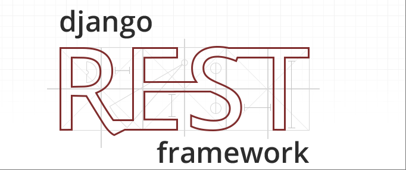

[toc]

# DjangoRestFramework笔记1

## DRF 介绍



Django REST Framework（简称 DRF）是一个基于 Django 框架的Web应用开发框架。其专门用于快速构建 Restful API接口应用程序。

Django REST Framework 通过扩展 Django框架的功能，提供了一系列标准化的组件和便捷的开发模式，显著降低了构建高性能、可维护 API 的复杂度。

[Django Rest Framework 官网 https://www.django-rest-framework.org/](https://www.django-rest-framework.org/)

> Django REST Framework 优点
- 深度集成 Django：充分利用 Django 的 ORM、模板、管理后台等功能，与 Django 生态无缝衔接。
- 功能全面：覆盖 API 开发全流程（序列化、视图、认证、分页、过滤等），减少第三方库依赖。
- 灵活性与可扩展性：支持自定义序列化器、视图逻辑、权限策略等，适应复杂业务需求。
- 社区活跃：拥有庞大的开发者社区和丰富的第三方插件（如 drf-yasg 用于增强文档），问题解决成本低。

> Django REST Framework 特性
- 序列化：提供 Serializer 和 ModelSerializer 类，支持将 Django 模型对象、查询集（QuerySet）等数据结构直接转换为 JSON/XML 等格式，同时支持反序列化（即将外部请求数据转换为 Django 模型对象）。
- 视图：封装了多种视图类（如 APIView、GenericAPIView、ModelViewSet），支持快速实现增删改查（CRUD）操作。
- 路由：提供 DefaultRouter、SimpleRouter 等路由类，自动为视图生成 URL 映射，避免手动编写大量 URL 配置。
- 认证与权限：内置多种认证方式和权限控制，支持自定义策略，确保 API 的安全性。
- 模式与文档：集成 OpenAPI 规范（如 Swagger/Redoc），自动生成 API 文档，支持交互式测试，提升接口文档的维护效率。

> Django REST Framework 使用场景
- 前后端分离项目（如 Vue/React 前端 + DRF 后端）。
- 移动应用（iOS/Android）的后端数据接口。
- 第三方开放平台（如提供给合作伙伴的 API 服务）。
- 需要快速迭代的 API 服务（利用 DRF 的自动化特性缩短开发周期）。

## DRF 环境搭建与基础配置

### 安装DRF

DRF依赖Django，需先确保已安装Django。

```bash
# 安装DRF
pip install djangorestframework
```

### Django项目集成DRF（settings.py配置）

在Django项目的全局配置文件settings.py中，将rest_framework添加到INSTALLED_APPS配置列表中，确保Django识别DRF。

```py
# settings.py
INSTALLED_APPS = [
    # .....
    # 注册DRF
    'rest_framework',
]
```

在Django项目的全局配置文件settings.py中，新建DRF全局设置。

```py
# settings.py
REST_FRAMEWORK = {
    # 默认认证类（全局生效）
    'DEFAULT_AUTHENTICATION_CLASSES': [
        'rest_framework.authentication.SessionAuthentication',  # Session认证
        'rest_framework.authentication.TokenAuthentication',
        # Token认证
    ],
    # 默认权限类（全局生效）
    'DEFAULT_PERMISSION_CLASSES': [
        'rest_framework.permissions.IsAuthenticated',  # 仅认证用户可访问
    ],
    # 默认分页类（全局生效）
    'DEFAULT_PAGINATION_CLASS': 'rest_framework.pagination.PageNumberPagination',
    'PAGE_SIZE': 10,  # 每页默认返回10条数据
}
```


## DRF 序列化器（Serializers）

DRF框架提供了一个序列化模块。该模块中包含了所有可用的序列化器类。

> 序列化器的作用

- 序列化：将Django模型对象/查询集对象转换为JSON/XML等格式的响应数据（用于API返回数据）
- 反序列化：将客户端发送的请求数据（如JSON数据）转换为Django模型对象（用于API接收数据）
- 验证：可以对数据进行合法性校验（字段类型、业务规则等）
- 数据转换：处理不同格式间的类型转换（如日期字符串转datetime对象）

DRF框架中最常用的序列化器类有两个。
- Serializer 序列化器基类，DRF中所有的序列化器类都必须直接或间接继承于 Serializer 序列化器基类。
- ModelSerializer 模型序列化器类。在工作中，除了Serializer基类以外，ModelSerializer是最常用的序列化器类。


### 自定义序列化器类 （继承Serializer 序列化器基类）

DRF 中的 `Serializer` 是所有序列化器的基类，提供了序列化、反序列化和数据验证的基础功能。

如果我们想要实现序列化的功能，需要做到以下几点。
1. 自定义一个序列化器类，需要继承Serializer类。
2. 构建自定义序列化器类的字段。需要与模型类的字段是需要一一对应的。只有这样才能将模型类对象进行序列化和反序列化。

#### Serializer 序列化器基类提供的常用字段类型

通常根据模型字段类型选择匹配的序列化器字段，以确保数据类型和校验规则的一致性。

> Serializer 序列化器字段类和模型类字段类型的对应关系。如下所示

| Django 模型字段类型 | DRF 序列化器字段类型 | 说明  |
|----------|--------|---------|
| `models.CharField`  | `serializers.CharField`    | 字符串字段，需通过 `max_length` 限制长度（与模型保持一致） |
| `models.TextField`  | `serializers.CharField`    | 长文本字段 |
| `models.IntegerField` | `serializers.IntegerField` | 整数字段，可通过 `min_value`/`max_value` 限制范围（与模型一致）|
| `models.EmailField`| `serializers.EmailField`   | 邮箱字段，自动校验邮箱格式（与模型 `EmailField` 强关联）  |
| `models.DateTimeField` | `serializers.DateTimeField`| 日期时间字段，支持 `format` 参数指定输出格式（如 `%Y-%m-%d %H:%M:%S`）|
| `models.BooleanField`| `serializers.BooleanField` | 布尔字段，默认值通过 `default` 参数设置（与模型 `default` 一致） |
| `models.FloatField`  | `serializers.FloatField`   | 浮点数字段，自动处理浮点数转换    |
| `models.DecimalField`  | `serializers.DecimalField` | 高精度十进制字段，需通过 `max_digits`/`decimal_places` 参数匹配模型设置 |
| `models.FileField`  | `serializers.FileField`    | 文件上传字段，序列化时返回文件 URL，反序列化时处理文件对象    |
| `models.ImageField`  | `serializers.ImageField`   | 图片上传字段（依赖 Pillow 库），额外校验图片格式（如 PNG/JPG） |
| `models.JSONField`  | `serializers.JSONField`    | JSON 字段（DRF 3.13+ 支持），自动序列化/反序列化 JSON 对象   |

> 字段类型中常用参数如下所示

| 参数名 | 作用说明 | 示例 | 
|---------|------------|--------| 
| max_length | 限制字符串字段的最大长度 | CharField(max_length=100)（用户名最多100字符） | 
| min_length | 限制字符串字段的最小长度 | CharField(min_length=2)（用户名至少2字符） | 
| min_value | 限制数值字段的最小值 | IntegerField(min_value=0)（年龄最小0岁） | 
| max_value | 限制数值字段的最大值 | IntegerField(max_value=150)（年龄最大150岁） | 
| allow_blank | 允许字符串字段为空字符串 | CharField(allow_blank=True)（允许空字符串） | 
| allow_null | 允许字段值为None（null） | EmailField(allow_null=True)（允许邮箱为空） | 
| default | 当数据未提供时，字段的默认值（反序列化时自动填充） | BooleanField(default=False)（默认未激活） | 
| required | 是否为必填字段（默认True） | IntegerField(required=False)（年龄可选填） | 
| read_only | 标记字段为只读（序列化时包含该字段，但反序列化时忽略输入） | DateTimeField(read_only=True)（创建时间由服务端自动生成） | 
| write_only | 标记字段为只写（反序列化时使用，但序列化时不包含） | CharField(write_only=True)（密码仅用于提交，不返回给前端） | 
| format | 指定日期/时间字段的输出格式（适用于DateTimeField、DateField等） | DateTimeField(format="%Y-%m-%d %H:%M:%S")（输出格式如2025-07-11 10:00:00） | 
| child | 指定复合字段（如ListField）的子字段类型 | ListField(child=CharField(max_length=20))（列表元素为最多20字符的字符串） | 
| source | 映射模型字段的源名称（用于序列化器字段与模型属性名不一致的场景） | CharField(source='user_name')（序列化器字段username对应模型的user_name属性） | 
| label | 字段的显示名称（用于API文档或表单展示） | CharField(label="用户姓名")（文档中显示为“用户姓名”） | 
| help_text | 字段的帮助文本（用于API文档说明字段用途） | IntegerField(help_text="用户年龄，范围1-150")（文档中提示年龄范围） | 

#### Serializer 序列化器基类的构造方法

Serializer 序列化器基类的构造方法，需要传入模型对象。语法如下

```py
# 构造语法
自定义序列化器(instance=None, data=requpst.body, many=False, context=None, **kwargs)

# 序列化单个模型对象为dict字典，返回序列化器对象。
serializer = UserSerializer(instance=模型对象)

# 序列化多个模型对象为list列表，返回序列化器对象。
serializer = UserSerializer(instance=模型对象列表, many=True)

# 如果传递数据到序列化器中，可以使用context，返回序列化器对象。
# 通过context参数附加的数据，可以通过Serializer对象的context属性获取
serializer = UserSerializer(instance=模型对象, context={'a': a})

# 可以通过Serializer对象的data属性获取模型对象序列化后的结果
print(serializer.data)

```

- instance参数：模型对象。用于序列化时把模型类对象传入instance参数。
- data参数：请求数据。用于反序列化时把请求数据传入data参数。
- many参数：默认为False，当需要对多个模型对象进行序列化（即instance参数为模型对象列表），则需要声明many=True。
- context参数：上下文数据，用于在构造Serializer对象时可以添加额外数据。可以通过Serializer对象的context属性获取额外数据。
- **kwargs参数：其他自定义参数。


#### 自定义序列化器的基本使用

> ① 在models.py文件中定义一个模型类。

```py
from django.db import models

# 假设这是 Django 模型类
class UserModel:
    # 模型类的字段如下
    id = models.IntegerField(primary_key=True)
    username = models.CharField(max_length=100)
    age = models.IntegerField()
    email = models.EmailField()
    is_active = models.BooleanField(default=False)
    tags = models.JSONField()

```

> ② 创建serializers.py文件，并且自定义一个序列化器类。自定义的序列化器类需要与模型类的字段一一对应。

```py
# 导入DRF中的序列化器模块  
from rest_framework import serializers
# 自定义一个序列化器类UserInfoSerializer需要继承Serializer类
class UserInfoSerializer(serializers.Serializer):
    # read_only 表示该字段，在序列化时包含该字段，但反序列化时忽略输入
    id = serializers.IntegerField(read_only=True)
    # 必传字符串字段（默认required=True），最长100字符
    username = serializers.CharField(max_length=100)
    # 可选整数字段（允许为空），年龄范围1-150
    age = serializers.IntegerField(required=False, min_value=1, max_value=150)
    # 邮箱字段
    email = serializers.EmailField()
    # 布尔字段（默认值False）
    is_active = serializers.BooleanField(default=False)
    # 列表字段（元素为字符串）
    tags = serializers.ListField(child=serializers.CharField(max_length=20))

```

> ③ 序列化（模型对象 → JSON）的代码示例

```py
from django.http import JsonResponse
from .models import UserModel
from .serializers import UserInfoSerializer

def user_detail(request, pk):
    # 从数据库中查询单个模型对象
    user = UserModel.objects.get(pk=pk)  
    # 将对象传入序列化器中，返回序列化器对象
    serializer = UserInfoSerializer(user)  
    # 调用序列化器对象的data属性，返回模型对象序列化后的字典数据
    a = serializer.data
    print(a)
    # 通过JsonResponse将字典数据打包为json，并返回给客户端
    return JsonResponse(a) 

```

> ④ 反序列化（JSON → 模型对象）的代码示例

使用序列化器进行反序列化时，必须先调用is_valid()方法对数据进行验证，验证成功返回True，否则返回False。
- 验证失败，可以通过序列化器对象的errors属性获取错误信息。
- 验证成功，可以通过序列化器对象的validated_data属性获取数据。

```py
from django.http import JsonResponse
import json
from .models import UserModel
from .serializers import UserInfoSerializer

def user_create(request):
    
    # 将请求中的Json数据传入序列化器构造方法的data参数中，进行反序列化
    serializer = UserInfoSerializer(data=request.data)  
    # 验证反序列化是否有效
    if serializer.is_valid():
        # 调用序列化器对象的data属性，返回模型对象
        user_obj = serializer.data
        # 返回给客户端
        return JsonResponse(serializer.validated_data, status=200)
    else:
        # 验证失败，返回验证错误信息
        return JsonResponse(serializer.errors, status=400)
        
```


### ModelSerializer（模型序列化器类）

### 嵌套序列化器（处理关联模型）


## DRF 视图（Views）
### APIView：DRF最基础的视图类（请求/响应封装、异常处理）

### GenericAPIView：通用视图类（结合查询集与序列化器）

### 混合类（Mixins）：ListModelMixin、CreateModelMixin等组合使用

### ModelViewSet：一站式CRUD视图（自动绑定增删改查方法）


## DRF 路由（Routers）

### SimpleRouter与DefaultRouter的区别

### 路由注册（配合ViewSet自动生成URL）

### 自定义路由（添加额外操作）

## 六、认证与权限——API的安全防线

### 6.1 内置认证方式（Session认证、Token认证、JWT认证）

### 6.2 权限控制（IsAuthenticated、IsAdminUser、自定义权限类）

### 6.3 视图级/全局级认证配置

## 七、分页与过滤——优化API体验

### 7.1 分页配置（PageNumberPagination、LimitOffsetPagination）

### 7.2 过滤后端（Django Filter集成，自定义过滤逻辑）

### 7.3 排序与搜索（结合DRF内置功能）

## 八、API文档生成——提升协作效率

### 8.1 集成Swagger/Redoc（使用drf-yasg插件）

### 8.2 自动生成与手动补充文档（注解与字段描述）

### 8.3 交互式测试（通过文档页面调试API）

## 九、实战：开发一个完整的用户管理API

### 9.1 需求分析（用户信息增删改查、分页、认证）

### 9.2 步骤分解（模型→序列化器→视图→路由→测试）

### 9.3 常见问题与解决方案（如跨域、性能优化）

## 十、总结与扩展

### 10.1 DRF的优势总结与适用场景

### 10.2 进阶学习方向（自定义渲染器、解析器、第三方插件推荐）