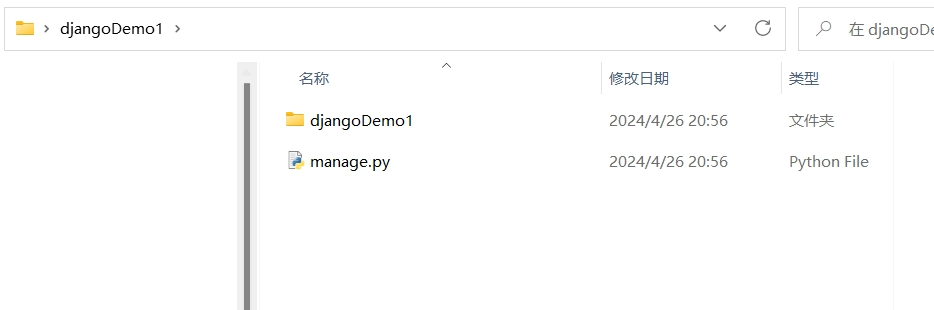
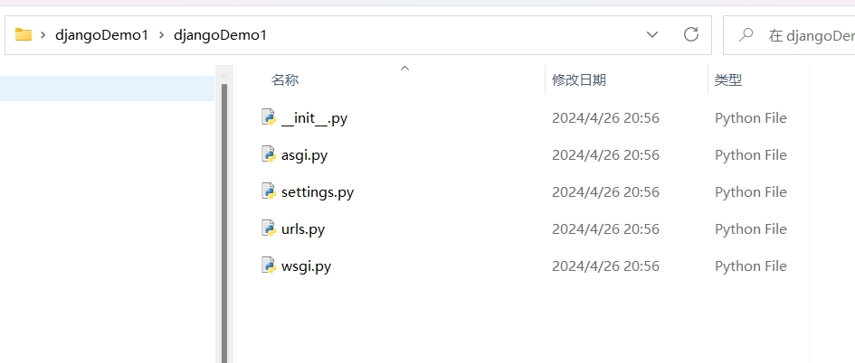
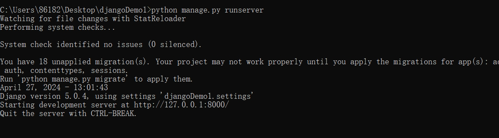
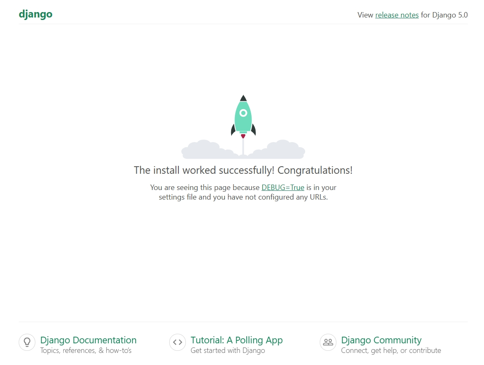

[toc]

# Django笔记1

Django 是一个由 Python 编写的一个 Web 应用框架。使用 Django，只要很少的代码，Python 的程序开发人员就可以轻松地完成一个正式网站所需要的大部分内容，并进一步开发出全功能的 Web 服务。

Django 采用了 MVT 的软件设计模式，即模型（Model），视图（View）和模板（Template）。

> MVT设计模式

Django 的 MTV 模式本质上和 MVC 是一样的，也是为了各组件间保持松耦合关系，只是定义上有些许不同，Django 的 MTV 分别是指。
- M 模型（Model）：负责业务对象与数据库的映射(ORM)。
- T 模板 (Template)：负责如何把页面(html)展示给用户。
- V 视图（View）：负责业务逻辑，并在适当时候调用 Model和 Template。

除了以上三层之外，还有一个 URL 控制器，它的作用是将一个个 URL 的页面请求分发给不同的 View 处理，View 再调用相应的 Model 和 Template

用户操作流程图如下


1. 用户通过浏览器输入URL访问视图
2. 如果不涉及到数据调用，视图直接返回一个模板给用户。
3. 如果涉及到数据调用，视图先调用模型数据，然后把模型数据填充到模板中，最后返回给用户。


> Django的特点

- ORM（对象关系映射）：Django 提供了一个强大的 ORM，允许开发者通过 Python 代码来定义和操作数据库模型，而无需直接使用 SQL。这使得数据库操作更加抽象和易于管理。
- MVC 架构： Django 遵循 MVC（模型-视图-控制器）的软件设计模式。
- 模板引擎： Django 使用模板引擎来生成 HTML，这使得前端和后端的代码分离更加容易。
- 自动化 admin 界面： Django 自动生成管理后台页面，使得管理和操作数据库的过程变得非常简单。
- 表单处理： Django 提供了强大的表单处理工具，使得用户输入的验证和处理变得更加简单。
- 安全性： Django 内置了一些安全性功能，例如防止常见的 Web 攻击（如 CSRF 攻击），并提供了方便的用户身份验证和授权系统。
- 可扩展性： Django 的组件是松耦合的，允许开发者使用现有的组件或编写自己的应用程序来扩展框架功能。
- 社区支持： Django 拥有庞大的社区支持，提供了大量的文档、教程和第三方包，使得学习和使用 Django 变得更加容易。


## Django 安装

> 使用pip包管理工具安装Django

```shell
# 安装 django
pip install Django
```

```shell
# 在python终端中可以查询安装的django版本
>>> import django
>>> print(django.get_version())
5.0.4
```

安装Django之后，会默认安装 django-admin 命令行管理工具。

django-admin 命令行管理工具可以帮助开发者很方便的管理Django项目。

### 创建 Django 项目

① 创建第一个Django项目

```shell
# 语法
django-admin startproject 项目名称

# 例子
django-admin startproject djangoDemo1
```

django-admin会创建一个项目目录。如下图所示。




- manage.py: 一个命令行工具，可以与该 Django 项目进行交互。
- `__init__`.py: 一个空文件，告诉 Python 该目录是一个 Python 包。
- asgi.py: 一个 ASGI 兼容的 Web 服务器的入口，以便运行你的项目。
- settings.py: 该 Django 项目的设置/配置。
- urls.py: 该 Django 项目的 URL 声明; 一份由 Django 驱动的网站"目录"。
- wsgi.py: 一个 WSGI 兼容的 Web 服务器的入口，以便运行你的项目。


② 运行该Django项目

进入到项目所在目录。执行下面命令。

```shell
python manage.py runserver
```

运行命令如下图所示。端口号默认为 8000。


浏览器访问`http://127.0.0.1:8000/`。首页如下图所示



## Django 模板

模板 (Template) 通常指的是未填充数据的视图页面。

> 创建一个模板

1. 在项目目录中新建一个 templates 目录。并创建一个模板文件 hello.html.
2. 编辑模板文件 hello.html.

```html

```


## Django 模型

Django 对各种数据库提供了很好的支持，包括：PostgreSQL、MySQL、SQLite、Oracle。Django 为这些数据库提供了统一的调用API。 

Django 可以使用自带的 ORM 描述对象和数据库之间的映射的元数据，将程序中的对象自动持久化到数据库中

因此 ORM 在业务逻辑层和数据库层之间充当了桥梁的作用。

1. ORM 会将 Python 代码转成为 SQL 语句。
2. SQL 语句通过 数据库驱动(例如pymysql) 传送到数据库服务端。
3. 然后在数据库中执行 SQL 语句并将结果返回。


### Django 使用 mysql 数据库

① 先安装 mysql 数据库驱动。

```shell
# 通过pip包工具安装 mysql 数据库驱动 pymysql
pip3 install pymysql
```

② 然后提前创建使用的数据库。并在项目的 settings.py 文件中进行数据库配置。

```py
DATABASES = {
    'default': {
        'ENGINE': 'django.db.backends.mysql',       # mysql数据库
        'NAME': 'my_test',      # 数据库名称
        'HOST': '127.0.0.1',    # 数据库地址，本机 ip 地址 127.0.0.1 
        'PORT': 3306,           # 端口 
        'USER': 'root',         # 数据库用户名
        'PASSWORD': '123456',   # 数据库密码
    }
}
```

③ 设置该Django项目使用 pymysql 模块连接 mysql 数据库。

```py
# 在与 settings.py 同级目录下的 __init__.py 中引入pymysql模块并进行配置 
import pymysql
pymysql.install_as_MySQLdb()
```

### 定义模型

Django 规定，如果某个Django项目要使用模型，必须要在当前项目中创建一个 app。

1. 进入到Django项目中，创建模型

```sh
# 语法
django-admin startapp 模型名称

# 例子
django-admin startapp StudentModel
```


