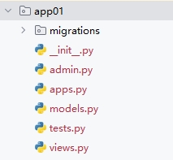

[toc]

# Django笔记1


目前最新的Django LTS版本为5.2.3

Django 是一个由 Python 编写的一个重量级 Web 应用框架。使用 Django，只要很少的代码，Python 的程序开发人员就可以轻松地完成一个正式网站所需要的大部分内容，并进一步开发出全功能的 Web 服务。

> Django的特点

- 快速开发: Django的最大优势之一就是能够快速搭建Web应用。它通过提供开箱即用的组件，如认证、后台管理、表单、数据库管理等，使开发者能够专注于业务逻辑而不必从零开始编写大量的代码。
- ORM（对象关系映射）：Django 提供了一个强大的 ORM，允许开发者通过 Python 代码来定义和操作数据库模型，而无需直接使用 SQL。这使得数据库操作更加抽象和易于管理。
- 自动化 admin 后台界面： Django 自动生成管理后台页面，使得管理和操作数据库的过程变得非常简单。
- 模板引擎： Django 使用模板引擎来生成 HTML，这使得前端和后端的代码分离更加容易。
- 表单处理： Django 提供了强大的表单处理工具，使得用户输入的验证和处理变得更加简单。
- 安全性： Django 内置了一些安全性功能，例如防止常见的 Web 攻击（如 CSRF 攻击），并提供了方便的用户身份验证和授权系统。
- 可扩展性： Django 的组件是松耦合的，允许开发者使用现有的组件或编写自己的应用程序来扩展框架功能。
- 社区支持： Django 拥有庞大的社区支持，提供了大量的文档、教程和第三方包，使得学习和使用 Django 变得更加容易。

## Django 安装

> 使用pip包管理工具安装Django

```shell
# 安装 django
pip install Django
```

安装Django之后，会默认安装 django-admin 命令行管理工具。

django-admin 命令行管理工具可以帮助开发者很方便的创建和管理Django工程。类似Django工程的脚手架。

## Django 工程的创建

① 创建Django工程

```shell
# 语法
django-admin startproject 工程名称
# 例子
django-admin startproject djangoDemo1
```

django-admin 命令行管理工具会根据命令创建一个工程目录，然后再其中会创建一个同名子目录和一个 `manage.py` 文件。其中同名子目录包含了Django工程的一些启动文件和配置文件。

如下图所示。


- manage.py: 一个非常重要的脚本文件，位于工程的根目录中。它是管理 Django 工程的命令行工具，包含了许多常用的管理命令。
- `__init__`.py: 一个空文件，告诉 Python 该子目录是一个 Python 包。在 Django 工程中，这个文件是必需的，虽然它通常是空的，但它保证了该子目录会被 Python 识别为一个模块。
- settings.py: 是 Django 工程的核心配置文件。如数据库配置、缓存设置、安全设置等。
- urls.py: 是 Django 工程的 URL 路由配置文件。它定义了 URL 与视图函数之间的映射关系。
- asgi.py: ASGI是WSGI的异步版本。这个文件可以允许 Django 支持 WebSockets、长轮询等异步协议。
- wsgi.py: 是用来处理同步请求的文件。WSGI是传统的 Web 服务器与 Python Web 应用之间的接口文件。

② 运行该Django工程

进入到工程所在目录。执行下面命令。

```shell
python manage.py runserver
```

运行命令如下图所示。端口号默认为 8000。


浏览器访问`http://127.0.0.1:8000/`。如下图所示


## Django的MTV架构模式

Django5 采用了 MTV 架构，即模型（Model），视图（View）和模板（Template）。这与传统的 MVC 架构非常相似，但在实现上有所不同。

> 传统的MVC架构

MVC 架构由三个主要组件组成：模型（Model）、视图（View）和控制器（Controller）。它们之间的关系如下图所示。


- 模型（Model）：它负责与数据库交互，处理数据的存储、检索等操作。模型通常是数据库相关的，表示应用程序中的数据对象。
- 视图（View）：视图通常是HTML页面或类似模板的内容。视图负责向用户展示数据和接收用户输入。
- 控制器（Controller）：控制器负责接收用户输入并调用相应的模型和视图。它接收用户请求，处理业务逻辑，并将结果返回给视图进行展示。

> MTV 架构


Django 的 MTV 模式和 传统的MVC模式 本质上是一样的，都是为了各组件间保持松耦合关系，只是定义上有些许不同，Django 的 MTV 分别是指。

- M 模型（Model）：与 MVC中的模型类似，负责与数据库交互。模型通常是 models.py 中定义的类。
- T 模板 (Template)：Django 将传统 MVC 中的“视图”部分（负责显示数据）拆分成了模板和视图两个部分。模板负责数据的展示与布局。
    - 模板是 HTML 文件，并使用 Django 的模板语言（DTL）来动态填充数据。
    - 模板定义了 Web 页面中的 HTML、CSS、JavaScript 结构和样式，并通过占位符动态显示模型中的数据。
- V 视图（View）：在 Django 中视图就是MVC模式中的控制器，接收 HTTP 请求并返回 HTTP 响应。
    - 视图是一个函数或类，通常包含业务逻辑，决定如何处理输入、验证表单数据、调用模型更新数据库等。
    - 视图的作用是获取模型中的数据，填充到模板中，并返回给用户。


> 对应关系如表格所示

| MVC（传统） | MTV（Django） |
| :--: | :--: | 
| Model（模型）| Model（模型） |
| View（视图） | Template（模板） | 
| Controller（控制器） | View（视图） | 


除了以上三层之外，还有一个 URL 控制器，它的作用是将一个个 URL 的请求分发给不同的 View视图处理，View视图再调用相应的 Model模型 和 Template模板。

大致操作流程如下


1. 用户通过浏览器输入URL访问视图函数
2. 如果不涉及到数据调用，视图直接返回一个模板给用户。
3. 如果涉及到数据调用，视图先调用模型数据，然后把模型数据填充到模板中，最后返回给用户。


③ 创建子工程

通常一个Django工程中会有多个子工程，类似功能模块的概念。

```py
# 创建一个名为app01的应用
python manage.py startapp app01
```

创建子应用会在项目目录中新增一个python包。包中有一些相关文件。


④ 定义数据库模型

在 app01/models.py 中定义相关的数据库模型。

```py
from django.db import models

class Post(models.Model):
    title = models.CharField(max_length=200)
    content = models.TextField()
    pub_date = models.DateTimeField(auto_now_add=True)

    def __str__(self):
        return self.title
```

⑤ 执行命令创建数据库表

```py
python manage.py makemigrations
python manage.py migrate
```

⑥ 创建视图方法

在app01/views.py中创建视图方法

```py
from django.shortcuts import render
from .models import Post

def post_list(request):
    posts = Post.objects.all()
    return render(request, 'myapp/111.html', {'posts': posts})
```

⑦ 创建页面


## Django 模板

模板 (Template) 通常指的是未填充数据的视图页面。

> 创建一个模板

1. 在项目目录中新建一个 templates 目录。并创建一个模板文件 hello.html.
2. 编辑模板文件 hello.html.

```html

```


## Django 模型

Django 对各种数据库提供了很好的支持，包括：PostgreSQL、MySQL、SQLite、Oracle。Django 为这些数据库提供了统一的调用API。 

Django 可以使用自带的 ORM 描述对象和数据库之间的映射的元数据，将程序中的对象自动持久化到数据库中

因此 ORM 在业务逻辑层和数据库层之间充当了桥梁的作用。

1. ORM 会将 Python 代码转成为 SQL 语句。
2. SQL 语句通过 数据库驱动(例如pymysql) 传送到数据库服务端。
3. 然后在数据库中执行 SQL 语句并将结果返回。


### Django 使用 mysql 数据库

① 先安装 mysql 数据库驱动。

```shell
# 通过pip包工具安装 mysql 数据库驱动 pymysql
pip3 install pymysql
```

② 然后提前创建使用的数据库。并在项目的 settings.py 文件中进行数据库配置。

```py
DATABASES = {
    'default': {
        'ENGINE': 'django.db.backends.mysql',       # mysql数据库
        'NAME': 'my_test',      # 数据库名称
        'HOST': '127.0.0.1',    # 数据库地址，本机 ip 地址 127.0.0.1 
        'PORT': 3306,           # 端口 
        'USER': 'root',         # 数据库用户名
        'PASSWORD': '123456',   # 数据库密码
    }
}
```

③ 设置该Django项目使用 pymysql 模块连接 mysql 数据库。

```py
# 在与 settings.py 同级目录下的 __init__.py 中引入pymysql模块并进行配置 
import pymysql
pymysql.install_as_MySQLdb()
```

### 定义模型

Django 规定，如果某个Django项目要使用模型，必须要在当前项目中创建一个 app。

1. 进入到Django项目中，创建模型

```sh
# 语法
django-admin startapp 模型名称

# 例子
django-admin startapp StudentModel
```


