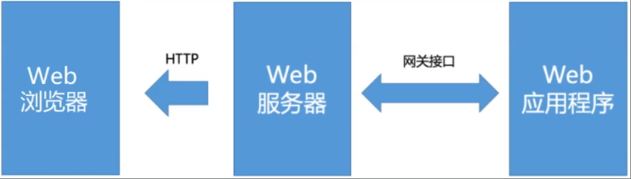
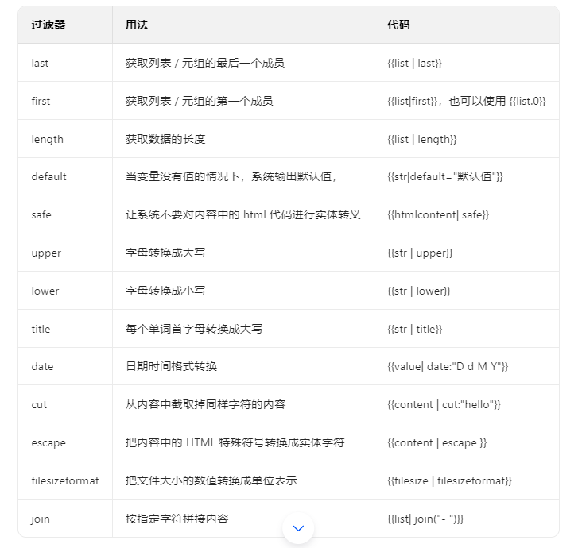

[toc]

# Django笔记1


目前最新的Django LTS版本为5.2.3

Django 是一个由 Python 编写的一个重量级 Web 应用框架。使用 Django，只要很少的代码，Python 的程序开发人员就可以轻松地完成一个正式网站所需要的大部分内容，并进一步开发出全功能的 Web 服务。

[Django 官方网址 https://docs.djangoproject.com/zh-hans/5.2/contents/](https://docs.djangoproject.com/zh-hans/5.2/contents/)


参考：
- [Django 官方文档](https://docs.djangoproject.com/en/5.2/)
- Django 5企业级Web应用开发实战(视频教学版) 王金柱 著


> Django的特点

- 快速开发: Django的最大优势之一就是能够快速搭建Web应用。它通过提供开箱即用的组件，如认证、后台管理、表单、数据库管理等，使开发者能够专注于业务逻辑而不必从零开始编写大量的代码。
- ORM（对象关系映射）：Django 提供了一个强大的 ORM，允许开发者通过 Python 代码来定义和操作数据库模型，而无需直接使用 SQL。这使得数据库操作更加抽象和易于管理。
- 自带 admin 后台界面： Django 自动生成管理后台页面，使得管理和操作数据库的过程变得非常简单。
- 模板引擎： Django 使用模板引擎来生成 HTML，这使得前端和后端的代码分离更加容易。
- 表单处理： Django 提供了强大的表单处理工具，使得用户输入的验证和处理变得更加简单。
- 安全性： Django 内置了一些安全性功能，例如防止常见的 Web 攻击（如 CSRF 攻击），并提供了方便的用户身份验证和授权系统。
- 可扩展性： Django 的组件是松耦合的，允许开发者使用现有的组件或编写自己的应用程序来扩展框架功能。
- 社区支持： Django 拥有庞大的社区支持，提供了大量的文档、教程和第三方包，使得学习和使用 Django 变得更加容易。

## Django 安装

> 使用pip包管理工具安装Django

```shell
# 安装 django
pip install Django
```

安装Django之后，会默认安装 django-admin 命令行管理工具。

django-admin 命令行管理工具可以帮助开发者很方便的创建和管理Django工程。类似Django工程的脚手架。

## Django 工程的创建

① 创建Django工程

```shell
# 命令语法
django-admin startproject 工程名称
# 例子
django-admin startproject djangoDemo1
```

如下图所示为工程的目录结构。


django-admin 命令行管理工具会根据命令创建一个工程目录，然后再其中会创建一个同名子目录和一个 `manage.py` 文件。

```py
djangoDemo1/                  # Django工程目录
├── manage.py                 # 工程管理脚本文件（核心工具）它包含了管理 Django 工程的常用命令。
├── djangoDemo1/              # 工程配置目录（与工程名同名）存放Django工程的一些启动文件和核心配置文件。
│   ├── __init__.py           # Python包标识（这个文件是必需的，确保目录被识别为模块）
│   ├── settings.py           # Django 工程的核心配置文件（数据库、中间件、应用注册等）
│   ├── urls.py               # Django 工程的根路由配置文件（定义全局URL映射）
│   ├── asgi.py               # ASGI服务器入口文件（用于生产环境部署异步应用）
│   └── wsgi.py               # WSGI服务器入口文件（用于生产环境部署同步应用）
└── templates/                # （可选，需手动创建）存放HTML模板文件
```

② 运行该Django工程

进入到工程所在目录。执行下面命令。

```shell
python manage.py runserver
```

运行命令如下图所示。端口号默认为 8000。


浏览器访问`http://127.0.0.1:8000/`。如下图所示


## Django 创建子工程(子应用)

当Django工程创建完之后，我们还需要写正式的业务代码。通常一个Django工程中可以有多个子工程，根据业务功能的不同，创建不同的子工程。不同的子工程就相当于项目中的不同功能模块。

```py
# 创建一个名为app01的子应用的命令 
# 该命令需在 Django工程根目录（即包含 manage.py 文件的目录）下执行。若在其他目录运行，会导致子应用无法正确生成到工程中。
python manage.py startapp app01

# 当创建子工程之后，还需要再settings.py配置文件中的INSTALLED APPS配置项添加该子工程。
INSTALLED_APPS=[
    # ....
    'app01',
    # ....
]
```

会在当前的Django工程目录中新增一个子目录作为app01子工程。如图是子工程的目录结构


> 建子应用后，生成的目录结构及核心文件作用

```py
app01/                  # 子应用根目录（与子应用名一致）
├── __init__.py         # 标识该目录是Python包（不可删除）
├── admin.py            # 后台管理配置文件（注册模型到后台）
├── apps.py             # 子应用配置类（可自定义应用标签、名称等）
├── models.py           # 模型类定义文件（数据库表结构）
├── tests.py            # 测试用例文件（编写单元测试）
├── views.py            # 视图函数/类定义文件（处理请求逻辑）
├── migrations/         # 数据库迁移记录目录（自动生成，勿手动修改）
│   └── __init__.py
└── urls.py             # 子应用路由文件（需手动创建，非默认生成）
```


## WSGI和ASGI

WSGI和ASGI都是基于Python设计的网关接口（Gateway Interface, GI），用于规范Web服务器与Python应用程序之间的通信协议。

WSGl是python语言基于http协议模式开发的，不支持websocket协议，而ASGI的诞生解决了WSGI不支持当前的web开发中的一些新的协议标准，同时ASGI支持原有模式和Websocket的扩展，即ASGI是WSGl的扩展。

注意：Django开发服务器（runserver）默认同时支持WSGI和ASGI。

生产环境中Python Web服务器建议：
- 同步应用使用WSGI服务器（如Gunicorn + uWSGI）
- 异步应用使用ASGI服务器（如Uvicorn + Daphne）

### 网关接口

网关接口(Gateway Interface，Gl)就是一种为了实现加载动态脚本而运行在Web服务器和Web应用程序中的通信接口，也可以理解为一份协议/规范。



只有Web服务器和Web应用程序都实现了网关接口规范以后，双方的通信才能顺利完成。常见的网关接口协议:CGl，FastCGl，WSGI, ASGI等

### CGI

公共网关接口(Common Gateway Interface，CGl)是最早的Web服务器主机提供信息服务的标准接口规范。

只要Web服务器和Web应用程序都实现了CGI协议。那么Web服务器就能够获取并了解客户端提交的信息，转交给服务器端的web应用程序进行处理，最后将返回结果给客户端。

快速通用网关接口(Fast Common Gateway Interface,FastCGl)是公共网关接口(CGI)的增强版本。


### WSGI

WSGI是Python Web应用程序与Web服务器之间的标准接口规范，诞生于2003年。它定义了**同步模式下**服务器与应用的交互方式，是传统Python Web框架（如Django、Flask）的基础通信协议。


实现了WSGI协议的web服务器有:uWSGl、uvicorn、gunicorn，Hypercorn。

像django框架开发的web 应用程序一般在线上web服务器运行时，就不会使用`python manage.py runserver`命令来运行，而是采用上面实现了WSGI协议的web服务器来运行。

diango中运行`python manage.py runserver`命令时，其实内部就启动了wsqiref模块作为web服务器运行的。

wsgiref模块是python内置的一个简单地遵循了wsgi接口规范的web服务器程序。

> WSGI的工作机制
1. **服务器端**：Web服务器（如Gunicorn、uWSGI）接收HTTP请求后，将请求信息（如路径、头部、Body）封装成环境变量字典（environ）和一个`start_response`回调函数。
2. **应用端**：Python应用程序（如Django视图）通过WSGI接口获取environ，处理请求并生成响应内容，最后调用`start_response`设置状态码和响应头，返回响应体。
3. **同步限制**：WSGI是同步协议，每个请求必须等待前一个请求处理完成才能开始，无法高效处理高并发或长时间连接（如WebSocket）。

> 适用场景
- 传统同步Web应用（如静态页面、表单提交）
- 不需要实时通信的场景（如新闻网站、企业官网）

### ASGI

ASGI是WSGI的异步扩展，由Django团队主导设计，支持同步+异步混合模式，解决了WSGI无法处理异步请求（如WebSocket、HTTP/2流）的问题。

> ASGI的工作机制
1. **服务器端**：与WSGI类似，ASGI服务器接收HTTP请求后，将请求信息（如路径、头部、Body）封装成环境变量字典（environ）和一个`send`回调函数。
2. **应用端**：Python应用程序通过ASGI接口获取environ，处理请求并生成响应内容，最后调用`send`函数发送响应头和响应体。
3. **异步处理**：ASGI支持异步处理请求，每个请求可以在不等待前一个请求处理完成的情况下同时处理多个请求，适用于高并发场景。

> 适用场景
- 实时通信应用（如聊天应用、实时监控）
- 基于事件的应用（如消息队列、实时通知）


## Django的MTV架构模式

Django 采用了 MTV 架构，即模型（Model），视图（View）和模板（Template）。这与传统的 MVC 架构非常相似，但在实现上有所不同。

> 传统的MVC架构

MVC 架构由三个主要组件组成：模型（Model）、视图（View）和控制器（Controller）。它们之间的关系如下图所示。


- 模型（Model）：它负责与数据库交互，处理数据的存储、检索等操作。模型通常是数据库相关的，表示应用程序中的数据对象。
- 视图（View）：视图通常是HTML页面或类似模板的内容。视图负责向用户展示数据和接收用户输入。
- 控制器（Controller）：控制器负责接收用户输入并调用相应的模型和视图。它接收用户请求，处理业务逻辑，并将结果返回给视图进行展示。

> MTV 架构


Django 的 MTV 模式和 传统的MVC模式 本质上是一样的，都是为了各组件间保持松耦合关系，只是定义上有些许不同，Django 的 MTV 分别是指。

- M 模型（Model）：与 MVC中的模型类似，负责与数据库交互。
- T 模板 (Template)：模板负责数据的展示与布局。模板是 HTML 文件，并使用 Django 的模板语言（DTL）来动态填充数据。
- V 视图（View）：视图是一个函数或类，通常包含业务逻辑，决定如何处理输入、验证表单数据、调用模型更新数据库等。在 Django 中视图就是MVC模式中的控制器，接收 HTTP 请求并返回 HTTP 响应。


> 对应关系如表格所示

| MVC（传统） | MTV（Django） |
| :--: | :--: | 
| Model（模型）| Model（模型） |
| View（视图） | Template（模板） | 
| Controller（控制器） | View（视图） | 

> URL 路由控制器

除了以上MTV三层之外，还有一个 URL 路由控制器，它的作用是将一个个 URL 的请求分发给不同的 View视图处理，View视图再调用相应的 Model模型 和 Template模板。

大致操作流程如下


## Django 常用配置

在 Django 的核心包里面存在了一个全局默认配置文件`django/conf/global_settings.py`，同时在开发者创建Django工程的时候，也生成了一个项目配置文件在工程主目录下的 `setting.py` 文件中。

这两个配置文件，在 Django 项目运行时，Django 会先加载了 `global_settings.py` 中的所有配置项，接着加载 `setting.py` 的配置项。`settings.py` 文件中的配置项会优先覆盖 `global_settings.py` 文件的配置项。

==在Django中，配置变量被强制要求大写。否则Django无法识别。==

`setting.py` 文件示例如下
```py

from pathlib import Path

# BASE_DIR 代表工程的根路径，是当前文件的父级的父级目录的路径（即Django工程的根目录路径）。主要作用是提供给整个Django项目进行路径拼接用的。
BASE_DIR = Path(__file__).resolve().parent.parent

# SECRET_KEY 随机生成的，用于提供给加密算法的密钥。
SECRET_KEY = 'django-insecure-ant4q+=il*10^2(*%chbbw7$l^@xl+y-g9dumko(p#z2a)d(-a'

# 本地开发的时候，设置DEBUG = True 。当服务端出错，django会提示详细的错误信息
# 线上运行的时候，设置DEBUG = Flase。当服务端出错，django不会提示详细的错误信息，仅仅展示错误页面。
DEBUG = True

# 站点访问权限设置 ALLOWED_HOSTS ，设置当前Django项目允许哪些IP地址访问
### 当ALLOWED HOSTS配置项取值为[]，即空列表，表示只有127.0.0.1、localhost 能访问本项目。
### 当ALLOWED HOSTS配置项取值为['*']，表示任何网络地址IP都能访问当前项目。
### 当ALLOWED HOSTS配置项取值为['hostname.cn','diango.com']，表示只有当前这两个网络地址能访问当前项目
ALLOWED_HOSTS = []

# APP配置
# 已注册到Django项目的子应用列表。下面是Django官方内置的子应用。
# 当创建子应用的时候，需要在该列表中添加对应子应用名称。否则Django项目无法识别子应用。
INSTALLED_APPS = [
    'django.contrib.admin',         #django内置的admin子应用
    'django.contrib.auth',          #django内置的登录认证功能
    'django.contrib.contenttypes',  #django内置的内容类型管理
    'django.contrib.sessions',      #django内置的session功能
    'django.contrib.messages',      #django内置的消息功能
    'django.contrib.staticfiles',   #django内置的静态文件服务功能
    'app01',                        #自已创建的子应用
]

# 中间件配置
# 中间件（拦截器）MIDDLEWARE 实际就是django提供给开发者在http请求和响应过程中，进行数据拦截的插件系统。
# 中间件 主要用于拦截请求或响应，数据修饰，权限判断等功能。
MIDDLEWARE = [
    'django.middleware.security.SecurityMiddleware',        # 安全检测中间件（防止页面过期，脚本攻击，跨域判断等）
    'django.contrib.sessions.middleware.SessionMiddleware', # session中间件（提供session功能）
    'django.middleware.common.CommonMiddleware',            # 通用中间件（给url进行重写，给url后面加上/等）
    'django.middleware.csrf.CsrfViewMiddleware',            # Csrf中间件（防止网站收到Csrf攻击的）
    'django.contrib.auth.middleware.AuthenticationMiddleware',  # 用户权限认证中间件
    'django.contrib.messages.middleware.MessageMiddleware',     # 消息中间件（提示错误消息等）
    'django.middleware.clickjacking.XFrameOptionsMiddleware',   # 网站安全中间件（用于防止iframe标签劫持攻击的）
]

# django工程中的根路由文件的地址
ROOT_URLCONF = 'djangoDemo1.urls'

# 模板配置
TEMPLATES = [
    {
        'BACKEND': 'django.template.backends.django.DjangoTemplates',
        'DIRS': [BASE_DIR / 'templates']    ## 配置模板目录所在的位置
        ,
        'APP_DIRS': True,  ## 表示在子应用中查找模板文件。DIRS的优先级高于APP_DIRS
        'OPTIONS': {
            'context_processors': [
                'django.template.context_processors.request',
                'django.contrib.auth.context_processors.auth',
                'django.contrib.messages.context_processors.messages',
            ],
        },
    },
]

# web应用程序的模块配置
WSGI_APPLICATION = 'djangoDemo1.wsgi.application'


# DATABASES 数据库配置
DATABASES = {
    # Django默认使用sqlite3数据库
    'default': {
        'ENGINE': 'django.db.backends.sqlite3',  ## ENGINE 表示数据库驱动位置
        'NAME': BASE_DIR / 'db.sqlite3',         ## NAME 表示数据库文件位置
    }
}


# Password validation 密码的加密方式
AUTH_PASSWORD_VALIDATORS = [
    {
        'NAME': 'django.contrib.auth.password_validation.UserAttributeSimilarityValidator',
    },
    {
        'NAME': 'django.contrib.auth.password_validation.MinimumLengthValidator',
    },
    {
        'NAME': 'django.contrib.auth.password_validation.CommonPasswordValidator',
    },
    {
        'NAME': 'django.contrib.auth.password_validation.NumericPasswordValidator',
    },
]


# 项目的语言配置，默认英文
LANGUAGE_CODE = 'zh-hans'   #中文
# LANGUAGE_CODE = 'en-us'   # 英文

# 时区配置
# TIME_ZONE = 'UTC'                 #英国时间
TIME_ZONE = 'Asia/Shanghai'         #中国时间

# 是否开启国际化本地化功能
USE_I18N = True

# 是否启用时区转换
# 若为False,则django会基于TIME_ZONE来转换时间，若为True,则采用系统时间来转换时间。
USE_TZ = True

# 静态文件存放路径
STATIC_URL = 'static/'

# 默认情况下，django中数据表的主键ID的数据类型。默认为bigint
DEFAULT_AUTO_FIELD = 'django.db.models.BigAutoField'

```

## Django 视图

在Django框架中，视图（View）是用于处理Web请求和生成响应的核心组件。即接收一个 Web 请求对象，并返回一个 Web 响应对象。

视图的主要作用包含业务逻辑处理，决定如何处理输入、验证表单数据、调用模型更新数据库等。

Django中的视图有两种：视图函数和视图类。

### 简单视图函数

视图函数本质上就是一个Python函数，用于接收Web请求并且返回Web响应。

对于基于Django框架的Web项目而言，通常约定将视图函数写在项目或应用目录中名称为`views.py`的文件中。

示例如下
```py
from django.http import HttpResponse
from django.shortcuts import render
 
# 简单的视图函数
def home(request):
    # 返回一个HttpResponse响应对象
    return HttpResponse("Welcome to the home page!")
 
# 返回模板的视图函数
def about(request):
    # render() 函数将一个模板页面包装为HttpResponse响应对象，并返回。   
    return render(request, 'about.html')
```

### 请求对象 HttpRequest类

在Django框架中，HttpRequest对象是由HttpRequest类来定义的。HttpRequest对象是组成HTTP数据包的核心部件之一，其中包含了非常多的、十分重要的信息和数据。

每当一个客户端请求发送过来时，Django框架负责将HTTP数据包中的相关内容打包成为一个HttpRequest对象，并传递给视图函数的第一个位置上的参数(request)。

#### HttpRequest类的常用属性

视图函数的第一个参数用于接受HttpRequest类的对象。注意：第一个参数的命名是任意的，通常取名为request。

部分代码示例如下
```py
def get_request_info(request):
    print(request.method)   #获取请求方式
    print(request.path)     #获取请求路径
    print(request.headers)  #获取请求头
    print(request.body)     #获取请求体
    print(request.META)     #获取原生请求头

    return HttpResponse("OK")
```

- HttpRequest.scheme: 字符串类型，表示请求的协议种类，通常为“http”或“https”。
- HttpRequest.body: Bytes类型，表示原始HTTP请求的正文。该属性对于处理非HTML形式的数据(例如二进制图像、XML等)非常有用。注意，如果要处理常规的表单数据，应该使用`HttpRequest.POST。`
- HttpRequest.path: 字符串类型，表示当前请求的路径，但是不包括协议名和域名。
- HttpRequest.method: 字符串类型，表示该HTTP请求的请求方式，默认为大写。
- HttpRequest.encoding: 字符串类型，表示提交数据的编码方式(如果属性值为None，则使用DEFAULT CHARSET默认设置)。
- HttpRequest.content_type:表示从CONTENT_TYPE头解析的请求的MIME类型。
- HttpRequest.content_params:包含在CONTENT_TYPE头标题中的键一值对参数字典。
- HttpRequest.GET:一个类似于字典的对象，包含GET请求中的所有参数。举例来讲，在链接地址`http://example.com/?name=jack&age=18`中,`name=jack&age=18`就是字典对象类型的键一值对参数。
- HttpRequest.POST:包含POST请求中的表单数据。如果需要访问请求中的原始或非表单数据，可以使用HttpRequest.body属性。注意，使用if条件语句通过判断`request.method=="POST`来甄别一个请求是否为POST类型，而不要直接使用request.POST进行判断。此外，POST中不包含上传的文件数据。
- HttpRequest.COOKIES:该属性包含所有Cookie信息的字典数据。
- HttpRequest.FILES:该属性为一个类似于字典的对象，包含上传的文件数据。在Django框架中，实现文件上传功能主要依靠该属性。另外需要注意，FILES属性只有在请求方法为POST，并且提交请求的表`<form>`具有`enctype=multipart/form-data`属性时才有效;否则FILES属性将为空。
- HttpRequest.META:该属性为一个包含所有HTTP头部信息的字典。具体示例如下。

```
CONTENT_LENGTH:请求正文的长度(以字符串计)。
CONTENT_TYPE:请求正文的MIME类型。
HTTP_ACCEPT:可接收的响应Content-Type。
HTTP_ACCEPT_ENCODING:可接收的响应编码类型。
HTTP_ACCEPT_LANGUAGE:可接收的响应语言种类。
HTTP_HOST:客服端发送的HOST头部。
HTTP_REFERER:Referring页面。
HTTP_USER_AGENT:客户端的“user-agent”字符串。
QUERY_STRING:查询字符串。
REMOTE_ADDR:客户端的IP地址，可以获取客户端的IP信息。
REMOTE_HOST:客户端的主机名。
REMOTE_USER:服务器认证后的用户，前提是用户可用。
REQUEST_METHOD:表示请求方式的字符串，例如“GET”或“POST”。
SERVER_NAME:服务器的主机名。
SERVER_PORT:服务器的端口(字符串)。
```

#### HttpRequest类的常用方法

- HttpRequest.get_host()方法:该方法返回根据HTTP_X_FORWARDED_HOST信息和HTTP_HOST头部信息获取的请求的原始主机。如果这两个头部信息没有提供相应的值，则使用SERVER_NAME和SERVER_PORT头部信息。
- HttpRequest.get_port()方法:该方法使用META中的HTTP_X_FORWARDED_PORT和SERVER_PORT的信息返回请求的始发端口。
- HttpRequest.get_full_path()方法:该方法返回包含完整参数列表的路径path，例如`/xxx/xxx/?a=true`。
- HttpRequest.build_absolute_uri(location)方法:该方法返回location的绝对URI形式。
- HttpRequest.get_signed_cookie(key)方法:该方法从Cookie中获取键值对数据。
- HttpRequest.is_secure()方法:如果使用的是HTTPS，则该方法返回True，表示链接是安全的。
- HttpRequest.accepts(mime_type)方法:如果请求头部接收的类型匹配mime_type参数，则该方法返回True，否则返回False。


#### 获取请求URL中请求参数

HttpRequest类的GET属性，专门用于获取 URL 中的请求参数（即 URL 中 ? 后面的键值对）,与请求方法无关（无论请求是 GET、POST 还是其他方式，只要 URL 包含请求参数，均可通过此属性获取）。

例如请求URL路径为`http://localhost:8000/app01/get_request/?a=1&b=2`,那么请求参数就是`a=1&b=2`。可以直接通过HttpRequest类的GET属性来获取路径上的请求参数。

使用场景
- 可以获取 GET 请求中 URL 携带的参数（如分页 page=1）。
- 可以获取 POST 请求中 URL 携带的参数（如 /xxx/xxx?a=1 中的 a=1）


示例如下
```py

# 视图函数的第一个参数用于接受路由转过来的HttpRequest类对象
def get_request_info2(request):

    print(request.GET) #获取请求路径上的请求参数

    ##若一个请求的路径为`http://localhost:8000/app01/get_request/?a=1&b=2`。
    ##则request.GET来获取请求路径上的参数为`{'a': ['1'], 'b': ['2']}`。

    ## 或者 获取单个参数
    print(request.GET.get('a'))
    print(request.GET.get('b'))

    # 获取 URL 查询参数（无论请求方法）
    a = request.GET.get('a', '默认值')  # 单个值
    b = request.GET.getlist('b', [])    # 多个值

    return HttpResponse("OK")
```

#### 获取请求体中的表单数据

HttpRequest类的POST属性。用于获取 POST 请求的表单数据（即请求体中提交的数据），仅在请求方法为 POST 时有效。

请求体的数据一般有两种。一种是表单数据，一种是json数据。

注意事项：
- 仅支持 POST 请求，且依赖正确的 Content-Type（若为 application/json 格式的 POST 数据，需通过 request.body 解析，而非 request.POST）。
- 数据不暴露在 URL 中，可传递较大量数据或敏感信息（需配合 HTTPS 加密）。
- 表单提交时需包含  标签（避免 CSRF 攻击）


示例如下
```py
# 视图函数中使用
def demo_view(request):
    # 获取 POST 表单数据（仅 POST 请求有效）
    if request.method == 'POST':
        username = request.POST.get('username')       # 单个值
        hobbies = request.POST.getlist('hobby')       # 多个值

    return HttpResponse("处理完成")
```

#### 获取请求体中的Json数据

HttpRequest类的POST属性，不能获取请求体中的json数据。只能通过HttpRequest类的body属性来获取请求体中的json数据。

示例如下
```py
import json
def get_request_info(request):
    #获取请求体中的json数据
    print(request.body)  
    # 将请求体中的json数据转换为字典格式
    print(json.loads(request.body))

    return HttpResponse("OK")
```

#### 获取请求中的上传文件数据

当客户端通过表单上传文件时，文件数据会被封装在HTTP请求体中。Django通过`request.FILES`对象获取上传的文件数据，该对象是一个类似字典的对象，键是表单中`<input type="file" name=""/>`标签的`name`属性值，值是上传的文件数据。


> 关键注意事项

1. **表单配置要求**：必须满足以下条件才能获取文件数据：
   - 请求方法为`POST`
   - `<form>表单`中带有`enctype="multipart/form-data"`的情况下才会获取到上传文件数据。（否则`request.FILES`为空）
2. **文件对象属性**：上传的文件对象包含以下常用属性：
   - `name`：文件名（如`example.jpg`）
   - `size`：文件大小（字节数）
   - `content_type`：文件MIME类型（如`image/jpeg`）
   - `read()`：读取文件内容的方法（返回字节流）

3. 使用模型类获取上传文件数据时，需要将对应的属性定义成`models.ImageField`字段类型或者`models.FileField`字段类型。


HTML表单代码示例
```html
<!-- templates/upload.html -->
<form method="post" enctype="multipart/form-data">
    
    <!-- 单文件上传（name属性为"avatar"） -->
    <input type="file" name="avatar" accept="image/*">
    <!-- 多文件上传（name属性为"photos"，需添加multiple属性） -->
    <input type="file" name="photos" multiple>
    <button type="submit">上传</button>
</form>
```

视图函数代码示例
```py
from django.http import HttpResponse
from django.shortcuts import render

def upload_view(request):
    if request.method == 'POST':
        # 单文件处理（获取name="avatar"的文件）
        avatar = request.FILES.get('avatar')
        if avatar:
            # 手动保存文件到服务器（示例路径：media/avatars/）
            with open(f'media/avatars/{avatar.name}', 'wb+') as f:
                for chunk in avatar.chunks():  # 分块读取大文件
                    f.write(chunk)

        # 多文件处理（获取name="photos"的所有文件）
        photos = request.FILES.getlist('photos')
        for photo in photos:
            with open(f'media/photos/{photo.name}', 'wb+') as f:
                f.write(photo.read())  # 直接读取小文件内容

        return HttpResponse("文件上传成功")
    
    # 显示上传表单
    return render(request, 'upload.html')

```

#### 获取请求URL中的动态参数

假设请求路径为`http://localhost:8000/app01/id/1/order/2/`。那么如何获取请求路径中的参数。

示例如下
```py
# urls.py路由文件
from django.urls import path
from . import views
urlpatterns = [
    # 传入占位符参数id和user_id
    path('/app01/id/<int:id>/order/<int:order_id>/', views.user_detail),
]

# views.py视图文件
# 视图函数接收请求路径中的占位符参数
def user_detail(request,id,order_id):
    print(id,order_id)
```

### 响应对象 HttpResponse类

在Django框架中HttpRequest对象是浏览器发送过来的请求数据的封装，而HttpResponse对象则是将要返回给浏览器的数据的封装，HttpResponse对象是由HttpResponse类来定义的。

HttpRequest对象由Django自动解析HTTP数据包而创建，而HttpResponse对象则是需要手动创建的。

通常每个视图函数的返回值就是一个HttpResponse对象。

#### HttpResponse类的常用属性

- content属性: 表示响应的内容。
- content_type属性：表示响应内容的类型。
- charset属性: 表示编码的字符集。如果没指定，将会从content_type中解析出来。
- status_code属性: 表示响应的状态码，例如200。
- reason_phrase属性: 表示响应的HTTP原因短语，一般使用HTTP标准的默认原因短语。除非明确设置，否则该属性将由status_code的值决定。
- streaming属性: 该属性的值总是False。由于该属性的存在，使得中间件能够区别对待流式响应和常规响应。
- closed属性:如果响应已关闭，那么该属性的值为True。


#### HttpResponse类的常用方法

- HttpResponse.init__(content=b",content_type=None,status=200,reason=None,charset=None)方法: 该方法为HttpResponse类的初始化方法。具体参数介绍如下:
    - content参数通常是一个迭代器、bytestring、memoryview或字符串类型。如果是其他类型，则将通过编码转换为bytestring类型;如果是迭代器,那么这个迭代器返回的应该是字符串，并且这些字符串连接起来形成response的内容。
    - content_type参数是可选的，用于填充HTTP的Content-Type头部。
    - status参数表示响应的状态码。
    - reason参数是HTTP响应短语。
    - charset参数是编码方式。

- `HttpResponse.__setitem__(header,value)`方法:该方法用于设置头部的键一值对。其中的两个参数都必须为字符串类型。
- `HttpResponse.__delitem__(header)`方法:该方法用于删除头部的某个键，如果键不存在也不会报错。该方法不区分字母大小写。
- `HttpResponse.__getitem__(header)`方法:该方法用于返回对应键的值。该方法不区分字母大小写。
- HttpResponse.get(header, alternate=None)方法:该方法用于返回给定的头部的值，当头部不存在时返回一个alternate参数。
- HttpResponse.has_header(header)方法:该方法用于检查头部中是否有给定的名称(不区分字母大小写)，结果返回布尔值(True或False)。
- HttpResponse.items()方法:该方法的行为类似于Python字典中的dict.items()方法，用于获取HTTP响应中的头部信息。
- HttpResponse.setdefault(header,value)方法:该方法用于设置一个头部，除非该头部已经设置过了。
- HttpResponse.set_cookie()方法:该方法用于设置一个Cookie。其中的参数如下:
    - max_age参数:用于定义生存周期，以秒为单位。如果设置为None，则在浏览器开启期间该Cookie一直保持，浏览器关闭后该Cookie一同删除。
    - expires参数:用于定义到期时间。
    - domain参数:用于设置跨域的Cookie。
    - secure参数:secure=True表明支持HTTPS安全协议,secure=False表明不支持HTTPS安全协议。
    - httponly=True:阻止客户端的Java Script代码访问Cookie。

- HttpResponse.set_signed_cookie()方法:该方法与set_cookie()方法类似，但是在设置
之前将对Cookie进行加密签名。
- HttpResponse.delete_cookie(key)方法:该方法用于删除Cookie中指定的key。
- HttpResponse.close()方法:在请求结束后WSGI服务器会调用此方法来关闭连接。
- HttpResponse.write(content)方法:该方法会将HttpResponse实例看作类似文件的对象，往里面添加内容。
- HttpResponse.flush()方法:该方法用于清空HttpResponse实例的内容。
- HttpResponse.getvalue()方法:该方法返回HttpResponse.content的值。同时，该方法将HttpResponse实例看作一个类似流的对象。

#### HttpResponse响应对象的用法

```py
from django.http import HttpResponse
import json

def response_str(request):
    # 返回文本数据
    return HttpResponse("OK")

def response_html(request):
    # 返回html数据
    return HttpResponse("<h1>html内容</h1>")

def response_json(request):
    # 返回json数据
    return HttpResponse(json.dumps({"name":"alex","age":18}))

def response_json(request):
    # 列表数据
    list_data = [
        {"id": 1, "name": 111},
        {"id": 2, "name": 222}
    ]
    # 将列表数据转换为json数组,并返回
    return HttpResponse(json.dumps(list_data))

def get_request_img(request):
    # 读取图片数据
    with open("app01/bg.png", "rb")as f:
        img = f.read()
    # 返回图片数据
    return HttpResponse(content=img,content_type="image/png")

def response_json(request):
    # 创建一个json数据
    json_data = json.dumps({"name":"alex","age":18})
    # 设置响应的响应头，响应状态等信息
    return HttpResponse(content=json_data, content_type="application/json", status=200,charset="utf-8", headers={"Content-Type": "application/json"})
```

### 响应对象 HttpResponse的子类

Django还包含了一系列的HttpResponse的衍生类(子类)，用来处理不同类型的HTTP响应。

同时，这些子类主要区别就是响应码的不同。HttpResponse衍生类的说明如下:
- HttpResponseRedirect类:重定向，返回302状态码。目前，已经被redirect()方法替代。
- HttpResponsePermanentRedirect类:永久重定向，返回301状态码。
- HttpResponseNotModified类:未修改的页面，返回304状态码。
- HttpResponseBadRequest类:错误的请求，返回400状态码。
- HttpResponseNotFound类:页面不存在，返回404状态码。
- HttpResponseForbidden类:禁止访问，返回403状态码。
- HttpResponseNotAllowed类:禁止访问，返回405状态码。
- HttpResponseGone类:响应过期，返回405状态码。
- HttpResponseServerError类:服务器错误，返回500状态码。

#### JsonResponse类-返回Json数据

JsonResponse对象是HttpResponse对象的子类。JsonResponse对象的内部直接将数据转换为json格式。（会默认设置 Content-Type: application/json）。

JsonResponse类的构造方法如下
```py
class JsonResponse(data,encoder=DjangoJSONEncoder,safe=True,json_dumps_params=None,**kwargs)
# JsonResponse类会默认Content-Type头部设置为application/json
# data参数应该是一个字典数据类型。如果后面的safe参数设置为False，则该参数可以为任意JSON对象。
# encoder参数默认设置为django.core.serializers.json.DjangoJSONEncoder，用于序列化数据。
# safe参数只有设置为False时，才可以将任何可JSON序列化的对象作为data参数的值。如果safe参数设置为True，则同时将一个非字典型对象传递给data参数时，会触发一个TypeError错误。
# json_dumps_params参数通过将一个字典类型关键字参数传递给json.dumps()方法,来生成一个响应。
```

代码示例如下
```py
from django.http import HttpResponse, JsonResponse
def response_json(request):
    return JsonResponse(data={"id": 1, "name": 111}) # 等价于 HttpResponse(json.dumps(data), content_type='application/json')

def response_json2(request):
    # 若要序列化一个非字典数据，则需要设置safe为False。否则会抛出异常。
    return JsonResponse(data=[1,2,3],safe=False)

```

#### FileResponse 对象-返回文件

在Django框架中,FileResponse类用于返回文件类型的响应数据。通常用于给浏览器返回一个文件附件。

对于FileResponse类而言，如果提供了WSGI服务器，则使用wsgi.file_wrapper，否则会将文件
分成小块进行传输。

FileResponse类的定义如下:
```py
class FileResponse(open_file, as_attachment=False, filename='',**kwargs)
```

- 如果设置as_attachment=True，则Content-Disposition被设置为attachment，通知浏览器这是一个以文件形式下载的附件;否则Content-Disposition会被设置为inline(浏览器默认行为)。
- 如果open_file参数传递的类文件对象没有名字，或者名字不合适，那么可以通过filename参数为文件对象指定一个合适的名字。


#### HttpResponseRedirect对象-重定向

HttpResponseRedirect对象是HttpResponse对象的子类。

重定向分为两种：
- 外链重定向。即跳转到外部网址。
- 路由重定向。即重新请求其他路由。

```py
def get_request_info(request):
    # 重定向外部网址
    return HttpResponseRedirect("http://www.baidu.com")

from django.shortcuts import redirect
def redirect_to_home(request):
    # 重定向其他路由
    return redirect('home/')
```

Django 提供了 redirect() 方法来处理 URL路由 的重定向。使用 redirect() 时，可以直接传入视图的名称来实现反向解析，即根据视图名称自动生成 URL。


> redirect() 方法

redirect() 方法会返回一个HttpResponseRedirect对象，并通过传递参数到适当的URL地址上。

redirect()方法语法格式：`redirect(to, *args, permanent=False, **kwargs)`

传递的参数:
- 一个模型:通过模型对象的get absolute_url()函数进行调用。
- 一个视图名称(可能带有参数):通过reverse()方法来进行反向解析的名称。
- 一个目前将要被重定向位置的绝对或相对URL地址。

示例
```py
from django.shortcuts import redirect

def my_view(request):
    # 调用对象的get_absolute_url()方法,获取模型对象的URL重定向地址
    obj = MyModel.objects.get_absolute_url(...)
    # redirect()函数传入地址，进行重定向
    return redirect(obj)

def my_view2(request):
    # 通过视图名称和一些参数返回重定向URL
    return redirect('some-view-name', foo='bar')

def my_view3(request):
    #通过硬编码返回重定向URL
    return redirect('https://www.redirect-url.com/')

def my_view(request):
    #通过硬编码返回重定向URL
    return redirect('/page/content/detail/')    

```


### 视图装饰器

视图装饰器用来对视图函数进行相关的控制操作，实现了对各种HTTP特性的支持功能。

在Django框架中，位于django.views.decorators.http模块的装饰器被用来限制可以访问该视图的HTTP请求方法。如果请求的HTTP方法不是指定的方法之一，则返回django.http.HttpResponseNotAllowed响应。


#### require_http_methods()装饰器

当视图方法被require_http_methods()装饰器修饰的时候，该视图方法仅能被特定的请求方式访问

```py
from django.views.decorators.http import require_http_methods

#请求方法应该是大写
@require_http_methods(["GET"， "POST"])
def my_view(request):
    # 现在可以假设只有GET或POST请求才能到达这里
    # ...

```

#### require_GET() require_POST() require_safe() 装饰器

- require_GET()装饰器:是require_http_methods()装饰器的简化版本，功能上只允许GET请求方式的访问。
- require_POST()装饰器：是require_http_methods()的简化版本，功能上只允许POST请求方式的访问。
- require_safe()装饰器：只允许安全的请求类型，也就是GET请求方式和HEAD请求方式的访问。这类请求通常用于读取数据。

代码示例
```py
from django.views.decorators.http import require_GET, require_POST, require_safe

# 仅处理 GET 请求
@require_GET
def my_view(request):
    # ... 业务代码

# 仅处理 POST 
@require_POST
def my_view2(request):
    # ... 业务代码

# 仅处理GET和HEAD请求
@require_safe
def my_view3(request):
    # ... 业务代码

```


### 简单视图类

视图既可以是函数（视图函数），也可以是类（视图类）。

视图类通过继承 Django 提供的基类（如 `View`）来组织逻辑，相比函数视图，具有以下优势：
- **代码复用**：通过继承基类共享通用逻辑（如权限校验、数据预处理）
- **结构清晰**：按 HTTP 方法（GET/POST/PUT 等）拆分逻辑，符合 RESTful 设计规范
- **扩展性强**：可通过重写基类方法（如 `setup`、`dispatch`）实现统一的预处理/后处理

View类提供了`get post put patch delete head options trace`等方法,不同的方法有不同的作用。

代码示例如下
```py
## views.py
## 定义视图类HomeView，继承基类View
from django.http import HttpResponse
from django.views import View
class HomeView(View):
    def get(self, request):
        ## 这里编写处理 get 请求的逻辑
        return HttpResponse("this is get request")
    
    def post(self, request):
        ## 这里编写处理 post 请求的逻辑
        return HttpResponse("this is post request")

    def put(self, request):
        ## 这里编写处理 put 请求的逻辑
        return HttpResponse("this is put request")

    def delete(self, request):
        ## 这里编写处理 delete 请求的逻辑
        return HttpResponse("this is delete request")


## urls.py
from django.urls import path
from myapp.views import HelloView  # 假设视图类定义在 myapp 的 views.py 中
## 给视图类配置 URL 路由
urlpatterns = [
    # 当路由绑定视图类的时候，需通过 as_view() 方法视图类转换为可被路由识别的可调用对象。
    path('hello/', HelloView.as_view(), name='helloview'),
]

```

> `as_view()` 方法的执行流程如下

1. 创建视图类实例对象
2. 调用 `setup()` 方法初始化请求相关属性（如 `request`、`args`、`kwargs`）
3. 根据请求的 HTTP 类型（如 GET、POST、PUT、DELETE ），调用实例中对应的方法（如 get、post、put、delete ）来处理请求。
4. 若请求方法未实现（如请求的 HTTP 类型是DELETE,但未定义 `delete` 方法），则返回 `405 Method Not Allowed` 响应

简而言之就是，GET类型的'hello/'请求会调用HelloView视图类的get方法,其他同理。

> 路由与视图类的自定义方法可以进行绑定吗？

路由只能通过 as_view() 绑定视图类中的 HTTP 方法（如 get/post/put 等 ），自定义方法无法直接被路由触发。

因为 Django 无法识别视图类中的自定义方法，因此不能直接通过路由触发。但是可以在视图类中的HTTP 方法（如 get/post/put 等 ）中调用自定义方法，从而实现间接触发。


#### 基本类视图的其他方法

> setup 方法

调用具体 HTTP 方法处理函数（如 get、post ）之前调用，可用于初始化。

```py
from django.views import View
class HomeView(View):
    def setup(self, request, *args, **kwargs):
        super().setup(request, *args, **kwargs)
        self.some_attribute = "初始化的值"  # 自定义属性，后续方法可使用

```

> dispatch 方法

负责根据请求的 HTTP 方法，分发到对应的处理函数（如 get、post ）。也可重写它来添加统一的预处理或后处理逻辑，比如权限校验。

```py
from django.views import View
class HomeView(View):
    def dispatch(self, request, *args, **kwargs):
        # 预处理：检查用户是否登录
        if not request.user.is_authenticated:
            return HttpResponse("请先登录", status=401)
        # 调用父类的 dispatch 方法，继续向后处理请求
        return super().dispatch(request, *args, **kwargs)
    
    def get(self, request):
        return HttpResponse("已登录用户才能执行的GET请求方法")
```


### 模板类视图 TemplateView

Django 内置了多种通用类视图，用于快速实现常见功能，避免重复编写样板代码。TemplateView 类视图来处理渲染模板的常见需求。

```py
from django.views.generic import TemplateView

class AboutUsView(TemplateView):
    template_name = 'about.html'
    
    # 向模板传递额外数据（可选）
    def get_context_data(self, **kwargs):
        context = super().get_context_data(**kwargs)
        context['current_year'] = datetime.now().year
        return context
```

### ListView 类视图

Django 内置了多种通用类视图，用于快速实现常见功能，避免重复编写样板代码。ListView 类视图用于查询列表数据。

```py
from django.views.generic import ListView
from myapp.models import Product

class ProductListView(ListView):
    model = Product
    template_name = 'product/list.html'
    context_object_name = 'product_list'
    paginate_by = 12  # 每页显示12条数据
    ordering = ['-created_at']  # 按创建时间倒序排列
    
    # 自定义查询集（可选）
    def get_queryset(self):
        queryset = super().get_queryset()
        category = self.request.GET.get('category')
        if category:
            return queryset.filter(category=category)
        return queryset
```

- ProductListView 会自动查询数据库中的所有 Product 对象，并将它们传递给模板list.html。


## Django 路由

Django 的路由是其核心组件之一，它负责将用户的 HTTP 请求（即 URL）映射到相应的视图函数上。

> 路由的作用

Django框架会将客户端发来的HTTP请求交给路由进行处理。路由会根据请求的URL来确定应该调用哪个视图函数来处理请求。当视图函数处理完成后，再通过视图函数的返回值将数据返回给客户端。

> 路由文件

在 Django 中，路由通常写在工程的 `urls.py` 文件中。这个文件定义了路由和它们对应的视图函数。

路由文件的基本示例
```py
from django.urls import path
from .views import get_info

urlpatterns = [
    ## 通过path函数，将`get_info/`路由与get_request_info视图函数进行绑定。
    path('get_info/',get_request_info)
]
```

### 路由与视图函数绑定

> 使用 path()函数 定义路由

path()函数 是 Django 配置路由的推荐方式，它使用简洁的字符串匹配模式。

```py
from django.urls import path
from . import views
 
urlpatterns = [
    ## /home/ 路由映射到 views.home 视图函数。
    path('home/', views.home, name='home'),
    ## /about/ 路由映射到 views.about 视图函数。
    path('about/', views.about, name='about'),
]
```

> 路由中设置动态参数

```py
urlpatterns = [
    ## /profile/???/ 路由映射到 views.profile 视图函数。
    path('profile/<int:user_id>/', views.profile, name='profile'),
]
```

URL 中的 `<int:user_id>` 会被动态替换为实际的 user_id，并传递给视图函数 profile()。其中int表示动态参数的类型。例如`/profile/111/，/profile/222/`等

> 使用 re_path()函数 定义路由

re_path() 函数允许你使用正则表达式来匹配更复杂的路由。它的基本语法与 path() 类似，但它允许你使用正则表达式进行灵活的匹配。

```py
from django.urls import re_path
from . import views
urlpatterns = [
    re_path(r'^article/(?P<slug>[\w-]+)/$', views.article_detail, name='article_detail'),
]
```

### 路由模块化管理 include函数


> 使用include函数 引入子工程的路由。

当我们在Django工程中创建了多个子工程。每个子工程都有各自的路由urls文件。此时我们可以在Django主工程的urls文件中使用include函数来引入各个子工程的路由文件，从而实现路由的模块化管理。

```py
# 主路由配置（project/urls.py）
urlpatterns = [
    path('admin/', admin.site.urls),
    path('blog/', include('blog.urls')),   # 引入blog子工程的路由
]
```

`path('blog/', include('blog.urls'))` 这句话的作用是引入blog子工程中的urls路由文件。并设置'blog/'为该子工程路由的前缀。

### 路由传递额外参数给视图函数

在 Django 中，有多种方式可以将额外参数传递给视图函数。

> 方式1：定义路由时，可以设置额外参数

```py
# urls.py 文件中
from django.urls import path
from. import views
urlpatterns = [
    path('example/', views.example_view, {'extra_param': '额外参数值'}),
]

# views.py文件中
from django.http import HttpResponse
def example_view(request,extra_param):
    print(f"extra_param: {extra_param}")
    return HttpResponse("视图函数执行成功")

```

> 方式2：使用查询字符串

可以在 URL 中通过查询字符串的形式传递参数，然后在视图函数中从request.GET获取。

```py
# urls.py 文件中
from django.urls import path
from. import views
urlpatterns = [
    path('example/<int:id>/', views.example_view),
]

# views.py文件中
from django.http import HttpResponse
def example_view(request, id):
    print(f"id: {id}")
    return HttpResponse("视图函数执行成功")

```

> 方式3：使用类视图的as_view()方法传入额外参数

```py
# urls.py 文件中
from django.urls import path
from. import views
urlpatterns = [
    path('example/<int:id>/', views.ExampleView.as_view(extra_param='额外参数值')),
]

# views.py文件中
from django.views.generic import View
from django.http import HttpResponse
class ExampleView(View):
    def get(self, request, id, extra_param):
        print(f"id: {id}, extra_param: {extra_param}")
        return HttpResponse("类视图执行成功")

```

以上几种方式可以根据实际业务需求灵活选择，实现将额外参数传递给视图函数的目的。

## Django 模板

模板负责数据的展示与布局。模板本质上就是html页面。

我们可以在视图函数中，用render方法将html页面作为响应返回给客户端。需要3个步骤。
1. 在项目配置文件setting.py中设置模板目录的位置。一般模板目录创建在工程根目录下。
2. 在模板目录中创建对应的模板页面文件，并根据模板语法和视图函数传递过来的数据去填充页面。
3. 在视图函数中使用render方法将某个模板页面作为响应返回给客户端。


### 模板页面作为响应返回

① setting.py中设置模板目录位置

- 创建模板目录templates。
- 修改setting.py文件中的TEMPLATES的DIRS配置项。如下所示

```py
TEMPLATES = [
    {
        ......
        'DIRS': [BASE_DIR / 'templates'],
        .......
    },
]
```

② 创建模板页面文件

```html
<!DOCTYPE html>
<html lang="en">
<head>
    <meta charset="UTF-8">
    <title>Title</title>
</head>
<body>
    <h1>this is user.html</h1>
</body>
</html>
```

③ 视图函数中使用render方法将模板页面作为响应返回给客户端
```py
from django.shortcuts import render
def get_request_info(request):
    return render(request, template_name='user.html')
```

render方法本质上还是将模板页面封装为HttpResponse响应对象，并返回给客户端。

### render()方法

render函数可以将一个模板和一个上下文字典，返回一个渲染后的HttpResponse对象。

render函数语法格式
```py
render(request, template_name, context=None, content_type=None, status=None, using=
None)
```

- request:视图函数正在处理的当前请求，封装了请求头(Header)的所有数据，其实就是视图请求参数。
- template_name:视图要使用的模板的完整名称或者模板名称的列表。如果是一个列表，将使用其中能够查找到的第一个模板。
- context:将要添加到模板上下文中的字典类型值。默认情况下，这是一个空的字典值。如
果字典中的值是可调用的，则视图将在渲染模板之前调用该参数。
- content_type:响应内容的类型，默认设置为“text/html”。
- status:响应的状态代码，默认值为“200”。
- using:用于加载模板的模板引擎名称。

### Django模板语言（DTL）

Django 模板基于 Django模板语言（DTL），它提供了一些强大的功能，如模板标签、过滤器、条件语句和循环等，可以动态地渲染和控制模板页面的内容。

Django模板语言（DTL）主要包括以下几个部分。
- 模板变量：用于显示动态数据。
- 模板标签：控制模板的逻辑（如条件语句、循环等）。
- 模板过滤器：用于修改变量的输出内容。

#### 模板变量

模板变量用 `{{ }}` 包裹。表示从视图函数中传递过来的数据会被填充到这里,具体填充什么数据,根据模板变量中参数而定。

模板变量的名称由字母、数字和下划线任意组合组成，但注意不能以下划线开头。另外，变量名称中还不能包含空格或标点符号(“.”除外，其具有特殊含义)。

示例如下

创建一个视图函数user_show
```py
from django.shortcuts import render
def user_show(request):
    user = {id:1,name:'xiaoming',phone:'13888888888',idCard:'111111111111111111',email:'123456@qq.com'}
    # 将user的值，传递给模板。
    return render(request, 'user.html', {'user': user})
```

创建一个user.html模板
```html
<!DOCTYPE html>
<html lang="en">
<head>
    <meta charset="UTF-8">
    <title>Title</title>
</head>
<body>
    <h1>ID {{ user.id }}!</h1>
    <h1>姓名 {{ user.name }}!</h1>
    <h1>电话 {{ user.phone }}!</h1>
    <h1>ID {{ user.idCard }}!</h1>
    <h1>邮箱 {{ user.email }}!</h1>
</body>
</html>
```

render方法会将user数据传递给模板，模板会根据模板变量和传递过来的参数，进行匹配。如果模板变量和参数名称相同，则将参数值填充到模板变量中。最终动态渲染成全新的HTML页面。


#### 模板标签

模板标签用于实现更复杂的功能，如条件判断、循环等。模板标签使用 `` 包裹。

常用的模板标签如下所示
- if标签:逻辑条件判断。
- for标签:用于循环遍历（如列表、字典等）。
- autoescape标签:自动转义。可以对超链接地址进行自动转义。
- cycle标签:循环对象的值。
- ifchanged标签:判断一个值是否在上一次的选代中被改变了
- regroup标签:用于重组对象。
- resetcycle标签:用于重置通过cycle标签操作的循环对象
- ur1标签:定义链接的标签。
- templatetag标签:用于输出模板标签字符。
- widthratio标签:用于计算比率
- now标签:用于显示当前时间。

代码示例如下
```html
<!DOCTYPE html>
<html lang="en">
<head>
    <meta charset="UTF-8">
    <title>Title</title>
</head>
<body>
    <h1>ID {{ user.id }}!</h1>
    <h1>姓名 {{ user.name }}!</h1>
    <h1>电话 {{ user.phone }}!</h1>
    <h1>ID {{ user.idCard }}!</h1>
    <h1>邮箱 {{ user.email }}!</h1>

    <!--这是 if 条件模板标签的示例-->

    
        <p>姓名 {{ user.name }}!</p>
    
    <p>姓名 {{ user.name }}!</p>
    
        <p>user name is C</p>
    

    <!--这是 for 循环模板标签的示例-->
    <ul>
    
        <li>{{ post.id }} - {{ post.title }}</li>
    
    </ul>

    当时时间为

</body>
</html>
```


#### 模板过滤器

模板过滤器本质上是一个函数。用于对模板变量进行输出和调整。它们在模板变量后面用 | 分隔表示。

例如，`{{ value|lower }}` 会将 value 模板变量转换为小写字母。

示例如下
```html
<!DOCTYPE html>
<html lang="en">
<head>
    <meta charset="UTF-8">
    <title>Title</title>
</head>
<body>
    <h1>ID {{ user.id }}!</h1>
    <h1>姓名 {{ user.name }}!</h1>
    <h1>电话 {{ user.phone }}!</h1>
    <h1>ID {{ user.idCard }}!</h1>
    <h1>邮箱 {{ user.email|lower }}!</h1>
    <h1>生日 {{ user.birth|date:'Y-m-d' }}!</h1>
</body>
</html>
```

常用的模板过滤器如图所示
