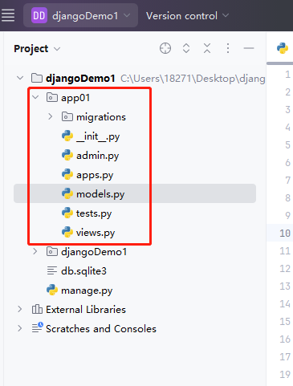

[toc]

# Django笔记1


目前最新的Django LTS版本为5.2.3

Django 是一个由 Python 编写的一个重量级 Web 应用框架。使用 Django，只要很少的代码，Python 的程序开发人员就可以轻松地完成一个正式网站所需要的大部分内容，并进一步开发出全功能的 Web 服务。

> Django的特点

- 快速开发: Django的最大优势之一就是能够快速搭建Web应用。它通过提供开箱即用的组件，如认证、后台管理、表单、数据库管理等，使开发者能够专注于业务逻辑而不必从零开始编写大量的代码。
- ORM（对象关系映射）：Django 提供了一个强大的 ORM，允许开发者通过 Python 代码来定义和操作数据库模型，而无需直接使用 SQL。这使得数据库操作更加抽象和易于管理。
- 自动化 admin 后台界面： Django 自动生成管理后台页面，使得管理和操作数据库的过程变得非常简单。
- 模板引擎： Django 使用模板引擎来生成 HTML，这使得前端和后端的代码分离更加容易。
- 表单处理： Django 提供了强大的表单处理工具，使得用户输入的验证和处理变得更加简单。
- 安全性： Django 内置了一些安全性功能，例如防止常见的 Web 攻击（如 CSRF 攻击），并提供了方便的用户身份验证和授权系统。
- 可扩展性： Django 的组件是松耦合的，允许开发者使用现有的组件或编写自己的应用程序来扩展框架功能。
- 社区支持： Django 拥有庞大的社区支持，提供了大量的文档、教程和第三方包，使得学习和使用 Django 变得更加容易。

## Django 安装

> 使用pip包管理工具安装Django

```shell
# 安装 django
pip install Django
```

安装Django之后，会默认安装 django-admin 命令行管理工具。

django-admin 命令行管理工具可以帮助开发者很方便的创建和管理Django工程。类似Django工程的脚手架。

## Django 工程的创建

① 创建Django工程

```shell
# 语法
django-admin startproject 工程名称
# 例子
django-admin startproject djangoDemo1
```

django-admin 命令行管理工具会根据命令创建一个工程目录，然后再其中会创建一个同名子目录和一个 `manage.py` 文件。其中同名子目录包含了Django工程的一些启动文件和配置文件。

如下图所示。


- manage.py: 一个非常重要的脚本文件，位于工程的根目录中。它是管理 Django 工程的命令行工具，包含了许多常用的管理命令。
- `__init__`.py: 一个空文件，告诉 Python 该子目录是一个 Python 包。在 Django 工程中，这个文件是必需的，虽然它通常是空的，但它保证了该子目录会被 Python 识别为一个模块。
- settings.py: 是 Django 工程的核心配置文件。如数据库配置、缓存设置、安全设置等。
- urls.py: 是 Django 工程的 URL 路由配置文件。它定义了 URL 与视图函数之间的映射关系。
- asgi.py: ASGI是WSGI的异步版本。这个文件可以允许 Django 支持 WebSockets、长轮询等异步协议。
- wsgi.py: 是用来处理同步请求的文件。WSGI是传统的 Web 服务器与 Python Web 应用之间的接口文件。

② 运行该Django工程

进入到工程所在目录。执行下面命令。

```shell
python manage.py runserver
```

运行命令如下图所示。端口号默认为 8000。


浏览器访问`http://127.0.0.1:8000/`。如下图所示


③ 创建子工程(子应用)

当Django工程创建完之后，我们还需要写正式的业务代码。通常一个Django工程中可以有多个子工程，根据业务的不同，创建不同的子工程。类似功能模块的概念。

```py
# 创建一个名为app01的子应用
python manage.py startapp app01
```

会在当前的Django工程目录中新增一个子目录作为app01子工程。如图是子工程的目录结构




## Django的MTV架构模式

Django5 采用了 MTV 架构，即模型（Model），视图（View）和模板（Template）。这与传统的 MVC 架构非常相似，但在实现上有所不同。

> 传统的MVC架构

MVC 架构由三个主要组件组成：模型（Model）、视图（View）和控制器（Controller）。它们之间的关系如下图所示。


- 模型（Model）：它负责与数据库交互，处理数据的存储、检索等操作。模型通常是数据库相关的，表示应用程序中的数据对象。
- 视图（View）：视图通常是HTML页面或类似模板的内容。视图负责向用户展示数据和接收用户输入。
- 控制器（Controller）：控制器负责接收用户输入并调用相应的模型和视图。它接收用户请求，处理业务逻辑，并将结果返回给视图进行展示。

> MTV 架构


Django 的 MTV 模式和 传统的MVC模式 本质上是一样的，都是为了各组件间保持松耦合关系，只是定义上有些许不同，Django 的 MTV 分别是指。

- M 模型（Model）：与 MVC中的模型类似，负责与数据库交互。
- T 模板 (Template)：模板负责数据的展示与布局。模板是 HTML 文件，并使用 Django 的模板语言（DTL）来动态填充数据。
- V 视图（View）：视图是一个函数或类，通常包含业务逻辑，决定如何处理输入、验证表单数据、调用模型更新数据库等。在 Django 中视图就是MVC模式中的控制器，接收 HTTP 请求并返回 HTTP 响应。


> 对应关系如表格所示

| MVC（传统） | MTV（Django） |
| :--: | :--: | 
| Model（模型）| Model（模型） |
| View（视图） | Template（模板） | 
| Controller（控制器） | View（视图） | 


除了以上三层之外，还有一个 URL 路由控制器，它的作用是将一个个 URL 的请求分发给不同的 View视图处理，View视图再调用相应的 Model模型 和 Template模板。

大致操作流程如下


### 模型（Model）

在 Django 中，模型是对数据库表的抽象。每个模型类对应一个数据库表，每个类的属性对应数据库表中的字段。

每个模型类的定义都需要先继承自 django.db.models.Model 类。这样 Django 才能知道这个类是一个模型类，并且知道这个类的一些属性。

示例如下
```py
from django.db import models
# 定义一个User模型类，以及模型类中的一些属性。
class User(models.Model):
    id = models.IntegerField(primary_key=True)
    name = models.CharField(max_length=100)
    phone = models.CharField(max_length=100)
    idCard = models.CharField(max_length=100)
    create_time = models.DateTimeField(auto_now_add=True)

```

- 上面代码中定义一个模型类，该类对应数据库中的一个表。
- 每个模型类都可以有主键属性，它是一个自增的整数，用于对应表中主键列。主键属性的名称通常是 id。
- 每个模型类可以定义多个属性，每个属性对应数据库表中的一个列。
- 每个属性都有一个名称，用于标识该列。属性的名称通常是小写字母，多个单词之间用下划线分隔。
- 每个属性都可以有一些选项，用于指定该属性的默认配置，例如最大长度、是否为空等。
- 每个属性的数据类型可以是：
  - 整数（IntegerField）
  - 字符串（CharField、TextField）
  - 日期时间（DateTimeField、DateField、TimeField）
  - 布尔值（BooleanField）
  - 浮点数（FloatField、DecimalField）
  - 文件（FileField、ImageField）
  - 关系字段（ForeignKey、ManyToManyField、OneToOneField）
  

### 视图（View）

视图是一个函数或类，通常包含业务逻辑，决定如何处理输入、验证表单数据、调用模型更新数据库等。

示例如下
```py
from django.shortcuts import render
from .models import User

def get_user_data(request, user_id):
    user = User.objects.get(id=user_id)
    return render(request, 'user.html', {'user': user})
```

视图函数get_user_data接受一个 HTTP 请求对象 request 和一个参数 user_id。通过 user_id 从数据库中获取用户信息，并将用户信息传递给模板user_profile.html进行渲染。


### 模板（Template）

模板负责数据的展示与布局。模板本质上就是页面,即html文件。模板使用 Django 的模板语言（DTL）来动态填充数据到页面中。

创建一个模板
1. 在Django工程中新建一个 templates 目录。并创建一个模板文件 user.html.
2. 编辑模板文件 user.html.

示例
```html
<!DOCTYPE html>
<html lang="en">
<head>
    <meta charset="UTF-8">
    <title>Title</title>
</head>
<body>
    <h1>ID {{ user.id }}!</h1>
    <h1>姓名 {{ user.name }}!</h1>
    <h1>电话 {{ user.phone }}!</h1>
    <h1>ID {{ user.idCard }}!</h1>
    <h1>邮箱 {{ user.email }}!</h1>
</body>
</html>
```

模板会将根据视图返回的数据填充到HTML页面中，并动态生成全新的HTML页面。

在HTML页面中，`{{ }}` 是占位符，表示从视图中传递过来的数据会被填充到这里,具体填充什么数据，根据占位符中参数而定。


### URL 路由控制器

Django 的 URL 路由控制器是其核心组件之一，它负责将用户的 HTTP 请求（即 URL）映射到相应的视图函数上。

每当用户在浏览器中访问某个 URL 时，Django 会根据项目的 URL 配置文件（urls.py）来匹配对应的视图函数，并调用它来处理请求。

在 Django 中，URL 路由配置通常位于 urls.py 文件中。这个文件定义了 URL 模式和它们对应的视图函数。

示例如下
```py
from django.urls import path
from app01 import views as app01_views

urlpatterns = [
    ## 将 user/ 路由 与 app01子应用的views文件中的get_user_data函数绑定
    path('user/', app01_views.get_user_data(),name="get_user_data"),
]
```


//////////////////////////////////////////////////////////////////


④ 定义数据库模型

在 app01/models.py 中定义相关的数据库模型。

```py
from django.db import models

class Post(models.Model):
    title = models.CharField(max_length=200)
    content = models.TextField()
    pub_date = models.DateTimeField(auto_now_add=True)

    def __str__(self):
        return self.title
```

⑤ 执行命令创建数据库表

```py
python manage.py makemigrations
python manage.py migrate
```

⑥ 创建视图方法

在app01/views.py中创建视图方法

```py
from django.shortcuts import render
from .models import Post

def post_list(request):
    posts = Post.objects.all()
    return render(request, 'myapp/111.html', {'posts': posts})
```

⑦ 创建页面


## Django 模型

Django 对各种数据库提供了很好的支持，包括：PostgreSQL、MySQL、SQLite、Oracle。Django 为这些数据库提供了统一的调用API。 

Django 可以使用自带的 ORM 描述对象和数据库之间的映射的元数据，将程序中的对象自动持久化到数据库中

因此 ORM 在业务逻辑层和数据库层之间充当了桥梁的作用。

1. ORM 会将 Python 代码转成为 SQL 语句。
2. SQL 语句通过 数据库驱动(例如pymysql) 传送到数据库服务端。
3. 然后在数据库中执行 SQL 语句并将结果返回。


