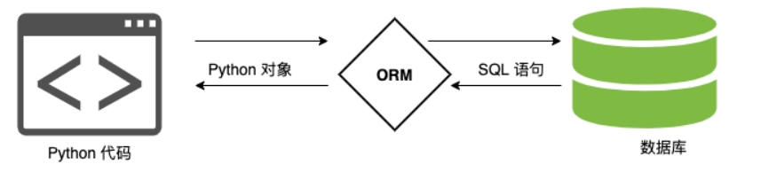
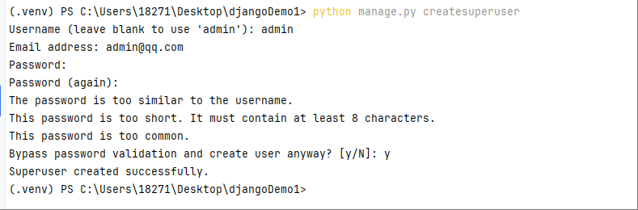
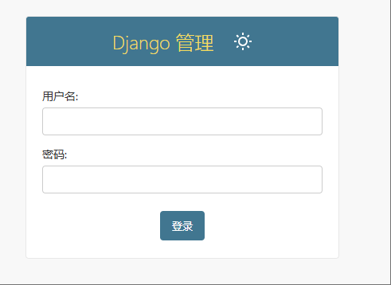
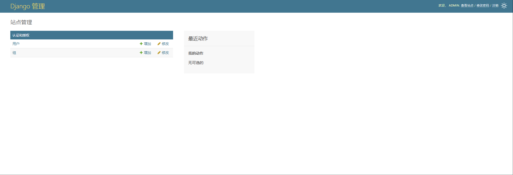
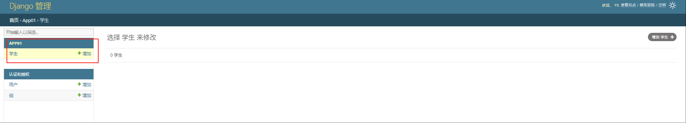

[toc]

# Django笔记2


目前最新的Django LTS版本为5.2.3


## Django 模型

Diango框架提供了对各种主流数据库很友好的支持，这些数据库包括PostgreSQL、SQLite、MySQL、MariaDB和Oracle等，Django也为这些数据库提供了统一的API调用接口。

而Diango框架中的模型主要用来关联并操作数据库，Diango模型包含了储存数据的字段与行为,一般每个模型都会映射一张数据库表。

在Django官方文档中，关于Diango模型有如下的说法:
- 一个Django模型相当于一个Python的类，该类继承自diango.db.models.Model
- Diango模型类的每个属性都相当于一个数据库的字段。
- Diango模型会自动生成访问对应数据库的API


### Django 数据库 

#### 连接 sqlite 数据库

Django 默认情况下是可以直接使用 sqlite数据库的。

settings.py 文件中
```py
DATABASES = {
    'default': {
        'ENGINE': 'django.db.backends.sqlite3',
        'NAME': BASE_DIR / 'db.sqlite3',
    }
}

## NAME是SQLite 数据库文件的路径。db.sqlite3 是默认的 SQLite 数据库文件名
```

#### 连接 mysql 数据库

① 安装mysql驱动

```py
# 使用 pymysql 数据库驱动
pip install pymysql
```

若使用 pymysql，需在项目的 `__init__.py` 中添加下面这段代码。作用是让Django内置的ORM能以mysqldb的方式来调用pymysql

```py
# 在项目根目录的 __init__.py 中添加下面这段代码
import pymysql
pymysql.install_as_MySQLdb()
```

② 提前在mysql中创建数据库和数据表。

③ 配置mysql数据库配置

在setting.py中配置数据库的连接信息。Django默认初始配置使用sqlite数据库。因此需要替换为mysql数据库的配置。

```py
# setting.py 文件
# Database 数据库配置
DATABASES = {
    # 使用mysql数据库
    'default': {
        'ENGINE': 'django.db.backends.mysql', #数据库引擎
        'NAME': 'your_database_name',  # 数据库名
        'USER': 'your_username',      # 用户名
        'PASSWORD': 'your_password',  # 密码
        'HOST': 'localhost',          # 主机
        'PORT': '3306',               # 端口
        'OPTIONS': {
            'charset': 'utf8mb4',     # 字符集
        },
    }
}
```

④ 测试连接

```py
python manage.py migrate  # 执行迁移，验证连接是否正常
```

### 定义模型类

在 Django 中，模型是对数据库表的抽象。每个模型类对应一个数据库表，模型类的属性则对应数据库表中的字段。

注意事项
- 模型类通常定义在子工程（子应用）的`models.py`文件中。
- 模型类必须直接或间接继承 django.db.models.Model 类来定义的
- 每个模型类的属性代表数据库表中的字段。


代码如下
```py
from django.db import models
# 定义一个User模型类，以及模型类中的一些属性。
class User(models.Model):
    ## 该主键字段id。Django会为每个模型类生成id主键字段，可以不显式定义。
    id = models.IntegerField(primary_key=True)
    name = models.CharField(max_length=100,verbose_name="姓名")
    phone = models.CharField(max_length=100,verbose_name="手机号")
    idCard = models.CharField(max_length=100,db_column='id_card',verbose_name="身份证号")
    desc = models.TextField(verbose_name="描述",null=True)
    create_time = models.DateTimeField(auto_now_add=True,verbose_name="创建时间")
    updated_time = models.DateTimeField(auto_now=True,verbose_name="更新时间")

    def __str__(self):
        # 当使用print打印模型类对象的输出内容。类似java类的toString方法。
        return self.name

    # 添加 Meta 类定义元数据
    class Meta:
        verbose_name = "用户"  # Admin 界面显示的单数名称（替代默认的 "user"）
        verbose_name_plural = "用户列表"  # 复数名称（替代默认的 "users"）
        db_table = "t_user"  # 自定义数据库表名（Django 默认表名为 {应用名}_{模型类名小写}）
        ordering = ["-create_time"]  # 默认按创建时间倒序排序（最新的在前）

```

- 上面代码中定义一个模型类，该类对应数据库中的一个表。
- 默认情况下 Django 会自动为每个模型类添加一个自增的整数类型主键（字段名为 id），可以不显式自定义主键字段。但在以下场景中可能需要自定义主键：
    - 使用 UUID 作为主键
    - 使用业务唯一编号作为主键
- 每个模型类可以定义多个属性，每个属性对应数据库表中的一个列。
- 每个属性都有一个名称，用于标识该列。属性的名称通常是小写字母，多个单词之间用下划线分隔。
- 每个属性都可以有一些选项，用于指定该属性的默认配置，例如最大长度、是否为空等。


#### 模型类中的常用字段

字段类型用以指定数据库的数据类型，例如Integer、VARCHAR和TEXT这几种比较常用的数据类型。

Diango模型一共内置了多种字段类型,基本能够满足一般的设计需求。Diango模型的主要字段类型说明如下:

> 常用的字段类型如下

自动增长整数
- AutoField:一个自动增加的Integer类型。一般情况下,AutoField类型是不需要直接使用的。
- BigAutoField:类似AutoField类型，一个自动增加的长Integer(64-bit)类型。

整数
- IntegerField:一个Integer类型
- BigIntegerField:一个长Integer类型
- SmallIntegerField:一个SmallInteger类型(-32768~32767)

二进制数据
- BinaryField:一个用来存储二进制数据的类型。

布尔值
- BooleanField:一个用来存储布尔值(True/False)的类型。实际在数据库中用0/1表示。
- NullBooleanField:类似BooleanField(null=True)类型。

浮点数
- FloatField:一个用来存储浮点型数据的类型。

字符串
- CharField:一个用来存储字符串的类型。CharField类型必须额外定义一个表示最大长度的参数（max_length）
- EmailField:一个CharField类型的域，用于表示电子邮件类型。
- TextField:一个用于存储长文本的类型。

日期
- DateTimeField 字段表示年月日时分秒
- TimeField 字段表示时分秒
- DateField 字段表示年月日。

日期类型字段可以额外定义两个可选参数（auto_now和auto_now_add）。其中auto_now参数用表示每次修改时都会自动设置改字段的值为当前时间。auto_now_add参数表示创建时自动填充当前时间，与auto_now属性是互斥的。

文件
- FileField:一个用于文件上传的类型。需要定义两个必选参数（upload_to和 storage）其中upload_to参数表示存储路径,storage参数表示存储对象。
- ImageField:一个用来存储图片文件的类型，继承自FileField类型。需要定义两个必选参数（height_field和width_field）其中height_field参数表示图片的高度，width_field数表示图片的宽度。


> 常用字段属性如下

- max_length属性 指定该字段的最大存储长度。
- null	如果为 True，表示允许为空，默认值是 False。相当于 python 的 None
- blank	如果为 True，则该字段允许为空白，默认值是 False。 相当于 python 的空字符串：""
- db_column	数据表中真实的字段名称，如果未指定，则使用模型类属性的名称。防止数据字段是 python 的关键字。
- db_index	若值为 True, 则在表中会为此字段创建索引，默认值是 False。相当于 SQL 语句中的 key
- default	默认值，当不填写数据时，使用该选项的值作为字段的默认值。
- primary_key	如果为 True，则该字段在表中设置为主键，默认值是 False，一般不用设置，系统默认设置。
- unique	如果为 True，则该字段在表中创建唯一索引，默认值是 False。相当于 SQL 语句中的 unique
- verbose_name：设置该字段在 Admin 后台的显示名称（如 "姓名"）。


#### 模型类中的Meat子类

在Django模型中，在模型类中使用Meta子类用于定义模型类的元数据配置（如后台显示名称、数据库表名、排序规则等）

> 什么是模型的“元数据”呢?

模型的“元数据”即是“所有不是字段的东西”。具体来讲，如排序选项ordering、数据库表名dbtable等这些在模型中都不是必需的,因此通过Meta类来定义,并且在Diango模型中,是否通过添加Meta类来定义元数据也完全是可选的。

示例代码如下
```py
from django.db import models
class User(models.Model):
    id = models.IntegerField(primary_key=True)
    name = models.CharField(max_length=100,verbose_name="姓名")
    # ....

    # 添加 Meta 类给User模型类添加元数据
    class Meta:
        verbose_name = "用户"  # Admin 界面显示的单数名称（替代默认的 "user"）
        verbose_name_plural = "用户列表"  # 复数名称（替代默认的 "users"）
        db_table = "t_user"  # 自定义数据库表名（Django 默认表名为 {应用名}_{模型类名小写}）
        ordering = ["-create_time"]  # 默认按创建时间倒序排序（最新的在前）
```


### 数据迁移

当在Django工程中完成模型类的定义时。就需要通过迁移命令来创建和管理数据库。Django 会根据模型类的定义来自动生成数据库迁移文件并同步到数据库中。

① 创建数据库迁移文件。这个命令会在django工程目录中为模型类生成对应的迁移文件和数据库文件。
```py
python manage.py makemigrations
```

② 应用迁移。这个命令会将迁移应用到你的数据库中。它会更新数据库文件以匹配模型类中的定义。
```py
python manage.py migrate
```


> 数据库回滚迁移操作

在django中针对数据库的每一次数据迁移操作都会在数据库中的django_migrations表中有对应的历史记录。django_migrations表中的app字段表示迁移文件对应的应用名称，name字段表示迁移文件的名称。

```py

python manage.py migrate 应用名 迁移文件名 --fake  # 回滚指定迁移

python manage.py migrate --fake 应用名 zero  # 回滚所有迁移

python manage.py migrate --fake 应用名 迁移文件名 zero  # 回滚指定迁移之前的所有迁移
```

> 数据迁移的的优缺点

优点:
1. 不需要编写表结构的SQL语句，数据迁移过程中自动生成
2. 数据迁移内部自动根据模型类的改动而自动生成SQL语句，并且产生一个记录文件。这个记录文件描述了数据模型的改变过程。并且在数据库中还会生成一张 django_migrations 的迁移记录表。
3. 数据迁移提供了简单的终端命令来实现，只有2个命令。分别是`python manage.py makemigations 与 python manage.py migrate`

缺点:
1. 数据迁移节省了编写SQL语句的时间，但是复杂的表结构，数据迁移也可能无法实现，从而导致无法迁移到数据库中。


## Django ORM

ORM 的作用是描述模型对象和数据库之间的映射，将程序中的模型对象自动持久化到数据库中。

Django框架内嵌了ORM，即Django ORM。Django ORM 在业务逻辑层和数据库层之间充当了桥梁的作用。通过描述模型对象和实体数据库之间的映射的元数据,将程序中的模型对象自动持久化到实体数据库中。

Django ORM的作用
1. Django ORM可以通过数据库迁移来自动创建数据库表。
1. Django ORM会将模型类与数据表进行一对一映射。从而可以通过模型类对象来操控对应的数据表。即可以通过模型类对数据库进行增删改查操作。
3. Django ORM 可以对查询结果进行分组、排序、分页等操作。

如图所示


### 普通查询

从数据库查询数据记录，核心是先获取该模型类的查询管理器对象(`模型类.objects`),然后调用查询管理器对象中的各种方法进行查询。

下面是查询管理器中的各种方法，这些方法的返回值就是返回一个QuerySet对象。

- 模型类.objects.all()：获取所有记录，返回QuerySet对象
- 模型类.objects.values()：获取所有记录并转换成字典对象。可以设置指定字段。
- 模型类.objects.values_list()：获取所有记录并转换成列表对象。可以设置指定字段。
- 模型类.objects.first()：获取第一条记录（无记录抛异常）
- 模型类.objects.last()：获取最后一条记录（无记录抛异常）
- 模型类.objects.count()：获取记录数量
- 模型类.objects.exists()：判断査询集中是否有数据，如果有则返回True，没有则返回False。
- 模型类.objects.count()：统计记录数


代码示例如下
```py
from .models import User

# 查询所有 User 记录（返回 QuerySet对象）
all_users = User.objects.all()

# 取前5条记录（类似 SQL LIMIT 5）（同样 返回 QuerySet对象）
User.objects.all()[0:5]
User.objects.all()[0]  #获取第一条数据
User.objects.all()[:5]  #获取前5条数据
User.objects.all()[1:4]  #获取第2，3，4条数据

# values()：返回指定字段查询结果（返回字典对象）。若没有传参，则返回全部字段的查询结果。
User.objects.values('name', 'age')

# values_list()：返回指定字段查询结果（返回列表对象）。若没有传参，则返回全部字段的查询结果。
User.objects.values_list('name', 'age')

# 取最新一条 User 记录（根据模型 Meta 的 ordering）
User.objects.first()

# 取最早一条 User 记录（根据模型 Meta 的 ordering）
User.objects.last()

# count()：统计记录数
User.objects.filter(department='技术部').count()

# 支持链式调用
User.objects.filter(age__gt=20).exclude(name='张三')

```

> QuerySet 对象介绍

QuerySet 是Django ORM提供的查询结果集对象，表示从数据库获取的对象集合。具有以下重要特性：
- 惰性执行：QuerySet对象不会立即访问数据库，直到执行操作时（如打印输出、循环遍历、切片、序列化等）才会真正执行SQL查询。
- 缓存机制：QuerySet对象首次求值后会缓存结果，后续重复使用相同QuerySet对象时不会重复查询数据库。
- 切片操作：QuerySet对象支持取下标或切片操作，等同于SQL中的limit和offset语句。例如`User.objects.all()[0:5]`表示查询前5条记录。
- 链式调用：QuerySet对象支持查询方法链式调用，如 `User.objects.filter().exclude().order_by()`
- 转换方法：QuerySet对象可通过`list()`转换为列表，`bool()`判断是否存在数据，`len()`获取长度等

### 条件查询

Django ORM 提供3种方法来实现条件查询。

- 模型类.objects.get(条件运算符=值)：查询单个结果（查不到或找到多个会抛DoesNotExist异常）。
    - get()方法通常使用主键id字段来查询。
- 模型类.objects.filter(条件运算符=值)：查询符合条件的多个结果（返回满足条件的QuerySet）
- 模型类.objects.exclude(条件运算符=值)：查询不符合条件的多个结果（返回不满足条件的QuerySet）,与filter相反。

代码示例如下
```py
from .models import User

# 条件查询单条记录（查询不存在或同时查询存在多条 则会抛 DoesNotExist 异常。可以用try语句进行处理）
try:
    User.objects.get(id=1)          # 根据主键字段查询
    User.objects.get(name="李四")   # 根据name字段查询
except models.User.DoesNotExist:
    print("当前数据不存在")

# 查询姓名包含"张"的 User（模糊匹配）
User.objects.filter(name__contains="张")
# 查询年龄大于20岁的学生（User 模型的 age 字段）
User.objects.filter(age__gt=20)  # gt 表示大于（gt 是 greater than 的缩写）
# 查询年龄小于等于20岁的学生（User 模型的 age 字段）
User.objects.filter(age__lte=20)  # lte 表示小于等于（lte 是 less than or equal to 的缩写）
# 查询年龄在20到30岁之间的学生（age__range）
User.objects.filter(age__range=(20, 30))  # range 表示范围（age__range 表示查询 age 在 20 到 30 之间的学生）
# 查询年龄为20或30岁的学生（age__in）
User.objects.filter(age__in=[20, 30])  # in 表示在列表中的任意一个值（age__in 表示查询 age 在 20 或 30 岁的学生）
# 查询姓名不为空的用户（name__isnull=False）
User.objects.filter(name__isnull=False)  # isnull 表示是否为空（name__isnull=False 表示查询 name 不为空的用户）
# 查询姓名为空的用户（name__isnull=True）
User.objects.filter(name__isnull=True)  # isnull 表示是否为空（name__isnull=True 表示查询 name 为空的用户）

# 排除姓名为"王五"的 User（反向过滤）
User.objects.exclude(name="王五")

```

#### 条件运算符详解

Django ORM 提供丰富的条件运算符用于构建查询条件，以下是常用运算符分类说明

> 精确匹配查询

| 运算符 | 描述  | 示例 | SQL等价 |
|------|-------|-----|------|
| `__exact` | 精确匹配（`__exact`可省略） | `User.objects.filter(name__exact='张三') ` 等价于 `User.objects.filter(name='张三') `  | `name = '张三'` |
| `__iexact`| 不区分大小写的精确匹配 | `User.objects.filter(name__iexact='zhangsan')` | `LOWER(name) = LOWER('zhangsan')` |

> 比较查询

| 运算符 | 描述  | 示例  | SQL等价   |
|------|--------|---------|---------|
| `__gt`  | 大于 greater than | `User.objects.filter(age__gt=20)`    | `age > 20`   |
| `__gte` | 大于等于  greater than equal | `User.objects.filter(age__gte=18)`  | `age >= 18`  |
| `__lt` | 小于 less than | `User.objects.filter(age__lt=60)`  | `age < 60`  |
| `__lte` | 小于等于 less than equal | `User.objects.filter(age__lte=30)`  | `age <= 30` |

注意：可以通过exclude方法来实现不等于的条件查询。

> 字符串匹配查询(模糊查询)

| 运算符  | 描述 | 示例 | SQL等价  |
|-------|------|-----|------|
| `__contains` | 包含指定字符串（区分大小写） | `User.objects.filter(name__contains='张')` | `name LIKE '%张%'`|
| `__icontains` | 包含指定字符串（不区分大小写）| `User.objects.filter(name__icontains='zhang')` | `LOWER(name) LIKE '%zhang%'` |
| `__startswith` | 以指定字符串开头（区分大小写）| `User.objects.filter(name__startswith='张')` | `name LIKE '张%'` |
| `__istartswith`| 以指定字符串开头（不区分大小写）| `User.objects.filter(name__istartswith='zhang')` | `LOWER(name) LIKE 'zhang%'` |
| `__endswith`  | 以指定字符串结尾（区分大小写）| `User.objects.filter(name__endswith='三')` | `name LIKE '%三'` |
| `__iendswith` | 以指定字符串结尾（不区分大小写）| `User.objects.filter(name__iendswith='san')` | `LOWER(name) LIKE '%san'` |

> 范围查询

| 运算符 | 描述 | 示例 | SQL等价 |
|--------|----------|--------|-------|
| `__in` | 在指定列表中  | `User.objects.filter(age__in=[20,25,30])` | `age IN (20,25,30)` |
| `__range`  | 在指定范围内  | `User.objects.filter(age__range=(20,30))` | `age BETWEEN 20 AND 30` |

> 空值查询

| 运算符 | 描述 | 示例 | SQL等价 |
|-------|----------|------|----|
| `__isnull`| 是否为NULL | `User.objects.filter(email__isnull=True)` | `email IS NULL`  |

> 关联查询

| 运算符 | 描述 | 示例  | SQL等价 |
|--------|----------|----------|--------|
| `__fk`  | 外键关联查询 | `User.objects.filter(department__name='技术部')` | `INNER JOIN department ON ...` |

> 日期时间查询

| 运算符  | 描述  | 示例  | SQL等价  |
|-----|-------|-------|--------|
| `__year` | 年份匹配    | `User.objects.filter(create_time__year=2025)` | `EXTRACT(YEAR FROM create_time) = 2025 ` |
| `__month` | 月份匹配  | `User.objects.filter(create_time__month=6)` | `EXTRACT(MONTH FROM create_time) = 6` |
| `__day`  | 日期匹配 | `User.objects.filter(create_time__day=15)` | `EXTRACT(DAY FROM create_time) = 15` |
| `__date` | 年月日匹配 | `User.objects.filter(create_time__date='2025-07-15')` | `DATE(create_time) = '2025-07-15'` |
| `__time` | 时间匹配 | `User.objects.filter(create_time__time='14:30:00')` | `TIME(create_time) = '14:30:00'` |
| `__date__range` | 年月日范围匹配 | `User.objects.filter(create_time__date__range=('2025-07-01', '2025-07-15'))` | `create_time BETWEEN '2025-07-01' AND '2025-07-15'` |
| `__time__gte` | 时间大于等于 | `User.objects.filter(create_time__time__gte='14:30:00')` | `TIME(create_time) >= '14:30:00'` |
| `__time__lt` | 时间小于 | `User.objects.filter(create_time__time__lt='18:00:00')` | `TIME(create_time) < '18:00:00'` |

示例
```python
# 查询2025年7月1日到15日之间的记录（包含边界）
User.objects.filter(create_time__date__range=('2025-07-01', '2025-07-15'))

# 查询7月1日14:30到7月15日18:00之间的精确范围
User.objects.filter(
    create_time__gte='2025-07-01 14:30:00',
    create_time__lte='2025-07-15 18:00:00'
)

# 查询下午2点到6点之间的记录（左闭右开区间）
User.objects.filter(
    create_time__time__gte='14:00:00',
    create_time__time__lt='18:00:00'
)

# 查询创建时间在上午9点之后的记录
User.objects.filter(create_time__time__gte='09:00:00')
```

注意：
- 日期时间查询需确保模型类中对应的字段类型为DateTimeField或TimeField
- 使用__date和__time时传入参数应为字符串格式。
- 时区敏感查询需配合django.utils.timezone配置来使用

> 正则查询

| 运算符 | 描述   | 示例  | SQL等价    |
|-------|---------|-------|-------|
| `__regex`  | 正则匹配（区分大小写） | `User.objects.filter(name__regex=r'^张')` | `name REGEXP '^张'` |
| `__iregex` | 正则匹配（不区分大小写） | `User.objects.filter(name__iregex=r'^zhang')` | `name REGEXP '^zhang'` |


### 复杂条件查询

在 Django ORM 里，F 对象和 Q 对象是非常实用的工具，可用于构建复杂的查询条件。

#### F对象

F 对象能引用模型字段的值，在数据库层面进行字段和字段之间的比较和操作，从而无需将数据查询出来后进行对比和操作。

F对象的使用场景
- 字段和字段之间的比较
- 批量操作字段值
- 关联字段引用

代码示例如下
```py
from django.db.models import F
from .models import User,Order,Product

# 查询年龄大于身份证号码长度的用户
# 是将年龄字段的值与身份证号码长度进行比较
users = User.objects.filter(age__gt=F('idCard__length'))

# 将所有用户的年龄加 1
# 是将所有用户的年龄字段的值加上 1
User.objects.update(age=F('age') + 1)

# 查询订单价格大于对应产品价格的订单
# 是将订单表中的价格字段与产品表中的价格字段进行比较
orders = Order.objects.filter(price__gt=F('product__price'))

```

#### Q对象

Q 对象可用于构建复杂的逻辑查询，支持使用逻辑运算符（& 表示 AND，| 表示 OR，~ 表示 NOT）组合多个查询条件。

代码示例如下
```py
from django.db.models import Q
from .models import User

# 查询姓名为张三或者年龄大于 20 的用户
users = User.objects.filter(Q(name='张三') | Q(age__gt=20))

# 查询姓名为张三并且年龄大于 20 的用户
users = User.objects.filter(Q(name='张三') & Q(age__gt=20))

# 查询姓名不为张三的用户
users = User.objects.filter(~Q(name='张三'))

# 查询姓名为张三或者年龄大于 20，并且邮箱不为空的用户
users = User.objects.filter((Q(name='张三') | Q(age__gt=20)) & Q(email__isnull=False))

```

### 排序查询

在 Django ORM 里，排序查询可借助 `order_by()` 方法对查询结果进行排序，该方法支持多种排序规则，能满足不同场景需求。

使用方式如下
- order_by() 方法默认按升序排序，若要降序排序，可在字段名前加 `-` 符号。
- order_by() 方法支持传入多个字段，会先按第一个字段排序，若该字段值相同，再按第二个字段排序，依此类推。
- 使用 ? 作为 order_by() 方法的参数，可实现随机排序。
- 可以结合 F 对象对字段进行计算后再排序。

```python
from .models import User
from django.db.models import F

# 按年龄升序排序
users_asc = User.objects.order_by('age')

# 按年龄降序排序
users_desc = User.objects.order_by('-age')

# 先按年龄升序排序，年龄相同时按姓名升序排序
users = User.objects.order_by('age', 'name')

# 先按年龄降序排序，年龄相同时按姓名降序排序
users = User.objects.order_by('-age', '-name')

# 随机排序用户
random_users = User.objects.order_by('?')

# 按年龄加 5 后的结果升序排序
users = User.objects.order_by(F('age') + 5)

```


### 聚合

聚合用于对查询的数据进行统计计算，常用于生成汇总数据。

Django 提供了两种主要的聚合的方式。
- **整个查询集聚合**: 使用 `aggregate()` 方法对整个查询集进行聚合
- **分组聚合**：使用 `annotate()` 方法对分组后的数据进行聚合。此处的分组需要通过values()方法对查询后的数据进行分组。

除此之外Django 还提供以下内置聚合函数
- `Count`：计数
- `Sum`：求和
- `Avg`：平均值
- `Max`：最大值
- `Min`：最小值
- `StdDev`：标准差
- `Variance`：方差

注意事项：
1. 使用 values() 方法进行分组时，要放在 annotate() 方法之前。即先分组后聚合。
2. 聚合字段的别名不要与模型原有字段重名

#### 整个查询集聚合

```python
from django.db.models import Count, Avg, Max

# 统计用户总数
User.objects.aggregate(total_users=Count('id'))

# 多维度统计（平均年龄、最大年龄，用户总数）
User.objects.aggregate(
    avg_age=Avg('age'),
    max_age=Max('age'),
    total_users=Count('id')
)

# 带过滤条件的聚合（先过滤查询后聚合）
# 先查询出年龄大于20的用户，再统计人数
User.objects.filter(age__gt=20).aggregate(total_users=Count('id'))
# 先查询出年龄大于20的用户，再统计平均年龄
User.objects.filter(age__gt=20).aggregate(avg_age=Avg('age'))

# 聚合返回的是字典对象
result = User.objects.aggregate(avg_age=Avg('age'))
print(result['avg_age'])  # 访问具体聚合结果

```

#### 分组聚合

```py
from django.db.models import Count

# 先根据部门分组，再统计每个部门的用户数量
# 再根据统计结果逆序排序（即用户数量最多的部门排在前面）
User.objects.values('department').annotate(
    user_count=Count('id')
).order_by('-user_count')


# 先根据部门分组，再根据性别分组，然后统计每个部门每个性别的用户数量
User.objects.values('department', 'gender').annotate(
    user_count=Count('id')
)
```

### 执行原生SQL查询语句

当无法满足复杂查询需求时，Django ORM 可以使用raw()方法来直接执行原生SQL查询语句。

注意事项
1. SQL注入防护：务必使用参数化查询，避免字符串拼接。
2. 结果处理：raw()方法直接返回模型对象。
3. 跨数据库兼容：注意不同数据库的SQL语句的差异。

```python
from django.db import models
from .models import User

# 基本查询
users = User.objects.raw('SELECT * FROM t_user WHERE age > %s', [20])

# 关联查询示例
query_sql = '''
    SELECT u.*, d.name AS dept_name 
    FROM t_user u
    JOIN department d ON u.dept_id = d.id
    WHERE u.create_time > %s
'''
users = User.objects.raw(query_sql, ['2025-01-01'])

# 遍历查询结果
for user in users:
    print(user.name, user.dept_name)  # 通过模型对象访问字段

```


### 插入

插入记录，分单条和批量两种场景。

- 模型类对象.save()：保存单个对象（需先实例化一个模型类对象）
- 模型类.objects.create()：快速创建并保存对象。
- 模型类.objects.bulk_create():批量插入数据
- 模型类.objects.get_or_create():存在则获取，不存在则创建

```py
from .models import User  # 导入 User 模型类

# 方式一
# 创建 User 对象
new_user = User(name="张三",phone="XXXXXXX",idCard="XXXXXXX",desc="测试用户")
new_user.save()  # 执行save方法插入对象到数据库中


# 方式二
# 直接使用create()方法来创建 User 记录
User.objects.create(
    name="王五",
    phone="13900139000",
    idCard="110101199501015678",
    desc="另一个测试用户"
)

# 方式三
# 批量创建 User 记录（无需手动 save）
User.objects.bulk_create([
    User(name="张三", phone="13900139000", idCard="110101199501015678", desc="测试用户1"),
    User(name="李四", phone="13900139001", idCard="110101199501015679", desc="测试用户2"),
    # ... 可以添加更多用户
])

# 方式四
# get_or_create()：存在则获取，不存在则创建
obj, created = User.objects.get_or_create(name="张三")

```

### 更新

更新已存在的记录，分单条和批量两种场景。

- 模型类对象.save()：更新单个对象（需先查询）
- 模型类.objects.update()：批量更新（直接操作数据库）
- 模型类.objects.update_or_create()：存在则更新，不存在则创建

```py
from .models import User

# 单条更新 User(先查询后更新)
user = User.objects.get(id=1)
user.phone = "18800188000"  # 修改手机号
user.desc = "更新后的描述"
user.save()  # 执行数据库更新

# 批量更新所有姓名含"张"的 User 的描述
User.objects.filter(name__contains="张").update(desc="批量更新的描述")

# 批量将年龄大于20的用户年龄+1
User.objects.filter(age__gt=20).update(age=models.F("age") + 1)

# 先查询是否有张三这条记录，有则返回查询结果。没有则创建再返回查询结果
User.objects.update_or_create(name='张三')
```

### 删除

- 模型类对象.delete()：删除单个对象（先查询后删除）
- 模型类.objects.delete()：删除全部对象
- 模型类.objects..filter(条件).delete()：删除指定的批量对象（先查询后删除）

注意：

```py
from .models import User

# 删除 id=1 的 User（需先查询
user = User.objects.get(id=1)
user.delete()  # 执行删除

# 批量删除所有姓名含"张"的 User(先查询后删除)
User.objects.filter(name__contains="张").delete()

# 这样操作的话，会直接删除全表数据。慎用。
User.objects.delete()

```


## Django ORM 关联模型

Django ORM 支持三种主要的模型关联方式，用于处理表与表之间的三种关联关系(一对一、一对多、多对多)。

### 一对一关联模型

一对一关联用于表示两个模型类之间**唯一且双向**的对应关系（如用户与用户详情）。通过 `OneToOneField` 字段实现，其核心是在数据库层面建立唯一外键约束。

> 使用场景

- 扩展基础模型：将不常用的扩展字段（如手机号、头像）从主模型（如用户）中分离，避免主模型字段冗余。
- 敏感数据隔离：将敏感信息（如用户的身份证号、用户的支付密码）单独存储，通过一对一关联访问，提升安全性。
- 模型继承替代：相比 Django 的抽象基类或多表继承，一对一关联更灵活，支持动态绑定不同扩展模型。
- 资源独占关联：如用户与唯一的身份信息、订单与唯一的物流信息。

> 创建一对一关联模型

```py
from django.db import models

# 主模型（用户基础信息）
class User(models.Model):
    username = models.CharField(max_length=50, unique=True, verbose_name="用户名")
    email = models.EmailField(verbose_name="邮箱")

    class Meta:
        db_table = 't_user'
        verbose_name = "用户"
        verbose_name_plural = "用户列表"

# 从模型（用户扩展信息）
class UserProfile(models.Model):
    # 一对一关联字段（主模型为 User）
    user = models.OneToOneField(
        'User',  # 关联目标模型（字符串引用支持跨文件/未定义模型）
        on_delete=models.CASCADE,  # 主对象删除时，级联删除对应的从对象
        related_name='profile',    # 正向查询属性名（User实例可以通过 .profile 访问UserProfile实例）
        primary_key=True,          # 作为当前模型的主键（替代自动生成的id）
        db_column='user_id',       # 数据库列名（实际存储为 user_id）
        verbose_name='关联用户'    # Admin后台管理模块中显示的名称
    )
    mobile = models.CharField(max_length=20, verbose_name="手机号")
    address = models.TextField(verbose_name="联系地址", blank=True)

    class Meta:
        db_table = 't_user_profile'
        verbose_name = "用户详情"
        verbose_name_plural = "用户详情列表"

```


> OneToOneField字段参数详解

| 参数名  | 说明   | 必选 | 默认值  | 示例值 |
|--------|------|------|--------|--------|
| `to`  | 关联的目标模型（可使用字符串引用未定义的模型） | 是   | -   | `'User'` 或 `User`  |
| `on_delete`  | 主对象删除时的级联策略（必须显式指定） | 是  | -  | `models.CASCADE`（级联删除）  |
| `related_name`  | 正向查询时的属性名（未指定时默认使用 `模型名小写`） | 否  | `模型名小写` | `'profile'`  |
| `primary_key`  | 是否将该字段作为当前模型的主键（用于替代默认生成的 `id`主键字段）| 否 | `False` | `True` |
| `db_column`   | 数据库中存储的列名（默认使用字段名） | 否  | 字段名 | `'user_id'` |
| `unique`  | 是否强制字段唯一性（Django 推荐使用此参数替代 `primary_key`）| 否   | `False` | `True`  |
| `verbose_name`  | Admin 后台显示的字段名称  | 否 | 字段名 | `'关联用户'`|

> OneToOneField字段参数的注意事项：
- 唯一性约束：OneToOneField字段 会自动在数据库中创建唯一索引（UNIQUE），确保每个主对象最多关联一个从对象。
- 级联策略：on_delete 参数需根据业务需求选择。
    - models.CASCADE：主对象删除时，级联删除所有关联的从对象。
    - models.PROTECT：主对象存在关联从对象时，阻止删除主对象（抛异常）。
    - models.SET_NULL：主对象删除时，将从对象的外键字段置为NULL（需配合null=True）。
    - models.SET_DEFAULT：主对象删除时，将从对象的外键字段设为默认值（需配合default参数）。
    - models.DO_NOTHING：主对象删除时，不做任何操作（可能导致数据库外键约束错误）。
- 正向查询：若未指定 related_name，主对象通过 从模型名小写 访问从对象（如 user.userprofile）。
- 主键替代：若设置 primary_key=True，当前模型将不再自动生成 id 字段，需确保关联字段的唯一性。
- 性能优化：查询时使用 select_related('user') 预加载关联对象，避免 N+1 查询问题。


> 一对一关联模型的用法

```py
from .models import User, UserProfile

# 创建关联数据（先创建主对象，再创建从对象）
user = User.objects.create(username="张三", email="xxxxxxx")
profile = UserProfile.objects.create(
    user=user,  # 创建从对象的时候，这里直接关联主对象实例
    mobile="1xxxxxxx",
    address="xxxx"
)

# 正向关联查询（主对象 → 从对象）
user = User.objects.get(username="张三")
print(user.profile.mobile)  # 输出：1xxxxxxx（通过 related_name 参数设置的值来进行关联访问）

# 反向关联查询（从对象 → 主对象）
profile = UserProfile.objects.get(mobile="1xxxxxxx")
print(profile.user.username)  # 输出：张三（直接通过关联字段访问）

# 级联删除验证（删除主对象时，从对象自动删除）
User.objects.filter(username="张三").delete()

```

### 一对多关联模型

一对多关联用于表示**一个主模型实例对应多个从模型实例**的关系（如一个部门对应多个员工、一个学校对应多个学生）。通过 `ForeignKey` 字段在从模型中定义外键，实现数据库层面的多对一约束。

> 创建一对多关联模型

```python
from django.db import models

# 主模型（部门）
class Department(models.Model):
    name = models.CharField(max_length=50, unique=True, verbose_name="部门名称")
    desc = models.TextField(verbose_name="部门描述", blank=True)

    class Meta:
        db_table = 't_department'
        verbose_name = "部门"
        verbose_name_plural = "部门列表"

    def __str__(self):
        return self.name

# 从模型（员工）
class Employee(models.Model):
    name = models.CharField(max_length=50, verbose_name="姓名")
    age = models.PositiveIntegerField(verbose_name="年龄")

    # 一对多关联字段（外键指向Department）
    department = models.ForeignKey(
        'Department',  # 关联目标模型
        on_delete=models.CASCADE,  # 级联删除策略
        related_name='employees',  # 正向查询属性名（部门实例通过 .employees 访问员工实例）
        db_column='dept_id',       # 数据库存储的列名
        verbose_name='所属部门',    # Admin显示名称
        null=True,                 # 允许为空（表示未分配部门）
        blank=True                 # 表单提交时允许为空
    )

    class Meta:
        db_table = 't_employee'
        verbose_name = "员工"
        verbose_name_plural = "员工列表"

    def __str__(self):
        return self.name

```

> ForeignKey字段参数详解

| 参数名 | 说明 | 必选 | 默认值 | 示例值 | 
|------|---------|------|--------|------| 
| to | 关联的目标模型（可使用字符串引用未定义的模型） | 是 | - | 'Department' 或 Department | 
| on_delete | 主对象删除时的级联策略（必须显式指定） | 是 | - | models.CASCADE（级联删除） | 
| related_name | 正向查询时的属性名（未指定时默认使用 模型名小写_set） | 否 | 模型名小写_set | 'employees' | 
| db_column | 数据库中存储的列名（默认使用字段名） | 否 | 字段名 | 'dept_id' | 
| null | 是否允许字段值为NULL（数据库层面） | 否 | False | True（允许未分配部门） | 
| blank | 是否允许表单提交时空值（业务逻辑层面） | 否 | False | True（表单允许不填部门） | 
| limit_choices_to | 限制外键可选值（通过Q对象定义筛选条件） | 否 | - | Q(name__contains='技术') | 
| verbose_name | Admin 后台显示的字段名称 | 否 | 字段名 | '所属部门' |


> 一对多关联模型的用法

```py
from .models import Department, Employee

# 创建关联数据（先创建主对象，再创建从对象）
tech_dept = Department.objects.create(name="技术部", desc="负责系统开发")
Employee.objects.bulk_create([
    Employee(name="张三", age=28, department=tech_dept),
    Employee(name="李四", age=30, department=tech_dept),
    Employee(name="王五", age=25, department=None)  # 未分配部门的员工
])

# 正向访问（主对象 → 从对象）
dept = Department.objects.get(name="技术部")
print(dept.employees.count())  # 输出：2（部门实例通过通过 related_name 访问关联的员工实例）
for emp in dept.employees.all():
    print(emp.name)  # 输出：张三、李四

# 反向访问（从对象 → 主对象）
emp = Employee.objects.get(name="张三")
print(emp.department.name)  # 输出：技术部（直接通过外键字段访问）


# 带过滤的正向查询（查询技术部中年龄>25的员工）
senior_emps = dept.employees.filter(age__gt=25)
print([emp.name for emp in senior_emps])  # 输出：['张三', '李四']

# 更新关联关系（将王五分配到技术部）
wangwu = Employee.objects.get(name="王五")
wangwu.department = tech_dept
wangwu.save()

# 级联删除验证（删除技术部时，级联删除所有关联员工）
Department.objects.filter(name="技术部").delete()

```

### 多对多关联模型

多对多关联用于表示**两个模型实例之间双向多关联**的关系（如一篇文章可以有多个标签，一个标签可以关联多篇文章；一个用户可以属于多个角色，一个角色可以包含多个用户）。

通过 `ManyToManyField` 字段在任意一个模型类中定义关联，并创建第三方中间表模型类。从而让Django自动管理关联关系，无需手动维护关联数据。


> 使用场景
- 标签系统：文章与标签（一篇文章多个标签，一个标签多篇文章）
- 权限角色：用户与角色（一个用户多个角色，一个角色多个用户）
- 商品分类：商品与分类（一个商品多个分类，一个分类多个商品）
- 社交关系：用户与兴趣组（一个用户有多个兴趣组，一个兴趣组有多个用户）


> 创建多对多关联模型

```py
from django.db import models

# 主模型（文章）
class Article(models.Model):
    title = models.CharField(max_length=200, verbose_name="标题")

    # 多对多关联字段（指定自定义中间表）
    tags = models.ManyToManyField(
        'Tag',  # 关联目标模型
        through='ArticleTag',  # 指定自定义中间表
        related_name='articles',  # 正向查询名
        verbose_name='关联标签'
    )
    class Meta:
        db_table = 't_article'

# 关联模型（标签）
class Tag(models.Model):
    name = models.CharField(max_length=50, unique=True, verbose_name="标签名")
    class Meta:
        db_table = 't_tag'

# 自定义中间表模型（存储关联信息）
class ArticleTag(models.Model):
    article = models.ForeignKey(Article, on_delete=models.CASCADE, verbose_name="文章")  # 外键指向Article
    tag = models.ForeignKey(Tag, on_delete=models.CASCADE, verbose_name="标签")  # 外键指向Tag
    create_time = models.DateTimeField(auto_now_add=True, verbose_name="关联时间")  # 额外字段
    creator = models.CharField(max_length=50, verbose_name="创建人")  # 额外字段

    class Meta:
        db_table = 't_article_tag'
        unique_together = ('article', 'tag')  # 确保文章与标签唯一关联（避免重复关联）
```


> ManyToManyField字段参数详解

| 参数名 | 说明 | 必选 | 默认值 | 示例值 | 
|--------|-------|------|--------|----| 
| to | 关联的目标模型（可使用字符串引用未定义的模型） | 是 | - | 'Article' 或 Article | 
| related_name | 正向查询时的属性名（默认使用 模型名小写_set） | 否 | 模型名小写_set | 'tags' | 
| symmetrical | 自关联时是否对称（仅适用于自关联模型） | 否 | True | False（非对称自关联） | 
| through | 指定自定义中间表（用于需要存储额外关联数据的场景） | 否 | - | 'ArticleTag'（自定义中间表）推荐使用自定义中间表 | 
| blank | 是否允许字段值为空（业务逻辑层面） | 否 | False | True（允许标签无关联文章） | 
| verbose_name | Admin 后台显示的字段名称 | 否 | 字段名 | '关联文章' |

> ManyToManyField字段的注意事项

- 必须保留 ManyToManyField字段：它是多对多关联模型的基础，Django ORM 依赖它提供关联操作的API。
- through 是扩展点：通过 through 指定自定义中间表，允许存储额外业务数据。
- 中间表模型需包含外键：必须包含两个外键字段（分别指向关联的两个模型），否则会报错。

> 多对多关联模型的用法

```py
from .models import Article, Tag, ArticleTag

# 创建
# 创建文章和标签对象和中间表对象
article = Article.objects.create(title="Django高级")
tag = Tag.objects.create(name="进阶")
ArticleTag.objects.create(
    article=article,
    tag=tag,
    creator="管理员",
)

# 查询
# 查询文章
article = Article.objects.get(title="Django高级")
# 查询文章关联的文章标签
article_tags = ArticleTag.objects.filter(article=article)
# 遍历
for at in article_tags:
    # ...

# 更新
# 查询文章和标签关联的文章标签
article_tag = ArticleTag.objects.get(article=article, tag=tag)
# 修改文章标签的创建人数据
article_tag.creator = "编辑用户"
# 更新数据
article_tag.save()

# 删除关联的中间表记录
ArticleTag.objects.filter(article=article, tag=tag).delete()

```

## Django ORM 虚拟外键

虚拟外键是Django ORM中一种特殊的关联方式，**仅通过ORM层面模拟外键行为，但不在数据库层面创建实际的外键约束**。它适用于需要灵活关联关系但不希望受数据库外键限制的场景。

Django ORM 中通过`ForeignKey`字段的`db_constraint`参数实现虚拟外键（默认`db_constraint=True`会创建数据库外键）：

> 虚拟外键的核心特点

- **无数据库约束**：数据库表中不会生成外键约束（`FOREIGN KEY`），因此允许关联不存在的目标对象（可能导致脏数据）。
- **ORM级关联**：仍可通过Django ORM的`select_related`、`filter`等方法实现关联查询，保持代码层面的关联逻辑。
- **灵活解耦**：适用于跨数据库关联、历史数据保留（如删除主对象后保留从对象记录）等场景。

> 虚拟外键的使用场景

1. **跨数据库关联**：当主模型(主表)和从模型(从表)存储在不同数据库时，无法创建物理外键，需用虚拟外键模拟关联。
2. **历史数据保留**：业务需要保留已删除主对象的从对象记录（如订单删除后仍保留物流记录），避免级联删除。
3. **弱关联业务**：关联关系由业务逻辑保证（如用户与临时标签），无需数据库强制约束。
4. **遗留系统兼容**：与旧系统数据库表结构兼容（旧表无外键约束）。

> 虚拟外键的注意事项

- 数据一致性风险：虚拟外键失去数据库约束，可能导致从对象关联无效的主对象。
- 查询性能：由于无外键索引，关联查询可能变慢，需手动为关联字段添加数据库索引（db_index=True）。
- 级联策略限制：on_delete参数仍有效（如CASCADE会级联删除），但数据库不会自动执行级联操作，需依赖ORM层面实现。
- 迁移影响：修改db_constraint参数需生成迁移文件，但不会修改已有的数据（仅改变数据库约束）。

> 虚拟外键的用法

```py
from django.db import models

# 主模型（部门）
class Department(models.Model):
    name = models.CharField(max_length=50, unique=True, verbose_name="部门名称")
    class Meta:
        db_table = 't_department'

# 从模型（员工，使用虚拟外键关联部门）
class Employee(models.Model):
    name = models.CharField(max_length=50, verbose_name="姓名")

    # 虚拟外键：关闭数据库约束（db_constraint=False）
    department = models.ForeignKey(
        'Department',
        on_delete=models.SET_NULL,  # 主模型实例删除时从对象实例置空（需配合null=True）
        related_name='employees',
        db_constraint=False,       # 关键参数：关闭数据库外键约束
        null=True,                 # 允许为空（主对象删除后置空）
        blank=True
    )

    class Meta:
        db_table = 't_employee'


## ====================================

from .models import Department, Employee

# 1. 正常关联（主对象存在时）
dept = Department.objects.create(name="技术部")
emp = Employee.objects.create(name="张三", department=dept)
print(emp.department.name)  # 输出：技术部（ORM层面正常关联）

# 2. 主对象删除后（从对象仍保留）
dept.delete()
emp = Employee.objects.get(name="张三")
print(emp.department)  # 输出：None（因on_delete=models.SET_NULL）

# 3. 关联不存在的主对象（数据库无约束，允许插入）（假设部门ID=999不存在）
Employee.objects.create(name="李四", department_id=999)  # 不会报错（因为数据库无外键约束）

```


## 中间件MiddleWare

中间件是 Django 请求 / 响应处理机制里的钩子（hooks）框架，是轻量级、底层的插件系统 。

它能在全局改变 Django 的请求输入或响应输出，比如实现权限校验、日志记录、请求限流、添加自定义响应头这类功能，对请求和响应进行统一的预处理和后处理。

> Django 处理 HTTP 请求的大致流程如下

```
HttpRequest（用户请求） → 中间件（按顺序处理请求） → View（视图函数处理） → 中间件（按逆序处理响应） → HttpResponse（返回给用户）
```

也就是说，一个URL请求在视图函数处理前，要依次经过配置的中间件处理；视图处理完生成响应后，响应要按相反顺序再经过中间件处理，之后才返回给客户端 。

比如，你配置了 A、B、C 三个中间件，请求阶段会按 A→B→C 的顺序执行各个中间件里的请求处理逻辑；响应阶段则按 C→B→A 的顺序执行各个中间件里的响应处理逻辑 。


> Django提供两种中间件自定义方式

- 函数式中间件
- 类中间件

### 函数式中间件

① 创建一个xxx_middleware.py文件，在该文件中编写自定义中间件的代码。

示例如下
```py
def simple_middleware(get_response):
    """
    simple_middleware 自定义中间件的名称

    get_response 这个参数可以理解为视图

    middleware(request)方法就是中间件的具体业务方法。request就是请求本身
    """

    # 一次性初始化配置（服务器启动时执行，只会执行一次）
    print("中间件初始化，这段只执行一次")

    def middleware(request):
        # 1. 请求到达视图前执行的逻辑
        print("请求处理前的逻辑，每次请求都会执行")

        # 2. 传递请求给下一个中间件或视图，获取响应
        response = get_response(request)  

        # 3. 响应返回给客户端前执行的逻辑
        print("响应处理后的逻辑，每次响应都会执行")

        return response

    return middleware
```

> 自定义中间件工作流程
1. 服务器启动时，simple_middleware 外层函数执行，做初始化（如打印 “中间件初始化，只执行一次” ），返回 middleware 内层函数。
2. 每次有请求时，先执行 middleware 里 “请求处理前的逻辑”，再通过 get_response 把请求传递给下一个中间件或视图。
3. 视图处理完生成响应后，回到当前中间件执行 “响应处理后的逻辑”，最后返回响应。


② 将自定义中间件注册到Django中

```py
MIDDLEWARE = [
    # 自定义中间件（按需要的顺序添加，假设自定义中间件在myapp子应用目录中）
    'myapp.middleware.simple_middleware',  
]
```


### 类中间件

自定义的类中间件需要继承MiddlewareMixin类。

示例如下
```py
from django.utils.deprecation import MiddlewareMixin

class CustomMiddleware(MiddlewareMixin):
    def __init__(self, get_response):
        # 初始化，保存 get_response 方法，服务器启动时执行
        self.get_response = get_response
        print("类式中间件初始化，只执行一次")

    def process_request(self, request):
        # 请求到达视图前执行（按中间件顺序依次执行）
        print("process_request：请求处理前逻辑")
        # 返回 None 则继续往下走；返回 HttpResponse 则直接返回响应，不再执行后续中间件和视图
        return None  

    def process_view(self, request, view_func, view_args, view_kwargs):
        # 视图函数调用前执行（在 process_request 之后，视图执行前）
        print(f"process_view：即将调用视图 {view_func.__name__}")
        # 返回 None 则继续执行视图；返回 HttpResponse 则直接返回响应
        return None  

    def process_exception(self, request, exception):
        # 视图执行过程中抛出异常时执行
        print(f"process_exception：捕获到异常 {exception}")
        # 返回 None 则继续抛出异常给下一个中间件；返回 HttpResponse 则返回自定义响应
        return None  

    def process_response(self, request, response):
        # 响应返回给客户端前执行（按中间件逆序执行）
        print("process_response：响应处理后逻辑")
        # 必须返回 response 对象
        return response  
```

在项目 settings.py 的 MIDDLEWARE 列表里添加自定义中间件
```py
MIDDLEWARE = [
    # 自定义中间件（按需要的顺序添加）
    'myapp.middleware.CustomMiddleware',  
]
```


## Django 后台管理

当我们创建好一个Django工程的时候，Django工程会默认自带一个后台管理应用admin，用于管理 Django 工程中的数据。

Django 自带的后台管理应用admin提供了以下功能：
- 模型管理：可以直接在后台管理页面中对模型进行增删改查操作。
- 权限管理：可以对用户进行权限分组和授权，限制不同用户对不同模型的操作权限。
- 日志查看：可以查看后台管理系统的操作日志，方便排查问题。
- 数据导入导出：可以将数据库中的数据导出为 CSV、JSON 等格式，也可以从 CSV、JSON 等格式文件中导入数据。
- 自定义页面：可以根据项目需求自定义后台管理页面，添加自定义的功能模块。

### 开启默认的后台管理

虽然Django框架默认自带一个后台管理系统（即admin模块）。但是我们还是需要做一些准备工作才能开启Django工程中的后台管理功能。

1. 在项目的 settings.py 文件中，找到 INSTALLED_APPS 列表，添加 'django.contrib.admin' 应用。

```py
INSTALLED_APPS = [
    # ...
    'django.contrib.admin', #
    # ...
]
```

2. 运行数据库迁移命令，创建默认的管理员用户和相关数据表。

```py
python manage.py migrate
```

3. 创建一个管理员账号

默认情况下Django的后台管理应用是没有配置用户名和密码的。需要在命令行中通过如下指令创建管理员账户。

```py
python manage.py createsuperuser
```

如图所示


4. 运行 Django 工程

```py
python manage.py runserver
```

5. 在浏览器中访问 `http://localhost:8000/admin`，输入之前创建的管理员账号密码，即可登录后台管理系统。



6. 如图所示,登录之后可以看到有默认的两个表的数据在可以显示，一个是用户表，一个是用户组表。




### 管理自定义模型数据

Django 后台管理系统默认只显示用户模型和用户组模型的数据。如果我们创建了自定义的模型类，想要在后台管理中显示这些数据，需要进行以下步骤：

1. Django工程创建一个子应用工程。每一个子应用工程类似一个功能模块。

```py
django-admin startapp student
```

2. 创建自定义模型类。并在自定义的模型类中，定义 `__str__` 方法，返回模型对象的字符串表示。这样在后台管理中显示模型对象时，就会显示 `__str__` 方法返回的字符串。

代码示例如下
```py
from django.db import models

class Student(models.Model):
    student_name = models.CharField()  # 学生姓名
    student_age = models.IntegerField()  # 学生年龄
    student_gender = models.BooleanField()  # 学生性别
    created_at = models.DateTimeField(auto_now_add=True) # 创建时间
    updated_at = models.DateTimeField(auto_now=True) # 更新时间
    
    class Meta:
        db_table = 't_student'  # 自定义数据库表名
        verbose_name = '学生'  # 在后台管理中显示的模型名称
        verbose_name_plural = '学生'  # 在后台管理中显示的模型复数名称
        ordering = ['-created_at']  # 指定默认排序字段（按创建时间倒序）

    # 自定义方法（在详情页中显示）
    def __str__(self):
        return self.student_name
```

3. 使用迁移命令，在数据库中创建模型类对应的数据表。

```py
python manage.py makemigrations
python manage.py migrate
```

4. 在子应用工程的 admin.py 文件中，将自定义的模型类注册到后台管理admin模块中。

代码示例如下
```py
from django.contrib import admin
from .models import Student  # 导入自定义的模型类

# 将自定义的模型类到后台管理admin模块中。
admin.site.register(Student)
```

5. 重新运行 Django 工程，刷新后台管理页面，即可看到自定义的模型类数据。




### 自定义后台管理页面

1. 在应用的 admin.py 文件中，注册模型类。

```py
from django.contrib import admin
from .models import MyModel

@admin.register(MyModel)
class MyModelAdmin(admin.ModelAdmin):
    # 自定义列表页显示的字段（默认显示所有字段）
    list_display = ('title', 'author', 'created_at')
    # 自定义搜索字段（根据指定字段进行搜索）
    search_fields = ('title', 'author')
    # 自定义筛选字段（根据指定字段进行筛选）
    list_filter = ('created_at',)
    # 自定义只读字段（在添加或编辑页面禁用指定字段）
    readonly_fields = ('created_at',)
    # 自定义字段集（将字段分组显示）
    fieldsets = (
        ('基本信息', {'fields': ('title', 'author')}),
        ('详细信息', {'fields': ('content', 'created_at')}),
    )
```

2. 重启 Django 开发服务器，刷新后台管理页面，即可看到自定义的模型类。
3. 可以根据需要自定义列表页显示的字段、搜索字段、筛选字段、只读字段等。

### 总结

Django 后台管理系统提供了方便的方式来管理项目中的数据。通过自定义后台管理页面，可以根据项目需求对数据进行增删改查操作，提高开发效率。

注意：自定义后台管理页面需要谨慎操作，确保只有授权的用户才能访问并操作后台管理系统。


