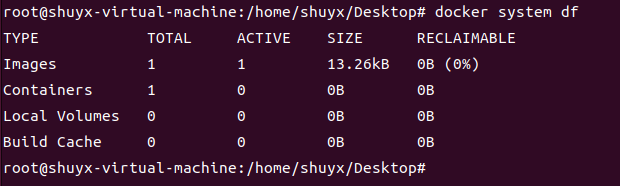

[toc]

# Docker笔记1

## docker介绍

Docker 是一个开源的应用容器引擎，基于 Golang 语言开发，可以让开发者打包自己的应用程序以及依赖包到一个轻量级、可移植的容器中，然后运行在任何流行的 Linux 服务器。

### docker用来解决什么问题？

Docker主要就是解决一个问题：即程序在我的机器上运行时是正常的，但为什么到你的机器上就运行不正常了。

比如你写一个Web应用，本地调试没有任何问题。这时候你想发给其他人试试看或者发布部署到远程的云服务器上查看效果。那么首先需要配置和你本地相同的软件环境，如数据库，Web服务器，必要的插件，库等等。而这还不能保证的你的web应用一定能够运行起来，因为别人可能用完全不同的操作系统，即便是使用Linux每种发行版也会有微小的区别。

因此就出现了一个问题。即如何快速模拟出一个与自己本地环境相同的程序运行环境。

虚拟机可以解决这个问题，但是虚拟机需要模拟硬件运行整个操作系统。不但体积臃肿内存占用高，程序的性能也会受到影响。

现在Docker可以解决这个问题。Docker在概念上与虚拟机非常类似。但是Docker更轻量，它不会去模拟底层的硬件，只会为每一个应用程序提供完全隔离的运行环境。

比如你可以把自己的应用程序和本地环境用docker打包起来。然后提供给其他人使用，其他人可以用docker来运行测试。这样大家都是用的都是你自己打包好的应用程序和本地环境。就不会再出现环境不一致导致的各种问题了。


### docker和虚拟机的区别？

传统虚拟机技术是虚拟出一套硬件后，在其上运行一个完整操作系统，在该系统上再运行所需应用进程；

docker容器技术，本质上也是一种虚拟化技术。只不过，docker容器虚拟的并不是硬件，而是程序及其运行环境。由于容器只需要虚拟一个小规模的环境。因此docker容器启动更快，占用资源更少。

### docker的三个重要概念

Docker有三个重要概念。分别是：Repository（仓库），Image（镜像），Container（容器）。

1. 仓库：仓库用来集中存放镜像。可以类比为手机上的应用市场，市场中存放着各个应用的安装包。
2. 镜像：镜像是用于创建容器的模板文件。镜像可以类比为手机应用市场中的某个软件安装包。
3. 容器：容器就是镜像运行时的程序。可以类比为手机安装包安装后的程序。

#### 仓库

仓库主要是用来存储镜像的。

#### 镜像

镜像是一种轻量级，可独立执行的应用程序包，它包含了应用程序独立运行所需要的的所有内容（包括程序代码，依赖库，运行环境，配置文件等）。我们把这些统统打包成一个文件，这个文件就是image镜像。

例如一个ubuntu镜像就仅仅包括一个最小化的ubuntu操作系统，仅仅只能够满足ubuntu系统本身运行，其他不必要的功能都统统去除的。

例如一个nginx镜像就包括一个最小化的操作系统（如centos，ubuntu等），nginx源代码，nginx依赖库，nginx配置文件等。

#### 容器

docker可以通过镜像文件来创建容器，类似于Java语言中通过模板类来new一个实例对象出来。

例如通过nginx镜像创建出来的一个nginx容器，这个容器只运行了nginx应用程序，其他程序是无法运行。

### docker的架构

Docker使用的是客户端-服务端架构。Docker客户端 与 Docker守护进程（Docker服务端）通信。Docker守护进程主要负责构建、运行和分发 Docker容器等工作。

Docker 客户端和 Docker守护进程可以运行在同一个系统上，也可以分别运行在不同的系统上。即可以将一个 Docker 客户端与一个远程的 Docker 守护进程进行连接。

如图所示


> Docker Client (Docker客户端)

Docker客户端是与Docker服务端进行交互的主要方式。当使用docker run这样的命令时，客户端将这些命令发送到docker服务端，然后将其运行。

> Docker daemon (Docker守护进程，Docker服务端)

这是一个用于监听Docker API请求的进程。它主要用于管理Docker对象，如：映像，容器，网络等。守护进程还可以与其他守护进程通信，从而管理Docker服务。

### docker总结

总结，docker可以将我们的本地开发环境和应用程序进行打包成镜像，上传到仓库中。其他人可以在仓库中下载这个镜像，然后通过自己电脑上的docker将该镜像初始化为容器并运行。这样就解决了由于环境不一致，从而导致的程序无法运行的问题。

## windows 安装 docker

直接在docker官网上搜索Docker Desktop on Windows应用程序安装到本机即可。其他自行百度。

Docker Desktop on Windows这个应用程序会在windows环境上虚拟一个linux环境，然后在linux环境中再安装docker。

### windows中设置容器数据卷

由于windows系统与linux系统不同。因此windows系统中的docker容器如何设置容器数据卷？

例如
```shell
# 创建centos容器并启动
docker run -it -v /d/test:/tmp/test centos
```
- -v /d/test:/tmp/test 会把d盘的test目录与容器中的/tmp/test目录关联到一起。
- /d/ 代表windwos系统的D盘。

注意：当将windows系统中的目录设置为容器数据卷的时候，文件名要符合windows的规定，即不要有空格和‘-’。

## ubuntu 22.04 (LTS) 安装 docker

### 安装docker

Docker需要两个重要的安装要求：
* 它仅适用于64位Linux安装，注意：是64位的Linux系统。
* 它需要Linux内核版本3.10或更高版本。

```shell
# 查询linux内核版本
uname -r

# 查询linux系统是否是64位
sudo uname --m
```


1. 首先更新apt包管理器

```bash
sudo apt update
sudo apt upgrade
sudo apt full-upgrade
```

2. 安装必要的证书并允许 apt 包管理器使用以下命令通过 HTTPS 使用存储库

```bash
sudo apt install apt-transport-https ca-certificates curl software-properties-common gnupg lsb-release
```

3. 添加Docker官方库的GPG密钥到目录中

```bash
curl -fsSL https://download.docker.com/linux/ubuntu/gpg | sudo gpg --dearmor -o /usr/share/keyrings/docker-archive-keyring.gpg  
```

4. 添加Docker官方存储库

```bash
echo "deb [arch=$(dpkg --print-architecture) signed-by=/usr/share/keyrings/docker-archive-keyring.gpg] https://download.docker.com/linux/ubuntu $(lsb_release -cs) stable" | sudo tee /etc/apt/sources.list.d/docker.list > /dev/null
```

5. 先卸载可能存在的或者之前安装的Docker

```bash
sudo apt remove docker docker-engine docker-ce docker.io
```

6. 再次更新apt包管理器，并且安装docker。这里可以切换为阿里云镜像源来加快安装速度。

```bash
sudo apt update
 
sudo apt install docker-ce docker-ce-cli containerd.io docker-compose-plugin
```

7. 验证docker是否安装成功

```bash
## 查看docker 版本
docker version
```


### 启动docker

1. 查看docker的运行状态

```bash
systemctl status docker
```

如图所示是运行状态。


2. 如果docker没有运行。可以运行以下命令启动Docker服务

```bash
sudo systemctl start docker
```

3. 设置Docker服务每次开机时自动启动

```bash
sudo systemctl enable docker
```


### 切换为阿里云镜像源来安装docker

1. 先卸载可能存在的或者为安装成功的Docker版本

```bash
sudo apt remove docker docker-engine docker-ce docker.io
```

2. 添加阿里云的GPG密钥

```bash
curl -fsSL http://mirrors.aliyun.com/docker-ce/linux/ubuntu/gpg | sudo apt-key add -
```

3. 设置存储库

```bash
sudo add-apt-repository "deb [arch=amd64] http://mirrors.aliyun.com/docker-ce/linux/ubuntu $(lsb_release -cs) stable"
```

4. 安装docker

```bash
sudo apt update
 
sudo apt install docker-ce docker-ce-cli containerd.io docker-compose-plugin
```


### docker版本的hello world

下面的命令会下载一个hello-world测试镜像，并在容器中执行一个“hello-world”样例程序。

```bash
sudo docker run hello-world
```

如果你看到类似下方的输出，那么祝贺你，Docker能够正常运行在你的Ubuntu系统中了。


```bash
shuyx@shuyx-virtual-machine:~/桌面$ sudo docker run hello-world
[sudo] shuyx 的密码： 

Hello from Docker!
This message shows that your installation appears to be working correctly.

To generate this message, Docker took the following steps:
 1. The Docker client contacted the Docker daemon.
 2. The Docker daemon pulled the "hello-world" image from the Docker Hub.
    (amd64)
 3. The Docker daemon created a new container from that image which runs the
    executable that produces the output you are currently reading.
 4. The Docker daemon streamed that output to the Docker client, which sent it
    to your terminal.

To try something more ambitious, you can run an Ubuntu container with:
 $ docker run -it ubuntu bash

Share images, automate workflows, and more with a free Docker ID:
 https://hub.docker.com/

For more examples and ideas, visit:
 https://docs.docker.com/get-started/

```


## Centos7安装docker

1. 先安装gcc工具包

```bash
yum -y install gcc
yum -y install gcc-c++
```

2. 卸载系统之前安装的docker,以及相关的依赖项

```bash
# 如果之前装的docker在运行，则先停掉docker
sudo systemctl stop docker

# 删除旧版本的docker安装包
sudo yum remove docker docker-client docker-client-latest docker-common docker-latest docker-latest-logrotate docker-logrotate docker-engine 

# 卸载之前安装的docker安装包
sudo yum remove docker docker-engine docker-ce docker.io

# 删除镜像、容器、配置文件等内容。/var/lib/docker是docker的默认工作路径
sudo rm -rf /var/lib/docker
sudo rm -rf /var/lib/containerd
```

3. 安装yun-utils工具包

```bash
sudo yum install -y yum-utils
```

4. 添加docker仓库到yum源中，仓库地址选择阿里云的。

```bash
sudo yum-config-manager --add-repo http://mirrors.aliyun.com/docker-ce/linux/centos/docker-ce.repo
```

5. 开始安装docker,并启动docker

```bash
sudo yum install docker-ce docker-ce-cli containerd.io
```

6. 启动docker

```bash
sudo systemctl start docker
# 测试是否安装成功
docker version
```

7. 下载并运行docker的官方hello-world镜像

```bash
sudo docker run hello-world
```

## docker的权限问题

当你在终端执行docker命令的时候，可能会出现如图下报错。

`permission denied while trying to connect to the Docker daemon socket at unix.....`


这个问题是由于docker的守护进程使用 Unix Socket 而不是 TCP 端口。而默认情况下，Unix socket 属于 root 用户，因此需要 root权限 才能访问。

所以只要用root用户或者获取root权限的用户来执行docker命令，就不会报错了。

例如下图所示


## docker 常用命令

### docker 帮助命令

```bash
# 启动docker
systemctl start docker

# 停止docker
systemctl stop docker

# 重启docker 
systemctl restart docker

# 查询docker状态
systemctl status docker

# 设置docker开机启动
systemctl enable docker

# 查询docker版本
docker version

# 查询docker信息
docker info

# 查询docker帮助文档
docker --help

# 查询docker某个具体命令的帮助文档
docker 具体命令 --help

```

### docker 镜像命令

> 列出本地镜像

```shell
# 语法
docker images

# 例如 列出docker本地的镜像
docker images 
```


* REPOSITORY 是镜像的仓库源
* TAG 是镜像的版本标签。latest表示最新版本。
* IMAGE ID 是镜像的id号
* CREATED 是镜像的创建时间
* SIZE 是镜像的大小


> 查询某个镜像

该命令会从docker仓库中查询某个进行，默认的docker仓库是dockerhub。

```shell
# 语法
docker search 镜像名称

# 例如 从dockerhub查询hello-world镜像
docker search hello-world
```


* NAME 镜像名称
* DESCRIPTION 镜像描述
* STARS 点赞数
* OFFICIAL 是否为官方的镜像
* AUTOMATED 是否为自动构建的


> 拉取镜像

```bash
# 语法
#下载镜像，没有添加版本号的时候，默认下载最新版本的镜像
docker pull 镜像名[:TAG]

#例如下载最新的redis镜像
docker pull redis
#例如下载最新的redis镜像
docker pull redis:latest
#例如下载reids 6.0.8版本的镜像
docker pull redis:6.0.8
```

> 查询docker中的镜像，容器，数据卷占用的空间

```shell
# 语法
docker system df

# 查询docker中的镜像，容器，数据卷占用的空间
docker system df
```




> 删除镜像

```bash
# 语法如下
#删除镜像
docker rmi 镜像名
#删除多个镜像
docker rmi 镜像名1 镜像名2 镜像名3   
#强制删除镜像
docker rmi -f 镜像名
#删除所有镜像
docker rmi -f $(docker images -qa)

# 例如删除redis镜像
docker rmi redis
# 例如删除redis 6.0.8版本的镜像
docker rmi redis:6.0.8
# 例如根据镜像id来删除镜像
docker rmi fe525da42
```

> 给镜像添加新的标签

docker tag 用于给镜像打标签或者给镜像重命名。

```bash
# 语法格式如下，不写tag,默认为latest
docker tag 原镜像[:TAG] 新镜像[:TAG]

# 例子，给6.2版本的redis镜像，添加一个6.2.1版本标签。
# 命令运行后，会发现6.2.1 redis镜像和6.2redis镜像的ID是相同的。表明这是同一个镜像，但是标签不同。
docker tag redis:6.2 redis:6.2.1
```

如图所示


实际使用场景
* 每次更新镜像时，可以打个新的标签，记录一下当前版本。
* 更改其他人的镜像名称和镜像标签。
* 这样不仅能保存最新版本的镜像，也能保存历史版本的镜像，方便新版本镜像出问题时进行版本回溯。

### docker 容器命令

> 创建容器

```shell
# 创建一个容器并启动，语法格式如下
docker run [可选参数] 镜像名或镜像ID

可选参数如下：
--name="newname" 为容器指定一个新名字。如果不指定名称，则随机生成一个名称。
-d      守护式模式，即后台运行容器并且返回容器ID。
-i      交互式模式，以交互模式启动容器，通常与-t配合使用。
-t      启动容器并提供一个伪输入终端，通常与 -i 配合使用。
-it     运行一个容器，并返回一个终端来进行交互式操作。
-p      小写p,指定主机端口和容器端口进行映射 （例如 -p 主机端口:容器端口）。
-P      大写P,随机一个主机端口与容器端口进行映射。
--dns "8.8.8.8"             设置容器使用的DNS服务器，默认和宿主一致
--dns-search "example.com"  设置容器DNS搜索域名，默认和宿主一致
-h "mars"                   设置容器的hostname
-e username="ritchie"       设置容器中的环境变量
--env-file=[]               从指定文件读入环境变量
-m                          设置容器使用内存最大值
--net="bridge"              设置容器的网络连接类型，支持bridge/host/none/container四种类型
--expose=[]                 设置容器开放的一个端口或一组端口；
--volume                    设置容器绑定的数据卷，与-v相同
-v                          设置容器绑定的数据卷，与--volume相同
--network="网络模式"         设置容器的网络模式，网络模式有四种：host,bridge,none,container。默认不写的情况下是bridge
-net="网络模式"              --network的简写。

#例子：以交互的方式启动ubuntu容器，并在ubuntu容器内执行/bin/bash命令
docker run -it ubuntu /bin/bash
#例子， 创建并后台运行容器，并且重命名
docker run -d --name ubuntu01 ubuntu
```

如图所示，当Ubuntu容器启动后，就进入到了ubuntu容器的终端中。


> 列出容器

```shell
# 语法如下
# 列出当前运行的容器
docker ps
# 列出所有的容器
docker ps -a
# 列出最近创建的容器
docker ps -l
```


> 启动容器

```shell
# 语法
# 根据容器ID，来启动一个容器
docker start 容器ID或容器名称
```

> 停止容器

```shell
# 语法
# 停止容器
docker stop 容器ID或容器名称
```

> 强制停止容器

```shell
# 语法
# 强制停止容器
docker kill 容器ID或容器名称
```

> 重启容器

```shell
# 语法
# 重启容器
docker restart 容器ID或容器名称
```

> 删除容器

```shell
# 语法
# 删除容器
docker rm 容器ID或容器名称
# 强制删除容器
docker rm -f 容器ID或容器名称
# 一次性删除全部容器
docker rm -f $(docker ps -a -q)
docker ps -a -q | xargs docker rm 

```

> 从容器的终端中退出

当你进入到某个容器的终端的时候，有两种方式从容器终端中退出。
```shell
# 方式1，退出并停止容器。这种方式会导致容器停止。
exit
# 方式2，退出容器，这种方式不会导致容器停止。
ctrl + p + q
```

> 进入到容器的终端中

分为两种方式，docker attach和docker exec。

* docker attach 是直接进入容器的终端，不会启动新的进程。因此用exit退出终端的时候，会导致容器的停止。
* docker exec 是在容器中重新打开一个新的终端，这样会启动一个新的终端进程。因此用exit退出终端的时候，不会导致容器的停止。

```shell
# 方式1，进入到容器终端
# 退出的时候会导致容器停止
docker attach -it 容器ID或容器名称 /bin/bash

# 方式2，进入到容器终端
# 退出的时候不会导致容器停止
docker exec -it 容器ID或容器名称 /bin/bash
```

> 查询某个容器的日志

```shell
# 语法如下
#查看容器运行的日志，显示日志条数为n
# -f实时查看，-t显示时间 ，-tail n表示日志条数
docker logs -f 容器ID或容器名称
docker logs –tf –tail n 容器ID或容器名称
```

> 查询容器的内部进程信息和元数据配置信息

```shell
# 语法如下
#查询容器内部的进程信息
docker top 容器ID或容器名称
#查询容器内部元数据配置信息
docker inspect 容器ID或容器名称
```

> 从容器中复制文件到主机中

```shell
# 语法如下
#将容器内特定路径下的文件复制到主机的特定路径中
docker cp <容器id或容器名称>: 容器内路径 目的主机路径		

#例子：将ubuntu01容器中home目录中为java文件拷贝到主机的root目录中
docker cp ubuntu01:/home/a.java /root
```

> 导出容器和导入容器

* docker export命令会把容器的内容导出为一个tar文件。
* docker import命令会把tar文件导入为一个docker镜像。

```shell
# docker export 语法格式
docker export 容器id或容器名称 > 文件名.tar

# docker import 语法格式
cat 文件名.tar | docker import - 用户/镜像名称:镜像版本号
```

```shell
# 导出容器，语法如下
# 将容器快照导出为文件 111.tar。地址为当前目录
docker export 容器id或容器名称 > 111.tar
# 将容器快照导出为文件 222.tar。地址为root目录中
docker export 容器id或容器名称 > /root/222.tar

# 导入容器
# 读取111.tar文件内容，并将其导入为一个镜像，镜像命名为test/ubuntu:v1
cat 111.tar | docker import - test/ubuntu:v1
```

### docker 容器中的运行机制

docker默认会把容器内部第一个进程，也就是pid=1的进程作为容器是否正在运行的依据。如果容器中pid=1的进程挂了，那么docker认为该容器已经停止运行了，之后docker就会把该容器停掉。

如图所示，后台方式启动ubuntu容器后，再次查询显示ubuntu容器已经停止。


这是因为ubuntu容器中没有一个前台进程在运行，从而让docker把ubuntu容器停止了。

因此容器想要后台运行，容器中必须有一个前台进程。并且容器中运行的命令如果不是那些一直挂起的命令（比如运行ping，sleep），那么等到命令执行结束，容器也会被docker停止。


## docker commit命令 将容器构建为镜像

当你创建并运行了一个容器，并且对容器进行了改动。那么如何将这些改动保留下来呢？你可以通过docker commit命令将当前容器的所有内容打包构建为一个新的镜像文件。

例如，官方的ubuntu镜像是没有vim命令的，但是你可以在ubuntu的容器中重新添加vim命令，然后将容器打包构建为一个新的ubuntu镜像。那么这个新的ubuntu镜像就包含了vim命令。

> docker commit 将容器构建为镜像

若通过镜像a生成一个容器,然后去修改容器中的内容,之后用docker commit命令将该容器创建为一个新的镜像b。那么镜像b = 镜像a + 你改动的地方

```shell
# 命令 docker commit 来将容器构建为一个新镜像
# 语法格式
docker commit -m="备注" -a="作者" 容器ID 用户名称/镜像名称:版本标签

# 例子
docker commit -m="add some file" -a="shuyx" feqfe21esdq shuyx/ubuntu001:v1
```

如图所示，通过docker commit命令，将某个容器构建为一个新的镜像。


## dockerhub 官方仓库

dockerhub是docker官方维护的镜像仓库。你可以在dockerhub上下载和上传镜像。

[https://hub.docker.com/](https://hub.docker.com/)


### 将本地镜像上传到dockerhub

1. 注册dockerhub账户。
2. 可以通过docker命令在终端上登录你的dockerhub账户。

```shell
# 登录dockerhub账户
docker login

# 登出dockerhub账户
docker logout
```

如图所示


3. 将本地镜像上传到dockerhub仓库中

```shell
# 语法格式
docker push 用户名/镜像名称:版本标签

# 例子
docker push shuyx/ubuntu-vim:1.0
```


## docker 容器数据卷

容器数据卷就是将容器内的某个目录与容器外（宿主机）的某个目录中进行互相映射（容器内外进行文件数据同步），从而解决删除容器就会导致容器内的文件数据也被删除的问题。

容器数据卷的好处是，当我们想要修改容器内的文件的时候，我们可以不用进入到容器内部修改。通过设置容器数据卷，可以把容器内的目录与宿主机的目录进行互相映射。我们可以直接在容器外修改目录中的文件，该文件的修改就可以直接同步到容器中。

容器数据卷，简而言之就是将容器内的某个目录与宿主机的某个目录进行实时文件同步。从而实现容器数据持久化的目的。

容器数据卷的特点：
* 容器数据卷可以在多个容器之间共享和重用数据。
* 对容器数据卷的修改是实时生效的。即宿主机修改文件会实时生效在容器内的，在容器内修改文件会实时生效在宿主机的。
* 镜像的更新不会影响容器数据卷。

> 如何设置容器数据卷

```shell
# 创建容器的时候可以设置容器数据卷，将某个主机目录与某个容器目录进行互相映射
docker run -v 宿主机绝对目录路径:容器内绝对目录路径 镜像名

# 例如，宿主机和容器的这两个目录中的文件会自动同步
docker run -v /home/webapps:/usr/local/tomcat/webapps tomcat
```

> 设置容器数据卷读写规则

默认情况下，容器数据卷的读写规则是双向的。即容器内目录和宿主机目录都是可以进行读写。但是有时候，我们需要修改容器数据卷的读写规则。让容器内目录只能读，不能写，即只读规则。

简而言之，就是让宿主机的目录可以进行读写，容器内的目录只能进行只读。

这种情况下，在宿主机目录修改文件，可以同步到容器内。但是容器内目录无法修改文件。从而实现单方面同步给容器的功能。

```shell
# 默认情况下，两边目录都是可以读写的,下面两条命令是等价的，上面是简写而已
docker run -v /home/webapps:/usr/local/tomcat/webapps tomcat
docker run -v /home/webapps:/usr/local/tomcat/webapps:rw tomcat

# 限制容器内的读写规则为只读。
docker run -v /home/webapps:/usr/local/tomcat/webapps:ro tomcat
```

> 设置容器数据卷的继承

容器数据卷的继承，即一个新的容器继承另一个容器的容器数据卷。

例如容器A中已经有一个目录与宿主机目录互相映射，此时新建一个容器B，让容器B的容器数据卷的映射目录与容器A的相同。

简而言之，让容器A的目录与容器B的目录，共用一个宿主机的目录。

```shell
# 容器A，设置容器数据卷
docker run --name="A" -v /home/webapps:/usr/local/tomcat/webapps tomcat

# 容器B，继承自容器A的容器数据卷设置
docker run --name="B"  --volumes-from A tomcat
```


## docker安装常用软件

### docker安装nginx

```shell
# 下载nginx镜像
docker pull nginx

# 创建并后台启动nginx镜像的容器
# --name nginx01 镜像重取名
# -p 8081:80 主机的8081端口映射到容器的80端口
# -d 后台运行，默认不会进入容器
# nginx 镜像名，指定生成该容器的镜像
docker run --name nginx01 -p 8081:80 -d nginx

# 进入到该镜像中
docker exec -it nginx01 /bin/bash

# 查询该容器中nginx文件
root@36432ae018b1:/$ whereis nginx 
nginx: /usr/sbin/nginx /usr/lib/nginx /etc/nginx /usr/share/nginx

# 可以在主机访问ip:port来测试nginx是否安装成功
$ curl localhost:3344

<!DOCTYPE html>
<html>
<head>
<title>Welcome to nginx!</title>
<style>
    body {
        width: 35em;
        margin: 0 auto;
        font-family: Tahoma, Verdana, Arial, sans-serif;
    }
</style>
</head>
<body>
<h1>Welcome to nginx!</h1>
<p>If you see this page, the nginx web server is successfully installed and
working. Further configuration is required.</p>

<p>For online documentation and support please refer to
<a href="http://nginx.org/">nginx.org</a>.<br/>
Commercial support is available at
<a href="http://nginx.com/">nginx.com</a>.</p>

<p><em>Thank you for using nginx.</em></p>
</body>
</html>

```

### docker安装tomcat

```shell
# 从官方仓库下载最新的tomcat镜像或者下载特定版本的tomcat
docker pull tomcat

# 查询tomcat镜像是否下载到本地
docker images tomcat

# 创建容器并运行
docker run -d -p 38080:8080 --name="tomcat01" tomcat

# 查询当前正在运行的容器
docker ps

# 最后在宿主机浏览器中访问localhost:38080来查看tomcat的欢迎界面
```

注意：目前最新版的tomcat的/usr/local/tomcat/webapps目录中是没有页面文件的，因此需要把同目录下的webapps.dist目录重命名为webapps目录。此时访问浏览器，才能看到tomcat的欢迎界面的


### docker安装portainer

portainer：管理docker的可视化界面工具

```shell
# 创建并启动portainer容器
docker run -d -p 9000:9000 --restart=always -v /var/run/docker.sock:/var/run/docker.sock --privileged=true portainer/portainer

# portainer/portainer 镜像全名

# --restart选项，可以设置容器的重启策略。
## always重启策略，在容器退出时总是重启容器

# -v 设置数据卷

# --privileged=true 是否在容器中开启root管理员权限。容器默认是不开启root权限的

```

之后，访问http://localhost:9000/，即可进入portainer界面

### docker安装mysql

```shell
# 下载mysql 5.7版本的镜像
docker pull mysql:5.7

# 创建mysql 5.7版本的容器
# --name="mysql01" mysql01 给容器命名
# -d 后台启动
# -e MYSQL_ROOT_PASSWORD=123456 , -e 设置环境变量。此处是设置mysql密码
# -p 33306:3306 , 宿主机的33306端口映射到容器的3306端口
# -v 设置容器数据卷
# /var/log/mysql是存放日志信息的目录
# /var/lib/mysql是存放数据库数据的目录
# /etc/mysql/conf.d是存放配置文件的目录

docker run -d -p 33306:3306 --name="mysql01" -e MYSQL_ROOT_PASSWORD=123456 -v /home/mysql01/log:/var/log/mysql -v /home/mysql01/data:/var/lib/mysql -v /home/mysql01/conf.d:/etc/mysql/conf.d mysql:5.7

# 进入到容器中
docker exec -it mysql01 /bin/bash
# 进入到mysql命令行模式
mysql -uroot -p123456
```

如图所示


> 解决docker中的mysql容器的中文字符编码问题


1. 先进入到mysql容器的mysql终端中
```shell
# 查询容器运行状态
docker ps
# 进入到容器终端
docker exec -it mysql01 /bin/bash
# 登录进入到mysql终端
mysql -uroot -p123456
# 查询mysql的字符集
mysql> SHOW VARIABLES LIKE 'character_set_%';
```


如图所示，由于在mysql容器中的字符编码不是utf8。因此我们需要重新设置mysql的字符编码。由于上面创建mysql容器的时候设置了容器数据卷。因此可以直接在宿主机的/home/mysql01/conf.d目录中创建my.cnf配置文件即可。

2. 在conf.d目录中创建my.cnf配置文件

my.cnf配置文件的内容如下：
```shell
[client]
default-character-set=utf8
[mysql]
default-character-set=utf8
[mysqld]
character-set-server=utf8
```

3. 重新启动mysql容器，让配置文件生效。

```shell
# 重启容器，
docker restart mysql01

# 注意如果配置文件错误，会导致容器重启失败。此时可以查询docker容器日志来寻找原因。
# 查询mysql01容器的日志信息
docker logs mysql01 
```

如图所示，字符编码改为了utf8。


### docker安装redis

<font color='red'>注意：不同版本的redis所对应的配置文件也是不同的。例如redis7版本搭配redis6的配置文件，可能会导致redis容器无法启动。</font>

1. 先创建redis容器映射目录

```shell
# 创建redis映射目录
mkdir /home/redis01
# 创建数据目录
mkdir /home/redis01/data
# 创建配置目录
mkdir /home/redis01/conf
# 进入到配置目录，下载redis.conf官方的配置文件
cd /home/redis01/conf
wget http://download.redis.io/redis-stable/redis.conf
```

2. 修改redis.conf配置文件

先更改配置文件的权限。然后用文本编辑器修改配置文件
```shell
# 进入到配置文件目录中
cd /home/redis01/conf/

# 先更改配置文件的权限,让我们能够修改配置文件
chmod 777 redis.conf
```

主要修改以下部分。
```shell
# 注意，这个要注释掉，使redis可以外部访问
# bind 127.0.0.1 

# 守护进程设置为no,不要设置为yes，否则与docker -d命令冲突，从而导致容器启动失败。
daemonize no
# 给redis设置密码
requirepass 123456
# redis持久化，默认是no，改为yes
appendonly yes
```


3. 创建并启动redis容器

```shell
# 下载redis 7.2版本镜像
docker pull redis:7.2

# 查询镜像
docker images

# 创建容器并启动
# -p 36379:6379 端口映射
# --name="redis01" 容器命名
# -v /home/redis01/conf/redis.conf:/etc/redis/redis.conf 配置文件映射
# -v /home/redis01/data:/data 数据目录映射

# redis-server /etc/redis/redis.conf 在容器启动的时候运行redis-server的命令，用于加载容器内的 conf 文件。
docker run -d --name="redis01" --privileged=true -p 36379:6379 -v /home/redis01/conf/redis.conf:/etc/redis/redis.conf  -v /home/redis01/data:/data redis:7.2 redis-server /etc/redis/redis.conf

# 查询容器是否运行
docker ps

# 查询redis容器日志
docker logs redis01

# 进入到redis01容器的终端中
docker exec -it redis01 /bin/bash
```

#### redis容器中的daemonize no配置问题

在redis的配置文件中，daemonize是关于守护进程的配置。daemonize 设置成yes是将redis以守护线程的方式启动，redis会自动后台运行，但是这个设置的前提是用在宿主机直接启动redis。如果使用docker启动redis时，设置为no即可，否则启动的redis容器就无事可干了，那么容器就会自动关闭。


## docker 安装软件集群

### docker mysql主从集群

在docker中创建两个mysql容器，组成mysql集群，从而实现mysql主从复制。

1. 先创建主从mysql容器的目录

```shell
# 先创建mysql容器映射的目录
mkdir /home/mysql02

# 创建主mysql容器映射的目录
mkdir /home/mysql02/master
mkdir /home/mysql02/master/conf
mkdir /home/mysql02/master/data
mkdir /home/mysql02/master/log

# 创建从mysql容器映射的目录
mkdir /home/mysql02/slave
mkdir /home/mysql02/slave/conf
mkdir /home/mysql02/slave/data
mkdir /home/mysql02/slave/log
```


2. 先在mysql容器的配置目录中创建配置文件my.cnf

主my.cnf配置文件如下
```shell
[mysqld]
#主服务器唯一ID
server-id=120
#启用二进制日志，名称可以随便取（关键）
log-bin=mysql-bin
#设置logbin格式
binlog_format=STATEMENT
```

从my.cnf配置文件如下
```shell
[mysqld]
#从服务器唯一ID
server-id=130
## 开启二进制日志功能，以备Slave作为其它Slave的Master时使用
log-bin=mysql-slave-bin   
#启用中继日志
relay-log=mysql-relay
```

3. 创建并启动主从mysql容器

```shell
# 创建并启动主mysql容器
docker run -d -p 33306:3306 --name="mysql02-master" -e MYSQL_ROOT_PASSWORD=123456 -v /home/mysql02/master/log:/var/log/mysql -v /home/mysql02/master/data:/var/lib/mysql -v /home/mysql02/master/conf/my.cnf:/etc/mysql/my.cnf mysql:5.7


# 创建并启动从mysql容器
docker run -d -p 33307:3306 --name="mysql02-slave" -e MYSQL_ROOT_PASSWORD=123456 -v /home/mysql02/slave/log:/var/log/mysql -v /home/mysql02/slave/data:/var/lib/mysql -v /home/mysql02/slave/conf/my.cnf:/etc/mysql/my.cnf mysql:5.7
```
 
4. 进入到主mysql容器中，创建主从复制用户

```shell
# 进入到主mysql容器的bash中
docker exec -it mysql02-master /bin/bash
# 登录mysql
mysql -uroot -p
# 创建主从复制用户并授权
mysql> GRANT REPLICATION SLAVE ON *.* TO 'master_slave_user'@'%' IDENTIFIED BY 'qwe123456';
# 查询主库的二进制日志的名称和偏移量
mysql> show master status;
```


5. 进入到从mysql容器中，开始进行主从复制同步。

```shell
# 进入到从mysql容器的bash中
docker exec -it mysql02-slave /bin/bash

# 登录mysql
mysql -uroot -p

# 执行以下命令，设置主从同步信息
mysql> CHANGE MASTER TO MASTER_HOST='172.19.0.2',   #主mysql容器的ip
MASTER_USER='master_slave_user',                    #用户
MASTER_PASSWORD='qwe123456',                        #密码
MASTER_PORT=3306,
MASTER_LOG_FILE='mysql-bin.000002',                 #主mysql二进制日志的名称
MASTER_LOG_POS=2175;                                #主mysql二进制日志偏移量

# 开始同步
mysql> start slave;

# 查询从机同步状态
mysql> show slave status\G;
```


当Slave_IO_Running和Slave_YES_Running都是yes的时候表示同步同步正常。
