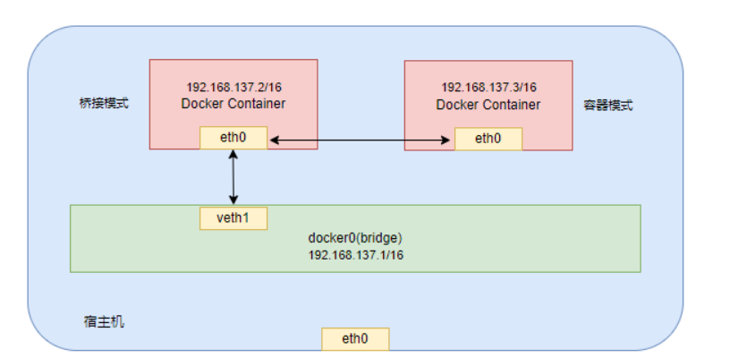

[toc]

# Docker笔记2

## Dockerfile

Dockerfile是用来构建docker镜像的脚本文件，文件内容包含了一条条构建镜像所需的指令和参数。

> Dockerfile构建步骤
1. 编写一个dockerfile文件
2. docker build将dockerfile构建成为一个镜像
3. docker run运行镜像
4. docker push 发布镜像

> 编写dockerfile的注意事项：
1. 每个保留关键字（指令）都是尽量是大写字母并且后面至少有一个参数。
2. dockerfile中的指令是从上到下顺序执行的
3. #表示注释
4. 每一个指令都会创建一个新的镜像层并叠加到之前的镜像上。

> docker执行dockerfile的流程如下
1. docker从基础镜像上运行一个容器
2. docker开始执行dockerfile上的指令，并根据执行对容器进行修改。
3. 修改容器后，docker在执行docker commit命令,提交一个新的镜像层。
4. docker基于刚提交的镜像，再运行一个新的容器。
5. docker执行下一条指令。直到所有指令都执行完成。

### dockerfile 文件中的常见指令

<font color="red">Dockerfile 的指令每执行一次都会在原有基础上新建一层新的镜像。所以过多的指令，会造成镜像膨胀过大。</font>

#### FROM 指定基础镜像

FROM命令是用来指定你需要用哪个镜像作为基础镜像进行构建。

```shell
# 写法如下
FROM ubuntu
```

#### RUN 用于执行后面的linux命令

RUN指令是用来执行linux命令的指令。

例如ubuntu系统下，需要更新软件包list，就需要执行apt-get update，之后会跟着执行apt-get install

```shell
RUN有两种语法格式：
语法1：RUN <命令行命令>
# <命令行命令> 等同于，在终端操作的 shell 命令。

语法2：RUN ["可执行文件", "参数1", "参数2"]
# RUN ["./test.php", "dev", "offline"] 等价于 RUN ./test.php dev offline

# 如下
RUN apt-get update -y
RUN apt-get install -y vim

# 一般情况下，多个连续执行的linux命令，都会用“\”做换行分割，再用“&&”将命令串联起来
RUN apt-get update -y \
    && apt-get install -y vim
```

在Dockerfile中，每写一个RUN指令就会在基础镜像上增加一层镜像，Docker对镜像的层数有限制，所以一般情况下，多个连续执行的linux命令，都会用“\”做换行分割，再用“&&”将命令串联起来。

#### MAINTAINER 指定创建镜像的维护者

```shell
# 写法如下
MAINTAINER shuyx<xxxxxx@qq.com>        #镜像维护者信息
```

#### EXPOSE 声明端口

主要用于声明这个镜像需要暴露的端口，以方便配置映射。当使用随机端口映射时，也就是 docker run -P 时，会自动随机映射 EXPOSE 的端口。

```shell
# 写法如下
EXPOSE <端口1> [<端口2>...]
```

#### WORKDIR 指定工作目录

指定在容器创建后，终端默认登录的工作目录。如该目录不存在，WORKDIR 会自动建立目录。

```shell
# 写法如下
WORKDIR <工作目录路径>

# 例如,当容器创建后，终端访问容器，会自动进入到/home/shuyx目录中。
WORKDIR /home/shuyx
```

#### USER 指定用户

用于指定执行后续命令的用户和用户组，或者切换后续命令执行的用户（用户和用户组必须提前已经存在）。默认为root用户。

```shell
# 语法如下
USER <用户名>[:<用户组>]

# 例如
USER root
······
USER www
······
```

#### ENV 定义环境变量

定义了环境变量，那么在在后续的指令中，通过$符号就可以使用这个环境变量。

```shell
# 语法如下
ENV <key> <value>
ENV <key1>=<value1> <key2>=<value2>...

# 示例：
ENV MY_PATH=/home/shuyx
ENV BASE_URL www.songpangpang.com

# 后续可以用$来使用之前指定的环境变量
WORKDIR $MY_PATH
RUN curl -SLO "https://$BASE_URL/"

```

#### VOLUME 定义容器数据卷

VOLUME 定义容器数据卷。在启动容器时会自动挂载容器数据卷。

```shell
# 语法如下
VOLUME ["<宿主机路径>","<镜像路径>"]
VOLUME <路径>

# 例如
VOLUME ["/data"]
```


#### COPY 复制文件或目录到镜像中

将文件或目录复制到镜像中。

COPY可以复制文件，也可以复制目录，可以是相对路径，也可以是绝对路径，docker路径中尽量使用绝对路径，举例如下：

```shell
# 写法如下
COPY <源路径> <目标路径>
# <源路径>：源文件或者源目录，这里可以是通配符表达式
# <目标路径>：容器内的指定路径。路径不存在的话，会自动创建。

# 例如
# 复制home的.env目录的文件到容器的.env目录中
COPY /home/.env /var/www/html/.env
......

# windows系统下
COPY f:/docker/ ./
······
```

#### ADD 拷贝文件到镜像中

将宿主机的文件拷贝进镜像中，并且会自动处理URL或解压tar压缩包。

```shell
# 语法如下
ADD <源路径> <目标路径>
# ADD：若源文件为 tar 压缩文件的话，会自动复制并解压到 <目标路径>下。

# 例如
ADD /home/a.txt /var/www/html/
```

#### CMD 启动命令

类似于RUN指令，用于运行程序命令。但二者运行的时间点不同，CMD在docker run时运行，RUN是在 docker build时运行。

注意：
* CMD命令用于启动容器时，需要执行的命令，多个CMD命令，仅最后一个生效
* CMD指令指定的程序命令可以被 docker run 命令行参数中指定要运行的程序命令所覆盖。

```shell
# 语法如下
CMD <shell命令> 
CMD ["<可执行文件或命令>","<param1>","<param2>",...] 
CMD ["<param1>","<param2>",...]  # 该写法是为 ENTRYPOINT 指令指定的程序提供默认参数
```

#### ENTRYPOINT 

类似于 CMD 指令，但其不会被 docker run 的命令行参数指定的指令所覆盖，而且这些命令行参数会被当作参数送给 ENTRYPOINT 指令指定的程序。

但是, 如果运行 docker run 时使用了 --entrypoint 选项，将覆盖 ENTRYPOINT 指令指定的程序。

```shell
# 语法如下
ENTRYPOINT ["<可执行文件或命令>","<param1>","<param2>",...]
```

### docker build 命令

当我们编写好Dockerfile文件，便可以通过docker build 命令把Dockerfile文件 创建为镜像。

docker build 命令的用法
```shell
# 语法1如下 注意最后有个小点.
# 最后的那个点表示为当前路径下的Dockerfile文件
# 如果Dockerfile文件不在当前路径下，可以通过-f参数来指定Dockerfile文件路径。
docker build -t 新的镜像名称[:版本号] .

# 语法2如下，如果指定了文件路径，就不需要后面加上小点。
# -f 指定Dockerfile的文件路径。
# -t 指定镜像的名字
docker build -f /home/ -t 新的镜像名称[:版本号]
```

以下是docker build 命令的常用案例。

```shell
# 1. 使用当前目录的 Dockerfile 创建镜像，标签为 shuyx/ubuntu:v1
docker build -t shuyx/ubuntu:v1 . 

# 2. 使用URL github.com/creack/docker-firefox 的 Dockerfile 创建镜像
docker build github.com/creack/docker-firefox -t shuyx/ubuntu:v1

# 3. 通过 -f 指定 Dockerfile 文件的位置
docker build -f /path/Dockerfile -t shuyx/ubuntu:v1
```

注意,在 Docker 守护进程执行 Dockerfile 中的指令前，首先会对 Dockerfile 进行语法检查，如果有语法错误时会返回下面代码。

```shell
$ docker build -t shuyx/ubuntu:v1 . 
Sending build context to Docker daemon 2.048 kB
Error response from daemon: Unknown instruction: RUNCMD
```


### dockerfile 基于centos7镜像安装jdk

1. 下载jdk安装包

下载jdk-8u371-linux-x64.tar.gz,上传到/usr/local/jdk下，这个文件目录需要自己创建

2. 创建Dockerfile文件，注意Dockerfile的D需要大写

在/usr/local/jdk下创建Dockerfile文件。

```shell
# 创建dockerfile文件，并编写
cd /usr/local/jdk
touch Dockefile
vim Dockefile
```

Dockerfile文件内容如下
```shell
# 基础镜像
FROM centos7
#维护者信息
MAINTAINER shuyx<xxxxx@qq.com>          

# 安装vim编辑器,net-tools工具查询ip
RUN yum -y install vim
RUN yum -y install net-tools
# 安装glibc.i686库
RUN yum -y install glibc.i686

# 安装java8
#新建目录
RUN mkdir /usr/local/jdk   
#指定工作目录          
WORKDIR /usr/local/jdk                 

# 将jdk文件拷贝到容器的/usr/local/jdk并解压 
ADD  jdk-8u371-linux-x64.tar.gz /usr/local/jdk
# 设置环境变量 
ENV JAVA_HOME /usr/local/jdk/jdk1.8.0_371
ENV JRE_HOME /usr/local/jdk/jdk1.8.0_371/jre
ENV CLASSPATH $JAVA_HOME/lib/dt.jar:$JAVA_HOME/lib/tools.jar:$JRE_HOME/lib:$CLASSPATH
ENV PATH $JAVA_HOME/bin:$PATH
```

3. 进入到Dockerfile文件的存放目录下，开始构建镜像

注意要在 Dockerfile 文件的存放目录下，执行构建命令。

```shell
# 执行当前目录的Dockerfile来构建镜像
# 镜像名为shuyx/jdk8-01:v1
docker build -t shuyx/jdk8-01:v1 . 

# 查看镜像文件是否构建成功 
docker images
```

4. 根据新镜像创建容器并启动

```shell
# 开始运行
docker run -d -it --name=jdk1.8 shuyx/jdk8-01:v1 /bin/bash

#进入容器查看JDK是否安装成功 
docker exec -it jdk1.8 /bin/bash 
> java -version
```


### dockerfile 基于ubuntu镜像安装jdk

Dockerfile文件内容如下,其他步骤参考上面。

```shell
# 以ubuntu为基础镜像
FROM ubuntu:18.04

# 指明该镜像的作者
MAINTAINER shuyx

# 更新apt源
RUN sed -i s/archive.ubuntu.com/mirrors.aliyun.com/g /etc/apt/sources.list \
    && sed -i s/security.ubuntu.com/mirrors.aliyun.com/g /etc/apt/sources.list 

# 复制linux版本jdk压缩包到镜像内
COPY /jdk-8u381-linux-x64.tar.gz /usr/java/jdk-8u381-linux-x64.tar.gz
# 解压缩jdk到指定目录
RUN mkdir /usr/java/jdk
RUN tar -zxvf /usr/java/jdk-8u381-linux-x64.tar.gz -C /usr/java/jdk

# 设置JAVA_HOME、CLASSPATH、PATH环境变量
ENV JAVA_HOME=/usr/java/jdk/jdk1.8.0_381
ENV CLASSPATH=.:$JAVA_HOME/lib/dt.jar:$JAVA_HOME/lib/tools.jar
ENV PATH=$JAVA_HOME/bin:$PATH

RUN apt update
# 设置启动命令，打印jdk版本
CMD ["java", "-version"]
```

### dockerfile 基于jdk镜像部署jar包

1. 先将jar包上传到宿主机的某个目录中，并在该目录中创建Dockerfile文件

Dockerfile文件内容如下
```shell
# 基础镜像
FROM java:8
#维护者信息
MAINTAINER shuyx<xxxxx@qq.com>          

# 将aaa.jar上传到容器中并更名为bbb.jar
ADD aaa.jar bbb.jar

# 运行bbb.jar包
RUN bash -c 'touch /bbb.jar'
ENTRYPOINT ["java","-jar","//bbb.jar"]

# 暴露端口
EXPOSE 8081
```

2. 在与Dockerfile文件同目录的情况下，开始构建镜像

```shell
# 开始构建镜像
docker build -t shuyx/aaa:v1 .

# 查询镜像
docker images
```


## Docker 网络

> Docker网络是什么？

Docker网络是Docker容器之间和容器与外部网络之间的通信和连接的一种机制。在Docker中，每个容器都可以有自己的网络接口、IP地址和网络配置等。

> Docker网络能做什么？

在docker中，容器的每次重启都会导致容器的ip发生变化。这也意味着如果容器间使用ip地址来进行互相通信的话，一旦有容器重启，重启的容器将不再能被访问到。

而Docker网络可以实现容器之间的互联以及端口映射，并且容器IP变动的时候可以通过容器名直接网络通信而不受影响。

### docker网络 相关的命令

> 查询docker中的所有网络

```shell
# 语法
docker network ls 

# 例如
# 可以通过 docker network ls 命令来查询docker中的网络
qwe@ubuntu:~/Desktop$ docker network ls
NETWORK ID     NAME      DRIVER    SCOPE
e806a6373a89   bridge    bridge    local
ea48da9dbf76   host      host      local
f3ab3fef5588   none      null      local
```

docker安装后，默认情况会存在上面三种网络，每个网络都有不同的用处。同时我们也可以自定义docker网络。

> 查询网络的具体信息

```shell
# 语法
docker network inspect 网络名称  

# 例如，查询bridge网络的具体信息
docker network inspect bridge
```


> 创建自定义网络

当不指定网络模式的情况下，创建的自定义网络，默认是bridge(桥接)模式。

```shell
# 语法
docker network create 网络名称

# 例如，创建一个网络，名为my_network
docker network create my_network

# 创建网络时是可以添加一系列参数的：
# --driver：驱动程序类型
# --gateway：主子网的IPV4和IPV6的网关
# --subnet：代表网段的CIDR格式的子网
# my_network：自定义网络名称
docker network create --driver=bridge --gateway=192.168.137.1 --subnet=192.168.137.0/16 my_network
```

> 让容器连接某个docker网络

注意容器可以连接多个docker网络。

```shell
# 语法
docker network connect 网络名称 容器名称

# 例如,mysql01容器连接my_network网络
docker network connect my_network mysql01
```

> 让容器断开某个docker网络

```shell
# 语法
docker network disconnect 网络名称 容器名称

# 例如,mysql01容器断开my_network网络
docker network disconnect my_network mysql01
```

> 删除网络

```shell
# 语法如下
docker network rm 网络名称1 网络名称2...

# 例如 删除my_network网络
docker network rm my_network
```

> 删除所有没有使用的网络

```shell
# 语法如下
docker network prune
```

### Docker 网络的四种模式

Docker 网络有4种模式：host,bridge,none,container。

当创建容器的时候，即docker run的时候，可以给容器设置网络模式。默认的网络模式是bridge。

网络模式 | 命令指定方式 | 介绍 
-------  | ------ | ------
bridge   | --network=bridge | 默认网络模式。此模式会为每一个容器单独分配网络、设置IP等，并将容器连接到docker0虚拟网桥。并通过docker0网桥与宿主机通信。  
host     | --network=host | 容器不会创建自己的网卡，配置ip等，而是使用宿主机的 ip 和端口
none     | --network=none | 新创建的容器不会创建自己的网卡和配置自己的ip，而是和一个指定的容器共享ip、端口范围
container | --network=container:容器名称或容器id |	新创建的容器不会创建自己的网卡和配置自己的ip，而是和一个指定的容器共享ip、端口范围

```shell
# 例如
docker run mysql:5.7
docker run --network=bridge mysql:5.7
docker run --network=host mysql:5.7
docker run --network=none mysql:5.7
# 通过mysql:5.7镜像创建一个新容器，新容器与tomcat01容器共享网络
docker run --network=container:tomcat01 mysql:5.7
# -net是--network的简写
docker run -net=bridge mysql:5.7
# 例如用ubuntu容器创建容器，指定该容器连接host网络
docker run -it --network=host ubuntu /bin/bash
```

#### docker0虚拟网桥

Docker启动的时候会在宿主机上创建一个docker0虚拟网桥，每个容器在默认情况（bridge桥接模式）下会挂载到docker0虚拟网桥上。这样容器就可以和宿主机甚至是其他容器之间互相通讯了。

简而言之,在默认情况（bridge桥接模式）下每创建一个容器，docker0虚拟网桥会分配一个ip给该容器。容器会记录下网桥的ip。这样容器和网桥就会记住双方的ip，因此双方就可以进行通讯。

- 桥接模式下宿主机和docker通讯是通过docker0虚拟网桥实现的。
- 桥接模式下docker容器之间通信是通过docker0虚拟网桥中转的,因为docker0虚拟网桥会记录下所有运行的容器的ip。

#### bridge桥接模式

bridge桥接模式是默认的网络模式。此模式会为每一个容器单独分配网络、设置IP等，并将容器连接到docker0虚拟网桥。并通过docker0虚拟网桥与宿主机通信。  

bridge桥接模式原理图


如图所示，在容器中的网卡接口叫eth0,在虚拟网桥上的接口叫veth。docker0虚拟网桥上面的每个veth匹配某个容器实例内部的eth0，两两配对。


#### host主机模式

主机模式下，容器不创建任何网络接口，直接使用宿主机的 ip地址与外界进行通信，不再需要额外进行NAT转换。

host主机模式原理图


如图所示，主机模式下容器网络是不需要docker0虚拟网桥的。而是直接使用宿主机的网络。这样的好处是宿主机与容器可以直接通信。


注意：docker run创建容器时，若指定--network=host或-net=host，如果还指定了-p映射端口，此时会警告端口无法使用。

```shell
NARNING: Published ports are discarded when using host network mode
```

因为host主机模式下，通过-p设置的端口参数将不会起到任何作用，端口号会以主机端口号为主，重复时则递增。

#### container 容器模式

container 容器模式原理图


如图所示，新建的容器和已经存在的一个容器共享一个网络ip配置而不是和宿主机共享。两个容器除了网络方面，其他的如文件系统、进程列表等还是隔离的。


#### none模式

在none模式下，并不为Docker容器进行任何网络配置。即这个Docker容器没有网卡、ip、路由等信息，只有一个lo本地接口。

lo本地接口表示禁用网络功能，即：127.0.0.1，本地回环的意思


### 自定义网络

> 为什么使用自定义网络

在docker中，容器的每次重启都会导致容器的ip发生变化。这也意味着如果容器间使用ip地址来进行互相通信的话，一旦有容器重启，重启的容器将不再能被访问到。

而当我们自定义网络，便可以容器IP变动的时候。通过ping + 容器名来直接进行网络通信而不受影响IP变动的影响。

在实际开发中更推荐使用自定义的网络进行容器管理，以及启用容器名称到 IP 地址的自动 DNS 解析。

<font color="red">总结：自定义网络本身就维护了主机名和IP的对应关系（IP和域名都能通）</font>

1. 创建自定义网络

```shell
docker network create my_network
```

2. 将容器添加到自定义网络中

```shell
# 把容器加入到自定义网络
docker network connect my_network mysql01
docker network connect my_network mysql02
```

3. 开始ping+容器名

```shell
# 进入到mysql01容器的终端中
docker exec -it mysql01 /bin/bash
> ping mysql02
PING mysql02 (172.19.0.3) 56(84) bytes of data.
64 bytes from mysql02.my_network (172.19.0.3): icmp_seq=1 ttl=64 time=0.269 ms
64 bytes from mysql02.my_network (172.19.0.3): icmp_seq=2 ttl=64 time=0.102 ms
64 bytes from mysql02.my_network (172.19.0.3): icmp_seq=3 ttl=64 time=0.094 ms
64 bytes from mysql02.my_network (172.19.0.3): icmp_seq=4 ttl=64 time=0.082 ms

# 进入到mysql02容器的终端中
docker exec -it mysql02 /bin/bash
> ping mysql01
PING mysql01 (172.19.0.4) 56(84) bytes of data.
64 bytes from mysql01.my_network (172.19.0.4): icmp_seq=1 ttl=64 time=0.132 ms
64 bytes from mysql01.my_network (172.19.0.4): icmp_seq=2 ttl=64 time=0.111 ms
64 bytes from mysql01.my_network (172.19.0.4): icmp_seq=3 ttl=64 time=0.222 ms
64 bytes from mysql01.my_network (172.19.0.4): icmp_seq=4 ttl=64 time=0.333 ms
```


## Docker-compose

> Docker-compose是什么?

Docker-Compose 项目是 Docker 官方的开源项目，负责实现对 Docker 容器集群的快速编排。即用于批量管理多个Docker 容器。

在日常工作中，一个项目往往需要多个容器相互配合来运行。例如实现一个Web项目,除了Web服务容器,还需要数据库服务容器,负载均衡容器等。

而Docker-compose可以批量管理多个Docker 容器。它允许用户通过一个单独的docker-compose.yml 模板文件，来定义一组相关联的应用容器为一个项目（project）。

简单来说：Docker-compose就是用来管理多个容器的，定义启动顺序的，合理编排，方便管理。


> Docker-compose的两个核心概念

服务 ( service )：一个应用的容器，实际上可以包括若干个运行相同镜像的容器实例。
项目 ( project )：由一组关联的应用容器组成的一个完整业务单元，在 docker-compose.yml 文件中定义。

> Docker-compose的使用步骤

1. 先编写项目中各个容器用到的dockerfile文件，然后通过dockerfile命令构建好各个镜像。
2. 再编写docker-compose.yml。
3. 执行docker-compose up命令，来批量创建项目中的各个容器。

### ubuntu安装docker-compose

docker-compose是docker的独立产品，因此需要安装docker之后再单独安装docker compose。

```shell
# 下载并安装docker-compose到/usr/local/bin/docker-compose目录中
curl -SL https://github.com/docker/compose/releases/download/v2.23.0/docker-compose-linux-x86_64 -o /usr/local/bin/docker-compose

# 赋予docker-compose目录中的文件可执行权限
# linux系统中，只有被赋予执行权限的文件才能执行。普通文件不能被执行。
sudo chmod +x /usr/local/bin/docker-compose

# 查询docker-compose的版本
docker-compose version
```


如何卸载docker-compose,直接删除即可
```shell
sudo rm /usr/local/bin/docker-compose
```


### docker-compose常用命令

运行这些命令需要结合docker-compose一起使用。并且必须要在docker-compose.yml文件的所在目录中才可以使用，不然报错。

```shell
# 帮助命令
docker-compose --help
docker-compose -h

# 检查docker-compose的配置
docker-compose config 
docker-compose config -q

# 重启docker-compose
docker-compose restart

# 启动docker-compose
docker-compose start

# 停止docker-compose
docker-compose stop

# 启动命令
# 启动所有docker-compose服务
docker-compose up 
# 启动所有docker-compose服务并后台运行
docker-compose up -d

# 停止命令
# 停止所有up 命令所启动的容器，并移除⽹络，镜像等
docker-compose down 

# 查询当前docker-compose编排的运行的容器
docker-compose ps

# 查询当前docker-compose编排的容器进行
docker-compose top

# 进入docker-compose编排的容器终端
docker-compose exec yml文件中的服务id /bin/bash

# 查询docker-compose编排的容器日志
docker-compose logs yml文件中的服务id

```

### docker-compose.yml文件

下面是一个docker-compose.yml文件的范例

```yml
# 指定Compose文件版本号，当前版本为3。
version: "3"
# 定义每个服务（即容器）的配置信息，包括服务名称、镜像、端口映射、环境变量等。
services:
  # 容器名称
  redis:
    # 容器的内部工作目录
    working_dir: "/usr/local"
    # 容器运行后的启动命令
    command: "redis.server /etc/redis/redis.conf"  
    # redis容器使用到的镜像
    image: redis:alpine
    # redis容器的端口映射
    ports:
      - "6379:6379"
    # 容器需要连接的docker网络
    networks:
      - my_network

  db:
    image: postgres:9.4
    # 设置容器数据卷
    volumes:
      - /home/db-data:/var/lib/db-data
    # 设定容器的环境变量
    environment:
      - MYSQL_ROOT_PASSWORD=example  
    networks:
      - my_network
 
  # 后端服务的容器
  backend-service01:
    image: shuyx/xxx:latest
    ports:
      - 8000:80
    networks:
      - my_network
    # 依赖关系，表示该容器依赖redis和db容器。因此该容器会在redis和db容器启动后，在启动。
    depends_on:
      - redis
      - db
 
  # 前端服务的容器
  frontend-service01:
    # build属性用于指定dockerfile文件的路径。
    build: /homg/dockerfile
    ports:
      - 9000:80
    networks:
      - my_network
    depends_on:
      - redis
      - db

# 设置docker网络，创建一个名为my_network的网络
networks:
  my_network:

```


docker-compose.yml文件中有许多配置属性。下面来解释一下。具体的全部属性，需要自行去官网查询。

```
version：指定Compose文件版本号，当前版本为3。

services：定义每个服务（即容器）的配置信息，包括服务名称、镜像、端口映射、环境变量等。

working_dir：定义容器中的工作目录。

command： 定义容器的启动后默认执行的命令

networks：定义网络配置信息，包括网络名称、IP地址段等。

volumes：定义数据卷配置信息，包括挂载点和卷类型等。

environment/env_file：设置环境变量，可以在services和networks级别设置全局或者在单个服务中设置特定环境变量。env_file属性用于从文件中读取环境变量。

ports/expose：ports属性用于将容器端口映射到主机上的端口，expose属性则仅暴露容器内部端口而不进行映射。

volumes：设置容器的数据卷。

depends_on/links：depends_on属性用于指定依赖关系，在启动时需要先启动依赖的服务。links属性则用于创建链接到其他容器或服务中的别名。

restart/recreate/no-recreate: 设置容器重启策略。restart属性值有no、always、on-failure三种。recreate表示在容器停止后重新创建新的实例；no-recreate则表示不会重新创建新的实例。

deploy：用于在Docker Swarm中部署服务时定义服务的配置信息，包括副本数、更新策略等。

```

> build属性

```yml
build: 用于指定Dockerfile文件所在路径。通常有几种用法

用法1：Dockerfile文件的绝对路径
build: /path/to/build/dir

用法2：Dockerfile文件的相对路径
build: ./dir

用法3：设置上下文根目录，然后以该目录为准指定Dockerfile
build:
  context: ../
  dockerfile: path/Dockerfile
```

> build属性的conteng属性

context选项可以是Dockerfile的文件路径，也可以是到链接到git仓库的url，当提供的值是相对路径时，会被解析为相对于Dockerfile文件的路径

```yml
build:
  context: ../
  dockerfile: path/Dockerfile
```

> volumes属性

用于设置容器的数据卷。有几种用法

```yml
volumes:
  ## 只是指定一个路径，Docker仅仅会自动在容器内创建一个目录。
  - /var/lib/mysql
  ## 使用绝对路径挂载数据卷
  - /opt/data:/var/lib
  ## 以docker-compose.yml文件为中心的相对路径作为数据卷挂载到容器
  - ./cache:/var/lib
  ## 使用用户的相对路径（~/ 表示的目录是 /home/<用户目录>/ 或者 /root/）
  - ~/configs:/etc/configs/:ro
```

> expose属性

暴露容器内部的端口，但不映射到宿主机，用于容器服务提供。

```yml
expose:
    - "3000"
    - "8000"
```

> environment属性

设置环境变量，可以使用数组或字典两种格式。

```yml
#格式1
environment:
    - RUN_ACTIVE=test
    - DB_HOST=192.168.100.112
#格式2
environment:
    RUN_ACTIVE:test
    DB_HOST:192.168.100.112
```

### docker-compose 创建 mysql和redis容器

1. 先准备各个文件

文件路径如下
```
docker/mysql-redis/docker-compose.yml
docker/mysql-redis/mysql
docker/mysql-redis/my.cnf
docker/mysql-redis/redis
docker/mysql-redis/redis.conf
```

2. 编辑好my.cnf配置文件和redis.conf配置文件

配置文件内容，自行编辑。

3. 编写docker-compose.yml

```yml
version: '3'
services:
  mysql:
    hostname: mysql
    image: mysql:5.7.26
    # 指定容器名称，如果不设置此参数，则由系统自动生成
    container_name: mysql
    # 设置容器自启模式
    restart: always
    # 容器启动命令，设置utf8字符集 
    command: mysqld --character-set-server=utf8mb4 --collation-server=utf8mb4_unicode_ci
    # 设置环境变量
    environment:
      - TZ=Asia/Shanghai # 设置容器时区与宿主机保持一致
      - MYSQL_ROOT_PASSWORD=123456 # 设置root密码
    # 设置容器数据卷 
    volumes:
       - /etc/localtime:/etc/localtime:ro # 设置容器时区与宿主机保持一致
       - /docker/mysql-redis/mysql:/var/lib/mysql/data # 映射数据库保存目录到宿主机，防止数据丢失
       - /docker/mysql-redis/my.cnf:/etc/mysql/my.cnf # 映射数据库配置文件
    # 设置端口映射
    ports:
        - "3306:3306"

  redis:  
    hostname: redis
    image: redis:5.0.4
    container_name: redis
    restart: always
    command: redis-server /etc/redis.conf # 启动redis命令
    environment:
      - TZ=Asia/Shanghai
    volumes:
      - /etc/localtime:/etc/localtime:ro # 设置容器时区与宿主机保持一致
      - /docker/mysql-redis/redis:/data
      - /docker/mysql-redis/redis.conf:/etc/redis.conf
    ports:
        - "6379:6379"
```

4. 运行docker-compose.yml来创建容器

```shell
# 先检查yaml文件配置是否有误
docker-compose config -q
# 然后在创建容器
docker-compose -f docker-compose.yml up -d
```


## docker 图形化管理工具 portainer

> portainer是什么？

Portainer是一个可视化的容器镜像的图形管理工具，利用Portainer可以轻松构建，管理和维护Docker环境。 而且完全免费，基于容器化的安装方式，方便高效部署。

### 安装 portainer

1. 下载portainer-ce镜像

```shell
# 下载最新的portainer-ce镜像
docker pull portainer/portainer-ce:latest
```

2. 创建portainer-ce的数据卷,用于存储portainer-ce的数据

```shell
docker volume create portainer_data
```

3. 创建portainer-ce容器

```shell
# 创建并启动portainer-ce容器
docker run -d -p 8000:8000 -p 9443:9443 --name portainer --restart=always -v /var/run/docker.sock:/var/run/docker.sock -v portainer_data:/data portainer/portainer-ce:latest

# 检查容器是否运行
docker ps

## 参数介绍
-d #容器在后台运行
-p 9000:9000 #宿主机9000端口映射容器中的9000端口
-v /var/run/docker.sock:/var/run/docker.sock # 把宿主机的Docker守护进程(docker daemon)默认监听的Unix域套接字挂载到容器中
-v portainer_data:/data  #把宿主机目录 /portainer 挂载到容器 /data 目录；
–name portainer # 指定运行容器的名称
portainer/portainer-ce:latest #镜像的全称
```

4. 浏览器登录portainer的管理界面`https://localhost:9443`

初次登录需要先创建管理员账户。


5. portainer的主界面，具体用法请自行搜索。


