[toc]

# Elasticsearch笔记1

- Elasticsearch版本为7.12.1
- kibana版本为7.12.1

## Elasticsearch介绍

> 什么是Elasticsearch？

Elasticsearch是一个知名的，开源的，免费的分布式搜索引擎，可以用来实现搜索、日志统计、分析、系统监控等功能。

> Elasticsearch的发展历史

elasticsearch底层是基于lucene来实现的。

- 1999年DougCutting研发了Lucene。Lucene是一个Java语言的搜索引擎类库，是Apache公司的顶级项目。
- 2004年Shay Banon基于Lucene开发了Compass
- 2010年Shay Banon 重写了Compass，取名为Elasticsearch。

## ELK 技术栈

elasticsearch结合beats、Logstash、kibana。可以组成一整套的技术栈，叫做ELK 技术栈。

ELK 技术栈目前广泛的应用在各个系统中的日志数据分析、实时监控等领域。

- elasticsearch是ELK技术栈的核心，负责存储、搜索、分析数据。
- kibana 负责数据的可视化。
- Logstash、Beats 负责抓取数据。

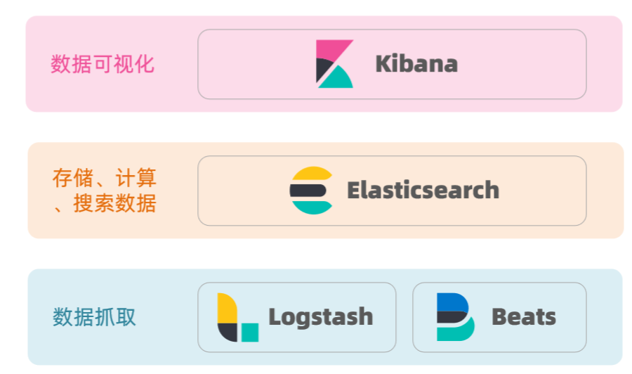

## Elasticsearch 和 kibana 安装

- elasticsearch是ELK技术栈的核心，负责存储、搜索、分析数据。
- kibana 负责数据的可视化。

在安装部署Elasticsearch容器 和 kibana容器之前。我们先创建一个docker网络。这样才能很方便的让Elasticsearch容器 和 kibana容器互相通信。

```bash
# 创建一个docker网络
docker network create my-elk-net
```

### Docker环境下安装部署Elasticsearch容器

> 步骤① 先安装docker环境，自行百度。

> 步骤② 下载Elasticsearch镜像文件。最新版或某个版本

```shell
# 下载Elasticsearch镜像文件。版本为7.12.1
docker pull elasticsearch:7.12.1

# 查询镜像
docker images
```

> 步骤③ 创建Elasticsearch容器的存储目录

如果是windows系统，则可以在E:\DockerVolumes\Elasticsearch目录中创建data和plugins和logs目录。

- data目录存储Elasticsearch容器产生的数据。
- logs目录存储Elasticsearch容器的日志数据。
- plugins目录存储Elasticsearch容器的插件。


> 步骤④ 创建并启动Elasticsearch容器

```shell
# 创建容器并启动
docker run -d --name="myElasticsearch" --network="my-elk-net" --privileged=true -e "ES_JAVA_OPTS=-Xms512m -Xmx512m" -e "discovery.type=single-node" -p 39200:9200 -p 39300:9300 -v /e/DockerVolumes/Elasticsearch/data:/usr/share/elasticsearch/data -v /e/DockerVolumes/Elasticsearch/plugins:/usr/share/elasticsearch/plugins -v /e/DockerVolumes/Elasticsearch/logs:/usr/share/elasticsearch/logs  elasticsearch:7.12.1

# 查询容器日志，看是否成功启动。
docker logs myES
```

命令解释
```
--name="myElasticsearch" 设置容器名称
--network="my-elk-net" ：把容器加入一个名为my-elk-net的docker网络中
-e "ES_JAVA_OPTS=-Xms512m -Xmx512m"：由于es是运行在JVM中的，此处设置JVM内存大小
-e "discovery.type=single-node"：非集群模式，单点模式
--privileged=true：授予逻辑卷访问权
-p 39200:9200：端口映射配置,9200是访问端口。
-p 39300:9300：端口映射配置,9300是集群节点之间的通信端口。

-v /e/DockerVolumes/Elasticsearch/data:/usr/share/elasticsearch/data：挂载逻辑卷，绑定es的数据目录
-v /e/DockerVolumes/Elasticsearch/logs:/usr/share/elasticsearch/logs：挂载逻辑卷，绑定es的日志目录
-v /e/DockerVolumes/Elasticsearch/plugins:/usr/share/elasticsearch/plugins：挂载逻辑卷，绑定es的插件目录
```

- 注意：/e/DockerVolumes/... 是windows环境下E盘的DockerVolumes目录。如果宿主机是linux系统，可以设置其他目录。


> 步骤⑤ 测试

elasticsearch并没有提供可视化界面，因此我们需要通过调用elasticsearch的API接口，来测试elasticsearch是否成功运行。

在浏览器中输入：`http://localhost:39200/` 即可看到elasticsearch的响应结果。

如图所示
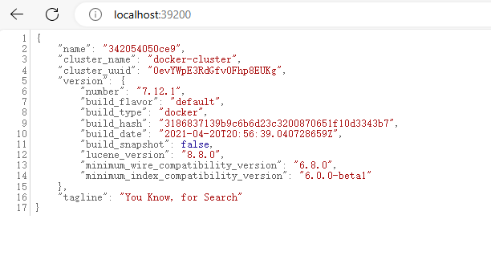

### Docker环境下安装部署kibana容器

kibana可以给elasticsearch提供一个可视化界面。方便我们可视化操作elasticsearch。

> 步骤① 下载 kibana 镜像文件。最新版或某个版本

```shell
# 下载 kibana 镜像文件。版本为7.12.1
docker pull kibana:7.12.1

# 查询镜像
docker images
```

> 步骤② 创建并启动kibana容器

```shell
# 创建容器并启动
docker run -d --name="myKibana" --network="my-elk-net" -e "ELASTICSEARCH_HOSTS=http://myElasticsearch:9200" -p 35601:5601 kibana:7.12.1

# 查询容器日志，看是否成功启动。
docker logs myKibana
```

命令解释：
```
--network="my-elk-net" 把容器加入一个名为my-elk-net的docker网络中

-e "ELASTICSEARCH_HOSTS=http://myElasticsearch:9200" 设置kibana容器访问es容器的地址，其中端口是es容器端口9200，网址是es容器的名称。

因为kibana容器已经与es容器在同一个网络中，因此kibana容器可以用es容器的名称直接访问es容器。

-p 35601:5601 端口映射。格式为宿主机端口：容器端口

```

> 步骤③ 测试

浏览器输入地址访问：`http://localhost:35601`，访问Kibana的控制台界面。

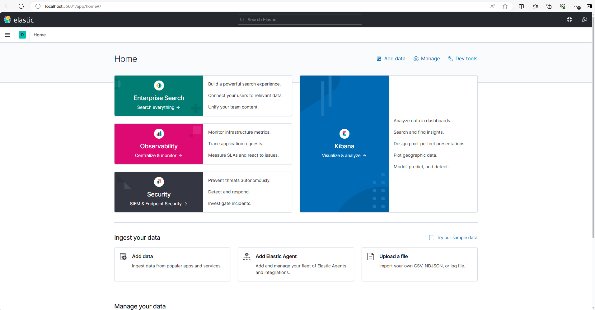

## Elasticsearch的基本概念

### 倒排索引

倒排索引是相对传统数据库的正向索引而言的，并且倒排索引与正向索引是相辅相成的。

> 正向索引的查询流程
1. 用户输入查询条件，假设查询条件是模糊的。
2. 开始逐行扫描全表数据。
3. 判断数据是否符合查询条件
4. 如果符合则放入结果集，不符合则丢弃。回到步骤1

正向索引：基本上就是全表逐行扫描的查询。随着数据量增加，其查询效率也会越来越低。

> 倒排索引中两个非常重要的概念

- 文档（Document）：文档就是被查询的数据。例如一个商品信息，一个订单信息。每条数据就是每个文档。
- 词条（Term）：词条就是文档数据的关键字（类似于标签）。例如一个小米手机信息，这个文档数据对应的词条就是 小米，手机。

> 如何建立倒排索引？

1. 读取文档数据，将每一个文档的数据利用算法分词，得到一个个词条。
2. 然后创建词条表，表中的每行数据包括词条、词条所在文档id、位置等信息。

如图所示
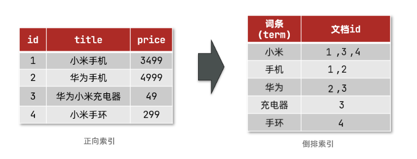

> 倒排索引的查询流程
1. 假设用户输入查询条件（华为手机）
2. 首先会对查询条件进行分词处理。即把华为手机转换为多个词条：华为，手机。
3. 然后会根据词条，在倒排索引中进行查询，可以得到多个词条对应的文档id(1,2,3)。
4. 然后根据文档id，查询具体的文档数据。

如图所示
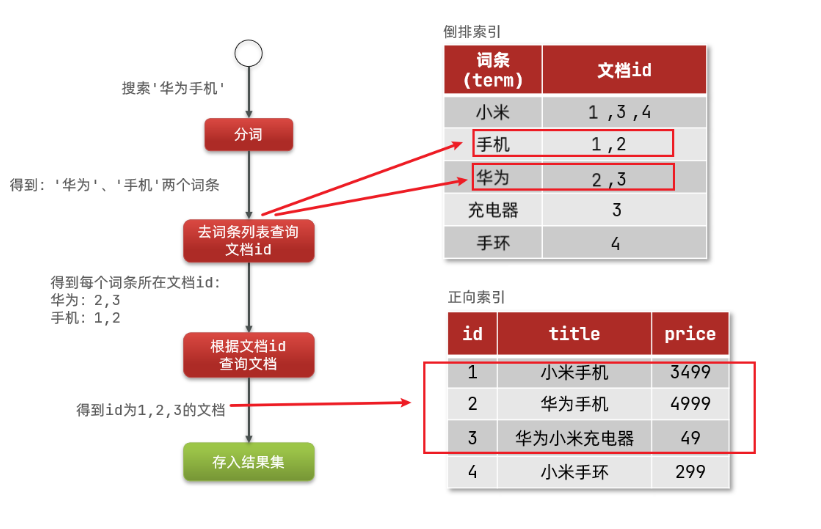

> 正向索引和倒排索引的区别

- 正向索引是最传统的，根据id索引的方式。但根据词条查询时，必须先逐条获取每个文档，然后判断文档中是否包含所需要的词条，是根据文档找词条的过程。
- 倒排索引则相反，是先找到用户要搜索的词条，根据词条得到保护词条的文档的id，然后根据id获取文档。是根据词条找文档的过程。

因此正向索引擅长精准查询，倒排索引擅长模糊查询。

### 文档和字段

elasticsearch是面向文档（Document）存储的。文档数据会被序列化为json格式后存储在elasticsearch中。

在elasticsearch中文档数据就相当于表格中的一条条记录。每条文档数据中包含许多字段，类似于表格中的列。

如图所示，左边是表格数据，右边是文档数据


### 词条

对文档中的内容进行分词处理后，得到的词语就是词条。

例如对华为手机进行分词处理。可以转换为多个词条：华为，手机。

### 索引和映射

在elasticsearch中，索引相当于传统数据库中的表格，映射相当于传统数据库中定义的表结构定义。

索引：即相同类型的文档数据的集合。
映射：即文档数据中的各个字段定义，约束。 

- 例如所有用户相关的文档数据，就可以组织在一起，称为用户索引；
    - 用户索引中包含id，title,price 映射。
- 例如所有商品相关的文档数据，就可以组织在一起，称为商品索引；
    - 用户索引中包含id，name,age 映射。
- 例如所有订单相关的文档数据，就可以组织在一起，称为订单索引；
    - 用户索引中包含id，userId,goodsId,totalFee 映射。

如图所示
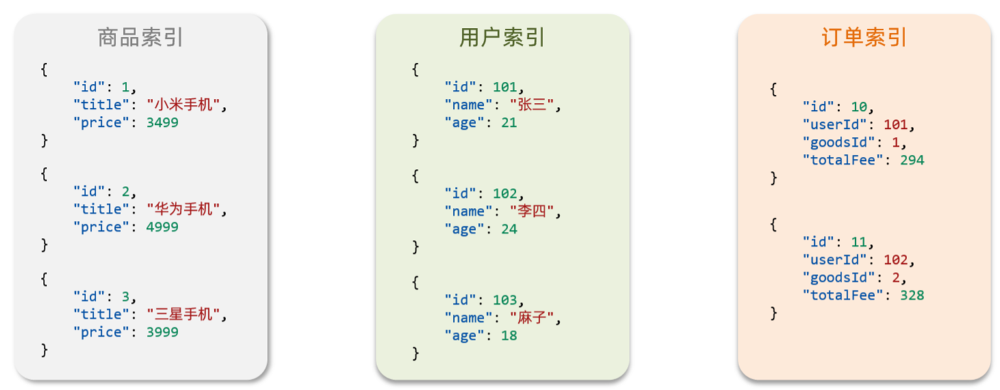

### Elasticsearch和传统数据库的对比

我们可以将Elasticsearch和传统数据库（例如Mysql）进行对比。

- Mysql：擅长事务类型操作，可以确保数据的安全和一致性。
- Elasticsearch：擅长海量数据的搜索、分析、计算。

各个概念对比
MySQL | Elasticsearch | 说明
------------ | ------------- | -------------
Table表格 | Index索引 | 索引(index)，就是文档的集合，类似数据库的表(table)
Row行记录 | Document文档 | 文档，就是一条条的数据，类似数据库中的行记录Row
Column | Field字段 | 文档中的字段，类似数据库中的列（Column）
Schema | Mapping映射 | 	Mapping是文档的约束，例如字段类型约束。类似数据库的表结构（Schema）
SQL | DSL | DSL是elasticsearch提供的JSON风格的请求语句，用来操作elasticsearch，实现CRUD。类似与SQL语句。

在大型系统中，往往是两者结合使用。
- 对安全性要求较高的写操作，使用mysql实现
- 对查询性能要求较高的搜索需求，使用elasticsearch实现
- 两者再基于某种方式，实现数据的同步，保证一致性

如图所示
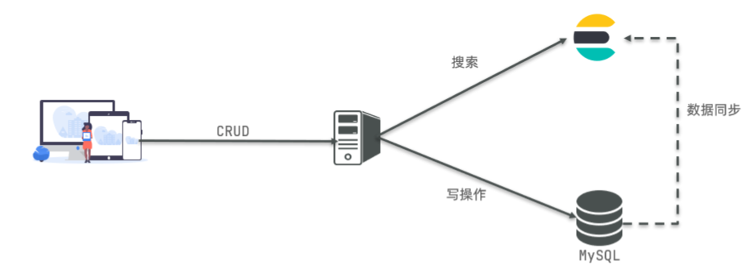

## 分词器

分词器的作用就是将文档内容，进行分词处理。从而得到一个个词条。

elasticsearch内置的分词器，对于中文分词不好用。因此我们需要额外安装中文分词器插件，通过这个插件来进行中文分词处理。

### IK分词器

#### 什么是IK分词器？

免费开源的java分词器，目前比较流行的中文分词器之一，简单、稳定。如果想要特别好的效果，需要自行维护词库，支持自定义词典。

#### 安装IK分词器

在线安装IK分词器插件
```bash
# 进入Elasticsearch容器内部
docker exec -it myElasticsearch /bin/bash

# 在线下载并安装IK分词器插件
./bin/elasticsearch-plugin  install https://github.com/medcl/elasticsearch-analysis-ik/releases/download/v7.12.1/elasticsearch-analysis-ik-7.12.1.zip

#退出容器
exit
#重启容器
docker restart myElasticsearch
```

安装截图
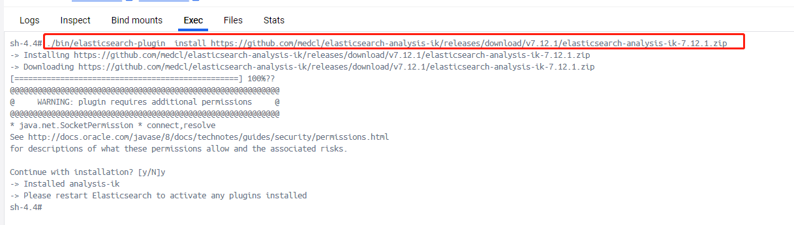

注意IK分词器插件的版本需要与Elasticsearch版本一致。

#### 测试IK分词器

在kibana的Dev tools中输入以下代码。

```js
//下面代码中，就是GET请求 /_analyze接口，传入两个参数。

GET /_analyze
{
  "analyzer": "ik_max_word",
  "text": "华为手机"
}

// GET是请求方式
// /_analyze是接口名称
// {...} 是请求数据
```

- /_analyze 接口是elasticsearch中进行分词处理的接口。
- analyzer参数是分词器模式。IK分词器中有两种分词器模式。ik_smart 智能切分模式，ik_max_word 最细切分模式。
- text参数是需要进行分词处理的文档内容。

如果所示，右边是分词处理的结果
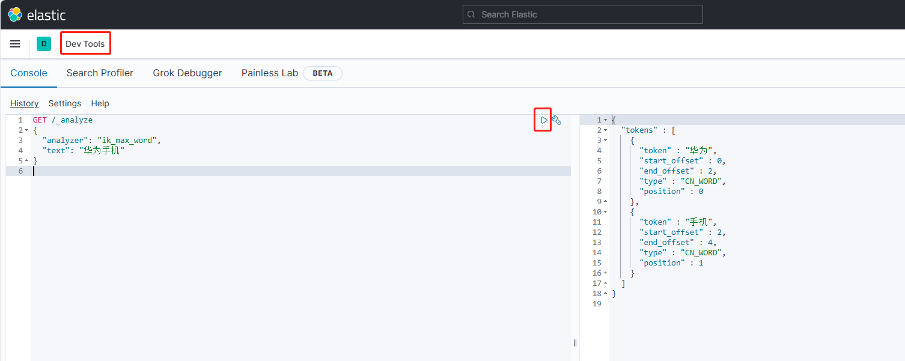

#### 自定义扩展词字典

我们可以自定义IK分词器的扩展词字典。

1. 新增一个扩展词字典文件my_ext01.dic

```
白嫖
给力
泰酷辣
一键三连
```

2. 在es容器中找到IK分词器存放词汇字典的目录。

目录的地址为：/usr/share/elasticsearch/config/analysis-ik

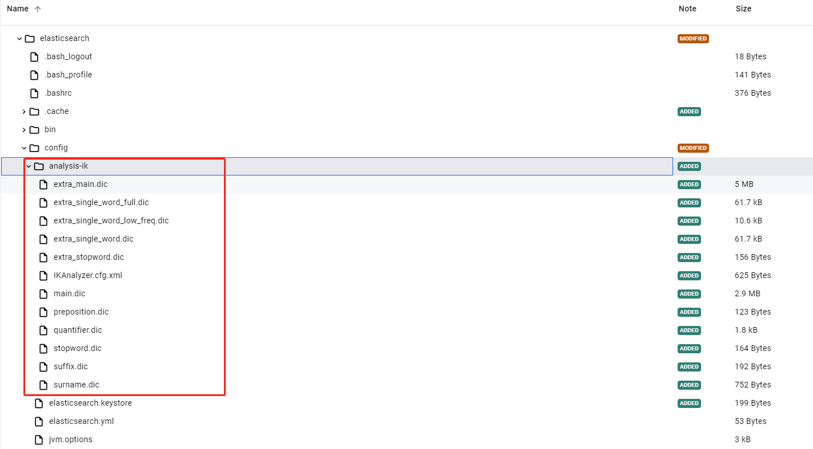

3. 修改目录中的IKAnalyzer.cfg.xml文件内容

```xml
<?xml version="1.0" encoding="UTF-8"?>
<!DOCTYPE properties SYSTEM "http://java.sun.com/dtd/properties.dtd">
<properties>
	<comment>IK Analyzer 扩展配置</comment>
	<!--用户可以在这里配置自己的扩展词字典 -->
	<entry key="ext_dict">my_ext01.dic</entry>
	 <!--用户可以在这里配置自己的扩展停止词字典-->
	<entry key="ext_stopwords"></entry>
	<!--用户可以在这里配置远程扩展字典 -->
	<!-- <entry key="remote_ext_dict">words_location</entry> -->
	<!--用户可以在这里配置远程扩展停止词字典-->
	<!-- <entry key="remote_ext_stopwords">words_location</entry> -->
</properties>
```

在xml文件中，把新建的扩展词字典文件my_ext01.dic配置进去。

4. 最后将my_ext01.dic文件，放入到analysis-ik目录中。然后重启elasticsearch容器。

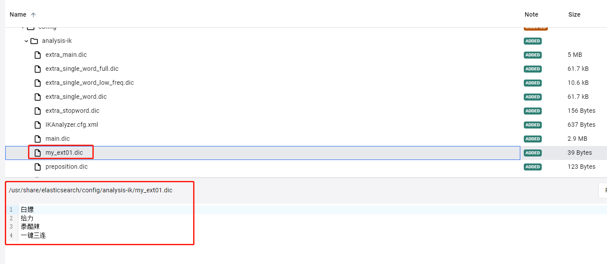

5. 测试效果

针对`一键三连`这个词汇进行分析。使用ik_smart 智能切分模式。

添加扩展词字典文件之前的分词效果。
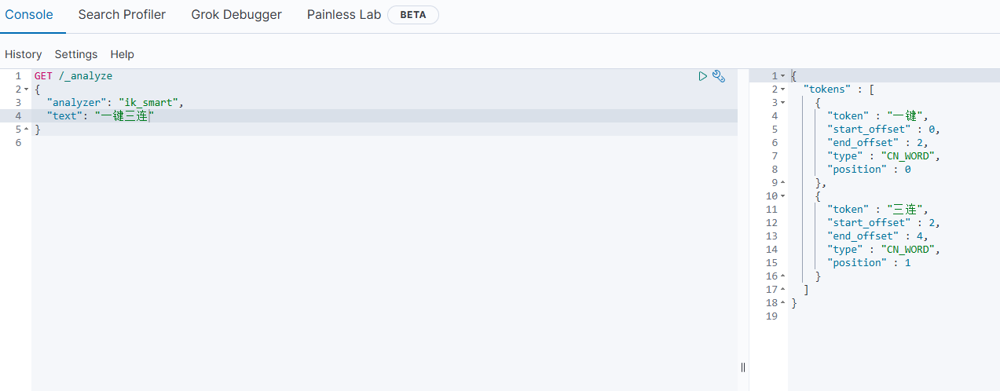

添加扩展词字典文件之后的分词效果。
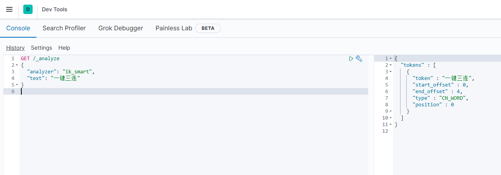

#### 自定义停止词字典

IK分词器也提供了强大的停用词功能，让我们在进行分词处理的时候直接忽略停用词字典中的内容。

停止词可以是一些语气词汇，也可以是指一些敏感词汇。例如关于宗教、政治等敏感词语。

1. 新建停止词字典my_stopword01.dic

```
啊
哦
```

2. 在IKAnalyzer.cfg.xml配置文件内容添加

```xml
<?xml version="1.0" encoding="UTF-8"?>
<!DOCTYPE properties SYSTEM "http://java.sun.com/dtd/properties.dtd">
<properties>
	<comment>IK Analyzer 扩展配置</comment>
	<!--用户可以在这里配置自己的扩展字典 -->
	<entry key="ext_dict">my_ext01.dic</entry>
	 <!--用户可以在这里配置自己的扩展停止词字典-->
	<entry key="ext_stopwords">my_stopword01.dic</entry>
	<!--用户可以在这里配置远程扩展字典 -->
	<!-- <entry key="remote_ext_dict">words_location</entry> -->
	<!--用户可以在这里配置远程扩展停止词字典-->
	<!-- <entry key="remote_ext_stopwords">words_location</entry> -->
</properties>
```

3. 将my_stopword01.dic文件添加到analysis-ik目录中。然后重启elasticsearch容器。
4. 测试效果

如图所示。针对停止词`啊`，不进行分词处理。
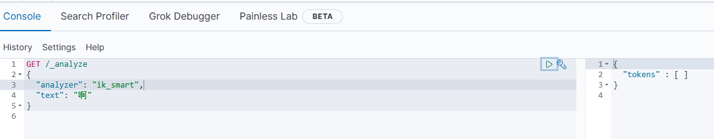


## 索引操作

在elasticsearch中，索引相当于传统数据库中的表格，映射相当于传统数据库中定义的表结构定义。

索引：即相同类型的文档数据的集合。
映射：即文档数据中的各个字段定义，约束。 

我们要向elasticsearch中存储数据，必须先创建索引（表格）和映射（表结构定义）。

### Mapping 映射属性

在elasticsearch中，Mapping 映射属性相当于文档数据中的各个字段的定义。例如字段数据类型，字段约束。

因此下面介绍一些，常见的Mapping 映射属性有哪些。

- type：字段数据类型，常见的类型有：
    - 字符串：text（可分词的文本）、keyword（精确值，例如：品牌、国家、ip地址）。keyword类型只能整体搜索，不支持搜索部分内容
    - 数值：long、integer、short、byte、double、float、
    - 布尔：boolean
    - 日期：date
    - 对象：object
- index：是否创建索引，默认为true。如果某个字段需要搜索，排序。就添加该属性。
- analyzer：使用哪种分词器。如果某个字段需要分词处理，就可以添加该属性。
- properties：该字段的子字段。如果某个字段需要子字段，就可以添加该属性。

### 索引库的CRUD

这里统一使用Kibana编写DSL语句的方式来演示。

#### 创建索引库

创建索引库的语法如下。

```js
// 下面的DSL语句的含义是，PUT请求，接口名称为索引库名称，请求数据为索引中的映射定义。

PUT /索引库名称
{
  "mappings": {                 //该索引的映射属性mappings
    "properties": {             //properties 表示为mappings字段的子字段
      "字段名1":{
        "type": "text",         //字段1的数据类型为text
        "analyzer": "ik_smart"  //字段1的使用ik_smart分词器
      },
      "字段名2":{
        "type": "keyword",      //字段2的数据类型为keyword
        "index": "false"        //不创建字段2的索引
      },        
      "字段名3":{
        "properties": {         //properties 表示为字段名3的子字段
          "子字段1": {          //子字段1 是 字段3的子属性字段。
            "type": "keyword"       //子字段1的数据类型为keyword
          }
        }
      },
      // ...略
    }
  }
}

```

例子：创建一个商品索引库。商品索引包含各个映射属性字段（id，goods_name，goods_price，goods_extend_info等）。

```js
PUT /goods
{
  "mappings": {
    "properties": {
      "id":{                     //商品id字段
        "type": "integer"       //数据类型为integer           
      },
      "goods_name":{                //商品名称字段
        "type": "text",             //数据类型为文本
        "analyzer": "ik_smart"      //使用ik分词器，进行分词处理
      },
      "goods_price":{           //商品价格字段
        "type": "double",       //数据类型为浮点数
         "index": "false"       //该字段不使用索引
      },
      "goods_extend_info":{        //商品额外信息字段
        "type":"object",             // 数据类型为object
        "properties": {             
            "goods_size":{          //商品尺寸字段
                "type": "integer" 
            },
            "goods_origin":{        //商品产地字段
                "type": "text" 
            }
        }
      }
      // ...略
    }
  }
}
```

如图所示，商品索引库创建成功
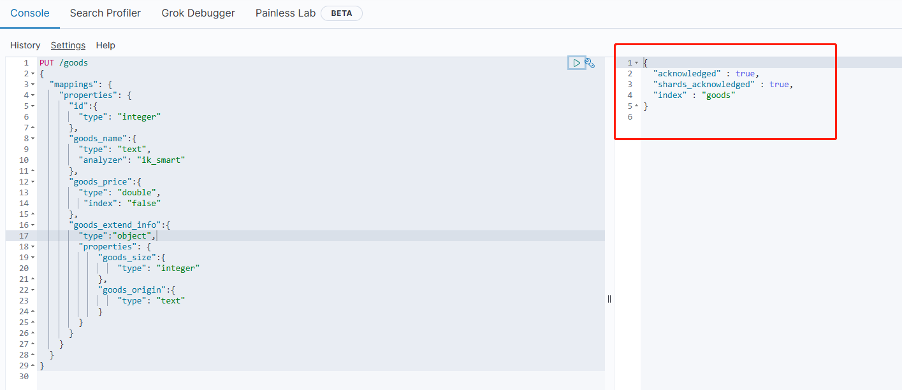

#### 查询索引库

查询索引库的语法如下。

```js
// 语法格式： GET /索引库名称
GET /goods
```

如图所示，查询商品索引库。

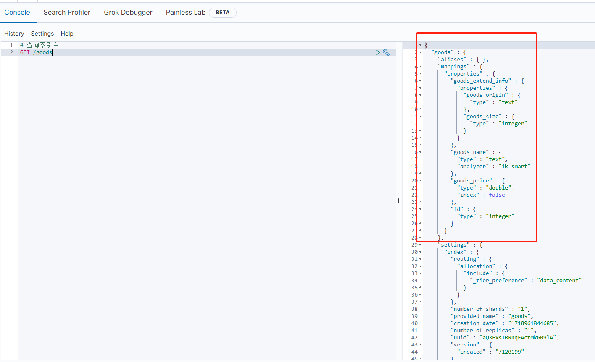

#### 修改索引库

在elasticsearch中，无法修改索引库中已经存在的mapping映射属性。只能增加新的mapping映射属性到索引中。

修改索引库的语法如下。

```js
// 语法格式
PUT /索引库名/_mapping
{
  "properties": {
    "新字段名":{
      "type": "integer"
    }
  }
}

//例子,给商品索引库，新增商品日期字段
PUT /goods/_mapping
{
  "properties": {
    "goods_date":{
      "type": "date"
    }
  }
}
```

如图所示
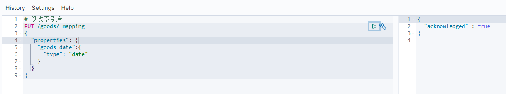

#### 删除索引库

删除索引库的语法如下。

```js
// 语法格式： DELETE  /索引库名称
// 例子 删除商品索引库
DELETE /goods
```

如图所示
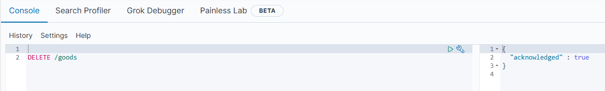

## 文档操作

当索引库创建好后。我们需要开始向操作索引库中的数据，即文档数据。

