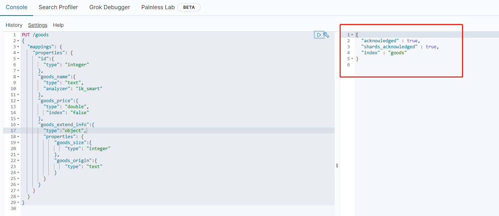
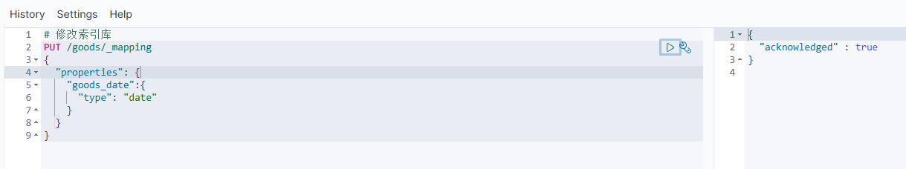
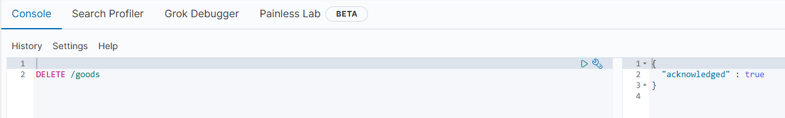

[toc]

# Elasticsearch笔记2

- Elasticsearch版本为8.13.4
- kibana版本为8.13.4

## 索引操作

在elasticsearch中，索引相当于传统数据库中的表格，映射相当于传统数据库中定义的表结构定义。

索引：即相同类型的文档数据的集合。
映射：即文档数据中的各个字段定义，约束。 

我们要向elasticsearch中存储数据，必须先创建索引（表格）和映射（表结构定义）。

### Mapping 映射属性

在elasticsearch中，Mapping 映射属性相当于文档数据中的各个字段的定义。例如字段数据类型，字段约束。

因此下面介绍一些，常见的Mapping 映射属性有哪些。

- type：字段数据类型，常见的类型有：
    - 字符串：text（可分词的文本）、keyword（精确值，例如：品牌、国家、ip地址）。keyword类型只能整体搜索，不支持搜索部分内容
    - 数值：long、integer、short、byte、double、float、
    - 布尔：boolean
    - 日期：date
    - 对象：object
- index：是否创建索引，默认为true。如果某个字段需要搜索，排序。就添加该属性。
- analyzer：使用哪种分词器。如果某个字段需要分词处理，就可以添加该属性。
- properties：该字段的子字段。如果某个字段需要子字段，就可以添加该属性。

### 动态映射

在Elasticsearch8.x以上的版本中，出现了一个新的动态映射的概念。

动态映射是指，当索引不存在或者索引没有设置Mapping 映射属性的时候。如果文档数据插入到索引库中，那么Elasticsearch会根据文档数据，自动为索引设置Mapping 映射属性。

动态映射的默认规则如下所示


- 日期检测默认的格式："yyyy/MM/dd HH:mm:ss 或 yyyy/MM/dd"
- 数值检测默认是关闭的， 不建议开启， 正确的解决方案是显式映射这些字段。


### 索引库的CRUD

这里在Kibana中的Dev Tools界面中，使用DSL语句来请求Elasticsearch的API接口,从而操作Elasticsearch。


#### 创建索引库

创建索引库的语法如下。

```js
// 下面的DSL语句的含义是，PUT请求，接口名称为索引库名称，请求数据为索引中的映射定义。

PUT /索引库名称
{
  "mappings": {                 //该索引的映射属性mappings
    "properties": {             //properties 表示为mappings字段的子字段
      "字段名1":{
        "type": "text",         //字段1的数据类型为text
        "analyzer": "ik_smart"  //字段1的使用ik_smart分词器
      },
      "字段名2":{
        "type": "keyword",      //字段2的数据类型为keyword
        "index": "false"        //不创建字段2的索引
      },        
      "字段名3":{
        "properties": {         //properties 表示为字段名3的子字段
          "子字段1": {          //子字段1 是 字段3的子属性字段。
            "type": "keyword"       //子字段1的数据类型为keyword
          }
        }
      },
      // ...略
    }
  }
}

```

例子：创建一个商品索引库。商品索引包含各个映射属性字段（id，goods_name，goods_price，goods_extend_info等）。

```js
PUT /goods
{
  "mappings": {
    "properties": {
      "id":{                     //商品id字段
        "type": "integer"       //数据类型为integer           
      },
      "goods_name":{                //商品名称字段
        "type": "text",             //数据类型为文本
        "analyzer": "ik_smart"      //使用ik分词器，进行分词处理
      },
      "goods_price":{           //商品价格字段
        "type": "double",       //数据类型为浮点数
         "index": "false"       //该字段不使用索引
      },
      "goods_extend_info":{        //商品额外信息字段
        "type":"object",             // 数据类型为object
        "properties": {             
            "goods_size":{          //商品尺寸字段
                "type": "integer" 
            },
            "goods_origin":{        //商品产地字段
                "type": "text" 
            }
        }
      }
      // ...略
    }
  }
}
```

如图所示，商品索引库创建成功


#### 查询索引库

查询索引库的语法如下。

```js
// 语法格式： GET /索引库名称
GET /goods
```

如图所示，查询商品索引库。


#### 修改索引库

在elasticsearch中，无法修改索引库中已经存在的mapping映射属性。只能增加新的mapping映射属性到索引中。

修改索引库的语法如下。

```js
// 语法格式
PUT /索引库名/_mapping
{
  "properties": {
    "新字段名":{
      "type": "integer"
    }
  }
}

//例子,给商品索引库，新增商品日期字段
PUT /goods/_mapping
{
  "properties": {
    "goods_date":{
      "type": "date"
    }
  }
}
```

如图所示


#### 删除索引库

删除索引库的语法如下。

```js
// 语法格式： DELETE  /索引库名称
// 例子 删除商品索引库
DELETE /goods
```

如图所示


## 文档操作

当索引库创建好后。我们就需要操作索引库中的数据，即文档数据。

这里在Kibana中的Dev Tools界面中，使用DSL语句来请求Elasticsearch的API接口,从而操作Elasticsearch。


### 文档的CRUD

- 创建文档：POST /{索引库名}/_doc/文档id
- 查询文档：GET /{索引库名}/_doc/文档id
- 删除文档：DELETE /{索引库名}/_doc/文档id
- 修改文档：
  - 全量修改：PUT /{索引库名}/_doc/文档id
  - 增量修改：POST /{索引库名}/_update/文档id


> 新增文档数据

```js
//新增文档数据 语法如下
POST /索引库名/_doc/文档id
{
    "字段1": "值1",
    "字段2": "值2",
    "字段3": {
        "子属性1": "值3",
        "子属性2": "值4"
    },
    // ...
}

//例子，新增id为1的文档数据
POST /goods/_doc/1
{
  "id":1,
  "goods_name": "小米手机",
    "goods_price": 1999,
  "goods_extend_info": {
        "goods_size": 100,
        "goods_origin": "湖北"
  }
}
```

如图所示，运行结果


> 查询文档数据

```js
//查询文档数据 语法如下
GET /{索引库名称}/_doc/{id}

//批量查询：查询该索引库下的全部文档
GET /{索引库名称}/_search

//例子,查询id为1的商品文档数据
GET /goods/_doc/1
//查询所有的商品文档数据
GET /goods/_search
```

如图所示，运行结果


> 修改文档数据

修改文档数据有两种方式：
- 全量修改：会直接覆盖原来的文档数据。相当于先删除，后新增。
- 增量修改：直接修改文档中的部分字段数据。

```js
// 全量修改文档数据 语法如下
PUT /{索引库名}/_doc/文档id
{
    "字段1": "值1",
    "字段2": "值2",
    // ... 略
}

// 增量修改文档数据，语法如下
POST /{索引库名}/_update/文档id
{
    "doc": {
         "字段名": "新的值",
    }
}

//例子 全量修改 id为1的商品文档数据
PUT /goods/_doc/1
{
    "id":1,
    "goods_name": "华为手机",
      "goods_price": 3999,
    "goods_extend_info": {
          "goods_size": 100,
          "goods_origin": "北京"
    }
}

//例子 增量修改 id为1的商品文档数据中的goods_name字段
POST /goods/_update/1
{
    "doc": {
         "goods_name": "华为手机Mate20"
    }
}

```

> 删除文档数据

```js
// 删除文档数据 语法如下
DELETE /{索引库名}/_doc/id值

//例子 删除id为1的商品文档数据
DELETE /goods/_doc/1

```

## SpringBoot整合ElasticSearch8

目前ElasticSearch版本为8.13.4 ，SpringBoot版本为3.3.1。

在ElasticSearch 8.x的版本中，ES提供了一个新的API客户端 Elasticsearch Java API Client。如果我们想要用Java去调用ElasticSearch 8.x的API接口，那么我们需要使用这个客户端。

并且为了方便本地测试，我们可以在ES的配置文件中关闭xpack安全认证（用户名+密码+HTTPS）。

### 导入依赖

导入spring-boot-starter-data-elasticsearch依赖。

```xml
<dependency>
    <groupId>org.springframework.boot</groupId>
    <artifactId>spring-boot-starter-data-elasticsearch</artifactId>
</dependency>
```

如果你的springboot的版本为3.3.1，那么上面的代码会自动导入spring-boot-starter-data-elasticsearch依赖的3.3.1版本。

并且该依赖内置了
- co.elastic.clients.elasticsearch-java依赖的8.13.4版本
- org.elasticsearch.client.elasticsearch-rest-client依赖的8.13.4版本


### 创建客户端对象

```java
package com.example.esdemo.config;

import co.elastic.clients.elasticsearch.ElasticsearchClient;
import co.elastic.clients.json.jackson.JacksonJsonpMapper;
import co.elastic.clients.transport.ElasticsearchTransport;
import co.elastic.clients.transport.rest_client.RestClientTransport;
import org.apache.http.HttpHost;
import org.elasticsearch.client.RestClient;
import org.elasticsearch.client.RestClientBuilder;
import org.springframework.context.annotation.Bean;
import org.springframework.context.annotation.Configuration;

@Configuration
public class ElasticSearchConfig {
    //创建ElasticsearchClient客户端对象，并注入IOC容器中
    @Bean
    public ElasticsearchClient elasticsearchClient(){

        //创建构建器对象RestClientBuilder
        //RestClientBuilder: ES客户端库的构建器接口,用于构建RestClient实例;
        //可以配置与Elasticsearch集群的连接,设置请求超时,设置身份验证,配置代理等
        RestClientBuilder builder = RestClient.builder(new HttpHost("localhost", 39200,"http"));

        // 连接延时配置
        builder.setRequestConfigCallback(requestConfigBuilder -> {
            //设置连接超时时间
            requestConfigBuilder.setConnectTimeout(1000);
            //设置连接超时时间
            requestConfigBuilder.setSocketTimeout(30000);
            //设置请求超时时间
            requestConfigBuilder.setConnectionRequestTimeout(1000);
            return requestConfigBuilder;
        });

        // 连接数配置
        builder.setHttpClientConfigCallback(httpClientBuilder -> {
            //设置最大连接数
            httpClientBuilder.setMaxConnTotal(100);
            //设置每个路由的最大连接数
            httpClientBuilder.setMaxConnPerRoute(100);
            return httpClientBuilder;
        });

        //通过构建器对象RestClientBuilder 创建 RestClient对象，最后创建出ElasticsearchClient对象
        RestClient client = builder.build();
        ElasticsearchTransport transport = new RestClientTransport(client,new JacksonJsonpMapper());
        ElasticsearchClient esClient = new ElasticsearchClient(transport);
        return esClient;
    }

}

```

### 索引操作

创建测试类进行测试。

注意：在elasticSearch8.x版本中。如果索引没有设置好映射Mapping属性。当文档数据插入到索引库中的时候，es会自动根据文档数据，自动给索引创建映射Mapping属性。

因此我们无需提前设置好索引的映射Mapping属性

```java
@SpringBootTest
@Slf4j
class EsDemoApplicationTests {

    @Autowired
    private ElasticsearchClient elasticsearchClient;

    /**
     * 创建索引
     * @throws IOException
     */
    @Test
    public void createIndex() throws IOException {
        CreateIndexResponse response = elasticsearchClient.indices().create(c -> c.index("user_index"));
        //响应状态
        boolean acknowledged = response.acknowledged();
        boolean shardsAcknowledged = response.shardsAcknowledged();
        String index = response.index();
        log.info("创建索引状态:{}",acknowledged);
        log.info("已确认的分片:{}",shardsAcknowledged);
        log.info("索引名称:{}",index);
    }

    /**
     * 查询索引
     * @throws IOException
     */
    @Test
    public void queryIndex() throws IOException {
        // 查看指定索引
        GetIndexResponse response = elasticsearchClient.indices().get(s -> s.index("user_index"));
        Map<String, IndexState> result = response.result();
        result.forEach((k, v) -> log.info("key = {},value = {}",k ,v));

    }

    /**
     * 判断索引是否存在
     * @throws IOException
     */
    @Test
    public void existsIndex() throws IOException {
        BooleanResponse response = elasticsearchClient.indices().exists(e -> e.index("user_index"));
        System.out.println(response.value());
    }

    /**
     * 删除索引
     * @throws IOException
     */
    @Test
    public void deleteTest() throws IOException {
        DeleteIndexResponse response = elasticsearchClient.indices().delete(d -> d.index("user_index"));
        System.out.println(response.acknowledged());
    }
}
```

### 文档操作

创建测试类进行测试。

1. 创建文档对应的实体类。

```java
@Data
@AllArgsConstructor
public class UserIndex {
    private String id;
    private String name;
    private Integer age;
}
```

2. 编写测试类

```java
package com.example.esdemo;

@SpringBootTest
@Slf4j
class EsDemoApplicationTests {

    @Autowired
    private ElasticsearchClient elasticsearchClient;

    /**
     * 新增文档数据
     * @throws IOException
     */
    @Test
    public void addDocument() throws IOException {
        //创建一个user对象
        UserIndex user = new UserIndex(1,"user1", 10);
        //将user对象转换为文档数据，并添加到user_index索引中
        IndexResponse response = elasticsearchClient.index(i -> i.index("user_index").id(user.getId().toString()).document(user));
        log.info("新增文档操作结果:{}",response.result().jsonValue());
    }

    /**
     * 更新文档数据
     * @throws IOException
     */
    @Test
    public void updateDocument() throws IOException {
        UserIndex user2 = new UserIndex(2, "user2", 13);
        // 更新user_index 索引中的id为1的文档数据，更新为user2对象
        UpdateResponse<UserIndex> response = elasticsearchClient.update(u -> u.index("user_index").id("1").doc(user2), UserIndex.class);
        log.info("更新文档操作结果:{}",response.result());
    }

    /**
     * 查询文档数据
     * @throws IOException
     */
    @Test
    public void getDocument() throws IOException {
        //在user_index索引中，查询id为1的文档数据
        GetResponse<UserIndex> response = elasticsearchClient.get(g -> g.index("user_index").id("1"), UserIndex.class);
        log.info("查询文档操作结果:{}",response.source());

    }

    /**
     * 删除文档数据
     * @throws IOException
     */
    @Test
    public void deleteDocumentTest() throws IOException {
        //删除user_index 索引中的id为1的文档数据
        DeleteResponse response = elasticsearchClient.delete(d -> d.index("user_index").id("1"));
        log.info("删除文档操作结果:{}",response.result());
    }

    /**
     * 批量新增文档数据
     * @throws IOException
     */
    @Test
    public void batchAddDocument() throws IOException {
        List<UserIndex> users = new ArrayList<>();
        users.add(new UserIndex(1, "阿一", 20));
        users.add(new UserIndex(2,"阿二",25));
        users.add(new UserIndex(3,"阿三",22));
        users.add(new UserIndex(4,"阿四",20));

        BulkRequest.Builder br = new BulkRequest.Builder();
        for (UserIndex user : users) {
            br.operations(op -> op
                    .index(idx -> idx
                            .index("user_index")
                            .id(user.getId().toString())
                            .document(user)));
        }
        BulkResponse response = elasticsearchClient.bulk(br.build());
        log.info("批量新增文档数据结果:{}",response);
    }

    /**
     * 批量删除文档数据
     * @throws IOException
     */
    @Test
    public void batchDeleteDocument() throws IOException {
        List<String> list = new ArrayList<>();
        list.add("1");
        list.add("2");
        list.add("3");
        list.add("4");
        List<BulkOperation> bulkOperations = new ArrayList<>();
        list.forEach(a ->bulkOperations.add(BulkOperation.of(b -> b.delete(c -> c.id(a)))));

        BulkRequest.Builder br = new BulkRequest.Builder();
        for (String s : list) {
            br.operations(op -> op.delete(c -> c.id(s)));
        }
        BulkResponse response = elasticsearchClient.bulk(br.build());
        log.info("批量删除文档数据结果:{}",response);
    }
}   

```


### 查询操作

- 普通搜索查询
- 模糊查询

```java
package com.example.esdemo;

@SpringBootTest
@Slf4j
class EsDemoApplicationTests02 {

    @Autowired
    private ElasticsearchClient elasticsearchClient;

    /**
     * 普通搜索查询
     *
     * @throws IOException ioexception
     */
    @Test
    void searchOne() throws IOException {
        String searchText = "华为手机";
        SearchResponse<UserIndex> response = elasticsearchClient.search(s -> s
                        // 搜索的索引的名称
                        .index("user_index")
                        // 查询
                        .query(q -> q.match(t -> t
                                        // field为文档中的字段，此处是name属性字段
                                        .field("name")
                                        //查询内容
                                        .query(searchText)
                                )
                        ),
                // 匹配文档的目标类
                UserIndex.class
        );
        //打印查询数量
        TotalHits total = response.hits().total();
        log.info("查询结果数量 total 为 {}",total.value());
        //打印查询结果
        List<Hit<UserIndex>> hits = response.hits().hits();
        log.info("查询内容为：{}",hits);
    }

    /**
     * 模糊查询
     * @throws IOException ioexception
     */
    @Test
    void fuzzyQuerySearch() throws IOException
    {
        SearchResponse<UserIndex> response = elasticsearchClient.search(s -> s.index("user_index")
                        //fuzzy 模糊查询 field 字段 value 模糊查询的内容 fuzziness代表可以与关键词有误差的字数，可选值为0、1、2这三项
                        .query(q -> q.fuzzy(f -> f.field("name").value("阿").fuzziness("2")))
                        // 过滤排序
                        .source(source -> source.filter(f -> f.includes("name","id").excludes(""))),
            UserIndex.class
        );
        //打印查询数量
        TotalHits total = response.hits().total();
        log.info("查询结果数量 total 为 {}",total.value());
        //打印查询结果
        List<Hit<UserIndex>> hits = response.hits().hits();
        log.info("查询内容为：{}",hits);
    }

}

```