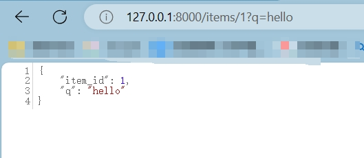

[toc]

# FastAPI笔记1

FastAPI 是一个用于构建 API 的现代、快速（高性能）的 web 框架，专为在 Python 中构建 RESTful API 而设计。

> FastAPI 特点

- 高性能： FastAPI是建立在Starlette和Pydantic之上的，利用异步（asynchronous）编程，提供出色的性能。
- 自动文档生成： 自动生成交互式API文档，支持Swagger UI和ReDoc，让API的理解和测试更加直观。
- 类型注解支持： 利用Python的类型提示，提供更严格的输入验证和更好的代码提示。
- 异步支持： 支持异步请求处理，使得处理IO密集型任务更加高效。

> FastAPI 使用场景

- 构建API后端： 用于构建RESTful API，支持前后端分离的Web应用。
- 微服务架构： 可以作为微服务的后端框架，支持快速开发和部署。
- 数据处理API： 适用于处理数据，接收和返回JSON数据。
- 实时通信： 支持WebSocket，适用于实时通信场景。

> 什么是Starlette和Pydantic？

FastAPI是建立在Starlette和Pydantic之上的。那么Starlette和Pydantic是什么？

Starlette 是一个轻量级的异步Web框架，用于构建高性能、可扩展和易维护的Web应用程序。
- Starlette是基于Python的asyncio库构建的，因此完全支持异步编程。
- Starlette的设计目标之一是保持简单和轻量级。
- Starlette提供了灵活的路由系统，可以根据URL模式将请求路由到相应的处理函数。
- Starlette内置了异常处理机制，可以捕获和处理应用程序中的异常。
....

Pydantic 是一个Python库，用于数据验证和解析。它的主要目标是使数据验证变得简单且易于维护。
- Pydantic 使用Python的类型注解来定义数据模型，使得代码更具可读性和可维护性。
- Pydantic 自动验证输入数据是否符合定义的模型规范。
- Pydantic 能够将原始数据解析成Python对象。
- Pydantic 可以根据数据模型自动生成文档，包括字段名称、数据类型、默认值等信息。

> Starlette和Pydantic和FastAPI的关联。


## FastAPI 安装

FastAPI 依赖 Python 3.8 及更高版本。

```py
# 使用 pip 命令来安装FastAPI
pip install fastapi
```

另外通过FastAPI构建的web应用程序需要运行在web服务器上。因此我们还需要安装一个 ASGI 服务器，在生产环境上可以使用 Uvicorn。

Uvicorn是一个基于ASGI的高性能Web服务器，专门用于运行ASGI应用程序。

```py
# 使用 pip 命令来安装uvicorn
pip install "uvicorn[standard]"
```

## 第一个 FastAPI 应用

① 创建一个 main.py 的文件。并进行编辑。

```py
# 导入fastapi和typing模块中必要的
from typing import Union
# 导入fastapi包的FastAPI类
from fastapi import FastAPI
# 导入pydantic包的BaseModel类
from pydantic import BaseModel

# 创建 FastAPI 应用实例。用于定义和管理应用的各个组件
app = FastAPI()

# 定义Item类，该类继承BaseModel类
# Item类的属性如下
class Item(BaseModel):
    name: str                           # name属性是字符串类型的
    price: float                        # price属性是浮点数类型的
    is_offer: Union[bool, None] = None  # is_offer属性可以是bool类型的，也可以是None

# 定义根路径 / 的路由操作
@app.get("/")
def read_root():
    return {"Hello": "World"}

# 定义路径 /items/{item_id} 的路由操作
@app.get("/items/{item_id}")
def read_item(item_id: int, q: Union[str, None] = None):
    return {"item_id": item_id, "q": q}

# 定义路径 /newItem 的路由操作，put请求的
@app.put("/newItem")
def update_item(item: Item):
    return {"item_name": item.name, "item_price": item.price}
```

代码解析：
1. `@app.get("xxx")`是一个装饰器。表示当请求路径匹配上路由路径时，将执行这个装饰器装饰的函数。函数返回值就是请求的响应数据。
2. `item_id: int`意思是参数 item_id  的类型指定为int整数类型。
3. `q: Union[str, None] = None`意思是参数 q 通过 `Union[str, None]` 表示可以是字符串类型或空。这样就允许在请求中可以不提供 q 参数。
4. `item: Item`意思是参数item的类型是Item类。


② 在main.py文件的当前目录下，命令行中运行以下命令以启动FastAPI应用程序。

```sh
# --reload 当文件修改后，会自动加载最新内容。
uvicorn main:app --reload
```


③ 浏览器访问各个请求路径。




④ 访问API文档

FastAPI 提供了内置的交互式 API 文档，使开发者能够轻松了解和测试 API 的各个接口。

这个文档是自动生成的，基于 OpenAPI 规范，支持 Swagger UI 和 ReDoc 两种交互式界面。

- 你可以通过访问 `http://127.0.0.1:8000/docs` 来打开 Swagger UI 风格的文档。
- 你也可以通过访问 `http://127.0.0.1:8000/redoc` 来打开 ReDoc 风格的文档。


## FastAPI 路由

在 FastAPI 中，每个路由都映射到应用程序中的一个函数，用于处理特定的 HTTP 请求，并返回相应的响应数据。

> 普通路由

创建 FastAPI 应用实例和路由。

```py
# 导入FastAPI类
from fastapi import FastAPI
# 通过FastAPI类创建FastAPI应用实例
app = FastAPI()

# 创建根路径路由
@app.get("/")
def read_root():
    return {"Hello": "World"}

# 创建/test路由
@app.get("/test")
def test():
    return {"test": "test"}
```

- `app = FastAPI()` 创建 FastAPI 应用实例。
- `@app.get("xxx")` 使用 @app.get 装饰器创建一个处理GET请求的路由，并将路由与函数绑定。
- `def read_root()` 路由处理函数，函数返回值就是请求响应数据。

> 携带路径参数的路由

```py
from fastapi import FastAPI
app = FastAPI()

@app.get("/items/{item_id}")
def read_item(item_id: int, q: str = None):
    return {"item_id": item_id, "q": q}
```

- `@app.get("/items/{item_id}")` 定义了一个路由路径，其中{item_id} 是路径参数，对应于函数参数 item_id。
- ` q: str = None` 表示参数q 是一个可选的字符串类型参数，默认值为 None。


## FastAPI 请求和响应

FastAPI 提供了强大的工具来解析请求数据，并根据需要生成规范的响应。

> 请求参数默认值

可以给函数设置默认的请求参数值

```py
from fastapi import FastAPI
app = FastAPI()

@app.get("/items/")
def read_item(skip: int = 0, limit: int = 10):
    return {"skip": skip, "limit": limit}
```

两个参数 skip 和 limit，它们的类型均为整数，默认值分别为 0 和 10。

> 请求体参数

我们可以使用pydantic包来创建数据模型。通过数据模型来接收请求体的参数。

```py
from pydantic import BaseModel
from fastapi import FastAPI

app = FastAPI()
# 定义数据模型Item类及其属性。该类继承BaseModel类
class Item(BaseModel):
    name: str
    description: str = None
    price: float
    tax: float = None

# post请求
@app.post("/items/")
def create_item(item: Item):
    return item
```

- `item: Item` 函数参数为Item类。该参数可以接收一个请求体数据，数据的格式需要与Item类相同。


> JSON响应数据

若函数返回一个字典类型数据，FastAPI 会把函数的返回值自动转换为 JSON 格式，并作为响应数据发送给客户端。

```py
from fastapi import FastAPI
app = FastAPI()

@app.get("/items/")
def read_item(skip: int = 0, limit: int = 10):
    return {"skip": skip, "limit": limit}  # 返回字典数据
```


>  数据模型响应数据

如果路由处理函数返回一个 Pydantic 数据模型实例，FastAPI 将自动将其转换为 JSON 格式，并作为响应发送给客户端。

```py
from pydantic import BaseModel
from fastapi import FastAPI

app = FastAPI()

# 定义数据模型类
class Item(BaseModel):
    name: str
    description: str = None
    price: float
    tax: float = None

@app.post("/items/")
def create_item(item: Item):
    return item  # 返回数据模型类数据
```

> 请求头和Cookie

路由函数可以使用 Header 和 Cookie 类型注解获取请求头和 Cookie 数据。

```py
from fastapi import Header, Cookie
from fastapi import FastAPI

app = FastAPI()

@app.get("/items/")
def read_item(user_agent: str = Header(None), session_token: str = Cookie(None)):
    return {"User-Agent": user_agent, "Session-Token": session_token}
```

> 重定向

使用 RedirectResponse 实现重定向，将客户端重定向到其他路由上。

```py
from fastapi import FastAPI
from fastapi.responses import RedirectResponse

app = FastAPI()

@app.get("/a")
def a():
    return {"a": "a"}

@app.get("/redirect")
def redirect():
    return RedirectResponse(url="/a")  # 重定向到/a路由上
```

在浏览器访问`/redirect`路由的时候会自动跳转到 `/a`路由。

> 请求状态码

使用 HTTPException 可以抛出异常，返回自定义的状态码和详细信息。

```py
from fastapi import HTTPException

@app.get("/items")
def read_item():
    # 抛出HTTPException异常，参数为异常信息
    raise HTTPException(status_code=404, detail="Item not found")
```


> 自定义响应头

使用 JSONResponse 可以自定义响应头数据。

```py
from fastapi import FastAPI
from fastapi.responses import JSONResponse

app = FastAPI()

@app.get("/items/{item_id}")
def read_item(item_id: int):
    content = {"item_id": item_id}
    headers = {"X-Custom-Header": "custom-header-value"}
    return JSONResponse(content=content, headers=headers)
```

## Pydantic 模型

Pydantic 是一个用于数据验证和序列化的 Python 数据模型库。

它在 FastAPI 中广泛使用，用于定义请求体、响应体和其他数据模型，提供了强大的类型检查和自动文档生成功能。

### 定义模型

使用 Pydantic 定义一个模型非常简单，只需创建一个继承自 pydantic.BaseModel 的类，并在其中定义字段。字段的类型可以是任何有效的 Python 类型，也可以是 Pydantic 内置的类型。

```py
# 导入Pydantic包的 BaseModel类
from pydantic import BaseModel
# 定义Item模型类及其属性字段，继承BaseModel类
class Item(BaseModel):
    name: str
    description: str = None
    price: float
    tax: float = None
```

description 和 tax 是可选的字段，并且默认值都为 None。

### 使用模型

在 FastAPI 中，可以将 Pydantic 模型用作请求体（Request Body），以自动验证和解析客户端发送的数据。

```py
from fastapi import FastAPI
from pydantic import BaseModel

app = FastAPI()

class Item(BaseModel):
    name: str
    description: str = None
    price: float
    tax: float = None

@app.post("/items/")
def create_item(item: Item):
    return item
```

上面代码中，函数接受一个名为 item 的参数，其类型是 Item 模型。FastAPI 将自动验证传入的 JSON 数据是否符合模型的定义，并将其转换为 Item 类型的实例对象。

> 参数验证

Pydantic 模型还可以用于验证查询参数、路径参数等。

```py
from fastapi import FastAPI, Query
from pydantic import BaseModel

app = FastAPI()

class Item(BaseModel):
    name: str
    description: str = None
    price: float
    tax: float = None

@app.get("/items/")
def read_item(item: Item, q: str = Query(..., max_length=10)):
    return {"item": item, "q": q}
```

通过使用 Query 函数，我们还可以为参数指定更多的验证规则，如最大长度限制。


## FastAPI 路径操作依赖项

FastAPI 提供了路径操作依赖项的机制，允许你在路由处理函数执行之前或之后运行一些额外的逻辑。

### 依赖项

依赖项是在路由操作函数执行前或后运行的可复用的函数或对象。它们被用于执行一些通用的逻辑，如验证、身份验证、数据库连接等。

在 FastAPI 中，依赖项通常用于两个方面：
- 预处理（Before）依赖项： 在路由操作函数执行前运行，用于预处理输入数据，验证请求等。
- 后处理（After）依赖项： 在路由操作函数执行后运行，用于执行一些后处理逻辑，如日志记录、清理等。

### 预处理（Before）依赖项

```py
from fastapi import Depends, FastAPI

app = FastAPI()

# 依赖项函数
def common_parameters(q: str = None, skip: int = 0, limit: int = 100):
    return {"q": q, "skip": skip, "limit": limit}

# 路由操作函数
@app.get("/items/")
async def read_items(commons: dict = Depends(common_parameters)):
    return commons

```

- 上面代码中依赖项函数接受参数 q、skip 和 limit，并返回一个包含这些参数的字典数据。
- `commons: dict = Depends(common_parameters)`路由操作函数 接收 依赖项函数的返回值 作为参数。


### 后处理（After）依赖项

```py
from fastapi import Depends, FastAPI
app = FastAPI()

# 后处理依赖项函数
async def after_request():
    # 这里可以执行一些后处理逻辑，比如记录日志
    pass

# 路由操作函数
@app.get("/items/", response_model=dict)
async def read_items_after(request: dict = Depends(after_request)):
    return {"message": "Items returned successfully"}
```

### 多个依赖项函数组合使用

```py
from fastapi import Depends, FastAPI
app = FastAPI()

# 依赖项函数1
def common_parameters(q: str = None, skip: int = 0, limit: int = 100):
    return {"q": q, "skip": skip, "limit": limit}

# 依赖项函数2, 依赖于依赖项函数common_parameters
def verify_token(token: str = Depends(common_parameters)):
    return token

# 路由操作函数, 依赖于依赖项函数verify_token
@app.get("/items/")
async def read_items(token: dict = Depends(verify_token)):
    return token
```

### 异步依赖项

依赖项函数和路由处理函数可以是异步的，允许在它们内部执行异步操作。

```py
from fastapi import Depends, FastAPI
from typing import Optional
import asyncio

app = FastAPI()

# 异步依赖项函数
async def get_token():
    # 模拟异步操作
    await asyncio.sleep(2)
    return "fake-token"

# 异步路由操作函数
@app.get("/items/")
async def read_items(token: Optional[str] = Depends(get_token)):
    return {"token": token}
```

上面代码中，get_token 是一个异步的依赖项函数，模拟了一个异步操作。

