[toc]

# FastAPI笔记1

FastAPI 是一个用于构建 API 的现代、快速（高性能）的 web 框架，专为在 Python 中构建 RESTful API 而设计。

> FastAPI 特点

- 高性能： FastAPI是建立在Starlette和Pydantic之上的，利用异步（asynchronous）编程，提供出色的性能。
- 自动文档生成： 自动生成交互式API文档，支持Swagger UI和ReDoc，让API的理解和测试更加直观。
- 类型注解支持： 利用Python的类型提示，提供更严格的输入验证和更好的代码提示。
- 异步支持： 支持异步请求处理，使得处理IO密集型任务更加高效。

> FastAPI 使用场景

- 构建API后端： 用于构建RESTful API，支持前后端分离的Web应用。
- 微服务架构： 可以作为微服务的后端框架，支持快速开发和部署。
- 数据处理API： 适用于处理数据，接收和返回JSON数据。
- 实时通信： 支持WebSocket，适用于实时通信场景。

> 什么是Starlette和Pydantic？

FastAPI是建立在Starlette和Pydantic之上的。那么Starlette和Pydantic是什么？

Starlette 是一个轻量级的异步Web库，用于构建高性能、可扩展和易维护的Web应用程序。
- Starlette是基于Python的asyncio库构建的，因此完全支持异步编程。
- Starlette的设计目标之一是保持简单和轻量级。
- Starlette提供了灵活的路由系统，可以根据URL模式将请求路由到相应的处理函数。
- Starlette内置了异常处理机制，可以捕获和处理应用程序中的异常。
....

Pydantic 是一个用于数据验证和解析的库。它的主要目标是使数据验证变得简单且易于维护。
- Pydantic 使用Python的类型注解来定义数据模型，使得代码更具可读性和可维护性。
- Pydantic 自动验证输入数据是否符合定义的模型规范。
- Pydantic 能够将原始数据解析成Python对象。
- Pydantic 可以根据数据模型自动生成文档，包括字段名称、数据类型、默认值等信息。

> Starlette和Pydantic和FastAPI的关联。

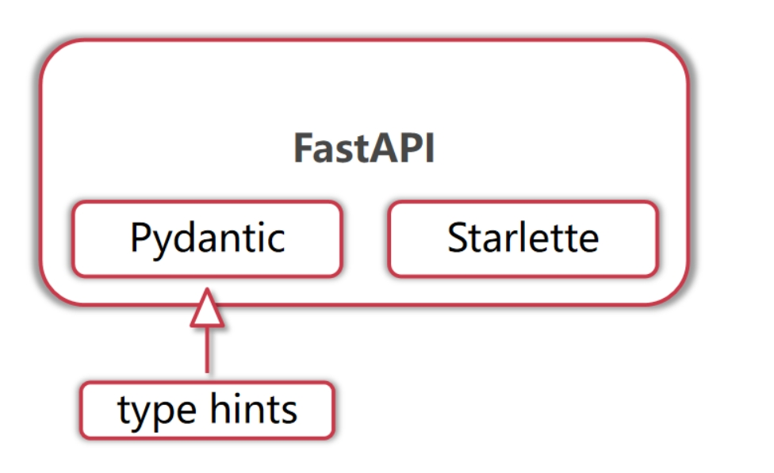

- Starlette是负责FastAPI中的web部分（异步web服务等）。
- Pydantic是负责FastAPI中的数据模型部分（类型提示等）。


## FastAPI 安装

FastAPI 依赖 Python 3.8 及更高版本。

```py
# 使用 pip 命令来安装FastAPI
pip install fastapi
```

另外通过FastAPI构建的web应用程序需要运行在web服务器上。因此我们还需要安装一个 ASGI 服务器，在生产环境上可以使用 Uvicorn。

Uvicorn是一个基于ASGI的高性能Web服务器，专门用于运行ASGI应用程序，即FastAPI构造的应用程序。

```py
# 使用 pip 命令来安装uvicorn
pip install "uvicorn[standard]"
```

## 第一个 FastAPI 应用

① 创建一个 `main.py` 的文件,并进行编辑。

```py
# 导入fastapi包的FastAPI类
from fastapi import FastAPI

# 创建 FastAPI 应用实例 app。用于定义和管理应用的各个组件
app = FastAPI()

# 在app应用实例上添加一个根路径 / 的路由。get请求的
@app.get("/")
def read_root():
    return {"Hello": "World"}

# 在app应用实例上添加一个路径为 /test 的异步路由。post请求的
@app.post("/test")
async def test():
    return {"test": "test"}
```

代码解析：
1. `@app.get("xxx")`这是一个装饰器。表示当请求路径匹配上路由的路径时，将执行这个装饰器装饰的函数。函数返回值就是请求的响应数据。
2. `async def test():` 意思是该函数是一个异步函数。没有表示是一个同步函数。


② 在main.py文件的当前目录下，命令行中运行以下命令以启动FastAPI应用程序。

```sh
# uvicorn 启动命令语法
uvicorn 文件名称:app --reload

# --reload 当文件修改后，会自动重写加载。
# main是要执行的py文件的名称
uvicorn main:app --reload
```

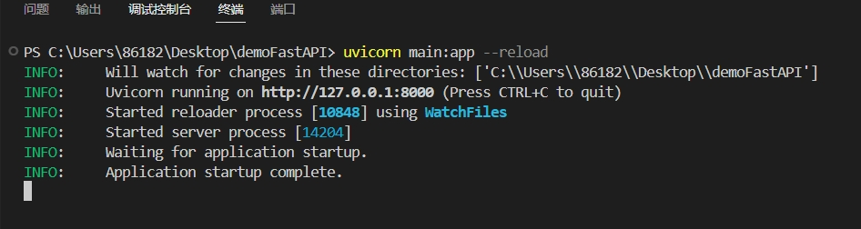

默认情况下uvicorn服务器的启动端口为8000

③ 浏览器访问各个请求路径。


④ 访问API文档

FastAPI 提供了内置的交互式 API 文档，使开发者能够轻松了解和测试 API 的各个接口。

这个文档是自动生成的，基于 OpenAPI 规范，支持 Swagger UI 和 ReDoc 两种交互式界面。

- 你可以通过访问 `http://127.0.0.1:8000/docs` 来打开 Swagger UI 风格的文档。
- 你也可以通过访问 `http://127.0.0.1:8000/redoc` 来打开 ReDoc 风格的文档。

如下图所示是接口文档页面
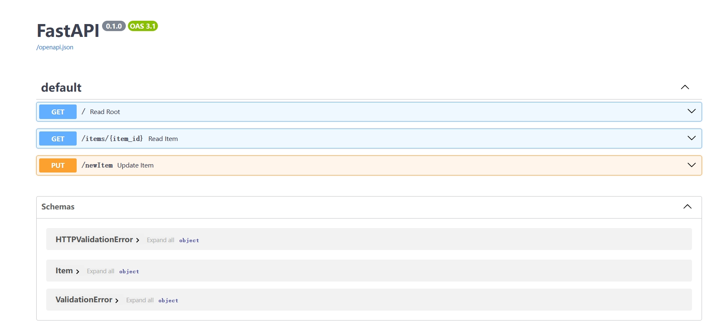
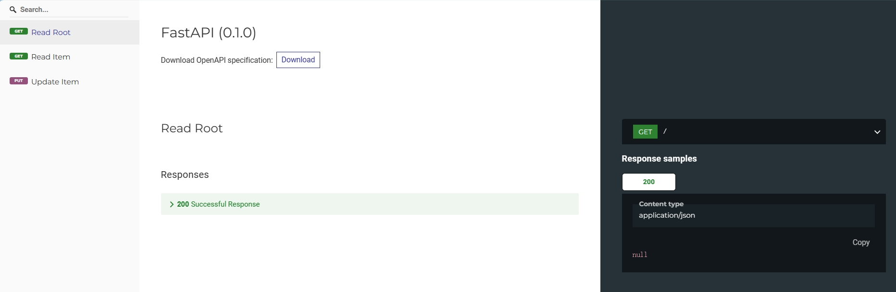

## FastAPI应用的启动端口和启动IP

默认情况下uvicorn服务器的启动端口为8000,启动IP为127.0.0.1

下面代码可以进行更改

```sh
# --reload 当文件修改后，会自动重写加载。
# main是要执行的py文件的名称
# --host 启动ip
# --port 启动端口
uvicorn main:app --host 0.0.0.0 --port 38080 --reload
```


## 路径操作装饰器

`@something`语法在 Python 中被称为「装饰器」。

而在 FastAPI 中，每个路由都通过路径操作装饰器来映射到程序中的一个函数中。

简而言之，路径操作装饰器用来绑定路由和函数。

常见的路径操作装饰器如下
```py
from fastapi import FastAPI
app = FastAPI()

## 四种HTTP请求方式的装饰器
@app.get()
@app.post()
@app.put()
@app.delete()
## 请求参数相关的装饰器
@app.options()
@app.head()
@app.patch()
@app.trace()
```

> 路径操作装饰器的参数

我们可以给路径操作装饰器中传入许多参数。从而实现不同的效果。

常用的装饰器参数如下。更多的参数请查询文档。
```py
from fastapi import FastAPI
app = FastAPI()
# 此处以post请求的路径操作装饰器举例
@app.post(
    path,
    response_model,
    status_code,
    tags,
    summary="xxx",
    description="xxx",
    response_description="xxx",
    responses,
    deprecated=False
    ....
)
```


### tags,summary,description等参数

tags,summary,description等参数主要用于给文档中的接口添加详细信息。

例子
```py
@app.post("/test",tags=["这是test接口的tag"],
          summary="这是test接口的summary",
          description="这是test接口的description",
          response_description="这是test接口的response_description")
def test():
    return {"Hello": "World"}
```

文档中的效果如下图所示。
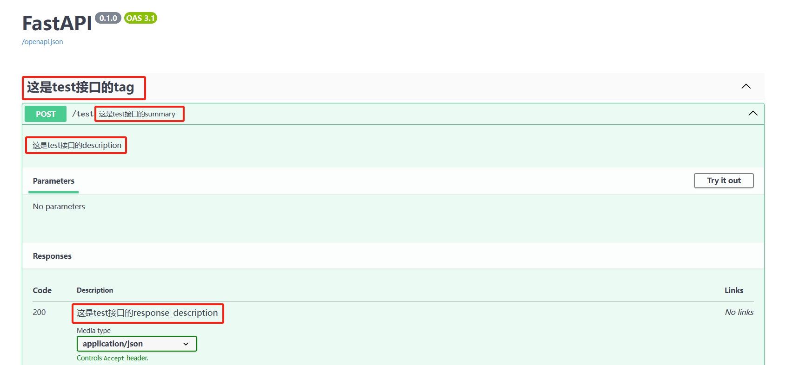


## FastAPI 路由

### APIRouter函数

在上面的第一个 FastAPI 应用的代码中。我们是先通过FastAPI()函数创建出FastAPI应用实例，然后直接在FastAPI应用实例上添加路由。如下面代码所示。

```py
# 导入fastapi包的FastAPI类
from fastapi import FastAPI
# 创建 FastAPI 应用实例 app。用于定义和管理应用的各个组件
app = FastAPI()

# 在app应用实例上添加一个根路径 / 的路由
@app.get("/")
def read_root():
    return {"Hello": "World"}
```

但是这种方式不规范，这种方式是直接把FastAPI应用实例和路由进行绑定，从而导致无法区分不同种类路由。因此FastAPI提供了一个APIRouter函数，专门用于路由管理。

如下面代码所示
```py
# 导入fastapi包的FastAPI类
from fastapi import FastAPI,APIRouter

# 创建 FastAPI 应用实例。用于定义和管理应用的各个组件
app = FastAPI()

# 创建路由实例
router = APIRouter()

# 创建根路由
@router.get("/")
def test():
    return {"Hello": "World"}
# 创建/test路由
@router.get("/test")
def test():
    return {"test": "test"}


# 通过include_router函数，把应用实例app与路由实例router绑定
app.include_router(router)
```

1. `router = APIRouter()`APIRouter函数用来创建路由实例。之后再路由实例上添加具体的路由。
2. `app.include_router(router)` 通过include_router函数，把应用实例app与路由实例router绑定在一起。

通过这种方式，我们可以把FastAPI的应用实例和路由实例分离开来。从而降低代码之间的耦合度。

### include_router函数

如上面代码所示，include_router函数可以将应用实例与路由实例绑定。除此之外，include_router函数还可以给不同分类的路由添加前缀，标签，注释等信息。

```py
from fastapi import FastAPI,APIRouter
app = FastAPI()

router = APIRouter()
@router.get("/test")
def test():
    return {"Hello": "World"}

app.include_router(router,prefix="/module01",tags=["这是模块01的接口"])
```

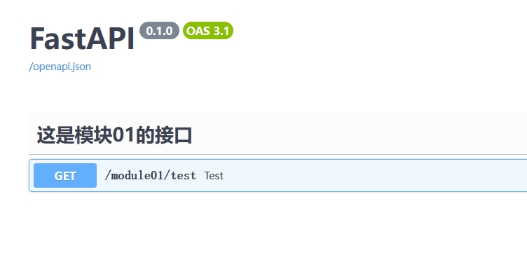

### 多个模块的路由管理

在正式项目中，一个FastAPI应用通常由多个模块（多个包）组件的。每个模块都拥有自己的路由。

假设一个FastAPI应用的工程目录结构如下所示。
```
├── fastapi-app
│   ├── __init__.py
│   ├── main.py
│   └── module01
│   │   ├── __init__.py
│   │   └── module01Routers.py
│   └── module02
│   │   ├── __init__.py
│   │   └── module02Routers.py
```

模块01的module01Routers.py文件代码如下
```py
from fastapi import APIRouter
router = APIRouter()

# 用户模块的测试接口
@router.get("/user/test")
async def usertest():
    return {"test": "test"}
```

模块02的module02Routers.py文件代码如下
```py
from fastapi import APIRouter
router = APIRouter()

# 订单模块的测试接口
@router.get("/order/test")
async def ordertest():
    return {"test": "test"}
```


main.py文件代码如下
```py
# 导入FastAPI
from fastapi import FastAPI
# 创建FastAPI应用实例
app = FastAPI()

# 导入各个模块
from module01 import module01Routers
from module02 import module02Routers

# 通过include_router函数，把各个模块的路由实例加入到FastAPI应用实例中
app.include_router(module01Routers.router,prefix="/module01",tags=["这是模块01的接口"])
app.include_router(module02Routers.router,prefix="/module02",tags=["这是模块02的接口"])
```

通过上面的方式，各个模块的路由分开编写，并且通过include_router函数整合到FastAPI应用实例中。

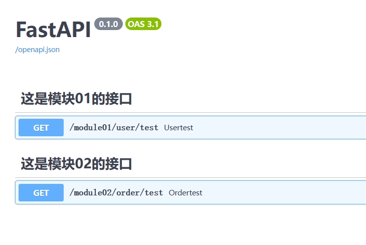


## FastAPI 请求

FastAPI 提供了多种方式来解析请求中的数据，并根据需要生成规范的响应。

### 请求参数

通常情况下请求参数是指请求路径中`?`后面拼接的键值对字符串。

假设请求的路径如：`http://127.0.0.1:8000/test?a=1&b=2`。那么请求中`?`后面的`a=1&b=2`键值对就是请求参数a和b。

```py
from fastapi import APIRouter
router = APIRouter()

@router.get("/test")
def test(a,b):
    return {"a": a, "b": b}

# 给函数参数设置默认值
@router.get("/test2")
def test2(a: int = 0, b: int = 10):
    return {"a": a, "b": b}

# 将函数参数设置为可选参数
@router.get("/test3")
def test3(a: int = 0, b: int = None):
    return {"a": a, "b": b}
```

- 函数形参需要与请求参数同名。这样函数形参才能接收到请求参数的数据。
- `b: int = 10 `这种写法是把参数b的类型设置为整数类型。默认值为 10。
- `b: int = None` 这种写法是把参数b设置为可选参数。

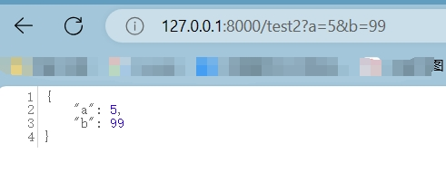

### 路径参数

我们可以在请求路径上添加路径参数占位符。

- 路径参数占位符用来代表路径中的动态参数的。
- 当函数中的形参与路径参数同名的时候，函数形参才能接受到路径参数的数据。

```py
from fastapi import APIRouter
router = APIRouter()

@router.get("/items/{item_id}")
def read_item(item_id: int):
    return {"item_id": item_id}
```

- `/items/{item_id}` 定义了一个请求路径，其中{item_id} 是路径参数，对应于函数参数 item_id。
- `item_id: int` 函数形参item_id,数据类型为int

例子
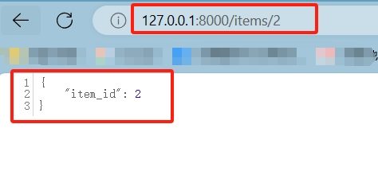

### 请求体参数-form表单数据格式

通常情况下，GET请求的请求参数是指请求路径中`?`后面携带的键值对字符串。而GET请求是没有请求体的。

因此对于POST请求等。FastAPI如何接受POST请求中请求体的form表单数据？

在FastAPI中可以使用Form表单组件包来处理表单数据。

1. 先安装Form表单组件包

```
pip install python-multipart
```

2. 使用

```py
# 引入Form函数
from fastapi import APIRouter,Form
router = APIRouter()

# post请求
@router.post("/login")
def login(username: str = Form(),password: str = Form()):
    return {
        "username":username,
        "password":password
    }
```

- Form()函数会拿到请求体中的表单数据。
- `username: str = Form()`参数username，类型为字符串。参数数据通过Form()函数来获取。


可以看到图中的Content-Type是`application/x-www-form-urlencoded`。这表示数据是Form表单数据。
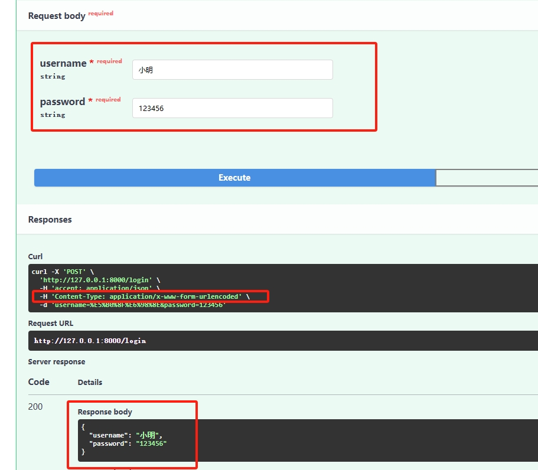


### 请求体参数-json数据格式

通常情况下，GET请求的请求参数是指请求路径中`?`后面携带的键值对字符串。而GET请求是没有请求体的。

因此对于POST请求等。FastAPI如何接受POST请求中请求体的json数据？

在FastAPI中我们可以使用pydantic包来创建数据模型。通过数据模型来接收请求体中的json数据。

注意：只有自定义的数据模型类继承pydantic包中的BaseModel类。pydantic包才能帮我们将请求体的json数据进行校验并传递给模型类对象。


```py
from pydantic import BaseModel
from fastapi import APIRouter
router = APIRouter()

# 定义Addr模型类型
class Addr(BaseModel):
    prpvince:str
    city:str

# 定义数据模型Item类及其属性。该类需要继承pydantic包中的BaseModel类
class Item(BaseModel):
    name: str
    age: int = 10               # age属性设置默认值10
    description: str = None     # 设置为可选属性
    price: float
    tax: float = None           # 设置为可选属性
    address: Addr               # 地址属性类型为Addr

# post请求
@router.post("/items/")
def create_item(item: Item):
    return item
```

- `item: Item` 函数参数为Item类。该参数可以接收一个请求体数据，数据的格式需要与Item类相同。

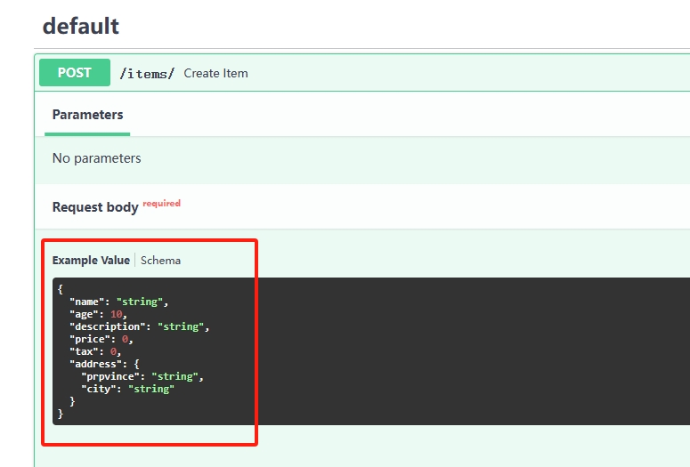


### 请求对象 Request

有些情况下，我们希望可以访问Request请求对象。从而获取到请求中的一些信息。

在FastAPI中我们可以使用Request类来接收请求对象。通过这种方式我们可以获取到请求中的一些信息。例如请求头 header,请求url,cookis等

```py
from fastapi import APIRouter,Request
router = APIRouter()

@router.post("/getRequest")
# req参数类型为Request类型。用来接收请求信息。
def getRequest(req: Request):
    return {
        "RequestURL":req.url,         
        "RequestIP":req.client.host,
        "RequestHeader":req.headers,
        "user-agent":req.headers.get("user-agent")
    }

```

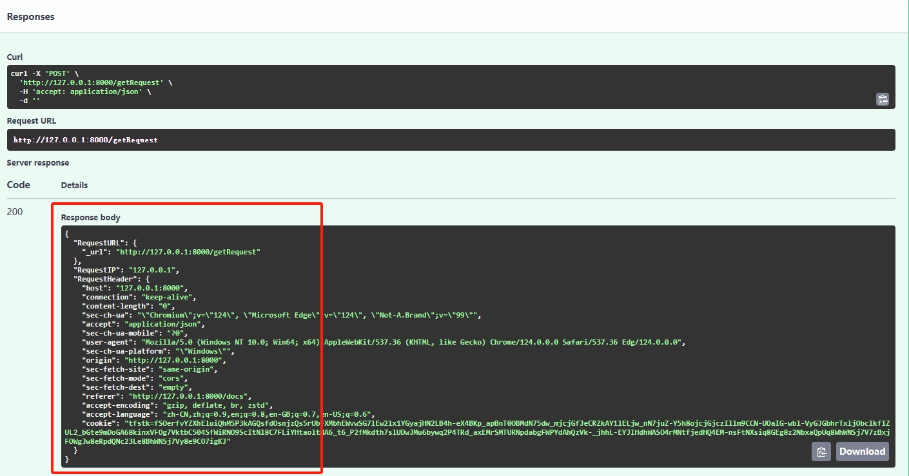


## FastAPI 响应

### 响应 Json 数据

如果路由处理函数返回一个字典类型数据，FastAPI 会把函数的返回值自动转换为 JSON 格式，并作为响应数据发送给客户端。


```py
from fastapi import APIRouter
router = APIRouter()

@router.get("/test1/")
def test1(a, b):
    return {"a": a, "b": b}  # 返回字典数据
```

如果路由处理函数返回一个 Pydantic 数据模型实例，FastAPI 会自动将其转换为 JSON 格式，并作为响应发送给客户端。

```py
from fastapi import APIRouter
from pydantic import BaseModel
router = APIRouter()

# 定义数据模型类
class Item(BaseModel):
    name: str
    description: str = None

@router.post("/items/")
def get_item(item: Item):
    return item  # 返回数据模型类数据
```

### response_model 响应模型

FastAPI提供了response_model 响应模型。让我们可以在路径操作装饰器中使用response_model参数来定义响应模型数据的格式。

```py
from fastapi import FastAPI
app = FastAPI()

from pydantic import BaseModel
from fastapi import APIRouter
router = APIRouter()

# 定义类ItemA
class ItemA(BaseModel):
    username: str
    password: str
    age: int

# 定义类ItemB
class ItemB(BaseModel):
    username: str
    age: int

@router.post("/getItem",response_model=ItemB)
def getItem(item: ItemA):
    return item

# app应用实例中添加路由实例
app.include_router(router)
```

- `item: ItemA` 函数形参接收的是ItemA类对象。
- `response_model=ItemB` 通过给路径操作装饰器添加response_model参数。来定义响应数据的格式。

运行结果如图所示
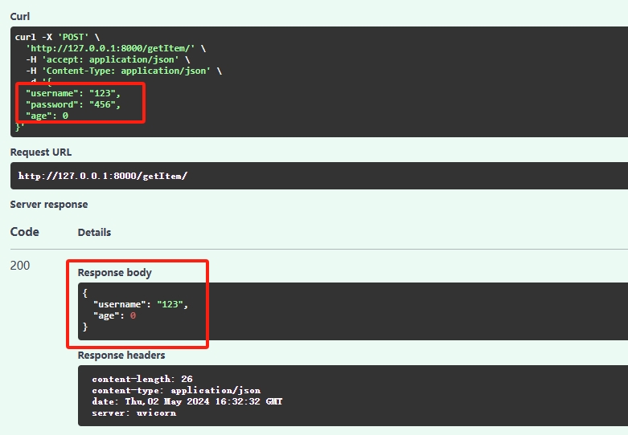

在上面的代码中，定义了两个模型类ItemA和ItemB。路由处理函数getItem()接收并返回的都是ItemA类对象。但是最终的响应结果数据确是ItemB对象。

<font color="red">简而言之，若路径操作装饰器中添加了response_model参数。那么FastAPI会把函数的返回值数据转换为response_model参数声明的数据类型。</font>


> response_model_exclude_unset 参数

除了response_model参数之外，我们还可以添加 response_model_exclude_unset 参数。

response_model_exclude_unset 参数可以去除响应模型中未被赋值的字段。即响应模型中没有被赋值的字段，不会添加到响应数据中。


```py
@router.post("/getItem",response_model=ItemB,response_model_exclude_unset=True)
def getItem(item: ItemA):
    return item
```

函数返回的是ItemA类型的数据。但是当ItemA类型返回数据中没有被赋值的字段，不会添加到响应数据中。


> response_model_include 参数

response_model_include参数可以让你更精细地控制响应数据中包含哪些字段。

```py
@router.post("/getItem",response_model=ItemB,response_model_include={"username", "age"})
def getItem(item: ItemA):
    return item
```

函数返回的是ItemA类型（有三个属性字段）的数据。但是response_model_include参数可以控制响应数据中只包含两个字段（username,age）的数据。


> response_model_exclude 参数

response_model_include参数可以让你更精细地控制响应数据中不包含哪些字段。

```py
@router.post("/getItem",response_model=ItemB,response_model_exclude={"password"})
def getItem(item: ItemA):
    return item
```

函数返回的是ItemA类型（有三个属性字段）的数据。但是response_model_include参数可以控制响应数据中排除password字段数据。


### 重定向

使用 RedirectResponse 实现重定向，将客户端重定向到其他路由上。

```py
from fastapi.responses import RedirectResponse
from pydantic import BaseModel
from fastapi import APIRouter
router = APIRouter()

@router.get("/a")
def a():
    return {"a": "a"}

@router.get("/redirect")
def redirect():
    return RedirectResponse(url="/a")  # 重定向到/a路由上
```

在浏览器访问`/redirect`路由的时候会自动跳转到 `/a`路由。

### 响应状态码

使用 HTTPException 可以抛出异常，返回自定义的状态码和详细信息。

```py
from fastapi import HTTPException
from fastapi import APIRouter
router = APIRouter()

@router.get("/items")
def read_item():
    # 抛出HTTPException异常，参数为异常信息
    raise HTTPException(status_code=404, detail="Item not found")
```

### 自定义响应数据

使用 JSONResponse 可以自定义响应数据。

```py
from fastapi.responses import JSONResponse
from fastapi import APIRouter
router = APIRouter()

@router.get("/items/{item_id}")
def read_item(item_id: int):
    content = {"item_id": item_id}
    headers = {"X-Custom-Header": "custom-header-value"}
    return JSONResponse(content=content, headers=headers)
```


## 文件上传

当我们需要进行文件上传的时候，需要把请求的content-type设置为`multipart/form-data`格式。这个格式是表单文件上传格式。

下面是文件上传的两种方式。

### 小文件上传

使用fastapi包中的File函数来获取文件对象

```py
from fastapi import APIRouter,File
router = APIRouter()

# 单个文件上传请求 (适合小文件上传)
@router.post("/uploadFile")
def uploadFile(file: bytes = File()):
    return {
        "fileLength":len(file)      # 文件字节大小
    }

# 多个文件上传请求  (适合小文件上传)
@router.post("/uploadFiles")
def uploadFiles(files: list[bytes] = File()):
    return {
        "fileCount":len(files)      # 文件个数
    }
```

- File函数用来获取上传文件的数据。
- `file: bytes = File()` 设置一个file参数，类型为字节数据类型。数据从File函数获取。

注意：这种方式是一次性读取文件数据内存中，因此这种方式只适合小文件上传。对于大文件上传需要用其他方法。


### 大文件上传 (推荐)

使用fastapi包中的UploadFile函数来获取文件对象。

```py
from fastapi import APIRouter,UploadFile
router = APIRouter()

# 单个文件上传请求 
@router.post("/uploadFile")
def uploadFile(file: UploadFile):
    return {
        "fileSize":file.size,         # 文件大小
        "fileName":file.filename        # 文件名称
    }

# 多个文件上传请求
@router.post("/uploadFiles")
def uploadFiles(files: list[UploadFile]):
    # 打印文件其他信息
    for i in files:
        print("fileName",i.filename)
        print("fileSize",i.size)
    return {
        "fileCount":len(files)      # 文件个数
    }
```

- `file: UploadFile` 设置一个file参数，是UploadFile类型。

通过UploadFile函数，我们还可以获取文件名称和大小等其他信息。

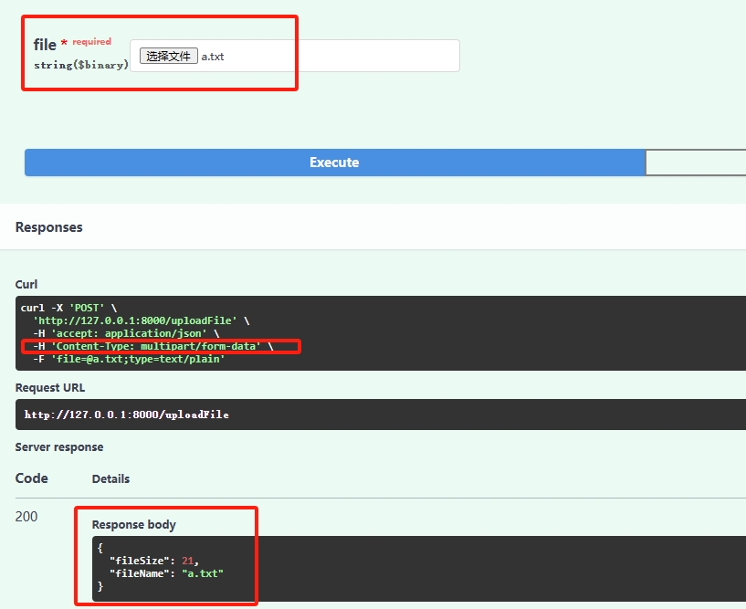


## FastAPI 访问静态文件

我们可以在FastAPI应用中开放一个静态文件目录。通过这个目录来专门访问FastAPI应用中的静态文件。

1. 在`main.py`文件编写如下代码
```py
from fastapi import FastAPI
from fastapi.staticfiles import StaticFiles
app = FastAPI()

# FastAPI应用实例对象 挂载静态目录
app.mount("/statics",StaticFiles(directory="statics"))
```

- 先导入fastapi.staticfiles包中的StaticFiles类。
- `StaticFiles(directory="statics")` 设置statics目录为静态文件目录。之后挂载到FastAPI应用实例对象app上。
- 注意：静态文件目录和代码文件之间的相对路径。

2. 然后创建statics目录。其中创建一个txt文件
3. 浏览器访问静态文件。

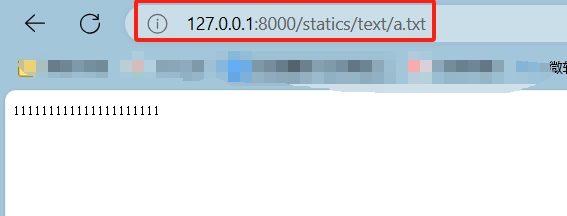
