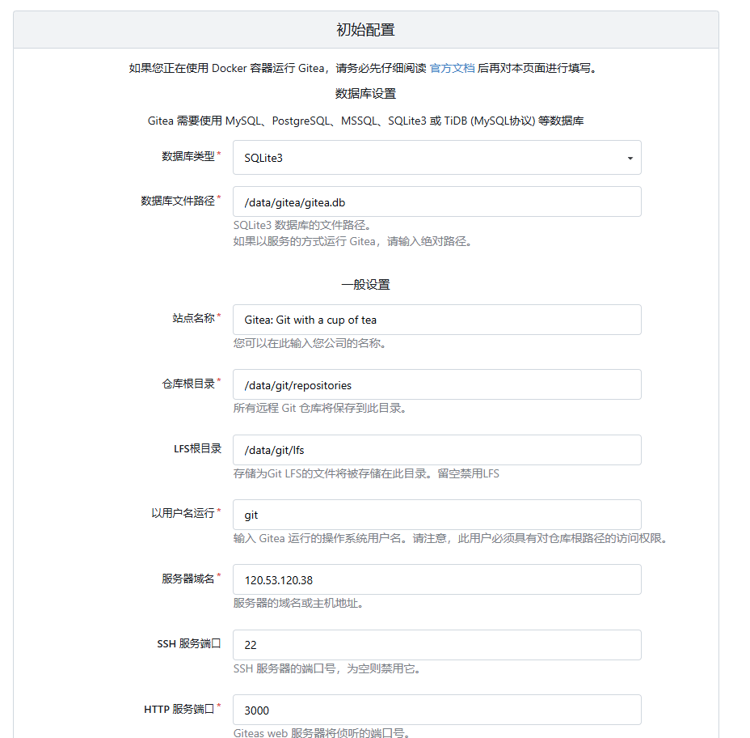
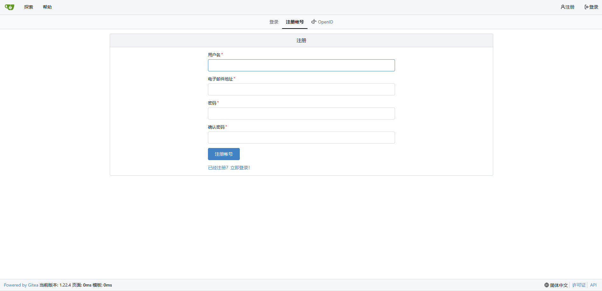
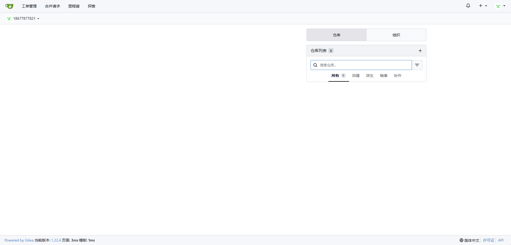

[toc]

# Gitea笔记

Gitea 是一个轻量级的 DevOps 平台软件。从开发计划到产品成型的整个软件生命周期，他都能够高效而轻松的帮助团队和开发者。

Gitea 包括 Git 托管、代码审查、团队协作、软件包注册和 CI/CD。它与 GitHub、Bitbucket 和 GitLab 等比较类似。Gitea 最初是从 Gogs 分支而来。

Gitea的首要目标是创建一个极易安装，运行非常快速，安装和使用体验良好的自建 Git 服务。Gitea 采用Go作为后端语言，只需生成一个可执行程序即可。 并且支持 Linux, macOS 和 Windows等多平台， 支持主流的x86，amd64、 ARM 和 PowerPC等架构。

> Gitea的功能特性

- 代码托管：Gitea⽀持创建和管理仓库、浏览提交历史和代码⽂件、审查和合并代码提交、管理协作者、管理分⽀等。
- 轻量级和快速: Gitea 的设计目标之一就是轻量级和快速响应。它不像一些大型的代码托管平台那样臃肿,适用于资源有限的服务器环境。
- 安全性: Gitea 注重安全性，提供了用户权限管理、访问控制列表等功能.
- 代码评审：代码评审同时支持 Pull Request workflow 和 AGit workflow。
- CI/CD: Gitea Actions⽀持 CI/CD 功能，该功能兼容 GitHub Actions.
- 项目管理：Gitea 通过看板和⼯单来跟踪⼀个项⽬的需求，功能和bug。
- 制品库: Gitea支持超过 20 种不同种类的公有或私有软件包管理，包括：Maven, npm, PyPI 等
- 多语言支持：Gitea 提供多种语言界面，适应全球范围内的用户，促进了国际化和本地化。


## docker 部署 Gitea

Gitea 推荐使用docker-compose来部署Gitea服务

① 在本地服务器中创建一个 `gitea` 目录。

② 在`gitea` 目录中创建 docker-compose.yaml 文件。


docker-compose.yaml 文件内容如下
```yaml
version: "3"

networks:
  gitea:
    external: false

services:
  server:
    image: gitea/gitea:1.22.4   # 镜像
    container_name: myGitea     # 容器名称
    environment:                # 设置环境变量
      - USER_UID=1000
      - USER_GID=1000
    restart: always             
    networks:                   # 容器所属网络
      - gitea
    volumes:                    # 自定义映射数据卷
      - /xxx/docker/gitea/data:/data
      - /xxx/docker/gitea/etc/timezone:/etc/timezone:ro
      - /xxx/docker/gitea/etc/localtime:/etc/localtime:ro
    ports:                      # 自定义映射端口
      - "33000:3000"
      - "32222:22"

```

③ 在 docker-compose.yaml文件所在目录中执行下面命令，运行容器

```bash
# 先检查yaml文件配置是否有误
docker-compose config -q
# 然后在创建容器
docker-compose -f docker-compose.yaml up -d
```

④ 初次访问Gitea页面 `http://xxxx:33000/`

如果无法访问，可能是云服务器防火墙中没配置对应端口。

如图所示,是Gitea的初始化配置界面。可以自己修改一些基础信息，然后点击立即安装即可。


⑤ 注册登录

注册一个账号，登录即可。注意第一个账号默认为管理员账号。



⑥ 主界面



⑦ 使用Gitea

使用Gitea的方式和使用Github的方式差不多。创建一个仓库，然后直接通过`git clone`命令下载即可。

Gitea也有两种拉取代码的方式。
- HTTP方式：无需额外配置，直接通过命令拉取即可。
- SSH方式：需要额外配置Gitea的SSH密钥，端口设置。因为Gitea容器的默认SSH端口为22，需要配置为对应的宿主机端口32222。

具体方式自行百度。

## 限制其他人访问gitea私服

如果gitea私服部署在公司内网，那么只能公司内部人访问。如果gitea私服部署在云服务器上，则任何人都能访问你的gitea私服中的公开仓库。

因此我们需要限制其他人访问gitea私服

- 另外对于公共仓库：任何人都能访问。
- 另外对于私有仓库，创建者用户才能访问，未登录的人或非创建者用户无法访问。

管理员用户登录之后可以看到所有仓库（包括其他用户的）

### 设置gitea私服的所有仓库必须登录后才能访问

找到gitea的配置文件/xxx/gitea/gitea/gitea/conf/app.ini

配置文件中有一个`REQUIRE_SIGNIN_VIEW` 字段，默认是false 就是说不登录也可以查看仓库。改为true，然后重启gitea容器即可。

```conf
[service]
REQUIRE_SIGNIN_VIEW = true
```

### 关闭gitea注册功能

为了防止其他人注册自己搭建的gitea私服，我们可以关闭gitea注册功能，改为使用管理员账号分配账号的形式。

配置文件中 `DISABLE_REGISTRATION` 字段就是禁用注册的功能，改为true 即可。另外一个 `ENABLE_CAPTCHA` 字段其实是开启注册的时候展示验证码的功能，打开后，注册的时候就需要输入一个验证码。之后重启gitea容器即可。

```conf
[service]
DISABLE_REGISTRATION = true
ENABLE_CAPTCHA = true
```


