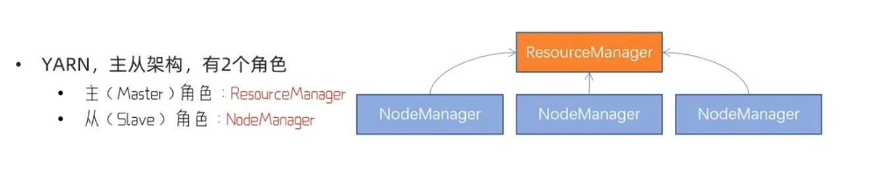
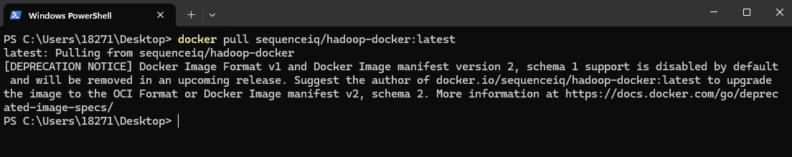
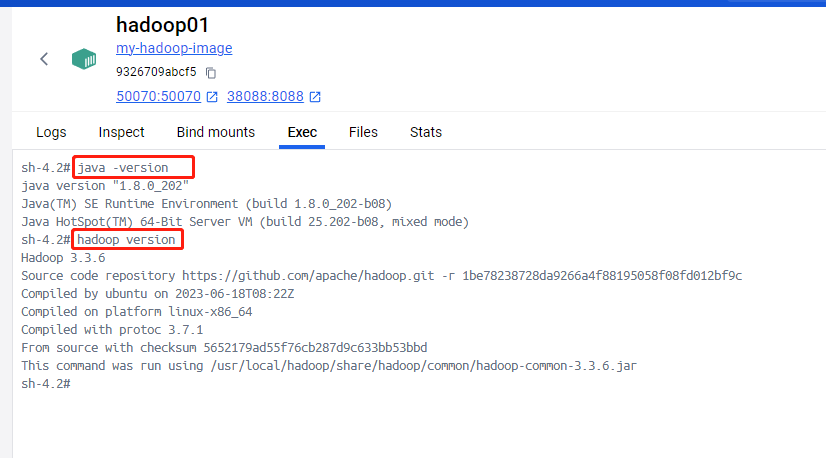
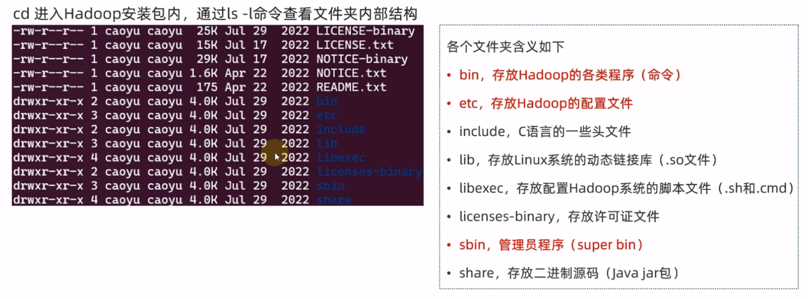
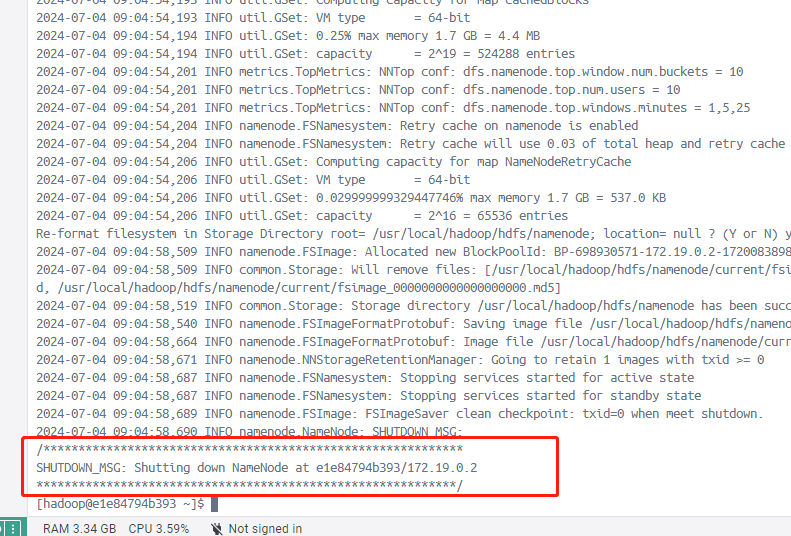
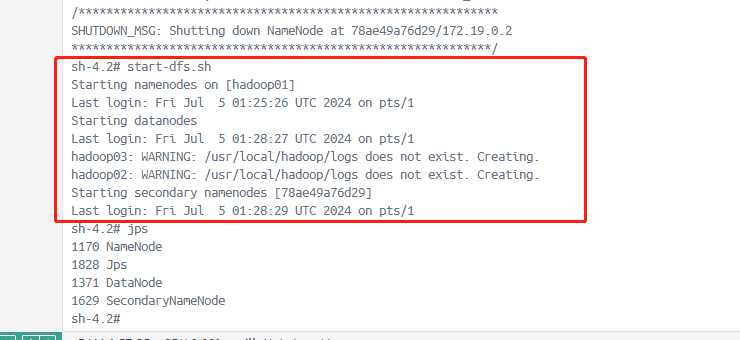
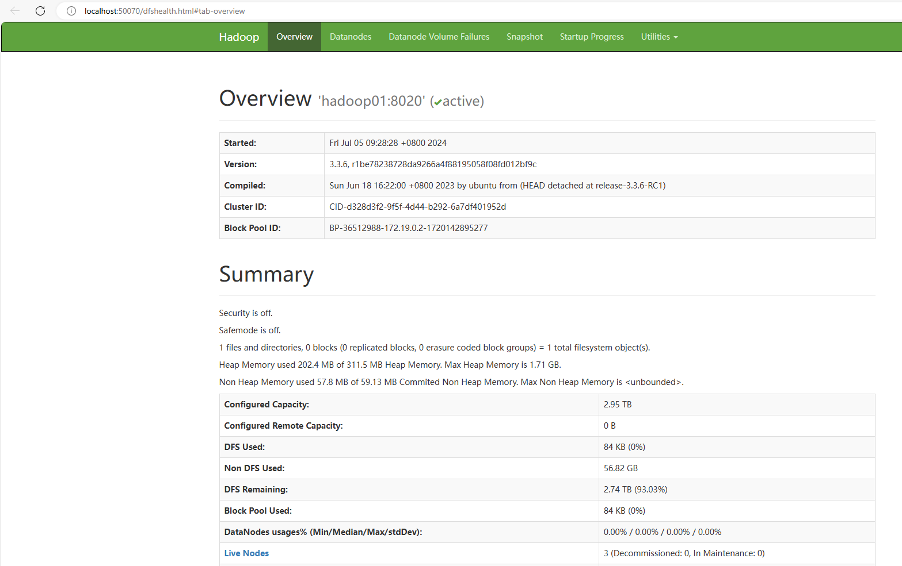
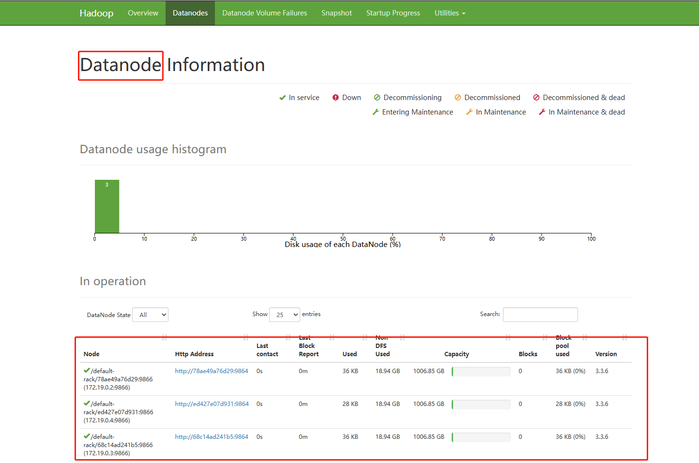

[toc]

# Hadoop笔记1

## 大数据介绍

狭义上：大数据是指一类技术栈，用来对海量数据进行处理的软件技术体系。
广义上：大数据是指数字化时代，信息化时代的基础数据支撑，用数据为生活赋能。

> 大数据的核心工作是什么？

- 数据存储：可以存储海量待处理数据。
- 数据计算：可以从海量数据中计算挖掘出有价值的数据结果。
- 数据传输：可以将海量数据传输给各个目标。

> 大数据软件技术生态有哪些？

由于大数据的核心工作分别是: 数据存储，数据计算，数据传输。

对于数据存储方面：

- Apache Hadoop框架的HDFS组件是大数据技术体系中使用最广泛的分布式存储技术。
- Apache HBase是大数据技术体系中使用最广泛的NoSQL，K-V键值对数据库技术。HBase是在HDFS的基础上构建的。
- Apache KUDU 也是大数据技术系统中使用较多的分布式存储引擎。
- 除此之外，还有各个云平台提供的大数据存储服务。例如阿里云的OSS等。

对于数据计算方面：

- Apache Hadoop框架的MapReduce组件是最早的大数据分布式计算引擎。
- Apache Hive 是一款以SQL为开发语言的分布式计算框架。其底层使用了Hadoop框架的MapReduce组件技术。至今有许多公司使用它。
- Apache Spark 是目前全球内最火热的分布式内存计算引擎技术。
- Apache Flink 同样也是一款大数据分布式内存计算引擎，主要在实时计算（流计算）领域，Flink占据主流。

对于数据传输方面：

- Apache Kafka 是一款分布式消息系统，可以完成海量数据的数据传输工作。
- Apache Pulsar 同样也是一款分布式的消息系统。
- Apache Flume 是一款流式数据采集工具，可以从非常多的数据源中进行数据采集。
- ..............

## Hadoop介绍

Hadoop的全称应该是Apache Hadoop。

Hadoop是Apache软件基金会下的顶级开源项目。Hadoop的主要功能如下。
- 分布式数据存储
- 分布式数据计算
- 分布式资源调度

总结：Hadoop是一个开源的分布式软件框架。提供分布式存储，计算，资源调度的解决方案。开发者可以通过Hadoop来实现海量数据的存储和计算。

> Hadoop内部存在三大组件，分别是：

- HDFS组件： HDFS是Hadoop内部的分布式存储组件。可以用来构建分布式文件系统，存储海量数据。
- MapReduce组件：MapReduce是Hadoop内部的分布式计算组件，提供接口给用户进行分布式计算。
- YARN组件: YARN是Hadoop内部的分布式资源调度组件。可以帮助用户实现大规模集群的资源调度。


### HDFS分布式文件系统-介绍

HDFS 分布式文件系统 是 Hadoop 的三大组件之一。

- HDFS 全称是 Hadoop Distribued File System (Hadoop 分布式文件系统)
- HDFS 是 Hadoop内部的分布式数据存储解决方案。
- HDFS 可以在多台服务器上进行集群部署，并且存储海量的数据。

> 为什么需要分布式文件存储？

由于单个服务器的数据存储能力是有上限的，因此当数据量大到一定程度的时候，需要多台服务器一起存储数据才行。

> HDFS的集群架构

HDFS的集群架构是主从模式的，即有一个主节点，多个从节点，共同组成的集群。

在HDFS的集群架构中，主要有三种不同的角色。
- 主角色 NameNode ：主角色是一个独立进程。主要负责管理整个HDFS系统，管理DataNode从角色。
- 从角色 DataNode ：从角色也是一个独立进程。主要负责数据存储。
- 辅助角色 SecondaryNameNode ：辅助角色也是一个独立进程。主要负责辅助主角色，帮助主角色完成元数据整理工作。

HDFS的集群架构如下图所示


### MapReduce分布式计算-介绍

> 什么是分布式计算？

分布式计算是指通过多台服务器协同工作，共同完成一个计算任务。从而得到计算结果。

分布式计算的2种工作模式：
1. 分散汇总模式。（Hadoop的MapReduce使用的就是这种模式）
2. 中心调度，步骤执行模式。（Spark,Flink框架使用这种模式）

> 什么是MapReduce？

MapReduce使用的是分散汇总模式的分布式计算框架。也是Hadoop内部的分布式计算的组件。

MapReduce框架内部提供了两大接口。
- Map分散接口，由服务器对数据进行分布式处理。
- Reduce聚合接口，将分布式的处理结果进行汇总统计。

<font color="red">
注意：MapReduce提供了Map分散接口和Reduce聚合接口，给开发者使用。但是由于年代久远，MapReduce框架的代码，性能已经过时了。

因此，现在主要使用Apache Hive框架来进行分布式计算。Apache Hive框架底层使用的就是MapReduce框架，所以我们只需对MapReduce框架简单了解即可。
</font>

> MapReduce的运行机制

1. MapReduce会将一个计算任务，分解成多个小的Map Task（分散任务） 和 Reduce Task（聚合任务）。
2. 然后将Map Task（分散任务） 和 Reduce Task（聚合任务）分配到对应的服务器中去进行计算。
3. 最后将多个服务器中的计算结果通过Reduce Task（聚合任务）聚合到一起。从而得到这个计算任务的计算结果。

### YARN分布式资源调度-介绍

> 什么是分布式资源调度？

资源通常是指服务器的硬件资源。例如CPU，内存，硬盘，网络等。资源调度的目的是最大化的利用服务器的硬件资源。

分布式资源调度是指管理整个分布式服务器集群的全部资源，并进行统一调度。

> 什么是YARN?

YARN是Hadoop内部的分布式资源调度组件，可以将Hadoop的资源统一管理，并进行分配。


> MapReduce 和 YARN 的关系？

YARN 统一分配资源给MapReduce使用，而MapReduce需要这些资源才能进行分布式计算。

> YARN的集群架构

YARN的集群架构是主从模式的，即有一个主节点，多个从节点，共同组成的集群。

在YARN的集群架构中，主要有2种不同的角色。
- 主角色 ResourceManager ：主角色负责整个集群的资源调度，协调各个从角色所需要的资源。
- 从角色 NodeManager ：从角色主要负责调度的单个服务器上的资源给程序使用。

YARN的集群架构如下图所示


## Hadoop的安装和部署

下面是在docker环境中安装和部署Hadoop的。

由于目前dockerhub中的Hadoop镜像都是旧的镜像格式，最新版本的docker无法下载该镜像。

当尝试下载官方的Hadoop镜像时，会提示该Hadoop镜像是旧的镜像格式，不建议下载使用。


因此下面的笔记是先在centos镜像的基础上安装部署java和hadoop。从而构建出Hadoop镜像。

### 1.构建Hadoop镜像

1. 先下载centos镜像

```bash
docker pull centos:7
docker images #查看镜像
```

2. 构建Hadoop镜像

在centos镜像的基础上安装SSH服务,java，hadoop。然后通过Dockerfile构建出一个新镜像。

步骤1：创建Dockerfile文件。该文件名称就是Dockerfile，注意该文件没有后缀名。

步骤2：编辑Dockerfile文件。内容如下所示。

注意：在Dockerfile所在目录下提前准备好 jdk-8u202-linux-x64.tar.gz 与 hadoop-3.3.6.tar.gz 安装包。当然你也可以准备其他版本的安装包。

```docker
# FROM:基于什么镜像来制作自己的镜像
FROM centos:7
# MAINTAINER:表示该镜像的作者（维护者）
MAINTAINER shuyx

# 配置yum源，包括修改仓库地址、提速、更新
RUN cd /etc/yum.repos.d/
RUN sed -i 's/mirrorlist/#mirrorlist/g' /etc/yum.repos.d/CentOS-*
RUN sed -i 's|#baseurl=http://mirror.centos.org|baseurl=http://mirrors.aliyun.com|g' /etc/yum.repos.d/CentOS-*
RUN yum makecache
RUN yum update -y

# 安装ssh服务和ssh客户端。
RUN yum install -y openssh-server sudo
RUN sed -i 's/UsePAM yes/UsePAM no/g' /etc/ssh/sshd_config
RUN yum install -y openssh-clients

# 生成ssh密钥，注意此处设置了root用户的密码为root
RUN echo "root:root" | chpasswd
RUN echo "root   ALL=(ALL)       ALL" >> /etc/sudoers
RUN ssh-keygen -t dsa -f /etc/ssh/ssh_host_dsa_key
RUN ssh-keygen -t rsa -f /etc/ssh/ssh_host_rsa_key

# 开启ssh服务，暴露SSH的默认端口22。
RUN mkdir /var/run/sshd
EXPOSE 22
CMD ["/usr/sbin/sshd", "-D"]

# 将本地的jdk安装包，复制到容器的/usr/local/目录中。并进行解压，配置环境变量
ADD jdk-8u202-linux-x64.tar.gz /usr/local/
RUN mv /usr/local/jdk1.8.0_202 /usr/local/jdk1.8
ENV JAVA_HOME /usr/local/jdk1.8
ENV PATH $JAVA_HOME/bin:$PATH

# 将本地的hadoop安装包，复制到容器的/usr/local/目录中。并进行解压，配置环境变量
ADD hadoop-3.3.6.tar.gz /usr/local
RUN mv /usr/local/hadoop-3.3.6 /usr/local/hadoop
ENV HADOOP_HOME /usr/local/hadoop
ENV PATH $HADOOP_HOME/bin:$PATH
ENV PATH $HADOOP_HOME/sbin:$PATH

# 指定root用户访问
ENV HDFS_NAMENODE_USER root
ENV HDFS_DATANODE_USER root
ENV HDFS_SECONDARYNAMENODE_USER root
ENV YARN_RESOURCEMANAGER_USER root
ENV YARN_NODEMANAGER_USER root

# 安装 which,sudo,vim 命令行工具
RUN yum install -y which sudo vim
```

步骤3：在Dockerfile文件的同目录中，使用下面的命令，创建新镜像my-hadoop-image

```sh
# "."表示当前目录，即Dockerfile所在的位置
# my-hadoop-image 为新镜像的名称
docker build -t my-hadoop-image .

# 查询新镜像my-hadoop-image
docker images
```

### 2.部署Hadoop容器

1. 先创建一个docker网络。这样能很方便的让多个Hadoop容器之间互相通信。

```bash
# 创建一个docker网络
docker network create my-hadoop-net
# 查询网络
docker network ls
```

2. 创建多个Hadoop容器

```bash
# 创建hadoop01容器
docker run -itd --network my-hadoop-net --name hadoop01 -p 50070:50070 -p 38088:8088 my-hadoop-image
# 创建hadoop02容器
docker run -itd --network my-hadoop-net --name hadoop02 my-hadoop-image
# 创建hadoop03容器
docker run -itd --network my-hadoop-net --name hadoop03 my-hadoop-image
```

50070和8088端口，主要是用来在浏览器中访问hadoop WEB界面的。

3. 测试容器内的java，hadoop是否安装成功

在每一个容器终端中执行下面命令
```bash
# 查询安装的java,hadoop版本
java -version
hadoop version
```

安装结果如下图所示


4. hadoop安装包中的目录结构



### 3.Hadoop容器之间互相配置SSH免密登录

在每个Hadoop容器中，配置免密码互相SSH登录。方便多个Hadoop容器之间互相登录访问。

1. 在每一个Hadoop容器终端中,执行下面几条命令
```sh
# 先生成SSH密钥
ssh-keygen -t rsa -b 4096

# 设置SSH免密登录。注意 hadoop01,hadoop02,hadoop03 是各个hadoop容器的名称。
# 该命令会让你输入root用户的密码。
ssh-copy-id hadoop01
ssh-copy-id hadoop02
ssh-copy-id hadoop03
```

由于多个hadoop容器在同一个网络中，因此hadoop容器互相可以通过容器名称找到其他hadoop容器。

2. 执行命令完毕后，hadoop01,hadoop02,hadoop03 三个容器之间就可以完成root用户之间的免密登录。
3. 在Hadoop容器终端中进行测试

```sh
# 通过ssh登录到hadoop01容器中
ssh hadoop01
# 通过ssh登录到hadoop02容器中
ssh hadoop02
# 通过ssh登录到hadoop03容器中
ssh hadoop03
```

### 4.1 Hadoop容器中的HDFS集群配置

由于HDFS分布式存储系统有三个角色，NameNode主角色，DataNode从角色，辅助角色SecondaryNameNode。

因此我们需要给每个hadoop容器去分配这些角色。分配结果如下表所示。

节点容器 | 所分配的角色
------------ | -------------
hadoop01 容器 | NameNode主角色，DataNode从角色，辅助角色SecondaryNameNode。
hadoop02 容器 | DataNode从角色 
hadoop03 容器 | DataNode从角色

每个角色都相当于是一个进程或者一个节点，因此可以理解为三个Hadoop容器中存在5个进程节点。其中一个主进程节点NameNode，三个从进程节点DataNode，以及一个辅助进程节点SecondaryNameNode。

> 配置方式

HDFS集群配置需要对如下文件的修改
- workers 配置DataNode从角色是哪些。
- hadoop-env.sh 配置hadoop的环境变量文件，需要将jdk的路径配置进去。
- core-site.xml 是hadoop的核心配置，需要指定hadoop的基本配置信息。
- hdfs-site.xml 是hadoop中的HDFS组件的配置文件。

<font color="red">先配置hadoop01容器，然后将hadoop01容器中的hadoop目录整体复制到其他hadoop容器中即可。下面是在hadoop01容器中进行HDFS集群配置</font>

> ① 配置 workers 文件

编辑/usr/local/hadoop/etc/hadoop/workers文件。配置三个DataNode从角色所在的hadoop容器名称。

```
hadoop01
hadoop02
hadoop03
```

由于三个hadoop容器都是在同一个网络my-hadoop-net下，容器可以用容器名称来找到其他hadoop容器。因此直接在workers文件中直接填写容器名称即可。

> ② 配置 `hadoop-env.sh`

编辑 /usr/local/hadoop/etc/hadoop/hadoop-env.sh文件。

```sh
# 指定hadoop使用的java环境的路径
export JAVA_HOME=/usr/local/jdk1.8
# 指定hadoop的安装目录位置
export HADOOP_HOME=/usr/local/hadoop
# 指定hadoop配置文件的目录位置
export HADOOP_CONF_DIR=/usr/local/hadoop/etc/hadoop
# 指定hadoop运行日志目录位置
export HADOOP_LOG_DIR=/usr/local/hadoop/logs
```

> ③ 配置core-site.xml

编辑 /usr/local/hadoop/etc/hadoop/core-site.xml

```xml
<configuration>
    <!-- 访问NameNode主角色的地址路径，hadoop01为NameNode主角色所在的容器名称。8020为通讯端口，端口可以随意指定，默认为8020端口 -->
    <property>
        <name>fs.defaultFS</name>
        <value>hdfs://hadoop01:8020</value>
    </property>
    <!--文件缓冲区大小，为131702比特-->
    <property>
        <name>io.file.buffer.size</name>
        <value>131702</value>
    </property>
</configuration>
```


> ④ HDFS配置文件 hdfs-site.xml

编辑 /usr/local/hadoop/etc/hadoop/hdfs-site.xml

```xml
<configuration>
    <!-- 设置hdfs文件系统中，默认创建的文件权限 -->
    <property>
        <name>dfs.datanode.data.dir.perm</name>
        <value>700</value>
    </property>
    <!-- NameNode主角色节点中元数据存储位置 -->
    <property>
        <name>dfs.namenode.name.dir</name>
        <value>file:/usr/local/hadoop/hdfs/namenode</value>
    </property>
    <!-- NameNode主角色节点允许哪些DataNode从角色节点进行授权连接 -->
    <!-- 此处填写DataNode从角色节点所在的容器名称即可 -->
    <property>
        <name>dfs.namenode.hosts</name>
        <value>hadoop01,hadoop02,hadoop03</value>
    </property>
    <!-- DataNode从角色节点的数据存储目录 -->
    <property>
        <name>dfs.datanode.data.dir</name>
        <value>file:/usr/local/hadoop/hdfs/datanode</value>
    </property>
    <!-- hdfs数据块大小（以字节为单位，默认为128MB）-->
    <property>
        <name>dfs.blocksize</name>
        <value>134217728</value>
    </property>
    <!-- 指定了 NameNode 提供 HTTP 服务的地址。通常用于浏览器访问 Hadoop 的管理界面 -->
    <property>
        <name>dfs.namenode.http-address</name>
        <value>hadoop01:50070</value>
    </property>
</configuration>
```

由于我们在hdfs-site.xml配置文件中，指定了namenode目录和datanode目录。因此我们还需要在NameNode主角色所在的hadoop容器中（即hadoop01容器），创建这两个目录。 

```sh
mkdir -p /usr/local/hadoop/hdfs/namenode
mkdir -p /usr/local/hadoop/hdfs/datanode
```

> ⑤ 将hadoop01容器中的hadoop目录，复制到其他hadoop容器中

```sh
# 在 hadoop01 容器的终端中把 /usr/local/hadoop 目录复制到 hadoop02容器的 /usr/local 目录中
scp -r /usr/local/hadoop hadoop02:/usr/local
# 在 hadoop01 容器的终端中把 /usr/local/hadoop 目录复制到 hadoop03容器的 /usr/local 目录中
scp -r /usr/local/hadoop hadoop03:/usr/local
```

scp命令需要输入root用户的密码，之前构建镜像的时候，设置了root用户密码为root。

以上关于Hadoop容器中的HDFS集群配置就完成了。

### 4.2 Hadoop容器中的MapReduce配置

> 配置方式
1. 无需启动任何进程。只需修改对应配置文件即可。

先修改hadoop01主节点容器中的配置，然后复制给其他hadoop容器中。

> ① 编辑mapred-env.sh文件

在hadoop01容器中，编辑 /usr/local/hadoop/etc/hadoop/mapred-env.sh文件

```sh
# 指定hadoop使用的java环境的路径
export JAVA_HOME=/usr/local/jdk1.8
# 设置JobHistoryServer进程的内存为1G
export HADOOP_JOB_HISTORYSERVER_HEAPSIZE=1000
# 设置日志级别为INFO
export HADOOP_MAPRED_ROOT_LOGGER=INFO,RFA
```

> ② 编辑mapred-site.xml文件

在hadoop01容器中，编辑 /usr/local/hadoop/etc/hadoop/mapred-site.xml文件

```xml
<!-- 设置MapReduce的运行框架为YARN -->
<property>
    <name>mapreduce.framework.name</name>
    <value>yarn</value>
</property>
<!-- 设置jobhistory进程的通信端口 -->
<property>
    <name>mapreduce.jobhistory.address</name>
    <value>hadoop01:10020</value>
</property>
<!-- 设置jobhistory进程的web端口 -->
<property>
    <name>mapreduce.jobhistory.webapp.address</name>
    <value>hadoop01:19888</value>
</property>
<!-- 设置jobhistory进程的信息记录的路径 -->
<property>
    <name>mapreduce.jobhistory.intermediate-done-dir</name>
    <value>file:/usr/local/hadoop/mr-history/tmp</value>
</property>
<!-- 设置jobhistory进程的信息记录路径 -->
<property>
    <name>mapreduce.jobhistory.done-dir</name>
    <value>file:/usr/local/hadoop/mr-history/done</value>
</property>
<!-- 设置HADOOP_MAPRED_HOME环境变量 -->
<property>
    <name>yarn.app.mapreduce.am.env</name>
    <value>HADOOP_MAPRED_HOME=${HADOOP_HOME}</value>
</property>
<!-- 设置HADOOP_MAPRED_HOME环境变量 -->
<property>
    <name>mapreduce.map.env</name>
    <value>HADOOP_MAPRED_HOME=${HADOOP_HOME}</value>
</property>
<!-- 设置HADOOP_MAPRED_HOME环境变量 -->
<property>
    <name>mapreduce.reduce.env</name>
    <value>HADOOP_MAPRED_HOME=${HADOOP_HOME}</value>
</property>
```

- ${HADOOP_HOME} 的值为/usr/local/hadoop。在构建Hadoop镜像的时候，就设置了该环境变量。

> ③ 文件转发

将hadoop01容器中的修改好的配置文件，都复制到其他hadoop容器中。

```sh
# 在 hadoop01 容器的终端中把 /usr/local/hadoop 目录复制到 hadoop02容器的 /usr/local 目录中
scp -r /usr/local/hadoop hadoop02:/usr/local
# 在 hadoop01 容器的终端中把 /usr/local/hadoop 目录复制到 hadoop03容器的 /usr/local 目录中
scp -r /usr/local/hadoop hadoop03:/usr/local
```

### 4.3 Hadoop容器中的YARN集群配置

由于YARN的架构中有二个角色，主角色ResourceManager，从角色 NodeManager。

因此我们需要给每个hadoop容器去分配这些角色。分配结果如下表所示。

节点容器 | 所分配的角色
------------ | -------------
hadoop01 容器 | ResourceManager主角色节点，NodeManager从角色节点，ProxyServer代理服务器JobHistoryServer日志记录。
hadoop02 容器 | NodeManager从角色节点。
hadoop03 容器 | NodeManager从角色节点。

> 配置方式
1. 启动主角色ResourceManager节点。
2. 启动从角色NodeManager节点。
3. 开启ProxyServer代理服务器，从而给YARN提供安全性，和WEB界面。
4. 开启JobHistoryServer记录各个YARN节点的日志信息。

先修改hadoop01主节点容器中的配置，然后复制给其他hadoop容器中。

> ① 编辑yarn-env.sh文件

在hadoop01容器中，编辑 /usr/local/hadoop/etc/hadoop/yarn-env.sh文件

```sh
# 配置JAVA_HOME环境变量
export JAVA_HOME=/usr/local/jdk1.8
# 配置hadoop_home环境变量
export HADOOP_HOME=/user/local/hadoop
# 配置hadoop配置文件路径
export HADOOP_CONF_DIR=/user/local/hadoop/etc/hadoop
# 配置hadoop日志文件路径
export HADOOP_LOG_DIR=/user/local/hadoop/logs
```

> ② 编辑yarn-site.xml文件

在hadoop01容器中，编辑 /usr/local/hadoop/etc/hadoop/yarn-site.xml文件

```xml
<configuration>
    <!-- 设置ResourceManager主角色节点的位置 -->
    <property>
        <name>yarn.resourcemanager.hostname</name>
        <value>hadoop01</value>
    </property>
    <!-- 设置yarn的resourcemanager的调度器为公平调度器 -->
    <property>
        <name>yarn.resourcemanager.scheduler.class</name>
        <value>org.apache.hadoop.yarn.server.resourcemanager.scheduler.fair.FairSecheduler</value>
    </property>
    <!-- 设置NodeManager从角色产生中间数据的本地存储目录 -->
    <!-- 注意本地存储目录是指linux系统的目录，而不是hdfs系统中的目录 -->
    <property>
        <name>yarn.nodemanager.local-dirs</name>
        <value>/data/hadoop/nm-local</value>
    </property>
    <!-- 设置NodeManager从角色日志的本地存储目录 -->
    <property>
        <name>yarn.nodemanager.log-dirs</name>
        <value>/data/hadoop/nm-log</value>
    </property>
    <!-- 为MapReduce程序开启shuffle服务 -->
    <property>
        <name>yarn.nodemanager.aux-services</name>
        <value>mapreduce_shuffle</value>
    </property>
    <!-- 设置nodemanger的日志的HDFS系统中的存储路径 -->
    <!-- 把nodemanager产生的日志，都存储在hdfs系统的该目录下 -->
    <property>
        <name>yarn.nodemanager.remote-app-log-dir</name>
        <value>/tmp/logs</value>
    </property>
    <!-- 设置历史服务器的访问url -->
    <property>
        <name>yarn.log.server.url</name>
        <value>http://hadoop01:19888/jobhistory/logs</value>
    </property>
    <!-- 设置代理服务器的ip端口 -->
    <property>
        <name>yarn.web-proxy.address</name>
        <value>hadoop01:8089</value>
    </property>
    <!-- 开启日志聚合功能 -->
    <property>
        <name>yarn.log-aggregation-enable</name>
        <value>true</value>
    </property>
</configuration>
```

> ③ 文件转发

将hadoop01容器中修改好的配置文件，都复制到其他hadoop容器中。

```sh
# 在 hadoop01 容器的终端中把 /usr/local/hadoop 目录复制到 hadoop02容器的 /usr/local 目录中
scp -r /usr/local/hadoop hadoop02:/usr/local
# 在 hadoop01 容器的终端中把 /usr/local/hadoop 目录复制到 hadoop03容器的 /usr/local 目录中
scp -r /usr/local/hadoop hadoop03:/usr/local
```

> ④ 


### 5.启动HDFS集群

<font color="red">注意：下面只需要在NameNode主角色节点的Hadoop容器（即hadoop01容器）终端中执行下面命令即可。</font>

> 格式化HDFS集群

先格式化HDFS集群,清除现有的文件数据和元数据。这个命令在第一次启动 HDFS 集群时使用，从而确保 NameNode 和 DataNode 存储的数据是干净的。

```sh
# 格式化namenode
hdfs namenode -format

# 假如遇到命令未找到的错误。表示环境变量可能未配置好。可以用绝对路径来运行该命令。
/usr/local/hadoop/bin/hdfs namenode -format
```

如图所示表示格式化成功


> 启动HDFS集群/关闭HDFS集群

```sh
# 启动hdfs集群
start-dfs.sh
# 或者绝对路径下的启动hdfs集群
/usr/local/hadoop/sbin/start-dfs.sh

# 关闭hdfs集群
stop-dfs.sh
# 或者绝对路径下的关闭hdfs集群
/usr/local/hadoop/sbin/stop-dfs.sh
```

如图所示启动HDFS集群成功


> 查询各个hadoop容器的java进程

```sh
# hadoop01
> jps
# 如果jps命令，提示找不到。可以用绝对路径的jps命令。
> /usr/local/jdk1.8/bin/jps
1170 NameNode
1371 DataNode
2044 Jps
1629 SecondaryNameNode
# hadoop02
> jps
247 DataNode
394 Jps
# hadoop03
> jps
993 Jps
599 DataNode
701 NodeManager
```

通过jps命令。我们可以看到hadoop01容器启动了NameNode，DataNode，SecondaryNameNode进程。hadoop02容器启动了DataNode进程。hadoop03容器启动了DataNode进程。

> 浏览器中访问`http://localhost:50070`

如图是Hadoop中HDFS文件服务系统的管理页面。该网页是在NameNode主角色节点所在的容器（即Hadoop01容器）中。


如图是三个DataNode节点信息



### 6.启动YARN集群

> 一键启动YARN集群命令 `/user/local/hadoop/sbin/start-yarn.sh`

该命令会根据yarn-site.xml配置文件中的`yarn.resourcemanager.hostname`属性来选择在那台服务器上作为ResourceManager主角色启动。也会根据worker文件配置的服务器来作为NodeManager从角色启动。

> 一键停止YARN集群命令 `/user/local/hadoop/sbin/stop-yarn.sh`


在某台服务器上，单独启动/停止该服务器的ResourceManager进程，NodeManager和proxyserver 进程。

```sh
# 单独启动/关闭进程命令如下
/user/local/hadoop/bin/yarn --daemon start|stop resourcemanager|nodemanager|proxyserver
```

单独启动/停止历史服务器，命令如下
```sh
/user/local/hadoop/bin/mapred --daemon start|stop historyserver
```


### PS:Hadoop服务授权给普通用户

通常在测试环境中，我们可以使用root用户来操作 Hadoop 中的服务组件。但是在生产环境中，强烈建议避免以 root 用户身份直接操作 Hadoop 的组件，这有助于减少安全风险。

因此为了确保数据安全，生产环境中的hadoop系统不以root用户启动。我们可以创建普通用户hadoop，并且以普通用户hadoop来操作整个hadoop服务。

> 在Hadoop容器中创建普通用户hadoop

在每一个Hadoop容器终端中,执行下面几条命令
```sh
# 创建普通用户hadoop
useradd hadoop
# 设置hadoop用户的密码为123456
passwd hadoop
# 将当前用户从root用户切换到hadoop用户
su - hadoop
```

> Hadoop容器中的hadoop相关目录文件授权给普通用户hadoop

我们需要把Hadoop容器中的hadoop相关目录授权给之前创建的普通用户hadoop

在每一个Hadoop容器终端中,执行下面命令。注意需要用root用户来执行该命令
```sh
# 先切换到root用户，该命令需要输入root用户的密码root
su - root
# 执行授权命令
chown -R hadoop:hadoop /usr/local/hadoop
```

> 如果想要普通用户hadoop，也能有权限使用hadoop的服务。

需要在构建hadoop镜像的时候，将下面环境变量删除。并且在每一个hadoop容器中，进行环境变量的配置。

在Dockerfile文件中删除下面内容。
```sh
# 指定root用户访问
ENV HDFS_NAMENODE_USER root
ENV HDFS_DATANODE_USER root
ENV HDFS_SECONDARYNAMENODE_USER root
ENV YARN_RESOURCEMANAGER_USER root
ENV YARN_NODEMANAGER_USER root
```

在容器的环境变量文件中，进行编辑下面内容。
```sh
# 编辑环境变量文件
vim /etc/profile

# 指定hadoop用户访问
export HDFS_NAMENODE_USER=hadoop
export HDFS_DATANODE_USER=hadoop
export HDFS_SECONDARYNAMENODE_USER=hadoop
export YARN_RESOURCEMANAGER_USER=hadoop
export YARN_NODEMANAGER_USER=hadoop
```

