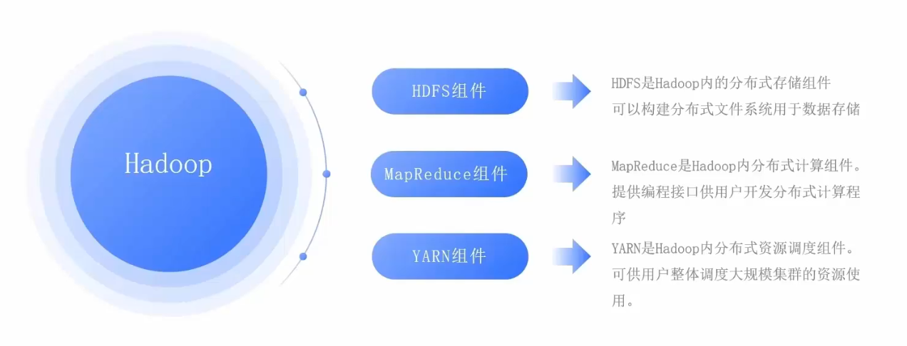

[toc]

# Hadoop笔记1

## 大数据介绍

狭义上：大数据是指一类技术栈，用来对海量数据进行处理的软件技术体系。
广义上：大数据是指数字化时代，信息化时代的基础数据支撑，用数据为生活赋能。

> 大数据的核心工作是什么？

- 数据存储：可以存储海量待处理数据。
- 数据计算：可以从海量数据中计算挖掘出有价值的数据结果。
- 数据传输：可以将海量数据传输给各个目标。

> 大数据软件技术生态有哪些？

由于大数据的核心工作分别是: 数据存储，数据计算，数据传输。

对于数据存储方面：

- Apache Hadoop框架的HDFS组件是大数据技术体系中使用最广泛的分布式存储技术。
- Apache HBase是大数据技术体系中使用最广泛的NoSQL，K-V键值对数据库技术。HBase是在HDFS的基础上构建的。
- Apache KUDU 也是大数据技术系统中使用较多的分布式存储引擎。
- 除此之外，还有各个云平台提供的大数据存储服务。例如阿里云的OSS等。

对于数据计算方面：

- Apache Hadoop框架的MapReduce组件是最早的大数据分布式计算引擎。
- Apache Hive 是一款以SQL为开发语言的分布式计算框架。其底层使用了Hadoop框架的MapReduce组件技术。至今有许多公司使用它。
- Apache Spark 是目前全球内最火热的分布式内存计算引擎技术。
- Apache Flink 同样也是一款大数据分布式内存计算引擎，主要在实时计算（流计算）领域，Flink占据主流。

对于数据传输方面：

- Apache Kafka 是一款分布式消息系统，可以完成海量数据的数据传输工作。
- Apache Pulsar 同样也是一款分布式的消息系统。
- Apache Flume 是一款流式数据采集工具，可以从非常多的数据源中进行数据采集。
- ..............

## Hadoop介绍

Hadoop的全称应该是Apache Hadoop。

Hadoop是Apache软件基金会下的顶级开源项目。Hadoop的主要功能如下。
- 分布式数据存储
- 分布式数据计算
- 分布式资源调度

总结：Hadoop是一个开源的分布式软件框架。提供分布式存储，计算，资源调度的解决方案。开发者可以通过Hadoop来实现海量数据的存储和计算。

> Hadoop内部存在三大组件，分别是：

- HDFS组件： HDFS是Hadoop内部的分布式存储组件。可以用来构建分布式文件系统，存储海量数据。
- MapReduce组件：MapReduce是Hadoop内部的分布式计算组件，提供接口给用户进行分布式计算。
- YARN组件: YARN是Hadoop内部的分布式资源调度组件。可以帮助用户实现大规模集群的资源调度。

## HDFS 分布式文件系统

HDFS 分布式文件系统 是 Hadoop 的三大组件之一。

- HDFS 全称是 Hadoop Distribued File System (Hadoop 分布式文件系统)
- HDFS 是 Hadoop内部的分布式数据存储解决方案。
- HDFS 可以在多台服务器上进行集群部署，并且存储海量的数据。

> 为什么需要分布式文件存储？

由于单个服务器的数据存储能力是有上限的，因此当数据量大到一定程度的时候，需要多台服务器一起存储数据才行。

### HDFS的集群架构

HDFS的集群架构是主从模式的，即有一个主节点，多个从节点，共同组成的集群。

在HDFS的集群架构中，主要有三种不同的角色。
- 主角色 NameNode ：主角色是一个独立进程。主要负责管理整个HDFS系统，管理DataNode从角色。
- 从角色 DataNode ：从角色也是一个独立进程。主要负责数据存储。
- 辅助角色 SecondaryNameNode ：辅助角色也是一个独立进程。主要负责辅助主角色，帮助主角色完成元数据整理工作。

HDFS的集群架构如下图所示

## Hadoop的安装和部署

