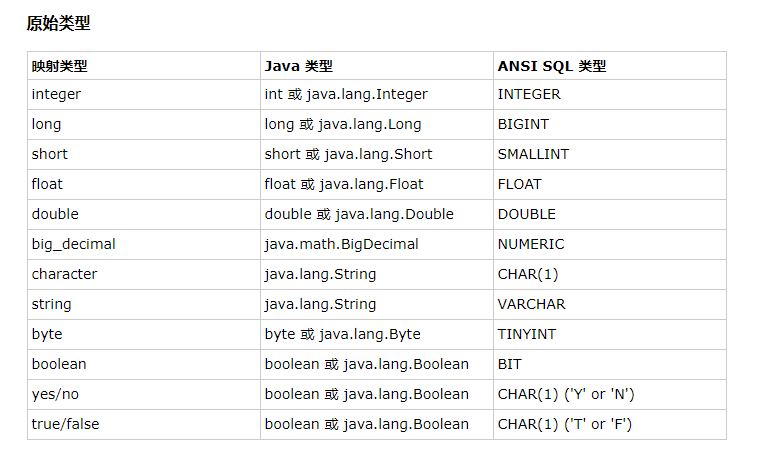

# Hibernate基础

## 概述：
&emsp;&emsp;一个开放源代码的对象关系映射框架，它对JDBC进行了非常轻量级的对象封装，它将POJO与数据库表建立映射关系，是一个全自动的orm框架,<font color="red">hibernate可以自动生成SQL语句，自动执行，使得Java程序员可以随心所欲的使用对象编程思维来操纵数据库。</font>

## 第一个Hibernate的CRUD 例子

<h3>工程目录：</h3>


<h3>①：准备数据库环境</h3>

<font color="red">在test数据库中创建user表.</font>


<h3>②：准备Hibernate 环境</h3>

1. 创建工程项目文件。
2. 到官网上，下载Hibernate 文件（目前最新的稳定版为5.2.12）
    [Hibernate下载路径](http://hibernate.org/orm/releases/5.2/)
3. 导入hobernate 需要的jar包到工程文件的classpath 下。
需要的jar包所在是路径：hibernate-release-5.2.12.Final\lib\required
4. 导入mysql的jdbc驱动包到工程文件的classpath下：
mysql-connector-java-5.1.42-bin.jar

<h3>③：创建Hibernate 配置文件</h3>

hibernate.cfg.xml
```xml
<?xml version='1.0' encoding='utf-8'?>
<!DOCTYPE hibernate-configuration PUBLIC
"-//Hibernate/Hibernate Configuration DTD 3.0//EN"
"http://www.hibernate.org/dtd/hibernate-configuration-3.0.dtd">
<hibernate-configuration>
    <session-factory>
        <!-- 数据库连接信息 -->
        <property name="connection.url">jdbc:mysql://localhost:3306/test</property>
        <property name="connection.username">root</property>
        <property name="connection.password">123456</property>
        <property name="connection.driver_class">com.mysql.jdbc.Driver</property>
 		<!-- SQL dialect（方言），  dialect和Mysql的版本不匹配,这段代码是MySQL 5.0以前的版本，下面是MySQL 5.0后的版本
        <property name="dialect">org.hibernate.dialect.MySQLInnoDBDialect</property>
        -->
        <property name="dialect">org.hibernate.dialect.MySQL5InnoDBDialect</property>
         <!-- 执行操作时，是否在控制台打印sql语句-->
        <property name="show_sql">true</property>
        <!-- 是否 对在控制台打印的sql语句进行格式化 -->
        <property name="format_sql">true</property>
        <!-- 指定程序运行时，是否在数据库中自动生成数据表 -->
        <property name="hbm2ddl.auto">update</property>
       <!-- 告诉hibernate 去哪找 映射文件（默认后缀为 .hbm.xml文件） ，resource： 表示路径为目录结构形式-->
        <mapping resource="com/hbm/xml/User.hbm.xml" />
    </session-factory>
</hibernate-configuration>

```


<h3>④：创建持久化类（实体类）</h3>

User.java
```java
package com.entity;
public class User{
 
	private Integer id;
	private String name;
	private Integer age;
	
	public User(){}
	
	~
}

```


<h3>⑤：创建对象——关系映射文件（Object Relational Mapping,ORM）</h3>
<font color="red">注意：映射文件的扩展名：" .hbm.xml "</font>

User.hbm.xml
```xml
<?xml version="1.0" encoding="UTF-8"?>  
<!DOCTYPE hibernate-mapping PUBLIC "-//Hibernate/Hibernate Mapping DTD 3.0//EN"    
"http://hibernate.sourceforge.net/hibernate-mapping-3.0.dtd">  
<hibernate-mapping>  
  <class name="com.entity.User" table="user">   <!-- name 为持久化类的全类名 -->
     <id name="id" type="java.lang.Integer" column="id">     <!--  指定主键的生成方式，native：使用数据库本地的方式-->
     	<generator class="native"/> 
     </id>  

     <property name="name" type="java.lang.String" column="name"></property>  
     <property name="age" type="java.lang.Integer" column="age"></property>  
  </class>  
</hibernate-mapping>

```

<h3>⑥：test</h3>

hibernate_test.java
```java
package com.test;
import static org.junit.Assert.*;
import java.util.List;
import org.hibernate.Session;
import org.hibernate.SessionFactory;
import org.hibernate.Transaction;
import org.hibernate.boot.MetadataSources;
import org.hibernate.boot.registry.StandardServiceRegistry;
import org.hibernate.boot.registry.StandardServiceRegistryBuilder;
import org.hibernate.cfg.Configuration;
import org.junit.Test;
import com.entity.User;
public class hibernate_test {
	private static SessionFactory sessionFactory=null;
	private static Session session=null;
	/*
	 * 通过静态代码块创建Session对象
	 * */
	static{
		/*
		 * 1.创建Configuration对象，调用configure()方法，加载 hibernate.cfg.xml配置文件. 
		 *  	注意：configure()方法 会默认加载 名字叫 hibernate.cfg.xml 的文件。
		 * 	   	 所以配置文件的名字最好叫hibernate.cfg.xml
		 * 2.创建StandardServiceRegistry 对象，hibernate的所有配置与服务都需要在该对象中注册才能有效。
		   3.创建SessionFactory对象。
		   4.创建Session对象
		 * 
		 * */
		Configuration cfg = new Configuration().configure();
	    sessionFactory=cfg.buildSessionFactory();
	
		/*这种生成 sessionFactory 的方式也可以：
 		 * 
		 * StandardServiceRegistry serviceRegistry=new StandardServiceRegistryBuilder().configure().build();
		   SessionFactory sessionFactory=new MetadataSources(serviceRegistry).buildMetadata().buildSessionFactory();
		 * 
		 * */
	    session=sessionFactory.openSession();
	}
	
	
	/*
	 * 插入数据
	 * */
	@Test
	public void insert(){
		/*
		 * 1.创建Configuration对象，调用configure()方法，加载 hibernate.cfg.xml配置文件. 
		 * 	    注意：configure()方法 会默认加载 名字叫 hibernate.cfg.xml 的文件。
		 * 	    所以配置文件的名字最好叫hibernate.cfg.xml。
		 * 2.创建StandardServiceRegistry 对象，hibernate的所有配置与服务都需要在该对象中注册才能有效。
		 * 3.创建SessionFactory对象。
		 * 4.创建Session对象
		 * 5.开启事务
		 * 6.执行插入操作：
		 * 7.提交事务
		 * 8.关闭session，sessionFactory
		 * */
		Transaction transaction=session.beginTransaction();   //开启事务
		User user=new User("xiaoming",44);
		session.save(user);        //插入数据
		transaction.commit();       //提交事务
		session.close();
		sessionFactory.close();
	}
	
	
	/*
	 * session.update(user);  默认以id来更新数据，如果对象没有id值（或id=null,或数据库没有该id值）,则无法 更新
	 * */
	@Test
	public void update(){
		Transaction transaction=session.beginTransaction();   //开启事务
		User user=new User("xiaoho",11);
		user.setId(8);
		session.update(user);
		transaction.commit();
		session.close();
		sessionFactory.close();
	}
	
	/*
	 * session.delete(user);  默认以id来删除数据，如果对象没有id值（或id=null,或数据库没有该id值）,则无法删除
	 * */
	@Test
	public void delete(){
		Transaction transaction=session.beginTransaction();   //开启事务
		User user=new User();   
		user.setId(1);
		session.delete(user);
		transaction.commit();
		session.close();
		sessionFactory.close();
	}
	
	/*
	 * 查询操作，不需要提交事务
	 * 
	 * 	session.get(User.class, 7);    //参数1:需要查询的类对应的clas文件  , 参数2： 查询条件（唯一标识，id值）
	 * */
	@Test
	public void selectone(){
		User user =session.get(User.class,7);
		session.close();
		sessionFactory.close();
		System.out.println(user);
	}

	
	/*
	 * 多条查询，不需要提交事务。
	 * */
	@Test
	public void selectAll(){
		/*
		 * 通过hibernate提供的查询语句进行查询
		 * 此处Users是类名，而不是数据库的表名, select * 不写
		 * */
	    String hql = "from User";   
		//执行hql语句
	    List<User> user_list=session.createQuery(hql).list();
	    for (User user : user_list) {
			System.out.println(user);
		}
		session.close();
		sessionFactory.close();
	}
}

```

<h3>⑦：解析：</h3>
 
在Hibernate的配置文件 hibernate.cfg.xml 中：
```xml
 <!-- 指定程序运行时，是否在数据库中自动生成数据表 -->
  <property name="hbm2ddl.auto">update</property>
```

**name属性：有4种取值。create , update, create-drop, validate。**

> 1. create
会根据.hbm.xml的文件来生成数据表，但是每次运行都会删除上一次的表，重新生成表，即使表之前之后没有任何改变。
> 2. create-drop:
会根据 .hbm.xml 文件生成表，但是SessionFactory 一旦关闭，表就自动删除。
> 3. update（最常用）：
  会根据 .hbm.xml 文件生成表，若 .hbm.xml 文件和数据库的对应的数据表的结构不同，Hibernate 会更新数据表的结构，但不会删除之前存在的数据或结构。
> 4. validate：
会与数据库的表进行比较，若 .hbm.xml文件的列在数据表中不存在，抛出异常。


##  缓存：
缓存是关于应用程序性能的优化，<font color="red">降低了应用程序对物理数据源访问的频次</font>，从而提高应用程序的运行性能。

Hibernate的缓存分为一级缓存，二级缓存。

### 一级缓存（session级别，默认缓存）：
一级缓存是 Session 级别缓存并且是一种强制性的缓存。它随session的创建被创建，随session的销毁被销毁。<font color="red">不同的session之间无法共享一级缓存。</font>

<font color="blue">当程序使用session的加载持久化对象时。session首先会根据加载的数据类和唯一的标识（id）在缓存中查找曾经是否执行过的例子。若存在，则把曾经的例子作为结果返回，若不存在，session会在二级缓存中查找。若还不存在，则session加载新的持久化对象（session直接访问数据库）。</font>

```java
/*
	 * 查询操作，不需要提交事务
	 * 
	 * 	session.get(User.class, 7);    //参数1:需要查询的类对应的clas文件  , 参数2： 查询条件（唯一标识，id值）
	 * */
	@Test
	public void selectone(){
		User user =session.get(User.class,7);
		System.out.println(user);
		User user2 =session.get(User.class,7);
		System.out.println(user2);
		session.close();
		sessionFactory.close();
	}

```


查询了两次数据库，但只打印了一次sql 语句。说明，第二次查询，是调用了一级缓存中之前查的结果。


### 二级缓存（SessionFactory 级别，不是默认的需要开启）：
当session加载持久化对象在一级缓存找不到匹配的缓存实例时，session会向二级缓存查找该实例对象。若找不到，session直接访问数据库。
<font color="red">由于Hibernate 本身没有提供二级缓存的实现方式。所以需要引入第三方的插件来实现Hibernate的二级缓存。</font>

**这里以EHCache 作为Hibernate的二级缓存：**

## Hibernate 配置文件：

### 1.配置C3P0数据源连接池：

1. 导入C3P0jar包，加入到类路径中：
一般在你下载的Hibernate的文件夹的
hibernate-release-5.2.12.Final\lib\optional\c3p0

> c3p0-0.9.5.2.jar
> hibernate-c3p0-5.2.12.Final.jar
> mchange-commons-java-0.2.11.jar

2. 添加配置文件信息：

hibernate.cfg.xml
```xml
        <!-- 配置C3P0数据库连接池
        	hibernate.c3p0.max_size:  最大连接数 
        	hibernate.c3p0.min_size： 最小连接数 
        	c3p0.acquire_increment：  当连接池里面的连接快用完的时候，C3P0同一时刻内可以同时获取的新的连接数的数量
        	c3p0.idle_test_period： 每隔2秒检查连接池里的连接对象是否超时，若超时，会有专门的线程每隔一段时间销毁超时的连接对象.
        	c3p0.timeout:  连接数多长时间没有使用后，被销毁
        	c3p0.max_statements: 缓存的Statement的最大数量
         -->
       <property name="hibernate.c3p0.max_size">10</property>
       <property name="hibernate.c3p0.min_size">5</property>
       <property name="c3p0.acquire_increment">2</property>
       <property name="c3p0.idle_test_period">2000</property>
       <property name="c3p0.timeout">2000</property>
       <property name="c3p0.max_statements">10</property>
```

### 2.配置批量操作（CRUD）的属性（主要适用于Oracle数据库）：

hibernate.cfg.xml
```xml
<!-- 
   			这两个属性主要适用于Oracle数据库， Mysql数据库不支持fetch_size特性
   			hibernate.jdbc.fetch_size:  该属性 设定jdbc的Statement 读取数据的时候每次从数据库取出的记录条数。
   			例如：当一次性查询10000条数据时，一条一条的查询，内存消耗小，但速度慢。
   			而100条100条的查询，速度快，但内存消耗大。因此取合适的值100。
   			hibernate.jdbc.batch_size： 对数据库进行批量删除，更新，插入时的每个批次的数量大小。
   		 -->
   		<property name="hibernate.jdbc.fetch_size">100</property>
   		<property name="hibernate.jdbc.batch_size">50</property>
```


## Hibernate 映射文件（*.hbm.xml）:

<font color="red">映射文件的扩展名： “ .hbm.xml ”</font>

### 1. 概述：
一个对象/关系型映射一般定义在 XML 文件中。映射文件指示 Hibernate 如何将已经定义的<font color="red">类或类组与数据库中的表对应起来</font>。

### 2.映射文件常用属性：

```xml
<?xml version="1.0" encoding="UTF-8"?>  
<!DOCTYPE hibernate-mapping PUBLIC "-//Hibernate/Hibernate Mapping DTD 3.0//EN"    
"http://hibernate.sourceforge.net/hibernate-mapping-3.0.dtd">  
<hibernate-mapping>  
   <!-- 
   	<hibernate-mapping>标签：
   		 package="com.entity" 属性 :指定包前缀 指定持久化类所在的包名 。这样之后class子标签中的name属性就不必使用全限定性的类名 
   -----------------------------------
  	 -- <class>标签：使用class元素表示一个持久化类（实体类）。注意：可以有多个<class>标签，对于多个映射文件，但建议一个持久化类对应一个映射文件。
   		-- table="user" ：对应数据库表名，默认持久化类名作为表名；
   		-- dynamic-update="false" : 默认为false ,若为true，动态修改那些有改变过的字段，而不用修改所有字段。 
   		-- dynamic-insert="false" : 默认为false ,若为true，动态插入非空值字段。 
   		-- lazy="true" : 指定是否用于延迟加载。
   		-- <id>子标签：定义了该属性到数据库表主键字段的映射。
   		 		-- name="id"：实体类主键的名字；  
   		 		-- type 属性：   指定实体类主键的数据类型
   				-- column="id" ：数据表主键字段的名字，如果不填写与name一样； 
   				
   				-- <generator>标签： 指定主键由什么方式生成    native:使用数据库本地的方式
   		***** <generator>标签的class取值： 
   		
   			1. native（推荐，跨数据库） ：由hibernate根据使用的数据库自行判断采用identity、hilo、sequence其中一种作为主键生成方式，灵活性很强。
   						如果能支持identity则使用identity，如果支持sequence则使用sequence。
   			2. increment： 由Hibernate从数据库中取出主键的最大值（每个session只取1次），以该值为基础，每次增量为1，
   							在内存中生成主键，不依赖于底层的数据库，因此可以跨数据库
   					注意：适用与，只能有一个Hibernate应用进程访问数据库，否则就可能产生主键冲突，
   						所以不适合多进程并发更新数据库，适合单一进程访问数据库，不能用于群集环境。
   				
   			3. identity :由数据库负责主键自增,但这个主键必须设置为自增长,Hibernate不负责该任务，该策略适用于Mysql或者sql server这种主键可以自增的数据库。
   						 主要是利用long、int、short类型可以直接自增的情况。
   						 注意： Oracle这类没有自增字段的则不支持。
   					
   			4. sequence ：采用数据库提供的sequence机制生成主键，需要数据库支持sequence。如oralce、DB，~。
   						  MySQL这种不支持sequence的数据库则不行（可以使用identity）。
   						  
   			5. hilo(可以跨数据库,主键需设为int/long/short类型) ： 使用高低（high/low）位算法生成主键，由Hibernate负责生成主键，该算法生成的标志只能保证在一个数据库中唯一。
   						需要一张额外的表来存储high的值，只和第一条数据有关系，至少要有一条数据。
						hilo方式生成主键的过程：
						1). 读取high值，表已经指定的话就读取指定的表中的数据，然后读取完成值+1，
						如果没有进行指定的话，默认读取hibernate_unique_key表中的next_hi字段的值，读完同样的+1。
						
						2). 获取low值，从0到最大的那个low值，循环的取值，
						如果获取的是最大的low值的时候就重新获取high值，然后low继续从0-最大low循环。
						
						3). 由公式：high*(maxLow + 1) + low
						如果需要建立大量的主键并且不需要经常重启的话，就将high设置的大一些，
						否则设置稍微小一些比较好，如果设置为0的时候就是自然数序列了1,2,3,4,5.....
   		-- <property>子标签： 为类定义一个持久化的javaBean风格的属性。
    			-- name="name"：标识持久化类属性的名字，以小写字母开头；
    			-- type="java.lang.String" ： 持久化类属性对应的java类型。也可以写为Hibernate的数据类型
    			-- column="name"：表字段的名字，如果不填写与name属性值一样；
    			-- unique="false" : 是否为该属性所对应的数据表的字段添加唯一性约束
    			-- update="false" : 指定该属性的值是否可以被修改。
    -->
    
  <class name="com.entity.User" table="user" dynamic-update="false" dynamic-insert="false" lazy="true">  
     <id name="id" type="java.lang.Integer" column="id" >    
     	<generator class="native"/> 
     </id>  
     <property name="name" type="java.lang.String" column="name" update="false" unique="false"></property>  
     <property name="age" type="java.lang.Integer" column="age"></property>  
  </class>  
</hibernate-mapping>
```

### 3.属性的映射类型：

1. 原始数据类型的映射：



2. 时间日期类型数据的映射：


<font color="red">当数据库的某一个字段的数据类型设为时间类型（date ， timestamp ） 时，持久化类的对应属性可以设为 java.util.Date 。当然在Hibernate的映射文件也需要指明该属性的Hibernate数据类型。</font>

> date : 数据库的date 数据类型 表示 日期 2017-11-12 。
> timestamp : 表示 时间日期 2017-11-12 12:21:22 。

User.java
```java
package com.entity;

import java.util.Date;

public class User{
 
	private Integer id;
	private String name;
	private Integer age;
	private Date createtime;

	public User(){}

	~
}

```

User.hbm.xml
```xml

<?xml version="1.0" encoding="UTF-8"?>  
<!DOCTYPE hibernate-mapping PUBLIC "-//Hibernate/Hibernate Mapping DTD 3.0//EN"    
"http://hibernate.sourceforge.net/hibernate-mapping-3.0.dtd">  
<hibernate-mapping>  
  <class name="com.entity.User" table="user">  
     <id name="id" type="java.lang.Integer" column="id" >    
     	<generator class="native"/> 
     </id>  
     <property name="name" type="java.lang.String" column="name" update="false" unique="false"></property>  
     <property name="age" type="java.lang.Integer" column="age"></property>  
     <property name="createtime" type="timestamp" column="createtime"></property>   
	 <!-- type="timestamp" : 该属性可以写java类型或Hibernate类型  -->
   </class>  
  
</hibernate-mapping>

```


3. 其他数据类型的映射：


## Hibernate的映射关系：

参考链接：
[Hibernate映射解析——七种映射关系](http://blog.csdn.net/huangaigang6688/article/details/7761310)

### 1.组件映射（原先一张表对应一个持久化类，现在使用组件映射可以把一张表拆分为多个持久化类）：
组件属性的意思是：非基本数据类型、字符串、日期等类型，而是一个复合类型的对象，在持久化的过程中，它仅仅当作值类型，而并非引用另一个持久化实体。<font color="red">例如：一个持久化类A其中一个属性是另一个持久化类B的实例化对象， 表示B类 是 A类的组件。</font>


User.java
```java
package com.entity;

import java.util.Date;

public class User{
	private Integer id;
	private String name;
	private Integer age;
	private Date createtime;
	private House house;         //house 是House类的对象
	public User(){}
	~
}


```

House.java
```java
package com.entity;
import java.util.Date;
public class House {
	private Integer price;
	private Integer size;
	private String  address;
	public House(){}
	public House(Integer price, Integer size, String address) {
		super();
		this.price = price;
		this.size = size;
		this.address = address;
	}
	~
}

```

Hibernate.cfg.xml
```xml
   <!-- 告诉hibernate 去哪找 映射文件（默认后缀为 .hbm.xml文件） ，resource： 表示路径为目录结构形式-->
    <mapping resource="com/hbm/xml/User.hbm.xml" />
	<!-- 不需要写House的映射文件，因为house的映射文件写在User.hbm.xml 中-->
      
```

**不需要写House的映射文件，因为house的映射文件写在User.hbm.xml 中**

User.hbm.xml
```xml
<hibernate-mapping package="com.entity">  

  <class name="User" table="user">  
     <id name="id" type="java.lang.Integer" column="id" >    
     	<generator class="native"/> 
     </id>  
     <property name="name" type="java.lang.String" column="name" update="false" unique="false"></property>  
     <property name="age" type="java.lang.Integer" column="age"></property>  
     
     <property name="createtime" type="timestamp" column="createtime"></property>   
	 <!-- type="timestamp" : 该属性可以写java类型或Hibernate类型  -->

	<!-- House类是User类中的属性,这里相当于House的映射文件 -->
	<component name="house" class="House">
		<property name="price" column="price"/>
		<property name="size"  column="size"/>
		<property name="address"  column="address"/>
	</component>
   </class>  
</hibernate-mapping>

```

**&lt;component&gt;标签指定组件的属性**

```java
@Test
	public void insert(){
		Transaction transaction=session.beginTransaction();   //开启事务
		House h=new House(100,100,"hunan");
		User user=new User("xiaoxiao",33,new Date(),h);
		session.save(user);        //插入数据
		transaction.commit();       //提交事务
		session.close();
		sessionFactory.close();
	}
```


<h3>说明:</h3>

> 1. &lt;component&gt;指定User类的House为User的组件，House并不是一个可以直接映射为表字段的属性而是一个类对象，class是指定类的名称，&lt;component&gt;的子元素&lt;property&gt;指定组件类的属性与user表字段的映射关系。
> 2. <font color="red">不必为House对象写一个House.hbm.xml映射文件，因为House是作为User的一部分即值类型而不是实体被持久化的，所以House的属性会与User的其它属性一样被映射为users表中的字段，而不会将House映射为单独的一个表。</font>
> 3. User与House的关系是"整体与部分"，也可以将他们表示为一对一关联关系，这样的话两者就是“平等"关系，那么House就会被映射为单独的一张表（需要配置House.hbm.xml文件）。

<h2><font color="blue">简单来说：原先一张表对应一个持久化类，现在使用组件映射可以把一张表拆分为多个持久化类，数据表的字段将被多个持久化类拆分。其中有一个为主要的持久化类。其余的持久化类都是主要持久化类的组件。</font></h2>
 

### 2. 单向多对一映射关系：
<font color="red">多对一关联映射原理：在多的一端加入一个外键，指向一的一端.</font>
如下图：

 

1. 例子：多的一端是Ord类 ，一的一端是 Customer 类。现实中，一个客户可以有多个订单，但在订单的角度看，多个订单可以有一个客户。

①：持久化类：
```java
package com.entity;

public class Customer {
		private Integer cid;
		private String cname;
		
		public Customer(){}

		public Customer(Integer cid, String cname) {
			super();
			this.cid = cid;
			this.cname = cname;
		}
	 //get,set，toString 方法省略
}

----------------------

package com.entity;

public class Ord {
		private Integer oid;
		private String oname;
		private Customer customer;
		public Ord() {
			
		}
	
		//get,set，toString 方法省略
		
		
}

```


②：Hibernate的映射文件：
```xml

<?xml version="1.0" encoding="UTF-8"?>  
<!DOCTYPE hibernate-mapping PUBLIC "-//Hibernate/Hibernate Mapping DTD 3.0//EN"    
"http://hibernate.sourceforge.net/hibernate-mapping-3.0.dtd">  
<hibernate-mapping package="com.entity">  

  <class name="Customer" table="customer">  
     <id name="cid" type="java.lang.Integer" column="cid" >    
     	<generator class="native"/> 
     </id>  
     <property name="cname" type="java.lang.String" column="cname"/>  
  
   </class>  
  
</hibernate-mapping>

-----------------------------

<?xml version="1.0" encoding="UTF-8"?>  
<!DOCTYPE hibernate-mapping PUBLIC "-//Hibernate/Hibernate Mapping DTD 3.0//EN"    
"http://hibernate.sourceforge.net/hibernate-mapping-3.0.dtd">  
<hibernate-mapping package="com.entity">  

  <class name="Ord" table="ord">  
     <id name="oid" type="java.lang.Integer" column="oid" >    
     	<generator class="native"/> 
     </id>  
     
     <property name="oname" type="java.lang.String" column="oname"/>  
  <!-- 
  	  多对一关联映射原理：在多的一端加入一个外键，指向一的一端。
  		many-to-one :多对一关联映射标签，该标签写在多的一端。
  				name属性：多的一端中指向一的一端的属性名。
  				cloumn属性：指明外键连向一的一端的那个字段。
  				class属性： 是 指向一 的一端的全类名，如果<hibernate-mapping>标签有package属性值，只写类名。
   -->
  
	<many-to-one name="customer" class="Customer" column="cid"/>
   </class>  
</hibernate-mapping>


```


③：Hibernate的配置文件：
```xml
<?xml version='1.0' encoding='utf-8'?>
<!DOCTYPE hibernate-configuration PUBLIC
"-//Hibernate/Hibernate Configuration DTD 3.0//EN"
"http://www.hibernate.org/dtd/hibernate-configuration-3.0.dtd">
<hibernate-configuration>
    <session-factory>
        <!-- 数据库连接信息 -->
        <property name="connection.url">jdbc:mysql://localhost:3306/test2</property>
        <property name="connection.username">root</property>
        <property name="connection.password">123456</property>
        <property name="connection.driver_class">com.mysql.jdbc.Driver</property>
 
 		<!-- 告訴hibernate 使用什么数据库 -->
        
        <!-- SQL dialect，  dialect和Mysql的版本不匹配,这段代码是MySQL 5.0以前的版本
        <property name="dialect">org.hibernate.dialect.MySQLInnoDBDialect</property>
        -->
        
        <property name="dialect">org.hibernate.dialect.MySQL5InnoDBDialect</property>
        
         <!-- 执行操作时，是否在控制台打印sql语句-->
        <property name="show_sql">true</property>
        
        <!-- 是否 对在控制台打印的sql语句进行格式化 -->
        <property name="format_sql">true</property>
        
        <!-- 指定程序运行时，是否在数据库中自动生成数据表-->
       <property name="hbm2ddl.auto">update</property>
         
         
       <!-- 告诉hibernate 去哪找 映射文件（默认后缀为 .hbm.xml文件） ，resource： 表示路径为目录结构形式-->
     
        <mapping resource="com/hbm/xml/Customer.hbm.xml" />
        <mapping resource="com/hbm/xml/Ord.hbm.xml" />
     
    </session-factory>
</hibernate-configuration>

```


④：test：
```java
package com.test;
.......

public class hibernate_test {
	
	private static SessionFactory sessionFactory=null;
	private static Session session=null;

	@Before
	public void init(){
		StandardServiceRegistry serviceRegistry=new StandardServiceRegistryBuilder().configure().build();
		SessionFactory sessionFactory=new MetadataSources(serviceRegistry).buildMetadata().buildSessionFactory();
	   session=sessionFactory.openSession();
	}

	@After
	public void after(){
		session.close();
		sessionFactory.close();
	}
	
	@Test
	public void test_insert(){
		Transaction beginTransaction = session.beginTransaction();   //开启事务
		Customer cus=new Customer();
		cus.setCname("aa");
		Ord ord=new Ord(1,"ASASA",cus);
		session.save(cus);
		session.save(ord);
		beginTransaction.commit();                    //提交事务
	}
	
	@Test
	public void test_select(){
		//查询 ord 会把 相关联的customer 也查询出来
		Ord ord = session.get(Ord.class,1);
		System.out.println(ord);
	}
	
	@Test
	public void test_update(){
		Transaction beginTransaction = session.beginTransaction();
		Ord ord = session.get(Ord.class, 1);
		ord.setOname("asasasa");
		session.update(ord);
		beginTransaction.commit();
	}
	
	@Test
	public void test_delete(){
		/*
		 * 不能先删除Customer，因为有外键
		 * 
		 * */
		Transaction beginTransaction = session.beginTransaction();
		Ord ord = session.get(Ord.class, 1);
		session.delete(ord);
		beginTransaction.commit();
	}
	

}

```

⑤：运行结果：
> test_insert（）方法：
> Hibernate: 
    insert into customer (cname) values (?)
> Hibernate:  
	insert into ord (oname, cid) values (?, ?)


> test_select() 方法：
> Hibernate: 
	select ord0_.oid as oid1_1_0_, ord0_.oname as oname2_1_0_, ord0_.cid as cid3_1_0_ from ord ord0_ where ord0_.oid=?
> Hibernate: 
	select customer0_.cid as cid1_0_0_, customer0_.cname as cname2_0_0_ from customer customer0_ where customer0_.cid=?
> Orders [oid=2, oname=ASASA, customer=Customer [cid=2, cname=aa]]


> test_update()方法：
> Hibernate: 
select ord0_.oid as oid1_1_0_, ord0_.oname as oname2_1_0_, ord0_.cid as cid3_1_0_ from ord ord0_ where ord0_.oid=?
> Hibernate: 
update ord set oname=?, cid=? where oid=?

> test_delete()方法：
> Hibernate: 
select ord0_.oid as oid1_1_0_, ord0_.oname as oname2_1_0_, ord0_.cid as cid3_1_0_ from ord ord0_ where ord0_.oid=?
> Hibernate: 
delete from ord where oid=?


### 3.双向1-N关联关系：
<font color="red">对于1-N关联，Hibernate推荐使用双向关联，而且不要让1的一端控制关联关系，而使用N的一端控制关联关系。</font>
双向的N-1关联与1-N关联是完全相同的两种情形。
<font color="blue">两端都需要增加对关联属性的访问，N的一端增加引用到关联实体的属性，1的一端增加集合属性，集合元素为关联实体。</font>


<h2>注意：</h2>

> ①：当Session从数据库中加载Java集合时，创建的是Hibernate内置集合类的实例，因此，在持久化类中定义集合属性时，必须把属性声明为Java接口。
> ②：Hibernate的内置集合类具有集合代理功能，支持延迟检索策略
> 事实上，Hibernate的内置集合类封装了JDK中的集合类，这使得Hibernate能够对缓存中的集合对象进行脏检查，按照集合对象的状态来同步更新数据库。
> ③：在定义集合属性时，通常把它初始化为集合实现类的一个实例，这样可以提高程序的健壮性，避免应用程序访问取值为null的集合的方法。

```
例如：private Set<Order> orders = new HashSet<Order>();
```


<h2>demo:</h2>

①：持久化类：
```java
public class Customer {
    private Integer customerId;
    private String customerName;
    private Set<Order> orders = new HashSet<Order>();
    //省去get和set
}
public class Order {
    private Integer orderId;
    private String orderName;
    private Customer customer;
//省去get和set
}

```

②：映射文件：
```xml
<!-- Customer.hbm.xml -->
<hibernate-mapping package="com.entity">
    <class name="Customer" table="CUSTOMERS">
        <id name="customerId" type="java.lang.Integer">
            <column name="CUSTOMER_ID" />
            <generator class="native" />
        </id>
        <property name="customerName" type="java.lang.String">
            <column name="CUSTOMER_NAME" />
        </property>
        <set name="orders"  inverse="true">
            <key column="CUSTOMER_ID"></key>
            <one-to-many class="Order"/>
        </set>
    </class>
</hibernate-mapping>

<!--
set标签：
	name属性: 设定待映射的持久化类的属性。
	inverse 属性：
		通过对 inverse 属性的来决定是由双向关联的哪一方来维护表和表之间的关系。 inverse = false 的为主动方，inverse = true 的为被动方, 由主动方负责维护关联关系。在没有设置 inverse=true 的情况下，父子两边都维护父子关系
		在 1-N 关系中，将 N 方设为主控方将有助于性能改善(如果要国家元首记住全国人民的名字，不是太可能，但要让全国人民知道国家元首，就容易的多)
		在 1-N 关系中，若将 1 方设为主控方,会额外多出 update 语句。插入数据时无法同时插入外键列，因而无法为外键列添加非空约束.
	order-by 属性：
		如果设置了该属性, 当 Hibernate 通过 select 语句到数据库中检索集合对象时, 可以利用 order by 子句进行排序
	key标签：设定与所关联的持久化类对应的表的外键
		column: 指定关联表的外键名
	one-to-many标签；设定集合属性中所关联的持久化类
		class: 指定关联的持久化类的类名
-->

----------------------

<!-- Order.hbm.xml -->
<hibernate-mapping package="com.entity">
    <class name="Order" table="ORDERS">
        <id name="orderId" type="java.lang.Integer">
            <column name="ORDER_ID" />
            <generator class="native" />
        </id>
        <property name="orderName" type="java.lang.String">
            <column name="ORDER_NAME" />
        </property>
       <many-to-one name="customer" class="Customer" cascade="all" column="CUSTOMER_ID"></many-to-one>
    </class>
</hibernate-mapping>  


<!--
该标签用于映射多对一关联关系

<many-to-one name="customer" class="Customer" cascade="all" column="CUSTOMER_ID"></many-to-one>

	name: 设定待映射的持久化类的属性的名字
	column: 设定和持久化类的属性对应的表的外键
	class：设定待映射的持久化类的属性的类型
	cascade：意味着系统将先自动级联插入主表记录，也就是说先持久化Customer对象，再持久化Person对象。开发时不建议使用该属性，建议使用手工的方式。
-->
```

### 4.双向1-1关联关系:

1. 双向1-1关联需要修改两边的持久化类代码，让两个持久化类都增加引用关联实体的属性，并为该属性提供get和set方法。
2. 双向1-1关联有三种映射模式：①基于主键 ，②基于外键，③使用连接表。这里主要介绍前两种。


<h3>①基于主键: </h3>

<font clor="red">如果采用基于主键的映射策略，则一端的主键生成器需要使用foreign策略，表明将根据对方的主键来生成自己的主键，本实体不能拥有自己的主键声称策略。</font>

```xml
<!-- 
	<param>子元素指定使用当前持久化类的哪个属性作为“对方”。
-->
<generator class="foreign" >
  <param name="property">manager</param>
</generator>
```

当然，任意一端都可以采用foreign主键生成器策略，表明将根据对方主键来生成自己的主键。
1. 采用foreign主键生成器策略的一端增加one-to-one元素映射相关属性，其ont-to-one属性还应增加constrained=true属性；另一端增加one-to-one元素映射关联属性。
2. constrained：指定为当前持久化类对应的数据库表的主键添加一个外键约束，引用被关联对象所对应的数据库主键。


<h3>demo(有些省略了):</h3>

Hibernate 映射文件：
```xml
<!--  Manager.hbm.xml -->
<hibernate-mapping package="com.lihui.hibernate.double_1_1.primary">
    <class name="Manager" table="MANAGERS">
        <id name="mgrId" type="java.lang.Integer">
            <column name="MGR_ID" />
            <generator class="native" />
        </id>
        <property name="mgrName" type="java.lang.String">
            <column name="MGR_NAME" />
        </property>
        <one-to-one name="department" class="Department"></one-to-one>
    </class>
</hibernate-mapping>
-----------------------------------------
<!--  Department.hbm.xml -->
<hibernate-mapping package="com.lihui.hibernate.double_1_1.primary">
    <class name="Department" table="DEPARTMENTS">
        <id name="deptId" type="java.lang.Integer">
            <column name="DEPT_ID" />
            <generator class="foreign" >
                <param name="property">manager</param>
            </generator>
        </id>
        <property name="deptName" type="java.lang.String">
            <column name="DEPT_NAME" />
        </property>
        <one-to-one name="manager" class="Manager" constrained="true"></one-to-one>
    </class>
</hibernate-mapping>

```

### 4.N-N关联关系：

#### 1.单向N-N关联:

<font color="red">N-N关联映射增加一张表才完成基本映射。</font>
1. 与1-N映射相似，必须为set集合元素添加key子元素，指定CATEGORIES_ITEMS表中参照CATEGORIES表的外键为CATEGORIY_ID。
2. 与1-N不同的是，建立N-N关联时，集合中的元素使用many-to-many。关于配置文件的属性的介绍，将在代码实现部分介绍。


<h3>demo:</h3>

①：持久化类：
```java
public class Category {
    private Integer categoryId;
    private String catregoryName;

    private Set<Item> items = new HashSet<Item>();
  //省去get和set方法
}
---------------------
public class Item {
    private Integer itemId;
    private String itemName;
    //省去get和set方法
}
```

②：映射文件：

```xml

<!-- Category.hbm.xml  -->
<hibernate-mapping package="com.lihui.hibernate.single_n_n">
    <class name="Category" table="CATEGORIES">
        <id name="categoryId" type="java.lang.Integer">
            <column name="CATEGORY_ID" />
            <generator class="native" />
        </id>
        <property name="catregoryName" type="java.lang.String">
            <column name="CATREGORY_NAME" />
        </property>
        <set name="items" table="CATEGORIES_ITEMS">
            <key>
                <column name="C_ID"></column>
            </key>
            <many-to-many class="Item" column="I_ID"></many-to-many>
        </set>
    </class>
</hibernate-mapping>

<!--

table:指定中间表
many-to-many:指定多对多的关联关系
column:执行set集合中的持久化类在中间表的外键列的名称
-->
------------------------------

<!-- Item.hbm.xml   -->
<hibernate-mapping package="com.lihui.hibernate.single_n_n">
    <class name="Item" table="ITEMS">
        <id name="itemId" type="java.lang.Integer">
            <column name="ITEM_ID" />
            <generator class="native" />
        </id>
        <property name="itemName" type="java.lang.String">
            <column name="ITEM_NAME" />
        </property>
    </class>
</hibernate-mapping>

```

③：test:
```java
@Test
    public void testSave() {
        Category c1 = new Category();
        c1.setCatregoryName("C-AA");
        Category c2 = new Category();
        c2.setCatregoryName("C-BB");
        Item i1 = new Item();
        i1.setItemName("I-AA");
        Item i2 = new Item();
        i2.setItemName("I-BB");
        c1.getItems().add(i1);
        c1.getItems().add(i2);
        c2.getItems().add(i1);
        c2.getItems().add(i2);
        session.save(c1);
        session.save(c2);
        session.save(i1);
        session.save(i2);
    }

```


#### 2.双向N-N关联:
<font color="red">双向N-N关联需要两端都使用set集合属性，两端都增加对集合属性的访问。</font>

1. 在双向N-N关联的两边都需指定连接表的表名及外键列的列名. 两个集合元素 set 的 table 元素的值必须指定，而且必须相同。
2. set元素的两个子元素：key 和 many-to-many 都必须指定 column 属性，其中，key 和 many-to-many 分别指定本持久化类和关联类在连接表中的外键列名，因此两边的 key 与 many-to-many 的column属性交叉相同。
3. 也就是说，一边的set元素的key的 cloumn值为a,many-to-many 的 column 为b；则另一边的 set 元素的 key 的 column 值 b,many-to-many的 column 值为 a。


<h3>demo:</h3>

①：持久化类：
```java
public class Category {
    private Integer categoryId;
    private String catregoryName;

    private Set<Item> items = new HashSet<Item>();
  //省去get和set方法
}

------------------

public class Item {
    private Integer itemId;
    private String itemName;
    //省去get和set方法
}
```


②：映射文件：
```xml
<!-- Category.hbm.xml  -->
<hibernate-mapping package="com.lihui.hibernate.single_n_n">
    <class name="Category" table="CATEGORIES">
        <id name="categoryId" type="java.lang.Integer">
            <column name="CATEGORY_ID" />
            <generator class="native" />
        </id>
        <property name="catregoryName" type="java.lang.String">
            <column name="CATREGORY_NAME" />
        </property>
        <set name="items" table="CATEGORIES_ITEMS">
            <key>
                <column name="C_ID"></column>
            </key>
            <many-to-many class="Item" column="I_ID"></many-to-many>
        </set>
    </class>
</hibernate-mapping>

<!--

table:指定中间表
many-to-many:指定多对多的关联关系
column:执行set集合中的持久化类在中间表的外键列的名称
-->

----------------------------------------
<!-- Item.hbm.xml -->
<hibernate-mapping package="com.lihui.hibernate.single_n_n">
    <class name="Item" table="ITEMS">
        <id name="itemId" type="java.lang.Integer">
            <column name="ITEM_ID" />
            <generator class="native" />
        </id>
        <property name="itemName" type="java.lang.String">
            <column name="ITEM_NAME" />
        </property>
        <set name="categories" table="CATEGORIES_ITEMS" inverse="true">
            <key>
                <column name="I_ID"></column>
            </key>
            <many-to-many class="Category" column="C_ID"></many-to-many>
        </set>
    </class>
</hibernate-mapping>

```

注意要在其中一端加入inverse="true"，否则会造成主键冲突


## Hibernate的HQL：

### 1.概述：
HQL(Hibernate Query Language) 是面向对象的查询语言, 它和 SQL 查询语言有些相似. 

<h3>HQL 查询包括以下步骤:</h3>

1. 获取Hibernate Session对象。
2. 编写HQL语句
3. 以HQL语句作为参数，调用Session的createQuery方法创建查询对象。
4. 如果HQL语句包含参数，则调用Query的setXxx方法为参数赋值。
5. 调用Query对象的list()或uniqueResult()方法(若结果数据唯一)返回查询结果列表（持久化实体集）

**Qurey 接口支持方法链编程风格, 它的 setXxx() 方法返回自身实例, 而不是 void 类型，因此可以写类似于.setXxx().setXxx().setXxx()...样式的语句。**

<font color="red">注意:</font>

1. HQL语言，是基于对象进行查询的，不是基于数据库的表。
2. 在HQL中，不能使用 select * from Student ,但是可以使用别名 select stu from Student stu 。
3. <font color="red">在HQL语句中，本身大小写无关，但是其中出现的类名和属性名必须注意大小写区分。</font>
4. HQL 查询语句是面向对象的, Hibernate 负责解析 HQL 查询语句, 然后根据对象-关系映射文件中的映射信息, 把 HQL 查询语句翻译成相应的 SQL 语句。HQL 查询语句中的主体是域模型中的类及类的属性。

### 2.查询：


#### 0.创建Session，SessionFactory：
```java
	private static SessionFactory sessionFactory=null;
	private static Session session=null;
	@Before         //在@Test 标记的代码之前执行
	public void init(){
		StandardServiceRegistry serviceRegistry=new StandardServiceRegistryBuilder().configure().build();
		SessionFactory sessionFactory=new MetadataSources(serviceRegistry).buildMetadata().buildSessionFactory();
	   session=sessionFactory.openSession();
	}
	@After          //在@Test 标记的代码之后执行
	public void after(){
		session.close();       //关闭session，释放系统资源
	}
	
```

#### 1.全查：

HQL语句: "from User"

```java
	/*
	 * 实体查询
	 * */
	@Test
	public void aa(){
		/*
		 * HQL查询：
		 * 
		 * 1.创建Query对象,通过hql语句
		 * 2.执行查询。
		 * 3.控制台打印结果：

		 *  Hibernate: select user0_.id as id1_2_, user0_.name as name2_2_, user0_.age as age3_2_, user0_.createtime as 			 createti4_2_ from user user0_
			[User [id=1, name=1, age=1, createtime=2017-12-10 14:36:20.0], User [id=2, name=2, age=2, createtime=2017-12-10 14:36:27.0], User [id=3, name=3, age=3, createtime=2017-12-10 14:36:33.0]]
		 * 
		 * */
		String hql="from User ";
		Query query=session.createQuery(hql);
		List<User> list = query.list();
		System.out.println(list);
	}
```

> 控制台打印结果:
> Hibernate: select user0_.id as id1_2_, user0_.name as name2_2_, user0_.age as age3_2_, user0_.createtime as 			 createti4_2_ from user user0_
> [User [id=1, name=1, age=1, createtime=2017-12-10 14:36:20.0], 
> User [id=2, name=2, age=2, createtime=2017-12-10 14:36:27.0], 
> User [id=3, name=3, age=3, createtime=2017-12-10 14:36:33.0]]


#### 2.使用占位符？查询:

HQL语句 : " FROM User where id=? "

```java

	/*
	 * 使用占位符？ 查询
	 * 
	   *    　Hibernate和JDBC占位符的区别：在Hibernate占位符下标从0开始，在JDBC中的占位符下标从1开始
	 * */
	@Test
	public void aa_2(){
		/*
		 * 
		 * 
		 * Hibernate: select user0_.id as id1_2_, user0_.name as name2_2_, user0_.age as age3_2_, user0_.createtime as createti4_2_ from user user0_ where user0_.id=?
			User [id=1, name=xiaoming, age=1, createtime=2017-12-10 14:36:20.0]

		 * */
		String hql="FROM User where id=?";
		Query query=session.createQuery(hql);
		query.setInteger(0, 1);
		List<User> list = query.list();
		for (User user : list) {
			System.out.println(user);
		}
		
	}
```


> 控制台打印结果:
> Hibernate: select user0_.id as id1_2_, user0_.name as name2_2_, user0_.age as age3_2_, user0_.createtime as createti4_2_     from user user0_ where user0_.id=?
> User [id=1, name=xiaoming, age=1, createtime=2017-12-10 14:36:20.0]

<br/>

#### 3.当查询的数据唯一时，可以使用uniqueResult方法

```java
@Test
	public void aa_2_1(){
		/*
		 * 
		 * uniqueResult();
		 * 
		 * */
		String hql="FROM User where id=?";
		Query query=session.createQuery(hql);
		query.setInteger(0, 1);
		User user = (User) query.uniqueResult();
		System.out.println(user);
	}
```
> 控制台打印结果：
> Hibernate: select user0_.id as id1_2_, user0_.name as name2_2_, user0_.age as age3_2_, user0_.createtime as createti4_2_ from user user0_ where user0_.id=?
> User [id=1, name=xiaoming, age=1, createtime=2017-12-10 14:36:20.0]

#### 4.有参数的查询：

HQL语句 : "FROM User where id=:ids"

```java
/*
	 * 使用参数 查询
	 * 
	 * 使用参数的方式，在HQL中在参数前面需要加上冒号
	 * */
	@Test
	public void aa_3(){
		/*
		 *
		 * 
		 *Hibernate: select user0_.id as id1_2_, user0_.name as name2_2_, user0_.age as age3_2_, user0_.createtime as createti4_2_ from user user0_ where user0_.id=?
			User [id=1, name=xiaoming, age=1, createtime=2017-12-10 14:36:20.0]
		 * */
		String hql="FROM User where id=:ids";      //使用参数的方式，在HQL中在参数前面需要加上冒号
		Query query=session.createQuery(hql);
		query.setParameter("ids", 1);
		List<User> list = query.list();
		for (User user : list) {
			System.out.println(user);
		}
	}
	
```

> 控制台打印结果：
> Hibernate: select user0_.id as id1_2_, user0_.name as name2_2_, user0_.age as age3_2_, user0_.createtime as createti4_2_ from user user0_ where user0_.id=?
> User [id=1, name=xiaoming, age=1, createtime=2017-12-10 14:36:20.0]


#### 5.单个属性查询，查询某个类的单个属性:

HQL语句 :"SELECT user.name FROM User user "
```java
	/*
	 * 属性查询，查询某个类的单个属性
	 * */
	@Test
	public void bb(){
		/*
		 * 查询User类的name属性。
		 * 
		 * Hibernate: select user0_.name as col_0_0_ from user user0_
						[1, 2, 3]
		 * */
		String hql="SELECT user.name FROM User user ";
		Query query=session.createQuery(hql);
		List<User> list = query.list();
		System.out.println(list);
	}
	
```

> 控制台打印结果：
> Hibernate: select user0_.name as col_0_0_ from user user0_
> [1, 2, 3]

#### 6.多个属性查询，查询某个类的多个属性，属性封装在数组中:

HQL语句:"SELECT user.id,user.name , user.age FROM User user "

```java
	/*
	 * 属性查询，查询某个类的多个属性,这些查询的数据被封装到数组中,返回的是一个数组
	 * */
	@Test
	public void cc(){
		/*
		 * 查询User类的name，age,createtime属性。
		 * 
		 * Hibernate: select user0_.id as col_0_0_, user0_.name as col_1_0_, user0_.age as col_2_0_ from user user0_
					[1, 1, 1]
					[2, 2, 2]
					[3, 3, 3]
		 * */
		String hql="SELECT user.id,user.name , user.age FROM User user ";
		Query query=session.createQuery(hql);
		List<User> list = query.list();
		for(Object obj:list){      
		    System.out.println(Arrays.toString((Object[])obj));
		}
	}
	
```

> 控制台打印结果:
> Hibernate: select user0_.id as col_0_0_, user0_.name as col_1_0_, user0_.age as col_2_0_ from user user0_
> 	[1, 1, 1]
>	[2, 2, 2]
>	[3, 3, 3]


#### 7.多个属性查询，查询某个类的多个属性，属性封装在对象中:

**HQL语句："SELECT new User(user.name,user.age,user.createtime) FROM User user where user.id=?"**

```java
	/*
	 * 属性查询，查询某个类的多个属性，这些查询的数据被封装到对象中
	 * */
	@Test
	public void dd(){
		/*
		 * 查询User类的name，age,createtime属性。
		 * 
		 * Hibernate: select user0_.name as col_0_0_, user0_.age as col_1_0_, user0_.createtime as col_2_0_ from user user0_ where user0_.id=?
			User [id=null, name=2, age=2, createtime=2017-12-10 14:36:27.0]
		 * 					
		 * */
		String hql = "SELECT new User(user.name,user.age,user.createtime) FROM User user where user.id=?";
		Query query=session.createQuery(hql);
		query.setInteger(0, 2);    //为占位符赋值。
		List<User> list = query.list();    //执行查询，并返回数据
       for (User object : list) {
    	   System.out.println(object);
       	}
	}
	
```

> 控制台打印结果：
> Hibernate: select user0_.name as col_0_0_, user0_.age as col_1_0_, user0_.createtime as col_2_0_ from user user0_ where user0_.id=?
> User [id=null, name=2, age=2, createtime=2017-12-10 14:36:27.0]


#### 8.更新:

HQL语句:"UPDATE User e SET e.name=? WHERE id=1"

```java
	/*
	 * 更新
	 * */
	@Test
	public void ee(){
		/*
		 * 更新的HQL语句
		 * 
		 * Hibernate: update user set name=? where id=1
			1
		 * 
		 * */
		//开启事务
		Transaction beginTransaction = session.beginTransaction();
		String hql ="UPDATE User e SET e.name=? WHERE id=1";
		Query query=session.createQuery(hql);
		query.setString(0, "xiaoming");
		int a = query.executeUpdate();       //返回受影响的行数
		//提交事务
		beginTransaction.commit();
		System.out.println(a);
	}
```

> 控制台打印结果：
>  Hibernate: update user set name=? where id=1
> 1

#### 9.删除:

HQL语句:"delete from User  WHERE id=2"

```java
/*
	 * 删除
	 * */
	@Test
	public void ff(){
		/*
		 * 删除的HQL语句
		 * 
		 * Hibernate: delete from user where id=2
			1
		 * 
		 * */
		//开启事务
		Transaction beginTransaction = session.beginTransaction();
		String hql ="delete from User  WHERE id=2";
		Query query=session.createQuery(hql);
		int a = query.executeUpdate();           //返回受影响的行数
		//提交事务
		beginTransaction.commit();
		System.out.println(a);
	}
	
```

> 控制台打印结果：
> Hibernate: delete from user where id=2
> 1

## 参考资料：
[Hibernate配置文件与映射文件详解](http://blog.csdn.net/wangchuanqi1234/article/details/51131285)
[Hibernate各种主键生成策略与配置详解](https://www.cnblogs.com/hoobey/p/5508992.html)
[w3school](https://www.w3cschool.cn/)
[使用hibernate自动创建Mysql表失败原因](https://www.cnblogs.com/lycsky/p/6087794.html)
[Hibernate映射解析——七种映射关系](http://blog.csdn.net/huangaigang6688/article/details/7761310)
[Hibernate HQL详解](https://www.cnblogs.com/caoyc/p/5606444.html)