[toc]


# Flex布局

[参照文章：Flex 布局详解](https://zhuanlan.zhihu.com/p/611136271)

Flex布局又称弹性盒子（ Flexible Box ）布局。是一种更加有效的方式来对容器中的子元素进行排列、对齐和分配。

## Flex基本概念

弹性盒子（Flexible Box）由弹性容器元素(Flex container)和弹性子元素(Flex item)组成。通过给容器元素设置 display 属性的值为 flex 或 inline-flex将其定义为弹性容器元素。弹性容器元素中的子元素就是弹性子元素。通常一个弹性容器元素内包含了一个或多个弹性子元素。

如下图所示弹性容器元素和弹性子元素的示意图
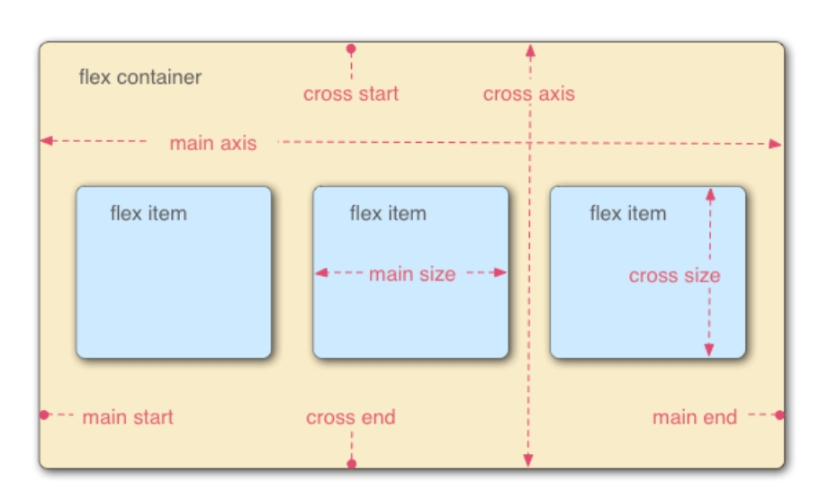

- 在flex容器中默认存在两条轴，水平主轴(main axis) 和垂直的交叉轴(cross axis)，这是默认的设置，你可以通过修改使垂直方向变为主轴，水平方向变为交叉轴。
- 在flex容器中的每个单元块被称之为 flex item，每个单元块占据的主轴空间为 (main size), 占据的交叉轴的空间为 (cross size)。


## Flex容器

### display:flex | inline-flex 

首先要实现 flex 布局需要先指定一个 flex 容器，任何一个容器都可以被指定为 flex 容器。这样 flex 容器内部的子元素就可以按照flex的方式布局。

```html
<div class="container">
    <div>1</div>
    <div>2</div>
    <div>3</div>
</div>
```

```css
.container {
    //display有两种取值
    display: flex | inline-flex;       
}
```

两种取值分别生成一个块状或行内的flex容器盒子。

简而言之，如果你使用块元素如 div，你就可以使用 flex，而如果你使用行内元素，你可以使用 inline-flex。

<font color="red">注：当父元素设置为flex容器之后，子元素的 float、clear、vertical-align 的属性将会失效。</font>

除此之外，下面六种属性可以设置在flex容器上，它们分别是。
1. flex-direction属性
2. flex-wrap属性
3. flex-flow属性
4. justify-content属性
5. align-items属性
6. align-content属性

### flex-direction属性

flex-direction属性用来决定主轴的方向(即flex容器中子元素的排列方向)。

flex-direction属性有4种取值。

```css
.container {
    flex-direction: row | row-reverse | column | column-reverse;
}
/* 四种取值分别是水平row ，反向水平row-reverse ，垂直column，反向垂直column-reverse */
```

> flex-direction: row;  //水平排列

默认值为 row，flex容器的主轴为水平方向，起点在左端。子元素依次从左到右排列

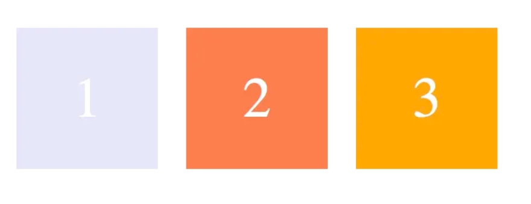

> flex-direction: row-reverse;  //反向水平排列

row-reverse，flex容器的主轴为水平方向，起点在右端。子元素依次从右到左排列

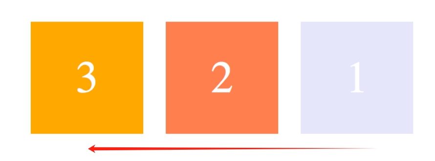

> flex-direction: column;  //垂直排列

column：flex容器的主轴为垂直方向，起点在上端。子元素依次从上到下排列

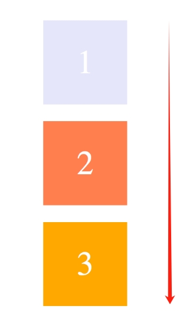

> flex-direction: column-reverse;  //反向垂直排列

column-reverse：flex容器的主轴为垂直方向，起点在下端。子元素依次从下到上排列

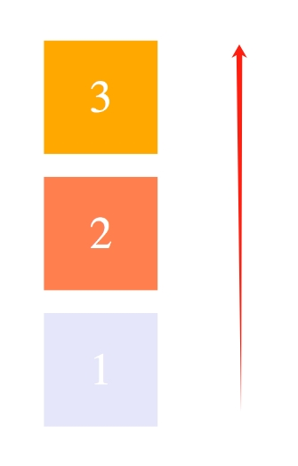

### flex-wrap属性

flex-wrap属性用来决定flex容器内子元素是否换行（即当子元素的总宽度大于flex容器宽度的时候，子元素是否换行展示。）

flex-wrap属性有3种取值。

```css
.container {
    flex-wrap: nowrap | wrap | wrap-reverse;
}
/* 3种取值分别是不换行nowrap ，换行wrap ，反向换行wrap-reverse */
```

> flex-wrap: nowrap; //不换行

默认值：nowrap 不换行。即子元素的总宽度大于flex容器宽度的时候。子元素的宽度会随之调整(自动调整)而并不会挤到下一行。

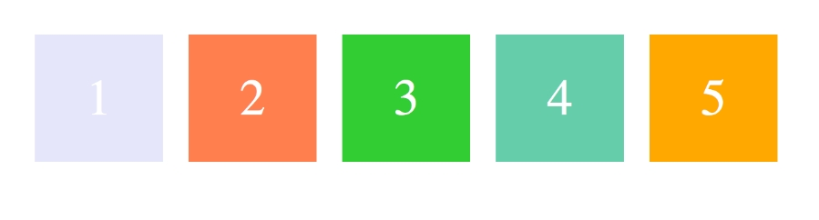

> flex-wrap: wrap; //换行

wrap,换行。当子元素的总宽度大于flex容器宽度的时候。子元素会自动换行。右边的子元素会优先排在第二行。

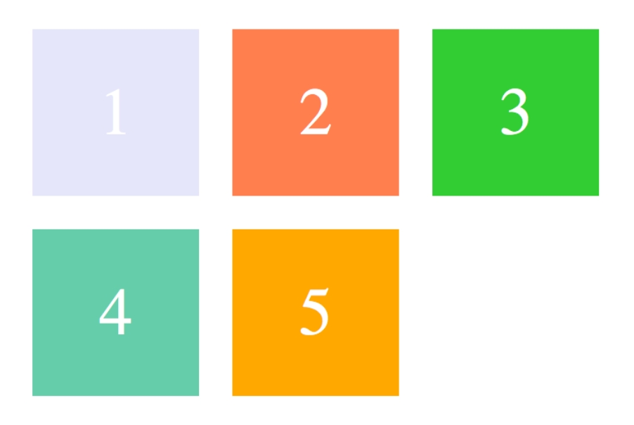

> flex-wrap: wrap-reverse; //反向换行

wrap,换行。当子元素的总宽度大于flex容器宽度的时候。子元素会自动换行。左边的子元素会优先排在第二行。

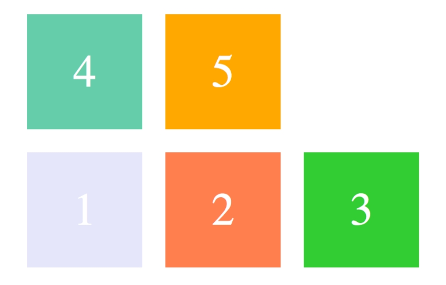

### flex-flow属性

flex-flow属性是flex-direction 和 flex-wrap 两个属性合在一起的简写形式。

```css
.container {
    flex-flow: <flex-direction> || <flex-wrap>;
}
```

### justify-content属性

justify-content属性是用来决定flex容器内的子元素的对齐方式。

justify-content属性有5种取值。

```css
.container {
    justify-content: flex-start | flex-end | center | space-between | space-around;
}
```

如果felx容器还设置了`flex-direction: row;`。即子元素的排列方式是水平排列。下面例子是在此基础上的效果。

> justify-content:flex-start; //子元素左对齐

flex-start是默认值。即子元素是左对齐。

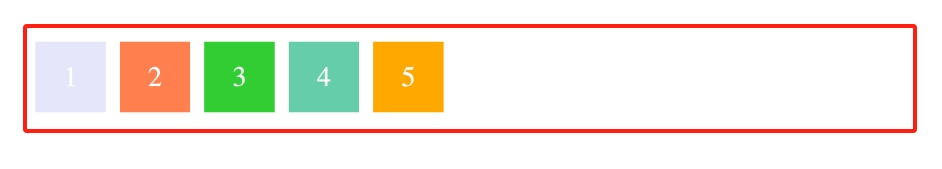

> justify-content:flex-end; //子元素右对齐

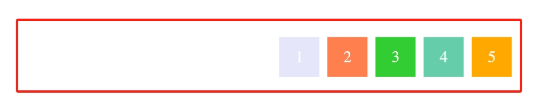

> justify-content:center; //子元素居中对齐

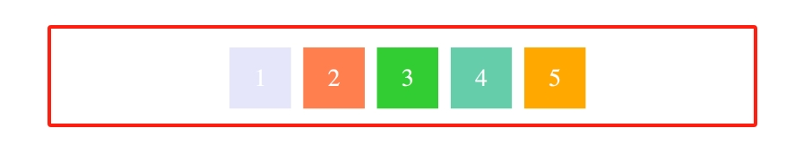

> justify-content:space-between; //子元素两端对齐

两端对齐是指子元素之间的间隔相等。

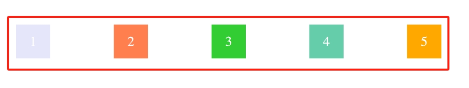

> justify-content:space-around; //子元素间隔对齐

每个子元素两侧的间隔相等，所以子元素之间的间隔比子元素与边缘的间隔大一倍。

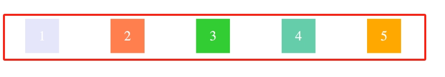


### align-items属性

align-items属性用来定义子元素在交叉轴上的对齐方式。

align-items属性有5种取值。

```css
.container {
    align-items: flex-start | flex-end | center | baseline | stretch;
}
```

如果felx容器还设置了`flex-direction: row;`。即子元素的排列方式是水平排列。下面例子是在此基础上的效果。

> align-items: stretch; //占满交叉轴的高度

注意此处的flex容器的交叉轴是垂直方向。

默认值为 stretch。即如果子元素未设置高度或者设为 auto，将占满整个flex容器的交叉轴的高度。

假设flex容器高度设置为 100px，而子元素都没有设置高度的情况下，则子元素的高度也为 100px。

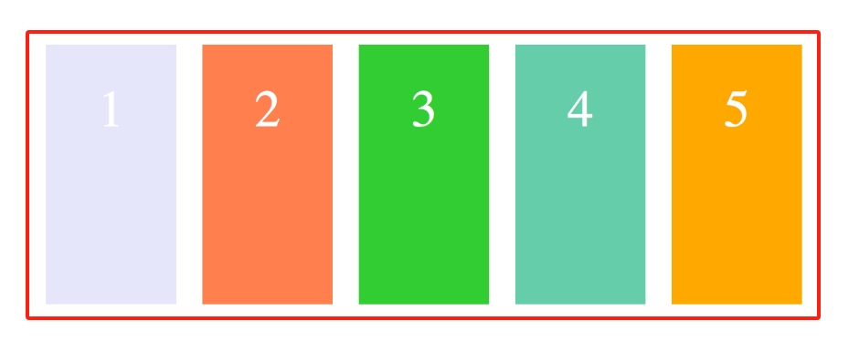

> align-items: flex-start;  //交叉轴的起点对齐

flex-start会让子元素从交叉轴的起点开始对齐。由于此处的交叉轴是垂直方向。因此就是让子元素从上向下对齐。

假设flex容器高度设置为 100px，而子元素的高度分别为 20px, 40px, 60px, 80px, 100px, 则如图显示。

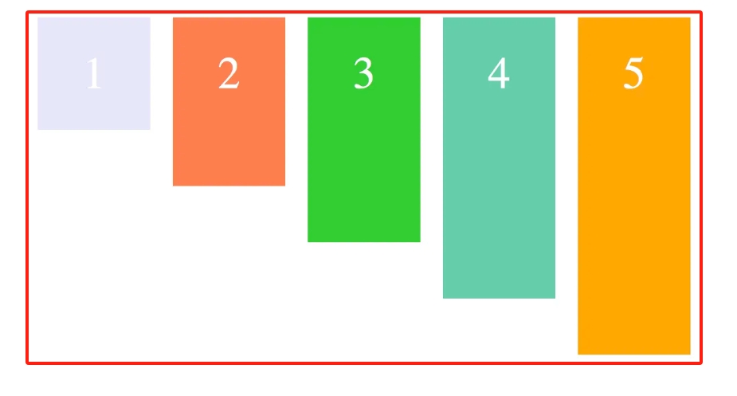

> align-items: flex-end; //交叉轴的终点对齐

flex-start会让子元素从交叉轴的终点开始对齐。由于此处的交叉轴是垂直方向。因此就是让子元素从下向上对齐。

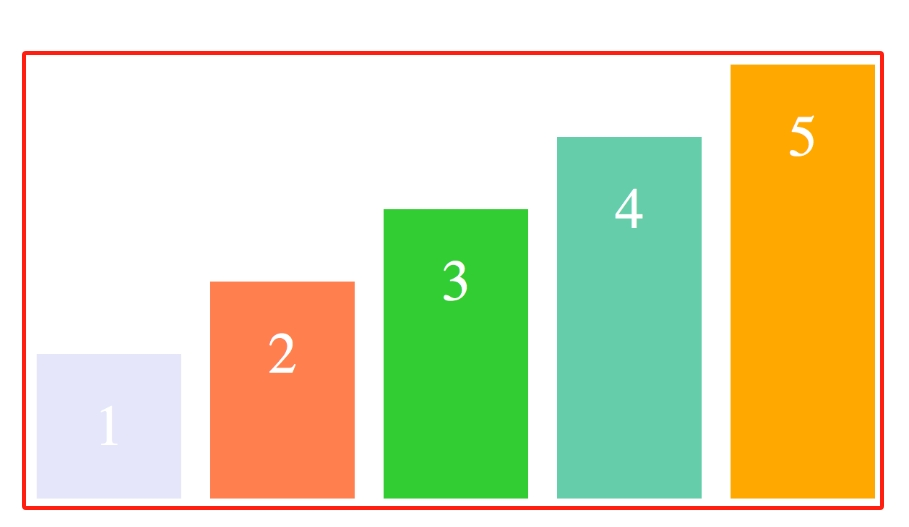

> align-items: center; //交叉轴的中点对齐

flex-start会让子元素从交叉轴的中点开始对齐。由于此处的交叉轴是垂直方向。因此就是让子元素中间对齐。

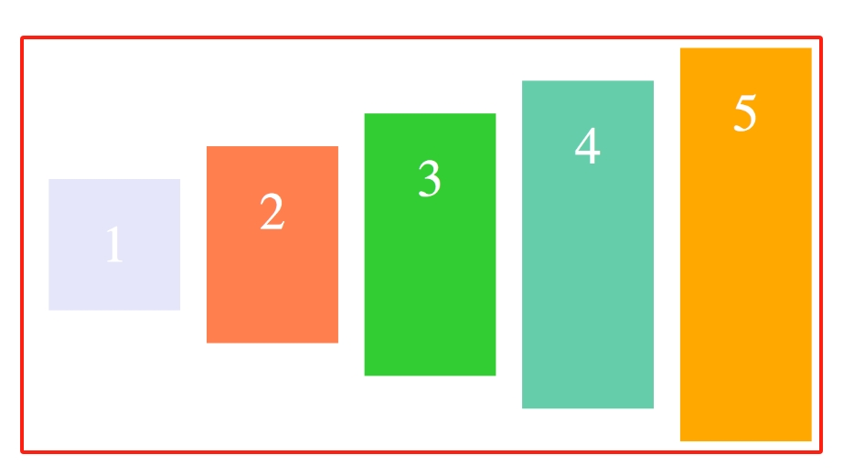

> align-items: baseline; //以子元素的第一行文字的基线对齐

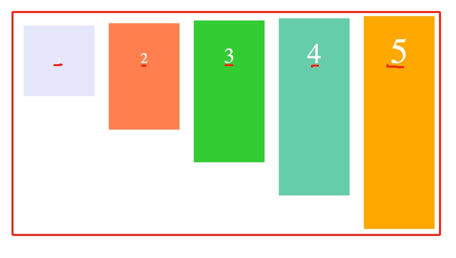

### align-content属性

align-content属性用来定义了多根轴线的对齐方式。如果子元素只有一根轴线，那么该属性将不起作用。

align-content属性有6种取值。

```css
.container {
    align-content: flex-start | flex-end | center | space-between | space-around | stretch;
}
```

什么是多根轴线？

当flex-wrap 设置为 nowrap 的时候，flex容器仅存在一根轴线，因为子元素不会换行，就不会产生多条轴线。

当flex-wrap 设置为 wrap 的时候，子元素会换行。此时flex容器可能会出现多条轴线，这时候你就需要去设置多条轴线之间的对齐方式了。

> align-content: stretch; //占满交叉轴的高度

stretch为默认值。参考`align-items: stretch;`

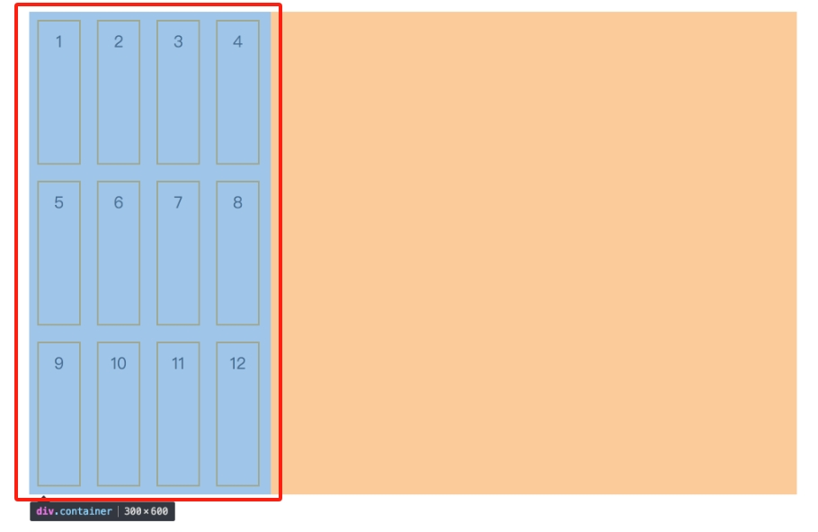

> align-content: flex-start; //轴线全部在交叉轴上的起点对齐(左上角)

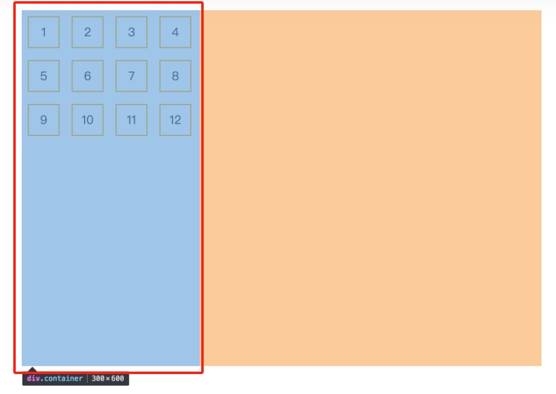

> align-content: flex-end; //轴线全部在交叉轴上的终点对齐(右下角)

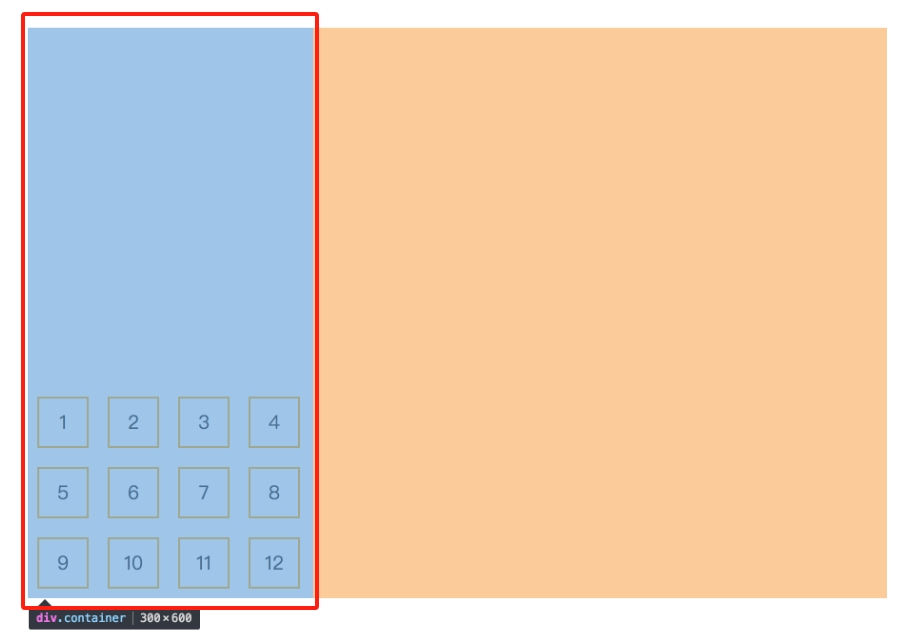

> align-content: center; //轴线全部在交叉轴上的中间对齐

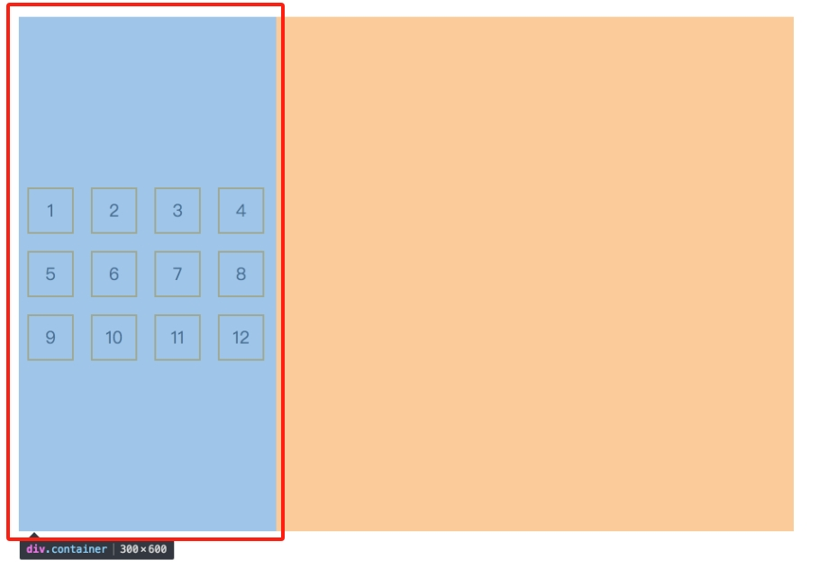

> align-content: space-between; //轴线两端对齐，之间的间隔相等

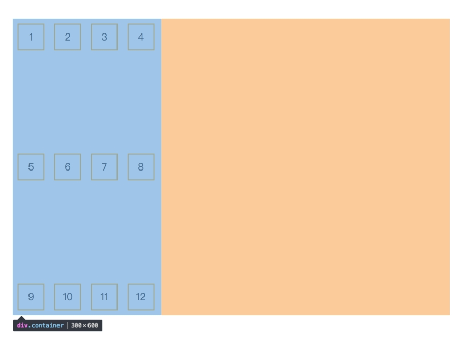

> align-content: space-around; //每个轴线两侧的间隔相等

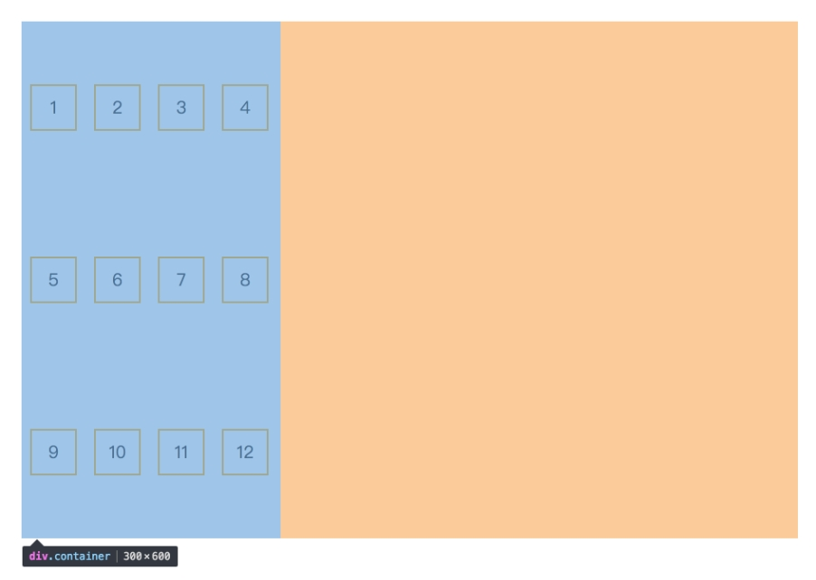

## Flex子元素

当设置好一个flex容器之后，容器的直接子元素就是flex子元素。

```html
<div class="container">
    <div class="item1">1</div>
    <div class="item2">2</div>
    <div class="item3">3</div>
</div>
```

```css
.container {
    //display有两种取值
    display: flex;       
}
```

上面代码中3个子div就是flex子元素。有六种属性可用设置在flex子元素上。
1. order属性
2. flex-basis属性
3. flex-grow属性
4. flex-shrink属性
5. flex属性
6. align-self属性

### order属性

order属性用来定义子元素在flex容器中的排列顺序。数值越小，排列越靠前，默认值为 0。

```css
/* order属性语法如下 */
.item {
    order: <integer>;
}
```

如图所示，有5个子元素。每个子元素的order属性不一样。则它们的排序顺序不同。
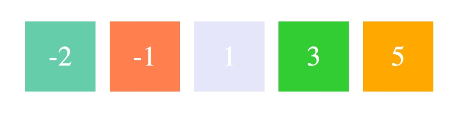


### flex-basis属性

flex-basis属性定义了在分配多余空间之前，子元素占据的主轴空间，浏览器根据这个属性，计算主轴是否有多余空间。

注意：flex-basis属性需要跟 flex-grow属性 和 flex-shrink属性 配合使用才行。

```css
/* flex-basis属性语法如下 */
.item {
    flex-basis: <length> | auto;
}
```

默认值：auto，即子元素本来的大小, 这时候子元素的宽高取决于 width 或 height 的值。

当主轴为水平方向的时候，如果设置了 flex-basis，子元素的宽度设置值会失效，flex-basis 需要跟 flex-grow 和 flex-shrink 配合使用才能发挥效果。
- 当 flex-basis 值为 0 % 时，即把子元素视为零尺寸的，故即使声明子元素的尺寸为 140px，也并没有什么用。
- 当 flex-basis 值为 auto 时，则跟根据尺寸的设定值(假如为 100px)，则这 100px 不会纳入剩余空间。

### flex-grow属性

flex-grow属性用来定义子元素的放大比例。

```css
/* flex-grow属性语法如下 */
.item {
    flex-grow: <number>;
}
```

默认值为 0，即如果存在剩余空间，也不放大(依照flex-basis属性)

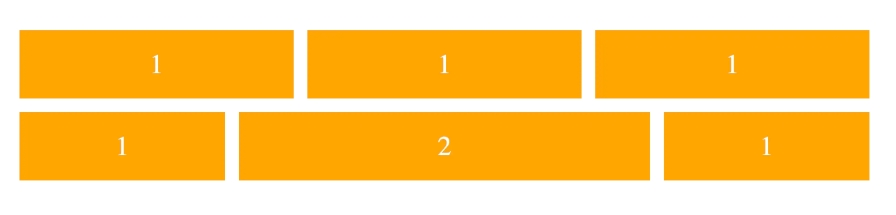

如上图所示，当所有的子元素都以 flex-basis 的值进行排列后，仍有剩余空间，那么这时候 flex-grow 就会发挥作用了。
- 如果所有子元素的 flex-grow 属性都为 1，则它们将等分剩余空间。
- 如果一个子元素的 flex-grow 属性为 2，其他子元素都为 1，则前者占据的剩余空间将比其他项多一倍。
- 当然如果当所有子元素以 flex-basis 的值排列完后发现空间不够了，且 `flex-wrap：nowrap;` 时，此时 flex-grow 则不起作用了。


### flex-shrink属性

flex-shrink属性定义了子元素的缩小比例。

```css
/* flex-shrink属性语法如下 */
.item {
    flex-shrink: <number>;
}
```

默认值: 1，即如果空间不足，该子元素将缩小，负值对该属性无效。

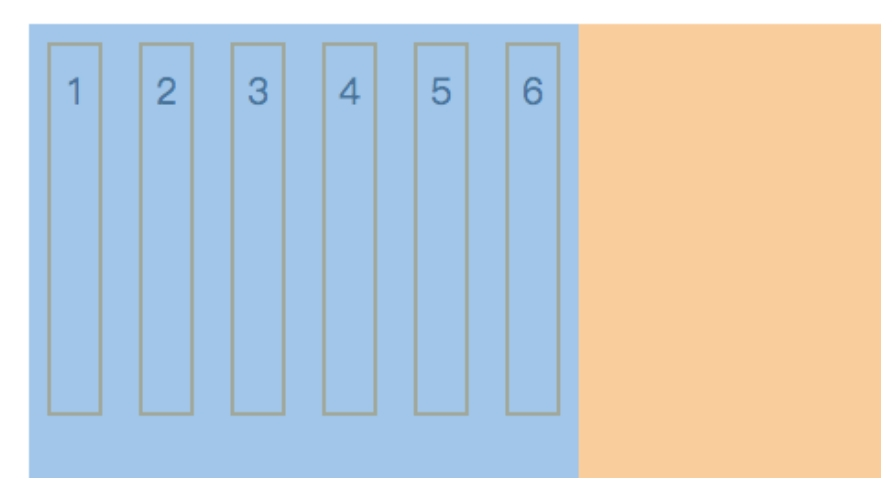

如上图所示，每个子元素会被同比例进行缩小，因为默认值为 1。
- 如果所有子元素的 flex-shrink 属性都为 1，当空间不足时，都将等比例缩小。
- 如果一个子元素的 flex-shrink 属性为 0，其他子元素都为 1，则空间不足时，前者不缩小。

### flex属性

flex属性是flex-grow属性, flex-shrink属性 和 flex-basis属性合并在一起的简写形式。

推荐使用flex属性，而不是单独写三个分离的属性。因为flex-grow属性, flex-shrink属性是一对。

```css
.item{
    /* flex属性语法如下 */
    flex: none | [ <'flex-grow'> <'flex-shrink'>? || <'flex-basis'> ]
} 
```

flex 的默认值是以上三个属性值的组合。假设以上三个属性同样取默认值，则flex属性是`flex:0 1 auto;`。

例如下面几个例子。每一个例子有多种写法。
```css
/* 当 flex 取值为一个非负数字，则该数字为 flex-grow 值，flex-shrink 取 1，flex-basis 取 0% */
.item {flex: 1;}
.item {
    flex-grow: 1;
    flex-shrink: 1;
    flex-basis: 0%;
}

/* 当 flex 取值为 0 时，对应的三个值分别为 0 1 0% */
.item {flex: 0;}
.item {
    flex-grow: 0;
    flex-shrink: 1;
    flex-basis: 0%;
}

/* 当 flex 取值为一个长度或百分比，则视为 flex-basis 值，flex-grow 取 1，flex-shrink 取 1。 */
.item-1 {flex: 0%;}
.item-1 {
    flex-grow: 1;
    flex-shrink: 1;
    flex-basis: 0%;
}
​
.item-2 {flex: 24px;}
.item-2 {
    flex-grow: 1;
    flex-shrink: 1;
    flex-basis: 24px;
}

/* 当 flex 取值为两个非负数字，则分别视为 flex-grow 和 flex-shrink 的值，flex-basis 取 0% */
.item {flex: 2 3;}
.item {
    flex-grow: 2;
    flex-shrink: 3;
    flex-basis: 0%;
}

/* 当 flex 取值为一个非负数字和一个长度或百分比，则分别视为 flex-grow 和 flex-basis 的值，flex-shrink 取 1 */
.item {flex: 11 32px;}
.item {
    flex-grow: 11;
    flex-shrink: 1;
    flex-basis: 32px;
}

```

