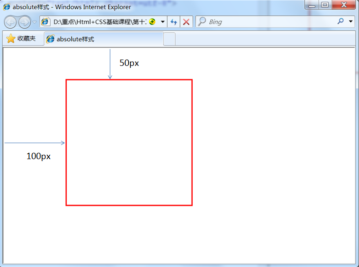

# HTML-CSS基础

1. <font color="red">HTML是网页内容的载体</font>。内容就是网页制作者放在页面上想要让用户浏览的信息，可以包含文字、图片、视频等。
2. <font color="red">CSS样式是表现</font>。就像网页的外衣。比如，标题字体、颜色变化，或为标题加入背景图片、边框等。所有这些用来改变内容外观的东西称之为表现。
3. <font color="red">JavaScript是用来实现网页上的特效效果</font>。如：鼠标滑过弹出下拉菜单。或鼠标滑过表格的背景颜色改变。还有焦点新闻（新闻图片）的轮换。可以这么理解，有动画的，有交互的一般都是用JavaScript来实现的。

## HTML常用标签（注意：标签与元素是一个概念）:

<font color="red">在 html 中是忽略多个空格的，你输入再多的空格也只是显示一个空格。</font>

1. 标签由英文尖括号`< >`括起来，如`<html>`就是一个标签。
2. html中的<font color="red">标签一般都是成对出现的，分开始标签和结束标签。结束标签比开始标签多了一个/。</font>
如：	  
```html
（1） <p></p>
（2） <div></div>
（3） <span></span>
``` 	
3. 标签与标签之间是可以嵌套的，但先后顺序必须保持一致。

4. HTML标签不区分大小写，`<h1>`和`<H1>`是一样的，但建议小写，因为大部分程序员都以小写为准。

### 1.`<html>`标签:
`<html></html>`称为**根标签**，所有其他的网页标签都在`<html></html>`中。

### 2.`<head>`标签:
`<head>`标签用于定义**文档的头部**，它是所有头部元素的容器。头部元素有`<title>、<script>、 <style>、<link>、<meta>`等标签，

### 3.`<body>`标签：
在`<body>`和`</body>`标签之间的内容是**网页的主要内容**，如`<h1>、<p>、<a>、`等网页内容标签，在这里的标签中的内容会在浏览器中显示出来。

一个网页的大致结构：
```html
<html>
    <head>...</head>
    <body>...</body>
</html>
```

### 4.`<title>`标签:
在`<title>`和`</title>`标签之间的文字内容是**网页的标题信息，它会出现在浏览器的标题栏中**。每个网页都应该有一个独一无二的title。

### 5.代码注释:
语法：
`<!-- 注释文字 -->`

### 6.`<p>`段落标签:
语法：
`<p>`段落文本`</p>`

 注意一段文字一个`<p>`标签，如在一篇新闻文章中有3段文字，就要把这3个段落分别放到3个`<p>`标签中。这样使每一段之间会有一行空白，就像换行符‘\n’ 一样。

### 7.文章等级标题标签`<h1>~<h6>`：
语法：
`<hx>`标题文本`</hx>` (x为1-6)

标题标签一共有6个，h1、h2、h3、h4、h5、h6分别为一级标题、二级标题、三级标题、四级标题、五级标题、六级标题。并且依据重要性递减。`<h1>`是最高的等级。

```html
<body>
<h1>一级标题</h1>
<h2>二级标题</h2>
<h3>三级标题</h3>
<h4>四级标题</h4>
<h5>五级标题</h5>
<h6>六级标题</h6>
</body>
```

### 8.强调标签（`<em>`或`<strong>`标签）
语法：
`<em>`需要强调的文本`</em>`  
`<strong>`需要强调的文本`</strong> `

`<em>` 表示强调，`<strong>`表示更强烈的强调。并且在浏览器中`<em>`默认用斜体表示，`<strong>`用粗体表示。

### 9.短文本引用 `<q>`标签
当你想引用其他人的名言，名句（注意：是短文本）时,使用它。

语法：
`<q>`引用文本`</q>`  

当使用时，注意要引用的文本不用加双引号，浏览器会对q标签自动添加双引号=

### 10.长文本引用标签 `<blockquote>`:
语法:
`<blockquote>`引用文本`</blockquote>`
浏览器对`<blockquote>`标签的解析是缩进样式。

### 11.把文字设置成单独样式的标签 `<span>`:
语法：
`<span>`文本`</span>`

`<span>`标签是没有语义的，它的作用就是为了设置单独的样式用的。（例如将文字设置成蓝色）    
```html
<span style="color:blue">文本</span>
```
 
### 12.换行标签 `<br/>`
在你想要换行的文本后面，在需要加回车换行的地方加入`<br/>`，`<br/>`标签作用相当于word文档中的回车.

`<br/>`标签是一个**空标签，没有HTML内容的标签就是空标签，空标签只需要写一个开始标签**，这样的标签有`<br/>`、`<hr/>`和``。

### 13.空格标记`&nbsp;`：
语法：
`&nbsp;`
在html代码中按空格键是不起作用的。

### 14.添加水平横线`<hr/>`：
语法：
`<hr/>`

注意：
1. `<hr />`标签和`<br />`标签一样也是一个空标签，所以只有一个开始标签，没有结束标签。
2. `<hr />`标签的在浏览器中的默认样式线条比较粗，颜色为灰色，可能有些人觉得这种样式不美观，没有关系，这些外在样式在我们以后学习了css样式表之后，都可以对其修改。

### 15.`<address>`标签，为网页加入地址信息:
语法：
`<address>`联系地址信息文本`</address>`   （ 在浏览器上显示的样式为斜体）

### 16.代码标签`<code>`(在网页上显示程序代码):
语法：
`<code>`代码语言`</code>`
注：如果是多行代码，可以使用`<pre>`标签。当为一行代码时可用它。

### 17.多行代码`<pre>`标签:
语法：
`<pre>`语言代码段`</pre>`

### 18.无序列表标签`<ul><li>`
语法：
```html
<ul>
    <li>信息1</li>
	<li>信息2</li>
	......
</ul>
```

### 19.有序列表标签`<ol><li>`:
语法：
```html
<ol>
   <li>信息</li>
   <li>信息</li>
   ......
</ol>
```

### 20.独立板块标签`<div>`:
语法：
`<div  id="版块名称">…</div>`
（用id属性来为`<div>`提供唯一的名称）

### 21.`<table>`标签:
创建表格的四个标签（元素）：
table,tr,th,td

1. `<table>…</table>`：整个表格以`<table>`标记开始、`</table>`标记结束。
2. `<tr>…</tr>`：表格的一行，所以有几对tr 表格就有几行。（在这个标签里用`<tr>`  , `<td>`标签）
3. `<td>…</td>`：表格的一个单元格，一行中包含几对`<td>...</td>`，说明一行中就有几列。（除第一行之外的几行，用它）
4. `<th>…</th>`：表格的头部的一个单元格，表格表头。(第一行时 ，用`<th>`标签代替`<tr>`标签)
5. 表格中列的个数，取决于一行中数据单元格的个数。

### 22.超链接标签`<a>`:
语法：
```html
<a  href="目标网址"  title="鼠标滑过该链接时显示的文本">文本</a>

<!--若你不知道链接到哪里，可以使用固定链接 #：-->
<a  href="#">文本</a>
```

例如：
`<a  href="http://www.imooc.com"  title="点击进入慕课网">click here!</a>`
<a  href="http://www.imooc.com"  title="点击进入慕课网">click here!</a>

该例子作用是：
划过该链接的文本，显示点击进入慕课网的文字，单击click here!文字，网页链接到http://www.imooc.com这个网页。

ps:
`<a>`标签<font color="red">在默认情况下，链接的网页是在当前浏览器窗口中打开</font>，有时我们需要在新的浏览器窗口中打开。

如下代码`<a href="目标网址" target="_blank">click here!</a>`

**target="_blank" :表示在新窗口打开该网页。**

### 23.图片标签``:
语法：
``

注意：
1. src：标识图像的位置；
2. alt：指定图像的描述性文本，当图像不可见时（下载不成功时），可看到该属性指定的文本；
3. title：提供在图像可见时对图像的描述(鼠标滑过图片时显示的文本)；
4. 图像可以是GIF，PNG，JPEG格式的图像文件。

举例：
``


### 24.表单标签`<form>`（与用户进行交互）:
**表单标签是可以把浏览者输入的数据传送到服务器端**，这样服务器端程序就可以处理表单传过来的数据。

语法：
```html
<form method="post" action="save.jsp">      // 表单标签，与用户进行交互
    <label for="username">用户名:</label>
    <input type="text" name="username" />   //文本输入框
    <label for="pass">密码:</label>
    <input type="password" name="pass" />
    <input type="submit" value="提交">     //提交按钮

    <input type="text" required>         //设置该文本为必填项。
</form>
```

<font color="red">

注意：
1. action ：action属性的值指定了表单提交到服务器的地址。
2. method ： 数据传送的方式（get/post）。
3. 所有表单控件（文本框`<input>`、文本域、按钮、单选框、复选框等）都必须放在 `<form></form>` 标签之间（否则用户输入的信息可提交不到服务器上）。
4. submit(提交)按钮，点击这个按钮，表单中的数据将会被发送到你通过action属性指定的地址上。
5. 必填项 required 属性，只有当用户填写了该选项后，用户才能够提交表单。

</font>

注意：required属性在Safari浏览器中不起作用，请用其他浏览器来学习，推荐使用Chrome。


### 25.文本输入框,与密码输入框`<input>`:
语法：
```html
<form>
    <input type="text或password" name="名称" value="文本"/>
</form>
<!--占位符(placeholder text)是用户在input(输入)框输入任何东西之前放置在input(输入)框中的预定义文本。-->
<input type="text" placeholder="this is placeholder text"/>
```

<font color="red">

1. type：
   当 type="text" 时，输入框为文本输入框;
   当 type="password" 时, 输入框为密码输入框。
2. name：为文本框命名。
3. value：为文本输入框设置默认值。(一般起到提示作用)
4. placeholder : 该属性，用于提示用户向输入框中输入什么东西。

</font>


### 26.文本输入域`<textarea>`:
当用户需要在表单中输入大段文字时，需要用到文本输入域。
语法：
`<textarea  rows="行数" cols="列数">文本</textarea>`

1. cols ：多行输入域的列数。
2. rows ：多行输入域的行数。
3. 在`<textarea></textarea>`标签之间可以在文本域中输入默认值

### 27.单选框，多选框:
语法：
`<input   type="radio或checkbox"   value="值"    name="名称"   checked="checked"/>`

<font color="red">

1. type:
   当 type="radio" 时，控件为单选框
   当 type="checkbox" 时，控件为复选框
2. value：提交数据到服务器的值（jsp使用）
3. name：为控件命名.
4. checked：当设置 checked="checked" 时，该选项被默认选中   
注意：所有关联的单选按钮应该使用相同的name属性。

</font>


### 28.下拉列表框`<select><option>`:
语法：
```html
    <select>  //下拉列表框，只能单选
      <option value="看书">看书</option>      //选项
      <option value="旅游" >旅游</option>
      <option value="运动">运动</option>
      <option value="购物"  selected="selected">购物</option>   //默认选项（因为有selected 修饰）
    </select>  
```

<font color="red">

1. value="看书" : 该值是向服务器提交的数据。
2. selected="selected"   ：表示该选项是默认选项。

</font>


PS:下拉列表框的多选操作：
在`<select>`标签中设置 **multiple="multiple"** 属性，就可以实现多选功能，在 windows 操作系统下，进行多选时按下Ctrl键同时进行单击（在 Mac下使用 Command +单击），可以选择多个选项。

```HTML
<select multiple="multiple">     //下拉列表框，多选操作
     ...................
      <option value="运动">运动</option>   //选项
      <option value="购物">购物</option>
  </select>
```


### 29.提交按钮与重置按钮:
在表单中有两种按钮可以使用，分别为：提交按钮、重置按钮。
语法：
`<input   type="submit"   value="提交">`
`<input type="reset" value="重置">`

1. type：只有当type值设置为submit时，按钮才有提交作用,只有当type值设置为reset时，按钮才有重置作用
2. value：按钮上显示的文字

示例：
```html
<input type="submit" value="提交" name="submitBtn" />
<input type="reset" value="重置"   />    
```
<input type="submit" value="提交" name="submitBtn" />
<input type="reset" value="重置"  />    

### 30.`label`标签:
<font color="red">label标签不会向用户呈现任何特殊效果</font>，它的作用是为鼠标用户改进了可用性。如果你在 label 标签内点击文本，就会触发此控件。就是说，**当用户单击选中该label标签时，浏览器就会自动将焦点转到和标签相关的表单控件上**（就自动选中和该label标签相关连的表单控件上）。

语法：
`<label for="控件id名称">`
注意：标签的 for 属性中的值应当与相关控件的 id 属性值一定要相同。

例子：
```html
<form>  
  <label for="male">男</label>    //该label标签与文本输入框进行关联
  <input type="radio" name="gender" id="male" />      
  <label for="email">输入你的邮箱地址</label>          
  <input type="email" id="email" placeholder="Enter email">     
</form>
```

<font color="red">注意：不加label的话鼠标一定要点击文本输入框才能输入文字,加了label可以直接点击对应的文字来激活文本输入框。</font>


## HTML_DEMO:

```HTML
<!doctype html>
<html class="no-js" lang="">
    <head>
        <meta charset="utf-8">
        <title>HTML-demo</title>
    </head>
    <body>
        <!--1.代码注释-->
        <!-- 这是一段代码注释-->
        <!--2.段落标签：<p>-->
        <p>超级文本标记语言是标准通用标记语言下的一个应用，也是一种规范，一种标准。</p>
        <p>它通过标记符号来标记要显示的网页中的各个部分。</p>
        <!--3.文章等级标题标签<h1>~<h6>-->
        <h1>一级标题</h1>
        <h2>二级标题</h2>
        <h3>三级标题</h3>
        <h4>四级标题</h4>
        <h5>五级标题</h5>
        <h6>六级标题</h6>
        <!--4.强调标签（<em>或<strong>标签）-->
        <em>这是em强调标签</em>
        <strong>这是strong强调标签</strong>
        <!--5.短文本引用 <q>标签-->
        <q>这是短文本引用标签</q>
        <!--6.长文本引用标签 <blockquote>-->
        <blockquote>长文本引用标签文本</blockquote>
        <!--7.<span>标签-->
        <span style="color:#ff241f">文本</span>
        <!--8.换行标签<br/>-->
        <br/>1<br/>2
        <!--9.空格标记&nbsp;-->
        &nbsp;1&nbsp;2&nbsp;3&nbsp;
        <!--10.添加水平横线<hr/>-->
        1<hr/>2<hr/>
        <!--11.<address>标签，为网页加入地址信息-->
        <address>联系地址信息文本</address>
        <!--12.单行代码标签<code>-->
        <code>int a=0;</code>
        <!--13.多行代码标签<pre>-->
        <pre>
            for(int i=0;i<10;i++){
                i=i+1;
            }
        </pre>
        <!--14.无序列表标签<ul><li>-->
        <ul>
            <li>信息1</li>
            <li>信息2</li>
            <li>信息3</li>
        </ul>
        <!--15.有序列表标签<ol><li>-->
        <ol>
            <li>信息1</li>
            <li>信息2</li>
            <li>信息3</li>
        </ol>
        <!--16.独立板块标签<div>-->
        <div  id="div1">版块1</div>
        <!--17.超链接标签<a>-->
        <a  href="http://www.imooc.com"  title="点击进入慕课网">click here!</a>
        <!--18.图片标签-->
        
        <!--19.<table>标签-->
        <table>
            <tr>
                <th>序号</th>
                <th>姓名</th>
                <th>年龄</th>
            </tr>
            <tr>
                <td>1</td>
                <td>小梦</td>
                <td>12</td>
            </tr>
            <tr>
                <td>2</td>
                <td>小名</td>
                <td>11</td>
            </tr>
            <tr>
                <td>3</td>
                <td>小化</td>
                <td>2</td>
            </tr>
        </table>
        <!--20.表单标签<form>,以及表单控件-->
        <form method="post" action="save.jsp">
            <label for="username">文本输入框:</label>
            <input type="text" name="username" id="username" />
            <label for="pass">密码框:</label>
            <input type="password" name="pass" id="pass" />
            <label for="textarea">文本输入域:</label>
            <textarea  rows="10" cols="10" id="textarea">请输入文本内容：</textarea>
            <label>单选框（性别）:</label>
            男<input type="radio" value="男"  name="gender"/>
            女<input type="radio" value="女"  name="gender"/>
            <label>多选框（爱好）:</label>
            游泳<input type="checkbox" value="游泳" name="siwm"/>
            吃<input type="checkbox" value="吃" name="eat"/>
            睡<input type="checkbox" value="睡" name="sleep"/>
            <label>下拉列表框（爱好）:</label>
            <select>
                <option value="看书">看书</option>
                <option value="旅游" >旅游</option>
                <option value="运动">运动</option>
                <option value="购物"  selected="selected">购物</option>
            </select>
            <label>提交按钮:</label>
            <input type="submit" value="提交" name="submitBtn" />
            <label>重置按钮:</label>
            <input type="reset" value="重置"/>
        </form>
    </body>
</html>
```

## CSS:

CSS全称为“==层叠样式表 (Cascading Style Sheets)==”，它主要是用于<font color="red">定义HTML内容在浏览器内的显示样式，如文字大小、颜色、字体加粗等</font>。（设置网页的外观样式）

如下列代码：
```css
p{                        //p是指p标签
   font-size:12px;        //修改字体大小
   color:red;              //修改字体颜色
   font-weight:bold;        //字体加粗
}
```
使用CSS样式的一个好处是通过定义某个样式，可以让不同网页位置的文字有着统一的字体、字号或者颜色等

### 1.CSS代码语法:
==css 样式由选择符和声明组成，而声明又由属性和值组成==，如下图所示


1. 选择符：又称选择器，指明网页中要应用样式规则的元素，如本例中是网页中所有的段（p）的文字将变成蓝色，而其他的元素（如a,span其他标签）不会受到影响。
2. 声明：在英文大括号“｛｝”中的的就是声明，属性和值之间用英文冒号“：”分隔。<font color="red">当有多条声明时，中间可以英文分号“;”分隔</font>，如下所示：
`p{font-size:12px;color:red;}`

3. 注意：
   1. 最后一条声明可以没有分号，但是为了以后修改方便，一般也加上分号。
   2. 为了使用样式更加容易阅读，可以将每条代码写在一个新行内，如下所示：

```html
p{                          //所有用<p></p>标签包含的文字，字体变成12，颜色为红色；
   font-size:12px;
   color:red;
}
```

### 2.css注释：
CSS中也有注释语句：用`/*注释语句*/`来标明（Html中使用`<!--注释语句-->`)。


### 3.css代码在html中3种嵌入方式：
从CSS 样式代码插入的形式来看基本可以分为以下3种：**内联式、嵌入式和外部式**三种。


#### 1.内联式：

<font color="red">内联式css样式表就是把css代码直接写在现有的HTML标签中.</font>
如下面代码：
`<p style="color:red">这里文字是红色。</p>`

注意:
1. 要写在元素的开始标签里.
2. css样式代码要写在style=""双引号中，如果有多条css样式代码设置可以写在一起，中间用分号隔开。
如下代码：
`<p style="color:red;font-size:12px">这里文字是红色。</p>`


#### 2.嵌入式：

<font color="red">嵌入式css样式，就是可以把css样式代码写在`<style type="text/css"></style>`标签之间。</font>

如下面代码实现把三个`<span>`标签中的文字设置为红色：
```html
<style type="text/css">
span{
color:red;
}
</style>
```
嵌入式css样式必须写在<style></style>之间，并且一般情况下嵌入式css样式的位置在`<head></head>`之间。


#### 3.外联式：
外部式css样式(也可称为外联式)就是把css代码写一个单独的后缀为css的外部文件中，这个css样式文件以“.css”为扩展名，在`<head>`内（不是在`<style>`标签内）使用`<link>`标签将css样式文件链接到HTML文件内，

如下面代码：
`<link href="base.css" rel="stylesheet" type="text/css" />`

注意：
1. css样式文件名称以有意义的英文字母命名，如 main.css。
2. rel="stylesheet" type="text/css" 是固定写法不可修改。
3. `<link>`标签位置一般写在`<head>`标签之内。

#### 4.补充：
css代码的三种插入方式具有不同的优先级：
     内联式 > 嵌入式 > 外部式

但是嵌入式>外部式有一个前提：嵌入式css样式的位置一定在外部式的后面。如右代码编辑器就是这样，`<link href="style.css" ...>`代码在`<style type="text/css">...</style>`代码的前面（实际开发中也是这么写的）。

其实总结来说，就是——就近原则（离被设置元素越近优先级别越高）


### 4.选择器：

选择器{ 样式; }

在{}之前的部分就是“选择器”，“选择器”指明了{}中的“样式”的作用对象，也就是“样式”作用于网页中的哪些元素。

示例：
```css
 body{               //body是选择器;
    font-size:12px;
    color:red;	
 }
```

#### 1.标签选择器：

标签选择器其实就是html代码中的标签。如`<html>`、`<body>`、`<h1>`。
例如下面代码：
`p{font-size:12px;line-height:1.6em;}`   
上面的css样式代码的作用：为p标签设置12px字号，行间距设置1.6em的样式。


#### 2.类选择器：
类选择器在css样式编码中是最常用到的。
<font color="red">提示：你可以应用多个class到一个元素，只需要在多个class之间用空格分开即可。</font>
语法：
`.类选器名称{css样式代码;} `        

注意：
1. 英文圆点开头
2. 其中类选器名称可以任意起名（但不要起中文噢）

使用方法：
1. 使用合适的标签把要修饰的内容标记起来，如下：
   `<span>胆小如鼠</span>`

2. 使用`class="类选择器名称"`为标签设置一个类，如下：
  `<span class="stress">胆小如鼠</span>`

3. 设置类选器css样式，如下：
`.stress{color:red;}      /*类前面要加入一个英文圆点*/`


#### 3.id选择器
ID选择器都类似于类选择符，但也有一些重要的区别：

1. 为标签设置`id="ID名称"`。
2. ID选择符的前面是井号（#）号，而不是英文圆点（.）。
3. id选择器唯一。
```css
#stress{                                            
    color:red;                                           
}
```
```html
<span id="stress">胆小如鼠</span>                      
```


#### 4.子选择器:
<font color="red">子选择器，即大于符号(>),用于选择指定标签元素的第一代子元素。</font>

```css
 .food>li{border:1px solid red;}   
```
这行代码会使`class="food"`下的子元素`li`加入红色实线边框

#### 5.后代选择器：
后代选择器，即加入空格,用于选择指定标签元素下的后辈元素。
如右侧代码编辑器中的代码：
```css
.food  span{color:red;}       
```
使`class="food"`元素下的所有`<span></span>`标签中的字体颜色为红色
 

<h5>包含选择器与子选择器的区别:</h5>

子选择器仅是指它的第一个后代。而后代选择器是作用于所有子后代元素。后代选择器通过空格来进行选择，而子选择器是通过“>”进行选择。


#### 6.通用选择器*
它使用一个（*）号指定，它的作用是匹配html中所有标签元素。
如下使用下面代码使用html中任意标签元素字体颜色全部设置为红色：
```css
* {color:red;}                
```
<font color="red">功能是让所有标签包含的内容的字体颜色为红色</font>

#### 7.伪类选择器：   
它允许给html标签的某种状态设置样式。

比如说我们给html中一个a标签的鼠标滑过的状态来设置字体颜色：
`a:hover{color:red;}`

上面一行代码就是为 a 标签鼠标滑过的状态设置字体颜色变红。这样就会使第一段文字内容中的“胆小如鼠”文字加入鼠标滑过字体颜色变为红色特效。

#### 8.分组选择器：
为html中多个标签元素设置同一个样式时，可以使用分组选择符（，）。

如下代码为右侧代码编辑器中的h1、span标签同时设置字体颜色为红色：
`h1,span{color:red;}`
它相当于下面两行代码：
`h1{color:red;}`
`span{color:red;}`


### 5.权值
示例：
```css
  p{color:red;}            /* <p>标签中显示红色  */
  .first{color:green;}     /* 类选择符中显示绿色 */
```
```html
  <p class="first">三年级时，我还是一个<span>胆小如鼠</span>的小女孩。</p>
```

p和.first都匹配到了p这个标签上，那么会显示哪种颜色呢？<font color="red">green是正确的颜色</font>，那么为什么呢？是因为浏览器是根据权值来判断使用哪种css样式的，权值高的就使用哪种css样式。

下面是权值的规则：
<font color="red">标签的权值为1，类选择符的权值为10，ID选择符的权值最高为100</font>。

例如下面的代码：
```css
p{color:red;} /*权值为1*/
p span{color:green;} /*权值为1+1=2*/
.warning{color:white;} /*权值为10*/
p span.warning{color:purple;} /*权值为1+1+10=12*/
#footer .note p{color:yellow;} /*权值为100+10+1=111*/
#footer .note p{ color: pink !important;} /*!important 表示具有最高优先级*/
```

**!important ： 使css样式具有最高的优先级**


**ps:层叠性：**
<font color="blue">浏览器读取 CSS 的顺序是从上到下，这意味着，当有相同权值的样式存在时，浏览器会使用最后的 CSS 声明。</font>


如下面代码:
```css
p{color:red;}      
p{color:green;}      /*因为这两个<p>标签的权重值都相等，因此 采取就近原则：*/
<p>三年级时，我还是一个<span>胆小如鼠</span>的小女孩。</p>
```
这个层叠很好理解，理解为后面的样式会覆盖前面的样式。


### 6.文章排版：
css样式为网页中的文字设置字体、字号、颜色等样式属性


#### 0.背景颜色:
```css
 body{
  background-color: green;    //设置body标签的背景颜色为绿色。
}
```

#### 1.字体:
`body{font-family:"宋体";}`

#### 2.字号，颜色:
下面代码设置网页中文字的字号为12像素，并把字体颜色设置为#666(灰色)：
`body{font-size:12px;color:#666}`

#### 3.粗体:
`p,span{font-weight:bold;}`

#### 4.斜体:
```
p a{font-style:italic;}      //把<p>标签中的<a>标签设置为斜体
<p>三年级时，我还是一个<a>胆小如鼠</a>的小女孩。</p>
```

#### 5.下划线:
```
p a{text-decoration:underline;}      //p标签的a标签的字体加入下划线
<p>三年级时，我还是一个<a>胆小如鼠</a>的小女孩。</p>
```

#### 6.删除线:
```
.oldPrice{text-decoration:line-through;}     //为类选择符内的文本加上删除线
<p>原价：<span class="oldPrice">300</span>元 现价：230 元</p> 
```

#### 7.缩进:
`p{text-indent:2em;}  // 为p标签的文本段设置2个空格缩进` 

#### 8.行间距（行高）:
`p{line-height:1.5em;}  //实现设置段落行间距为1.5倍`

#### 9.文字间距:
`h1{ letter-spacing:50px;}  //是字符与字符的间距`
`h1{ word-spacing:50px;}  //英文字母单词之间的间距`

#### 10.居中样式:
```
h1{ text-align:center或left或right; } //居中,局左，局右 
<h1>了不起的盖茨比</h1>
```

### 7.元素分类：
在CSS中，html中的标签元素大体被分为三种不同的类型：块状元素、内联元素(又叫行内元素)和内联块状元素。

常用的块状元素有：
```html
<div>、<p>、<h1>..........<h6>、<ol>、<ul>、<dl>、<table>、<address>、<blockquote> 、<form>
```

常用的内联元素有：
```html
<a>、<span>、<br>、<i>、<em>、<strong>、<label>、<q>、<var>、<cite>、<code>
```

常用的内联块状元素有：
`、<input>,....`

#### 1.块级元素:
设置`display:block`就是将元素显示为块级元素。

**块级元素特点**：
1. 每个块级元素都从新的一行开始，并且其后的元素也另起一行。（一个块级元素独占一行）
2. 元素的高度、宽度、行高以及顶和底边距都可设置。
3. 元素宽度在不设置的情况下，是它本身父容器的100%（和父元素的宽度一致），除非设定一个宽度。


#### 2.内联元素:
<font color="red">通过代码`display:inline`将元素设置为内联元素</font>。

如下代码就是将块状元素div转换为内联元素，从而使 div 元素具有内联元素特点。
` div{ display:inline;}`

**内联元素特点：**
1. 和其他元素都在一行上；
2. 元素的高度、宽度及顶部和底部边距不可设置；
3. 元素的宽度就是它包含的文字或图片的宽度，不可改变。


#### 3.内联块状元素:
内联块状元素（inline-block）就是同时具备内联元素、块状元素的特点.
<font color="red">代码`display:inline-block`就是将元素设置为内联块状元素。</font>

**inline-block 元素特点：**
1. 和其他元素都在一行上；
2. 元素的高度、宽度、行高以及顶和底边距都可设置。


### 8.盒子模型:

#### 1.边框:
盒子模型的边框就是围绕着内容及补白的线，这条线你可以设置它的**粗细、样式和颜色**(边框三个属性)。
```css
div{
    border:2px  solid  red;   //边框，像素为2，实心框，红色
}
  /*上面是 border 代码的缩写形式，可以分开写*/
div{
    border-width:2px;     //边框宽度为2像素，
    border-style:solid;   //边框样式为实心
    border-color:red;      //边框颜色为红色
    border-radius:10px;    //边框半径属性
    border-radius:50%;    //边框半径属性
}
```

注意：
1. border-style（边框样式）常见样式有：
     dashed（虚线）| dotted（点线）| solid（实线）。

2. border-color（边框颜色）中的颜色可设置为十六进制颜色，如:
     border-color:#888;    //前面的井号不要忘掉。

3. border-width（边框宽度）中的宽度也可以设置为：
     thin | medium | thick（但不是很常用），最常还是用相素（px）。

4. <font color="red">使用border-radius(边框半径)的属性来让它的边框变成圆的。</font>

5. <font color="red">使用百分比来指定border-radius边框半径的值。。</font>

<h3>ps：</h3>
css 样式中允许只为一个方向的边框设置样式：

```css
div{border-bottom:1px solid red;}     //为p标签设置下边框

/*同样可以使用下面代码实现其它三边(上、右、左)边框的设置*/
border-top:1px solid red;             //实现上边框
border-right:1px solid red;               //实现右边框
border-left:1px solid red;                //实现左边框
```


#### 2.盒模型-宽度与高度:
<font color="red">css内定义的宽（width）和高（height），指的是填充以里的内容范围。</font>
一个元素实际宽度（盒子的宽度）=左边界+左边框+左填充+内容宽度+右填充+右边框+右边界。


例如：
css代码：
```css
div{
    width:200px;
    padding:20px;
    border:1px solid red;
    margin:10px;    
}
```
```html
<body>
   <div>文本内容</div>
</body>
```

<font color="red">元素的实际长度为：10px+1px+20px+200px+20px+1px+10px=262px</font>


#### 3.盒模型-填充:
元素内容与边框之间是可以设置距离的，称之为“填充”。填充也可分为上、右、下、左(顺时针)。
如下代码：
`div{padding:20px 10px 15px 30px;}`
```css
div{
   padding-top:20px;                     //上
   padding-right:10px;                 //右
   padding-bottom:15px;              //下
   padding-left:30px;                  //左
}
```
如果上、右、下、左的填充都为10px;可以这么写:
`div{padding:10px;}`
如果上下填充一样为10px，左右一样为20px，可以这么写：
`div{padding:10px 20px;}`

#### 4.盒模型-边界:
元素与其它元素之间的距离可以使用边界（margin）来设置.
边界也是可分为上、右、下、左。如下代码
`div{margin:20px 10px 15px 30px;}`

也可以分开写：
```css
div{
   margin-top:20px;                   //上
   margin-right:10px;                 //右
   margin-bottom:15px;             //下
   margin-left:30px;                  //左
}
```

如果上右下左的边界都为10px;可以这么写：
`div{ margin:10px;}`
如果上下边界一样为10px，左右一样为20px，可以这么写：
`div{ margin:10px 20px;}`

**总结一下：padding和margin的区别，padding在边框里，margin在边框外。**


### 9.布局模型:
CSS包含3种基本的布局模型:
1. 流动模型（Flow）
2. 浮动模型 (Float)
3. 层模型（Layer）

#### 1.流动模型:
流动模型是默认的网页布局模式,也就是说网页在默认状态下的 HTML 网页元素都是根据流动模型来分布网页内容的。

流动布局模型具有2个比较典型的特征：
1. 块状元素都会在所处的包含元素内自上而下按顺序垂直延伸分布，因为在默认状态下，块状元素的宽度都为100%。实际上，块状元素都会以行的形式占据位置。
2. 在流动模型下，内联元素都会在所处的包含元素内从左到右水平分布显示。（内联元素可不像块状元素这么霸道独占一行）


#### 2.浮动模型:
让两个块状元素并排显示:
任何元素在默认情况下是不能浮动的，但可以用 CSS 定义为浮动，如 div、p、table、img 等元素都可以被定义为浮动。

如下代码可以实现两个 div 元素一行显示。
```css
div{
    width:200px;
    height:200px;
    border:2px red solid;
    float:left或right;     //div标签内的文本向左浮动
}
```
```html
<div id="div1">div1</div>
<div id="div2">div2</div>
```


#### 3.层布局模型:
层模型有三种形式：
1. 绝对定位(position: absolute)
2. 相对定位(position: relative)
3. 固定定位(position: fixed)

##### 1.绝对定位:
如果想为元素设置层模型中的绝对定位，需要设置`position:absolute`(表示绝对定位)，这条语句的作用将元素从文档流中拖出来，**然后使用left、right、top、bottom属性相对于其最接近的一个具有定位属性的父包含块进行绝对定位。**
如果不存在这样的包含块，则相对于body元素，即相对于浏览器窗口。

如下面代码可以实现div元素相对于浏览器窗口向右移动100px，向下移动50px。

```css
div{
    width:200px;
    height:200px;
    border:2px red solid;
    position:absolute;     //对浏览器实行绝对定位，这是实现 绝对定位的关键字
    left:100px;               //  向右100px（距离左100px）
    top:50px;                //向下50px（距离上50px）
}
```

```html
<div id="div1"></div> 
```




##### 2.相对定位：
如果想为元素设置层模型中的相对定位，需要设置`position:relative`（表示相对定位），它通过left、right、top、bottom属性确定元素在正常文档流中的偏移位置。<font color="red">相对定位完成的过程是首先按static(float)方式生成一个元素(并且元素像层一样浮动了起来)，然后相对于以前的位置移动，</font>移动的方向和幅度由left、right、top、bottom属性确定，偏移前的位置保留不动。

如下代码实现相对于以前位置向下移动50px，向右移动100px;

```css
#div1{
    width:200px;                   //  宽度200px
    height:200px;                      //高度200px
    border:2px red solid;               // 边框粗细2px，红色，实心
    position:relative;           //实现相对定位的关键字;
    left:100px;                 //距离左100px（向右移动100px）
    top:50px;                           //距离顶部50px（向下移动50px）
}
```
`<div id="div1"></div>`


##### 3.固定定位:
fixed：表示固定定位，与absolute定位类型类似，但<font color="red">它的相对移动的坐标是视图（屏幕内的网页窗口）本身</font>。由于视图本身是固定的，它不会随浏览器窗口的滚动条滚动而变化，除非你在屏幕中移动浏览器窗口的屏幕位置，或改变浏览器窗口的显示大小，**因此固定定位的元素会始终位于浏览器窗口内视图的某个位置，不会受文档流动影响**，这与`background-attachment:fixed;`属性功能相同。

以下代码可以实现相对于浏览器视图向右移动100px，向下移动50px。并且拖动滚动条时位置固定不变。

```css
#div1{
    width:200px;
    height:200px;
    border:2px red solid;
    position:fixed;      实现固定定位的关键字
    left:100px;
    top:50px;
}
```


##### 4.相对定位与绝对定位组合使用：
<font color="red">使用position:absolute可以实现被设置元素相对于浏览器（body）设置定位以后</font>，可以相对于其它元素进行定位。使用`position:relative`来帮忙，但是必须遵守下面规范：

1. 参照定位的元素必须是相对定位元素的父元素：
```css
<div id="box1">     <!--参照定位的元素-->
      <div id="box2">相对参照元素进行定位</div><!--相对定位元素-->     
</div>
```

2. 参照定位的元素必须加入`position:relative`;
```css
#box1{
    width:200px;
    height:200px;
    position:relative;         //实现相对定位的关键字
}
```

3. 定位元素加入`position:absolute`，便可以使用top、bottom、left、right来进行偏移定位了。
```css
#box2{
    position:absolute;      //实现绝对定位的关键字
    top:20px;         //向下移动20px（相对于box1），因为box1是box2的父元素：
    left:30px;            //向右移动30px （相对于box1），参照物为box1
}
```

**这样box2就可以相对于父元素box1定位了（这里注意参照物就可以不是浏览器了，而可以自由设置了）。**


### 10.css代码简写:

##### 1.盒模型代码简写：
盒模型外边距(margin)、内边距(padding)和边框(border)设置上下左右四个方向的边距是按照顺时针方向设置的：**上右下左**。
具体应用在margin和padding的例子如下：
```css
margin:10px 15px 12px 14px;
/*上设置为10px、右设置为15px、下设置为12px、左设置为14px*/
```

**通常有下面三种缩写方法:**
1. 如果top、right、bottom、left的值相同，如下面代码：
`margin:10px 10px 10px 10px;`
可缩写为：
`margin:10px;`

2. 如果top和bottom值相同、left和 right的值相同，如下面代码：
`margin:10px 20px 10px 20px;`
可缩写为：
`margin:10px 20px;`

3. 如果left和right的值相同，如下面代码：
`margin:10px 20px 30px 20px;`
可缩写为：
`margin:10px 20px 30px;`

<font color="red">注意：padding、border的缩写方法和margin是一致的。</font>


##### 2.颜色值缩写：
关于颜色的css样式也是可以缩写的，当你设置的颜色是16进制的色彩值时，如果每两位的值相同，可以缩写一半。
例如，红，hex code 是 #FF0000 ，可被缩写成 #F00。也就是说，一位表示红，一位表示绿，一位表示蓝。

例子1：                                                          
`p{color:#000000;}`
可以缩写为：
`p{color: #000;}`

例子2：
`p{color: #336699;}`
可以缩写为：
`p{color: #369;}：`


##### 3.字体缩写：
网页中的字体css样式代码也有他自己的缩写方式，下面是给网页设置字体的代码：
```css
body{
    font-style:italic;
    font-variant:small-caps; 
    font-weight:bold; 
    font-size:12px; 
    line-height:1.5em; 
    font-family:"宋体",sans-serif;
}
```

这么多行的代码其实可以缩写为一句：
```css
body{
    font:italic  small-caps  bold  12px/1.5em  "宋体",sans-serif;
}
```

**注意：**
1. 使用这一简写方式你至少要指定 font-size 和 font-family 属性，其他的属性(如 font-weight、font-style、font-variant、line-height)如未指定将自动使用默认值。
2. 在缩写时 font-size 与 line-height 中间要加入“/”斜扛。

一般情况下因为对于中文网站，英文还是比较少的，所以下面缩写代码比较常用：
```css
body{
    font:12px/1.5em  "宋体",sans-serif;
}
```


### 11.颜色值:
设置颜色的方法也有很多种：
1. 英文命令颜色
前面几个小节中经常用到的就是这种设置方法：
`p{color:red;} `      
    
2. RGB颜色
使用 rgb，你通过 0 至 255 之间的一个数字来指定每种颜色的亮度，由 R(red)、G(green)、B(blue) 三种颜色的比例来配色。
`p{color:rgb(133,45,200);}`
每一项的值可以是 0~255 之间的整数，也可以是 0%~100% 的百分数。如：
`p{color:rgb(20%,33%,25%);}`

3. 十六进制颜色
我们可以使用 6 位十六进制数字来表示颜色，每 2 位分别表示红色 (R)、绿色 (G) 和蓝色 (B) 成分。16 个值和 6 个位置意味着我们有 16 的 6 次方，或者说超过 1600 万种可能的颜色。

> 所以要得到绝对的纯红色，你只需要在第一和第二位使用 F （最大可能的数值），且在第三、第四、第五和第六位使用 0 （最小可能数值）。
> `p{color:#ff0000;}`
> 0 是 hex code（十六进制编码）中最小的一个，它代表颜色的完全缺失。
> F 是 hex code（十六进制编码）中最大的一个，它代表最大可能的亮度。


配色表：


### 12.长度值(em,px):

目前比较常用到**px（像素）、em、% 百分比**，要注意其实这三种单位都是相对单位。
1. 像素
像素为什么是相对单位呢？因为像素指的是显示器上的小点（CSS规范中假设“90像素=1英寸”）。实际情况是浏览器会使用显示器的实际像素值有关，在目前大多数的设计者都倾向于使用像素（px）作为单位。
2. em
就是本元素给定字体的 font-size 值，如果元素的 font-size 为 14px ，那么 1em = 14px；如果 font-size 为 18px，那么 1em = 18px。如下代码：
`p{font-size:12px;text-indent:2em;}`
上面代码就是可以实现段落首行缩进 24px（也就是两个字体大小的距离）。
3. 百分比
`p{font-size:12px;line-height:130%}`
设置行高（行间距）为字体的130%（12 * 1.3 = 15.6px）。


### 13.补充：关于水平居中,垂直居中:

#### 1.水平居中设置-行内元素：
比如为了美观，文章的标题一般都是水平居中显示的。

<font color="red">如果被设置元素为文本、图片等行内元素时，水平居中是通过给父元素设置` text-align:center `来实现的。</font>

如下代码：

```html
<body>
  <div class="txtCenter">我想要在父容器中水平居中显示。</div>  
</body>
```

```css
<style>
  .txtCenter{                      //txtCenter是类选择符：
    text-align:center;          //txtCenter类选择符内的文本实现水平居中
  }
</style>
```


#### 2.水平居中设置-定宽块状元素：
当被设置元素为 块状元素 时用 text-align：center 就不起作用了，

例子就是设置 div 这个块状元素水平居中：
```html
<body>
  <div>我是定宽块状元素，哈哈，我要水平居中显示。</div>
</body>
```

```css
<style>
div{
    border:1px solid red;   /*为了显示居中效果明显为 div 设置了边框*/
    width:200px;            /*定宽*/
    margin:20px auto;       /* margin-left 与 margin-right 设置为 auto */
}
</style>
```

也可以写成：
```css
margin-left:auto;
margin-right:auto;
```
<font color="red">注意：元素的“上下 margin” 是可以随意设置的。</font>


#### 3.垂直居中：
```html
<div class="container">
    <div>
        <p>看我是否可以居中。</p>
        <p>看我是否可以居中。</p>
        <p>看我是否可以居中。</p>
    </div>
</div>
```

```css
<style>
.container{
    height:300px;
    background:#ccc;
    display:table-cell;     /*IE8以上及Chrome、Firefox*/
    vertical-align:middle;  /*IE8以上及Chrome、Firefox*/
}
</style>
``` 

