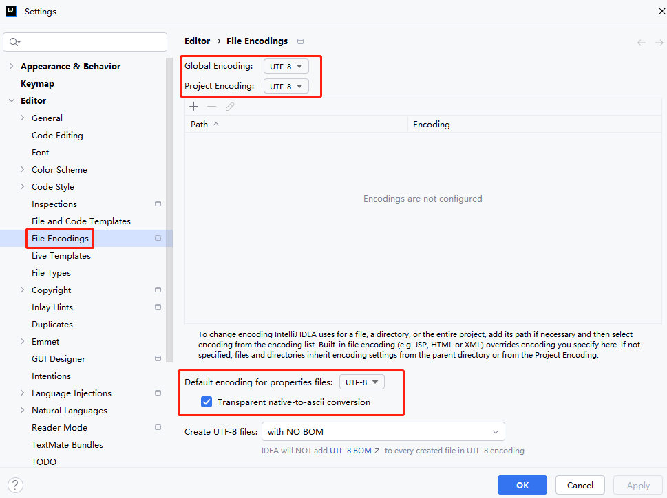
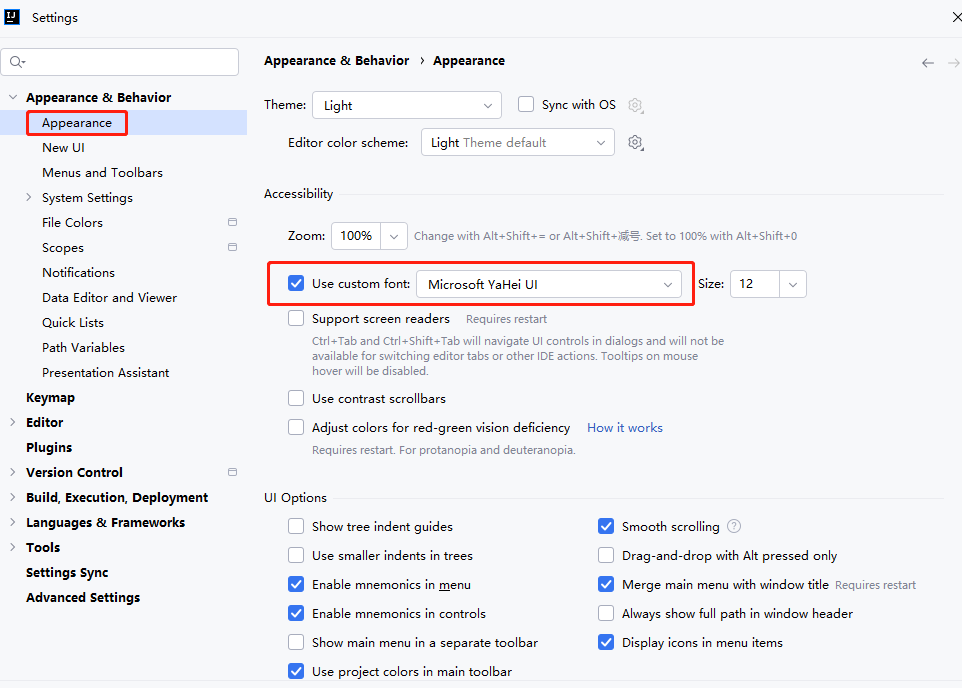
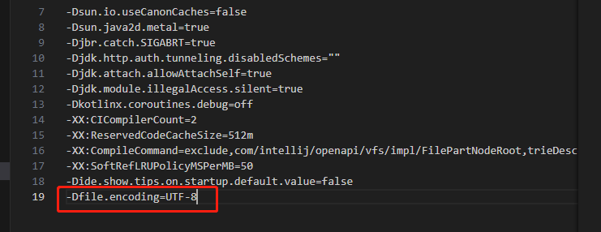
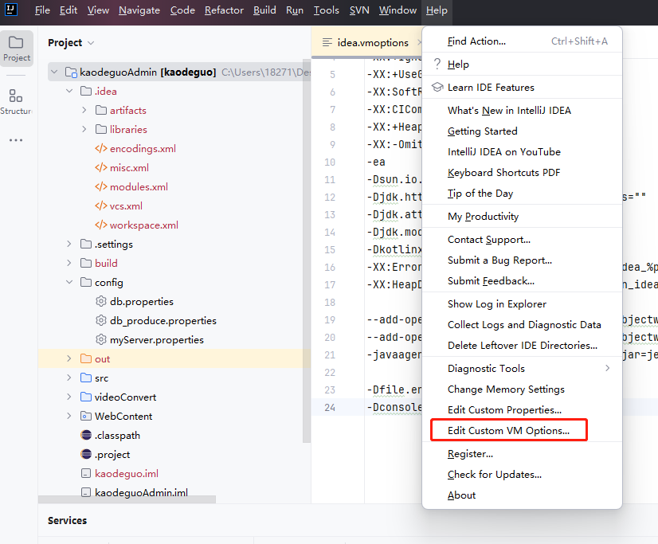
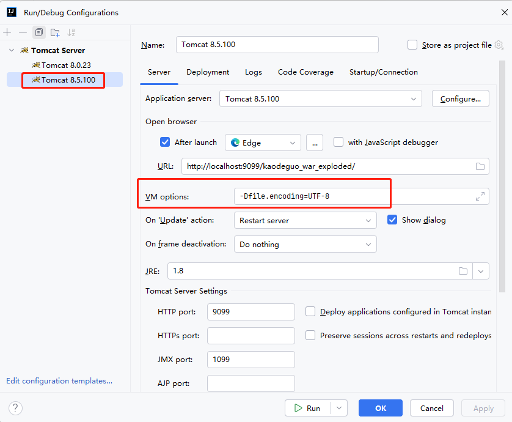

[toc]

# IDEA的笔记

最初创建日期：2020-10-12
更新日期：2021-08-11
再次更新日期：2024-06-13

## IDEA 介绍

IDEA 全称 IntelliJ IDEA，是用于java语言开发的集成环境（也可用于其他语言）。

IDEA 在业界被公认为最好的java开发工具之一，尤其在智能代码助手、代码自动提示、重构、J2EE支持、Ant、JUnit、CVS整合、代码审查、创新的GUI设计等方面的功能可以说是超常的。

IDEA 是 JetBrains 公司的产品，这家公司总部位于捷克共和国的首都布拉格，开发人员以严谨著称的东欧程序员为主。

## IDEA 与 Eclipse 的区别

1. IDEA是没有Eclipse的workspace的概念。取代workspace概念的是Project。
2. IDEA 的 Project 是一个没有具备任何编码设置、构建等开发功能的，主要起到一个项目定义、范围约束、规范等类型的效果，也许我们可以简单地理解为就是一个单纯的目录，只是这个目录命名上必须有其代表性的意义。
3. 在IDEA中 Project 是最顶级的级别，次级别是 Module (模块)。一个 Project 可以有多个 Module (模块)。

目前主流的大型项目结构都是类似这种多 Module 结构。比如：core Module、web Module、test Module等，模块之间彼此可以相互依赖,相互独立。这些Module应该都是处于同一个项目业务情况下的模块，彼此之间是有不可分割的业务关系的。

> 下表是IDEA 与 Eclipse 之间一些概念的对比：

Eclipse | 	IntelliJ IDEA
-- | --
Workspace   |  Project
Project | Module
Facet | Facet
Library | Library
JRE | SDK
Classpath variable | Path variable

> SDK（Software Development Kit）介绍

IDEA 的sdk（软件开发工具包）概念,就相当于 jre 运行环境。

## IDEAD的常用设置

### 1 使用idea创建工程，会有两个特殊文件：.iml文件和.idea文件夹。

.iml文件是工程配置文件，里面是当前project的一些配置信息。
.Idea文件夹存放项目的配置信息，包括历史记录，版本控制信息等。

上传到git仓库的时候，可以不用上传它们。

### 2 关闭IDEA自动更新

在File->Settings->Appearance & Behavior->System Settings->Updates下取消 Automatically check updates for 勾选 

## 使用IDEA中的Git

### 1.IDEA 创建 spring boot项目

1. 安装IDEA
2. 创建spring boot项目（网上找教程）

```
Create New Project 
-> 在左侧菜单找到并点击 Spring Initializr，点击next 
-> 一直next,直到左面选择Web类别下的Spring Web Starter 
-> 设置项目名称Project name 和 工程保存路径 Project location。完成后，点击 Finish。
```

3. 如果pom文件中的maven依赖下载慢，就改变IDEA的maven设置（可以把setting.xml文件中的镜像设置为国内的）

### 2.IDEA创建本地git仓库并把代码push到github上

1. 在idea中配置git。
2. 为当前项目创建git本地仓库

```
选中当前项目-> 点击VCS -> import into version control -> create git repository
之后你能在项目文件中找到隐藏的git目录
```

3. 把项目文件存储到git本地的暂存区

```
右键项目->git->add
```

4. 把项目暂存区的文件推送到本地仓库中

```
右键项目->git->commit directory
```

5. 在github上创建仓库,然后再把远程仓库的代码，先pull到git本地仓库中

```
ps:注意创建github仓库时，不要建立readme文件。否则push的时候，容易发生本地仓库与github仓库代码冲突
```

6. 再把git本地仓库的代码push到github上

```
1. 在idea中设置github全局信息,登录你的github账号(如果无法登录尝试使用vpn在登录)
2. 指定上传的github远程仓库的信息
右键项目->git->repository->remotes
填写刚刚创建的github远程仓库的信息。例如：xxx://xxx.com/xxx/xxx.git
3. push代码
右键项目->git->repository->push
```

### 3.IDEA 从github上clone一个项目到本地中

1. 复制远程仓库的链接。例如：`xxx://xxx.com/xxx/xxx.git`
2. 点击idea 的 vcs -> checkout from version control -> git
3. 把链接输入进去。选择新的目录。点击clone即可
4. 新开一个窗口，打开项目即可

### 4.IDEA 拉取远程仓库上最新的代码到本地仓库中

1. 右键项目->git->repository->pull


## IDEA 如何屏蔽.iml .idea等不需要的文件类型 避免commit提交无效文件

使用IDEA创建工程。会有很多.iml .idea文件。这些文件与你的程序代码没什么关系，都是一些IDEA本地编译运行的文件。不仅没用，而且在协作开发中，如果你提交了自己本地的iml文件，被别人拉到其他机器上，还会影响别人运行。

屏蔽方式：


## IDEA 中Cannot Resolve Symbol XXX问题的解决方法汇总

当用idea导入maven项目的时候，会出现各种各样的问题。最常见的是Cannot Resolve Symbol XXX报错

解决方式：
1. 检查idea中的maven配置。若使用自己的maven。需要注意MAVEN_HOME和M2_HOME环境变量，以及对应的path系统变量是否在电脑系统中配置好。
2. 检查maven仓库目录中报错的依赖包，是否完全下载下来。若没有下载下来。先删除该依赖包，再重新下载。在编译器右侧中打开Maven Projects标签，先进行clean一下，再执行install。
3. 检查idea的sdk,选择自己本地安装的jdk,并检查JAVA_HOME环境变量有没有再系统中设置正确。
4. 若导入的maven项目没有蓝色小方块图标。需要右键-》maven->Generate Sources and Update Folder。 重新更新下maven项目
5. 或者右键-》maven->Reload Projects
6. 最后清除idea的编译器缓存。File->invalidate Caches / Restart


## IDEA 统一设置文件编码为UTF-8（防止出现中文乱码问题）

1. 进入IDEA的 Setting>Editor>File Encodings 设置界面

修改下面设置
```
Global Encoding:UTF-8
Projectt Encoding:UTF-8
Default encoding for properties files:UTF-8
勾选上Transparent native-to-ascii conversion
```

注意：Transparent native-to-ascii conversion 需勾选上，不然项目中配置文件中的中文注释无法正常显示。



2. 菜单 File - > settings -> appearence , 将字体设置为支持中文的微软雅黑



3. 找到idea安装目录，打开bin目录中的 idea.exe.vmoptions 或 idea64.exe.vmoptions 文件。在最后一行添加上`-Dfile.encoding=UTF-8`。



4. 导航栏“Help→Etit Custom VM Options…”进入自定义虚拟机设置页面。

在idea64.exe.vmoptions 文件尾加上

```
-Dfile.encoding=UTF-8
-Dconsole.encoding=UTF-8
```



5. 最后相关配置修改完成后，需重启 IDEA, 才能让设置生效 


## IDEA 中使用外置 Tomcat, 相关的控制台日志中文乱码

当在IDEA中运行一些老的项目的时候。往往需要搭配外置的tomcat进行启动。因此很有可能也会出现中文乱码的情况。

在此之前，先给IDEA 统一设置文件编码为UTF-8。

1. 导航栏 Run -> Edit Configurations… , 进入到Tomcat配置页面。

修改当前 Web 项目 Tomcat Server的虚拟机输出选项 VM options, 添加`-Dfile.encoding=UTF-8`,从而让Tomcat 支持 UTF-8 编码



2. tomcat安装目录中找到config目录中的logging.properties文件，修改下面配置

```properties
## java.util.logging.ConsoleHandler.encoding = GBK
java.util.logging.ConsoleHandler.encoding = UTF-8
```
