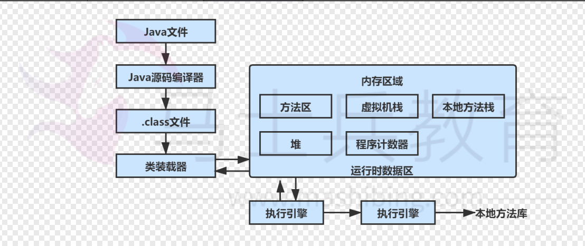

[toc]

# Java虚拟机（JVM）笔记

## Java虚拟机的介绍

> 什么是java虚拟机？

Java 虚拟机是一个虚拟的机器,在实际的计算机上通过软件模拟来实现。Java 虚
拟机有自己虚拟的硬件,如处理器、堆栈、寄存器等,还具有相应的指令系统。

> 为什么要使用java虚拟机？

Java 语言的一个非常重要的特点就是与平台的无关性。而使用 Java 虚拟机是实现这
一特点的关键。

一般的高级语言如果要在不同的平台上运行,至少需要编译成不同的目标代码。而引入 Java 语言虚拟机后,Java 语言在不同平台上运行时不需要重新编译。Java 虚拟机屏蔽了与具体平台相关的信息,使得 Java 语言编译程序只需生成在 Java 虚拟机上运行的目标代码(字节码),就可以在多种平台上不加修改地运行。

Java 虚拟机在执行字节码文件时，会把字节码解释成具体平台上的机器指令执行。

> Java 虚拟机的生命周期

程序开始执行时Java 虚拟机才运行，程序结束时Java 虚拟机就停止。如果你同时运行三个 Java 程序，就会有三个运行中的 Java 虚拟机。

Java 虚拟机总是开始于一个 main()方法，这个方法必须是公有 public、返回 void、直接接收一个字符串数组。在程序执行时，你必须给 Java 虚拟机指明这个包含有 main() 方法的类名。

## Java虚拟机的组成


JVM由以下四大部分组成。
* 类加载器子系统 ：根据完整类名(如:java.lang.Object)来装载class字节码文件到运行时数据区中的方法区（method area）。
* Execution engine（执行引擎）：执行class字节码文件中的指令。
* Native Interface(本地库接口)：与 本地方法库（native libraries）交互，是其它编程语 言交互的接口。
* Runtime data area(运行时数据区域)：这就是常说的JVM的内存。

Java程序运行步骤：
1. 首先利用IDE集成开发工具编写Java源代码，源文件的后缀为.java；
2. 再利用编译器(javac命令)将源代码编译成字节码文件，字节码文件的后缀名为.class；
3. 然后JVM中的类装载器开始读取字节码文件。由于字节码文件中包含数据和指令。
4. 类加载器将字节码文件中的数据加载到运行时数据区。把字节码文件中的指令加载到执行引擎中。
5. 执行引擎将字节码文件中的指令翻译为底层系统指令。再交由 CPU 去执行，而这个过程中需要调用其他语言的本地库接口（Native Interface）来实现整个程序的功能。




> JVM的四大部分如何执行？
> 1. 准备好 Java 字节码文件（class文件）
> 2. 类加载器将字节码文件中的指令集和数据信息存储到运行数据区中。
> 3. 执行引擎将运行数据区的指令集翻译为操作系统指令集。
> 4. 执行引擎根据本地方法栈内存储的本地方法信息，通过调用本地库接口，去执行具体的本地方法库。

### 类加载器子系统

类加载器子系统用于加载字节码文件。

### 运行时数据区

程序的执行需要一定的内存空间，如字节码、类的信息、程序中的对象、方法的参数、返回值、本地变量、处理的中间变量等等。Java 虚拟机将这些信息统统保存在运行时数据区中。

#### 方法区: 线程共享

在 Java 虚拟机中，被加载类型的信息都保存在方法区中。一个java程序中的所有线程共享一个方法区。它用于存储已被虚拟机加载的类型信息、全局常量、静态变量、即时编译器编译后的代码缓存等数据。

> 什么是类型信息？
- 类的完整类名，类的修饰符，类的父类信息等。
- 类中方法的名称，方法的返回类型，方法的参数列表和数据类型信息，方法的修饰符等。

如图所示


#### 堆：线程共享

当 Java 程序 new 一个类的实例化对象或者数组时，都会在堆中为新的对象或新的数组分配内存。虚拟机中只有一个堆，所有的线程都共享它。

#### PC 寄存器(程序计数器)

程序计数器用来记录当前所属线程正在执行的字节码指令地址。

由于Java虚拟机的多线程是通过各个线程轮流切换、分配CPU处理器的执行时间的方式来实现的，在任何一个确定的时刻，一个CPU处理器（对于多核处理器来说是一个内核）都只会执行一条线程中的指令。因此，为了线程切换后能恢复到正确的执行位置，每条线程都需要有一个独立的程序计数器，用来记录所属线程正在执行的字节码指令地址。并且各个线程的程序计数器互不影响，独立存储。

#### 虚拟机栈

每个方法被执行的时候，Java虚拟机会创建一个栈帧（一个栈元素，代表该方法）用于存储局部变量表、操作数栈、动态链接、参与方法的调用与返回等。每一个方法从被调用到执行完成的过程，就对应着一个栈帧在虚拟机栈中出入栈到出栈的过程

栈帧的结构：局部变量表，操作数栈，动态链接（指向运行时常量池的方法引用），方法返回地址，其他附件信息。

* 局部变量表：存储方法形参和方法体内的局部变量（包括基本数据类型，对象引用地址，数组的引用地址）。
* 操作数栈：当进行表达式计算时，会将参与计算的变量和运算符存储操作数栈中，通过入栈出栈的方式来进行表达式计算。
* 动态链接（指向运行时常量池的方法引用）：每个栈帧都包含一个指向运行时常量池中该栈帧所属方法的引用。
* 方法返回地址：即在方法退出之后，都必须返回到方法被调用前时程序运行的位置，程序才能继续执行。


#### 本地方法栈

本地方法栈类似于虚拟机栈，区别是虚拟机栈为执行Java方法服务, 而本地方法栈则为Native方法服务。

Native方法就是指非java语言实现的方法，比如C语言。Native方法用于帮助虚拟机中的java方法调用非java语言编写的系统底层方法。例如 java方法-》调用Native方法 -》调用非java语言编写的系统底层方法。

### 执行引擎

主要用于执行class字节码文件中的指令。

### 本地库接口

本地库接口主要与本地方法库（native libraries）交互，是与其它编程语言交互的接口。并不是必须实现本地库接口。

## JVM中的堆与栈


JVM中的堆与栈主要是指运行时数据区域中的堆与虚拟机栈。


- 栈用于解决程序的运行问题，即程序如何执行，或者说如何处理数据；
- 堆用于解决的是数据存储的问题，即数据怎么放、放在哪儿。

在 Java 中一个线程就会相应有一个线程栈与之对应，因为不同的线程，它的执行逻辑有所不同，因此需要一个独立的线程栈。而堆则是所有线程共享的。

因此线程栈里面存储的信息都是跟当前线程（或程序）相关信息的，包括局部变量、程序运行状态、方法返回值等等。而堆只负责存储对象信息。

### 为什么要把堆和栈区分出来呢？栈中不是也可以存储数据吗？

- 第一，从软件设计的角度看，栈代表了处理逻辑，而堆代表了数据。这样分开，使得处理逻辑更为清晰。分而治之的思想。这种隔离、模块化的思想在软件设计的方方面面都有体现。
- 第二，堆与栈的分离，使得堆中的内容可以被多个栈共享（可以理解为多个线程访问同一个对象）。这种共享的收益是很多的。一方面这种共享提供了一种有效的数据交互方式(如：共享内存)，另一方面，堆中的共享常量和缓存可以被所有栈访问，节省了空间。
- 第三，栈因为运行时的需要，比如保存系统运行的上下文，需要进行地址段的划分。由于栈只能向上增长，因此就会限制住栈存储内容的能力。而堆不同，堆中的对象是可以根据需要动态增长的，因此栈和堆的拆分，使得动态增长成为可能，相应栈中只需记录堆中的一个地址即可。
- 第四，面向对象就是堆和栈的完美结合。其实，面向对象方式的程序与以前结构化的程序在执行上没有任何区别。但是，面向对象的引入，使得对待问题的思考方式发生了改变，而更接近于自然方式的思考。当我们把对象拆开，你会发现，对象的属性其实就是数据，存放在堆中；而对象的方法，就是运行逻辑，存放在栈中。我们在编写对象的时候，其实即编写了数据结构，也编写的处理数据的逻辑。不得不承认，面向对象的设计，确实很美。

### 堆中存什么？栈中存什么？

堆中存的是对象。栈中存的是基本数据类型和堆中对象的引用。一个对象的大小是不可估计的，或者说是可以动态变化的，但是在栈中，一个对象只对应了一个 4btye 的引用。

> 为什么不把基本类型放堆中呢？

因为基本数据类型占用的空间一般是 1~8 个字节,需要空间比较少，而且因为是基本类型，所以不会出现动态增长的情况，即长度固定，因此栈中存储就够了。

### Java 中的参数传递时传值呢？还是传引用？

java 程序运行永远都是在栈中进行的，因而参数传递时，只存在传递基本类型和对象引用的问题。不会直接传对象本身。Java 在方法调用传递参数时，因为没有指针的概念，所以它都是进行传值调用。

在程序参数传递时，被传递的值本身都是不能进行修改的，但是，如果这个值一个对象引用，则可以通过这个对象引用来修改这个对象。


## JVM中的四个常量池

JVM常量池主要分为Class常量池、运行时常量池、字符串常量池、基本类型包装类对象常量池。


### Class常量池

每个字节码文件（Class文件）中除了有类的版本、字 段、方法、接口等描述信息外，还有一种数据信息是Class常量池。Class常量池用于存放编译期生成的各种字面量与符号引用。

字面量包括：1.文本字符串 2.八种基本数据类型的值 3.被声明为final的常量等;
符号引用包括：1.类和方法的全限定名 2.字段的名称和描述符 3.方法的名称和描述符。

### 运行时常量池

运行时常量池存在于方法区中。当类加载器将字节码文件中的指令和数据信息加载到运行内存中时，会把字节码文件的Class常量池信息取出并存储到方法区中的运行时常量池中。

### 字符串常量池

字符串常量池存在于堆中。字符串常量池存储的是具体的字符串值。而不是具体的字符串实例对象。

```java
//方式1
String str1="aaa";

//采用字面值的方式创建一个字符串时，JVM 首先会去字符串池中查找是否存在 "aaa" 这个对象，
//如果不存在，则在字符串常量池中创建 "aaa" 这个对象，然后将池中 "aaa" 这个对象的引用地址返回给字符串常量 str1，这样 str1 会指向池中"aaa"这个字符串对象；
//如果存在，则不创建任何对象，直接将池中 "aaa" 这个对象的地址返回，赋给字符串常量str1。

//方式2
String str2=new String("aaa");

//采用 new 关键字新建一个字符串对象时，JVM 首先在字符串常量池中查找有没有 "aaa" 这个字符串对象。
//如果有，则不在池中再去创建 "aaa" 这个对象了，直接在堆中创建一个 "aaa" 字符串对象，然后将堆中的这个"aaa"对象的地址返回赋给引用 str2，这样str2就指向了堆中创建的这个 "aaa" 字符串对象；
//如果没有，则首先在字符串常量池池中创建一个 "aaa" 字符串对象，然后再在堆中创建一个 "aaa" 字符串对象，然后将堆中这个 "aaa" 字符串对象的地址返回赋给str2引用，这样str2指向了堆中创建的这个 "aaa" 字符串对象。

```

* 字符串池的优点就是避免了相同内容的字符串的创建，节省了内存，省去了创建相同字符串的时间，同时提升了性能；
* 字符串池的缺点就是牺牲了JVM在常量池中遍历对象所需要的时间，不过其时间成本相比而言比较低。