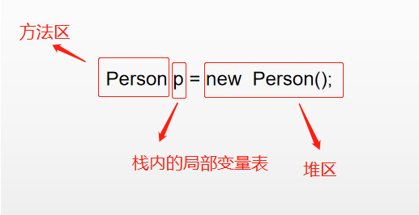

[toc]

## Java虚拟机（JVM）笔记

## 1. Java虚拟机的组成


JVM由四大部分组成：ClassLoader（类加载器），RuntimeDataArea（运行时数据区，内存分区），ExecutionEngine（执行引擎），NativeInterface（本地库接口）

* ClassLoader（类加载器）: 只负责加载字节码文件（class文件）。
* RuntimeDataArea（运行时数据区，内存分区）： 用于存放数据的，分为五部分：虚拟机栈，堆，方法区，程序计数器，本地方法栈。
* Execution Engine (执行引擎)：Class文件被加载后，会把指令和数据信息都放入内存中，执行引擎负责把指令解释给操作系统，即将JVM指令集翻译为操作系统指令集。
* Native Interface（本地库接口）：它的作用是让JAVA程序调用非java语言编写的接口，首先在本地方法栈中记录对应的本地库方法，然后调用该方法时就通过执行引擎加载对应的本地lib。


> JVM的四大部分如何执行？
> 1. 准备好编译好的 Java 字节码文件（class文件）
> 2. 类加载器将字节码文件中的指令集和数据信息存储到运行数据区中。其中会在本地方法栈中存储需要调用的本地方法信息。
> 3. 执行引擎将运行数据区的指令集翻译为操作系统指令集。
> 4. 执行引擎根据本地方法栈内存储的本地方法信息，通过调用本地库接口，去执行具体的本地方法库。


## 2. RuntimeDataArea（运行时数据区，Java虚拟机管理的内存区域） 

Java虚拟机在执行Java程序的过程中会把它所管理的内存划分为若干个不同的数据区域。这些区域有各自的用途，以及创建和销毁的时间，有的区域随着虚拟机进程的启动而一直存在，有些区域则是依赖用户线程的启动和结束而建立和销毁。


java虚拟机管理的数据区域主要分为：方法区，虚拟机栈，本地方法栈，堆，程序计数器。其中所有线程共享的区域是方法区和堆，线程私有区域是虚拟机栈，本地方法栈，程序计数器。

<font color="red">
JVM默认的虚拟机引擎HotSpot虚拟机把虚拟机栈和本地方法栈合二为一，统称为栈。
</font>

### 1. 程序计数器-线程私有

程序计数器是一块较小的内存空间，用来记录当前所属线程正在执行的字节码指令地址。

由于Java虚拟机的多线程是通过各个线程轮流切换、分配CPU处理器的执行时间的方式来实现的，在任何一个确定的时刻，一个CPU处理器（对于多核处理器来说是一个内核）都只会执行一条线程中的指令。因此，为了线程切换后能恢复到正确的执行位置，每条线程都需要有一个独立的程序计数器，用来记录所属线程正在执行的字节码指令地址。并且各个线程的程序计数器互不影响，独立存储。


### 2. 虚拟机栈-线程私有

每个方法被执行的时候，Java虚拟机会创建一个栈帧（一个栈元素，代表该方法）用于存储局部变量表、操作数栈、动态链接、参与方法的调用与返回等。每一个方法从被调用到执行完成的过程，就对应着一个栈帧在虚拟机栈中出入栈到出栈的过程

栈帧的结构：局部变量表，操作数栈，动态链接（指向运行时常量池的方法引用），方法返回地址，其他附件信息。

* 局部变量表：存储方法形参和方法体内的局部变量（包括基本数据类型，对象引用地址，数组的引用地址）。
* 操作数栈：当进行表达式计算时，会将参与计算的变量和运算符存储操作数栈中，通过入栈出栈的方式来进行表达式计算。
* 动态链接（指向运行时常量池的方法引用）：每个栈帧都包含一个指向运行时常量池中该栈帧所属方法的引用。
* 方法返回地址：即在方法退出之后，都必须返回到方法被调用前时程序运行的位置，程序才能继续执行。


### 3. 本地方法栈-线程私有

1. 本地方法栈类似于虚拟机栈，区别是虚拟机栈为执行Java方法服务, 而本地方法栈则为Native方法服务。
2. Native方法就是指非java语言实现的方法，比如C。Native方法用于帮助虚拟机中的java方法调用非java语言编写的系统底层方法。例如 java方法-》调用Native方法 -》调用非java语言编写的系统底层方法。

### 4. 堆-线程共享

对于Java应用程序来说，堆是虚拟机所管理的内存中最大的一块。堆是被所有线程共享的一块内存区域，在虚拟机启动时创建。堆用于存放java程序中的所有new出来的对象实例和数组。

PS: 
1. Java堆也是垃圾收集器管理的内存区域。
2. Java堆既可以是固定大小的，也可以是可扩展的，通过调整JVM的配置参数-Xmx和-Xms设定。


### 5. 方法区-线程共享

方法区又名非堆区，也是各个线程共享的内存区域，它用于存储已被虚拟机加载的类型信息、全局常量、静态变量、即时编译器编译后的代码缓存等数据。

什么是类型信息？
1. 包含java程序中的类的完整类名，类的修饰符，类的父类信息等
2. 包含类中方法的名称，方法的返回类型，方法的参数列表和数据类型信息，方法的修饰符。

全局常量：被static final修饰的变量。

静态变量：通常与类关联在一起。随类的加载而加载。

举例




#### 1. 方法区中的运行时常量池

字节码文件（Class文件）中除了有类的版本、字 段、方法、接口等描述信息外，还有一种数据信息是Class常量池，用于存放编译期生成的各种字面量与符号引用，这部分内容将在类加载后存放到方法区的运行时常量池中。即当类被加载后，字节码文件中的Class常量池存储的数据，将加载到方法区中的运行时常量池。

字面量包括：1.文本字符串 2.八种基本数据类型的值 3.被声明为final的常量等;
符号引用包括：1.类和方法的全限定名 2.字段的名称和描述符 3.方法的名称和描述符。


## 3. JVM中的四个常量池

JVM常量池主要分为Class常量池、运行时常量池、字符串常量池、基本类型包装类对象常量池。


### 1. Class常量池

每个字节码文件（Class文件）中除了有类的版本、字 段、方法、接口等描述信息外，还有一种数据信息是Class常量池。Class常量池用于存放编译期生成的各种字面量与符号引用。

字面量包括：1.文本字符串 2.八种基本数据类型的值 3.被声明为final的常量等;
符号引用包括：1.类和方法的全限定名 2.字段的名称和描述符 3.方法的名称和描述符。

### 2. 运行时常量池

运行时常量池存在于方法区中。当类加载器将字节码文件中的指令和数据信息加载到运行内存中时，会把字节码文件的Class常量池信息取出并存储到方法区中的运行时常量池中。

### 3. 字符串常量池

字符串常量池存在于堆中。字符串常量池存储的是具体的字符串值。而不是具体的字符串实例对象。

```java
//方式1
String str1="aaa";

//采用字面值的方式创建一个字符串时，JVM 首先会去字符串池中查找是否存在 "aaa" 这个对象，
//如果不存在，则在字符串常量池中创建 "aaa" 这个对象，然后将池中 "aaa" 这个对象的引用地址返回给字符串常量 str1，这样 str1 会指向池中"aaa"这个字符串对象；
//如果存在，则不创建任何对象，直接将池中 "aaa" 这个对象的地址返回，赋给字符串常量str1。

//方式2
String str2=new String("aaa");

//采用 new 关键字新建一个字符串对象时，JVM 首先在字符串常量池中查找有没有 "aaa" 这个字符串对象。
//如果有，则不在池中再去创建 "aaa" 这个对象了，直接在堆中创建一个 "aaa" 字符串对象，然后将堆中的这个"aaa"对象的地址返回赋给引用 str2，这样str2就指向了堆中创建的这个 "aaa" 字符串对象；
//如果没有，则首先在字符串常量池池中创建一个 "aaa" 字符串对象，然后再在堆中创建一个 "aaa" 字符串对象，然后将堆中这个 "aaa" 字符串对象的地址返回赋给str2引用，这样str2指向了堆中创建的这个 "aaa" 字符串对象。

```

* 字符串池的优点就是避免了相同内容的字符串的创建，节省了内存，省去了创建相同字符串的时间，同时提升了性能；
* 字符串池的缺点就是牺牲了JVM在常量池中遍历对象所需要的时间，不过其时间成本相比而言比较低。