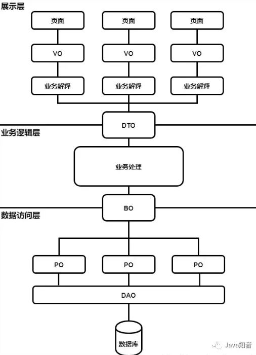

[toc]

# Java中常见的对象模型简述-(DO、BO、DTO、VO、AO、PO)

作为Java开发人员，大部分人不免要接触VO，BO，PO，DO，DTO之类的对象模型。

这些模型主要是为了在多人开发的情况下，为了对项目中编码进行规范处理而创建的。

如图所示

## PO(Persistant Object) 持久对象

一个PO就是数据库中的一条记录,用于表示数据库中的一条记录映射成的 java 对象。PO仅仅用于表示数据，没有任何其他操作。通常遵守 Java Bean 的规范，拥有 getter/setter 方法。

好处是可以将一条记录对应为一个PO对象处理，PO可以方便转化为其他对象

## POJO(Plain ordinary java object) 简单java对象

一个POJO持久化以后就是PO；直接用它传递、传递过程中就是DTO；直接用来对应表示层就是VO。

## VO(View Object) 视图对象

VO视图对象。主要对应界面显示的数据对象。通常一个页面，用一个VO对象对应该界面的值。

注意VO只包含前端需要展示的数据，对于前端不需要的数据，比如数据创建和修改的时间等字段，出于减少传输数据量大小和保护数据库结构不外泄的目的，不应该在 VO 中体现出来。

VO 通常遵守 Java Bean 的规范，拥有 getter/setter 方法。

## DTO(Data Transfer Object) 数据传输对象

DTO数据传输对象 主要用于展示层与服务层之间的数据传输。

比如一张表有100个字段，则对应的PO就有100个属性。但是界面上只显示10个字段，没有必要把整个PO对象传递到界面。

这时可以设计一个DTO，该DTO只有这10个属性。通过DTO把PO的数据传递给VO。这样不会暴露服务端表结构。若此时只用DTO来代替VO，那么DTO就转变为VO了

DTO 通常用于不同服务或不同分层之间的数据传输。DTO 与 VO 概念相似，并且通常情况下字段也基本一致。但 DTO 与 VO 又有一些不同，比如 API 服务需要使用的 DTO 就可能与 页面需要的VO 存在差异。

DTO 通常遵守 Java Bean 的规范，拥有 getter/setter 方法。

## BO(Business Object) 业务对象

主要作用是把业务逻辑封装为一个对象。这个对象可以包括一个或多个其它的对象。

比如一个简历数据，包含教育经历数据、工作经历数据、社会关系数据等等。可以把教育经历对应一个PO，工作经历对应一个PO，社会关系对应一个PO。建立一个对应简历数据的BO对象。每个BO包含这些PO。这样处理业务逻辑时，我们就可以针对BO去处理。

## DAO(Data access object) 数据访问对象

DAO用来封装对数据库的访问。通过它可以把POJO持久化为PO，用PO组装出来VO，DTO；

DAO用于表示一个数据访问对象。使用 DAO 访问数据库，包括插入、更新、删除、查询等操作，与 PO 一起使用。

DAO一般在持久层，完全封装数据库操作，对外暴露的方法使得上层应用不需要关注数据库相关的任何信息。

## 结论

VO，BO，PO，DTO这样分层还是很有意义的。尤其在团队成员较多的情况下，结构更加一目了然，同时也能很大程度避免多端系统数据所需不一致时，有人修改属性影响其他页面。

但也完全没有必要教条主义，把这些全部用上，需要根据所开发的业务复杂度来取舍，如果本身业务逻辑不复杂，照搬全上反而让开发编码变的更复杂。

例如业务不复杂，根本没有多端展示的差异化，VO可以直接拿掉，直接使用DTO传输到前端数据即可。

同时在使用过程中，最重要的是要在团队中达成共识，概念一致，如果使用了这些，但各按各的理解来，甚至抓起来就直接用，反而会让代码变得更乱，还不如直接POJO、DTO打天下。

