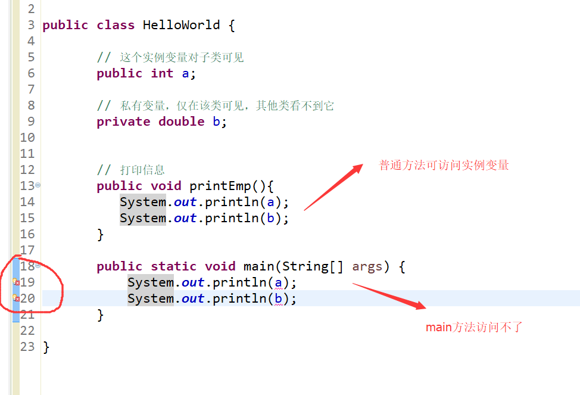
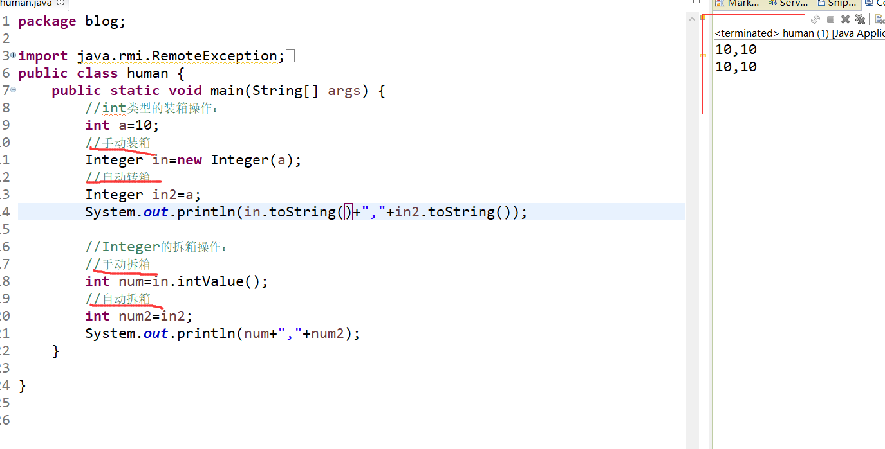

[toc]

## Java笔记

java语言是一门面向对象程序设计语言，本篇只是介绍java的基础知识。

关于如何进行java开发环境的配置：自行百度
关于java语言的IDE工具有哪些：自行百度

<font color="red">
注意：IDE工具：专门用于编写java程序的软件。下面所有示例主要用STS 运行java代码。
</font>

## 1. 初识第一个java程序 ---helloworld ：

### 1. 使用命令行运行程序：

①：创建文件：HelloWorld.java
②：在文件中编写如下代码：

```java
public class HelloWorld {
    /* 第一个Java程序
     * 它将打印字符串 Hello World
     */
    public static void main(String []args) {
        System.out.println("Hello World"); // 打印 Hello World
    }
}
```

③：打开命令行窗口:

1. 找到HelloWorld.java文件在那个路径下：
2. 执行命令(假如文件在c盘下)：
```
C : > javac HelloWorld.java    //编译文件，产生.class的字节码文件
C : > java HelloWorld      //运行字节码文件，执行程序源代码
```
④：运行结果：


### 2. 使用IDE创建一个Java程序并运行：

①：创建java project：


②：创建package包，class类


③：在类中编写源代码：
```java
package Hello1;

public class HelloWorld {
    /* 第一个Java程序
     * 它将打印字符串 Hello World
     */
    public static void main(String []args) {
        System.out.println("Hello World"); // 打印 Hello World
    }
}
```

④：运行程序。（右键 --> RunAs --> Java application）


### 3. 对第一个java程序解析：

源代码：

```java
package Hello1;
public class HelloWorld {
    /* 第一个Java程序
     * 它将打印字符串 Hello World
     */
    public static void main(String []args) {
        System.out.println("Hello World"); // 打印 Hello World
    }
}
```

```
解析：
1. package Hello1;   //声明包名
2. class 关键字用于在java中声明一个类。
3. public 关键字是一个表示可见性的访问修饰符，它表示对所有人可见。
4. static是一个关键字,表示该方法为静态方法。main方法由JVM执行，因此它不需要创建对象来调用main方法。所以它节省了内存。
5. void是方法的返回类型，它意味着它不返回任何值。
6. main表示程序开始(执行的入口)。
7.  public static void main(String []args) { ... }
所有的java程序都是由这个main方法开始执行的。
```

### 4. 程序运行时的内部细节（★★★）：


1. 在编译时，java文件(.java)准换为字节码文件（.class），并将java代码转换为字节码.
2. 类加载器(Classloader)：是用于加载类文件的JVM的子系统。
3. 字节码校验器(Bytecode Verifier)：检查代码中是否存在错误代码。

### 5. 常见问题解答（★★★★★）：


```
1. 一个java源文件中可以有多个类吗？

可以，但只能有一个 public 类。

2. JVM是什么？:

JVM(Java虚拟机)是一个抽象机器。它是一个提供可以执行Java字节码的运行时环境的规范。
字节码文件(.class)并不直接与机器的操作系统相对应，而是经过虚拟机间接与操作系统交互，由虚拟机将程序解释给本地系统执行。
因此，JVM屏蔽了与具体操作系统平台相关的信息，使得Java程序只需生成在Java虚拟机上运行的目标代码（字节码），就可以在多种平台上不加修改地运行。
JVM执行以下主要任务：
提供运行时环境(JRE) ---> 加载代码 ---> 验证代码 ---> 执行代码 

3. JRE是什么？:
JRE是Java Runtime Environment的缩写。用于提供java程序运行时环境。它包含一组运行java程序库和JVM。


4. JDK是什么？：
JDK是Java开发工具包。
JDK包括了Java运行环境JRE、Java工具和Java基础类库。

```

## 2. java基础知识点：

### 1. java代码的基本语法：

> 1. 基本格式与要点：

①：java中的所有程序代码都必须放在类中。可以大概理解为一个.java文件代表一个类

类的定义：
```
修饰符 class 类名{
    程序代码;
}
```

②：编写java代码注意：

1. java程序中每条语句都必须用分号（;）结束。
2. Java是大小写敏感的，这就意味着标识符Hello与hello是不同的。
3. java程序中，一句连续的字符串不能分开在两行写。要把两行用 + 号连起来。

```java
 System.out.println("this is a 
     java 程序");                  //这是错误示例
System.out.println("this is a" + 
    "java 程序");                  //这是正确示例
```

4. <font color="red">类名的首字母应该大写。</font>如果类名由若干单词组成，那么每个单词的首字母应该大写，例如 MyFirstJavaClass 
5. <font color="red">方法名都应该以小写字母开头</font>。如果方法名含有若干单词，则后面的每个单词首字母大写。例如 myFirstJava
6. 源文件名(.java文件名)必须和公共类名（public class 类名）相同。
7. 主方法入口:所有的Java 程序由public static void main(String []args)方法开始执行.

> 2. 注释：

Java支持单行以及多行注释。注释中的字符将被Java编译器忽略。
①：单行注释： 以 `//` 两个字符作为一行注释的开始.
②：多行注释： 它以 `/*` 开始，并以 `*/` 结束.
③：文档注释：看下例。

```java
int a=10;    //这是单行注释
/*
int b=10;
int c=10;
这是多行注释
*/
/**
 * 文档注释，用于为代码编写帮助文档 
 *
 */
```

> 3. 标识符：

java程序中，类名、变量名以及方法名等都被称为标识符。

关于Java标识符，有以下几点需要注意：
1. 所有的标识符都应该以字母（A-Z或者a-z）,美元符（$）、或者下划线（_）开始。（<font color="red">不能以数字开头</font>）
2. 首字符之后可以是字母（A-Z或者a-z）,美元符（$）、下划线（_）或数字的任何字符组合
3. java自带的关键字不能用作标识符.
4. 标识符是大小写敏感的
5. 合法标识符举例：age、$salary、_value、__1_value
6. 非法标识符举例：123abc、-salary


> 4. java 关键字：

在java语言中存在一些关键字，这些关键字不能用于常量、变量、和任何标识符的名称。

<font color="red">所有的关键字都是小写的。</font>

```
下面是部分关键字：
abstract、assert、boolean、break、byte、case、catch、char、class、continue、default
do、double、else、enum、extends、final、finally、float、for、if、implements、import
int、interface、instanceof、long、native、new、package、private、protected、public
return、short、static、strictfp、super、switch、synchronized、this、throw、throws
transient、try、void、volatile、while、true、false、null
```

### 2. java 变量：

#### 1.变量的定义：

```java
int a=3;
int b;
int c=a+3;
```


```java
int c=a+3;  
```
<font color="red">
在内存中的表现是：程序首先取出变量a的值，与3相加后，把结果赋值给变量c。
</font>

#### 2. 变量的数据类型：

<font color="red">
在java中，定义变量时必须声明变量的数据类型。
</font>

```
> 整数类型（byte ， short ， int , long）
> byte ：占1个字节（8位），范围：-128（-2^7）~ 127（2^7-1）
> short ：占2个字节（16位），范围：-32768（-2^15）~ 32767（2^15 - 1）
> int : 占4个字节（32位），范围: -2^31 ~ 2^31 - 1
> long : 占8个字节（64位），范围：-2^63 ~ 2^63 -1
> 浮点数类型（float ， double）
> float : 用于存储小数数值。
> double : 既可以存储小数，也可以存储整数。
> 字符型（char）
> char : 用于存储一个单一的字符，最小值是 \u0000（即为0）；最大值是 \uffff（即为65,535）
> 布尔型（boolean）
> boolean : 只有两个取值：true 和 false；

```


DEMO:
```java
byte a = 100;
short s = 1000;
int a = 10000;
long a = 100000L;    //为long类型变量赋值时，需在数值的后面加上大写的L，表示该类型为long类型。
float f1 = 234.5f;  //为float类型变量赋值时，需在数值的后面加上F或f，表示该类型为float类型。
double d1 = 123.4;
boolean one = true;
char letter = 'A';
```

#### 3. 变量的数据类型转换(两种)：

**在程序中，当把一种数据类型的值赋给另一种类型的变量时，需要进行变量的数据类型转换。**

<font color="blue">

整型、实型（常量）、字符型数据可以混合运算。在运算中，不同类型的数据先转化为同一类型，然后进行运算。
数据类型转换必须满足如下规则：
 ①：不能对boolean类型进行类型转换。
 ②：在把容量大的类型转换为容量小的类型时必须使用强制类型转换.
 ③：转换过程中可能导致溢出或损失精度.

</font>

① 自动类型转换：

自动类型转换也叫隐式类型转换，在转换过程中不需要进行声明的转换。实现自动类型转换的条件：目标类型的取值范围大于源类型的取值范围。

转换图：
```
byte -> short,int,long
short , char -> int,long
int -> long

byte,char,short,int -> float
byte,char,short,int,long,float -> double 
```

② 强制类型转换：

强制类型转换也叫显示类型转换。当两种类型彼此不兼容，或者目标类型的取值范围小于源类型时，可使用强制类型转换。

> 实现强制类型转换的写法格式：
> 目标类型  变量 =（目标类型）源类型的变量；

```java
byte a;
int b=122;
a=(byte)a;   //int -> byte , 会导致数据精度的损失。
```

#### 4. 变量的作用域：

变量需要在它的作用范围内才可以被使用，这个作用范围就是变量的作用域。

**变量一定会定义在某一对大括号中，这个大括号包括的区域就是该变量的作用域。**

举例：


#### 5. 变量种类（3种）：

在java中有三种类型的变量：
1. 局部变量 :方法或语句块内声明的变量称为局部变量.
2. 实例变量(成员变量) :在类中声明但在方法外部的变量称为实例变量。
3. (类变量)静态变量 ：被声明为static的变量(加static修辞符)称为静态变量。它不是局部的。它是属于当前类的。


> 局部变量（方法或代码块内部的变量）
> 1. 局部变量声明在方法、构造方法或者语句块中.
> 2. 局部变量在方法、构造方法、或者语句块被执行的时候创建，当它们执行完成后，变量将会被销毁；
> 3. 局部变量是在栈上分配的.
> 4. 局部变量没有默认值，所以局部变量被声明后，必须经过初始化，才可以使用。


>实例变量(成员变量)：
>1. 实例变量声明只在一个类中；
>2. 实例变量在对象创建的时候创建，在对象被销毁的时候销毁；
>3. 实例变量具有默认值。数值型变量的默认值是0，布尔型变量的默认值是false，引用类型变量的默认值是null。



>类变量（静态变量）：
>1. 类变量也称为静态变量，在类中以static关键字声明，但必须在方法构造方法和语句块之外。
>2. 静态变量在程序开始时创建，在程序结束时销毁。
>3. 数值型变量默认值是0，布尔型默认值是false，引用类型默认值是null。
>4. 静态变量是属于类的，对类的实例化对象是共享这一份静态变量的。


## 3.Java访问权限修饰符:

java中访问权限修饰符有四种,按从大到小：public > protected > default > private。该访问修饰符可以应用在类，类的属性（变量），方法上面。

访问权限级别 | 本类 | 同包 | 不同包的子类 | 不同的包的非子类
------------ | ------------- |  ------------- |  ------------- |  ------------- 
公开 public | √ | √ | √ | √ 
保护 protected | √ | √ | √ | × | ×
默认 default | √ | √ | × | ×
私有 private | √ | × | × |× 

√ 可访问
x 不可访问
访问的意思是无法看到，无法使用。

#### 1. 私有 private

<font color="red">
private修饰的变量和方法，只能在本类的范围中使用，无法再其他类范围中使用。可以用来隐藏类中的方法和属性。
</font>

```java
// test1 和 test2 是在同一包下
public class test1 {
    private int d_private=40;
}
public class test2 {
    public static void main(String[] args) {
        test1 test1 = new test1();
        System.out.println(test1.d_private);    
        //test1.d_private 编译报错。在test2类中无法访问test1对象的private变量
        //test1类的private变量只能在test1类中访问
    }
}
```

#### 2. 默认 default

<font color="red">
default (即默认，不使用任何修饰符）修饰的变量和方法，只能在同包中访问使用，不能在其他包中访问使用。
</font>

```java
// test1 和 test3 是在不同包下
public class test1 {
    int c_default=30;  //不使用任何修饰符,为默认修饰符default
}
public class test3 {
    public static void main(String[] args) {
        test1 test1 = new test1();
        System.out.println(test1.c_default); 
        //test1.c_default编译报错无法访问
        //test1的default修饰的变量无法在不同包下访问显示
    }
}
```

#### 3. 保护 protected

<font color="red">
protected修饰的变量和方法。只能在同包中和其他包的子类中访问使用。

1. 若子类和父类在同一个包中，则protected修饰的变量方法，能被其他类访问;
2. 若子类和父类不在同一个包中，子类可以访问其从父类继承而来的protected变量和方法，而不能访问父类对象自己的protected方法。

</font>

```java
// test1 和 test3 是在不同包下
public class test1 {
    protected int b_protected=20;  
}
public class test3 extends test1 {
    public static void main(String[] args) {
        test1 test1 = new test1();
        System.out.println(test1.b_protected);  
        //test1.b_protected编译报错无法访问
        //test1的protected修饰的变量无法在不同包下访问显示
    }
}
```

#### 4. 公共 public

<font color="red">
public修饰的变量和方法对所有包下的所有类可访问使用。
</font>

```java
// test1 和 test3 是在不同包下
public class test1 {
    public int a_public=10;
}
public class test3 {
    public static void main(String[] args) {
        test1 test1 = new test1();
        System.out.println(test1.a_public);    //可以访问
    }
}
```

1. 类所有的公有方法和变量都能被其子类继承。

#### 5. 代码举例

① 同包情况下
```java
// test1 和 test2 是在同一包下
public class test1 {
    public int a_public=10;
    protected int b_protected=20;
    int c_default=30;
    private int d_private=40;
}

public class test2 {
    public static void main(String[] args) {
        test1 test1 = new test1();
        System.out.println(test1.a_public);     //public可以访问
        System.out.println(test1.b_protected);  //protected可以访问
        System.out.println(test1.c_default);    //default可以访问
        System.out.println(test1.d_private);    //private无法访问。private变量，无法在其他类中使用
    }
}
```

② 不同包情况下
```java
// test1 和 test3 是在不同包下
public class test1 {
    public int a_public=10;
    protected int b_protected=20;
    int c_default=30;
    private int d_private=40;
}

import demo.test1;
public class test3 {
    public static void main(String[] args) {
        test1 test1 = new test1();
        System.out.println(test1.a_public);     //可以访问
        System.out.println(test1.b_protected);  //无法访问
        System.out.println(test1.c_default);    //无法访问
        System.out.println(test1.d_private);    //无法访问
    }
}
```

#### 6. 访问修饰符的继承规则
1. 父类中声明为 private 的方法，子类不能被继承。
2. 子类重写的方法的访问权限必须 >= 父类子类重写的方法的访问权限


## 4.非访问权限修饰符 static final synchronized

#### 1. static 修饰符

static 主要用来修饰类的成员和方法。无论一个类实例化多少对象，被static修饰的变量和方法只有一份拷贝。

1. static修饰类的成员（静态变量）： 无论一个类实例化多少对象，它只有一份拷贝。 
2. static修饰类的方法（静态方法）： 静态方法只能使用静态变量，不能使用非静态变量。


```java
public class test1 {
   private static int a = 0;
   protected static int b() {
      return 1
   }
   public static void main(String[] args) {
      System.out.println(test1.a); 
      System.out.println(test1.b());
      //类变量和类方法直接用类名访问即可
   }
}
```

#### 2. final 修饰符

1. final修饰的变量：该变量必须显式指定初始值，一旦被赋值后不能被重新赋值。
2. final修饰的方法：该方法可以被子类继承，但是无法被子类重写。声明 final 方法的主要目的是防止该方法的内容被修改。
3. final修饰的类：该类不能被继承。

```java
public class Test{
  public static final int value = 6;
  public void aaa(){
     value = 12; //编译报错，该变量被final修饰，无法重新被赋值。
  }
}
```

#### 3. synchronized 修饰符

synchronized修饰的方法，同一时间内只能被一个线程访问。即线程无法同时访问该方法。

```java
public synchronized void aaaa(){
........
}
```


## 5.Java 运算符:

> 1.算术运算符:


前缀(++a,--a): 先进行自增或者自减运算，再进行表达式运算。
后缀(a++,a--): 先进行表达式运算，再进行自增或者自减运算.

> 2.关系运算符:


> 3.位运算符:


> 4.逻辑运算符：


> 5.赋值运算符：


> 6.Java运算符优先级


## 6.结构语句：

#### 1.条件语句：

① if语句

语法格式如下：
```java
//if的用法如下：
if(布尔表达式)
{
   //如果布尔表达式为true将执行的语句
}
//if…else 的用法如下：
if(布尔表达式){
   //如果布尔表达式的值为true
}else{
   //如果布尔表达式的值为false
}
//if...elseif...else 语句的用法：
if(布尔表达式 1){
   //如果布尔表达式 1的值为true执行代码
}else if(布尔表达式 2){
   //如果布尔表达式 2的值为true执行代码
}else if(布尔表达式 3){
   //如果布尔表达式 3的值为true执行代码
}else {
   //如果以上布尔表达式都不为true执行代码
}
```

②switch 条件语句：

语法格式如下：
```java
switch(expression){
    case value :
       //语句
       break; //可选
    case value :
       //语句
       break; //可选
    //你可以有任意数量的case语句
    default : //可选
       //语句
}
```

<font color="red">

PS:
1. case 语句中的值的数据类型必须与变量的数据类型相同，而且只能是常量或者字面常量。 
2. default分支 在没有 case 语句的值和变量值相等的时候执行，default 分支不需要 break 语句。
3. 如果当前匹配成功的 case 语句块没有 break 语句，则从当前 case 开始，后续所有 case 的值都会输出，如果后续的 case 语句块有 break 语句则会跳出判断。

</font>

#### 2.循环语句：

① while 循环,do…while 循环

语法：
```java
while( 布尔表达式 ) {
//循环内容,只要布尔表达式为 true，循环就会一直执行下去
}

do {
//代码语句,布尔表达式的值为 true，则语句块一直执行
}while(布尔表达式);
```

<font color="red">do…while 循环和 while 循环相似，不同的是，do…while 循环至少会执行一次。</font>

② for循环

语法格式如下：
```java
for(初始化; 布尔表达式; 循环控制变量) {
    //代码语句
}
//for循环步骤：
//1.最先执行初始化。
//2.然后，检测布尔表达式的值。如果为 true，循环体被执行。如果为false，循环终止，开始执行循环体后面的语句。
//3.执行一次循环后，更新循环控制变量。
//4.再次检测布尔表达式。循环执行上面的过程。

//打印10次输出语句
for(int x = 10; x < 20; x = x+1) {
         System.out.print("value of x : " + x );
         System.out.print("\n");
}
```

③ 增强for循环

>语法格式如下：
```java
for(声明新的局部变量 : 被访问的数组名)
{
   //代码句子
}
//例子：
int [] numbers = {10, 20, 30, 40, 50};
for(int x : numbers ){
    System.out.print( x );
    System.out.print(",");
}
String [] names ={"James", "Larry", "Tom", "Lacy"};
for( String name : names ) {
    System.out.print( name );
    System.out.print(",");
}
```

④ break 关键字,continue 关键字:

>break 主要用在循环语句或者 switch 语句中，用来跳出最里层的循环语句。
>continue 作用是让程序立刻跳转到下一次循环的迭代。
>1. 在 for 循环中，continue 语句使程序立即跳转到更新语句。
>2. 在 while 或者 do…while 循环中，continue 语句使程序立即跳转到布尔表达式的判断语句。

例子：
```java
int [] numbers = {10, 20, 30, 40, 50};
for(int x : numbers ) {
    // x 等于 30 时跳出循环
    if( x == 30 ) {
    break;              //跳出for循环
    }
    System.out.print( x );
    System.out.print("\n");
}

for(int x : numbers ) {
    if( x == 30 ) {
        continue;      //当x为30时，跳过这次循环，相当与不打印30语句
    }
    System.out.print( x );
    System.out.print("\n");
}
```

## 7.数组：

#### 1.声明数组变量：

```java
int[]  myList;         // 首选的方法
或
int  myList[];         //  效果相同，但不是首选方法
```

>注意: 建议使用 int[]  myList; 的方式来声明数组变量。 int  myList[];  风格是来自 C/C++ 语言 ，在Java中采用是为了让 C/C++ 程序员能够快速理解java语言。

#### 2.创建数组：

Java语言使用new操作符来创建数组:
```java
int[] myList = new int[size];

/*
1. 使用 int[size] 创建了一个数组。
2. 把新创建的数组的引用赋值给数组变量myList。
*/
```

#### 3.数组作为函数的参数，函数的返回值：

```java
public class test1 {
	  public static void main(String[] args) {
		  int[] a=new int[10];  //创建数组a
		  for(int i=0;i<10;i++) {
			  a[i]=i;
		  }
		  printArray(a);   //数组作为函数参数
		  System.out.println("-------");
		  int[] b=reverse(a);    //数组作为函数返回值
		  printArray(b);
	  }
	  public static void printArray(int[] a) {
		  //增强for循环
		  for(int x:a) {
			  System.out.println("数组值"+x);
		  }
	  }
	  public static int[] reverse(int[] a) {
		  int[] result = new int[a.length];    //创建一个与a数组等长的数组result
		 
		  for (int i = 0, j = result.length - 1; i < a.length; i++, j--) {   //把a数组的逆序赋值到result数组上
		    result[j] = a[i];
		  }
		  return result;
	  }
}
```


#### 4.多维数组：

>多维数组可以看成是数组的数组，比如二维数组就是一个特殊的一维数组，其每一行元素都是一个一维数组。

① 二维数组的定义

>第一种方式：

```java
int a[][] = new int[2][3];  //创建一个2行3列的二维数组
或
int[][] a = new int[2][3];
```

**二维数组 a 可以看成每一行都是一个一维数组，相当于两个一维数组叠加在一起。每一个一维数组都有3列**

>第二种方式：

```java
int a[][] = new int[3][];  //这样创建的方式，只是每个元素的长度不确定
```

>第三种方式：


② 二维数组的赋值与遍历

```java
public class test1 {
	  public static void main(String[] args) {
		  int[][] a=new int[3][3];  //创建数组a
		  for(int i=0;i<3;i++) {    //二维数组的赋值
			 for(int j=0;j<3;j++) {
				a[i][j]=i+j;
			 }
		  }
		  for(int i=0;i<3;i++) {    //二维数组的遍历
			 for(int j=0;j<3;j++) {
				System.out.print(" "+a[i][j]);
			 }
			 System.out.println(" ");
		  }
	  }
}

```


## 8.方法：

Java方法是语句的集合，它们在一起执行一个功能，它就是函数。
1. 方法是解决一类问题的步骤的有序组合
2. 方法包含于类或对象中
3. 方法在程序中被创建，在其他地方被引用

语法：
```java
修饰符 返回值类型 方法名(参数类型 参数名){
    ...
    方法体
    ...
    return 返回值;
}
/*
1. 修饰符：定义了该方法的访问类型。
2. 返回值类型 ：方法可能会返回值。
3. 方法名：是方法的实际名称。方法名和参数表共同构成方法签名。
4. 参数类型：当方法被调用时，传递值给参数。这个值被称为实参或变量。参数是可选的，方法可以不包含任何参数。
5. 方法体：方法体包含具体的语句，定义该方法的功能语句。
*/

public static int max(int num1, int num2) {
   int result;
   if (num1 > num2)
      result = num1;
   else
      result = num2;
   return result; //返回值
}
```

① 方法调用：

1. 当方法有返回值的时候，方法调用通常被当做一个值。例如：
int larger = max(30, 40);
2. 如果方法返回值是void（无返回值），方法调用一定是一条语句。例如：
System.out.println("欢迎访问菜鸟教程！");

② 方法的重载

1. 创建两个有相同名字但参数不同的方法，这叫做方法重载。

```java
//下面的两个max方法有相同名字但参数不同：
public static int max(int num1, int num2) {
   int result;
   if (num1 > num2)
      result = num1;
   else
      result = num2;
   return result; //返回值
}
public static double max(double num1, double num2) {
  if (num1 > num2)
    return num1;
  else
    return num2;
}
```

③ 构造方法：

构造方法给一个类的实例变量赋初值，或者执行其它必要的步骤来创建一个完整的对象，构造方法没有返回值。

```java
// 一个简单的构造函数
class MyClass {
  int x;
  // 以下是构造方法,构造方法没有返回值
  MyClass() {
    x = 10;
  }
}
//-------
public class ConsDemo {
   public static void main(String args[]) {
      MyClass t1 = new MyClass();    //实例化类对象
      System.out.println(t1.x);   //t1.x的值为10
   }
}
```

>所有的类都有构造方法，因为Java自动提供了一个默认构造方法.
>类为 public，构造函数也为 public；类改为 private，构造函数也改为 private
>一旦你定义了自己的构造方法，默认构造方法就会失效。


## 11.java API

### 1.String 类

>Java 提供了 String 类来创建和操作字符串.

>①求字符串的长度,连接两个字符串：
```java
String name="xiaoming";  //创建字符串name变量
String name2="xiaoqiang";

int len=name.length();   //字符串的长度
System.out.println("name变量的长度为 "+len);

//连接两个字符串：
String name3=name.concat(name2);
System.out.println(name3);
```

>②字符串转换为字符数组,把字符串进行大小写转换：
```java
String name="xiaoming";  //创建字符串name变量
char [] ch=name.toCharArray();
	for(char c:ch){
	System.out.println(c);
	}

//把字符串进行大小写转换
System.out.println(name.toLowerCase());
System.out.println(name.toUpperCase());
```

>③字符串的判断操作：
```java
String name="xiaoming";  //创建字符串name变量
String name2="xiaoqiang";

System.out.println("判断字符串是否以xiao开头："+name.startsWith("xiao"));
System.out.println("判断字符串是否以g结尾： "+name.endsWith("g"));
System.out.println("判断字符串是否包含ao "+name.contains("ao"));
System.out.println("判断字符串是否为空 "+name.isEmpty());
System.out.println("判断两个字符串是否相等 "+name.equals(name2));
```


### 2.StringBuffer类：

>和 String 类不同的是，StringBuffer 和 StringBuilder 类的对象能够被多次的修改，并且不产生新的未使用对象。

```java
StringBuffer sBuffer = new StringBuffer("菜鸟教程官网：");
sBuffer.append("www");
sBuffer.append(".runoob");
sBuffer.append(".com");
System.out.println(sBuffer);  
```
>运行结果：菜鸟教程官网：www.runoob.com


### 3.Math 类:

```java
System.out.println("90 度的正弦值：" + Math.sin(Math.PI/2));  
System.out.println("0度的余弦值：" + Math.cos(0));  
System.out.println("60度的正切值：" + Math.tan(Math.PI/3));  
System.out.println("1的反正切值： " + Math.atan(1));  
System.out.println("π/2的角度值：" + Math.toDegrees(Math.PI/2));  
System.out.println(Math.PI);  
```

### 4.Scanner 类

<font color="blue">scan.nextInt(); 用于输出整数</font>

>通过 Scanner 类的 next() 与 nextLine() 方法获取输入的字符串。

>①使用 next 方法：

```java
Scanner scan = new Scanner(System.in);
// 从键盘接收数据
System.out.println("next方式接收：");

if (scan.hasNext()) {    // 判断是否还有输入
	String str1 = scan.next();
	System.out.println("输入的数据为：" + str1);
}
scan.close();
```
>输入：xiao ming
>输出：xiao 

<font color="red">

next()的方法的特征:
1、一定要读取到有效字符后才可以结束输入。
2、对输入的空白，next()方法会自动将其去掉。
3、只有输入有效字符后才将其后面输入的空白作为分隔符或者结束符。
next() 不能得到带有空格的字符串。

</font>


>②使用 nextLine 方法：
```java
Scanner scan = new Scanner(System.in);
// 从键盘接收数据
System.out.println("nextLine方式接收：");
if (scan.hasNextLine()) {
	String str2 = scan.nextLine();
	System.out.println("输入的数据为：" + str2);
}
scan.close();
```

<font color="red">

nextLine()的特征：
1、以Enter为结束符,即nextLine()方法返回的是输入回车之前的所有字符。
2、可以获得空白。

</font>

### 5.包装类

>通过包装类可以把基本数据类型包装为数据类型的对象，当作对象处理。

基本数据类型 |	对应的包装类
------------ | -------------
byte  |	Byte
short |	Short
int  |	Integer
long  |	Long
char  |	Character
float  | 	Float
double |	Double
boolean |	Boolean

>①装箱：把基本数据类型转换为对象数据类型。
>②拆箱：把对象转换为基本数据类型。
```java
//int类型的装箱操作：
int a=10;
//手动装箱
Integer in=new Integer(a);
//自动转箱
Integer in2=a;
System.out.println(in.toString()+","+in2.toString());

//Integer的拆箱操作：
//手动拆箱
int num=in.intValue();
//自动拆箱
int num2=in2;
System.out.println(num+","+num2);
```



### 6.Date类与Calendar类

>①Date类
```java
Date now = new Date();
System.out.println(now);

//创建一个SimpleDateFormat的对象，指定它的格式
SimpleDateFormat  sdf = new SimpleDateFormat("yyyy年MM月dd日：HH：mm:ss");
//将指定的日期格式化
String date = sdf.format(now);
System.out.println(date);

//将指定的格式化后的日期解析成原来的日期格式
Date date1 = sdf.parse(date);
System.out.println(date1);
```


>②Calendar类
```java
Calendar  c = Calendar.getInstance();
System.out.println(c);
//获取年份
int year = c.get(Calendar.YEAR);
//获取月份，由于月份是从0开始计算的，所以+1
int month = c.get(Calendar.MONTH)+1;
//获取天数
int day = c.get(Calendar.DAY_OF_MONTH);
//获取小时
int hour = c.get(Calendar.HOUR);
//获取分钟数
int minute = c.get(Calendar.MINUTE);
//获取秒数
int second = c.get(Calendar.SECOND);

//把Calendar类型转换成Date类型
Date date = c.getTime();

//把Date类型转换成Calendar类型
c.setTime(date);

//Date类型是标准的时间
SimpleDateFormat  sfd = new SimpleDateFormat("yyyy年MM月dd日：HH时mm分ss秒");
String dates = sfd.format(date);
System.out.println("Date类的打印现在时间： "+dates);
//而由上面的get 到的都是一般的十二进制的数，不是标准的时间输出
System.out.println("Calendar类的打印现在时间： "+year+"年"+month+"月"+day+"日"+hour+"时"+minute+"分"+second+"秒");
```


## 12 Lambda表达式

Lambda表达式是JAVA8中提供的一种新的特性，是一个匿名函数方法。

Lambda表达式使用条件：只有函数式接口的匿名内部类才可以使用Lambda表达式来进行简化。
* 函数式接口不同于普通接口，该接口中有且仅有一个抽象方法。

### 入门案例

Runable是一个接口，里面只有一个抽象方法是需要强制实现的，该接口就是一个函数式接口。
```java
public interface Runnable{
    void run();
}
```

用匿名内部类的形式创建线程：
```java
public class carDemo {
    public static void main(String[] args) {
        Thread t1=new Thread(new Runnable() {
            @Override         //这里重写Runnable接口里面的run()方法
            public void run() {
                System.out.println("匿名内部类方式-启动线程");
            }
        });
        t1.start();
    }
}
```

用Lambda表达式的形式创建线程：
```java
public static void main(String[] args) {
    Thread t1=new Thread(() -> System.out.println("匿名内部类方式-启动线程"));
    t1.start();
}
```

### Lambda语法格式

Lambda表达式就是对函数式接口中抽象方法的实现，也是对匿名内部类的一个简写，只保留了方法的参数列表和方法体，其他的成分可以省略。因此，Lambda表达式的格式非常简洁，只有三部分组成：
* 参数列表
* 箭头
* 方法体

总结：(参数列表)->{方法体}
* 小括号内参数的参数类型可以省略。
* 小括号有且只有一个参数，则小括号可以直接省略。
* 如果大括号有且只有一个语句，无论是否有返回值。大括号、return关键字、分号可以省略。