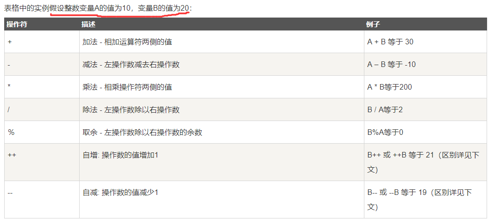

[toc]

# Java学习笔记1-基础语法

这篇文章主要是对自己的java语言知识的梳理。也是对自己以前写的java笔记的梳理。


## 变量

### 定义变量

```java
//定义变量
byte a = 100;
short s = 100;
int a = 1000;
long a = 100L;    //为long类型变量赋值时，需在数值的后面加上大写的L，表示该类型为long类型。
float f1 = 234.5f;  //为float类型变量赋值时，需在数值的后面加上F或f，表示该类型为float类型。
double d1 = 123.4;
boolean one = true;
char letter = 'A';
```

### 基本数据类型

<font color="red">
在java中，定义变量时必须要先声明变量的数据类型。数据类型有4种共8个。
</font>

```
> 整数类型（byte ， short ， int , long）
> byte ：占1个字节（8位），范围：-128（-2^7）~ 127（2^7-1）
> short ：占2个字节（16位），范围：-32768（-2^15）~ 32767（2^15 - 1）
> int : 占4个字节（32位），范围: -2^31 ~ 2^31 - 1
> long : 占8个字节（64位），范围：-2^63 ~ 2^63 -1

> 浮点数类型（float ， double）
> float : 用于存储小数数值。
> double : 既可以存储小数，也可以存储整数。

> 字符型（char）
> char : 用于存储一个单一的字符，最小值是 \u0000（即为0）；最大值是 \uffff（即为65,535）

> 布尔型（boolean）
> boolean : 只有两个取值：true 和 false；

```

- 1个字节占8位二进制。
- 整数范围和字节的关系：范围是 -2^N ~ 2^N - 1

下图是数据类型的默认值：


### 数据类型之间的转换

<font color="red">在java程序中，一种数据类型的值赋给另一种类型的变量时，需要进行数据类型转换。</font>

数据类型转换规则：
- 整型、浮点型、字符型数据可以进行混合运算。它们会先转化为同一类型，然后进行运算。
- 不能对boolean类型进行类型转换
- 容量大的类型转换为容量小的类型时必须使用强制类型转换.
- 转换过程中可能导致数据溢出或损失精度.

数据类型转换有两种方式：
- 自动类型转换，目标数据类型的范围大于源数据类型的范围时。
- 强制类型转换，当两种类型彼此不兼容，或者目标数据类型的范围小于源数据类型时，需要使用强制类型转换。

```java
//下面是自动类型转换
byte b = 100;
int a = b;  // byte -> int

//下面是强制数据类型转换的写法
int c=122;
byte d=(byte)c;   //int -> byte , 会导致数据精度的损失。
```

### 变量的作用域

变量需要在它的作用范围内才可以被使用，这个作用范围就是变量的作用域。

<font color="red">
变量一定会定义在某一对大括号中，这个大括号包括的区域就是该变量的作用域。
</font>


### 变量种类

在java中有三种类型的变量。局部变量，成员变量，类变量。

局部变量（方法或代码块内部的变量）
1. 局部变量声明在方法中或者代码块中.
2. 局部变量在方法、代码块被执行的时候创建，当方法或代码块执行完成后，局部变量也会被销毁；
3. 局部变量是在栈上分配的.
4. 局部变量没有默认值，所以局部变量被声明后，必须经过初始化，才可以使用。


成员变量（实例变量）
1. 成员变量声明在类中，但在类的方法外；
2. 成员变量在对象创建的时候创建，在对象被销毁的时候销毁；
3. 成员变量具有默认值。数值型变量的默认值是0，布尔型变量的默认值是false，引用类型变量的默认值是null。


类变量（静态变量）：
1. 类变量和成员变量的区别是static修饰符。
1. 以static修饰符声明的成员变量，但必须在方法和语句块之外。
2. 类变量在程序开始时创建，在程序结束时销毁。
3. 数值型默认值是0，布尔型默认值是false，引用类型默认值是null。
4. 静态变量是属于类的，对类的实例化对象是共享这一份静态变量的。


## 运算符

运算符是控制变量与变量之间如何进行运算。运算符有以下几种：

> 1.算术运算符:



前缀(++a,--a): 先进行自增或者自减运算，再进行表达式运算。
后缀(a++,a--): 先进行表达式运算，再进行自增或者自减运算.

> 2.关系运算符:


> 3.位运算符:


> 4.逻辑运算符：


> 5.赋值运算符：


> 6.Java运算符优先级


## 条件语句

###  if语句

语法格式如下：
```java
//if的用法如下：
if(布尔表达式)
{
   //如果布尔表达式为true将执行的语句
}

//if…else 的用法如下：
if(布尔表达式){
   //如果布尔表达式的值为true
}else{
   //如果布尔表达式的值为false
}

//if...elseif...else 语句的用法：
if(布尔表达式 1){
   //如果布尔表达式 1的值为true执行代码
}else if(布尔表达式 2){
   //如果布尔表达式 2的值为true执行代码
}else if(布尔表达式 3){
   //如果布尔表达式 3的值为true执行代码
}else {
   //如果以上布尔表达式都不为true执行代码
}
```

### switch 条件语句

语法格式如下：
```java
switch(expression){
    case value :
       //语句
       break; //可选
    case value :
       //语句
       break; //可选
    //你可以有任意数量的case语句
    default : //可选
       //语句
}
```

1. default分支 在没有 case 语句的值和变量值相等的时候执行，default 分支不需要 break 语句。
2. 如果当前匹配成功的 case 语句块没有 break 语句，则从当前 case 开始，后续所有 case 的值都会输出，如果后续的 case 语句块有 break 语句则会跳出判断。

## 循环语句

### while 循环,do…while 循环

语法：
```java
while( 布尔表达式 ) {
//若布尔表达式为 true，则语句块一直循环
}

do {
//先执行一次do语句,若布尔表达式的值为 true，则语句块一直循环
}while(布尔表达式);
```

<font color="red">do…while 循环和 while 循环相似，不同的是，do…while 循环至少会执行一次。</font>

### for循环

语法格式如下：
```java
for(初始化; 布尔表达式; 循环控制变量) {
    //循环体代码语句
}

//for循环步骤：
//1.最先执行初始化。
//2.然后，检测布尔表达式的值。如果为 true，执行循环体。如果为false，循环终止，跳出循环。
//3.执行一次循环后，更新循环控制变量。
//4.再次检测布尔表达式。循环执行上面的过程。

//打印10次输出语句
for(int x = 10; x < 20; x = x+1) {
    System.out.print("value of x : " + x );
    System.out.print("\n");
}
```

### 增强for循环

>语法格式如下：
```java
for(声明新的局部变量 : 被访问的数组名)
{
   //代码句子
}

//例子：
int [] numbers = {10, 20, 30, 40, 50};
for(int x : numbers ){
    System.out.print( x );
    System.out.print(",");
}
String [] names ={"James", "Larry", "Tom", "Lacy"};
for( String name : names ) {
    System.out.print( name );
    System.out.print(",");
}
```

### break 关键字,continue 关键字:

>break 主要用在循环语句或者 switch 语句中，用来跳出最里层的循环语句。
>continue 作用是让程序立刻跳转到下一次循环。
>1. 在 for 循环中，continue 语句使程序立即跳转到更新语句。
>2. 在 while 或者 do…while 循环中，continue 语句使程序立即跳转到布尔表达式的判断语句。

例子：
```java
int [] numbers = {10, 20, 30, 40, 50};
for(int x : numbers ) {
    // x 等于 30 时跳出循环
    if( x == 30 ) {
    break;              //跳出for循环
    }
    System.out.print( x );
    System.out.print("\n");
}

for(int x : numbers ) {
    if( x == 30 ) {
        continue;      //当x为30时，跳过这次循环，相当与不打印30语句
    }
    System.out.print( x );
    System.out.print("\n");
}
```

## 数组

### 定义数组

```java
int[]  myList;         //推荐的定义方式
int  myList2[];        //C/C++ 语言风格的定义方式。不推荐使用

//定义数组myList3并初始化数组myList3
int[] myList3 = new int[10];
```

注意: 推荐使用`int[] myList;`的方式来数组变量。 

### 使用数组

```java
//打印数组内容，数组作为函数参数
public static void printArray(int[] a) {
    //增强for循环
    for(int x:a) {
        System.out.println("数组值"+x);
    }
}

//逆序输出数组，数组作为函数返回值
public static int[] reverse(int[] a) {
    int[] result = new int[a.length];    //创建一个与a数组等长的数组result
    for (int i = 0, j = result.length - 1; i < a.length; i++, j--) {   //把a数组的逆序赋值到result数组上
    result[j] = a[i];
    }
    return result;
}
```

### 多维数组

多维数组可以看成是数组中的每一个元素也是数组，例如二维数组就是一个特殊的一维数组，其每一行元素都是一个一维数组。

```java
//二维数组的定义
int[][] a = new int[2][3]; //创建一个2行3列的二维数组
int[][] b = new int[3][];  //这样创建的方式，只是数组中每个元素的长度不确定

//二维数组 a 可以看成每一行都是一个一维数组，相当于两个一维数组叠加在一起。其中每一个一维数组都有3个元素

//特别的二维数组定义并初始化
int[][] c = {{5,7,9},{12,14,16},{9,9,9},{2,2}}
```

```java
//例子：二维数组的赋值与遍历
public class test1 {
	  public static void main(String[] args) {
		  int[][] a=new int[3][3];  //创建数组a
		  for(int i=0;i<3;i++) {    //二维数组的赋值
			 for(int j=0;j<3;j++) {
				a[i][j]=i+j;
			 }
		  }
		  for(int i=0;i<3;i++) {    //二维数组的遍历
			 for(int j=0;j<3;j++) {
				System.out.print(" "+a[i][j]);
			 }
			 System.out.println(" ");
		  }
	  }
}

```


## 方法（函数）

方法又名函数，是语句的集合，是实现一种功能而组成的代码组合。方法创建于类中，可以在其他地方被引用。

### 方法定义

```java
//语法
修饰符 返回值类型 方法名(参数类型 参数名){
    ...
    方法体
    ...
    return 返回值;
}

/*
1. 修饰符：定义了该方法的访问类型。
2. 返回值类型 ：方法中返回值的数据类型。若无返回值可以写成void
3. 方法名：方法的名称
4. 参数类型：当方法被调用时，传递值给参数。这个值被称为实参或变量。参数是可选的，方法可以不包含任何参数。
5. 方法体：方法体包含具体的语句代码。
*/

public static int max(int num1, int num2) {
   int result;
   if (num1 > num2)
      result = num1;
   else
      result = num2;
   return result; //返回值
}
```

### 方法调用

1. 当方法有返回值的时候，方法调用通常被当做一个值。例如：
int larger = max(30, 40);
2. 如果方法返回值类型是void（无返回值）,方法调用一定是一条语句。例如：
System.out.println("欢迎访问菜鸟教程！");

### 方法的重载

1. 创建两个有相同名字但参数不同的方法，这叫做方法重载。

```java
//下面的两个max方法有相同名字但参数不同：
public static int max(int num1, int num2) {
   int result;
   if (num1 > num2)
      result = num1;
   else
      result = num2;
   return result; //返回值
}
public static double max(double num1, double num2) {
  if (num1 > num2)
    return num1;
  else
    return num2;
}
```

### 构造方法

构造方法的作用是初始化类的，可以在构造方法中对一个类的成员变量赋初值，或者在构造方法中执行其它必要的步骤来创建一个完整的对象。

构造方法是没有返回值。

```java
// 一个简单的构造函数
class MyClass {
  int x;
  // 以下是构造方法,构造方法没有返回值，对x成员变量进行初始化。
  MyClass() {
    x = 10;
  }
}
//-------
public class ConsDemo {
   public static void main(String args[]) {
      MyClass t1 = new MyClass();    //实例化类对象
      System.out.println(t1.x);   //t1.x的值为10
   }
}
```

>所有的类都有构造方法，因为Java自动提供了一个默认构造方法.
>类为 public，构造函数也为 public；类改为 private，构造函数也改为 private
>一旦你定义了自己的构造方法，默认构造方法就会失效。

