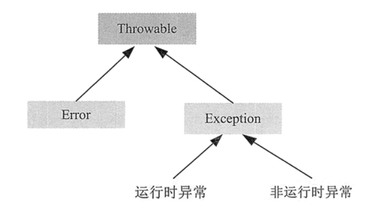
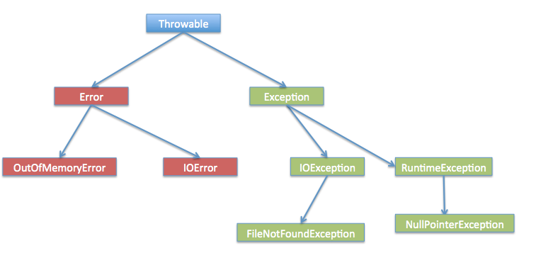
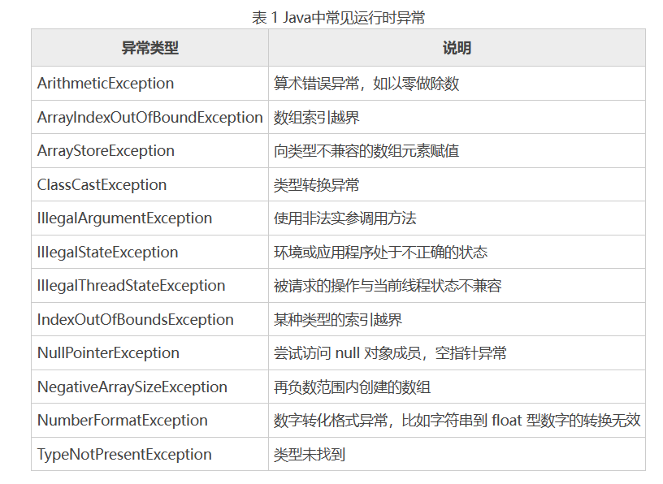
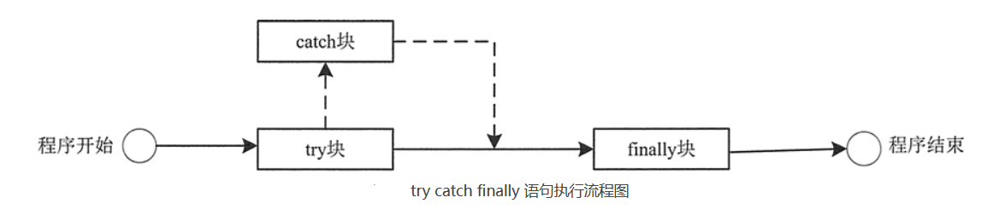

[toc]

# Java笔记10-异常 Exception

异常是在运行程序时产生的一种异常情况。如：文件找不到、网络连接失败、非法参数等。

在 Java 中一个异常的产生，主要有如下三种原因：
1. Java 虚拟机内部错误，从而产生的异常。
2. 编写的程序代码中的错误所产生的异常，例如空指针异常、数组越界异常等。
3. 通过 throw 语句手动生成的异常，一般用来告知该方法的调用者一些必要信息。

Java 通过面向对象的方法来处理异常。在一个方法的运行过程中，如果发生了异常，则这个方法会产生一个异常对象，并把它交给当前系统，当前系统会寻找相应的代码来处理这一异常对象。

其中把生成异常对象，并把它交给当前系统的过程称为拋出（throw）异常。当前系统寻找相应的代码来处理这一异常对象，这一个过程称为捕获（catch）异常。


## 异常类型

为了能够及时有效地处理程序中的运行错误，Java 专门引入了异常类。

在 Java 中所有异常类型都是 java.lang.Throwable 类的子类。Throwable 类下有两个异常分支 Exception 和 Error。如下图所示。



> Throwable 类

Throwable 类是 Java 语言中所有错误或异常的顶层父类，其他类都继承于该类。Throwable类有两个子类，Error类（错误）和 Exception类（异常），各自都包含大量子类。 

> Error 类

Error（错误）是程序无法处理的错误，表示运行应用程序中较严重问题。大多数错误与代码编写者执行的操作无关。例如，Java 虚拟机运行错误。这些错误是不可查的，因为它们在程序代码的控制和处理能力之外。

> Exception类

Exception（异常）是程序代码运行时发生的各种不期望发生的事件。可以被Java异常处理机制使用，是程序本身可以捕获并且可以处理的异常。

> Error 和 Exception 的区别

Exception 和 Error 体现了 Java 平台设计者对不同异常情况的分类。

Exception 是程序正常运行过程中可以预料到的意外情况，并且应该被开发者捕获，进行相应的处理。

Error 表示系统级的错误和程序不必处理的异常，比如内存溢出，不可能指望程序能处理这样的情况，所以不需要被开发者处理。

### 运行时异常



运行时异常指的是，程序代码在编译期间无法发现，在运行的过程中就能发现并处理的异常。一般是由程序逻辑错误引起的，因为编译器无法检查出程序逻辑错误。

RuntimeException 类及其子类都是运行时异常类。例如空指针异常、下标越界异常等。

当程序中可能出现运行时异常，即使没有用 try-catch 语句捕获它，也没有用 throws 子句声明抛出它，程序代码也会编译通过。



### 非运行时异常（编译异常）


非运行时异常指的是，程序代码在编译期间就能发现并处理的异常。一般是由程序语法错误引起的，因为编译器能检查出程序语法错误。

当程序中出现非运行时异常，要么用try-catch 语句捕获它，要么用 throws 子句声明抛出它，否则程序代码的编译不会通过。

RuntimeException 类及其子类以外的异常都是非运行类异常。例如 IOException、SQLException 等以及用户自定义的 Exception 异常等


## 异常处理的机制

在Java程序中，异常处理机制为：抛出异常，捕捉异常。

> 抛出异常

当一个方法中出现错误引发异常时，方法会创建异常对象并交付给运行时系统，运行时系统负责在整个java系统中寻找处置异常的代码并执行。

这个过程就是抛出异常，即自己不处理异常，而是交给其他代码来处理异常。

> 捕捉异常

在方法抛出异常之后，运行时系统将转为寻找合适的异常处理器。当异常处理器所能处理的异常类型与方法抛出的异常类型相符时，即为合适的异常处理器。

当运行时系统找到合适异常处理器时，会调用合适异常处理器的方法，开始捕捉异常并处理。若运行时系统找不到合适的异常处理器，则运行时系统终止。即Java程序终止

## 异常处理的五个关键字

总体来说，由于运行时异常在编译期间无法发现。Java 规定，运行时异常将由 Java 运行时系统自动抛出，并且允许应用程序忽略运行时异常。

对于所有的非运行异常，Java 规定：方法必须手动捕捉，或者声明抛出方法之外。

Java 的手动异常处理通过 5 个关键字来实现：try catch、throw、throws 和 finally。

### try catch语句

在 Java 中通常采用 try catch 语句来捕获异常并处理。语法格式如下

```java
try {
    // 可能发生异常的语句
} catch(ExceptionType e) {
    // 处理异常语句
    e.printStackTrace(); //输出异常的类型、性质、栈层次及出现在程序中的位置
}
```

如果 try 语句块中发生异常，那么一个相应的异常对象就会被拋出，然后 catch 语句就会依据所拋出异常对象的类型进行捕获，并处理。处理之后，程序会跳过 try 语句块中剩余的语句，转到 catch 语句块后面的第一条语句开始执行。

如果 try 语句块中没有异常发生，那么 try 块正常结束，后面的 catch 语句块被跳过，程序将从 catch 语句块后的第一条语句开始执行。

> 多重catch语句

如果 try 代码块中有很多语句会发生异常，而且发生的异常种类又很多。那么可以在 try 后面跟有多个 catch 代码块。

```java
try {
    // 可能会发生异常的语句
} catch(ExceptionType e) {
    // 处理异常语句
} catch(ExceptionType e) {
    // 处理异常语句
} catch(ExceptionType e) {
    // 处理异常语句
    ...
}
```

注意：在多个 catch 代码块的情况下，当一个 catch 代码块捕获到一个异常时，其它的 catch 代码块就不再进行匹配。另外，当捕获的多个异常类之间存在父子关系时，捕获异常时一般先捕获子类，再捕获父类。所以子类异常必须在父类异常的前面，否则子类捕获不到。

例子
```java
public class Test03 {
    public static void main(String[] args) {
        Date date = readDate();
    }
    public static Date readDate() {
        try {
            //此处可能发生异常
            return date;
        } catch (FileNotFoundException e) {
            System.out.println("处理FileNotFoundException...");
            e.printStackTrace();
        } catch (IOException e) {
            System.out.println("处理IOException...");
            e.printStackTrace();
        } catch (ParseException e) {
            System.out.println("处理ParseException...");
            e.printStackTrace();
        }
        return null;
    }
}
```

### finally语句

finally 语句可以与前面介绍的 try catch 语句块匹配使用，即无论try catch 语句块中是否发生异常，finally 语句块中的代码都会被执行。

finally语句块总是会被执行。它主要用于做一些清理工作(如关闭数据库连接、网络连接和磁盘文件等)。

<font color="red">注意：当finally块执行完成之后，才会回来执行 try 或者 catch 块中的return语句。</font>

> 语法格式如下所示

```java
// 方式1
try {
    // 可能会发生异常的语句
} catch(ExceptionType e) {
    // 处理异常语句
} finally {
    // 清理代码块
}

// 方式2，很少见
try {
    // 逻辑代码块
} finally {
    // 清理代码块
}
```

###  try catch finally 语句块的执行顺序

1. 当 try 没有捕获到异常时：try 语句块中的语句逐一被执行，程序将跳过 catch 语句块，执行 finally 语句块和其后的语句；
2. 当 try 中某一条语句出现异常时，程序将跳到 catch 语句块，并与 catch 语句块逐一匹配，找到与之对应的处理程序，其他的 catch 语句块将不会被执行。而 try 语句块中，出现异常之后的语句也不会被执行，catch 语句块执行完后，执行 finally 语句块里的语句，最后执行 finally 语句块后面的语句。
3. 如果try语句出现异常，并且没有处理此异常的 catch 语句块时。此异常将会抛给 JVM 处理，finally 语句块里的语句还是会被执行，但 finally 语句块后的语句不会被执行。
4. 只有 try 块是必需的，catch 块和 finally 块都是可选的，但 catch 块和 finally 块至少出现其中之一，也可以同时出现；
5. finally 块必须位于所有的 catch 块之后。



> 例子

```java
public class Test {
    public static void main(String[] args) {
        try {
            //程序语句
        } catch (Exception e) {
            e.printStackTrace();
        } finally {
            System.out.println("执行 finally 语句");
        }
        //其他语句
    }
}

```

### try catch finally 中 return 的执行顺序

```java
public class Test {
    public static void main(String[] args) {
        System.out.println(test());
    }
    private static int test() {
        int temp = 1;
        try {
            System.out.println(temp);
            return ++temp;
        } catch (Exception e) {
            System.out.println(temp);
            return ++temp;
        } finally {
            ++temp;
            System.out.println(temp);
        }
    }
}

//运行结果：1 3 2
//分析
执行顺序为：
输出try里面的初始temp：1；
++temp之后，temp=2；
保存return里面temp的值：2；
执行finally的语句temp：3，输出temp：3；
返回try中的return语句，返回存在里面的temp的值：2；
输出temp：2。
```

知识点：
1. 若try代码块内含有return，同时存在finally代码块（代码块内无return）时，先保存return结果，然后执行finally，最后返回return结果。
2. 若try代码块内含有return，同时finally代码块内含有return时，此时finally代码块内的return值将覆盖掉try代码块中的return值，然后返回覆盖后的return结果。

### throws 声明异常

若某个方法内可能会发生异常。而方法内部又不想处理这些异常。则可以再方法声明上添加 throws 关键字。表示将方法内部的异常抛出到方法的外部，由方法外面的系统程序去进行处理。

throws 语句用在方法定义时声明该方法要抛出的异常类型。

<font color="red">注意：若不通过try catch代码块处理方法内抛出的异常。也可以通过throws继续向上抛出异常。</font>

> throws 语法格式如下

```java
 public void method_name(paramList) throws Exception 1,Exception2,…{
    //....方法内部代码
 }

// method_name 表示方法名
// paramList 表示参数列表
// Exception 1，Exception2，… 表示多个异常类
```

> throws 声名异常的规则

1. 如果当前方法不知道如何处理这种类型的异常，使用 throws 声明抛出异常的类型。如果抛出的是 Exception 异常类型，则该方法被声明为抛出所有的异常。
2. 使用 throws 关键字将异常抛给调用者后，如果调用者不想处理该异常，可以继续向上抛出，但最终要有能够处理该异常的调用者。例如 main 方法也可以使用 throws 声明抛出异常，该异常将交给 JVM 处理。
3. 如果所有方法都层层上抛获取的异常，最终 JVM 会进行处理，处理也很简单，就是打印异常消息和堆栈信息。并中止程序运行，这就是程序在遇到某些异常后自动结束的原因。
4. 如果一个方法内部可能出现非运行时异常，要么用 try-catch 语句捕获，要么用 throws 子句声明将它抛出，否则程序编译不通过。

> 例子

在下面的例子中，readFile方法声明抛出一个异常，调用者main方法可以手动处理该异常，也可以继续向上抛出异常。

```java
public class Test {
    public void readFile() throws IOException {
        // 定义方法时声明异常
        // 方法内可能产生异常
    }
}

public class Test2 {
    public static void main(String[] args) {
        Test t = new Test();
        //手动处理readFile方法抛出的异常
        try {
            t.readFile(); //调用 readFHe()方法
        } catch (IOException e) {
            // 捕获异常
            System.out.println(e);
        }
    }
}
```

### throw 拋出异常

通过关键字 throw 可以手动抛出一个异常对象。若在方法中使用，则该方法要用 throws 关键字声明该方法会有异常。或者使用try catch代码块捕获处理这个异常。

> 语法格式如下

```java
throw new MyExceptionObject;

//MyExceptionObject 必须是 Throwable 类或其子类的对象。
```

- throw 抛出的只能是 Throwable类 或者其子类的实例对象。

> throw 抛出异常的程序逻辑

1. 当 throw 语句执行时，它后面的语句将不执行。
2. 此时程序转向调用者程序，寻找与之相匹配的 catch 语句，执行相应的异常处理程序。
3. 如果没有找到相匹配的 catch 语句，则再转向上一层的调用程序。这样逐层向上，直到最外层的异常处理程序终止程序并打印出调用栈情况。

> 例子

```java
public class Test {
    public void validateUserName(String username) {
        // 判断用户名长度是否大于8位
        if (username.length() > 8) {
            throw new IllegalArgumentException("用户名长度必须大于 8 位！");
        }
    }
    public static void main(String[] args) {
        Test te = new Test();
        try {
            te.validateUserName(username);
        } catch (IllegalArgumentException e) {
            System.out.println(e);
        }
    }
}
```

### throws与throw的区别

throws 关键字和 throw 关键字在使用上的几点区别如下
* throws 用来声明一个方法可能抛出的所有异常信息，表示出现异常的一种可能性，但并不一定会发生这些异常；throw 则是指拋出的一个具体的异常对象，执行 throw 则一定抛出了某个异常对象。
* 通常在一个方法（类）的声明处通过 throws 声明方法（类）可能拋出的异常类型，而在方法（类）内部通过 throw 抛出一个具体的异常对象。
* throws 通常不用显示地捕获异常，由系统自动将所有捕获的异常信息抛给上级方法； throw 则需要用户自己捕获相关的异常，而后再对其进行相关包装，最后将包装后的异常信息抛出。

## 常见异常

> 运行时异常

- java.lang.ArrayIndexOutOfBoundsException
数组索引越界异常。当索引值为负数或大于等于数组大小时抛出。
- java.lang.ArithmeticException
算术条件异常。譬如：整数除零等。
- java.lang.NullPointerException
空指针异常。
- java.lang.ClassNotFoundException
找不到类异常。当程序根据字符串形式的类名构造类，而在遍历之后找不到对应名称的 class 文件时，抛出该异常。
- java.lang.IllegalArgumentException
非法参数异常

> 非运行时异常

- IOException：操作输入流和输出流时可能出现的异常。
- EOFException 文件已结束异常。
- FileNotFoundException 文件未找到异常。
- ClassCastException 类型转换异常类
- SQLException 操作数据库异常类
- NoSuchFieldException 字段未找到异常


## 自定义异常

使用 Java 内置的异常类可以描述在编程时出现的大部分异常情况。除此之外，用户还可以自定义异常。用户自定义异常类，只需继承 Exception 类即可。

> 创建自定义异常类

```java
class MyException extends Exception {
    public MyException() {
        super();
    }
    public MyException(String s) {
        super(s);
    }
}
```

自定义异常类一般包含两个构造方法：一个是无参的默认构造方法，另一个构造方法以字符串的形式接收一个定制的异常消息，并将该消息传递给父类的构造方法。

<font color="red">注意：因为自定义异常继承自 Exception 类，因此自定义异常类中已经包含了父类所有的属性和方法。</font>

> 使用自定义异常类的步骤。
1. 创建自定义异常类。
2. 在方法中通过 throw 关键字抛出异常对象。
3. 如果在当前抛出异常的方法中处理异常，可以使用 try-catch 语句捕获并处理；否则在方法的声明处通过 throws 关键字指明要抛出异常给方法调用者。
4. 在出现异常方法的调用者中捕获并处理异常。

```java
public class Test07 {
    public static void main(String[] args) {
        int age;
        Scanner input = new Scanner(System.in);
        System.out.println("请输入您的年龄：");
        try {
            age = input.nextInt();    // 获取年龄
            if(age < 0) {
                throw new MyException("您输入的年龄为负数！输入有误！");
            } else if(age > 100) {
                throw new MyException("您输入的年龄大于100！输入有误！");
            } else {
                System.out.println("您的年龄为："+age);
            }
        } catch(InputMismatchException e1) {
            System.out.println("输入的年龄不是数字！");
        } catch(MyException e2) {
            System.out.println(e2.getMessage());
        }
    }
}
```

