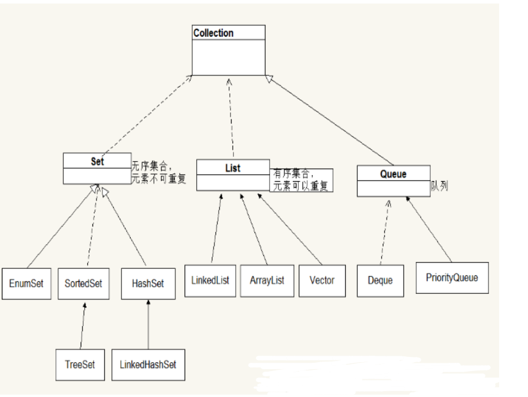

[toc]


# Java笔记11-集合

为了保存数量不确定的数据，以及保存具有映射关系的数据（键值对），Java 提供了集合类。

集合类和数组不一样，数组元素既可以是基本类型的值，也可以是对象（实际上保存的是对象的引用变量），而集合里只能保存对象（实际上只是保存对象的引用变量，或者说是对象的地址）。

Java 所有的集合类都位于 java.util 包下，提供了一个表示和操作对象集合的统一构架，包含大量集合接口，以及这些接口的实现类和操作它们的算法。

Java集合按照存储结构分为单列集合与双列集合。
- 单列集合是按照线性列表的方式存储元素，其根接口是Collection。
- 双列集合是按照键值对的方式存储元素，其根接口是Map.


## Collection接口

Collection 接口是 List、Set 和 Queue 接口的父接口，通常情况下不直接使用。Collection 接口定义了一些通用的方法，通过这些方法可以实现对集合的基本操作。Collection 接口中定义的方法既可用于操作 Set 集合，也可用于操作 List 和 Queue 集合。



>List集合存储的元素有序，可重复.
>Set集合存储的元素无序，不可重复.


例子：由于 Collection 是接口，不能对其实例化，所以上述代码中使用了 Collection 接口的 ArrayList 实现类来调用 Collection 的方法。
```java
public static void main(String[] args) {
    ArrayList list1 = new ArrayList(); // 创建集合 list1
    ArrayList list2 = new ArrayList(); // 创建集合 list2
    list1.add("one");
    list1.add("two");
    list1.add("three");
    System.out.println("list1 集合：" + list1.size()); // 输出list1中的元素数量
    list2.add("two");
    list2.add("four");
    list2.add("six");
    System.out.println("list2 集合：" + list2.size()); // 输出list2中的元素数量
    list2.remove(2); // 删除第 3 个元素
    System.out.println(" removeAll() 方法之后 list2 集合中的元素数量：" + list2.size());
    System.out.println("list2 集合中的元素如下：");
    Iterator it1 = list2.iterator();
    while (it1.hasNext()) {
        System.out.print(it1.next() + "、");
    }
    list1.removeAll(list2);
    System.out.println("\nremoveAll() 方法之后 list1 集合中的元素数量：" + list1.size());
    System.out.println("list1 集合中的元素如下：");
    Iterator it2 = list1.iterator();
    while (it2.hasNext()) {
        System.out.print(it2.next() + "、");
    }
}   
```

## List接口

List 是一个有序、可重复的集合，集合中每个元素都有其对应的顺序索引。List 集合允许使用重复元素，可以通过索引来访问指定位置的集合元素。List 集合默认按元素的添加顺序设置元素的索引，第一个添加到 List 集合中的元素的索引为 0，第二个为 1，依此类推。

List 实现了 Collection 接口，它主要有两个常用的实现类：ArrayList 类和 LinkedList 类。

List集合常用方法：
方法 | 描述
------------ | -------------
void add(int index,Object obj)  | 把元素obj加入到集合的index处
boolean addAll(int index,Collection c)  | 把集合c的元素加入到index处
Object get(int index) |  返回index处的元素
Object remove(int index) | 删除index处的元素
Object set(int index,Object obj) | 把index处的元素替换为obj对象，并把替换后的元素返回。
int indexOf(Object obj) | 返回obj对象在集合中的位置
int lastIndexOf(Object obj) | 返回obj对象在集合的最后一个的位置


### ArrayList 类

ArrayList是List接口的一个实现类。可以把其看成一个长度可变的数组对象。它还提供了快速基于索引访问元素的方式，对尾部成员的增加和删除支持较好。使用 ArrayList 创建的集合，允许对集合中的元素进行快速的随机访问，不过，向 ArrayList 中插入与删除元素的速度相对较慢。

ArrayList 类的常用构造方法有如下两种重载形式：

```java
//构造一个初始容量为 10 的空列表。
ArrayList();
//构造一个包含指定 Collection 元素的列表,这些元素是按照该 Collection 的迭代器返回它们的顺序排列的。
ArrayList(Collection<?extends E>c);
```


例子
```java
ArrayList ar =new ArrayList();   //创建ArrayList集合
//向集合中添加元素
ar.add("xiaoming");
ar.add("xiaohua");
ar.add("xiaoqiang");
System.out.println("此时集合的长度 "+ar.size());
// 循环遍历集合，输出集合元素
for (int i = 0; i < ar.size(); i++) {
    System.out.println(ar.get(i));
}
```

### LinkedList类

LinkedList是List接口的一个实现类。可以把其看成一个长度可变的双向循环链表。

这种结构的优点是便于向集合中插入或者删除元素。需要频繁向集合中插入和删除元素时，使用 LinkedList 类比 ArrayList 类效果高，但是 LinkedList 类随机访问元素的速度则相对较慢。这里的随机访问是指检索集合中特定索引位置的元素。

LinkedList 类除了包含 Collection 接口和 List 接口中的所有方法之外，还有下图所示的方法。


例子
```java
LinkedList link=new LinkedList();   //创建linklist集合
link.add("xiao");
link.add("ming");
link.add("hua");
link.add("qiang");
//打印集合中的元素
System.out.println(link.toString());

//运行结果：[xiao, ming, hua, qiang]
```

### ArrayList 类和 LinkedList 类的区别

ArrayList 与 LinkedList 都是 List 接口的实现类，因此都实现了 List接口中的抽象方法，只是实现的方式有所不同。

* ArrayList 是基于动态数组数据结构的实现，访问元素速度优于 LinkedList。
* LinkedList 是基于链表数据结构的实现，占用的内存空间比较大，但在批量插入或删除数据时优于 ArrayList。


## Set接口

Set集合的特点是存储的元素无序,不可重复。也就是说 Set 集合中的对象不按特定的方式排序，只是简单地把对象加入集合。Set 集合中不能包含重复的对象，并且最多只允许包含一个 null 元素。

Set 实现了 Collection 接口，它主要有两个常用的实现类：HashSet 类和 TreeSet类。
- HashSet是根据对象的哈希值来确定元素在集合的存储位置，有好的存取，查找性能。
- TreeSet是以二叉树的方式来存储元素,可以对集合的元素进行排序。

### HashSet 类

<font color="red">HashSet是Set接口的一个实现类。其根据对象的Hash值来确定元素在集合的存储位置，因此具有很好的存取和查找性能。允许包含值为null的元素，但最多只能一个。</font>

HashSet 具有以下特点：
* HashSet集合不出现重复元素。
* 不能保证元素的排列顺序，顺序可能与添加顺序不同，顺序也有可能发生变化。
* HashSet不是同步的，如果多个线程同时访问或修改一个HashSet，则必须通过其他代码的方式来保证其同步。
* 集合元素值可以是 null。但最多只能一个。

HashSet集合添加对象的过程：


* 若两个对象的 hashCode 值相等且通过 equals() 方法比较返回结果为 true，则 HashSet 集合认为两个元素相等。
* 如果向 Set 集合中添加两个相同的元素，则后添加的会覆盖前面添加的元素，即在 Set 集合中不会出现相同的元素。
* 因此当HashSet集合存储某个对象类型的元素时，需要重写该对象的hashCode(),equals()方法。

HashSet 类的常用构造方法重载形式如下
```java
//构造一个新的空的 Set 集合。
HashSet();
//构造一个包含指定Collection 集合元素的新 Set 集合。其中，“< >”中的 extends 表示 HashSet 的父类，即指明该 Set 集合中存放的集合元素类型。c 表示其中的元素将被存放在此 Set 集合中。
HashSet(Collection<? extends E>c);
```

例子
```java
public class human {
	private String name;
	private int age;
	
	human(String name,int age){
		this.name=name;
		this.age=age;
	}
	//重写toString方法
	public String toString() {
		return name+": "+age;
	}
	//重写hashCode方法
	public int hashCode() {
		return name.hashCode();
	}
	//重写equals方法
	public boolean equals(Object obj) {
		if (this == obj)
			return true;
		if (obj == null)
			return false;
		human other = (human) obj;
		if (name == null) {
			if (other.name != null)
				return false;
		} else if (!name.equals(other.name))
			return false;
		return true;
	}
	public static void main(String[] args) {
		HashSet hSet=new HashSet();
		hSet.add(new human("xiaoming",22));
		hSet.add(new human("xiaoqiang",23));
		hSet.add(new human("xiaohua",23));
		hSet.add(new human("xiaoqiang",23));
		hSet.add(new human("xiaoming",22));
		System.out.println(hSet);
	}
}
```


### TreeSet 类

TreeSet 类同时实现了SortedSet 接口。而 SortedSet 接口是 Set 接口的子接口，可以实现对集合进行自然排序，

因此TreeSet是以平衡的二叉排序树的方式来存储元素,可以对集合的元素进行排序。存储的元素会按照从小到大排序，并且去除重复元素。

TreeSet排序原理：
* TreeSet 只能对实现了 Comparable 接口的类对象进行排序。
* TreeSet集合在插入元素时，通过调用compareTo()方法，对集合中的元素进行比较，从而进行排序。因此，当TreeSet集合存储对象类型数据时，需要该对象实现Comparable接口，并重写compareTo()方法

TreeSet 类除了实现 Collection 接口的所有方法之外，还提供了如图所示的方法。


例子
```java
//实现Comparable接口
public class human implements Comparable{
	private String name;
	private int age;
	human(String name,int age){
		this.name=name;
		this.age=age;
	}
	//重写该方法
	public String toString() {
		return name+"： "+age;
	}
	//重写Comparable接口的compareTo方法
	public int compareTo(Object o) {
		human h=(human)o;     //强制转换为human类型
		if(this.age==h.age) {    
			return 0;     //表示相等
		}else if(this.age>h.age){
			return 1;    //从小到大，升序排序
		}else {
			return -1;
		}
	}
	public static void main(String[] args) {
		TreeSet tSet=new TreeSet();
		tSet.add(new human("xiaoming",22));
		tSet.add(new human("xiaoqiang",24));
		tSet.add(new human("xiaohua",23));
		tSet.add(new human("xiaohua",23));
		System.out.println(tSet);
	}
}
```


## Map接口

Map 是一种键-值对（key-value）集合，Map 集合中的每一个元素都包含一个键（key）对象和一个值（value）对象。用于保存具有映射关系的数据。

Map 中的 key 和 value 之间存在单向一对一关系，即通过指定的 key，总能找到唯一的、确定的 value。从 Map 中取出数据时，只要给出指定的 key，就可以取出对应的 value。

因此 Map接口是用键值对方式来存储元素，其有两个重要实现类，HashMap,TreeMap。其中，HashMap 类按哈希算法来存取键对象，而 TreeMap 类可以对键对象进行排序。

Map 接口中提供的常用方法如表图所示。


例子，由于Map是接口，不能对其实例化，所以上述代码用 HashMap 实现类来调用 Map 的方法。
```java
public class Test09 {
    public static void main(String[] args) {
        HashMap users = new HashMap();
        users.put("11", "张浩太"); // 将学生信息键值对存储到Map中
        users.put("22", "刘思诚");
        users.put("33", "王强文");
        users.put("44", "李国量");
        users.put("55", "王路路");
        System.out.println("******** 学生列表 ********");
        Iterator it = users.keySet().iterator();
        while (it.hasNext()) {
            // 遍历 Map
            Object key = it.next();
            Object val = users.get(key);
            System.out.println("学号：" + key + "，姓名:" + val);
        }
        Scanner input = new Scanner(System.in);
        System.out.println("请输入要删除的学号：");
        int num = input.nextInt();
        if (users.containsKey(String.valueOf(num))) { // 判断是否包含指定键
            users.remove(String.valueOf(num)); // 如果包含就删除
        } else {
            System.out.println("该学生不存在！");
        }
        System.out.println("******** 学生列表 ********");
        it = users.keySet().iterator();
        while (it.hasNext()) {
            Object key = it.next();
            Object val = users.get(key);
            System.out.println("学号：" + key + "，姓名：" + val);
        }
    }
}
```


### HashMap集合

HashMap集合用于存储键值对关系，且保证没有重复的key值。

**遍历HashMap集合元素的两种方式：①先遍历集合中的所有key,再根据key来获取value。②先获取集合中的映射关系，再根据关系取出key和value。**

```java
public static void main(String[] args) {
	HashMap hm=new HashMap ();
        hm.put(1, "小明");
        hm.put(2, "小华");
        hm.put(3, "小强");
        System.out.println(hm);
        //遍历HashMap集合的方式1：
        //先获取集合的所有key序列
        //再根据key序列找到value，用迭代器进行遍历
        Set ks=hm.keySet();
        Iterator ite=ks.iterator();    		
        while(ite.hasNext())  //判断该对象是否有下一个元素
        {	  
        	Object key=ite.next();   //获得一个key值
        	Object value=hm.get(key); //根据key序列找到value
        	System.out.println(key+":"+value);  
        }
        
        System.out.println("-------------");
        
        //遍历HashMap集合的方式2：
        //先获取集合中所有的映射关系
        //再从映射关系中取出key,value
        Set entryset=hm.entrySet();
        Iterator ite2=entryset.iterator();
        while(ite2.hasNext())  //判断该对象是否有下一个元素
        {	
        	Map.Entry entry=(Map.Entry)(ite2.next());   //获取某一个映射关系
        	Object key=entry.getKey(); //根据映射关系找到key值
        	Object value=entry.getValue(); //找到value
        	System.out.println(key+":"+value);  
        }
	}

/*
运行结果：
{1=小明, 2=小华, 3=小强}
1:小明
2:小华
3:小强
-------------
1:小明
2:小华
3:小强

*/
```

### TreeMap集合

TreeMap是通过二叉树的原理来保证键的唯一性。

TreeMap 要注意的事项：
1. 往TreeMap添加元素的时候，如果元素的键具备自然顺序，那么就会进行排序存储。
2. 往TreeMap添加元素的时候，如果元素的键不具备自然顺序特性， 那么键所属的类必须要实现Comparable接口，把键的比较规则定义在CompareTo方法上。
3. 往TreeMap添加元素的时候，如果元素的键不具备自然顺序特性，而且键所属的类也没有实现Comparable接口，那么就必须自定义比较器。

通过自定义比较器对所有的键进行排序

```java
//实现Comparator接口,重写compare方法
public class human implements Comparator{
	private String name;
	private int age;
	
	human(String name,int age){
		this.name=name;
		this.age=age;
	}
	//重写该方法
	public String toString() {
		return name+":"+age;
	}
	//重写该方法
	public int compare(Object o1, Object o2) {
		human h1=(human)o1;
		human h2=(human)o2;
		if(h1.age==h2.age) {    
			return 0;     //表示相等
		}else if(h1.age>h2.age){
			return 1;    //从小到大，升序排序
		}else {
			return -1;
		}
	}
	public static void main(String[] args) {
		human h1=new human("小明", 22);
		human h2=new human("小华", 19);
		human h3=new human("小强", 26);
		
		TreeMap tMap=new TreeMap();
		tMap.put(12, h1);
		tMap.put(2, h2);
		tMap.put(3, h3);
		
		Set ks=tMap.keySet();
        Iterator ite=ks.iterator();    		
        while(ite.hasNext())  //判断该对象是否有下一个元素
        {	  
        	Object key=ite.next();   //获得一个key值
        	Object value=tMap.get(key); //根据key序列找到value
        	System.out.println(key+":"+value);  
        }
	}
}

/*
运行结果：
2:小华:19
3:小强:26
12:小明:22
*/
```

### 遍历Map集合的四种方式

Map 有两组值，因此遍历时可以只遍历值的集合，也可以只遍历键的集合，也可以同时遍历。Map 以及实现 Map 的接口类（如 HashMap、TreeMap、LinkedHashMap、Hashtable 等）都可以用以下几种方式遍历。

1. 在 for 循环中使用 entrySet() 实现 Map 的遍历（最常见和最常用的）。

```java
public static void main(String[] args) {
    Map<String, String> map = new HashMap<String, String>();
    map.put("Java入门教程", "http://c.biancheng.net/java/");
    map.put("C语言入门教程", "http://c.biancheng.net/c/");
    for (Map.Entry<String, String> entry : map.entrySet()) {
        String mapKey = entry.getKey();
        String mapValue = entry.getValue();
        System.out.println(mapKey + "：" + mapValue);
    }
}
```

2. 使用 for-each 循环遍历 key 或者 values，一般适用于只需要 Map 中的 key 或者 value 时使用。性能上比 entrySet 较好。

```java
Map<String, String> map = new HashMap<String, String>();
map.put("Java入门教程", "http://c.biancheng.net/java/");
map.put("C语言入门教程", "http://c.biancheng.net/c/");
// 打印键集合
for (String key : map.keySet()) {
    System.out.println(key);
}
// 打印值集合
for (String value : map.values()) {
    System.out.println(value);
}
```

3. 使用迭代器（Iterator）遍历

```java
Map<String, String> map = new HashMap<String, String>();
map.put("Java入门教程", "http://c.biancheng.net/java/");
map.put("C语言入门教程", "http://c.biancheng.net/c/");
Iterator<Entry<String, String>> entries = map.entrySet().iterator();
while (entries.hasNext()) {
    Entry<String, String> entry = entries.next();
    String key = entry.getKey();
    String value = entry.getValue();
    System.out.println(key + ":" + value);
}
```

4. 通过键找值遍历，这种方式的效率比较低，因为本身从键取值是耗时的操作。

```java
for(String key : map.keySet()){
    String value = map.get(key);
    System.out.println(key+":"+value);
}
```


## Collections工具类

Collections 类是 Java 提供的一个操作 Set、List 和 Map 等集合的工具类。Collections 类提供了许多操作集合的静态方法，借助这些静态方法可以实现集合元素的排序、查找替换和复制等操作。

下面介绍 Collections 类中操作集合的常用方法。

### 排序（正向和逆向）

Collections 提供了如下方法用于对 List 集合元素进行排序。
* void reverse(List list)：对指定 List 集合元素进行逆向排序。
* void shuffle(List list)：对 List 集合元素进行随机排序（shuffle 方法模拟了“洗牌”动作）。
* void sort(List list)：根据元素的自然顺序对指定 List 集合的元素按升序进行排序。
* void sort(List list, Comparator c)：根据指定 Comparator 产生的顺序对 List 集合元素进行排序。
* void swap(List list, int i, int j)：将指定 List 集合中的 i 处元素和 j 处元素进行交换。
* void rotate(List list, int distance)：当 distance 为正数时，将 list 集合的后 distance 个元素“整体”移到前面；当 distance 为负数时，将 list 集合的前 distance 个元素“整体”移到后面。该方法不会改变集合的长度。

例子
```java
public class Test1 {
    public static void main(String[] args) {
        Scanner input = new Scanner(System.in);
        List prices = new ArrayList();
        for (int i = 0; i < 5; i++) {
            System.out.println("请输入第 " + (i + 1) + " 个商品的价格：");
            int p = input.nextInt();
            prices.add(Integer.valueOf(p)); // 将录入的价格保存到List集合中
        }
        Collections.sort(prices); // 调用sort()方法对集合进行排序
        System.out.println("价格从低到高的排列为：");
        for (int i = 0; i < prices.size(); i++) {
            System.out.print(prices.get(i) + "\t");
        }
    }
}
```


### 查找、替换操作

Collections 还提供了如下常用的用于查找、替换集合元素的方法。
* int binarySearch(List list, Object key)：使用二分搜索法搜索指定的 List 集合，以获得指定对象在 List 集合中的索引。如果要使该方法可以正常工作，则必须保证 List 中的元素已经处于有序状态。
* Object max(Collection coll)：根据元素的自然顺序，返回给定集合中的最大元素。
* Object max(Collection coll, Comparator comp)：根据 Comparator 指定的顺序，返回给定集合中的最大元素。
* Object min(Collection coll)：根据元素的自然顺序，返回给定集合中的最小元素。
* Object min(Collection coll, Comparator comp)：根据 Comparator 指定的顺序，返回给定集合中的最小元素。
* void fill(List list, Object obj)：使用指定元素 obj 替换指定 List 集合中的所有元素。
* int frequency(Collection c, Object o)：返回指定集合中指定元素的出现次数。
* int indexOfSubList(List source, List target)：返回子 List 对象在父 List 对象中第一次出现的位置索引；如果父 List 中没有出现这样的子 List，则返回 -1。
* int lastIndexOfSubList(List source, List target)：返回子 List 对象在父 List 对象中最后一次出现的位置索引；如果父 List 中没有岀现这样的子 List，则返回 -1。
* boolean replaceAll(List list, Object oldVal, Object newVal)：使用一个新值 newVal 替换 List 对象的所有旧值 oldVal。

例子
```java
public class Test3 {
    public static void main(String[] args) {
        Scanner input = new Scanner(System.in);
        List products = new ArrayList();
        System.out.println("******** 商品信息 ********");
        for (int i = 0; i < 3; i++) {
            System.out.println("请输入第 " + (i + 1) + " 个商品的名称：");
            String name = input.next();
            products.add(name); // 将用户录入的商品名称保存到List集合中
        }
        System.out.println("重置商品信息，将所有名称都更改为'未填写'");
        Collections.fill(products, "未填写");
        System.out.println("重置后的商品信息为：");
        for (int i = 0; i < products.size(); i++) {
            System.out.print(products.get(i) + "\t");
        }
    }
}
```

### 复制

Collections 类的 copy() 静态方法用于将指定集合中的所有元素复制到另一个集合中。执行 copy() 方法后，目标集合中每个已复制元素的索引将等同于源集合中该元素的索引。

copy() 方法的语法格式如下：
```java
void copy(List <? super T> dest,List<? extends T> src)
//dest 表示目标集合对象，src 表示源集合对象。
```

注意：目标集合的长度至少和源集合的长度相同，如果目标集合的长度更长，则不影响目标集合中的其余元素。如果目标集合长度不够而无法包含整个源集合元素，程序将抛出异常。

例子
```java
public class Test5 {
    public static void main(String[] args) {
        Scanner input = new Scanner(System.in);
        List srcList = new ArrayList();
        List destList = new ArrayList();
        destList.add("苏打水");
        destList.add("木糖醇");
        destList.add("方便面");
        destList.add("火腿肠");
        destList.add("冰红茶");
        System.out.println("原有商品如下：");
        for (int i = 0; i < destList.size(); i++) {
            System.out.println(destList.get(i));
        }
        System.out.println("输入替换的商品名称：");
        for (int i = 0; i < 3; i++) {
            System.out.println("第 " + (i + 1) + " 个商品：");
            String name = input.next();
            srcList.add(name);
        }
        // 调用copy()方法将当前商品信息复制到原有商品信息集合中
        Collections.copy(destList, srcList);
        System.out.println("当前商品有：");
        for (int i = 0; i < destList.size(); i++) {
            System.out.print(destList.get(i) + "\t");
        }
    }
}
```


## Iterator接口（迭代器）

Iterator（迭代器）是一个接口，它的作用就是用于遍历 Collection 集合中的元素。

由于Collection接口中提供了一个抽象方法来创建Iterator对象。因此所有继承Collection接口的容器类都可以通过该方法创建一个与之关联的 Collection 对象。
```java
Iterator<E>iterator()
```

Iterator 接口里包含了如下 4 个方法。
```
boolean hasNext()：如果被迭代的集合元素还没有被遍历完，则返回 true。
Object next()：返回集合里的下一个元素。
void remove()：删除集合里上一次 next 方法返回的元素。
void forEachRemaining(Consumer action)：这是 Java 8 为 Iterator 新增的默认方法，该方法可使用 Lambda 表达式来遍历集合元素。
```

例子
```java
ArrayList list=new ArrayList();
list.add("Hello");
list.add("World");
list.add("HAHAHAHA");
//使用迭代器进行相关遍历,先获取该集合的迭代对象
Iterator ite=list.iterator();    		
while(ite.hasNext())  //判断该对象是否有下一个元素
{
	//使用迭代器本身的删除方法
	if("tom".equals(ite.next())){
		it.remove();
	}
	System.out.println(ite.next());  //ite.next()取出集合中的元素
}
```

<font color="red">

注意：
1.通过迭代器遍历的元素，会把这些元素当作Object类型对待，若想得到特定类型的元素，需要进行强制类型转换。
2.在对集合元素进行迭代时，若在该过程中删除其中一个元素，迭代器对象会抛出一个异常。可以使用迭代器本身的删除方法remove(),来解决。

</font>