[toc]

# Java笔记11-集合

为了保存数量不确定的数据，以及保存具有映射关系的数据（键值对），Java 提供了集合类。

集合类和数组不一样，数组元素既可以是基本类型的值，也可以是对象（实际上保存的是对象的引用变量），而集合里只能保存对象（实际上只是保存对象的引用变量，或者说是对象的地址）。

Java 所有的集合类都位于 java.util 包下，提供了一个表示和操作对象集合的统一构架，包含大量集合接口，以及这些接口的实现类和操作它们的算法。

Java集合按照存储结构分为单列集合与双列集合。
- 单列集合是按照线性列表的方式存储元素，其根接口是Collection。
- 双列集合是按照键值对的方式存储元素，其根接口是Map.

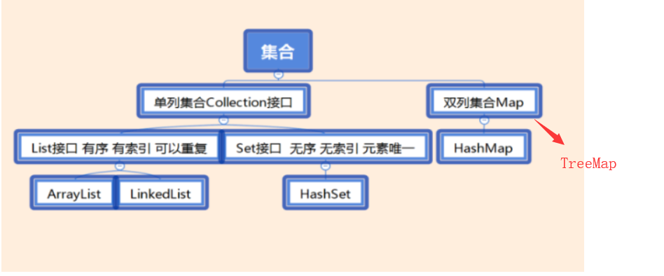

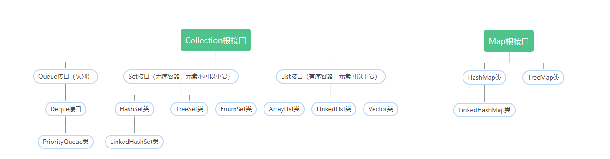


## Collection接口

Collection 接口是 List、Set 和 Queue 接口的父接口，通常情况下不直接使用。Collection 接口定义了一些通用的方法，通过这些方法可以实现对集合的基本操作。Collection 接口中定义的方法既可用于操作 Set 集合，也可用于操作 List 和 Queue 集合。


>List集合存储的元素有序，可重复.
>Set集合存储的元素无序，不可重复.

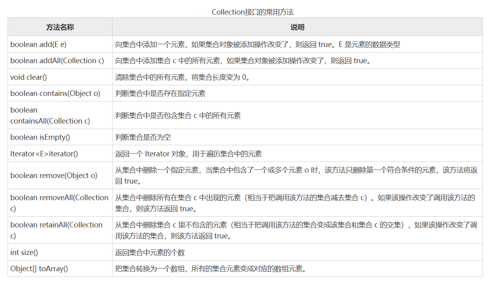

例子：由于 Collection 是接口，不能对其实例化，所以上述代码中使用了 Collection 接口的 ArrayList 实现类来调用 Collection 的方法。
```java
public static void main(String[] args) {
    ArrayList list1 = new ArrayList(); // 创建集合 list1
    ArrayList list2 = new ArrayList(); // 创建集合 list2
    list1.add("one");
    list1.add("two");
    list1.add("three");
    System.out.println("list1 集合：" + list1.size()); // 输出list1中的元素数量
    list2.add("two");
    list2.add("four");
    list2.add("six");
    System.out.println("list2 集合：" + list2.size()); // 输出list2中的元素数量
    list2.remove(2); // 删除第 3 个元素
    System.out.println(" removeAll() 方法之后 list2 集合中的元素数量：" + list2.size());
    System.out.println("list2 集合中的元素如下：");
    Iterator it1 = list2.iterator();
    while (it1.hasNext()) {
        System.out.print(it1.next() + "、");
    }
    list1.removeAll(list2);
    System.out.println("\nremoveAll() 方法之后 list1 集合中的元素数量：" + list1.size());
    System.out.println("list1 集合中的元素如下：");
    Iterator it2 = list1.iterator();
    while (it2.hasNext()) {
        System.out.print(it2.next() + "、");
    }
}   
```

## List接口

List 是一个有序、可重复的集合，集合中每个元素都有其对应的顺序索引。List 集合允许使用重复元素，可以通过索引来访问指定位置的集合元素。List 集合默认按元素的添加顺序设置元素的索引，第一个添加到 List 集合中的元素的索引为 0，第二个为 1，依此类推。

List 实现了 Collection 接口，它主要有两个常用的实现类：ArrayList、LinkedList、Stack以及Vector等

List集合常用方法：
方法 | 描述
------------ | -------------
void add(int index,Object obj)  | 把元素obj加入到集合的index处
boolean addAll(int index,Collection c)  | 把集合c的元素加入到index处
Object get(int index) |  返回index处的元素
Object remove(int index) | 删除index处的元素
Object set(int index,Object obj) | 把index处的元素替换为obj对象，并把替换后的元素返回。
int indexOf(Object obj) | 返回obj对象在集合中的位置
int lastIndexOf(Object obj) | 返回obj对象在集合的最后一个的位置


### ArrayList 类

ArrayList是List接口的一个实现类。可以把其看成一个长度可变的数组对象。它还提供了快速基于索引访问元素的方式，对尾部成员的增加和删除支持较好。使用 ArrayList 创建的集合，允许对集合中的元素进行快速的随机访问，不过，向 ArrayList 中插入与删除元素的速度相对较慢。

> ArrayList类如何扩容?

ArrayList是基于对象数组实现的，添加元素时若数组的容量不够，ArrayList会自动扩容.
- 添加元素前判断数组容量是否足够，若不够，则先扩容
- 每次扩容都是按原容量的1.5倍进行扩容（新数组容量 = 原数组容量*1.5 + 1）
- 扩容后,原数组通过Arrays.copyOf()将原数据元素拷贝到新数组

> ArrayLisy类的优缺点
- 由于底层是数组，所以根据下标查询元素效率较高。由于底层是数组，所以插入和删除元素的效率低。

> ArrayList 类的常用构造方法有如下两种重载形式：
```java
//构造一个初始容量为 10 的空列表。
ArrayList();
//构造一个包含指定 Collection 元素的列表,这些元素是按照该 Collection 的迭代器返回它们的顺序排列的。
ArrayList(Collection<?extends E>c);
```
> 下图是ArrayList类的常用方法

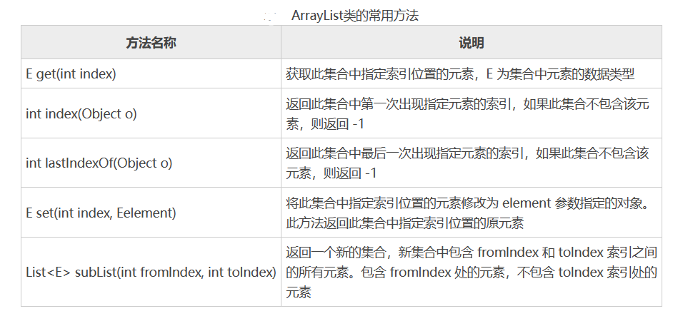

>例子
```java
//ArrayLista的使用
public class test1 {
    public static void main(String[] args) {
        ArrayList ar =new ArrayList();   //创建ArrayList集合
        //向集合中添加元素
        ar.add("xiaoming");
        ar.add("xiaohua");
        ar.add("xiaoqiang");
        System.out.println("此时集合的长度 "+ar.size());
        // 循环遍历集合，输出集合元素
        for (int i = 0; i < ar.size(); i++) {
            System.out.println(ar.get(i));
        }
    }
}

//下面是ArrayList的部分源代码
public class ArrayList<E> extends AbstractList<E>
        implements List<E>, RandomAccess, Cloneable, java.io.Serializable
{
    //默认的初始容量为10
    private static final int DEFAULT_CAPACITY = 10;
    //通过一个Object[]数组来存储元素
    transient Object[] elementData;
    //容器中元素的个数
    private int size;
    ......
}

//ArrayList每次进行增加元素的操作时，会将size与容量进行对比。当size大于实际容量时，数组会默认将扩容至原来容量的1.5倍
```

### LinkedList类

LinkedList是List接口的一个实现类。可以把其看成一个长度可变的双向循环链表。

这种结构的优点是便于向集合中插入或者删除元素。当需要频繁向集合中插入和删除元素时，使用 LinkedList 类比 ArrayList 类效果高，但是 LinkedList 类随机访问元素的速度则相对较慢。这里的随机访问是指检索集合中特定索引位置的元素。

LinkedList 类除了包含 Collection 接口和 List 接口中的所有方法之外，还有下图所示的方法。
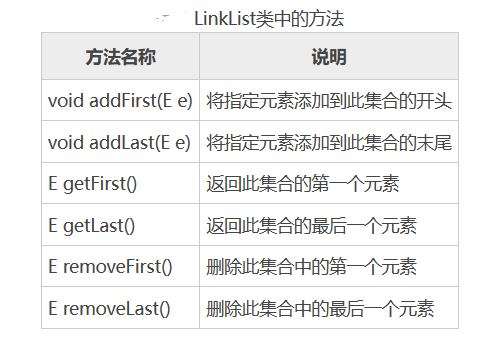

例子
```java
//LinkedList的使用
public class test1 {
    public static void main(String[] args) {
        LinkedList link=new LinkedList();   //创建linklist集合
        link.add("xiao");
        link.add("ming");
        link.add("hua");
        link.add("qiang");
        //打印集合中的元素
        System.out.println(link.toString());


    }
}

//运行结果：[xiao, ming, hua, qiang]

//LinkedList的部分源代码------------------
public class LinkedList<E>
    extends AbstractSequentialList<E>
    implements List<E>, Deque<E>, Cloneable, java.io.Serializable
{
    transient int size = 0;
    transient Node<E> first;  //链表的头节点
    transient Node<E> last;    //链表的尾节点
    public LinkedList() {
    }
    //每个节点包含前指针，后指针。分别指向前一个节点和后一个节点
    private static class Node<E> {
        E item;
        Node<E> next;
        Node<E> prev;

        Node(Node<E> prev, E element, Node<E> next) {
            this.item = element;
            this.next = next;
            this.prev = prev;
        }
    }
    .......
}
//1. 通过节点中的next，prev，来使用双向链表的功能
//2. 节点中的item用来存放数据
//3. first 和 last 分别指向 首节点和尾节点


```

### ArrayList 类和 LinkedList 类的区别

ArrayList 与 LinkedList 都是 List 接口的实现类，因此都实现了 List接口中的抽象方法，只是实现的方式有所不同。

* ArrayList 是基于动态数组数据结构的实现，可以直接按序号索引元素。但是插入元素要涉及数组元素移动等内存操作，所以查询数据快而插入数据慢。
* LinkedList 是基于双向链表数据结构的实现，按序号索引数据需要进行前向或后向遍历，但是插入数据时只需要记录本项的前后项即可，所以插入速度较快，查询速度慢。

### Vector类

Vector类是线程安全的

>例子
```java
//Vector类的使用
public class test1 {
    public static void main(String[] args) {
        Vector<String> one = new Vector<String>();
        one.add("1");
        one.add("2");
        System.out.println(one);
    }
}
//Vector类的源代码
public class Vector<E>
    extends AbstractList<E>
    implements List<E>, RandomAccess, Cloneable, java.io.Serializable
{
    protected Object[] elementData;
    protected int elementCount;
    protected int capacityIncrement;
    public Vector() {
        this(10);
    }
    public synchronized boolean add(E e) {
        modCount++;
        ensureCapacityHelper(elementCount + 1);
        elementData[elementCount++] = e;
        return true;
    }
    .....
}
```

> Vector类的特征

1. Vector类的底层也是通过对象数组来存储元素。
2. Vector类中的方法都有synchronized关键字修饰，用于保证线程安全。
3. 因为Vector类中每个方法中都添加了synchronized的关键字来保证同步，使得它的效率比ArrayList的效率要慢。
4. <font color="red">Vector类大多数操作和ArrayList类相同，区别之处在于Vector类是线程同步的。因此可以将Vector类看作线程安全的ArrayList类。</font>

## Set接口

Set集合的特点是存储的元素无序,不可重复。也就是说 Set 集合中的对象不按特定的方式排序，只是简单地把对象加入集合。Set 集合中不能包含重复的对象，并且最多只允许包含一个 null 元素。

Set 实现了 Collection 接口，它主要有两个常用的实现类：HashSet、TreeSet、LinkedHashSet等
- HashSet是根据对象的哈希值来确定元素在集合的存储位置，有好的存取，查找性能。
- TreeSet是以二叉树的方式来存储元素,可以对集合的元素进行排序。

### HashSet 类

<font color="red">HashSet是Set接口的一个实现类。其根据对象的Hash值来确定元素在集合的存储位置，因此具有很好的存取和查找性能。允许包含值为null的元素，但最多只能一个。</font>

> HashSet 具有以下特点：
* HashSet集合不出现重复元素。
* 不能保证元素的排列顺序，顺序可能与添加顺序不同，顺序也有可能发生变化。
* HashSet是线程不安全的，如果多个线程同时访问或修改一个HashSet，则必须通过其他代码的方式来保证其同步。
* 集合元素值可以是 null。但最多只能一个。

> HashSet集合添加对象的过程

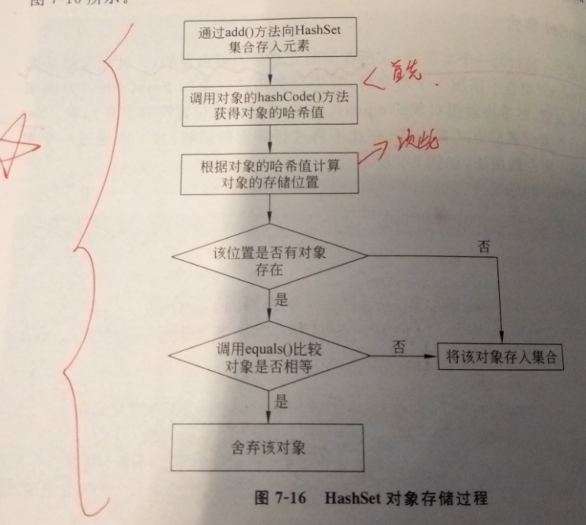

* 若两个对象的 hashCode 值相等且通过 equals() 方法比较返回结果为 true，则 HashSet 集合认为两个元素相等。
* 如果向 Set 集合中添加两个相同的元素，则后添加的会覆盖前面添加的元素，即在 Set 集合中不会出现相同的元素。
* 因此当HashSet集合存储某个对象类型的元素时，需要重写该对象的hashCode(),equals()方法。

> HashSet类的部分源代码

```java
//HashSet的部分源代码
public class HashSet<E>
    extends AbstractSet<E>
    implements Set<E>, Cloneable, java.io.Serializable
{
    private transient HashMap<E,Object> map;
    public HashSet() {
        map = new HashMap<>();
    }
    public boolean add(E e) {
        return map.put(e, PRESENT)==null;
    }
    ....
}
// HashSet底层是基于 HashMap 来实现的，是一个不允许有重复元素的集合。
```

1. HashSet底层是基于 HashMap 来实现的。使用HashMap的key来作为单个元素存储。因此能保证元素不重复。
2. HashSet容器允许只能有一个null值。
3. HashSet是根据被插入对象的hashcode值来选择对象的存储位置，若该位置已存在一个对象。则通过equals()方法来判断两个对象内容是否相同。相同则放弃插入，不相同则新对象取代旧对象。
4. 为了保证HashSet中的对象不会出现重复，在被存放元素的类中必须要重写hashCode()和equals()这两个方法。

> HashSet 类的常用构造方法重载形式如下
```java
//构造一个新的空的 Set 集合。
HashSet();
//构造一个包含指定Collection 集合元素的新 Set 集合。其中，“< >”中的 extends 表示 HashSet 的父类，即指明该 Set 集合中存放的集合元素类型。c 表示其中的元素将被存放在此 Set 集合中。
HashSet(Collection<? extends E>c);
```

> 例子
```java
public class human {
	private String name;
	private int age;
	
	human(String name,int age){
		this.name=name;
		this.age=age;
	}
	//重写toString方法
	public String toString() {
		return name+": "+age;
	}
	//重写hashCode方法
	public int hashCode() {
		return name.hashCode();
	}
	//重写equals方法
	public boolean equals(Object obj) {
		if (this == obj)
			return true;
		if (obj == null)
			return false;
		human other = (human) obj;
		if (name == null) {
			if (other.name != null)
				return false;
		} else if (!name.equals(other.name))
			return false;
		return true;
	}
	public static void main(String[] args) {
		HashSet hSet=new HashSet();
		hSet.add(new human("xiaoming",22));
		hSet.add(new human("xiaoqiang",23));
		hSet.add(new human("xiaohua",23));
		hSet.add(new human("xiaoqiang",23));
		hSet.add(new human("xiaoming",22));
		System.out.println(hSet);
	}
}
```

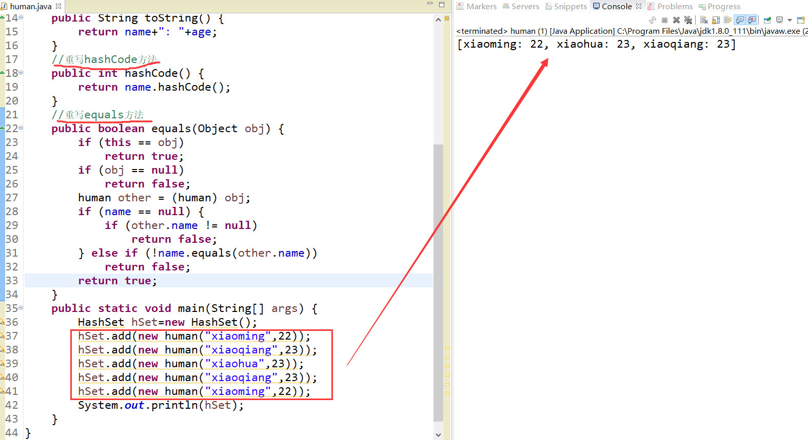

### LinkedHashSet 类

LinkedHashSet类是HashSet类的子类。

> 例子
```java
public class test1 {
    public static void main(String[] args) {
        LinkedHashSet<String> one = new LinkedHashSet<>();
        one.add("1");
        one.add("2");
        System.out.println(one);
    }
}
//LinkedHashSet源代码
public class LinkedHashSet<E>
    extends HashSet<E>
    implements Set<E>, Cloneable, java.io.Serializable {
    private static final long serialVersionUID = -2851667679971038690L;
    public LinkedHashSet() {
        //调用父类的有参构造方法
        super(16, .75f, true);
    }
    .....
}
//HashSet部分源代码
public class HashSet<E>
    extends AbstractSet<E>
    implements Set<E>, Cloneable, java.io.Serializable
{
    ......
    //该构造方法创建LinkedHashMap对象
    HashSet(int initialCapacity, float loadFactor, boolean dummy) {
        map = new LinkedHashMap<>(initialCapacity, loadFactor);
    }
    ......
}
```

> LinkedHashSet类的特点
1. LinkedHashSet是HashSet的子类。底层是通过LinkedHashMap对象来实现的，而LinkedHashMap的底层是由双向链表组成。
2. LinkedHashSet通过双向链表可以保证元素的插入顺序，又因为是HashSet的子类，所以插入的元素不能重复。
3. LinkedHashSet类按照插入的顺序，来存储元素。

### TreeSet 类

TreeSet 类同时实现了SortedSet 接口。而 SortedSet 接口是 Set 接口的子接口，可以实现对集合进行自然排序，

因此TreeSet是以平衡的二叉排序树的方式来存储元素,可以对集合的元素进行排序。存储的元素会按照从小到大排序，并且去除重复元素。

> TreeSet排序原理：
* TreeSet 只能对实现了 Comparable 接口的类对象进行排序。
* TreeSet集合在插入元素时，通过调用compareTo()方法，对集合中的元素进行比较，从而进行排序。因此，当TreeSet集合存储对象类型数据时，需要该对象实现Comparable接口，并重写compareTo()方法

> TreeSet 类还提供了如图所示的方法。

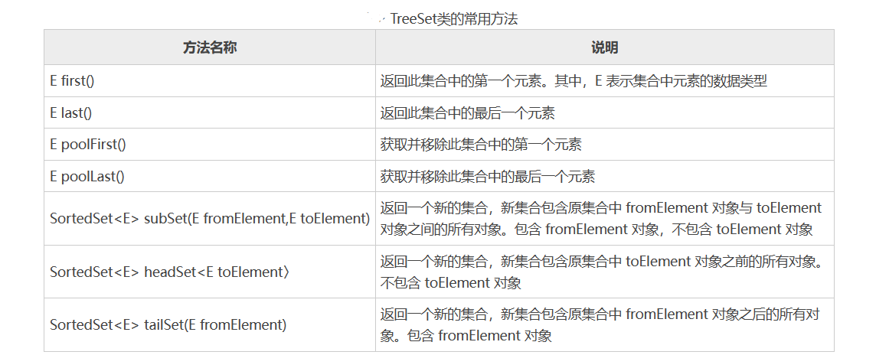

> TreeSet类的部分源代码如下

```java
//TreeSet的源代码
public class TreeSet<E> extends AbstractSet<E>
    implements NavigableSet<E>, Cloneable, java.io.Serializable
{
    private transient NavigableMap<E,Object> m;
    private static final Object PRESENT = new Object();
    TreeSet(NavigableMap<E,Object> m) {
        this.m = m;
    }
    public TreeSet() {
        this(new TreeMap<E,Object>());
    }
    public boolean add(E e) {
        return m.put(e, PRESENT)==null;
    }
    .....
}
```

1. TreeSet的底层是基于TreeMap实现的。而TreeMap的底层是通过红黑二叉树实现的。
2. TreeSet通过红黑二叉树可以保证元素的插入顺序。又因为实现了Set接口，所以插入的元素不能重复。

> 例子
```java
//实现Comparable接口
public class human implements Comparable{
	private String name;
	private int age;
	human(String name,int age){
		this.name=name;
		this.age=age;
	}
	//重写该方法
	public String toString() {
		return name+"： "+age;
	}
	//重写Comparable接口的compareTo方法
	public int compareTo(Object o) {
		human h=(human)o;     //强制转换为human类型
		if(this.age==h.age) {    
			return 0;     //表示相等
		}else if(this.age>h.age){
			return 1;    //从小到大，升序排序
		}else {
			return -1;
		}
	}
	public static void main(String[] args) {
		TreeSet tSet=new TreeSet();
		tSet.add(new human("xiaoming",22));
		tSet.add(new human("xiaoqiang",24));
		tSet.add(new human("xiaohua",23));
		tSet.add(new human("xiaohua",23));
		System.out.println(tSet);
	}
}
```

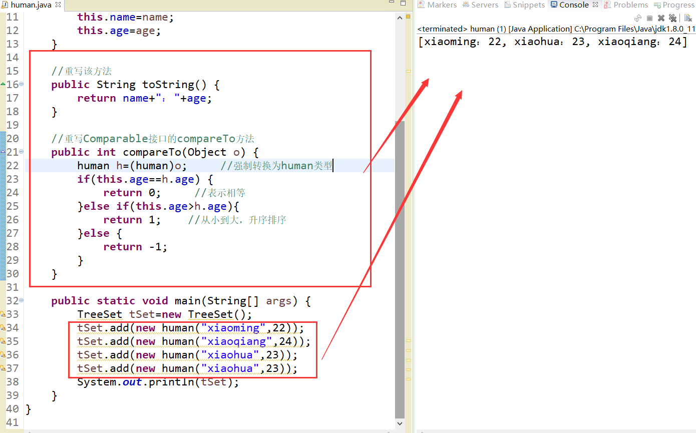

## Queue接口

Queue接口常用实现类如下：
1. Deque接口：双端队列，它支持在两端插入和删除元素，LinkedList类实现了Deque接口。
2. PriorityQueue类：优先级队列的元素按照其自然顺序进行排序，或者根据构造队列时提供的 Comparator 进行排序。

## Map接口

Map接口容器主要是键值对（key-value）的方式存储元素到容器中，Map中不能包含重复的key。有三个常用的实现类，HashMap类，TreeMap类，LinkedHashMap类。Map接口本身提供一些操作容器的方法。

> Map接口的类结构图

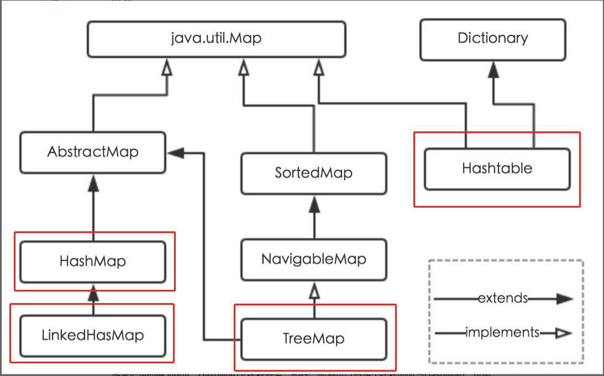

> Map 接口中提供的常用方法如表图所示

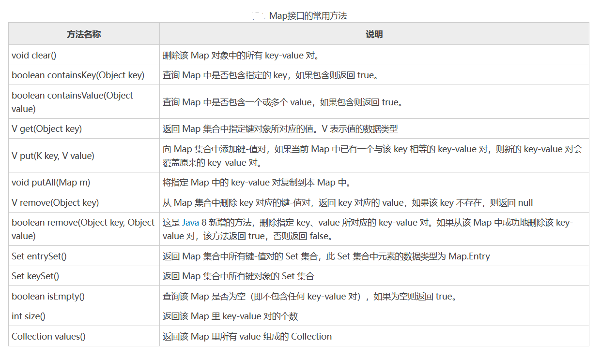

### HashMap类

HashMap类用于存储键值对元素，且保证没有重复的key值。HashMap类是根据Hash算法来存取键对象。

> HashMap源部分源代码
```java
//HashMap源代码
public class HashMap<K,V> extends AbstractMap<K,V> implements Map<K,V>, Cloneable, Serializable {
    public V put(K key, V value) {
        return putVal(hash(key), key, value, false, true);
    }
    transient Node<K,V>[] table; //数组
    ......
}

```

> HashMap类的存储结构：

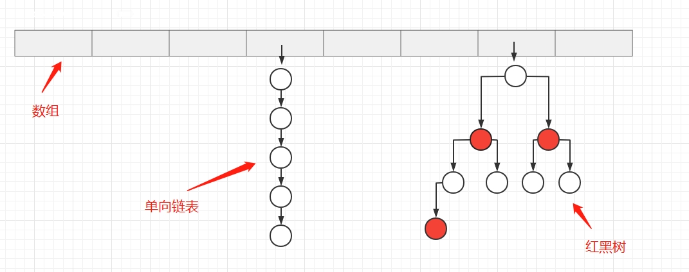

1. HashMap中键不可以重复，重复时，后者键值会覆盖前者
1. HashMap由数组和单向链表共同完成，当链表长度超过8个时会转化为红黑树。则HashMap的底层是散列表（数组+单向链表/红黑树）的方式进行存储元素。
2. 数组是节点类型数组，用于存放节点。节点可存储一个键值对。
3. HashMap的put方法步骤：
    ① 对key进行哈希算法来确定存储在数组中的那个index。哈希算法：index = HashCode（key） & （容器HashMap长度 - 1）。
    ② 若存储位置无元素存在，则直接存储。
    ③ 若存储位置已经有元素存在，则根据单向链表的存储方式。将新元素作为链表的头节点存储在数组上，旧元素作为新元素的下一个节点。（其中会遍历链表，用equals()方法来检查key是否重复，若有重复的key则覆盖，没有则当作新节点插入到链表头节点中）
    ④ 当链表的长度>8时，把链表转换为红黑树的形式存储元素。

### LinkedHashMap类

> LinkedHashMap类的部分源代码

```java
public class test1 {
    public static void main(String[] args) {
        LinkedHashMap<String, String> one = new LinkedHashMap<String,String>();
        one.put("1","tom");
        one.put("2","mike");
        one.put("3","jack");
        System.out.println(one); //{1=tom, 2=mike, 3=jack}
    }
}
//LinkedHashMap的源代码
public class LinkedHashMap<K,V> extends HashMap<K,V> implements Map<K,V>
{
    transient LinkedHashMap.Entry<K,V> head;
    transient LinkedHashMap.Entry<K,V> tail;
    static class Entry<K,V> extends HashMap.Node<K,V> {
        Entry<K,V> before, after;
        Entry(int hash, K key, V value, Node<K,V> next) {
            super(hash, key, value, next);
        }
    }
    .....
}
```

> LinkedHashMap类的存储结构

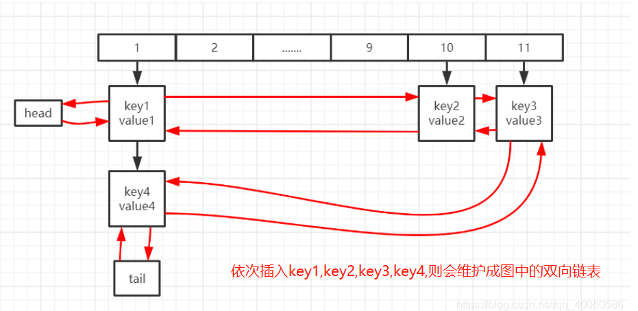

1. LinkedHashMap类继承自HashMap类，本质上LinkedHashMap = HashMap + 双向链表。
2. LinkedHashMap在HashMap的基础上，增加了双链表的结果（即节点中增加了前before、后after指针，LinkedHashMap中增加了head、tail指针），其他处理逻辑与HashMap一致，同样也没有锁保护，多线程使用存在风险。
3. LinkedHashMap类是有序的，容器内元素默认是按照插入顺序进行排序。

### TreeMap类

TreeMap是通过二叉树的原理来保证键的唯一性。TreeMap可以对键对象进行排序。

> TreeMap类的部分源代码
```java
public class bb {
    public static void main(String[] args) {
        TreeMap<String, String> one = new TreeMap<>();
        one.put("1","jack");
        one.put("2","tom");
        one.put("3","mike");
        System.out.println(one);
    }
}
//TreeMap类源代码
public class TreeMap<K,V>
    extends AbstractMap<K,V>
    implements NavigableMap<K,V>, Cloneable, java.io.Serializable
{
    private final Comparator<? super K> comparator;
    private transient Entry<K,V> root;
    private transient int size = 0;
    private transient int modCount = 0;
    public TreeMap() {
        comparator = null;
    }
    //元素节点内部构造
    //每个节点包含父指针，左指针，右指针
     static final class Entry<K,V> implements Map.Entry<K,V> {
        K key;
        V value;
        Entry<K,V> left;
        Entry<K,V> right;
        Entry<K,V> parent;
        boolean color = BLACK;
        .....        
    }
    ....
}
```

> TreeMap类的特点
1. TreeMap是一个有序的key-value集合，它是通过红黑树实现元素的存储。
2. TreeMap内部存储的元素，都会经过红黑树的排序之后再存储。红黑树的存储结构天然支持排序，默认情况下通过Key值的自然顺序进行排序；
3. TreeMap类线程不安全，按照比较的排序来存储元素。


### 遍历Map集合的四种方式

Map 有两组值，因此遍历时可以只遍历值的集合，也可以只遍历键的集合，也可以同时遍历。Map 以及实现 Map 的接口类（如 HashMap、TreeMap、LinkedHashMap、Hashtable 等）都可以用以下几种方式遍历。

1. 在 for 循环中使用 entrySet() 实现 Map 的遍历（最常见和最常用的）。

```java
public static void main(String[] args) {
    Map<String, String> map = new HashMap<String, String>();
    map.put("Java入门教程", "http://c.biancheng.net/java/");
    map.put("C语言入门教程", "http://c.biancheng.net/c/");
    for (Map.Entry<String, String> entry : map.entrySet()) {
        String mapKey = entry.getKey();
        String mapValue = entry.getValue();
        System.out.println(mapKey + "：" + mapValue);
    }
}
```

2. 使用 for-each 循环遍历 key 或者 values，一般适用于只需要 Map 中的 key 或者 value 时使用。性能上比 entrySet 较好。

```java
Map<String, String> map = new HashMap<String, String>();
map.put("Java入门教程", "http://c.biancheng.net/java/");
map.put("C语言入门教程", "http://c.biancheng.net/c/");
// 打印键集合
for (String key : map.keySet()) {
    System.out.println(key);
}
// 打印值集合
for (String value : map.values()) {
    System.out.println(value);
}
```

3. 使用迭代器（Iterator）遍历

```java
Map<String, String> map = new HashMap<String, String>();
map.put("Java入门教程", "http://c.biancheng.net/java/");
map.put("C语言入门教程", "http://c.biancheng.net/c/");
Iterator<Entry<String, String>> entries = map.entrySet().iterator();
while (entries.hasNext()) {
    Entry<String, String> entry = entries.next();
    String key = entry.getKey();
    String value = entry.getValue();
    System.out.println(key + ":" + value);
}
```

4. 通过键找值遍历，这种方式的效率比较低，因为本身从键取值是耗时的操作。

```java
for(String key : map.keySet()){
    String value = map.get(key);
    System.out.println(key+":"+value);
}
```


## Collections工具类

Collections 类是 Java 提供的一个操作 Set、List 和 Map 等集合的工具类。Collections 类提供了许多操作集合的静态方法，这些方法包括对容器类的搜索、排序、替换等等。

下面介绍 Collections 类中操作集合的常用方法。

### 排序（正向和逆向）

Collections 提供了如下方法用于对 List 集合元素进行排序。

```
void reverse(List list)：对指定 List 集合元素进行逆向排序。
void shuffle(List list)：对 List 集合元素进行随机排序（shuffle 方法模拟了“洗牌”动作）。
void sort(List list)：根据元素的自然顺序对指定 List 集合的元素按升序进行排序。
void sort(List list, Comparator c)：根据指定 Comparator 产生的顺序对 List 集合元素进行排序。
void swap(List list, int i, int j)：将指定 List 集合中的 i 处元素和 j 处元素进行交换。
void rotate(List list, int distance)：当 distance 为正数时，将 list 集合的后 distance 个元素“整体”移到前面；当 distance 为负数时，将 list 集合的前 distance 个元素“整体”移到后面。该方法不会改变集合的长度。
```

例子
```java
public class Test1 {
    public static void main(String[] args) {
        Scanner input = new Scanner(System.in);
        List prices = new ArrayList();
        for (int i = 0; i < 5; i++) {
            System.out.println("请输入第 " + (i + 1) + " 个商品的价格：");
            int p = input.nextInt();
            prices.add(Integer.valueOf(p)); // 将录入的价格保存到List集合中
        }
        Collections.sort(prices); // 调用sort()方法对集合进行排序
        System.out.println("价格从低到高的排列为：");
        for (int i = 0; i < prices.size(); i++) {
            System.out.print(prices.get(i) + "\t");
        }
    }
}
```


### 查找、替换操作

Collections 还提供了如下常用的用于查找、替换集合元素的方法。
* int binarySearch(List list, Object key)：使用二分搜索法搜索指定的 List 集合，以获得指定对象在 List 集合中的索引。如果要使该方法可以正常工作，则必须保证 List 中的元素已经处于有序状态。
* Object max(Collection coll)：根据元素的自然顺序，返回给定集合中的最大元素。
* Object max(Collection coll, Comparator comp)：根据 Comparator 指定的顺序，返回给定集合中的最大元素。
* Object min(Collection coll)：根据元素的自然顺序，返回给定集合中的最小元素。
* Object min(Collection coll, Comparator comp)：根据 Comparator 指定的顺序，返回给定集合中的最小元素。
* void fill(List list, Object obj)：使用指定元素 obj 替换指定 List 集合中的所有元素。
* int frequency(Collection c, Object o)：返回指定集合中指定元素的出现次数。
* int indexOfSubList(List source, List target)：返回子 List 对象在父 List 对象中第一次出现的位置索引；如果父 List 中没有出现这样的子 List，则返回 -1。
* int lastIndexOfSubList(List source, List target)：返回子 List 对象在父 List 对象中最后一次出现的位置索引；如果父 List 中没有岀现这样的子 List，则返回 -1。
* boolean replaceAll(List list, Object oldVal, Object newVal)：使用一个新值 newVal 替换 List 对象的所有旧值 oldVal。

例子
```java
public class Test3 {
    public static void main(String[] args) {
        Scanner input = new Scanner(System.in);
        List products = new ArrayList();
        System.out.println("******** 商品信息 ********");
        for (int i = 0; i < 3; i++) {
            System.out.println("请输入第 " + (i + 1) + " 个商品的名称：");
            String name = input.next();
            products.add(name); // 将用户录入的商品名称保存到List集合中
        }
        System.out.println("重置商品信息，将所有名称都更改为'未填写'");
        Collections.fill(products, "未填写");
        System.out.println("重置后的商品信息为：");
        for (int i = 0; i < products.size(); i++) {
            System.out.print(products.get(i) + "\t");
        }
    }
}
```

### 复制

Collections 类的 copy() 静态方法用于将指定集合中的所有元素复制到另一个集合中。执行 copy() 方法后，目标集合中每个已复制元素的索引将等同于源集合中该元素的索引。

copy() 方法的语法格式如下：
```java
void copy(List <? super T> dest,List<? extends T> src)
//dest 表示目标集合对象，src 表示源集合对象。
```

注意：目标集合的长度至少和源集合的长度相同，如果目标集合的长度更长，则不影响目标集合中的其余元素。如果目标集合长度不够而无法包含整个源集合元素，程序将抛出异常。

例子
```java
public class Test5 {
    public static void main(String[] args) {
        Scanner input = new Scanner(System.in);
        List srcList = new ArrayList();
        List destList = new ArrayList();
        destList.add("苏打水");
        destList.add("木糖醇");
        destList.add("方便面");
        destList.add("火腿肠");
        destList.add("冰红茶");
        System.out.println("原有商品如下：");
        for (int i = 0; i < destList.size(); i++) {
            System.out.println(destList.get(i));
        }
        System.out.println("输入替换的商品名称：");
        for (int i = 0; i < 3; i++) {
            System.out.println("第 " + (i + 1) + " 个商品：");
            String name = input.next();
            srcList.add(name);
        }
        // 调用copy()方法将当前商品信息复制到原有商品信息集合中
        Collections.copy(destList, srcList);
        System.out.println("当前商品有：");
        for (int i = 0; i < destList.size(); i++) {
            System.out.print(destList.get(i) + "\t");
        }
    }
}
```


## Iterator接口（迭代器）

Iterator（迭代器）是一个接口，它的作用就是用于遍历 Collection 集合中的元素。

> 如何创建Iterator对象

由于Collection接口中提供了一个抽象方法来创建Iterator对象。因此所有继承Collection接口的容器类都可以通过该方法创建一个与之关联的Iterator对象。
```java
//Collection接口源代码
public interface Collection<E> extends Iterable<E> {
    ....
    Iterator<E> iterator(); 
    ....
}
//例如Collection接口中定义了获取集合类迭代器的方法（iterator（）），因此所有Collection体系的集合类都可以获取自身的迭代器对象。


// Iterator接口的源代码
public interface Iterator<E> {
    boolean hasNext();  //hasNext() 用于检测集合中是否还有元素
    E next();           //会返回迭代器的下一个元素
    default void remove() {  //将迭代器返回的元素删除
        throw new UnsupportedOperationException("remove");
    }
    ....
}
```

> Iterator接口里包含了如下常用方法
```
boolean hasNext()：如果被迭代的集合元素还没有被遍历完，则返回 true。
Object next()：返回集合里的下一个元素。
void remove()：删除集合里上一次 next 方法返回的元素。
void forEachRemaining(Consumer action)：这是 Java 8 为 Iterator 新增的默认方法，该方法可使用 Lambda 表达式来遍历集合元素。
```

>例子
```java
ArrayList list=new ArrayList();
list.add("Hello");
list.add("World");
list.add("HAHAHAHA");
//使用迭代器进行相关遍历,先获取该集合类的迭代对象
Iterator ite=list.iterator();    		
while(ite.hasNext())  //判断该对象是否有下一个元素
{
	//使用迭代器本身的删除方法
	if("tom".equals(ite.next())){
		it.remove();
	}
	System.out.println(ite.next());  //ite.next()取出集合中的元素
}
```

<font color="red">

注意：
1.通过迭代器遍历的元素，会把这些元素当作Object类型对待，若想得到特定类型的元素，需要进行强制类型转换。
2.在对集合元素进行迭代时，若在该过程中删除其中一个元素，迭代器对象会抛出一个异常。可以使用迭代器本身的删除方法remove(),来解决。

</font>


## 各个集合容器使用的底层数据结构

List
* Arraylist： Object数组
* Vector： Object数组
* LinkedList： 双向循环链表

Set
* HashSet（无序，唯一）：基于 HashMap 实现的，底层采用 HashMap的key来保存元素
* LinkedHashSet： LinkedHashSet 继承与 HashSet，并且其内部是通过 LinkedHashMap 来实现的。有点类似于我们之前说的LinkedHashMap 其内部是基 于 Hashmap 实现一样，不过还是有一点点区别的。
* TreeSet（有序，唯一）： 红黑树(自平衡的排序二叉树。) 

Map
* HashMap： JDK1.8之前HashMap由数组+链表组成的，数组是HashMap的主体，链表则是主要为了解决哈希冲突而存在的（“拉链法”解决冲突）.JDK1.8以后在解决哈希冲突时有了较大的变化，当链表长度大于阈值（默认为8）时，将链表转化为红黑树，以减少搜索时间
* LinkedHashMap：LinkedHashMap 继承自 HashMap，所以它的底层仍然是由数组和链表或红黑树组成。另外，LinkedHashMap 在上面结构的基础上，增加了一条双向链表，使得上面的结构可以保持键值对的插入顺序。 同时通过对链表进行相应的操作，实现了访问顺序相关逻辑。
* HashTable： 数组+链表组成的，数组是 HashMap 的主体，链表则是主要为 了解决哈希冲突而存在的
* TreeMap： 红黑树（自平衡的排序二叉树）