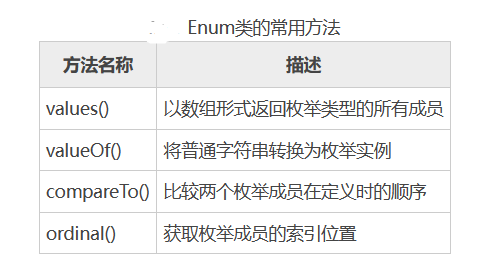

[toc]

# Java笔记13-枚举

将一些常量值组织在一起，变成为一种新的数据类型，就叫枚举enum类。

例如一个人的性别只能是“男”或者“女”，一周只能是7天。类似只能有几种固定的取值的常量时，就可以将它定义为枚举类型。

枚举的好处是可以把常量组织为枚举类，从而更方便的去使用这些常量。使用场景一般是异常代码状态等

## 使用枚举类之前的背景说明

在使用枚举类之前，是通过静态常量来表示一组常量数据。当常量越来越多的时候，如果全写在一个文件里面容易造成命名混淆，程序就不具备可读性，你无法直接通过数字来看出代表的含义。

> 例如如下代码
```java
public class ColorEnum {
    //通过1，2，3来表示红绿蓝三个常量，当数字越多，常量越多。可读性就变得很差。
    public static final int RED = 1;
    public static final int GREEN = 2;
    public static final int BULE = 3;
}
```

> 为什么放弃静态常量，而使用enum枚举类？
1. static方式的静态变量类型不安全，可以在调用的时候传入其他值，导致错误
2. static方式的静态变量不支持属性扩展，每一个key对应一个值，而enum枚举类型的每一个常量成员可以拥有自己的属性

## 声明枚举

声明枚举时必须使用 enum 关键字，然后定义枚举的名称、可访问性、基础数据类型和成员等。

> 枚举声明的语法如下
```java
public enum enumname:enum-base {
    enum-body,
}

// enumname 表示声明的枚举名称；
// enum-base 表示基础类型；默认是int类型
// enum-body 表示枚举的成员，它是枚举类型的命名常数。
```

> 枚举类的特征
1. 枚举类使用 enum 关键字来定义。各个常量使用逗号 , 来分割,结尾使用分号;结束
3. 枚举类无法继承其他类。因为在编译枚举类时，Java会让枚举类继承自 java.lang.Enum 类。
4. 枚举类的变量都会被 public static final 修饰符修饰。
5. 枚举类的构造方法是私有的，默认的就是private，定义的时候不加也没事。
6. 由于枚举类继承java.lang.Enum 类。因此可以使用继承自java.lang.Enum 类的常用方法：    
    values()	以数组形式返回枚举类的所有成员常量
    valueOf()	把一个字符串转为对应的枚举类对象，要求字符串必须是枚举类对象的名字
    compareTo()	比较两个枚举成员在定义时的顺序
    ordinal()	获取枚举成员的索引位置

> 例子
```java
//定义一个颜色枚举类
public enum ColorEnum {
    //若要给枚举常量指定name和index属性，需要创建对应属性的构造方法
    Red("红色", 1), Green("绿色", 2), Blue("蓝色", 3);
    String name;
    int index;
    //构造方法
    ColorEnum(String name, int index) {
        this.name = name;
        this.index = index;
    }
    public static void showAllColors() {
        System.out.println("ColorEnum.values() = "+ColorEnum.values());
        for (ColorEnum color : ColorEnum.values()) {
            System.out.println(color.index + ":" + color.name);
        }
    }
    public static void main(String[] args) {
       showAllColors();
    }
}
```

<font color="red">注意：主动给枚举常量自定义数值，需要重写对应的构造方法，否则编译错误。</font>

## 枚举类

Java 中的每一个枚举都继承自 java.lang.Enum 类。当定义一个枚举类型时，每一个枚举类型成员都可以看作是 Enum 类的实例，这些枚举成员默认都被 final、public, static 修饰，当使用枚举类型成员时，直接使用枚举名称调用成员即可。

所有枚举实例都可以调用 Enum 类的方法，常用方法如表图所示。


> 例子
```java
enum Signal {
    // 定义一个枚举类型
    GREEN,YELLOW,RED;
}
public static void main(String[] args) {
    for(int i = 0;i < Signal.values().length;i++) {
        System.out.println("枚举成员："+Signal.values()[i]);
    }
}
```

## 为枚举添加方法

Java 为枚举类型提供了一些内置的方法，同时枚举常量也可以有自己的方法。此时要注意必须在枚举实例的最后一个成员后添加分号，而且必须先定义枚举实例。

> 例子
```java
public enum Color {
    RED("红色",1),GREEN("绿色",2),WHITE("白色",3),YELLOW("黄色",4);
    // 成员变量
    private String name;
    private int index;
    // 构造方法
    private Color(String name,int index) {
        this.name = name;
        this.index = index;
    }
    // 覆盖方法
    @Override
    public String toString() {
        return this.index + "-" + this.name;
    }
}
```
