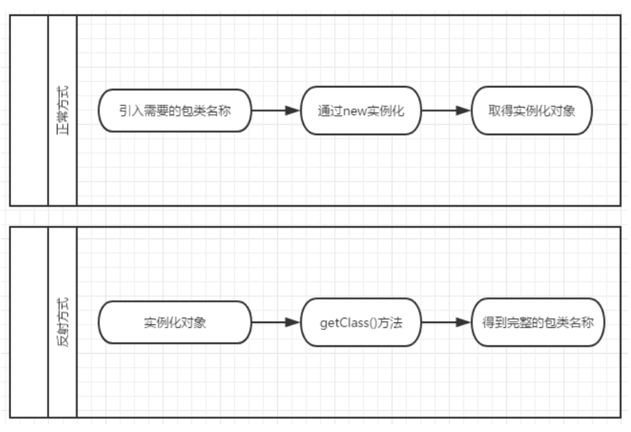
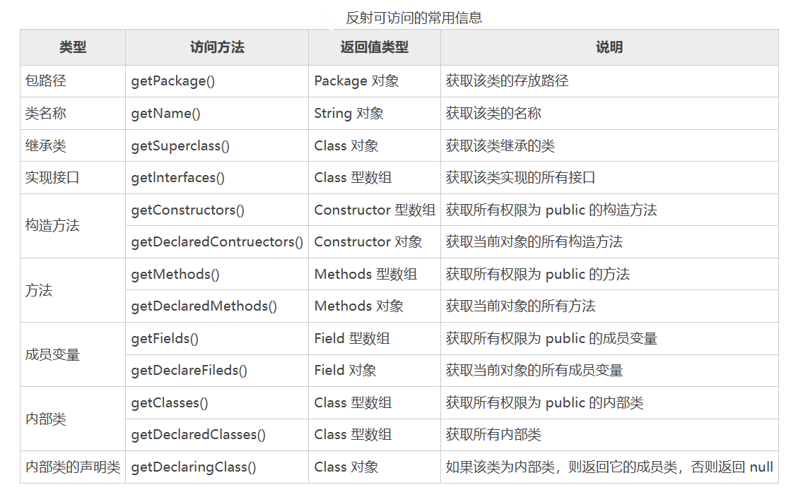
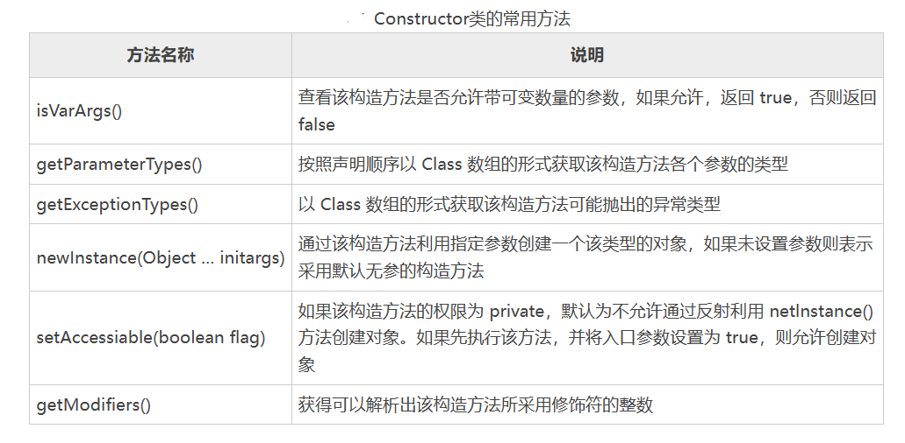
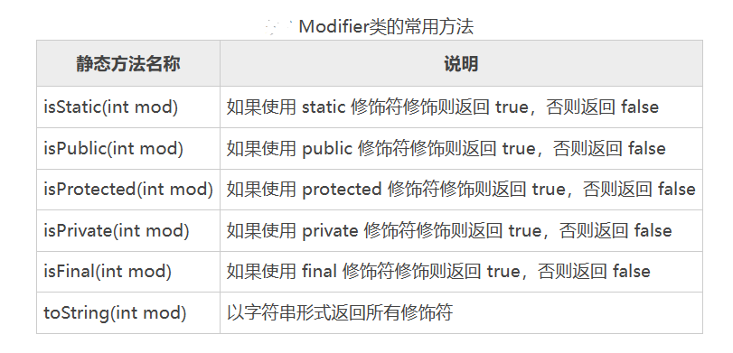
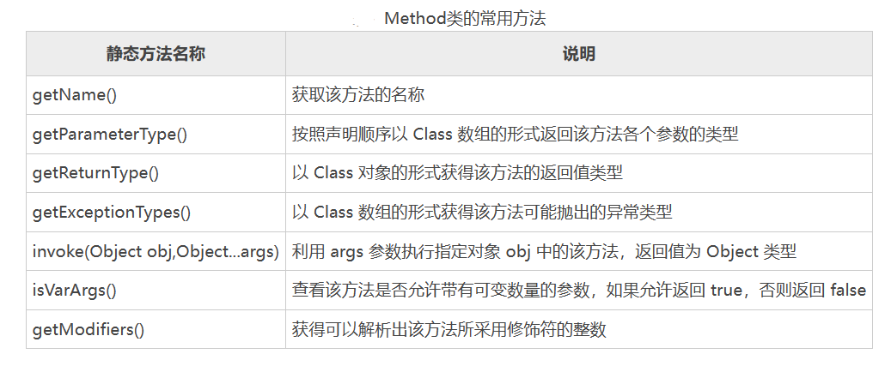
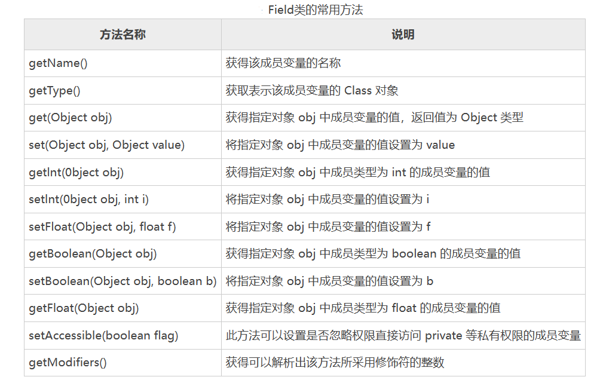

[toc]

# Java笔记14-反射

## 介绍

Java 反射机制是 Java 语言的一个重要特性。需要先了解两个概念，编译期和运行期。

* 编译期：是指把 Java 代码编译成 class 文件的过程。编译期只是做了一些翻译功能，并没有把代码放在内存中运行起来，而只是把代码当成文本进行操作，比如检查错误。

* 运行期：是把编译后的class文件交给计算机执行，直到程序运行结束。所谓运行期就把在磁盘中的代码放到内存中执行起来。

Java 反射机制是指在运行状态中，对于任意一个类，都能够知道这个类的所有属性和方法；对于任意一个对象，都能够调用它的任意方法和属性；这种动态获取信息以及动态调用对象方法的功能称为 Java 语言的反射机制。

简单来说，Java 反射机制指的是程序在运行时能够获取自身的信息。在 Java 中，只要给定类的名字，就可以通过反射机制读取类的所有属性，或者给这些属性赋值。

<font color="red">例如：通常情况下类中的private 变量。只有在同类的情况下才能调用。但是通过反射可以在任何地方调用private 变量。</font>



Java 反射机制主要提供了以下功能，这些功能都位于java.lang.reflect包。
- 在运行时判断任意一个对象所属的类。
- 在运行时构造任意一个类的对象。
- 在运行时判断任意一个类所具有的成员变量和方法。
- 在运行时调用任意一个对象的方法。
- 生成动态代理。

要想知道一个类的属性和方法，必须先获取到该类的字节码文件对象。获取类的信息时，使用的就是 Class 类中的方法。所以先要获取到每一个字节码文件（.class）对应的 Class 类型的对象.


利用 Class 类的对象 labelCls 可以访问 labelCls 对象的描述信息、JLabel 类的信息以及基类 Object 的信息。




Java 反射机制的优点：
- 能够运行时动态获取类的实例，大大提高系统的灵活性和扩展性。
- 与 Java 动态编译相结合，可以实现无比强大的功能。
- 对于 Java 这种先编译再运行的语言，能够让我们很方便的创建灵活的代码，这些代码可- 以在运行时装配，无需在组件之间进行源代码的链接，更加容易实现面向对象。

Java 反射机制的缺点：
- 反射会消耗一定的系统资源，因此，如果不需要动态地创建一个对象，那么就不需要用反射；
- 反射调用方法时可以忽略权限检查，获取这个类的私有方法和属性，因此可能会破坏类的封装性而导致安全问题。


## 反射类的API

Java反射相关的类

```
java.lang.Class 	在运行的Java应用程序中代表类和接口
java.lang.reflect.Field 	代表类的成员变量
java.lang.reflect.Method 	代表类的方法
java.lang.reflect.Constructor 	代表类的构造方法
```

### java.lang.Class 类

java.lang.Class 类是 Java 反射机制中的核心类。

> 如何获取Class类对象

有3中方式获取Class类对象。

1. 类型.class，例如：String.class
2. 对象.getClass()，例如：”hello”.getClass()
3. Class.forName()，例如：Class.forName(“java.lang.String”)

```java
Student stu = new Student();
//方式1. 通过类的class静态变量来获取Class对象
Class obj1 = Student.class()
//方式2. 通过对象的getClass()方法来获取Class对象
Class obj2 = stu.getClass();
//方式3. 通过Class.forName()来获取Class对象
Class obj3 = Class.forName("xxx.xxx.xxx.Student")
```

>Class类中的方法如下：

```
=========获取类
getClassLoader() 	获得类的加载器
getClasses() 	返回一个数组，数组中包含该类中所有公共类和接口类的对象
getDeclaredClasses() 	返回一个数组，数组中包含该类中所有类和接口类的对象
forName(String className) 	根据类名返回类的对象
getName() 	获得类的完整路径名字
newInstance() 	创建类的实例
getPackage() 	获得类的包
getSimpleName() 	获得类的名字
getSuperclass() 	获得当前类继承的父类的名字
getInterfaces() 	获得当前类实现的类或是接口

==========获取属性变量
getField(String name) 	获得某个公有的属性对象
getFields() 	获得所有公有的属性对象
getDeclaredField(String name) 	获得某个属性对象
getDeclaredFields() 	获得所有属性对象

==============获取构造方法
getConstructor(Class...<?> parameterTypes) 	获得该类中与参数类型匹配的公有构造方法
getConstructors() 	获得该类的所有公有构造方法
getDeclaredConstructor(Class...<?> parameterTypes) 	获得该类中与参数类型匹配的构造方法
getDeclaredConstructors() 	获得该类所有构造方法

=============获得类中方法相关的方法
getMethod(String name, Class...<?> parameterTypes) 	获得该类某个公有的方法
getMethods() 	获得该类所有公有的方法
getDeclaredMethod(String name, Class...<?> parameterTypes) 	获得该类某个方法
getDeclaredMethods() 	获得该类所有方法
```

例子，Class 类提供了很多方法可以获得运行时对象的相关信息
```java
public class Test01 {
    public static void main(String[] args) {
        // 获得Class实例
        // 1.通过类型class静态变量
        Class clz1 = String.class;
        String str = "Hello";
        // 2.通过对象的getClass()方法
        Class clz2 = str.getClass();
        // 获得int类型Class实例
        Class clz3 = int.class;
        // 获得Integer类型Class实例
        Class clz4 = Integer.class;
        System.out.println("clz2类名称：" + clz2.getName());
        System.out.println("clz2是否为接口：" + clz2.isInterface());
        System.out.println("clz2是否为数组对象：" + clz2.isArray());
        System.out.println("clz2父类名称：" + clz2.getSuperclass().getName());
        System.out.println("clz2是否为基本类型：" + clz2.isPrimitive());
        System.out.println("clz3是否为基本类型：" + clz3.isPrimitive());
        System.out.println("clz4是否为基本类型：" + clz4.isPrimitive());
    }
}
```


### java.lang.reflect 包

java.lang.reflect 包提供了反射中的其他常用类，说明如下：
- Constructor 类：提供类的构造方法信息。
- Field 类：提供类或接口中成员变量信息。
- Method 类：提供类或接口成员方法信息。
- Array 类：提供了动态创建和访问 Java 数组的方法。
- Modifier 类：提供类和成员访问修饰符信息。

#### Constructor 类

> 获取 Constructor 类的对象

为了能够动态获取对象构造方法的信息，首先需要通过下列方法之一创建一个 Constructor 类型的对象或者数组。

```java
getConstructors()
getConstructor(Class<?>…parameterTypes)
getDeclaredConstructors()
getDeclaredConstructor(Class<?>...parameterTypes)

//例子
//获取无参构造方法
objectClass.getConstructors();
//获取形参为 int 和 String 类型的构造方法
objectClass.getDeclaredConstructor(int.class,String.class);
//获取形参为 int 和 String 类型的构造方法
objectClass.getDeclaredConstructor(new Class[]{int.class,String.class});
```

> Constructor 类的常用方法如图所示




例子：演示如何调用 Constructor 类的方法获取构造方法的信息。
```java
public class Book {
    String name; // 图书名称
    int id, price; // 图书编号和价格
    // 空的构造方法
    private Book() {
    }
    // 带两个参数的构造方法
    protected Book(String _name, int _id) {
        this.name = _name;
        this.id = _id;
    }

    // 带可变参数的构造方法
    public Book(String... strings) throws NumberFormatException {
        if (0 < strings.length)
            id = Integer.valueOf(strings[0]);
        if (1 < strings.length)
            price = Integer.valueOf(strings[1]);
    }

    // 输出图书信息
    public void print() {
        System.out.println("name=" + name);
        System.out.println("id=" + id);
        System.out.println("price=" + price);
    }
}

//---------------------------------------------

public class Test01 {
    public static void main(String[] args) {
        // 获取动态类Book
        Class book = Book.class;
        // 获取Book类的所有构造方法
        Constructor[] declaredContructors = book.getDeclaredConstructors();
        // 遍历所有构造方法
        for (int i = 0; i < declaredContructors.length; i++) {
            Constructor con = declaredContructors[i];
            // 判断构造方法的参数是否可变
            System.out.println("查看是否允许带可变数量的参数：" + con.isVarArgs());
            System.out.println("该构造方法的入口参数类型依次为：");
            // 获取所有参数类型
            Class[] parameterTypes = con.getParameterTypes();
            for (int j = 0; j < parameterTypes.length; j++) {
                System.out.println(" " + parameterTypes[j]);
            }
            System.out.println("该构造方法可能拋出的异常类型为：");
            // 获取所有可能拋出的异常类型
            Class[] exceptionTypes = con.getExceptionTypes();
            for (int j = 0; j < exceptionTypes.length; j++) {
                System.out.println(" " + parameterTypes[j]);
            }
            // 创建一个未实例化的Book类实例
            Book book1 = null;
            while (book1 == null) {
                try { // 如果该成员变量的访问权限为private，则拋出异常
                    if (i == 1) {
                        // 通过执行带两个参数的构造方法实例化book1
                        book1 = (Book) con.newInstance("Java 教程", 10);
                    } else if (i == 2) {
                        // 通过执行默认构造方法实例化book1
                        book1 = (Book) con.newInstance();
                    } else {
                        // 通过执行可变数量参数的构造方法实例化book1
                        Object[] parameters = new Object[] { new String[] { "100", "200" } };
                        book1 = (Book) con.newInstance(parameters);
                    }
                } catch (Exception e) {
                    System.out.println("在创建对象时拋出异常，下面执行 setAccessible() 方法");
                    con.setAccessible(true); // 设置允许访问 private 成员
                }
            }
            book1.print();
            System.out.println("=============================\n");
        }
    }
}
```


#### Modifier 类

Modifier 类可以解析出成员的修饰符信息。既可以查看是否被指定的修饰符修饰，还可以字符串的形式获得所有修饰符。

下图列出了 Modifier 类的常用静态方法。


例子
```java
int modifiers = con.getModifiers();    // 获取构造方法的修饰符整数
boolean isPublic = Modifier.isPublic(modifiers);    // 判断修饰符整数是否为public 
string allModifiers = Modifier.toString(modifiers);
```

#### Method 类

> 获取 Method 类的对象

通过反射机制来动态获取一个方法的信息，首先需要通过下列方法之一创建一个 Method 类型的对象或者数组。

```java
getMethods()
getMethods(String name,Class<?> …parameterTypes)
getDeclaredMethods()
getDeclaredMethods(String name,Class<?>...parameterTypes)

//例子
//访问一个名称为 max，入口参数类型依次为 int 和 String 类型的方法。
objectClass.getDeclaredConstructor("max",int.class,String.class);
//访问一个名称为 max，入口参数类型依次为 int 和 String 类型的方法。
objectClass.getDeclaredConstructor("max",new Class[]{int.class,String.class});
```

> Method 类的常用方法如图所示。



例子：演示如何调用 Method 类的方法获取动态类中方法的信息。
```java
public class Book1 {
    // static 作用域方法
    static void staticMethod() {
        System.out.println("执行staticMethod()方法");
    }
    // public 作用域方法
    public int publicMethod(int i) {
        System.out.println("执行publicMethod()方法");
        return 100 + i;
    }
    // protected 作用域方法
    protected int protectedMethod(String s, int i) throws NumberFormatException {
        System.out.println("执行protectedMethod()方法");
        return Integer.valueOf(s) + i;
    }
    // private 作用域方法
    private String privateMethod(String... strings) {
        System.out.println("执行privateMethod()方法");
        StringBuffer sb = new StringBuffer();
        for (int i = 0; i < sb.length(); i++) {
            sb.append(strings[i]);
        }
        return sb.toString();
    }
}

//-------------------------------------

public class Test02 {
    public static void main(String[] args) {
        // 获取动态类Book1
        Book1 book = new Book1();
        Class class1 = book.getClass();
        // 获取Book1类的所有方法
        Method[] declaredMethods = class1.getDeclaredMethods();
        for (int i = 0; i < declaredMethods.length; i++) {
            Method method = declaredMethods[i];
            System.out.println("方法名称为：" + method.getName());
            System.out.println("方法是否带有可变数量的参数：" + method.isVarArgs());
            System.out.println("方法的参数类型依次为：");
            // 获取所有参数类型
            Class[] methodType = method.getParameterTypes();
            for (int j = 0; j < methodType.length; j++) {
                System.out.println(" " + methodType[j]);
            }
            // 获取返回值类型
            System.out.println("方法的返回值类型为：" + method.getReturnType());
            System.out.println("方法可能抛出的异常类型有：");
            // 获取所有可能抛出的异常
            Class[] methodExceptions = method.getExceptionTypes();
            for (int j = 0; j < methodExceptions.length; j++) {
                System.out.println(" " + methodExceptions[j]);
            }
            boolean isTurn = true;
            while (isTurn) {
                try { // 如果该成员变量的访问权限为private，则抛出异常
                    isTurn = false;
                    if (method.getName().equals("staticMethod")) { // 调用没有参数的方法
                        method.invoke(book);
                    } else if (method.getName().equals("publicMethod")) { // 调用一个参数的方法
                        System.out.println("publicMethod(10)的返回值为：" + method.invoke(book, 10));
                    } else if (method.getName().equals("protectedMethod")) { // 调用两个参数的方法
                        System.out.println("protectedMethod(\"10\",15)的返回值为：" + method.invoke(book, "10", 15));
                    } else if (method.getName().equals("privateMethod")) { // 调用可变数量参数的方法
                        Object[] parameters = new Object[] { new String[] { "J", "A", "V", "A" } };
                        System.out.println("privateMethod()的返回值为：" + method.invoke(book, parameters));
                    }
                } catch (Exception e) {
                    System.out.println("在设置成员变量值时抛出异常，下面执行setAccessible()方法");
                    method.setAccessible(true); // 设置为允许访问private方法
                    isTurn = true;
                }
            }
            System.out.println("=============================\n");
        }
    }
}
```


#### Field类

> 获取Field类的对象

通过下列任意一个方法访问成员变量时将返回 Field 类型的对象或数组。

```java
getFields()
getField(String name)
getDeclaredFields()
getDeclaredField(String name)

//例如，访问一个名称为 price 的成员变量
object.getDeciaredField("price");
```

> Field 类的常用方法如图所示




例子：演示如何调用 Field 类的方法获取动态类中各个成员的信息。
```java
public class Book2 {
    String name;
    public int id;
    private float price;
    protected boolean isLoan;
}
//----------------

import java.lang.reflect.Constructor;
import java.lang.reflect.Field;
public class Test03 {
    public static void main(String[] args) {
        Book2 book = new Book2();
        // 获取动态类Book2
        Class class1 = book.getClass();
        // 获取Book2类的所有成员
        Field[] declaredFields = class1.getDeclaredFields();
        // 遍历所有的成员
        for(int i = 0;i < declaredFields.length;i++) {    
            // 获取类中的成员变量
            Field field = declaredFields[i];
            System.out.println("成员名称为：" + field.getName());
            Class fieldType = field.getType();
            System.out.println("成员类型为：" + fieldType);
            boolean isTurn = true;
            while(isTurn) {
                try {    
                    // 如果该成员变量的访问权限为private，则抛出异常
                    isTurn = false;
                    System.out.println("修改前成员的值为：" + field.get(book));
                    // 判断成员类型是否为int
                    if(fieldType.equals(int.class)) {
                        System.out.println("利用setInt()方法修改成员的值");
                        field.setInt(book, 100);
                    } else if(fieldType.equals(float.class)) {    
                        // 判断成员变量类型是否为float
                        System.out.println("利用setFloat()方法修改成员的值");
                        field.setFloat(book, 29.815f);
                    } else if(fieldType.equals(boolean.class)) {    
                        // 判断成员变量是否为boolean
                        System.out.println("利用setBoolean()方法修改成员的值");
                        field.setBoolean(book, true);
                    } else {
                        System.out.println("利用set()方法修改成员的值");
                        field.set(book, "Java编程");
                    }
                    System.out.println("修改后成员的值为：" + field.get(book));
                } catch (Exception e) {
                    System.out.println("在设置成员变量值时抛出异常，下面执行setAccessible()方法");
                    field.setAccessible(true);
                    isTurn = true;
                }
            }
            System.out.println("=============================\n");
        }
    }
}
```