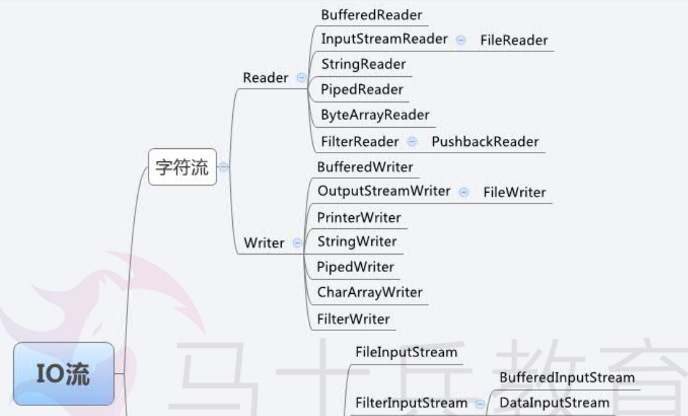
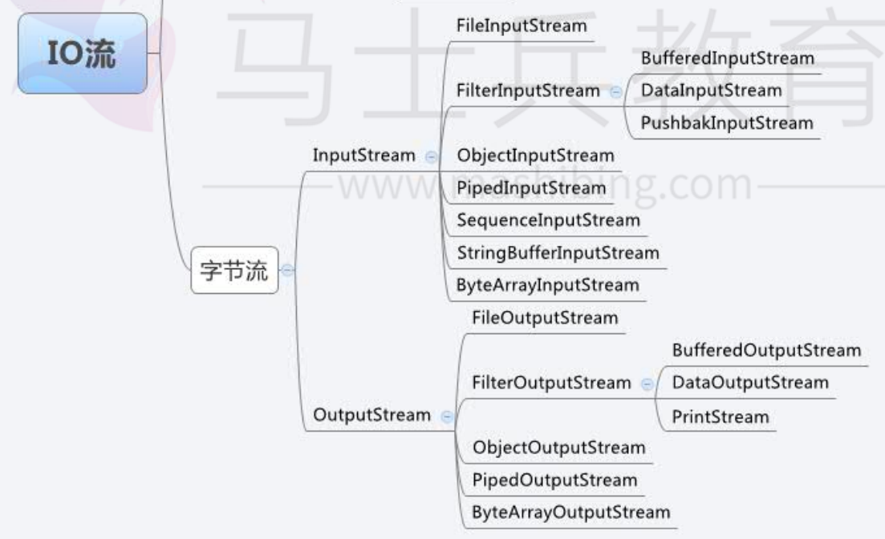
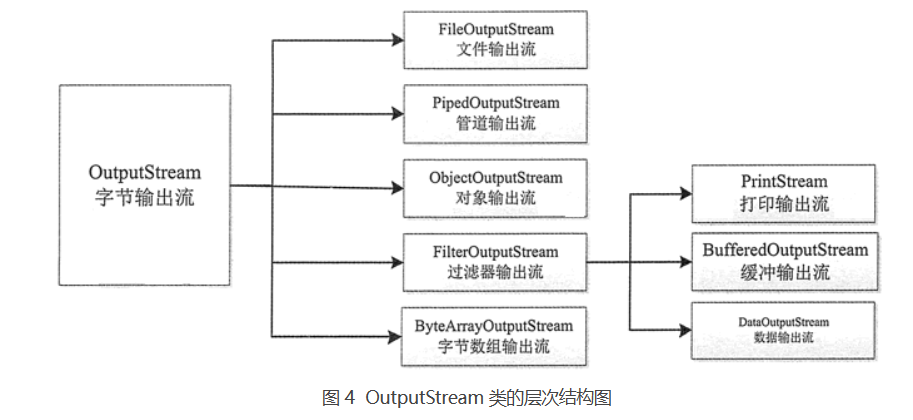

[toc]

# Java笔记15-输入输出流

在变量、数组、对象和集合中存储的数据是暂时存在的，一旦程序结束它们就会丢失。为了能够永久地保存程序创建的数据，需要将其保存到磁盘文件中，这样就可以在其他程序中使用它们。

Java 的 I/O（输入/输出）技术可以将数据保存到文本文件和二进制文件中， 以达到永久保存数据的要求。

## 流的概念

在 Java中 流是一组有序的数据序列，将数据从一个地方带到另一个地方。

* 数据在两设备间的传输称为流，流的本质是数据传输，根据数据传输特性将流抽象为各种类，方便更直观的进行数据操作。
* 流有输入和输出，输入时是流从数据源流向程序。输出时是流从程序传向数据源，而数据源可以是内存，文件，网络或程序等。


## 流的划分

### 介绍

数据流是 Java 进行 I/O 操作的对象，它按照不同的标准可以分为不同的类别。

* 按照流的方向主要分为输入流和输出流两大类。
* 数据流按照数据单位的不同分为字节流和字符流。字节流可以处理任何类型的数据，如图片，视频等，字符流只能处理字符类型的数据。
* 按照功能可以划分为节点流和处理流等。

数据流的处理只能流的方向来处理。例如数据流以输入流的形式被程序获取，再以输出流的形式将数据输出到其它设备。图 1 为输入流模式，图 2 为输出流模式。


Java 关于IO流的40多个类都是从如下4个抽象类基类中派生出来的。
* InputStream/Reader: 所有的输入流的基类，前者是字节输入流，后者是字符输入流。
* OutputStream/Writer: 所有输出流的基类，前者是字节输出流，后者是字符输出流。

InputStream,Reader,OutputStream以及Writer，这四大抽象基类，本身并不能创建实例来执行输入/输出，但它们将成为所有输入/输出流的模版，所以它们的方法是所有输入/输出流都可以使用的方法。类似于集合中的Collection接口。





### 什么是输入/输出流？

Java 程序根据流的传输方向分为：输入流和输出流。==程序从输入流中读取数据，向输出流中写入数据。==


* 输入就是将数据从各种输入设备（包括文件、键盘等）输入到系统中。
* 输出则正好相反，是将系统数据输出到各种输出设备（比如文件、显示器、磁盘等）。
  
例如键盘就是一个标准的输入设备（数据从键盘输入到系统中），而显示器就是一个标准的输出设备（数据从系统中输出到设备中），但是文件既可以作为输入设备，又可以作为输出设备。


### 输入流：设备-》系统

Java 流相关的类都封装在 java.io 包中。所有输入流类都是 InputStream 抽象类（字节输入流）和 Reader 抽象类（字符输入流）的子类。其中 InputStream 类是字节输入流的抽象类，是所有字节输入流的父类，其层次结构如图 3 所示。


InputStream 类常用方法：


<font color="red">InputStream 类是所有字节输入流的超类，用于把目标设备的数据输出系统中，该类是抽象类，不能被实例化。</font>

### 输出流：系统-》设备

在 Java 中所有输出流类都是 OutputStream 抽象类（字节输出流）和 Writer 抽象类（字符输出流）的子类。其中 OutputStream 类是字节输出流的抽象类，是所有字节输出流的父类，其层次结构如图 4 所示。



OutputStream类的常用方法：


<font color="red">OutputStream 类是所有字节输出流的超类，用于以二进制的形式将数据从系统中写入目标设备，该类是抽象类，不能被实例化。</font>


## 系统流

每个Java程序运行时都带有一个系统流，系统流对应的类为 java.lang.System。Sytem 类封装了Java程序运行时的 3 个系统流，分别通过 in、out 和 err 变量来引用。这 3 个系统流如下所示：

```
System.in：标准输入流，默认设备是键盘。
System.out：标准输出流，默认设备是控制台。
System.err：标准错误流，默认设备是控制台。
```


例子:演示了如何使用 System.in 读取字节数组，使用 System.out 输出字节数组。
```java
public class Test01 {
    public static void main(String[] args) {
        byte[] byteData = new byte[100]; // 声明一个字节数组
        System.out.println("请输入英文：");
        try {
            System.in.read(byteData);
        } catch (IOException e) {
            e.printStackTrace();
        }
        System.out.println("您输入的内容如下：");
        for (int i = 0; i < byteData.length; i++) {
            System.out.print((char) byteData[i]);
        }
    }
}


// 程序运行结果如下所示：
// 请输入英文：
// abcdefg hijklmn opqrst uvwxyz
// 您输入的内容如下：
// abcdefg hijklmn opqrst uvwxyz
```


## File类

在 Java 中，File 类是 java.io 包中唯一代表磁盘文件本身的对象，也就是说，如果希望在程序中操作文件和目录，则都可以通过 File 类来完成。File 类定义了一些方法来操作文件，如新建、删除、重命名文件和目录等。

File 类不能访问文件内容本身，如果需要访问文件内容本身，则需要使用输入/输出流。

> File类的构造方法如下
```java
//通过路径名来创建一个File对象
File(String pathname)
//通过父路径，子路径创建一个File对象
File(String parent,String child) 
//根据父文件与子路径来创建File对象
File(File parent,String child) 
```

> File 类的常用方法如下


### 获取文件属性

在 Java 中获取文件属性信息的第一步是先创建一个 File 类对象并指向一个已存在的文件。

```java
//文件位于 C:\windows\notepad.exe
public class Test02 {
    public static void main(String[] args) {
        String path = "C:/windows/"; // 指定文件所在的目录
        File f = new File(path, "notepad.exe"); // 建立File变量,并设定由f变量引用
        System.out.println("C:\\windows\\notepad.exe文件信息如下：");
        System.out.println("============================================");
        System.out.println("文件长度：" + f.length() + "字节");
        System.out.println("文件或者目录：" + (f.isFile() ? "是文件" : "不是文件"));
        System.out.println("文件或者目录：" + (f.isDirectory() ? "是目录" : "不是目录"));
        System.out.println("是否可读：" + (f.canRead() ? "可读取" : "不可读取"));
        System.out.println("是否可写：" + (f.canWrite() ? "可写入" : "不可写入"));
        System.out.println("是否隐藏：" + (f.isHidden() ? "是隐藏文件" : "不是隐藏文件"));
        System.out.println("最后修改日期：" + new Date(f.lastModified()));
        System.out.println("文件名称：" + f.getName());
        System.out.println("文件路径：" + f.getPath());
        System.out.println("绝对路径：" + f.getAbsolutePath());
    }
}
```

### 创建和删除文件

File 类 创建文件需要调用 createNewFile() 方法，删除文件需要调用 delete() 方法。无论是创建还是删除文件通常都先调用 exists() 方法判断文件是否存在。

```java
public class Test03 {
    public static void main(String[] args) throws IOException {
        File f = new File("C:\\test.txt"); // 创建指向文件的File对象
        if (f.exists()) // 判断文件是否存在
        {
            f.delete(); // 存在则先删除
        }
        f.createNewFile(); // 再创建
    }
}

// Windows 中使用反斜杠\表示目录的分隔符。
// Linux 中使用正斜杠/表示目录的分隔符。
// 也可以使用 File.separator 表示分隔符，可以适应任何操作系统

// File.separator 可以适应任何操作系统
String path = "C:" + File.separator + "test.txt"; 
```


### 创建和删除目录

File 类除了对文件的创建和删除外，还可以创建和删除目录。创建目录需要调用 mkdir() 方法，删除目录需要调用 delete() 方法。无论是创建还是删除目录都可以调用 exists() 方法判断目录是否存在。

```java
//判断 C 盘根目录下是否存在 config 目录，如果存在则先删除再创建
public class Test04 {
    public static void main(String[] args) {
        String path = "C:/config/"; // 指定目录位置
        File f = new File(path); // 创建File对象
        if (f.exists()) {
            f.delete();
        }
        f.mkdir(); // 创建目录
    }
}
```

### 遍历目录

通过遍历目录可以在指定的目录中查找文件，或者显示所有的文件列表。File 类的 list() 方法提供了遍历目录功能，该方法有如下两种重载形式。

```java
//方式1
String[] list()
//方式2
String[] list(FilenameFilter filter)
```

方式1：表示返回由 File 对象表示目录中所有文件和子目录名称组成的字符串数组，如果调用的 File 对象不是目录，则返回 null。

方式2：作用与 list() 方法相同，不同的是返回数组中仅包含符合 filter 过滤器的文件和目录，如果 filter 为 null，则接受所有名称。

例子1：遍历目录下的第一层文件（若目录有文件，则无法遍历）
```java
public static void main(String[] args) throws Exception {
		//根据路径创建实例化对象
		File file=new File("D:\\study");
		//判断是否是一个目录
		if(file.isDirectory()) {
			String[] str=file.list();//获得该目录下的所有文件名
			for(String s:str) {
				System.out.println(s);
			}
			
		}
}
```

例子2：遍历目录下的所有文件（包括子目录中的文件）
```java
public static void main(String[] args) throws Exception {
		//根据路径创建实例化对象
		File file=new File("D:\\study");
		//判断是否是一个目录
		if(file.isDirectory()) {
			File[] f=file.listFiles();  //获取目录下的所有文件与子目录
			for(File fo:f) {
				System.out.println(fo);
				//对每一个文件对象再次遍历
				if(fo.isDirectory()) {
					String[] str=fo.list();  //获取目录下的所有文件名
					for(String s:str) {
						System.out.println(s);
					}
				}
			}
		}
	}
```


## 字节流

InputStream 是 Java 所有字节输入流类的父类，OutputStream 是 Java 所有字节输出流类的父类，它们都是一个抽象类，因此继承它们的子类要重新定义父类中的抽象方法。


### 字节输入流 InputStream

InputStream 类及其子类的对象表示字节输入流，使用 InputStream 类的方法可以从流中读取一个或一批字节。

> InputStream 类的常用子类如下
```
ByteArrayInputStream 类：将字节数组转换为字节输入流，从中读取字节。
FileInputStream 类：从文件中读取数据。
PipedInputStream 类：连接到一个 PipedOutputStream（管道输出流）。
SequenceInputStream 类：将多个字节输入流串联成一个字节输入流。
ObjectInputStream 类：将对象反序列化。
```


> InputStream 类的常用方法如图


### 字节输出流 OutputStream

OutputStream 类及其子类的对象表示一个字节输出流，利用 OutputStream 类的方法可以从流中写入一个或一批字节。

> OutputStream 类的常用子类如下。
```
ByteArrayOutputStream 类：向内存缓冲区的字节数组中写数据。
FileOutputStream 类：向文件中写数据。
PipedOutputStream 类：连接到一个 PipedlntputStream（管道输入流）。
ObjectOutputStream 类：将对象序列化。
```

> OutputStream 类的常用方法如图


### 字节数组输入流 ByteArrayInputStream

ByteArrayInputStream 类可以从内存的字节数组中读取数据，该类有如下两种构造方法重载形式。

```java
//创建一个字节数组输入流，字节数组类型的数据源由参数 buf 指定。
ByteArrayInputStream(byte[] buf)：

//创建一个字节数组输入流，其中，buf 指定字节数组类型的数据源，offset 指定在数组中开始读取数据的起始下标位置，length 指定读取的元素个数。
ByteArrayInputStream(byte[] buf,int offse,int length)：
```

> 例子：使用 ByteArrayInputStream 类编写一个案例，实现从一个字节数组中读取数据，再转换为 int 型进行输出。
```java
public class test08 {
    public static void main(String[] args) {
        byte[] b = new byte[] { 1, -1, 25, -22, -5, 23 }; // 创建数组
        ByteArrayInputStream bais = new ByteArrayInputStream(b, 0, 6); // 创建字节数组输入流
        int i = bais.read(); // 从输入流中读取下一个字节，并转换成int型数据
        while (i != -1) { // 如果不返回-1，则表示没有到输入流的末尾
            System.out.println("原值=" + (byte) i + "\t\t\t转换为int类型=" + i);
            i = bais.read(); // 读取下一个
        }
    }
}
```

### 字节数组输出流 ByteArrayOutputStream

ByteArrayOutputStream 类可以向内存的字节数组中写入数据，该类的构造方法有如下两种重载形式。

```java
//创建一个字节数组输出流，输出流缓冲区的初始容量大小为 32 字节。
ByteArrayOutputStream();
//创建一个字节数组输出流，输出流缓冲区的初始容量大小由参数 size 指定。
ByteArrayOutputStream(int size);
```

> 例子:使用 ByteArrayOutputStream 类将字节数组中的数据输出
```java
public class Test09 {
    public static void main(String[] args) {
        ByteArrayOutputStream baos = new ByteArrayOutputStream();
        byte[] b = new byte[] { 1, -1, 25, -22, -5, 23 }; // 创建数组
        baos.write(b, 0, 6); // 将字节数组b中的前4个字节元素写到输出流中
        System.out.println("数组中一共包含：" + baos.size() + "字节"); // 输出缓冲区中的字节数
        byte[] newByteArray = baos.toByteArray(); // 将输出流中的当前内容转换成字节数组
        System.out.println(Arrays.toString(newByteArray)); // 输出数组中的内容
    }
}

// 输出结果如下:
// 数组中一共包含：6字节
// [1, -1, 25, -22, -5, 23]
```

### 文件输入流 FileInputStream

FileInputStream 是 Java 流中比较常用的一种，它表示从文件系统的某个文件中获取输入字节。通过使用 FileInputStream 可以访问文件中的一个字节、一批字节或整个文件。

<font color="red">在创建 FileInputStream 类的对象时，如果找不到指定的文件将拋出 FileNotFoundException 异常，该异常必须捕获或声明拋出。</font>

> FileInputStream 常用的构造方法主要有如下两种重载形式
```java
//通过打开一个到实际文件的连接来创建一个 FileInputStream，该文件通过文件系统中的 File 对象 file 指定。
FileInputStream(File file);
//通过打开一个到实际文件的链接来创建一个 FileInputStream，该文件通过文件系统中的路径名 name 指定。
FileInputStream(String name);
```

> 例子：使用 FileInputStream 类读取并输出文件的内容
```java
public class Test10 {
    public static void main(String[] args) {
        File f = new File("D:/myJava/HelloJava.java");
        FileInputStream fis = null;
        try {
            // 因为File没有读写的能力,所以需要有个InputStream
            fis = new FileInputStream(f);
            // 定义一个字节数组
            byte[] bytes = new byte[1024];
            int n = 0; // 得到实际读取到的字节数
            System.out.println("D:\\myJava\\HelloJava.java文件内容如下：");
            // 循环读取
            while ((n = fis.read(bytes)) != -1) {
                String s = new String(bytes, 0, n); // 将数组中从下标0到n的内容给s
                System.out.println(s);
            }
        } catch (Exception e) {
            e.printStackTrace();
        } finally {
            try {
                fis.close();
            } catch (IOException e) {
                e.printStackTrace();
            }
        }
    }
}
```

<font color="red">注意：FileInputStream 类重写了父类 InputStream 中的 read() 方法、skip() 方法、available() 方法和 close() 方法，不支持 mark() 方法和 reset() 方法。</font>


### 文件输出流 FileOutputStream

FileOutputStream 类继承自 OutputStream 类，重写和实现了父类中的所有方法。FileOutputStream 类的对象表示一个文件字节输出流，可以向流中写入一个字节或一批字节。在创建 FileOutputStream 类的对象时，如果指定的文件不存在，则创建一个新文件；如果文件已存在，则清除原文件的内容重新写入。

> FileOutputStream 类的构造方法主要有如下 4 种重载形式
```java
//创建一个文件输出流，参数 file 指定目标文件
FileOutputStream(File file);

//创建一个文件输出流，参数 file 指定目标文件，append 指定是否将数据添加到目标文件的内容末尾，如果为 true，则在末尾添加；如果为 false，则覆盖原有内容；其默认值为 false。
FileOutputStream(File file,boolean append);

//创建一个文件输出流，参数 name 指定目标文件的文件路径信息
FileOutputStream(String name);

//创建一个文件输出流，参数 name 和 append 的含义同上
FileOutputStream(String name,boolean append);
```

注意：使用构造方法 FileOutputStream(String name,boolean append) 创建一个文件输出流对象，它将数据附加在现有文件的末尾。该字符串 name 指明了原文件，如果只是为了附加数据而不是重写任何已有的数据，布尔类型参数 append 的值应为 true。

> 对文件输出流有如下四点说明：
```
1. 在 FileOutputStream 类的构造方法中指定目标文件时，目标文件可以不存在。
2. 目标文件的名称可以是任意的，例如 `D:\\abc、D:\\abc.de 和 D:\\abc.de.fg` 等都可以，可以使用记事本等工具打开并浏览这些文件中的内容。
3. 目标文件所在目录必须存在，否则会拋出 java.io.FileNotFoundException 异常。
4. 目标文件的名称不能是已存在的目录。例如 D 盘下已存在 Java 文件夹，那么就不能使用 Java 作为文件名，即不能使用 D:\\Java，否则抛出 java.io.FileNotFoundException 异常。
```

> 例子:使用 FileInputStream 类读取HelloJava.java文件的数据，然后写入到HelloJava.java文件中
```java
public class Test11 {
    public static void main(String[] args) {
        FileInputStream fis = null; // 声明FileInputStream对象fis
        FileOutputStream fos = null; // 声明FileOutputStream对象fos
        try {
            File srcFile = new File("D:/myJava/HelloJava.java");
            fis = new FileInputStream(srcFile); // 实例化FileInputStream对象
            File targetFile = new File("D:/myJava/HelloJava.txt"); // 创建目标文件对象，该文件不存在
            fos = new FileOutputStream(targetFile); // 实例化FileOutputStream对象
            byte[] bytes = new byte[1024]; // 每次读取1024字节
            int i = fis.read(bytes);
            while (i != -1) {
                fos.write(bytes, 0, i); // 向D:\HelloJava.txt文件中写入内容
                i = fis.read(bytes);
            }
            System.out.println("写入结束！");
        } catch (Exception e) {
            e.printStackTrace();
        } finally {
            try {
                fis.close(); // 关闭FileInputStream对象
                fos.close(); // 关闭FileOutputStream对象
            } catch (IOException e) {
                e.printStackTrace();
            }
        }
    }
}
```

### 文件拷贝例子

```java
public static void main(String[] args) throws Exception {
	//输入流读取文件数据
	FileInputStream fin=new FileInputStream("C:\\Users\\Desktop\\a.txt");
	//输出流写入数据到b文件
	FileOutputStream os = new FileOutputStream("C:\\Users\\Desktop\\b.txt");
	int t=0;   //存储读取的一个字节
	while(true) {
		t=fin.read();
		if(t==-1) {   //-1表示读取数据完毕
			break;
		}
		os.write(t);    //把从文件a读取的数据，写入到文件b中
	}
	
	fin.close();
	os.close(); 
	}
```

### 字节流缓冲区

>通过定义一个字节数组作为缓冲区，来提高字节流读取写入的效率。
>例：通过缓冲区来拷贝文件：

```java
public static void main(String[] args) throws Exception {
	//输入流读取文件数据
	FileInputStream fin=new FileInputStream("C:\\Users\\Desktop\\a.txt");
	//输出流写入数据到b文件
	FileOutputStream os = new FileOutputStream("C:\\Users\\Desktop\\b.txt");
	byte[] b=new byte[1024];  //定义字节数组作为缓冲区
	int t;   //临时存储一个字节
	while(true) {
		t=fin.read(b);
		if(t==-1) {   //-1表示读取数据完毕
			break;
		}
		os.write(b);   //把缓冲区的数据写入到文件b中
	}
	
	fin.close();
	os.close(); 
	}
```

### 字节缓冲流 BufferedInputStream , BufferedOutputStream 

>这两个流在读写数据时提供缓冲功能。
>BufferedInputStream的实例化需要FileInputStream的对象
>BufferedOutputStream的实例化需要FileOutputStream的对象

```java
public static void main(String[] args) throws Exception {
	FileInputStream fin=new FileInputStream("C:\\Users\\Desktop\\a.txt");
	BufferedInputStream bs=new BufferedInputStream(fin);

	FileOutputStream os = new FileOutputStream("C:\\Users\\Desktop\\b.txt");
	BufferedOutputStream bo=new BufferedOutputStream(os);
	int t;   //临时存储一个字节
	while(true) {
		t=bs.read();
		if(t==-1) {   //-1表示读取数据完毕
			break;
		}
		bo.write(t);   //把缓冲区的数据写入到文件b中
	}

	bs.close();
	bo.close(); 
	}
```

## 字符流

字符流有两个顶级抽象类Reader,Writer.


- 字符流有两个顶级抽象类Reader,Writer。程序中经常使用他们的实现类来读写数据。
- InputSteamReader类可以把InputSteam转换为Reader
- OutputSteamWriter类可以把OutputSteam转换为Writer

### 字符输入流 Reader

Reader 类是所有字符流输入类的父类，该类定义了许多方法，这些方法对所有子类都是有效的。

> Reader 类的常用子类如下
```
CharArrayReader 类：将字符数组转换为字符输入流，从中读取字符。
StringReader 类：将字符串转换为字符输入流，从中读取字符。
BufferedReader 类：为其他字符输入流提供读缓冲区。
PipedReader 类：连接到一个 PipedWriter。
InputStreamReader 类：将字节输入流转换为字符输入流，可以指定字符编码。
```

与 InputStream 类相同，在 Reader 类中也包含 close()、mark()、skip() 和 reset() 等方法，这些方法可以参考 InputStream 类的方法。下面主要介绍 Reader 类中的 read() 方法，如下图所示。


### 字符输出流 Writer

与 Reader 类相反，Writer 类是所有字符输出流的父类，该类中有许多方法，这些方法对继承该类的所有子类都是有效的。

> Writer 类的常用子类如下
```
CharArrayWriter 类：向内存缓冲区的字符数组写数据。
StringWriter 类：向内存缓冲区的字符串（StringBuffer）写数据。
BufferedWriter 类：为其他字符输出流提供写缓冲区。
PipedWriter 类：连接到一个 PipedReader。
OutputStreamReader 类：将字节输出流转换为字符输出流，可以指定字符编码。
```

与 OutputStream 类相同，Writer 类也包含 close()、flush() 等方法，这些方法可以参考 OutputStream 类的方法。下面主要介绍 Writer 类中的 write() 方法和 append() 方法，如图所示。


<font color="red">注意：Writer 类所有的方法在出错的情况下都会引发 IOException 异常。关闭一个流后，再对其进行任何操作都会产生错误。</font>

### 字符文件输入流 FileReader

为了读取方便，Java 提供了用来读取字符文件的便捷类——FileReader。

> 该类的构造方法有如下两种重载形式
```java
//在给定要读取数据的文件的情况下创建一个新的 FileReader 对象。其中，file 表示要从中读取数据的文件。
FileReader(File file);
//在给定从中读取数据的文件名的情况下创建一个新 FileReader 对象。其中，fileName 表示要从中读取数据的文件的名称，表示的是一个文件的完整路径。
FileReader(String fileName);
```

在用该类的构造方法创建 FileReader 读取对象时，默认的字符编码及字节缓冲区大小都是由系统设定的。要自己指定这些值，可以在 FilelnputStream 上构造一个 InputStreamReader。

字符流和字节流的操作步骤相同，都是首先创建输入流或输出流对象，即建立连接管道，建立完成后进行读或写操作，最后关闭输入/输出流通道。

> 例子：将文件中的内容读取并输出到控制台
```java
public class Test12 {
    public static void main(String[] args) {
        FileReader fr = null;
        try {
            fr = new FileReader("D:/myJava/HelloJava.java"); // 创建FileReader对象
            int i = 0;
            System.out.println("D:\\myJava\\HelloJava.java文件内容如下：");
            while ((i = fr.read()) != -1) { // 循环读取
                System.out.print((char) i); // 将读取的内容强制转换为char类型
            }
        } catch (Exception e) {
            System.out.print(e);
        } finally {
            try {
                fr.close(); // 关闭对象
            } catch (IOException e) {
                e.printStackTrace();
            }
        }
    }
}
```

### 字符文件输出流 FileWriter
 
Java 提供了写入字符文件的便捷类——FileWriter。

> 该类的构造方法有如下 4 种重载形式。
```java
//在指定 File 对象的情况下构造一个 FileWriter 对象。其中，file 表示要写入数据的 File 对象。
FileWriter(File file);
//在指定 File 对象的情况下构造一个 FileWriter 对象，如果 append 的值为 true，则将字节写入文件末尾，而不是写入文件开始处。
FileWriter(File file,boolean append);
//在指定文件名的情况下构造一个 FileWriter 对象。其中，fileName 表示要写入字符的文件名，表示的是完整路径。
FileWriter(String fileName);
//在指定文件名以及要写入文件的位置的情况下构造 FileWriter 对象。其中，append 是一个 boolean 值，如果为 true，则将数据写入文件末尾，而不是文件开始处。
FileWriter(String fileName,boolean append);
```

在创建 FileWriter 对象时，默认字符编码和默认字节缓冲区大小都是由系统设定的。要自己指定这些值，可以在 FileOutputStream 上构造一个 OutputStreamWriter 对象。

FileWriter 类的创建不依赖于文件存在与否，如果关联文件不存在，则会自动生成一个新的文件。在创建文件之前，FileWriter 将在创建对象时打开它作为输出。如果试图打开一个只读文件，将引发一个 IOException 异常。

> 例子：将用户输入的4个字符串保存到文件中
```java
public class Test13 {
    public static void main(String[] args) {
        Scanner input = new Scanner(System.in);
        FileWriter fw = null;
        try {
            fw = new FileWriter("D:\\myJava\\book.txt"); // 创建FileWriter对象
            for (int i = 0; i < 4; i++) {
                System.out.println("请输入第" + (i + 1) + "个字符串：");
                String name = input.next(); // 读取输入的名称
                fw.write(name + "\r\n"); // 循环写入文件
            }
            System.out.println("录入完成！");
        } catch (Exception e) {
            System.out.println(e.getMessage());
        } finally {
            try {
                fw.close(); // 关闭对象
            } catch (IOException e) {
                e.printStackTrace();
            }
        }
    }
}
```

### 字符缓冲区输入流 BufferedReader

BufferedReader 类主要用于辅助其他字符输入流，它带有缓冲区，可以先将一批数据读到内存缓冲区。接下来的读操作就可以直接从缓冲区中获取数据，而不需要每次都从数据源读取数据并进行字符编码转换，这样就可以提高数据的读取效率。

> BufferedReader 类的构造方法有如下两种重载形式。
```java
//创建一个 BufferedReader 来修饰参数 in 指定的字符输入流。
BufferedReader(Reader in);
//创建一个 BufferedReader 来修饰参数 in 指定的字符输入流，参数 size 则用于指定缓冲区的大小，单位为字符。
BufferedReader(Reader in,int size);
```

除了可以为字符输入流提供缓冲区以外，BufferedReader 还提供了 readLine() 方法，该方法返回包含该行内容的字符串，但该字符串中不包含任何终止符，如果已到达流末尾，则返回 null。readLine() 方法表示每次读取一行文本内容，当遇到换行（\n）、回车（\r）或回车后直接跟着换行标记符即可认为某行已终止。

> 例子：逐行读取文件中的内容
```java
public class Test13 {
    public static void main(String[] args) {
        FileReader fr = null;
        BufferedReader br = null;
        try {
            fr = new FileReader("D:\\myJava\\book.txt"); // 创建 FileReader 对象
            br = new BufferedReader(fr); // 创建 BufferedReader 对象
            System.out.println("D:\\myJava\\book.txt 文件中的内容如下：");
            String strLine = "";
            while ((strLine = br.readLine()) != null) { // 循环读取每行数据
                System.out.println(strLine);
            }
        } catch (FileNotFoundException e1) {
            e1.printStackTrace();
        } catch (IOException e) {
            e.printStackTrace();
        } finally {
            try {
                fr.close(); // 关闭 FileReader 对象
                br.close();
            } catch (IOException e) {
                e.printStackTrace();
            }
        }
    }
}
```

### 字符缓冲区输出流 BufferedWriter

BufferedWriter 类主要用于辅助其他字符输出流，它同样带有缓冲区，可以先将一批数据写入缓冲区，当缓冲区满了以后，再将缓冲区的数据一次性写到字符输出流，其目的是为了提高数据的写效率。

> BufferedWriter 类的构造方法有如下两种重载形式。
```java
//创建一个 BufferedWriter 来修饰参数 out 指定的字符输出流。
BufferedWriter(Writer out);
//创建一个 BufferedWriter 来修饰参数 out 指定的字符输出流，参数 size 则用于指定缓冲区的大小，单位为字符。
BufferedWriter(Writer out,int size);
```

该类除了可以给字符输出流提供缓冲区之外，还提供了一个新的方法 newLine()，该方法用于写入一个行分隔符。行分隔符字符串由系统属性 line.separator 定义，并且不一定是单个新行（\n）符。

提示：BufferedWriter 类的使用与 FileWriter 类相同，这里不再重述。


## 转换流 InputStreamReader与OutputStreamWriter

正常情况下，字节流可以对所有的数据进行操作，但是有些时候在处理一些文本时我们要用到字符流，比如，查看文本的中文时就是需要采用字符流更为方便。所以 Java IO 流中提供了两种用于将字节流转换为字符流的转换流。

* InputStreamReader 用于将字节输入流转换为字符输入流
* OutputStreamWriter 用于将字节输出流转换为字符输出流。

使用转换流可以在一定程度上避免乱码，还可以指定输入输出所使用的字符集。

```java
public static void main(String[] args) {
    try {
        FileInputStream fis = new FileInputStream("D://java.txt");
        InputStreamReader isr = new InputStreamReader(fis, "UTF-8");
        int b = 0;
        while ((b = isr.read()) != -1) {
            System.out.print((char) b);    // 输出结果为“C语言中文网”
        }
    } catch (FileNotFoundException e) {
        // TODO Auto-generated catch block
        e.printStackTrace();
    } catch (IOException e) {
        // TODO Auto-generated catch block
        e.printStackTrace();
    }
}
```