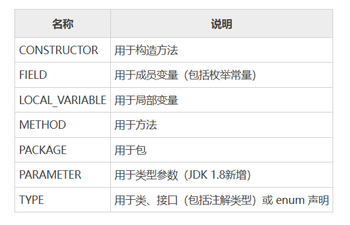

[toc]

# Java笔记16-注解

从 Java 5 开始，Java 增加了对元数据的支持，也就是注解。注解是代码里的特殊标记，这些标记可以在编译、类加载和运行时被读取，并执行相应的处理。开发人员可以通过注解在不改变原有代码和逻辑的情况下在源代码中嵌入补充信息。

## 介绍

注解都是 @ 符号开头的，注解并不能改变程序的运行结果，也不会影响程序运行的性能。有些注解可以在编译时给用户提示或警告，有的注解可以在运行时读写字节码文件信息。

> 注解常见的作用有以下几种
* 生成帮助文档。这是最常见的，也是 Java 最早提供的注解。常用的有 @see、@param 和 @return 等；
* 跟踪代码依赖性，实现替代配置文件功能。比较常见的是 Spring 2.5 开始的基于注解配置。作用就是减少配置。现在的框架基本都使用了这种配置来减少配置文件的数量；
* 在编译时进行格式检查。如把 @Override 注解放在方法前，如果这个方法并不是重写了父类方法，则编译时就能检查出。

> 注解的分类：
1. 标准注解（内置注解）：Java程序语言自带的注解，例如：@Override用于说明所标注的方法是重写父类的方法。
2. 元注解：Java程序语言自带的注解，主要用于指定用户的自定义注解。即修饰自定义注解的注解。例如：@Target用于指定用户自定义的注解只能修饰程序中哪些元素。
3. 自定义注解：该注解是用户自行编写的。

## @Override注解

@Override 注解是用来指定方法重写的，只能修饰方法并且只能用于方法重写，不能修饰其它的元素。它可以强制一个子类必须重写父类方法或者实现接口的方法。

```java
public class Person {
    private String name = "";
    private int age;
    
    @Override
    public String toString() { //toString()
        return "Person [name=" + name + ", age=" + age + "]";
    }
}
```

上述代码中 toString() 方法使用 @Override 注解。如果 toString() 不小心写成了 t0String()，那么程序会发生编译错误。所以 @Override 的作用是告诉编译器检查这个方法，保证父类要包含一个被该方法重写的方法，否则就会编译出错。这样可以帮助程序员避免一些低级错误。

当然如果代码中的方法前面不加 @Override 注解，即便是方法编辑错误了，编译器也不会有提示。但是由于 Object 父类的 toString() 方法并没有被重写，将可能会引起程序出现 Bug（缺陷）。

## @Deprecated注解

Java 中 @Deprecated 可以用来注解类、接口、成员方法和成员变量等，用于表示某个类、方法等已过时。当其他程序使用已过时的元素时，编译器将会给出警告。

例子
```java
@Deprecated
public class Person {
    //标记name变量将会过时
    @Deprecated
    protected String name;
    private int age;

    public String getName() {
        return name;
    }

    public void setName(String name) {
        this.name = name;
    }

    public int getAge() {
        return age;
    }

    public void setAge(int age) {
        this.age = age;
    }
    //标记setNameAndAge方法将会过时
    @Deprecated
    public void setNameAndAge(String name, int age) {
        this.name = name;
        this.age = age;
    }

    @Override
    public String toString() {
        return "Person [name=" + name + ", age=" + age + "]";
    }
}
```


## @FunctionalInterface 注解

如果接口中只有一个抽象方法，那么该接口就是函数式接口。@FunctionalInterface 注解就是用来指定某个接口必须是函数式接口，所以 @FunctionalInterface 只能修饰接口，不能修饰其它程序元素。

>函数式接口就是为 Java 8 的 Lambda 表达式准备的，Java 8 允许使用 Lambda 表达式创建函数式接口的实例，因此 Java 8 专门增加了 @FunctionalInterface。

```java
//指定FunInterface接口必须是函数式接口
@FunctionalInterface
public interface FunInterface {
    static void print() {
        System.out.println("C语言中文网");
    }

    default void show() {
        System.out.println("我正在学习C语言中文网Java教程");
    }

    void test(); // 只定义一个抽象方法
}
```

@FunctionalInterface 注解的作用只是告诉编译器检查这个接口，保证该接口只能包含一个抽象方法，否则就会编译出错。

## 元注解

元注解是负责对其它注解进行说明的注解，自定义注解时可以使用元注解。

### @Documented

@Documented 是一个标记注解，没有成员变量。用 @Documented 注解修饰的注解类会被 JavaDoc 工具提取成文档。默认情况下，JavaDoc 是不包括注解的，但如果声明注解时指定了 @Documented，就会被 JavaDoc 之类的工具处理，所以注解类型信息就会被包括在生成的帮助文档中。

```java

// 自定义一个注解
@Documented
@Target({ ElementType.TYPE, ElementType.METHOD })
public @interface MyDocumented {
    public String value() default "这是@Documented注解";
}

//-------------

@MyDocumented
public class DocumentedTest {
    /**
     * 测试document
     */
    @MyDocumented
    public String Test() {
        return "C语言中文网Java教程";
    }
}
```

### @Target

@Target 注解用来指定一个注解的使用范围，即被 @Target 修饰的注解可以用在什么地方。@Target 注解有一个成员变量（value）用来设置适用目标，value 是 java.lang.annotation.ElementType 枚举类型的数组，下表为 ElementType 常用的枚举常量。



例子
```java
@Target({ ElementType.METHOD })
public @interface MyTarget {
}

//----------
class Test {
    @MyTarget
    String name;
}
```

### @Retention

@Retention 用于描述注解的生命周期，也就是该注解被保留的时间长短。@Retention 注解中的成员变量（value）用来设置保留策略，value 是 java.lang.annotation.RetentionPolicy 枚举类型，RetentionPolicy 有 3 个枚举常量，如下所示。
* SOURCE：在源文件中有效（即源文件保留）
* CLASS：在 class 文件中有效（即 class 保留）
* RUNTIME：在运行时有效（即运行时保留）

生命周期大小排序为 SOURCE < CLASS < RUNTIME，前者能使用的地方后者一定也能使用。如果需要在运行时去动态获取注解信息，那只能用 RUNTIME 注解；如果要在编译时进行一些预处理操作，比如生成一些辅助代码（如 ButterKnife），就用 CLASS 注解；如果只是做一些检查性的操作，比如 @Override 和 @SuppressWarnings，则可选用 SOURCE 注解。

### @Inherited

@Inherited 是一个标记注解，用来指定该注解可以被继承。使用 @Inherited 注解的 Class 类，表示这个注解可以被用于该 Class 类的子类。就是说如果某个类使用了被 @Inherited 修饰的注解，则其子类将自动具有该注解。

例子
```java
@Target({ ElementType.TYPE })
@Inherited
@Retention(RetentionPolicy.RUNTIME)
public @interface MyInherited {
}

//-------------

@MyInherited
public class TestA {
    public static void main(String[] args) {
        System.out.println(TestA.class.getAnnotation(MyInherited.class));
        System.out.println(TestB.class.getAnnotation(MyInherited.class));
        System.out.println(TestC.class.getAnnotation(MyInherited.class));
    }
}
class TestB extends TestA {
}
class TestC extends TestB {
}
```

### @Repeatable

@Repeatable 注解允许在相同的程序元素中重复注解，在需要对同一种注解多次使用时，往往需要借助 @Repeatable 注解。Java 8 版本以前，同一个程序元素前最多只能有一个相同类型的注解，如果需要在同一个元素前使用多个相同类型的注解，则必须使用注解“容器”。

例子
```java
public @interface Roles {
    Role[] value();
}

@Repeatable(Roles.class)
public @interface Role {
    String roleName();
}

public class RoleTest {
    @Role(roleName = "role1")
    @Role(roleName = "role2")
    public String doString(){
        return "这是C语言中文网Java教程";
    }
}
```

## 自定义注解

声明一个自定义注解使用 @interface 关键字实现。定义注解与定义接口非常像，如下代码可定义一个简单形式的注解类型。

```java
@Documented    //元注解，标记该注解是否包含在用户文档中。
@Target(ElementType.TYPE) //元注解 标记该注解用于Java那个成员部分。ElementType.TYPE表示该注解用于类、接口或者枚举声明
public @interface MyAnnotation1 {
    //给该注解定义两个属性变量
    //需要给每个属性变量设置默认值
    public String name() default "null";
    public String value() default "null";
}

@Documented    
@Target(ElementType.TYPE) 
public @interface MyAnnotation2 {
}

//--------------------------------------

//注解的使用
@MyAnnotation1(name="111",value = "111")
public class bb{
}

//注解的使用
@MyAnnotation2
public class aa{
}


```

1. 定义一个注解， 必须需要使用关键字@interface。该关键字表示该自定义注解实现了 java.lang.annotation.Annotation 接口。注意:这与使用implemented 实现接口的方式不同。
2. 上面例子中的三个元注解，都是指定该自定义注解的功能。
3. 可以在自定义注解中设置属性变量。这些属性变量需要设置默认值。当在其他地方使用自定义注解时。需要给注解的属性赋值。
