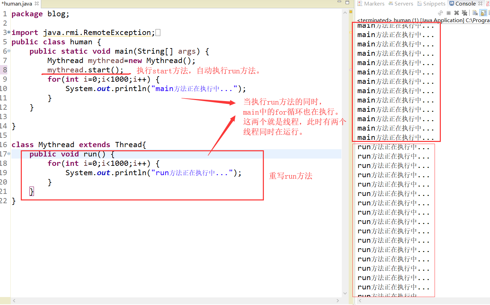
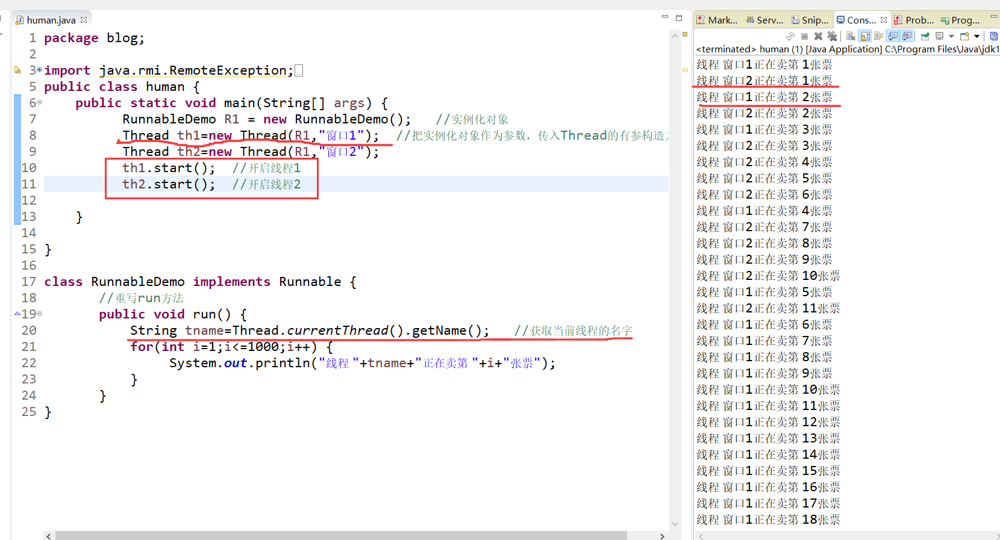
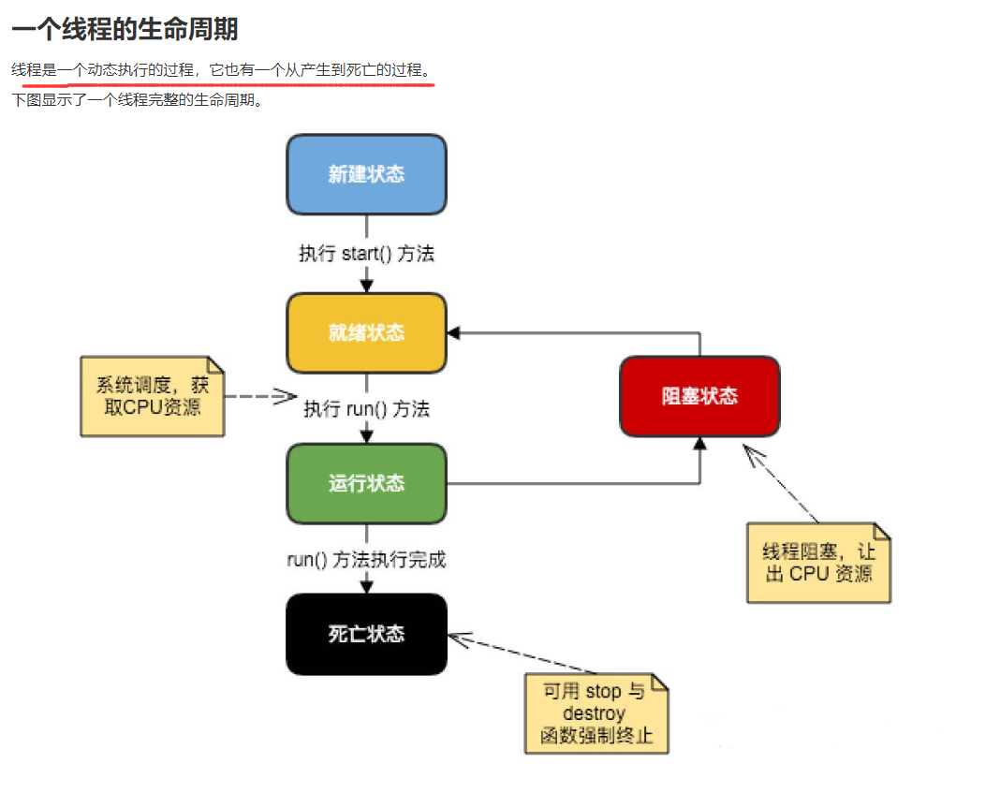

[toc]

# Java笔记17-多线程

## 1.基本概述：

>进程：每一个独立运行的程序称为进程,其包含一个或多个线程。
>线程：一个进程中可以存在多个执行单元同时运行，其中每一个执行单元叫做线程，**其中每个进程中至少存在一个线程**。

## 2.创建线程

Java 提供了2种创建线程的方法：
方式①：通过继承 Thread 类本身,重写该类的run方法。
方式②：通过实现 Runnable 接口


### 方式1

1. 若想要一个类A可以多线程运行，则需要类A继承Thread类本身,并重写Thread类的run方法。
2. 然后创建类A的实例化对象，调用类A从Thread类继承过来的start方法即可。
3. start方法内部会创建一个新线程，这个新线程会运行类A重写的run方法。


```java
//创建Mythread类，该类继承 Thread 类,重写Thread类的run方法:
class Mythread extends Thread{
	public void run() {
		for(int i=0;i<1000;i++) {
			System.out.println("run方法正在执行中...");
		}
	}
}
//创建Mythread类的实例化对象，并通过调用start()方法来创建一个新线程，该线程会运行Mythread类的run方法
public class human {
	public static void main(String[] args) {
		Mythread mythread=new Mythread();
		mythread.start();   
		for(int i=0;i<1000;i++) {
			System.out.println("main方法正在执行中...");
		}
	}
}

```




### 方式2

<font color="red">由于java只支持单继承，所以当A类已经继承B类，则A类就无法继承Thread 类，实现不了多线程操作。因此出现了方式2。所以建议用Runnable 接口实现多线程。</font>

1. 创建一个新类Demo,该类实现Runnable接口，并重写接口的run方法
2. 创建Demo类的实例化对象。
3. 调用Thread类的有参构造函数，Demo类对象作为参数传入构造方法中。
4. 执行Thread类对象的start方法，会创建一个新的线程来执行Demo类对象重写的run方法。

```java
class Demo implements Runnable {
	   //重写run方法
	   public void run() {
		   String tname=Thread.currentThread().getName();   //获取当前线程的名字
		   for(int i=1;i<=1000;i++) {
			   	System.out.println("线程 "+tname+"正在卖第 "+i+"张票");
		   } 
	   }
}

public class human {
	public static void main(String[] args) {
		  Demo R1 = new Demo();   //实例化对象
	      Thread th1=new Thread(R1,"窗口1");  //把实例化对象作为参数，传入Thread的有参构造方法中
	      Thread th2=new Thread(R1,"窗口2"); 
	      th1.start();  //开启线程1
	      th2.start();  //开启线程2
	}
	
}

```



## 2.线程的生命周期：



>新建状态:
当建立一个线程对象后，该线程对象就处于新建状态。它保持这个状态直到程序 start() 这个线程。

>就绪状态:
当调用了start()方法之后，线程就进入就绪状态。就绪状态的线程处于就绪队列中，要等待JVM里线程调度器的调度。

>运行状态:
如果就绪状态的线程获取 CPU 资源，就可以执行 run()，此时线程便处于运行状态。处于运行状态的线程最为复杂，它可以变为阻塞状态、就绪状态和死亡状态。

>阻塞状态:
如果一个线程执行了sleep（睡眠）、suspend（挂起）等方法后，失去所占用资源之后，该线程就从运行状态进入阻塞状态。在睡眠时间已到或获得设备资源后可以重新进入就绪状态。可以分为三种：
>1. 等待阻塞：线程执行 wait() 方法，使线程进入到等待阻塞状态。
>2. 同步阻塞：线程在获取 synchronized 同步锁失败(因为同步锁被其他线程占用)。
>3. 其他阻塞：通过调用线程的 sleep() 或 join() 发出了 I/O 请求时，线程就会进入到阻塞状态。当sleep() 状态超时，join() 等待线程终止或超时，或者 I/O 处理完毕，线程重新转入就绪状态。

>死亡状态:
一个运行状态的线程完成任务或者其他终止条件发生时，该线程就切 
换到终止状态。


## 3.线程的调度

线程调度是指系统为线程分派CPU处理器使用权的过程。
线程调度的方式：协同式线程调度，抢占式线程调度。

<font color="red">Java使用的线程调度方式为抢占式。</font>

> 协同式线程调度
> 线程的执行时间由线程本身来控制，线程把自己的工作执行完了之后，要主动通知系统切换到另外一个线程上去。协同式多线程的最大好处是实现简单，而且由于线程要把自己的事情干完后才会进行线程切换，切换操作对线程自己是可知的，所以一般没有什么线程同步的问题。坏处：线程执行时间不可控制，甚至如果一个线程一直不告知系统进行线程切换，那么程序就会一直阻塞在那里。

> 抢占式线程调度
> 每个线程将由系统来分配执行时间，线程的切换不由线程本身来决定。好处：抢占式线程调度方式下，线程的执行时间是系统可控的，不会出现一个线程的阻塞从而导致整个进程甚至整个系统阻塞的问题。可以通过调整线程的优先级来给线程多分配一些执行时间。

## 4.线程的同步

未完待续

## 5.线程的通信

未完待续