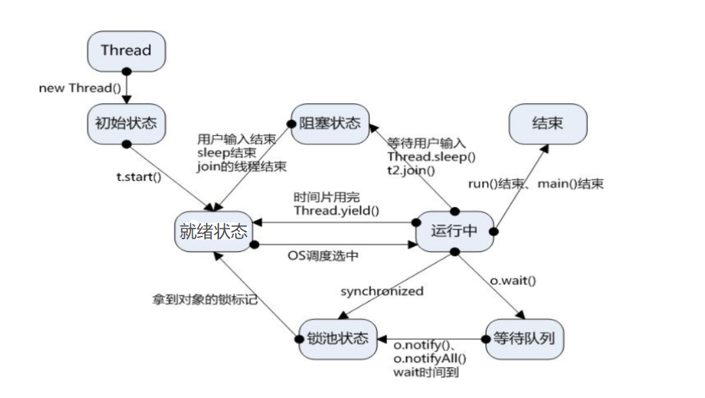

[toc]

# Java笔记17-多线程

## 什么是进程，什么是线程？

* 每一个独立运行的程序称为进程。每个进程至少包含一个或多个线程。
* 线程是CPU调度和分派的基本单位，一个进程中可以存在多个线程同时运行。

## 创建线程

Java 提供了2种创建线程的方法：
方式①：通过继承 Thread 类本身,重写该类的run方法。
方式②：通过实现 Runnable 接口

### 方式1：继承Thread类

1. 若想要一个类A可以多线程运行，则需要类A继承Thread类本身,并重写Thread类的run方法。
2. 然后创建类A的实例化对象，调用类A从Thread类继承过来的start方法即可。
3. start方法内部会创建一个新线程，这个新线程会运行类A重写的run方法。


```java
//创建Mythread类，该类继承 Thread 类,重写Thread类的run方法:
class Mythread extends Thread{
	public void run() {
		for(int i=0;i<1000;i++) {
			System.out.println("run方法正在执行中...");
		}
	}
}
//创建Mythread类的实例化对象，并通过调用start()方法来创建一个新线程，该线程会运行Mythread类的run方法
public class human {
	public static void main(String[] args) {
		Mythread mythread=new Mythread();
		mythread.start();   
		for(int i=0;i<1000;i++) {
			System.out.println("main方法正在执行中...");
		}
	}
}

```


### 方式2：实现 Runnable 接口

<font color="red">由于java只支持单继承，所以当A类已经继承B类，则A类就无法继承Thread 类，实现不了多线程操作。因此出现了方式2。所以建议用Runnable 接口实现多线程。</font>

1. 创建一个新类Demo,该类实现Runnable接口，并重写接口的run方法
2. 创建Demo类的实例化对象。
3. 调用Thread类的有参构造函数，Demo类对象作为参数传入构造方法中。
4. 执行Thread类对象的start方法，会创建一个新的线程来执行Demo类对象重写的run方法。

```java
class Demo implements Runnable {
	   //重写run方法
	   public void run() {
		   String tname=Thread.currentThread().getName();   //获取当前线程的名字
		   for(int i=1;i<=1000;i++) {
			   	System.out.println("线程 "+tname+"正在卖第 "+i+"张票");
		   } 
	   }
}

public class human {
	public static void main(String[] args) {
		  Demo R1 = new Demo();   //实例化对象
	      Thread th1=new Thread(R1,"窗口1");  //把实例化对象作为参数，传入Thread的有参构造方法中
	      Thread th2=new Thread(R1,"窗口2"); 
	      th1.start();  //开启线程1
	      th2.start();  //开启线程2
	}
	
}

```


### 两种方式对比

实现Runnable接口比继承Thread类所具有的优势：
* 适合多个相同的程序代码的线程去处理同一个资源
* 可以避免java中的单继承的限制
* 增加程序的健壮性，代码可以被多个线程共享，代码和数据独立
* 线程池只能放入实现Runable接口的线程，不能直接放入继承Thread类的线程。
* Runnable实现线程可以对线程进行复用，因为Runnable是轻量级的对象，重复new不会耗费太大资源，而Thread则不然，它是重量级对象，而且线程执行完就完了，无法再次利用

## 线程的状态与方法



### 线程状态

线程状态如下：

1. 初始状态（New）：新创建了一个线程对象。
2. 就绪状态（Runnable）：线程对象创建后，其他线程调用了该对象的start()方法。该状态的线程位于可运行线程池中，变得可运行，等待获取CPU的使用权。
3. 运行状态（Running）：就绪状态的线程获取了CPU，执行程序代码。
4. 阻塞状态（Blocked）：阻塞状态是线程因为某种原因放弃CPU使用权，暂时停止运行。直到线程进入就绪状态，才有机会转到运行状态。
    阻塞的情况分三种：
    1. 等待阻塞：运行的线程执行wait()方法，JVM会把该线程放入等待池中。(wait会释放持有的锁)
    2. 同步阻塞：运行的线程在获取对象的同步锁时，若该同步锁被别的线程占用，则JVM会把该线程放入锁池中。
    3. 其他阻塞：运行的线程执行sleep()或join()方法，或者发出了I/O请求时，JVM会把该线程置为阻塞状态。当sleep()状态超时、join()等待线程终止或者超时、或者I/O处理完毕时，线程重新转入就绪状态。（注意,sleep是不会释放持有的锁）
5. 死亡状态（Dead）：线程执行完了或者因异常退出了run()方法，该线程结束生命周期。


### 线程的方法

线程的方法如下：
```
sleep() wait() yield() notify() notifyAll() join()
```

sleep()方法：线程执行该方法会设置暂停时间。将执行机会让给其他线程。这期间该线程会进入到就绪状态，并且sleep()方法不会释放对象锁。当暂停时间结束后，便重新开始执行该线程。

wait()方法：wait是Object类的方法，对线程对象调用wait方法会导致本线程放弃对象锁，进入等待此对象的等待锁定池，只有针对此对象发出notify方法（或notifyAll）后本线程才进入对象锁定池准备获得对象锁进入运行状态。

yield()方法是停止当前线程，让同等优先权的线程或更高优先级的线程有执行的机会。如果没有的话，那么yield()方法将不会起作用，并且由可执行状态后马上又被执行。

join()方法是用于在某一个线程的执行过程中调用另一个线程执行，等到被调用的线程执行结束后，再继续执行当前线程。如：t.join();//主要用于等待t线程运行结束，若无此句，main则会执行完毕，导致结果不可预测。

notify()方法只唤醒一个等待（对象的）线程并使该线程开始执行。所以如果有多个线程等待一个对象，这个方法只会唤醒其中一个线程，选择哪个线程取决于操作系统对多线程管理的实现。

notifyAll()会唤醒所有等待(对象的)线程，尽管哪一个线程将会第一个处理取决于操作系统的实现。

#### sleep()方法和wait()方法


## 线程的生命周期


>新建状态:
当建立一个线程对象后，该线程对象就处于新建状态。它保持这个状态直到程序 start() 这个线程。

>就绪状态:
当调用了start()方法之后，线程就进入就绪状态。就绪状态的线程处于就绪队列中，要等待JVM里线程调度器的调度。

>运行状态:
如果就绪状态的线程获取 CPU 资源，就可以执行 run()，此时线程便处于运行状态。处于运行状态的线程最为复杂，它可以变为阻塞状态、就绪状态和死亡状态。

>阻塞状态:
如果一个线程执行了sleep（睡眠）、suspend（挂起）等方法后，失去所占用资源之后，该线程就从运行状态进入阻塞状态。在睡眠时间已到或获得设备资源后可以重新进入就绪状态。可以分为三种：
>1. 等待阻塞：线程执行 wait() 方法，使线程进入到等待阻塞状态。
>2. 同步阻塞：线程在获取 synchronized 同步锁失败(因为同步锁被其他线程占用)。
>3. 其他阻塞：通过调用线程的 sleep() 或 join() 发出了 I/O 请求时，线程就会进入到阻塞状态。当sleep() 状态超时，join() 等待线程终止或超时，或者 I/O 处理完毕，线程重新转入就绪状态。

>死亡状态:
一个运行状态的线程完成任务或者其他终止条件发生时，该线程就切 
换到终止状态。


<font color="red">注意：启动一个线程是调用start()方法，这并不意味着线程就会立即运行，只是进入了可运行状态。直接调用run()方法不会产生线程，而是把它当作普通的方法来执行。</font>


## 线程的调度

线程调度是指系统为线程分派CPU处理器使用权的过程。
线程调度的方式：协同式线程调度，抢占式线程调度。

<font color="red">Java使用的线程调度方式为抢占式。</font>

> 协同式线程调度
> 线程的执行时间由线程本身来控制，线程把自己的工作执行完了之后，要主动通知系统切换到另外一个线程上去。协同式多线程的最大好处是实现简单，而且由于线程要把自己的事情干完后才会进行线程切换，切换操作对线程自己是可知的，所以一般没有什么线程同步的问题。坏处：线程执行时间不可控制，甚至如果一个线程一直不告知系统进行线程切换，那么程序就会一直阻塞在那里。

> 抢占式线程调度
> 每个线程将由系统来分配执行时间，线程的切换不由线程本身来决定。好处：抢占式线程调度方式下，线程的执行时间是系统可控的，不会出现一个线程的阻塞从而导致整个进程甚至整个系统阻塞的问题。可以通过调整线程的优先级来给线程多分配一些执行时间。

## 线程的同步

未完待续

## 线程的通信

未完待续

## 死锁

死锁是指多个进程因竞争资源而造成的一种僵局（互相等待），若无外力作用，这些进程都将无法向前推进。

<font color="red">例如，某计算机系统中只有一台打印机和一台输入设备，进程P1正占用输入设备，同时又提出使用打印机的请求，但此时打印机正被进程P2 所占用，而P2在未释放打印机之前，又提出请求使用正被P1占用着的输入设备。这样两个进程相互无休止地等待下去，均无法继续执行，此时两个进程陷入死锁状态。</font>

>死锁产生的几个条件：

1. 系统资源的竞争
通常系统中拥有的不可剥夺资源，其数量不足以满足多个进程运行的需要，使得进程在 运行过程中，会因争夺资源而陷入僵局，如磁带机、打印机等。只有对不可剥夺资源的竞争 才可能产生死锁，对可剥夺资源的竞争是不会引起死锁的。

2. 进程请求和释放资源的顺序非法
进程在运行过程中，请求和释放资源的顺序不当，也同样会导致死锁。例如，并发进程 P1、P2分别保持了资源R1、R2，而进程P1申请资源R2，进程P2申请资源R1时，两者都会因为所需资源被占用而阻塞。

3. 信号量使用不当也会造成死锁。
进程间彼此相互等待对方发来的消息，结果也会使得这些进程间无法继续向前推进。例如，进程A等待进程B发的消息，进程B又在等待进程A 发的消息，可以看出进程A和B不是因为竞争同一资源，而是在等待对方的资源导致死锁。

<font color="red">
在有些情况下死锁是可以避免的。三种用于避免死锁的技术：
加锁顺序（线程按照一定的顺序加锁）和 加锁时限（线程尝试获取锁的时候加上一定的时限，超过时限则放弃对该锁的请求，并释放自己占有的锁）和 死锁检测
</font>

