[toc]

# Java笔记2-基础语法

这篇文章主要是对自己的java语言知识的梳理。

## 基本概念

这里先简单的讲下java的一些基本概念。

java中的所有程序代码都必须放在类中。每一个类代表每一个.java文件。许多个.java文件组成一个包。每个包相当于一个功能模块，许多个功能模块组合在一起组成了一个系统。

```java
package hello;
public class HelloWorld {
    /* 第一个Java程序
     * 它将打印字符串 Hello World
     */
    public static void main(String []args) {
        System.out.println("Hello World"); // 打印 Hello World

        System.out.println("this is a" + "java 程序");  //这是正确示例
    }
}

```


> 编写java代码注意：

1. java程序中每条完整的语句都必须用分号（;）结束。
2. java程序中，可以用 + 号把多个字符串连起来。
4. 类名的首字母应该大写。如果类名由若干单词组成，那么每个单词的首字母应该大写，例如 MyFirstJavaClass 
5. 方法名都应该以小写字母开头。如果方法名含有若干单词，则后面的每个单词首字母大写。例如 myFirstJava
6. 源文件名(.java文件名)必须和公共类名（public class 类名）相同。
7. 主方法入口:所有的Java 程序由public static void main(String []args)方法开始执行.


## 标识符

java程序中，类名、变量名以及方法名等其他定义的名称都被称为标识符。

关于Java标识符，有以下几点需要注意：
1. 标识符的首个字符都应该以字母（A-Z或者a-z）,美元符（$）、或者下划线（_）开头。
2. <font color="red">不能以数字作为首字符</font>
3. 首字符之后可以是字母（A-Z或者a-z）,美元符（$）、下划线（_）或数字的任何字符组合
4. java自带的关键字不能用作标识符.
5. 标识符是大小写敏感的，因此 myvar 和 MyVar 是两个不同的标识符。
6. 合法标识符举例：age、$salary、_value、__1_value
7. 非法标识符举例：123abc、-salary

## 关键字

关键字是具有专门的意义和用途的标识符。在java语言中存在一些关键字，和自定义的标识符不同，不能当作一般的标识符来使用。

<font color="red">关键字不能作为变量名、类名和方法名来使用，所有的关键字都是小写的。</font>

Java 语言目前定义了 51 个关键字。以下对这些关键字进行了分类。
- 数据类型：boolean、int、long、short、byte、float、double、char、class、interface。
- 流程控制：if、else、do、while、for、switch、case、default、break、continue、return、try、catch、finally。
- 修饰符：public、protected、private、final、void、static、strict、abstract、transient、synchronized、volatile、native。
- 动作：package、import、throw、throws、extends、implements、this、supper、instanceof、new。
- 保留字：true、false、null、goto、const。


## 注释

Java 支持以下三种注释方式。

1. 单行注释: 以双斜杠“//”标识，只能注释一行内容
2. 多行注释: 包含在“/*”和“*/”之间，能注释很多行的内容。
3. 文档注释: 包含在“/**”和“*/”之间，也能注释多行内容,一般用在类、方法和变量上面，用来描述其作用。注释后，鼠标放在类和变量上面会自动显示出我们注释的内容。

```java
/**
 * 文档注释
 * 可以注释多行内容
 */
public class Test{
	public static void main(String[] args){
		//这是单行注释
		System.out.println("this is example");

		/*
        *
        * int b=10;
        * int c=10;
		这是多行注释
		可以注释多行内容
		*/
		System.out.println("this is example2");
	}
}
```

## 基本数据类型

<font color="red">
在java中，定义变量时必须先声明变量的数据类型。
</font>

java定义了以下8种数据类型
```
> 整数类型（byte ， short ， int , long）
> byte ：占1个字节（8位），范围：-128（-2^7）~ 127（2^7-1）
> short ：占2个字节（16位），范围：-32768（-2^15）~ 32767（2^15 - 1）
> int : 占4个字节（32位），范围: -2^31 ~ 2^31 - 1
> long : 占8个字节（64位），范围：-2^63 ~ 2^63 -1

> 浮点数类型（float ， double）
> float : 用于存储小数数值。
> double : 既可以存储小数，也可以存储整数。

> 字符型（char）
> char : 用于存储一个单一的字符，最小值是 \u0000（即为0）；最大值是 \uffff（即为65,535）

> 布尔型（boolean）
> boolean : 只有两个取值：true 和 false；

```

- 1个字节占8位二进制。
- 整数范围和字节的关系：范围是 -2^N ~ 2^N - 1

下图是各个基本数据类型的默认值：
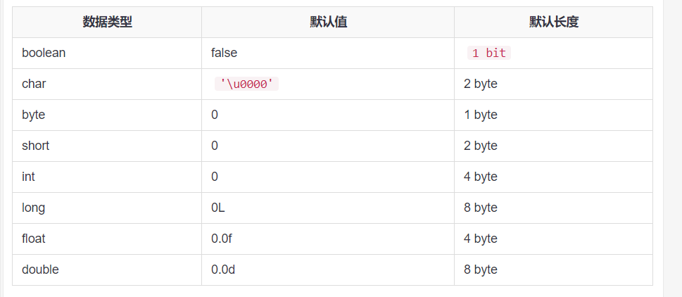


例子
```java
byte a = 100;
short s = 1000;
int a = 10000;
long a = 100000L;    //为long类型变量赋值时，需在数值的后面加上大写的L，表示该类型为long类型。
float f1 = 234.5f;  //为float类型变量赋值时，需在数值的后面加上F或f，表示该类型为float类型。
double d1 = 123.4;
boolean one = true;
char letter = 'A';
```

### 基本数据类型之间的转换

<font color="red">在java程序中，一种基本数据类型的值赋给另一种基本数据类型的变量时，需要进行数据类型转换。</font>

数据类型转换有两种方式：
- 自动类型转换，目标数据类型的范围大于源数据类型的范围时。
- 强制类型转换，当两种类型彼此不兼容，或者目标数据类型的范围小于源数据类型时，需要使用强制类型转换。

```java
//下面是自动类型转换
byte b = 100;
int a = b;  // byte -> int

//下面是强制数据类型转换的写法
int c=122;
byte d=(byte)c;   //int -> byte , 会导致数据精度的损失。
```

数据类型转换规则：
- 整型、浮点型、字符型数据可以进行混合运算。它们会先转化为范围最大的类型，然后进行运算。
- 不能对boolean类型进行类型转换
- 容量大的类型转换为容量小的类型时必须使用强制类型转换.
- 转换过程中可能导致数据溢出或损失精度.


### 什么是字节？

要了解什么是字节？要先了解计算机内存的基本结构。

计算机内存的最小存储单元是字节（byte），一个字节就是一个8位二进制数，即8个bit。它的二进制表示范围从00000000 ~ 11111111，换算成十进制是0 ~ 255。

8个二进制数是1个字节，一个字节是1byte，1024字节是1K，1024K是1M，1024M是1G，1024G是1T。

### 为什么8个字节的byte范围是-128 ~ 127？

8个字节按理来所可以表示0 ~ 255 （2^8 - 1）。为什么实际范围是-128（-2^7）~ 127（2^7-1）?

因为计算机是以补码形式储存数据的。所以最高位的字节需要用来表示正负符号（0表示正数，1表示负数）。所以byte的数据范围就是-128（-2^7）~ 127（2^7-1）

计算机之所以是以补码形式存储数据，为了简化计算机基本运算电路，使加减法都只需要通过加法电路实现。比如5-3=5+（-3），补码情况下正数和负数可以直接相加。

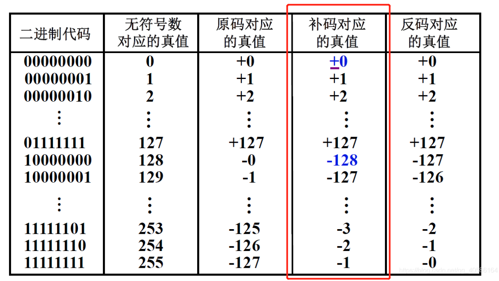

如上图1为00000001,因为1+(-1)必须等于0,那-1只能为11111111,11111111+00000001=00000000。

## 变量

> 什么是变量？
变量是用来描述一条信息的别名，可以在程序代码中使用一个或多个变量。变量中可以存储各种类型的信息，如登录信息、版本名称、文件的大小、某个英文单词以及飞机票价格等。

<font color="red">注意：变量的值在程序运行期间可以被修改。</font>

### 定义变量

在java中可以通过指定数据类型和变量名称来定义变量。

<font color="red">注意变量名称必须符合标识符的命名规范。</font>

```java
//定义变量的语法： 
数据类型 变量名称；

//定义变量
byte a = 100;
short b = 100;
int c = 1000;
long d = 100L;    //为long类型变量赋值时，需在数值的后面加上大写的L，表示该类型为long类型。
float e = 234.5f;  //为float类型变量赋值时，需在数值的后面加上F或f，表示该类型为float类型。
double f= 123.4;
boolean g = true;
char h = 'A';
```

### 变量赋值

初始化变量有两种方式：一种是声明时直接赋值，一种是先声明、后赋值。
```java
//定义变量one
byte one;
//定义变量two并赋初值
byte two = 2;
//声明并初始化多个变量,多个变量中间要使用逗号分隔。
int num1=12,num2=23,num3=35;

int a=3;
int b;
int c=a+3;
```

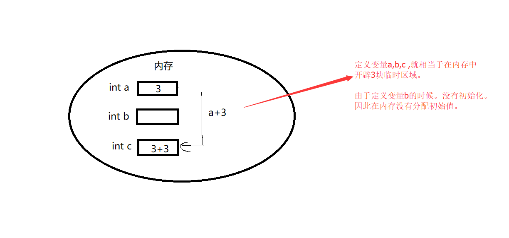

<font color="red">
在内存中的表现是：程序首先取出变量a的值，与3相加后，把结果赋值给变量c。
</font>

### 变量的作用域

变量的作用域规定了变量所能使用的范围，只有在作用域范围内变量才能被使用。根据变量声明地点的不同，变量的作用域也不同。

如下图展示
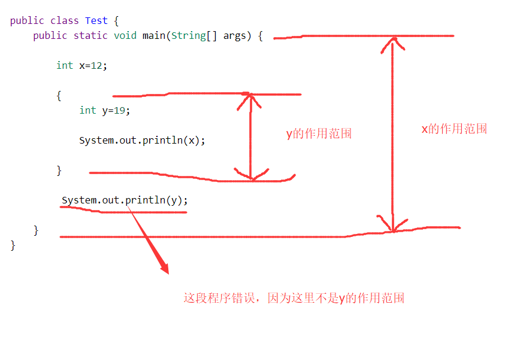

<font color="red">
变量一定会定义在某一对大括号中，这个大括号包括的区域就是该变量的作用域。
</font>

### 变量的种类

变量根据作用域的不同，可以分为不同的类型：成员变量,静态变量（类变量）和局部变量。

#### 成员变量

成员变量（定义在方法体和语句块之外，作用域是整个类）
1. 成员变量声明在类中，但在类的方法外；
2. 成员变量在对象创建的时候创建，在对象被销毁的时候销毁；
3. 成员变量具有默认值。数值型变量的默认值是0，布尔型变量的默认值是false，引用类型的成员变量的默认值是null。
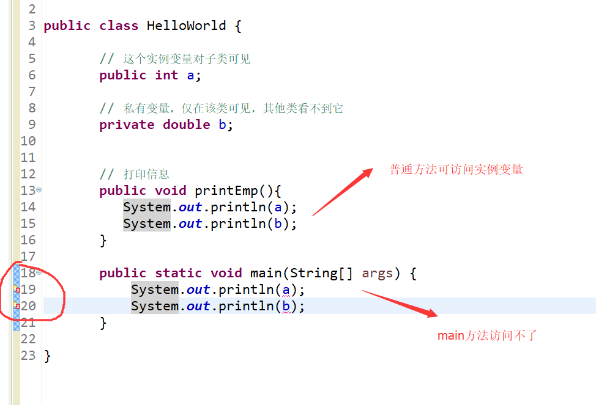

#### 静态变量（类变量）

静态变量（类变量，定义在方法体和语句块之外，作用域是整个类）：
1. 静态变量和成员变量的区别是static修饰符。
2. 静态变量就是以static修饰符声明的成员变量，但必须在方法和语句块之外。
3. 数值型默认值是0，布尔型默认值是false，引用类型默认值是null。
4. 静态变量是属于类的，所有的实例化对象是共享这一份静态变量的。
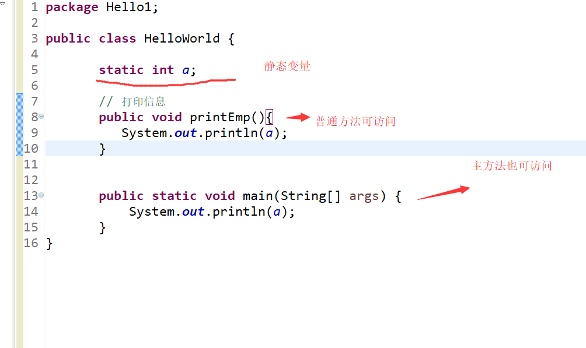


成员变量和静态变量（类变量）的区别？

| 名称 | 修饰 | 访问 | 生命周期 |
| ------ | ------ | ------ | ------ |
| 成员变量 | 无 static 修饰 | 对象名.变量名 | 只要对象存在，实例变量就将存在 |
| 静态变量（类变量） | 用 static 修饰 | 类名.变量名或对象名.变量名 | 其生命周期取决于类的生命周期。类被垃圾回收机制彻底回收时才会被销毁 |


#### 局部变量

局部变量（方法或代码块内部定义的变量，其作用域是其所在的方法或代码块）
1. 局部变量声明在方法中或者代码块中.
2. 局部变量在方法、代码块被执行的时候创建，当方法或代码块执行完成后，局部变量也会被销毁；
3. 局部变量都没有默认值，所以局部变量被声明后，必须经过初始化，才可以使用。
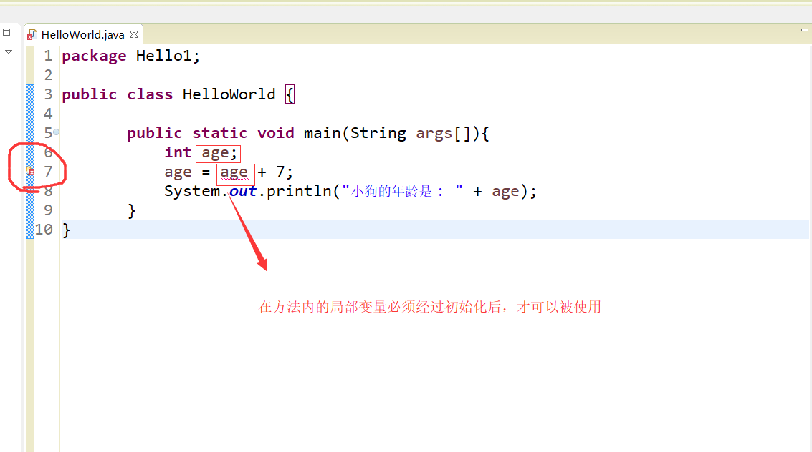

## 常量

常量是指在程序的整个运行过程中值保持不变的变量。

在定义常量的同时要赋予一个初始值。常量一旦初始化就不可以被修改,一旦修改程序就会编译错误。

```java
//定义常量语法：final 数据类型 常量名称 = 初始值;
//例子
public class HelloWorld {
    // 静态常量
    public static final double PI = 3.14;
    // 声明成员常量
    final int Y = 10;
    public static void main(String[] args) {
        // 声明局部常量
        final double X = 3.3;
    }
}
```

## 运算符

运算符是控制变量与变量之间如何进行运算。运算符有以下几种：

> 1.算术运算符:

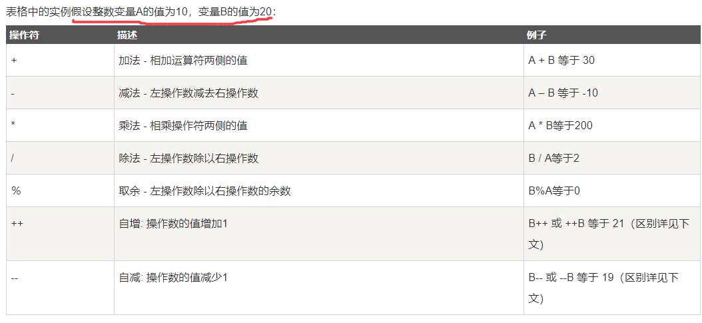

前缀(++a,--a): 先进行自增或者自减运算，再进行表达式运算。
后缀(a++,a--): 先进行表达式运算，再进行自增或者自减运算.

> 2.关系运算符:

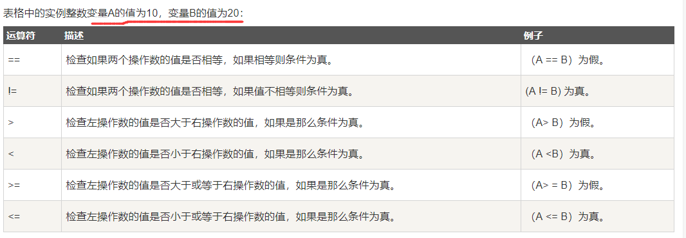

> 3.位运算符:

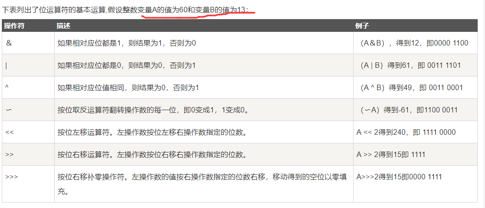

> 4.逻辑运算符：

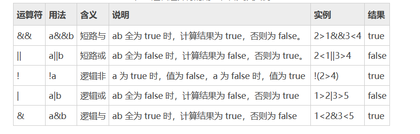


&&（短路与） 与 &（逻辑与）区别：
* 逻辑与：当a为false时，还要计算b
* 短路与: 当a为false，则不计算 b（因为不论 b 为何值，结果都为 false）

||（短路或） 与 |（逻辑或）区别：
* 逻辑或：当a为true时，还要计算b
* 短路与：当a为true时，则不计算 b（因为不论 b 为何值，结果都为 true）


> 5.赋值运算符：

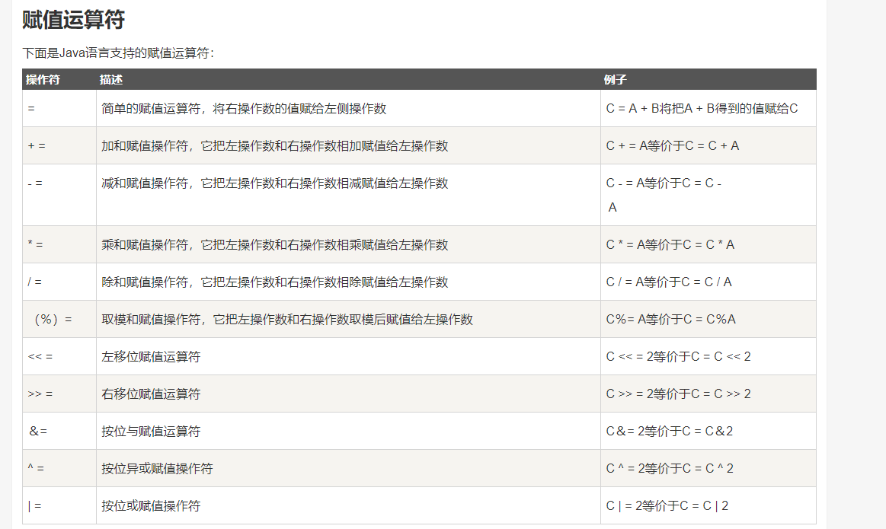

> 6.三目运算符（条件运算符）

条件运算符的符号表示为“?:”，使用该运算符时需要有三个操作数，因此称其为三目运算符。

```java
//例子
int x,y,z;
x = 6,y = 2;
z = x>y ? x-y : x+y;
//计算 z 的值，先要判断 x>y 表达的值，如果为 true，z 的值为 x-y；否则 z 的值为 x+y。
```

> 7.Java运算符优先级

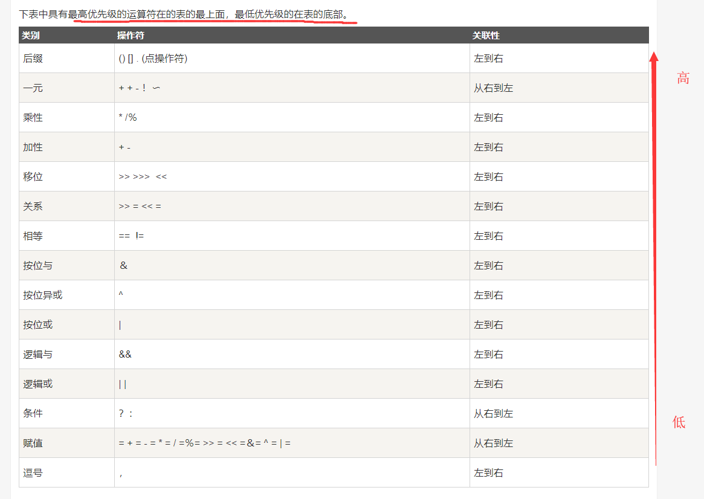
