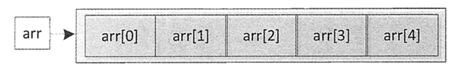
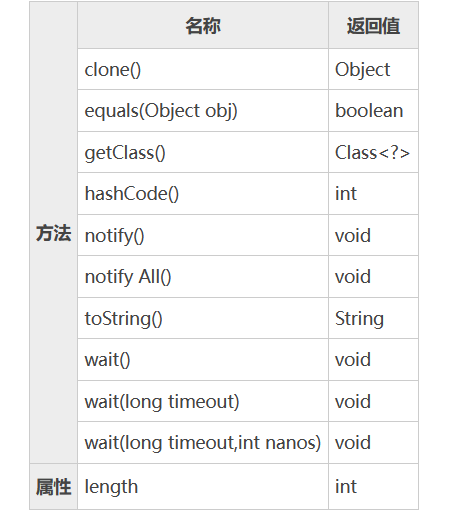
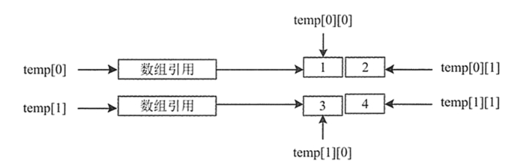

[toc]

# Java笔记4-数组

数组（array）是一种复合数据类型，它是有序数据的集合，数组中的每个元素具有相同的数据类型，可以用一个统一的数组名和不同的下标来确定数组中唯一的元素。

根据数组的维度，可以将其分为一维数组、二维数组和多维数组等。

数组的特点：
* 数组只能保存相同数据类型元素。
* 数组中的元素是有序的，通过下标访问。
* 数组一旦初始化后，则长度（数组中元素的个数）不可变。
* 数值数组元素的默认值为 0，而引用元素的默认值为 null。
* 数组的索引从 0 开始，如果数组有 n 个元素，那么数组的索引是从 0 到（n-1）。
* 数组元素可以是任何类型，包括数组类型。

## 一维数组

一维数组实质上是一组相同类型数据的线性集合，是数组中最简单的一种数组。

### 定义数组并分配空间

```java

int[] score;    	// 定义存储学生的成绩的数组，类型为整型
double[] price;    	// 定义存储商品的价格的数组，类型为浮点型
String[] name;    	// 定义存储商品名称的数组，类型为字符串型

```

### 分配空间

定义数组后还需要为数组分配内存空间，这样数组的元素才有空间进行存储。

分配空间就是要告诉计算机在内存中为它分配几个连续的位置来存储数据。在 Java 中可以使用 new 关键字来给数组分配空间。

```java
int[] myList = new int[size];
/*
1. 使用 int[size] 创建了一个数组，并分配size空间。
2. 把新创建的数组的引用赋值给数组变量myList。
*/

//定义数组并且分配空间
int[] arr = new int[5];
double[] arr2 = new double[5];
String[] arr3 = new String[5];
```



分配空间后，数组在内存中的格式，如图所示。arr 为数组名称，方括号“[]”中的值为数组的下标。数组通过下标来区分数组中不同的元素，并且下标是从 0 开始的。因此这里包含 5 个元素的 arr 数组最大下标为 4。

<font color="red">注意：数组属于引用数据类型。当声明一个数组变量时，其实是创建了一个类型为“数据类型[]”的数组对象，它具有下图中所示的方法和属性。</font>



### 初始化数组

初始化数组，就是为数组的数组元素分配内存空间，并为每个数组元素赋初始值。初始化数组有以下 3 种方式。

```java
//初始化数组方式1
int[] number = new int[5];
number[0] = 1;
number[1] = 2;
number[2] = 3;
number[3] = 5;
number[4] = 8;

//初始化数组方式2
int[] number = new int[]{1, 2, 3, 5, 8};

//初始化数组方式3
int[] number = {1,2,3,5,8};
```

在定义数组并分配空间后，系统会为数组元素分配初始值。
* 整数类型（byte、short、int 和 long），则数组元素的值是 0。
* 浮点类型（float、double），则数组元素的值是 0.0。
* 字符类型（char），则数组元素的值是‘\u0000’。
* 布尔类型（boolean），则数组元素的值是 false。
* 引用类型（类、接口和数组），则数组元素的值是 null。


### 使用数组

```java
//获取数组单个元素
int[] number = new int[]{1,2,3,5,8};
System.out.println("获取第一个元素："+number[0]);
System.out.println("获取最后一个元素："+number[number.length-1]);


//打印数组全部元素，数组作为函数参数
public static void printArray(int[] a) {
    //增强for循环
    for(int x:a) {
        System.out.println("数组值"+x);
    }
}

//逆序输出数组，数组作为函数返回值
public static int[] reverse(int[] a) {
    int[] result = new int[a.length];    //创建一个与a数组等长的数组result
    for (int i = 0, j = result.length - 1; i < a.length; i++, j--) {   //把a数组的逆序赋值到result数组上
    result[j] = a[i];
    }
    return result;
}
```

## 二维数组

二维数组被看作数组的数组，即二维数组为一个特殊的一维数组，其每个元素又是一个一维数组。

```java
//方式1，创建一个2行2列的二维数组
int[][] temp = new int[2][2];
//方式2，数组中每个元素的长度不确定
int[][] temp = new int[2][];
//方式3，二维数组定义并初始化
int[][] temp = new int[][]{{1,2},{3,4}};
```

二维数组temp内存结构如图所示


```java
//例子：二维数组的赋值与遍历
public class test1 {
	  public static void main(String[] args) {
		  int[][] a=new int[3][3];  //创建数组a
		  for(int i=0;i<3;i++) {    //二维数组的赋值
			 for(int j=0;j<3;j++) {
				a[i][j]=i+j;
			 }
		  }
		  for(int i=0;i<3;i++) {    //二维数组的遍历
			 for(int j=0;j<3;j++) {
				System.out.print(" "+a[i][j]);
			 }
			 System.out.println(" ");
		  }
	  }
}
```

## 多维数组

除了一维数组和二维数组外，Java 中还支持更多维的数组，如三维数组、四维数组和五维数组等，它们都属于多维数组。

```java
//例如有一个名为 namelist 的 String 类型三维数组
//下面编写代码对它进行遍历，输出每个元素的值
public static void main(String[] args) {
    String[][][] namelist = { { { "张阳", "李风", "陈飞" }, { "乐乐", "飞飞", "小曼" } },
            { { "Jack", "Kimi" }, { "Lucy", "Lily", "Rose" } }, { { "徐璐璐", "陈海" }, { "李丽丽", "陈海清" } } };
    for (int i = 0; i < namelist.length; i++) {
        for (int j = 0; j < namelist[i].length; j++) {
            for (int k = 0; k < namelist[i][j].length; k++) {
                System.out.println("namelist[" + i + "][" + j + "][" + k + "]=" + namelist[i][j][k]);
            }
        }
    }
}

```

输出结果如下所示
```
namelist[0][0][0]=张阳
namelist[0][0][1]=李风
namelist[0][0][2]=陈飞
namelist[0][1][0]=乐乐
namelist[0][1][1]=飞飞
namelist[0][1][2]=小曼
namelist[1][0][0]=Jack
namelist[1][0][1]=Kimi
namelist[1][1][0]=Lucy
namelist[1][1][1]=Lily
namelist[1][1][2]=Rose
namelist[2][0][0]=徐璐璐
namelist[2][0][1]=陈海
namelist[2][1][0]=李丽丽
namelist[2][1][1]=陈海清
```


## 数组是引用数据类型

数组本身是一种引用类型。例如 int 是一个基本类型，但 int[]就是一种引用类型了。

int[] 与 int 类型、String 类型相似，一样可以使用该类型来定义变量，也可以使用该类型进行类型转换等。使用 int[] 类型来定义变量、进行类型转换时与使用其他普通类型没有任何区别。

int[] 类型是一种引用类型，创建 int[] 类型的对象也就是创建数组，所以需要使用new来创建数组。

## 数组的常见用法

### 比较两个数组

数组相等的条件不仅要求数组元素的个数必须相等，而且要求对应位置的元素也相等。

Arrays 类提供了 equals() 方法比较整个数组。语法如下：
```
Arrays.equals(arrayA, arrayB);
```

```java
public static void main(String[] args) {
    double[] score1 = { 99, 100, 98.5, 96.5, 72 };
    double[] score2 = new double[5];
    score2[0] = 99;
    score2[1] = 100;
    score2[2] = 98.5;
    score2[3] = 96.5;
    score2[4] = 72;
    double[] score3 = { 99, 96.5, 98.5, 100, 72 };
    if (Arrays.equals(score1, score2)) {
        System.out.println("score1 数组和 score2 数组相等");
    } else {
        System.out.println("score1 数组和 score2 数组不等");
    }
    if (Arrays.equals(score1, score3)) {
        System.out.println("score1 数组和 score3 数组相等");
    } else {
        System.out.println("score1 数组和 score3 数组不等");
    }
}

//输出结果如下
// score1 数组和 score2 数组相等
// score1 数组和 score3 数组不等
```

### 查找指定元素

查找数组是指从数组中查询指定位置的元素，或者查询某元素在指定数组中的位置。

binarySearch() 方法使用二分搜索法来搜索指定数组，可以实现数组元素的查找，返回要搜索元素的索引值。

```java
//方式1
binarySearch(Object[] a,Object key);
//方式2，在指定的范围内查找某一元素
binarySearch(Object[] a,int fromIndex,int toIndex,Object key);
```

```java
//方式1
public static void main(String[] args) {
    double[] score = { 99.5, 100, 98, 97.5, 100, 95, 85.5, 100 };
    Arrays.sort(score);
    int index1 = Arrays.binarySearch(score, 100);
    int index2 = Arrays.binarySearch(score, 60);
    System.out.println("查找到 100 的位置是：" + index1);
    System.out.println("查找到 60 的位置是：" + index2);
}

//方式2
public static void main(String[] args) {
    double[] score = {99.5,100,98,97.5,100,95,85.5,100};
    Arrays.sort(score);
    int index1 = Arrays.binarySearch(score,2,6,100);
    int index2 = Arrays.binarySearch(score,2,6,60);
    System.out.println("查找到 100 的位置是："+index1);
    System.out.println("查找到 60 的位置是："+ index2);
}
```

### 复制数组

在 Java 中实现数组复制分别有以下 4 种方法：
* Arrays 类的 copyOf() 方法
* Arrays 类的 copyOfRange() 方法
* System 类的 arraycopy() 方法
* Object 类的 clone() 方法

以上4种方法都是浅拷贝（浅复制）。浅拷贝只是复制了对象的引用地址，两个对象指向同一个内存地址，所以修改其中任意的值，另一个值都会随之变化。深拷贝是将对象及值复制过来，两个对象修改其中任意的值另一个值不会改变。

#### copyOf()

copyOf() 方法是复制数组到新数组中，并指定新数组的长度。语法如下

```java
//srcArray 表示要进行复制的数组，length 表示复制后的新数组的长度。
Arrays.copyOf(dataType[] srcArray,int length);
```

```java
int scores[] = new int[]{57,81,68,75,91};
int[] newScores = (int[])Arrays.copyOf(scores,8);
//新数组 newScores 的长度为 8，因此在将原数组中的 5 个元素复制完之后，会采用默认值填充剩余 3 个元素的内容。
```

#### CopyOfRange()

Arrays 类的 CopyOfRange() 方法是另一种复制数组的方法，其语法形式如下：

```java
//srcArray 表示原数组。
//startIndex 表示开始复制的起始索引
//endIndex 表示终止索引
Arrays.copyOfRange(dataType[] srcArray,int startIndex,int endIndex)
```

```java
int scores[] = new int[]{ 57, 81, 68, 75, 91, 66, 75, 84 };
// 复制原数组的前5个元素到newScores数组中
int newScores[] = (int[]) Arrays.copyOfRange(scores, 0, 5);
```

#### arraycopy()

arraycopy() 方法位于 java.lang.System 类中，其语法形式如下：

```java
//srcArray 表示原数组
//srcIndex 表示原数组中的起始索引
//destArray 表示目标数组
//destIndex 表示目标数组中的起始索引；
//length 表示要复制的数组长度
System.arraycopy(dataType[] srcArray,int srcIndex,int destArray,int destIndex,int length)
```

```java
 // 定义原数组，长度为8
int scores[] = new int[] { 100, 81, 68, 75, 91, 66, 75, 100 };
// 定义目标数组
int newScores[] = new int[] { 80, 82, 71, 92, 68, 71, 87, 88, 81, 79, 90, 77 };
//复制原数组中的一部分到目标数组中
System.arraycopy(scores, 0, newScores, 2, 8);
```

#### clone()

clone() 方法也可以实现复制数组。该方法是类 Object 中的方法，可以创建一个有单独内存空间的对象。因为数组也是一个 Object 类，因此也可以使用数组对象的 clone() 方法来复制数组。

```java
int scores[] = new int[] { 100, 81, 68, 75, 91, 66, 75, 100 };
// 复制数组，将Object类型强制转换为int[]类型
int newScores[] = (int[]) scores.clone();
```
