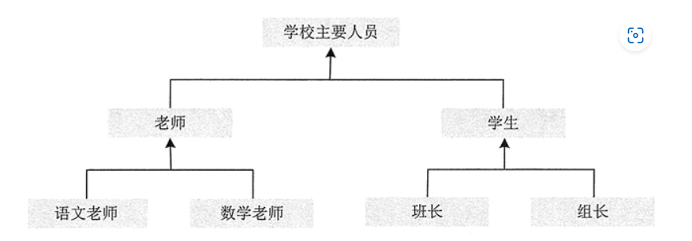
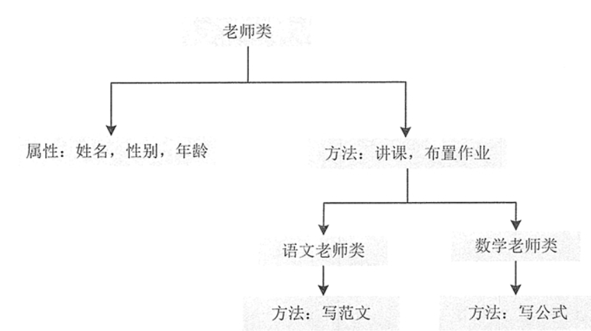
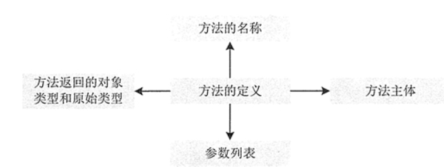
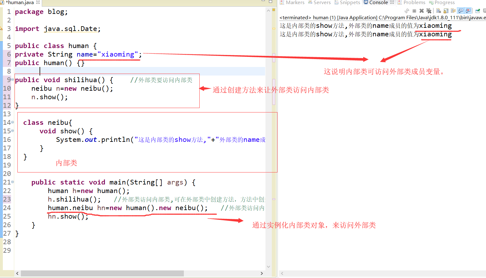
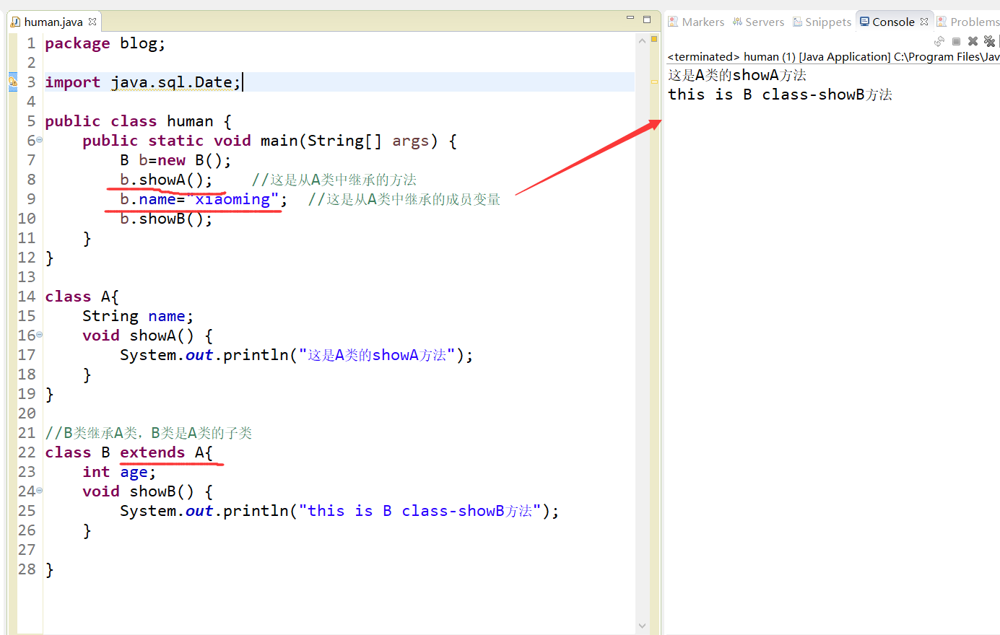
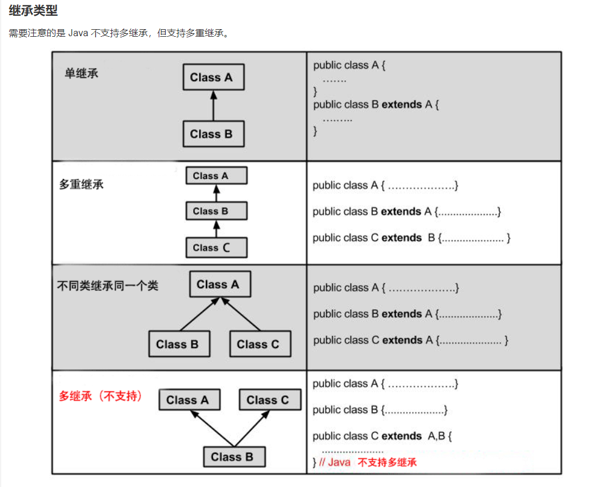
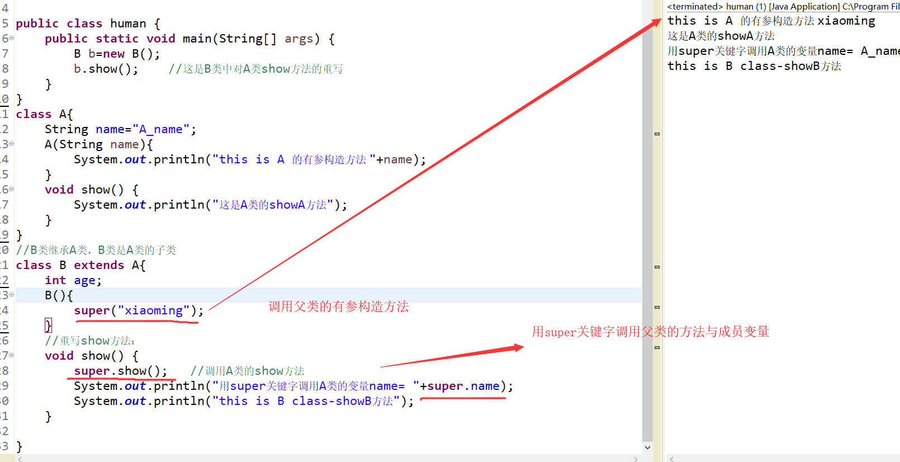
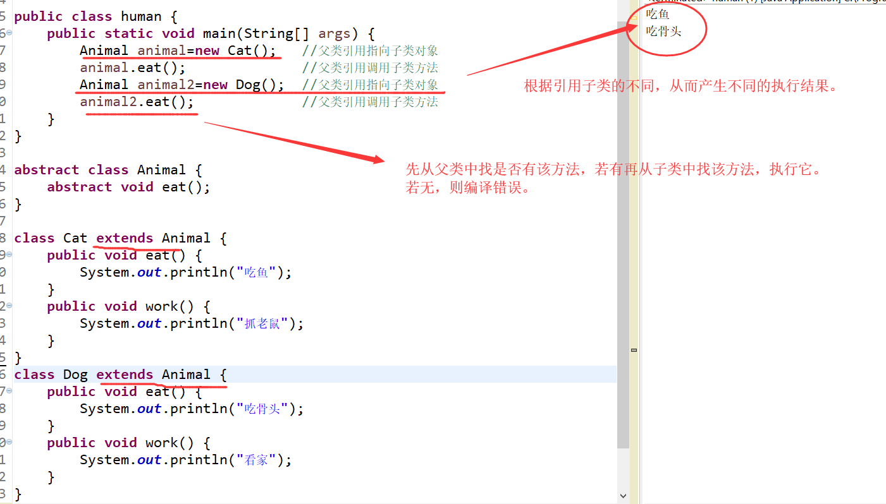

[toc]

# Java学习笔记6-类与对象

## 面向对象的三大特性

面向对象具有继承、封装和多态 3 个核心特性。

### 继承性

继承是从已有类得到继承信息创建新类的过程。提供继承信息的类被称为父类；得到继承信息的类被称为子类（派生类）。Java 只支持单继承。



如图所示学校主要人员是一个大的类，老师和学生是学校主要人员的两个子类，而老师又可以分为语文老师和数学老师两个子类，学生也可以分为班长和组长两个子类。

使用这种层次形的分类方式，是为了将多个类的通用属性和方法提取出来，放在它们的父类中，然后只需要在子类中各自定义自己独有的属性和方法，并以继承的形式在父类中获取它们的通用属性和方法即可。

### 封装性

封装是把数据和操作数据的方法绑定起来，对数据的访问只能通过已定义的接口。类的封装就是隐藏一切可隐藏的东西，只向外界提供最简单的接口。

封装的目的在于保护信息，使用它的主要优点如下。
* 保护类中的信息，它可以阻止外部代码随意访问内部代码和数据。
* 隐藏细节信息，一些不希望用户修改和使用的信息，比如键盘，用户只需要知道按哪个键实现什么操作就可以，至于它内部是如何运行的，用户不需要知道。
* 有助于建立各个系统之间的松耦合关系，提高系统的独立性。当一个系统的实现方式发生变化时，只要它的接口不变，就不会影响其他系统的使用。例如 U 盘，不管里面的存储方式怎么改变，只要 U 盘上的 USB 接口不变，就不会影响用户的正常操作。
* 提高软件的复用率，降低成本。每个系统都是一个相对独立的整体，可以在不同的环境中得到使用。例如，一个 U 盘可以在多台电脑上使用。

Java 语言的基本单位是类。由于类的用途是封装复杂性，所以类的内部有隐藏实现复杂性的机制。Java 提供了私有和公有的访问模式，类的公有接口代表外部的用户应该知道或可以知道的每件东西，私有的方法数据只能通过该类的成员代码来访问，这就可以确保不会发生设计者不希望的事情。

### 多态性

多态性是指允许不同子类型的对象对同一消息作出不同的响应。简单的说就是用同样的对象引用变量调用同样的方法但是做了不同的事情。多态性允许一个接口被多个同类使用，弥补了单继承的不足。

实现多态需要做两件事：
1). 方法重写（子类继承父类并重写父类中已有的或抽象的方法）； 
2). 对象造型（用父类型对象变量去引用子类型对象,之后父类型对象变量调用方法就会根据引用的子类对象的不同而表现出不同的行为）。

多态性如图所示


## 类

在面向对象中，类和对象是最基本、最重要的组成单元。类实际上是某类群体的一些基本特征。对象就是表示一个个具体的东西。所以说类是对象的抽象，对象是类的具体。

总结：
* 类是概念模型，它描述一类对象的行为和状态。例如：人类,会吃喝睡。
* 对象是真实的模型，是类的实例，有状态和行为。例如，小明，就是人类这个类实例化后的一个对象。

### 定义类

在 Java 中定义一个类，需要使用 class 关键字、一个自定义的类名和一对表示程序体的大括号。


完整语法如下：
```java
[public][abstract|final]class<class_name>[extends<class_name>][implements<interface_name>] {
    // 定义属性部分
    <property_type><property1>;
    <property_type><property2>;
    <property_type><property3>;
    …
    // 定义方法部分
    function1();
    function2();
    function3();
    …
}

//上述语法中，中括号“[]”中的部分表示可以省略，竖线“|”表示“或关系”
//例如 abstract|final，说明可以使用 abstract 或 final 关键字，但是两个关键字不能同时出现。
```

<font color="red">由语法可知：一个类主要由属性和方法组成。</font>

上述语法中各关键字的描述如下。
- public：表示“共有”的意思。如果使用 public 修饰，则可以被其他类和程序访问。每个 Java 程序的主类都必须是 public 类，作为公共工具供其他类和程序使用的类应定义为 public 类。
- abstract：如果类被 abstract 修饰，则该类为抽象类，抽象类不能被实例化，但抽象类中可以有抽象方法（使用 abstract 修饰的方法）和具体方法（没有使用 abstract 修饰的方法）。继承该抽象类的所有子类都必须实现该抽象类中的所有抽象方法（除非子类也是抽象类）。
- final：如果类被 final 修饰，则不允许被继承。
- class：声明类的关键字。
- class_name：类的名称。
- extends：表示继承其他类。
- implements：表示实现某些接口。
- property_type：表示成员变量的类型。
- property：表示成员变量名称。
- function()：表示成员方法名称。


Java 类名的命名规则：
* 类名应该以字母开头。
* 第一个字母最好大写，如果类名由多个单词组成，则每个单词的首字母最好都大写。
* 类名不能为 Java 中的关键字，例如 boolean、this、int 等

定义类的步骤：
1. 编写类的最外层框架，声明一个名称为 Person 的类。
2. 编写类的属性。类的属性就是成员变量。
3. 编写类的方法。类的方法描述了类所具有的行为，是类的方法成员。

```java
public class human {
	  String name;    //姓名
	  int age;   		//年龄
	  String sex;		//性别		
	  Date birth;  		//出生年月
	  
	  public human() {   
		 //默认的构造方法
	  }
	  public human(String name) {   
		  this.name=name;     //改造的构造方法
	  }
	  void sleeping(){   //人类会睡觉
	  }
	  void eating(){     //人类会吃
	  }
}
```

### 类中的属性：成员变量

类中的属性就是成员变量。

声明成员变量的语法如下：

```
[public|protected|private][static][final]<type><variable_name>
```

各参数的含义如下。
- public、protected、private：用于表示成员变量的访问权限。
- static：表示该成员变量为类变量，也称为静态变量。
- final：表示将该成员变量声明为常量，其值无法更改。
- type：表示变量的类型。
- variable_name：表示变量名称。

```java
//例子
public class Student {
    public String name;    // 姓名
    final int sex = 0;    // 性别：0表示女孩，1表示男孩
    private int age;    // 年龄
}
```


### 类中的方法：成员方法

类的方法定义类的行为。类的各种功能操作都是用方法来实现的，属性只不过提供了相应的数据。

一个完整的方法通常包括方法名称、方法主体、方法参数和方法返回值类型。



定义方法的语法格式如下：
```java
public class Test {
    [public|private|protected][static]<void|return_type><method_name>([paramList]) {
        // 方法体
    }
}
```

注意：上述语法中，中括号“[]”中的部分表示可以省略，竖线“|”表示“或”，例如 public|private，说明可以使用 public 或 private 关键字，但是两个关键字不能同时出现。

上述代码中一个方法包含 4 部分：方法的返回值、方法名称、方法的参数和方法体。

- retum_type 是方法返回值的数据类型，数据类型可以是原始的数据类型，也可以是一个引用数据类型，如一个类、接口和数组等。除了这些，一个方法还可以没有返回值，即返回类型为 void，像 main() 方法。

- method_name 表示自定义的方法名称，方法的名称首先要遵循标识符的命名约定。

- paramList 表示参数列表，这些变量都要有自己的数据类型，可以是原始数据类型，也可以是复杂数据类型。

```java
//例子
public class Student {
    public StringBuffer printInfo(Student st) {
        StringBuffer sb = new StringBuffer();
        sb.append("学生姓名："+st.Name+"\n 学生年龄："+st.Age+"\n 学生性别："+st.isSex());
        return sb;
    }
}

//代码创建了一个名称为 printInfo 的方法，其返回值类型为 StringBuffer（引用数据类型）。
//该方法需要接受一个 Student 类型的参数，最后需要将一个 StringBuffer 类型的数据返回。
```

#### 方法的返回值

若方法有返回值，则在方法体中用 return 语句指明要返回的值，其格式如下所示。

```
return 表达式
//或者
return (表达式)
```
表达式可以是常量、变量、对象等。

#### 形参、实参及方法的调用

一般来说，可以通过以下方式来调用成员方法：`methodName({paramList})`

关于方法的参数，经常会提到形参与实参，形参是定义方法时参数列表中出现的参数，实参是调用方法时为方法传递的参数。

```java
//例子
// 下面 retumMin() 方法中的 m 和 n 是形参，调用 retumMin() 方法时的 x 和 y 是实参。
public int returnMin(int m,int n) {
    return Math.min(m,n);    // m和n是形参
}
public static void main(String[] args) {
    int x = 50;
    int y = 100;
    Test t = new Test();
    int i = t.returnMin(x,y);    // x和y是实参
    System.out.println(i);
}
```

方法的形参和实参具有以下特点：
* 形参变量只有在被调用时才分配内存单元，在调用结束时，即刻释放所分配的内存单元。因此，形参只有在方法内部有效，方法调用结束返回主调方法后则不能再使用该形参变量。
* 实参可以是常量、变量、表达式、方法等，无论实参是何种类型的量，在进行方法调用时，它们都必须具有确定的值，以便把这些值传送给形参。因此应预先用赋值、输入等办法使实参获得确定值。
* 实参和形参在数量、类型和顺序上应严格一致，否则会发生“类型不匹配” 的错误。
* 方法调用中发生的数据传送是单向的，即只能把实参的值传送绐形参，而不能把形参的值反向地传送给实参。因此在方法调用过程中，形参的值发生改变，而实参中的值不会变化。


#### 方法体中的局部变量

在方法体内可以定义本方法所使用的变量，这种变量是局部变量。它的生存期与作用域是在本方法内，也就是说，局部变量只能在本方法内有效或可见，离开本方法则这些变量将被自动释放。

在方法体内定义变量时，变量前不能加修饰符。局部变量在使用前必须明确赋值，否则编译时会出错。另外，在一个方法内部，可以在复合语句（把多个语句用括号{}括起来组成的一个语句称复合语句）中定义变量，这些变量只在复合语句中有效。


## 对象

对象是对类的实例化。对象具有状态和行为，变量用来表明对象的状态，方法表示对象所具有的行为。

### 显式创建对象

对象的显式创建方式主要有3种。

方式1：使用 new 关键字创建对象
```java
类名 对象名 = new 类名()；
```

方式2：调用 java.lang.Class 或者 java.lang.reflect.Constuctor 类的 newlnstance() 实例方法
```java
java.lang.Class Class 类对象名称 = java.lang.Class.forName(要实例化的类全称);
类名 对象名 = (类名)Class类对象名称.newInstance();

//调用 java.lang.Class 类中的 forName() 方法时，需要将要实例化的类的全称（比如 com.mxl.package.Student）作为参数传递过去，
//然后再调用 java.lang.Class 类对象的 newInstance() 方法创建对象。
```

方式3：调用对象的 clone() 方法

```java
//该方法不常用，使用该方法创建对象时，要实例化的类必须继承 java.lang.Cloneable 接口。
类名对象名 = (类名)已创建好的类对象名.clone();
```


```java
//例子
public class Student implements Cloneable {   
    // 实现 Cloneable 接口
    private String Name;    // 学生名字
    private int age;    // 学生年龄
	// 构造方法
    public Student(String name,int age) {    
        
        this.Name = name;
        this.age = age;
    }
    public Student() {
        this.Name = "name";
        this.age = 0;
    }
    public String toString() {
        return"学生名字："+Name+"，年龄："+age;
    }
    public static void main(String[] args)throws Exception {
        System.out.println("---------使用 new 关键字创建对象---------");
       
        // 使用new关键字创建对象
        Student student1 = new Student("小刘",22);
        System.out.println(student1);
        System.out.println("-----------调用 java.lang.Class 的 newInstance() 方法创建对象-----------");
       
        // 调用 java.lang.Class 的 newInstance() 方法创建对象
        Class c1 = Class.forName("Student");
        Student student2 = (Student)c1.newInstance();
        System.out.println(student2);
        System.out.println("-------------------调用对象的 clone() 方法创建对象----------");

        // 调用对象的 clone() 方法创建对象
        Student student3 = (Student)student2.clone();
        System.out.println(student3);
    }
}
```

### 隐含创建对象

除了显式创建对象以外，在 Java 程序中还可以隐含地创建对象。
- 1）String strName = "strValue"，其中的“strValue”就是一个 String 对象，由 Java 虚拟机隐含地创建。
- 2）字符串的“+”运算符运算的结果为一个新的 String 对象，示例如下：

```java
String str1 = "Hello";
String str2 = "Java";
String str3 = str1+str2;    // str3引用一个新的String对象
```

- 3）当 Java 虚拟机加载一个类时，会隐含地创建描述这个类的 Class 实例。

提示：类的加载是指把类的 .class 文件中的二进制数据读入内存中，把它存放在运行时数据区的方法区内，然后在堆区创建一个 java.lang.Class 对象，用来封装类在方法区内的数据结构。

无论釆用哪种方式创建对象，Java 虚拟机在创建一个对象时都包含以下步骤：
1. 给对象分配内存。
2. 将对象的实例变量自动初始化为其变量类型的默认值。
3. 初始化对象，给实例变量赋予正确的初始值。

<font color="red">注意：每个对象都是相互独立的，在内存中占有独立的内存地址，并且每个对象都具有自己的生命周期，当一个对象的生命周期结束时，对象就变成了垃圾，由 Java 虚拟机自带的垃圾回收机制处理。</font>


### 访问对象的属性和行为

每个对象都有自己的属性和行为，这些属性和行为在类中是成员变量和成员方法，其中成员变量对应对象的属性，成员方法对应对象的行为。

在 Java 中，要引用对象的属性和行为，需要使用点（.）操作符来访问。对象名在圆点左边，而成员变量或成员方法的名称在圆点的右边。语法格式如下：
```
对象名.属性(成员变量)    // 访问对象的属性
对象名.成员方法名()    // 访问对象的无参方法
对象名.成员方法名(形参1，形参2,.....)    // 访问对象的有参方法
```

```java
Student stu = new Student();    // 创建 Student 类的对象 stu
stu.Name = "小米";    // 调用stu对象的Name属性并赋值
stu.Sex = true;    // 调用stu对象的Sex属性并赋值
stu.Age = 15;    // 调用stu对象的Age属性并赋值
stu.eat();     //调用对象的eat方法
stu.run(1,2);  //调用对象的run方法
```


## 类的封装

类的封装可以防止类中的代码和数据被外部类的代码随机访问,必须通过严格的接口控制才能访问，增加程序的安全性。

封装的步骤：
1.修改属性的可见性来限制外部类对属性的访问（一般限制为private）。
2.对每个属性提供对外的公共方法进行设置和访问。

例子
```java
public class human {
	private String name;    //姓名，设置私有属性，来限制对属性的随意访问
	private int age;   		//年龄
	private String sex;		//性别		
	private Date birth;  		//出生年月
	  public human() {    //默认的构造方法
		 
	  }
	  public human(String name) {    //改造的构造方法
		  this.name=name;    
	  }
	public String getName() {  //提供公共方法对属性进行操作
		return name;
	}
	public void setName(String name) {
		this.name = name;
	}
	public int getAge() {
		return age;
	}
	public void setAge(int age) {
		this.age = age;
	}
	public String getSex() {
		return sex;
	}
	public void setSex(String sex) {
		this.sex = sex;
	}
	public Date getBirth() {
		return birth;
	}
	public void setBirth(Date birth) {
		this.birth = birth;
	}
	public static void main(String[] args) {
		   human hu=new human();   //这个实例化对象语句会调用默认的构造方法
		   hu.setAge(23);			//设置年龄23
		   hu.setName("xiaoming");	//设置姓名为小明
		   hu.setSex("男");  
	  }
}

```

### 类的构造方法与构造方法的重载

构造方法的定义
1. 方法名与类名相同。
2. 方法无返回值类型。

```java
public class human {
	  String name;      //姓名
	  int age;   		//年龄
	  String sex;		//性别		
	  Date birth;  		//出生年月
      public human() {   
		 //无参的构造方法
	  }
	  public human(String name) {   
		  this.name=name;     //有参的构造方法
	  }
}
```

1. 一个类中可以定义多个构造方法，只要构造方法的参数类型与参数个数互不相同。
2. 在java中每个类中至少有一个构造方法，若类中没有编写该方法。则java会默认创建一个无参构造方法。
3. 一旦对类的构造方法进行重载，系统不再提供默认的构造方法。

### this关键字

①：通过this关键字可以访问类的变量。

②：this可以调用方法。

③：this可以调用构造方法。（注意：只能在构造方法中用this调用构造方法，并且该语句必须在第一行。）

```java
//this关键字可以访问类的变量
 public human(String name) {   
		  this.name=name;     
	  }
//this可以调用方法
public String getName() {
	return name;
}
public void tets() {
    this.getName();
}

//this可以调用构造方法
public human() {   
    //默认的构造方法
}
public human(String name) {   
    this();   //调用无参构造方法
}
```

### 源文件声明规则与Import语句

1. 一个源文件中只能有一个public类,主类
2. 一个源文件可以有多个非public类
3. 源文件的名称应该和public类的类名保持一致。例如：源文件中public类的类名是Employee，那么源文件应该命名为Employee.java。
4. 如果源文件包含import语句，那么应该放在package语句和类定义之间。如果没有package语句，那么import语句应该在源文件中最前面。
5. import语句和package语句对源文件中定义的所有类都有效。在同一源文件中，不能给不同的类不同的包声明。

>Import语句就是用来提供一个合理的路径，使得编译器可以找到某个类。
>例如，下面的命令行将会命令编译器载入java_installation/java/io路径下的所有类

```java
import java.io.*;
```

### 内部类

java允许在一个类的内部在定义类，这样的类叫做内部类。内部类有三种：成员内部类，静态内部类，方法内部类。

<h4>①：成员内部类</h4>

>在一个类中在定义一个类，这种类叫做成员内部类。成员内部类中可以访问外部类的所有成员，包括私有成员。
>创建成员内部类对象语法：
>外部类名.内部类名 变量名=new 外部类名().new 内部类名();

```java
package blog;
import java.sql.Date;
public class human {
private String name="xiaoming";   
public human() {}
public void shilihua() {    //外部类要访问内部类
	neibu n=new neibu();
	n.show();
}
  class neibu{
	  void show() {
		  System.out.println("这是内部类的show方法,"+"外部类的name成员的值为"+name);
	  }
  }
	public static void main(String[] args) {
		human h=new human();
		h.shilihua();   //外部类访问内部类,可在外部类中创建方法，方法中创建内部类对象。
		human.neibu hn=new human().new neibu();   //外部类访问内部类，要通过外部类对象去创建内部类对象
		hn.show();
	}
}
```



<font color="red">外部类访问内部类的方法：</font>

>1. 外部类访问内部类,可在外部类中创建方法，方法中创建内部类对象。
>2. 外部类访问内部类，要通过外部类对象去创建内部类对象,从而实现外部类访问内部类。

<h4>②：静态内部类</h4>

**用static修饰符修饰的成员内部类就是静态内部类。**

>实例化静态内部类对象语法：
> 外部类名.内部类名 变量名=new 外部类名.内部类名();
> 1 在静态内部类中，只能访问外部类的静态成员，非静态成员不能访问。
> 2 静态内部类中可以定义静态成员，但在非静态内部类中不能定义静态成员。

```java
package blog;
import java.sql.Date;
public class human {
private String name="xiaoming";
private static int number=5;
public human() {}
public void shilihua() {    //外部类要访问内部类
	neibu2 n=new neibu2();
	n.show();
}
  
  //静态内部类
  static class neibu2{
	  void show() {
		  //静态内部类只能访问外部类的静态成员
		  System.out.println("这是静态内部类的show方法,"+"外部类的静态number成员的值为"+number);
	  } 
	  
  }
	public static void main(String[] args) {
		human h=new human();
		h.shilihua();   //外部类访问内部类,可在外部类中创建方法，方法中创建内部类对象。
		human.neibu2 hn=new human.neibu2();   //外部类访问内部类，要通过外部类对象去创建内部类对象
		hn.show();
	}
}
```

<h4>③：方法内部类</h4>

>方法内部类指在成员方法中定义的类，它只能在当前方法中使用。方法内部类可以访问外部类成员

```java
public class human {
private String name="xiaoming";
	public void shilihua() {    //外部类要访问内部类
		//方法内部类
		class inner{
			void show() {
				 System.out.println("这是静态内部类的show方法,"+"外部类的静态name成员的值为"+name);
			}
		}
		//实例化内部类对象
		inner i=new inner();
		i.show();   //调用内部类方法
	}
	public static void main(String[] args) {
		human h=new human();
		h.shilihua();
	}
}

```


## 类的继承---减少重复代码，提高维护性

### 类的继承，关键字extends

继承就是子类继承父类中所有可继承的成员变量和方法，使得子类对象具有父类的成员变量和方法，使得子类具有父类相同的行为。

```java
//范例
//语法
class 父类 {
}
 
class 子类 extends 父类 {   //用关键字extends,让子类继承父类
}
//=================

public class human {
	public static void main(String[] args) {
		B b=new B();
		b.showA();    //这是从A类中继承的方法
		b.name="xiaoming";  //这是从A类中继承的成员变量
		b.showB();
	}
}
class A{
	String name;
	void showA() {
		System.out.println("这是A类的showA方法");
	}
}
//B类继承A类，B类是A类的子类
class B extends A{
	int age;
	void showB() {
		System.out.println("this is B class-showB方法");
	}
}
```



<font color="red">

在类的继承中注意：
1. 在Java中只支持单继承，即一个类中只有一个父类。
2. 多个类可以有一个父类。
3. 多层继承是可以的。即B类继承A类，C类继承B类。
4. 子类可以继承父类非private的变量、方法。其余的无法继承。
5. 子类拥有自己的属性和方法，即子类可以对父类进行扩展。
6. 子类可以用自己的方式实现父类的方法。

</font>




### 重写父类方法

在继承中，有时子类会需要对从父类哪里继承的方法进行修改，这叫做重写父类方法，两个方法之间必须具有相同的方法名，参数列表，返回值类型。

```java
public class human {
	public static void main(String[] args) {
		B b=new B();
		b.show();    //这是B类中对A类show方法的重写
	}
}

class A{
	String name;
	void show() {
		System.out.println("这是A类的showA方法");
	}
}

//B类继承A类，B类是A类的子类
class B extends A{
	int age;
	//重写show方法：
	void show() {
		System.out.println("this is B class-showB方法");
	}
	
}

//代码运行结果：this is B class-showB方法
```

### super关键字

当子类重写父类方法后，不能访问原来父类的那个方法，但可以通过super关键字来访问。

<h4>①：使用super关键字调用父类的变量与方法：②：用super关键字调用父类构造方法。</h4>

```java
public class human {
	public static void main(String[] args) {
		B b=new B();
		b.show();    //这是B类中对A类show方法的重写
	}
}
class A{
	String name="A_name";
	A(String name){
		System.out.println("this is A 的有参构造方法 "+name);
	}
	void show() {
		System.out.println("这是A类的showA方法");
	}
}
//B类继承A类，B类是A类的子类
class B extends A{
	int age;
	B(){
		super("xiaoming");    //调用父类的有参构造方法
	}
	//重写show方法：
	void show() {
		super.show();   //调用A类的show方法
		System.out.println("用super关键字调用A类的变量name= "+super.name);
		System.out.println("this is B class-showB方法");
	}
	
}
```


<font color="red">
通过super调用父类的构造方法的代码必须位于子类构造方法的第一行，并且只能出现一次。
</font>


### 抽象类与接口

① 抽象类与abstract关键字：

>抽象类：部分含有抽象方法的类，也可以不含有。
>抽象方法：无方法体的方法叫做抽象方法.
>抽象方法,抽象类用abstract关键字修饰。

```java
abstract class A{
	abstract int show();   //抽象方法show
}
```

<font color="red">
注意：
1.抽象类是不可以被实例化。
2.任何子类必须重写父类的抽象方法，或者声明自身为抽象类。
</font>

```java
//抽象类
abstract class C{
	abstract void show();    //抽象方法
	void run() {   			 //非抽象方法
		System.out.println("RUN");
	}
}

class D extends C{
	void show() {    //对父类抽象方法的重写
		System.out.println("this is 对抽象类C的抽象方法show的重写");
	}
}

public class human {
	public static void main(String[] args) {
		D d=new D();
		d.run();
		d.show();
	}
}

//运行结果：
//RUN
//this is 对抽象类C的抽象方法show的重写
```

② 接口与interface,implements关键字：

接口相当于是完全抽象类，接口的特点：

>1.当一个抽象类中的所有方法都是抽象方法时，这个抽象类叫做接口。此时要用interface关键字来声明接口。
>2.接口无法被实例化，但是可以被实现(用implements关键字)。一个实现接口的类，必须实现接口内所有的抽象方法，否则就必须声明为抽象类。
>3.接口中的方法都默认用“ public abstract ”修饰,变量默认用“ public final ”修饰,即抽象方法与全局变量
>4.一个类可以实现多个接口。
>5.一个接口能继承另一个接口.


```java
//用interface关键字声明接口
interface C{
	 void show();    //抽象方法
	 void run();
}
// 接口e
interface E {
	void eat();
	void sleep();
}

//一个接口继承另一个接口
interface G extends E{
	void speak();
	void jump();
}

//用implements关键字实现接口C
class D implements C{
	public void show() {    //对接口的重写
		System.out.println("show");
	}
	public void run() {
		System.out.println("run");
	}
}

//实现两个接口
class F implements C,E{
	public void eat() { // 对接口的重写
		System.out.println("F-eat");
	}
	public void sleep() {
		System.out.println("F-sleep");
	}
	public void show() { // 对接口的重写
		System.out.println("F-show");
	}
	public void run() {
		System.out.println("F-run");
	}
}
```


### 多态

① 多态概述

>1.在同一个方法中，根据参数类型的不同而产生不同的执行结果的现象叫做多态。
>2.多态存在的三个必要条件:继承,重写,父类引用指向子类对象.
>3.java中允许父类引用指向子类对象，根据被引用子类的不同，得到不同的执行结果。
>4.当使用多态方式调用方法时，首先检查父类中是否有该方法，如果没有，则编译错误；如果有，再去调用子类的同名方法。

```java
abstract class Animal {  
    abstract void eat();  
}  
  
class Cat extends Animal {  
    public void eat() {  
        System.out.println("吃鱼");  
    }  
    public void work() {  
        System.out.println("抓老鼠");  
    }  
}  
class Dog extends Animal {  
    public void eat() {  
        System.out.println("吃骨头");  
    }  
    public void work() {  
        System.out.println("看家");  
    }  
}

public class human {
	public static void main(String[] args) {
		Animal animal=new Cat();   //父类引用指向子类对象
		animal.eat();     		   //父类引用调用子类方法
		Animal animal2=new Dog();  //父类引用指向子类对象
		animal2.eat();  		   //父类引用调用子类方法
	}
}

//运行结果：
//吃鱼
//吃骨头
```




② Object类

>Object类是所有类的父类，即每个类都直接或间接继java.lang.Object类
>该类中主要有以下方法: toString(),getClass(),equals(),clone(),finalize()等, 其中toString(),equals()是其中最重要的方法

1. toString()方法

>toString 方法返回一个字符串，该字符串由类名、at 标记符“@”和此对象哈希码的无符号十六进制表示组成。

```java
@Override
	public String toString() {
		return "human [getClass()=" + getClass() + ", hashCode()=" + hashCode() + ", toString()=" + super.toString()
				+ "]";
	}
```

2. equals()方法

>equals()方法：比较两个对象是否相等。
>注意：即便是内容完全相等的两块不同的内存对象，也返回false。
>String类已经重写了object中的equals方法（这样就是比较内容是否相等了）。

3. hashCode()方法

>返回该对象的哈希码值

