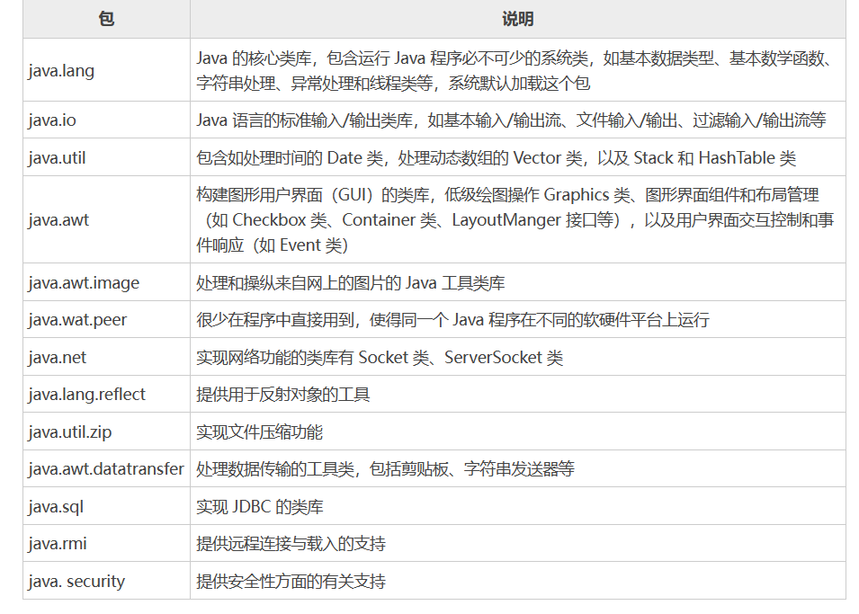

[toc]

# Java笔记7-类与对象2

## 访问控制修饰符

访问控制符是一组限定类、属性或方法是否可以被程序里的其他部分访问和调用的修饰符。类的访问控制符只能是空或者 public，方法和属性的访问控制符有如下四种。

<font color="red">在 Java 语言中，访问控制修饰符有 4 种。分别是 public、 private、protected 和 default，其中 default 是一种没有定义专门的访问控制符的默认情况。</font>

按公开范围程度：public > protected > default > private。

访问权限级别 | 本类 | 同包 | 不同包的子类 | 不同的包的非子类
------------ | ------------- |  ------------- |  ------------- |  ------------- 
公开 public | √ | √ | √ | √ 
保护 protected | √ | √ | √ | × | ×
默认 default | √ | √ | × | ×
私有 private | √ | × | × |× 

√ 可访问
x 不可访问，意思是无法看到，无法调用。


### 私有 private

<font color="red">
private修饰的变量和方法，只能在本类的范围中使用，无法再其他类范围中使用。可以用来隐藏类中的方法和属性。
</font>

```java
// test1 和 test2 是在同一包下
public class test1 {
    private int d_private=40;
}
public class test2 {
    public static void main(String[] args) {
        test1 test1 = new test1();
        System.out.println(test1.d_private);    
        //test1.d_private 编译报错。在test2类中无法访问test1对象的private变量
        //test1类的private变量只能在test1类中访问
    }
}
```

### 默认 default

default （即默认，不使用任何修饰符）修饰的变量和方法，只能在同包中访问使用，不能在其他包中访问使用。

```java
// test1 和 test3 是在不同包下
public class test1 {
    int c_default=30;  //不使用任何修饰符,为默认修饰符default
}
public class test3 {
    public static void main(String[] args) {
        test1 test1 = new test1();
        System.out.println(test1.c_default); 
        //test1.c_default编译报错无法访问
        //test1的default修饰的变量无法在不同包下访问显示
    }
}
```

### 保护 protected

protected修饰的变量和方法。只能在同包中和其他包的子类中访问使用。
1. 若子类和父类在同一个包中，则protected修饰的变量方法，能被其他类访问;
2. 若子类和父类不在同一个包中，子类可以访问其从父类继承而来的protected变量和方法，而不能访问父类对象自己的protected方法。

```java
// test1 和 test3 是在不同包下
public class test1 {
    protected int b_protected=20;  
}
public class test3 extends test1 {
    public static void main(String[] args) {
        test1 test1 = new test1();
        System.out.println(test1.b_protected);  
        //test1.b_protected编译报错无法访问
        //test1的protected修饰的变量无法在不同包下访问显示
    }
}
```

### 公共 public

public修饰的变量和方法对所有包下的所有类可访问使用。

```java
// test1 和 test3 是在不同包下
public class test1 {
    public int a_public=10;
}
public class test3 {
    public static void main(String[] args) {
        test1 test1 = new test1();
        System.out.println(test1.a_public);    //可以访问
    }
}
```


类中被设定为 public 的方法是这个类对外的接口部分，避免了程序的其他部分直接去操作类内的数据，实际就是数据封装思想的体现。每个 Java 程序的主类都必须是 public 类，也是基于相同的原因。

### 访问修饰符的继承
1. 父类中声明为 private 的方法，子类不能被继承。
2. 子类重写的方法的访问权限必须 >= 父类子类重写的方法的访问权限


### 代码举例

① 同包情况下
```java
// test1 和 test2 是在同一包下
public class test1 {
    public int a_public=10;
    protected int b_protected=20;
    int c_default=30;
    private int d_private=40;
}

public class test2 {
    public static void main(String[] args) {
        test1 test1 = new test1();
        System.out.println(test1.a_public);     //public可以访问
        System.out.println(test1.b_protected);  //protected可以访问
        System.out.println(test1.c_default);    //default可以访问
        System.out.println(test1.d_private);    //private无法访问。private变量，无法在其他类中使用
    }
}
```

② 不同包情况下
```java
// test1 和 test3 是在不同包下
public class test1 {
    public int a_public=10;
    protected int b_protected=20;
    int c_default=30;
    private int d_private=40;
}

import demo.test1;
public class test3 {
    public static void main(String[] args) {
        test1 test1 = new test1();
        System.out.println(test1.a_public);     //可以访问
        System.out.println(test1.b_protected);  //无法访问
        System.out.println(test1.c_default);    //无法访问
        System.out.println(test1.d_private);    //无法访问
    }
}
```


## static关键字

static 主要用来修饰类中的成员变量和成员方法。无论一个类实例化多少对象，被static修饰的变量和方法只有一份拷贝。

1. static修饰类的成员变量 ： 无论一个类实例化多少对象，它只有一份拷贝。 
2. static修饰类的方法（静态方法）： 只有一份拷贝，并且静态方法只能使用静态变量，不能使用非静态变量。

调用静态成员的语法形式如下：
```
类名.静态成员
```

```java
public class test1 {
   private static int a = 0;
   protected static int b() {
      return 1
   }
   public static void main(String[] args) {
      System.out.println(test1.a); 
      System.out.println(test1.b());
      //类变量和类方法直接用类名访问即可
   }
}
```


注意：
* static 修饰的成员变量和方法，属于类。
* 普通变量和方法从属于对象。
* 静态的不能调用非静态的，编译会报错。

### 静态变量

类中的成员变量可以分为以下两种：
* 静态变量，指被 static 修饰的成员变量。
* 实例变量，指没有被 static 修饰的成员变量。

静态变量与实例变量的区别如下：

静态变量
* 运行时，Java 虚拟机只为静态变量分配一次内存，在加载类的过程中完成静态变量的内存分配。
* 在类的内部，可以在任何方法内直接访问静态变量。
* 在其他类中，可以通过类名访问该类中的静态变量。

实例变量
* 每创建一个实例，Java 虚拟机就会为实例变量分配一次内存。
* 在类的内部，可以在非静态方法中直接访问实例变量。
* 在本类的静态方法或其他类中则需要通过类的实例对象进行访问。

静态变量在类中的作用如下：
* 静态变量可以被类的所有实例共享，因此静态变量可以作为实例之间的共享数据，增加实例之间的交互性。
* 如果类的所有实例都包含一个相同的常量属性，则可以把这个属性定义为静态常量类型，从而节省内存空间。

```java
//例子。创建一个带静态变量的类，然后在 main() 方法中访问该变量并输出结果。
public class StaticVar {
    public static String str1 = "Hello";
    public static void main(String[] args) {
        String str2 = "World!";
        // 直接访问str1
        String accessVar1 = str1+str2;
        System.out.println("第 1 次访问静态变量，结果为："+accessVar1);
        // 通过类名访问str1
        String accessVar2 = StaticVar.str1+str2;
        System.out.println("第 2 次访问静态变量，结果为："+accessVar2);
        // 通过对象svt1访问str1
        StaticVar svt1 = new StaticVar();
        svt1.str1 = svt1.str1+str2;
        String accessVar3 = svt1.str1;
        System.out.println("第3次访向静态变量，结果为："+accessVar3);
        // 通过对象svt2访问str1
        StaticVar svt2 = new StaticVar();
        String accessVar4 = svt2.str1+str2;
        System.out.println("第 4 次访问静态变量，结果为："+accessVar4);
    }
}
```

运行该程序后的结果如下所示。
```
第 1 次访问静态变量，结果为：HelloWorld!
第 2 次访问静态变量，结果为：HelloWorld!
第 3 次访向静态变量，结果为：HelloWorld!
第 4 次访问静态变量，结果为：HelloWorld!World!
```

<font color="red">
总结：在类中定义的静态变量，可以通过类名访问，还可以通过类的实例对象来访问。
</font>

### 静态方法

与成员变量类似，成员方法也可以分为以下两种：
* 静态方法，指被 static 修饰的成员方法。
* 实例方法，指没有被 static 修饰的成员方法。

静态方法与实例方法的区别如下：
* 静态方法不需要通过它所属的类的任何实例就可以被调用。
* 在实例方法中可以直接访问所属类的静态变量、静态方法、实例变量和实例方法。

```java
//创建一个带静态变量的类，添加几个静态方法对静态变量的值进行修改，然后在 main( ) 方法中调用静态方法并输出结果。
public class StaticMethod {
    public static int count = 1;    // 定义静态变量count
    public int method1() {    
        // 实例方法method1
        count++;    // 访问静态变量count并赋值
        System.out.println("在静态方法 method1()中的 count="+count);    // 打印count
        return count;
    }
    public static int method2() {    
        // 静态方法method2
        count += count;    // 访问静态变量count并赋值
        System.out.println("在静态方法 method2()中的 count="+count);    // 打印count
        return count;
    }
    public static void PrintCount() {    
        // 静态方法PrintCount
        count += 2;
        System.out.println("在静态方法 PrintCount()中的 count="+count);    // 打印count
    }
    public static void main(String[] args) {
        StaticMethod sft = new StaticMethod();
        // 通过实例对象调用实例方法
        System.out.println("method1() 方法返回值 intro1="+sft.method1());
        // 直接调用静态方法
        System.out.println("method2() 方法返回值 intro1="+method2());
        // 通过类名调用静态方法，打印 count
        StaticMethod.PrintCount();
    }
}
```

运行该程序后的结果如下所示。
```
在静态方法 method1()中的 count=2
method1() 方法返回值 intro1=2
在静态方法 method2()中的 count=4
method2() 方法返回值 intro1=4
在静态方法 PrintCount()中的 count=6
```

<font color="red">
总结：在访问非静态方法时，需要通过实例对象来访问，而在访问静态方法时，可以直接访问，也可以通过类名来访问，还可以通过实例化对象来访问。
</font>

### 静态代码块

静态代码块指 Java 类中的 static{ } 代码块，主要用于初始化类，为类的静态变量赋初始值，提升程序性能。

静态代码块的特点如下：
* 静态代码块类似于一个方法，但它不可以存在于任何方法体中。
* 静态代码块可以置于类中的任何地方，类中可以有多个静态初始化块。 
* Java 虚拟机在加载类时执行静态代码块，所以很多时候会将一些只需要进行一次的初始化操作都放在 static 代码块中进行。
* 如果类中包含多个静态代码块，则 Java 虚拟机将按它们在类中出现的顺序依次执行它们，每个静态代码块只会被执行一次。
* 静态代码块与静态方法一样，不能直接访问类的实例变量和实例方法，而需要通过类的实例对象来访问。

```java
//编写一个 Java 类，在类中定义一个静态变量，然后使用静态代码块修改静态变量的值。最后在 main() 方法中进行测试和输出
public class StaticCode {
    public static int count = 0;
    {
        count++;
        System.out.println("非静态代码块 count=" + count);
    }
    static {
        count++;
        System.out.println("静态代码块1 count=" + count);
    }
    static {
        count++;
        System.out.println("静态代码块2 count=" + count);
    }

    public static void main(String[] args) {
        System.out.println("*************** StaticCode1 执行 ***************");
        StaticCode sct1 = new StaticCode();
        System.out.println("*************** StaticCode2 执行 ***************");
        StaticCode sct2 = new StaticCode();
    }
}
```

如上述示例，为了说明静态代码块只被执行一次，特地添加了非静态代码块作为对比，并在主方法中创建了两个类的实例对象。上述示例的执行结果如下。

```
静态代码块1 count=1
静态代码块2 count=2
*************** StaticCode1 执行 ***************
非静态代码块 count=3
*************** StaticCode2 执行 ***************
非静态代码块 count=4
```

上述代码中 { } 代码块为非静态代码块，非静态代码块是在创建对象时自动执行的代码，不创建对象不执行该类的非静态代码块。代码域中定义的变量都是局部的，只有域中的代码可以调用。


## final关键字

final 在 Java 中的意思是最终，表示对象是最终形态的，不可改变的意思。

1. final修饰的变量：该变量必须显式指定初始值，一旦被赋值后不能被重新赋值。此时可以被称为常量。
2. final修饰的方法：该方法可以被子类继承，但是无法被子类重写。声明 final 方法的主要目的是防止该方法的内容被修改。
3. final修饰的类：该类不能有子类，即该类不可以被继承。

```java
public class Test{
  public static final int value = 6;
  public void aaa(){
     value = 12; //编译报错，该变量被final修饰，无法重新被赋值。
  }
}
```

### final 修饰变量

final 修饰的变量即常量，只能赋值一次，但是 final 所修饰局部变量和成员变量有所不同。
- final 修饰的局部变量在使用之前必须被赋值一次才能使用。
- final 修饰的成员变量在声明时没有赋值的叫“空白 final 变量”。空白 final 变量必须在构造方法或静态代码块中初始化。

<font color="red">
注意：final 修饰的变量不能被赋值这种说法是错误的，严格的说法是，final 修饰的变量不可被改变，一旦获得了初始值，该 final 变量的值就不能被重新赋值。
</font>

final 修饰基本类型变量和引用类型变量的区别：
1. 当使用 final 修饰基本类型变量时，不能对基本类型变量重新赋值，因此基本类型变量不能被改变。 
2. 但对于引用类型变量而言，它保存的仅仅是一个引用，final 只保证这个引用类型变量所引用的地址不会改变，即一直引用同一个对象，但这个对象完全可以发生改变。

```java
//例子，程序示范了 final 修饰数组和 Person 对象的情形。
import java.util.Arrays;

class Person {
    private int age;

    public Person() {
    }

    // 有参数的构造器
    public Person(int age) {
        this.age = age;
    }
    // 省略age的setter和getter方法
    // age 的 setter 和 getter 方法
}

public class FinalReferenceTest {
    public static void main(String[] args) {
        // final修饰数组变量，iArr是一个引用变量
        final int[] iArr = { 5, 6, 12, 9 };
        System.out.println(Arrays.toString(iArr));
        // 对数组元素进行排序，合法
        Arrays.sort(iArr);
        System.out.println(Arrays.toString(iArr));
        // 对数组元素赋值，合法
        iArr[2] = -8;
        System.out.println(Arrays.toString(iArr));
        // 下面语句对iArr重新赋值,非法
        // iArr = null;
        // final修饰Person变量，p是一个引用变量
        final Person p = new Person(45);
        // 改变Person对象的age实例变量，合法
        p.setAge(23);
        System.out.println(p.getAge());
        // 下面语句对P重新赋值，非法
        // p = null;
    }
}
```

从上面程序中可以看出，使用 final 修饰的引用类型变量不能被重新赋值，但可以改变引用类型变量所引用对象的内容。例如上面 iArr 变量所引用的数组对象，final 修饰后的 iArr 变量不能被重新赋值，但 iArr 所引用数组的数组元素可以被改变。与此类似的是，p 变量也使用了 final 修饰，表明 p 变量不能被重新赋值，但 p 变量所引用 Person 对象的成员变量的值可以被改变。


### final修饰方法

final 修饰的方法不可被重写，如果出于某些原因，不希望子类重写父类的某个方法，则可以使用 final 修饰该方法。

Java 提供的 Object 类里就有一个 final 方法 getClass()，因为 Java 不希望任何类重写这个方法，所以使用 final 把这个方法密封起来。但对于该类提供的 toString() 和 equals() 方法，都允许子类重写，因此没有使用 final 修饰它们。

```java
//下面程序试图重写 final 方法，将会引发编译错误
public class FinalMethodTest {
    public final void test() {
    }
}

class Sub extends FinalMethodTest {
    // 下面方法定义将出现编译错误，不能重写final方法
    public void test() {
    }
}
```

上面程序中父类是 FinalMethodTest，该类里定义的 test() 方法是一个 final 方法，如果其子类试图重写该方法，将会引发编译错误。


### final修饰类

final 修饰的类不能被继承。当子类继承父类时，将可以访问到父类内部数据，并可通过重写父类方法来改变父类方法的实现细节，这可能导致一些不安全的因素。为了保证某个类不可被继承，则可以使用 final 修饰这个类。

```java
//下面代码示范了 final 修饰的类不可被继承。
final class SuperClass {
}
class SubClass extends SuperClass {    //编译错误
}
```

因为 SuperClass 类是一个 final 类，而 SubClass 试图继承 SuperClass 类，这将会引起编译错误。


### final 关键字使用总结

1. final 修饰类中的变量
表示该变量一旦被初始化便不可改变，这里不可改变的意思对基本类型变量来说是其值不可变，而对对象引用类型变量来说其引用不可再变。其初始化可以在两个地方：一是其定义处，也就是说在 final 变量定义时直接给其赋值；二是在构造方法中。这两个地方只能选其一，要么在定义时给值，要么在构造方法中给值，不能同时既在定义时赋值，又在构造方法中赋予另外的值。

2. final 修饰类中的方法
说明这种方法提供的功能已经满足当前要求，不需要进行扩展，并且也不允许任何从此类继承的类来重写这种方法，但是继承仍然可以继承这个方法，也就是说可以直接使用。在声明类中，一个 final 方法只被实现一次。

3. final 修饰类
表示该类是无法被任何其他类继承的，意味着此类在一个继承树中是一个叶子类，并且此类的设计已被认为很完美而不需要进行修改或扩展。

对于 final 类中的成员，可以定义其为 final，也可以不是 final。而对于方法，由于所属类为 final 的关系，自然也就成了 final 型。也可以明确地给 final 类中的方法加上一个 final，这显然没有意义。


## this关键字

this 关键字是 Java 常用的关键字，可用于任何方法内指向当前对象，也可指向对其调用当前方法的对象，或者在需要当前类型对象引用时使用。

### this.变量名

大部分时候，普通方法访问其他方法、成员变量时无须使用 this 前缀，但如果方法里有个局部变量和成员变量同名，但又需要在该方法里访问这个被覆盖的成员变量，则必须使用 this 前缀。

```java
public class Teacher {
    private String name;    // 教师名称
    private double salary;    // 工资
    private int age;    // 年龄

    // 创建构造方法，为上面的3个属性赋初始值
    public Teacher(String name,double salary,int age) {
        this.name = name;    // 设置教师名称
        this.salary = salary;    // 设置教师工资
        this.age = age;    // 设置教师年龄
    }
}
```

等号左边的 `this.name` 是指当前对象具有的变量 name，等号右边的 name 表示参数传递过来的数值。

<font color="red">提示：当一个类的属性（成员变量）名与访问该属性的方法参数名相同时，则需要使用 this 关键字来访问类中的属性，以区分类的属性和方法中的参数。</font>


### this.方法名

this 关键字最大的作用就是让类中一个方法，访问该类里的另一个方法或实例变量。

```java
/**
 * 第一种定义Dog类方法
 **/
public class Dog {
    // 定义一个jump()方法
    public void jump() {
        System.out.println("正在执行jump方法");
    }

    //方式1 定义一个run()方法，run()方法需要借助jump()方法
    public void run() {
        Dog d = new Dog();
        d.jump();
        System.out.println("正在执行 run 方法");
    }

    //方式2 定义一个run2()方法，run2()方法需要借助jump()方法
    public void run2() {
        // 使用this调用jump方法
        this.jump();
        System.out.println("正在执行run2方法");
    }

    //方式3 定义一个run3()方法，run3()方法需要借助jump()方法
    public void run3() {
        // 直接调用jump方法
        jump();
        System.out.println("正在执行run3方法");
    }
}
```

第一种方式，在run()方法内重新创建了一个新的Dog对象，并调用它的jump()方法。这意味着一个Dog对象的run()方法需要依赖于另一个Dog对象的jump() 方法，这不符合逻辑。

第二种方式，Dog类定义是当一个 Dog 对象调用 run( ) 方法时，run( ) 方法需要依赖它自己的 jump( ) 方法，与第一种定义类的方法相比，更符合实际情形。

第三种方式，Java 允许对象的一个成员直接调用另一个成员，可以省略this前缀。虽然省略this前缀，但实际上这个this是被隐藏了。

<font color="red">注意：static 修饰的方法中不能使用 this 引用。Java 语法规定，静态成员不能直接访问非静态成员。</font>


### this( )访问构造方法

this( ) 用来访问本类的构造方法，括号中可以有参数，如果有参数就是调用指定的有参构造方法。

注意：
* this() 不能在普通方法中使用，只能写在构造方法中。
* 在构造方法中使用时，必须是第一条语句。

```java
public class Student {
    String name;
    // 无参构造方法（没有参数的构造方法）
    public Student() {
        //调用有参构造方法
        this("张三");
    }
    // 有参构造方法
    public Student(String name) {
        this.name = name;
    }

    public void print() {
        System.out.println("姓名：" + name);
    }
    public static void main(String[] args) {
        Student stu = new Student();
        stu.print();
    }
}
```

## 包（package）

在编写 Java 程序时，随着程序架构越来越大，类的个数也越来越多，这时就会发现管理程序中维护类名称也是一件很麻烦的事，尤其是一些同名问题的发生。

为了解决上述问题，Java 引入了包（package）机制，提供了类的多层命名空间，用于解决类的命名冲突、类文件管理等问题。

包允许将类组合成较小的单元（类似文件夹），它基本上隐藏了类，并避免了名称上的冲突。包允许在更广泛的范围内保护类、数据和方法。你可以在包内定义类，而在包外的代码不能访问该类。这使类相互之间有隐私。

包的 3 个作用如下：
1. 区分相同名称的类。
2. 能够较好地管理大量的类。
3. 控制访问范围。

### 包定义

Java 中使用 package 语句定义包，package 语句应该放在源文件的第一行，在每个源文件中只能有一个包定义语句，并且 package 语句适用于所有类型（类、接口、枚举和注释）的文件。定义包语法格式如下：

```
package 包名;
```

Java 包的命名规则如下：
- 包名全部由小写字母（多个单词也全部小写）。
- 如果包名包含多个层次，每个层次用“.”分割。
- 包名一般由倒置的域名开头，比如 com.baidu，不要有 www。
- 自定义包不能 java 开头。

注意：如果在源文件中没有定义包，那么类、接口、枚举和注释类型文件将会被放进一个无名的包中，也称为默认包。在实际企业开发中，通常不会把类定义在默认包下。

### 包导入

如果使用不同包中的其它类，需要使用该类的全名（包名+类名）。代码如下

```java
//其中，example 是包名，Test 是包中的类名，test 是类的对象。
example.Test test = new example.Test();
```

为了简化编程，Java 引入了 import 关键字，import 可以向某个 Java 文件中导入指定包下的某个类或全部类。

import 语句位于 package 语句之后，类定义之前。一个 Java 源文件只能包含一个 package 语句，但可以包含多个 import 语句。

```java
//导入example包的Test类
import example.Test;
//导入example包中的所有类
import example.*;

Test test = new Test();
```

<font color="red">Java 默认为所有源文件导入 java.lang 包下的所有类，因此前面在 Java 程序中使用 String、System 类时都无须使用 import 语句来导入这些类。</font>

### 系统包

Java SE 提供了一些系统包，其中包含了 Java 开发中常用的基础类。在 Java 语言中，开发人员可以自定义包，也可以使用系统包。




### 自定义包并使用

1. 创建一个名为 com.dao 的包。
2. 向 com.dao 包中添加一个 Student 类，该类包含一个返回 String 类型数组的 GetAll() 方法。

```java
//导入com.dao包
package com.dao;
public class Student {
    public static String[] GetAll() {
        String[] namelist = {"李潘","邓国良","任玲玲","许月月","欧阳娜","赵晓慧"};
        return namelist;
    }
}
```

3. 创建 com.test 包，在该包里创建带 main() 方法的 Test 类。
4. 在 main() 方法中遍历 Student 类的 GetAll() 方法中的元素内容，在遍历内容之前，使用 import 引入 com.dao 整个包。

```java
package com.test;
import com.dao.Student;
public class Test {
    public static void main(String[] args) {
        System.out.println("学生信息如下：");
        for(String str:Student.GetAll()) {
            System.out.println(str);
        }
    }
}
```


## instanceof关键字

在 Java 中可以使用 instanceof 关键字判断一个对象是否为一个类（或接口、抽象类、父类）的实例，语法格式如下所示。

```java
boolean result = obj instanceof Class
```

其中obj 是一个对象，Class 表示一个类或接口。若 obj 是 class 类（或接口）的实例或者子类实例时，结果 result 返回 true，否则返回 false。

### 用法1：判断 obj 是否为 class 类的实例对象

```java
//声明一个 class 类的对象，判断 obj 是否为 class 类的实例对象
Integer integer = new Integer(1);
System.out.println(integer instanceof  Integer);    // true
```

### 用法2：判断 obj 是否为 class 接口实现类的实例对象

```java
//用 instanceof 运算符判断 ArrayList 类的对象是否属于 List 接口的实例
ArrayList arrayList = new ArrayList();
System.out.println(arrayList instanceof List);    // true
```

### 用法3：判断 obj 是否 class 类的直接或间接子类

```java
//Man类是Person类的子类
public class Man extends Person {
}
//父类引用变量指向子类实例对象
Person p1 = new Man();
System.out.println(p1 instanceof Man);    // true
```


## synchronized 修饰符

synchronized修饰的方法，同一时间内只能被一个线程访问。即线程无法同时访问该方法。

```java
public synchronized void aaaa(){
........
}
```