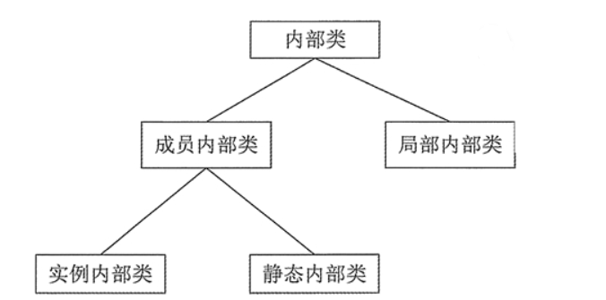

[toc]

# Java笔记9-内部类

## 介绍

java允许在一个类的内部在定义类，这样的类叫做内部类。

内部类可以分为四种：成员内部类、局部内部类、匿名内部类和静态内部类。

内部类的种类如图所示。


>内部类的特点如下：
* 内部类仍然是一个独立的类，在编译之后内部类会被编译成独立的.class文件，但是前面冠以外部类的类名和$符号。
* 内部类不能用普通的方式访问。内部类是外部类的一个成员，因此内部类可以自由地访问外部类的成员变量，无论是否为private的。
* 内部类声明成静态的，就不能随便访问外部类的成员变量，只能访问外部类的静态成员变量。

>如何访问内部类？
- 方式1：在外部类中可以直接通过内部类的类名访问内部类。
- 方式2：在外部类以外的其他类中则需要通过内部类的完整类名访问内部类。

```java
//在外部类中访问内部类
InnerClass ic = new InnerClass();    // InnerClass为内部类的类名
//其他类通过外部类访问内部类
//Test是外部类的类名
Test.InnerClass ti = new Test().new InnerClass();    // Test.innerClass是内部类的完整类名
```

## 成员内部类（实例内部类）

在一个类中在定义一个类，这种类叫做成员内部类。成员内部类中可以访问外部类的所有成员，包括私有成员。

> 定义成员内部类
```java
public class Outer {
    class Inner {
        // 成员内部类Inner
    }
}

//其他类中访问成员内部类
Outer.Inner i = new Outer().new Inner(); 
```

>成员内部类有如下特点:
1. 在其他类中，必须通过外部类的实例来创建内部类的实例，从而访问内部类。
2. 内部类中，可以访问外部类的所有成员。包括静态和非静态的。
3. 成员内部类中不能定义 static 成员，除非同时使用 final 和 static 修饰。
4. 如果一个外部类中有多层嵌套的内部类，那么在外部类中不能直接访问最里面的内部类的成员，而必须通过与其相近的内部类的实例去访问。例如类 A 包含内部类 B，类 B 中包含内部类 C，则在类 A 中不能直接访问类 C，而应该通过类 B 的实例去访问类 C。

>例子
```java
public class Outer {
    public int a = 100;
    static int b = 100;
    final int c = 100;
    private int d = 100;

    public String method1() {
        return "实例方法1";
    }

    public static String method2() {
        return "静态方法2";
    }

    class Inner {
        int a2 = a + 1; // 访问public的a
        int b2 = b + 1; // 访问static的b
        int c2 = c + 1; // 访问final的c
        int d2 = d + 1; // 访问private的d
        String str1 = method1(); // 访问实例方法method1
        String str2 = method2(); // 访问静态方法method2
    }
}
//-----------------------------
//其他类访问内部类
class OtherClass {
    Outer.Inner i = new Outer().new Inner(); // 需要创建外部类实例
}
```

## 静态内部类

**用static修饰符修饰的成员内部类就是静态内部类。**

> 定义静态内部类Inner
```java
public class Outer {
    static class Inner {
        // 静态内部类Inner
    }
}

//其他类中访问静态内部类
Outer.Inner i = new Outer.Inner(); 
```

>静态内部类有如下特点:
1. 在创建静态内部类的实例时，不需要创建外部类的实例对象。因为静态内部类是属于外部类本身的。
2. 静态内部类中可以定义静态成员，但在非静态内部类中不能定义静态成员。
3. 在静态内部类中，只能访问外部类的静态成员，不能访问非静态成员。

>例子
```java
public class Outer {
    static class Inner {
        int a = 0;    // 实例变量a
        static int b = 0;    // 静态变量 b
    }
}
class OtherClass {
    //不需要创建外部类实例对象来访问内部类。因为静态内部类是属于类成员
    Outer.Inner oi = new Outer.Inner();
    int a2 = oi.a;    // 访问内部类成员
    int b2 = Outer.Inner.b;    // 访问内部类的静态成员

}
```

## 方法内部类（局部内部类）

方法内部类指在方法中定义的类，它只能在当前方法中使用。方法内部类可以访问外部类成员

> 定义方法内部类Inner
```java
public class Test {
    public void method() {
        class Inner {
            // 方法内部类Inner
        }
    }
}
``` 

> 方法内部类有如下特点:
1. 方法内部类不能使用static 修饰符和访问修饰符修饰。
2. 方法内部类只在当前方法中有效。
4. 方法内部类中还可以包含内部类，但是这些内部类也不能使用访问控制修饰符和 static 修饰符修饰。
5. 在方法内部类中可以访问外部类的所有成员。
6. 在方法内部类中只可以访问当前方法中 final 类型的参数与变量。如果方法中的成员与外部类中的成员同名，则可以使用 `<OuterClassName>.this.<MemberName>` 的形式访问外部类中的成员。

>例子
```java
public class Test {
    int a = 0;
    int d = 0;
    public void method() {
        int b = 0;
        final int c = 0;
        final int d = 10;
        //方法内部类Inner
        class Inner {
            int a2 = a;    // 访问外部类中的成员
            // int b2 = b;    // 编译出错
            int c2 = c;    // 访问方法中的成员
            int d2 = d;    // 访问方法中的成员
            int d3 = Test.this.d;    //访问外部类中的成员
        }
        Inner i = new Inner();
        System.out.println(i.d2);    // 输出10
        System.out.println(i.d3);    // 输出0
    }
}
```

## 匿名内部类

匿名类是指没有类名的内部类，必须在创建时使用 new 语句来声明类。

>定义匿名内部类
```java
new <类或接口>() {
    // 类的主体
};
```

>匿名类有如下特点：
1. 匿名类和方法内部类一样，可以访问外部类的所有成员。
2. 匿名类中允许使用非静态代码块进行成员初始化操作。
3. 匿名类的非静态代码块会在父类的构造方法之后被执行。

>匿名类有两种实现方式：
* 继承一个类，重写其方法。
* 实现一个接口（可以是多个），实现抽象方法。

>例子
```java
public class Out {
    void show() {
        System.out.println("调用 Out 类的 show() 方法");
    }
}
public class Test {
    // 在show方法中构造一个匿名内部类
    private void show() {
        Out anonyInter = new Out() {
            // 匿名内部类的写法如下：
            //实例化Out类对象的同时，重写了Out类的show方法。
            void show() {
                System.out.println("调用匿名类中的 show() 方法");
            }
        };
        //调用对象的show方法，看看结果是那个？
        anonyInter.show();
    }
    public static void main(String[] args) {
        Test test = new Test();
        test.show();
    }
}

// 程序的输出结果如下：
// 调用匿名类中的 show() 方法
```