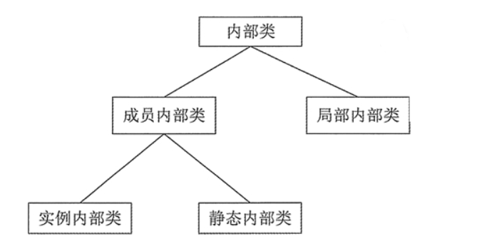

[toc]

# Java笔记9-多态

多态性是面向对象编程的又一个重要特征，它是指在父类中定义的属性和方法被子类继承之后，可以具有不同的数据类型或表现出不同的行为，这使得同一个属性或方法在父类及其各个子类中具有不同的含义。

对面向对象来说，多态分为编译时多态和运行时多态。其中编译时多态主要是指方法的重载。它是根据参数列表的不同来区分不同的方法，通过编译之后会变成两个不同的方法。而运行时多态主要是通过动态绑定来实现的，也就是大家通常所说的多态性。

Java 实现多态有 3 个必要条件：继承、重写和向上转型。只有满足这 3 个条件，开发人员才能够在同一个继承结构中使用统一的逻辑实现代码处理不同的对象，从而执行不同的行为。
* 继承：在多态中必须存在有继承关系的子类和父类。
* 重写：子类对父类中某些方法进行重新定义，在调用这些方法时就会调用子类的方法。
* 向上转型：在多态中需要将子类的引用赋给父类对象，只有这样该引用才既能可以调用父类的方法，又能调用子类的方法。


## 多态例子

下面通过一个例子来演示重写如何实现多态性。
```java
//创建 Figure 类
public class Figure {
    double dim1;
    double dim2;
    Figure(double d1, double d2) {
        // 有参的构造方法
        this.dim1 = d1;
        this.dim2 = d2;
    }
    double area() {
        // 用于计算对象的面积
        System.out.println("父类中计算对象面积的方法，没有实际意义，需要在子类中重写。");
        return 0;
    }
}

//--------------------------------

//创建继承自 Figure 类的 Rectangle 子类，
public class Rectangle extends Figure {
    Rectangle(double d1, double d2) {
        super(d1, d2);
    }

    double area() {
        System.out.println("长方形的面积：");
        return super.dim1 * super.dim2;
    }
}

//--------------------------------

//创建继承自 Figure 类的 Triangle 子类
public class Triangle extends Figure {
    Triangle(double d1, double d2) {
        super(d1, d2);
    }

    double area() {
        System.out.println("三角形的面积：");
        return super.dim1 * super.dim2 / 2;
    }
}

//--------------------------------

//创建 Test 测试类
public class Test {
    public static void main(String[] args) {
        Figure figure; // 声明Figure类的变量
        figure = new Rectangle(9, 9);
        System.out.println(figure.area());
        System.out.println("===============================");
        figure = new Triangle(6, 8);
        System.out.println(figure.area());
        System.out.println("===============================");
        figure = new Figure(10, 10);
        System.out.println(figure.area());
    }
}
```

执行上述代码，输出结果如下：
```
长方形的面积：
81.0
===============================
三角形的面积：
24.0
===============================
父类中计算对象面积的方法，没有实际意义，需要在子类中重写。
0.0
```

从上述代码可以发现，无论 figure 变量的对象是 Rectangle 还是 Triangle，它们都是 Figure 类的子类，因此可以向上转型为该类，从而实现多态。


## 抽象类

在面向对象的概念中，所有的对象都是通过类来描绘的，但是反过来，并不是所有的类都是用来描绘对象的，如果一个类中没有包含足够的信息来描绘一个具体的对象，那么这样的类称为抽象类。

抽象类的定义和使用规则如下：
* 抽象类和抽象方法都要使用 abstract 关键字声明。
* 如果一个方法被声明为抽象的，那么这个类也必须声明为抽象的。而一个抽象类中，可以有抽象方法和具体方法同时存在。
* 抽象类不能实例化，也就是不能使用 new 关键字创建对象。


在 Java 中抽象类的语法格式如下：
```java
<abstract> class <class_name> {
    <abstract> <type> <method_name>(parameter-iist);
}

//abstract 表示该类或该方法是抽象的
//class_name 表示抽象类的名称
//method_name 表示抽象方法名称
//parameter-list 表示参数列表
```

如果一个方法使用 abstract 来修饰，则说明该方法是抽象方法，抽象方法只有声明没有实现。需要注意的是 abstract 关键字只能用于普通方法，不能用于 static 方法或者构造方法中。

抽象方法的 3 个特征如下：
1. 抽象方法没有方法体
2. 抽象方法必须存在于抽象类中
3. 子类重写父类时，必须重写父类所有的抽象方法

注意：在使用 abstract 关键字修饰抽象方法时不能使用 private 修饰，因为抽象方法必须被子类重写，而如果使用了private 声明，则子类是无法重写的。

例子
```java
//定义抽象类
public abstract class Shape {
    public int width; // 几何图形的长
    public int height; // 几何图形的宽
    // 定义抽象方法，计算面积
    public abstract double area(); 
}

//继承抽象类
public class Square extends Shape {
    // 重写父类中的抽象方法，实现计算正方形面积的功能
    @Override
    public double area() {
        return width * height;
    }
}

```


## 接口

抽象类是从多个类中抽象出来的模板，如果将这种抽象进行的更彻底，则可以提炼出一种更加特殊的“抽象类”——接口（Interface）。接口是 Java 中最重要的概念之一，它可以被理解为一种特殊的类，不同的是接口的成员没有执行体，是由全局常量和公共的抽象方法所组成。

### 定义接口

Java 接口的定义方式与类基本相同，不过接口定义使用的关键字是 interface，接口定义的语法格式如下：

```java
[public] interface interface_name {
    // 接口体，其中可以包含定义常量和声明方法
    [public] [static] [final] type constant_name = value;    // 定义常量
    [public] [abstract] returnType method_name(parameter_list);    // 声明方法
}

//public 表示接口的修饰符，当没有修饰符时，则使用默认的修饰符，此时该接口的访问权限仅局限于所属的包；
//interface_name 表示接口的名称。
//constant_name 表示变量名称
//returnType 表示方法的返回值类型
//parameter_list 表示参数列表，在接口中的方法是没有方法体的。
```

接口的特征如下：
* 具有 public 访问修饰符的接口，允许任何类使用；没有指定 public 的接口，其访问将局限于所属的包。
* 方法的声明不需要其他修饰符，在接口中声明的方法，将隐式地声明为公有的（public）和抽象的（abstract）。
* 在 Java 接口中声明的变量其实都是常量，接口中的变量声明，将隐式地声明为 public、static 和 final，即常量，所以接口中定义的变量必须初始化。
* 接口没有构造方法，不能被实例化。

```java
// 接口myInterface
public interface MyInterface {    
    int age = 20;    // 合法，等同于 public static final int age = 20;
    void getInfo();  // 方法声明，等同于 public abstract void getInfo();
}
```

### 实现接口

接口的主要用途就是被类实现，一个类可以实现一个或多个接口，实现则使用 implements 关键字。因为一个类可以实现多个接口，这也是 Java 为单继承灵活性不足所作的补充。

类实现接口的语法格式如下：
```java
<public> class <class_name> [extends superclass_name] [implements interface1_name[, interface2_name…]] {
    // 主体
}

// public：类的修饰符；
// superclass_name：需要继承的父类名称；
// interface1_name：要实现的接口名称。
```

实现接口需要注意以下几点：
* 实现接口与继承父类相似，一样可以获得所实现接口里定义的常量和方法。如果一个类需要实现多个接口，则多个接口之间以逗号分隔。
* 一个类可以继承一个父类，并同时实现多个接口，implements 部分必须放在 extends 部分之后。
* 一个类实现了一个或多个接口之后，这个类必须完全实现这些接口里所定义的全部抽象方法（也就是重写这些抽象方法）；否则该类将保留从父接口那里继承到的抽象方法，该类也必须定义成抽象类。

例子
```java
//创建一个名称为 IMath 的接口
public interface IMath {
    public int sum();    // 完成两个数的相加
    public int maxNum(int a,int b);    // 获取较大的数
}

//=======================

//定义一个 MathClass 类并实现 IMath 接口
public class MathClass implements IMath {
    private int num1;    
    private int num2;

    // 实现接口中的求和方法
    public int sum() {
        return num1 + num2;
    }
    // 实现接口中的获取较大数的方法
    public int maxNum(int a,int b) {
        if(a >= b) {
            return a;
        } else {
            return b;
        }
    }
}
```

在实现类中，所有的方法都使用了 public 访问修饰符声明。无论何时实现一个由接口定义的方法，它都必须实现为 public，因为接口中的所有成员都显式声明为 public。

## 内部类

在类内部除了定义成员变量和方法之外，还可以在类内部也可以定义另一个类。如果在类 A 的内部再定义一个类 B，此时类 B 就称为内部类（或称为嵌套类），而类 A 则称为外部类（或称为宿主类）。

内部类也可以分为多种，与变量非常类似。


内部类的特点如下：
* 内部类仍然是一个独立的类，在编译之后内部类会被编译成独立的.class文件，但是前面冠以外部类的类名和$符号。
* 内部类不能用普通的方式访问。内部类是外部类的一个成员，因此内部类可以自由地访问外部类的成员变量，无论是否为private的。
* 内部类声明成静态的，就不能随便访问外部类的成员变量，只能访问外部类的静态成员变量。

```java
//例子
public class Test {
    public class InnerClass {
        public int getSum(int x,int y) {
            return x + y;
        }
    }
    public static void main(String[] args) {
      
        Test.InnerClass ti = new Test().new InnerClass();
        int i = ti.getSum(2,3);
        System.out.println(i);    // 输出5
    }
}
```

内部类的注意点：
* 在外部类中可以直接通过内部类的类名访问内部类。
* 在外部类以外的其他类中则需要通过内部类的完整类名访问内部类。

```java
//外部类访问内部类
InnerClass ic = new InnerClass();    // InnerClass为内部类的类名

//其他类通过外部类访问内部类
Test.InnerClass ti = new Test().new InnerClass();    // Test.innerClass是内部类的完整类名
```

<font color="red">提示：内部类的很多访问规则可以参考变量和方法。另外使用内部类可以使程序结构变得紧凑，但是却在一定程度上破坏了 Java 面向对象的思想。</font>


### 实例内部类

实例内部类是指没有用 static 修饰的内部类，就是普通的内部类。

```java
public class Outer {
    class Inner {
        // 实例内部类Inner
    }
}
```

实例内部类有如下特点:
1. 在其他类中，必须通过外部类的实例来创建内部类的实例，从而访问内部类。
```java
public class Outer {
    class Inner1 {
    }
}
class OtherClass {
    Outer.Inner i = new Outer().new Inner(); // 需要创建外部类实例
}
```


2. 实例内部类中，可以访问外部类的所有成员。包括静态和非静态的。（本身非静态能访问静态的，静态的不能访问非静态的）
```java
public class Outer {
    public int a = 100;
    static int b = 100;
    final int c = 100;
    private int d = 100;

    public String method1() {
        return "实例方法1";
    }

    public static String method2() {
        return "静态方法2";
    }

    class Inner {
        int a2 = a + 1; // 访问public的a
        int b2 = b + 1; // 访问static的b
        int c2 = c + 1; // 访问final的c
        int d2 = d + 1; // 访问private的d
        String str1 = method1(); // 访问实例方法method1
        String str2 = method2(); // 访问静态方法method2
    }
}
```

3. 如果一个外部类中有多层嵌套的内部类，那么在外部类中不能直接访问最里面的内部类的成员，而必须通过与其相近的内部类的实例去访问。例如类 A 包含内部类 B，类 B 中包含内部类 C，则在类 A 中不能直接访问类 C，而应该通过类 B 的实例去访问类 C。
4. 在实例内部类中不能定义 static 成员，除非同时使用 final 和 static 修饰。


### 静态内部类

静态内部类是指使用 static 修饰的内部类。

```java
public class Outer {
    static class Inner {
        // 静态内部类Inner
    }
}
```

静态内部类有如下特点:

1. 在创建静态内部类的实例时，不需要创建外部类的实例对象。因为静态内部类是属于类成员

```java
public class Outer {
    static class Inner {
    }
}
class OtherClass {
    //不需要创建外部类实例对象来访问内部类。因为静态内部类是属于类成员
    Outer.Inner oi = new Outer.Inner();
}
```


2. 静态内部类中可以定义静态成员和实例成员。外部类以外的其他类需要通过完整的类名访问静态内部类中的静态成员，如果要访问静态内部类中的实例成员，则需要通过静态内部类的实例。

```java
public class Outer {
    static class Inner {
        int a = 0;    // 实例变量a
        static int b = 0;    // 静态变量 b
    }
}
class OtherClass {
    Outer.Inner oi = new Outer.Inner();
    int a2 = oi.a;    // 访问实例成员
    int b2 = Outer.Inner.b;    // 访问静态成员
}
```

3. 静态内部类可以直接访问外部类的静态成员，如果要访问外部类的实例成员，则需要通过外部类的实例去访问。

```java
public class Outer {
    int a = 0;    // 实例变量
    static int b = 0;    // 静态变量
    static class Inner {
        Outer o = new Outer;
        int a2 = o.a;    // 访问实例变量
        int b2 = b;    // 访问静态变量
    }
}
```

### 局部内部类

局部内部类是指在一个方法中定义的内部类。

```java
public class Test {
    public void method() {
        class Inner {
            // 局部内部类
        }
    }
}
``` 

局部内部类有如下特点:

1. 局部内部类与局部变量一样，不能使用访问控制修饰符（public、private 和 protected）和 static 修饰符修饰。

2. 局部内部类只在当前方法中有效。

```java
public class Test {
    public void method() {
        class Inner{
        }
        Inner i = new Inner();
    }
}
```

3. 局部内部类中不能定义 static 成员。
4. 局部内部类中还可以包含内部类，但是这些内部类也不能使用访问控制修饰符（public、private 和 protected）和 static 修饰符修饰。
5. 在局部内部类中可以访问外部类的所有成员。
6. 在局部内部类中只可以访问当前方法中 final 类型的参数与变量。如果方法中的成员与外部类中的成员同名，则可以使用 `<OuterClassName>.this.<MemberName>` 的形式访问外部类中的成员。

```java
public class Test {
    int a = 0;
    int d = 0;
    public void method() {
        int b = 0;
        final int c = 0;
        final int d = 10;
        class Inner {
            int a2 = a;    // 访问外部类中的成员
            // int b2 = b;    // 编译出错
            int c2 = c;    // 访问方法中的成员
            int d2 = d;    // 访问方法中的成员
            int d3 = Test.this.d;    //访问外部类中的成员
        }
        Inner i = new Inner();
        System.out.println(i.d2);    // 输出10
        System.out.println(i.d3);    // 输出0
    }
}
```


### 匿名内部类

匿名类是指没有类名的内部类，必须在创建时使用 new 语句来声明类。

```java
new <类或接口>() {
    // 类的主体
};
```

匿名类有两种实现方式：
* 继承一个类，重写其方法。
* 实现一个接口（可以是多个），实现其方法。

```java
public class Out {
    void show() {
        System.out.println("调用 Out 类的 show() 方法");
    }
}
public class TestAnonymousInterClass {
    // 在这个方法中构造一个匿名内部类
    private void show() {
        Out anonyInter = new Out() {
            // 匿名内部类重写了show方法。
            void show() {
                System.out.println("调用匿名类中的 show() 方法");
            }
        };
        anonyInter.show();
    }
    public static void main(String[] args) {
        TestAnonymousInterClass test = new TestAnonymousInterClass();
        test.show();
    }
}
```

程序的输出结果如下：
```
调用匿名类中的 show() 方法
```

匿名类有如下特点：

1. 匿名类和局部内部类一样，可以访问外部类的所有成员。如果匿名类位于一个方法中，则匿名类只能访问方法中 final 类型的局部变量和参数。

```java
public static void main(String[] args) {
    int a = 10;
    final int b = 10;
    Out anonyInter = new Out() {
        void show() {
            // System.out.println("调用了匿名类的 show() 方法"+a);    // 编译出错
            System.out.println("调用了匿名类的 show() 方法"+b);    // 编译通过
        }
    };
    anonyInter.show();
}
```

2. 匿名类中允许使用非静态代码块进行成员初始化操作。

```java
Out anonyInter = new Out() {
    int i; 
    {    // 非静态代码块
        i = 10;    //成员初始化
    }
    public void show() {
        System.out.println("调用了匿名类的 show() 方法"+i);
    }
};
```

3. 匿名类的非静态代码块会在父类的构造方法之后被执行。
