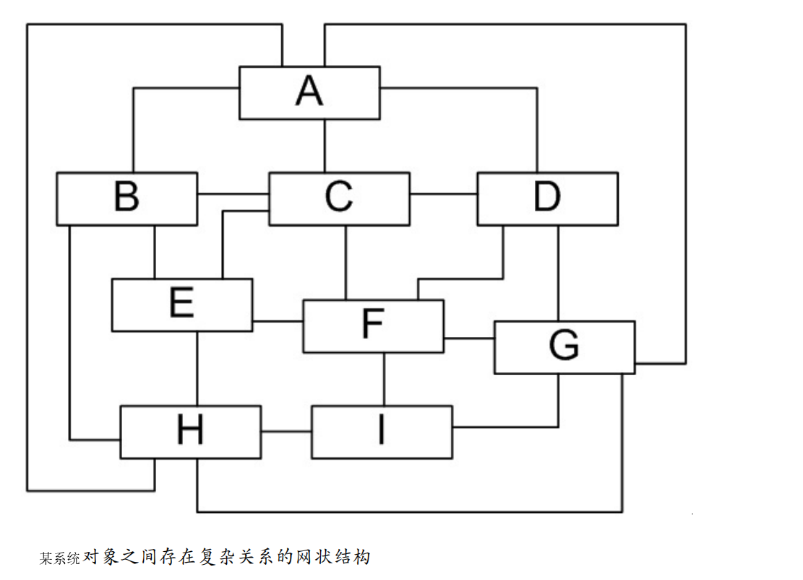

[toc]

# Java设计模式基础


# 8.桥接模式-Bridge Pattern

[参考链接](http://www.jasongj.com/design_pattern/bridge/)

桥接模式：将可抽象部分与它的可实现部分分离，使它们都可以独立地变化。


<h3>举例：</h3>

汽车可按品牌分（BMT，BenZ，LandRover），也可按手动档、自动档来分。如果对于每一种车都实现一个具体类，则一共要实现3*3=9个类。


>当对这个继承结构图使用桥接模式重新设计后


<font color="blue">图中把整个结构图分为品牌和驾驶方式两个部分，当增加车品牌时和增加车的驾驶方式时，方便后续的更新。</font>

```java
//车的品牌抽象类
public abstract class AbstractCar {
	protected Tranmisson tranmisson;  //方便子类继承该属性
	public Tranmisson getTranmisson() {
		return tranmisson;
	}
	public void setTranmisson(Tranmisson tranmisson) {
		this.tranmisson = tranmisson;
	}
	public abstract void run();
}
//
public class BenZCar extends AbstractCar {
	@Override
	public void run() {
		System.out.println("这是BenZCar");
	}
}
//
public class BMWCar extends AbstractCar {
	@Override
	public void run() {
		System.out.println("这是BMW 车");
	}
}
//.....
//车的驾驶方式抽象类
public abstract class Tranmisson {
	protected AbstractCar abstractCar;   //方便子类继承该属性

	public AbstractCar getAbstractCar() {
		return abstractCar;
	}
	public void setAbstractCar(AbstractCar abstractCar) {
		this.abstractCar = abstractCar;
	}
	public abstract void gear();
}
//
public class Manual extends Tranmisson {
	@Override
	public void gear() {
		System.out.println("这是手动档");
	}
}
//
public class Auto extends Tranmisson {
	@Override
	public void gear() {
		System.out.println("这是自动挡");
	}
}

//
public class Test {
	public static void main(String[] args) {
		AbstractCar benz=new BenZCar();
		AbstractCar bmw=new BMWCar();
		AbstractCar landr=new LandRoverCar();
		Tranmisson auto=new Auto();
		Tranmisson manual=new Manual();
		
		benz.setTranmisson(auto);   //设置奔驰车的驾驶方式为自动档
		benz.run();
		
		bmw.setTranmisson(manual); //设置宝马为手动档
		bmw.run();
	}
}
```

# 9.组合模式（用于树形结构的处理）-Composite Pattern

树形结构在软件中随处可见，例如操作系统中的目录结构、应用软件中的菜单、办公系统中的公司组织结构等等，组合模式为处理树形结构提供了一种较为完美的解决方案。
组合模式：组合多个对象形成树形结构以表示具有“整体—部分”关系的层次结构。


>组合模式结构图中包含如下几个角色:
>1. Component：它可以是接口或抽象类，为叶子构件和容器构件公共父类或接口，在该角色中可以包含所有子类共有行为的声明和实现。如增加子构件、删除子构件、获取子构件等。
>2. Leaf：表示叶子节点对象，叶子节点没有子节点，它实现了Component中定义的行为。对于那些访问及管理子构件的方法，可以通过异常等方式进行处理。
>3. Composite（容器构件）：表示容器节点对象，它提供一个集合用于存储子节点，它实现了Component中定义的行为，包括那些访问及管理子构件的方法.

```java
//根节点
public interface Component {
	public  void add(Component c); //增加成员
	public  void remove(Component c); //删除成员
	public  Component getChild(int i); //获取成员
	public  void operation(); //业务方法
}
//容器节点
public class Composite implements Component{
	private ArrayList<Component> list = new ArrayList<Component>();  //容器中可以存在容器或叶子节点
	
	@Override
	public void add(Component c) {
		list.add(c);
	}
	@Override
	public void remove(Component c) {
		list.remove(c);
	}
	@Override
	public Component getChild(int i) {
		return (Component)list.get(i);
	}
	@Override
	public void operation() {
		for(Object obj:list) {
			((Component)obj).operation();
		}
	}
}
//叶子节点
public class Leaf implements Component {
	public void add(Component c) {
		System.out.println("增加节点");
	}
	public void remove(Component c) {
		System.out.println("移除节点");
	}
	public Component getChild(int i) {
		return null;
	}
	public void operation() {
		System.out.println("操作节点");
	}
}

```

>优点缺点：
>1. 优点：①在组合模式中增加新的容器构件和叶子构件都很方便，无须对现有类库进行任何修改，②通过叶子对象和容器对象的递归组合，可以形成复杂的树形结构，但对树形结构的控制却非常简单。
>2. 缺点：增加新构件时很难对容器中的构件类型进行限制。


---

# 11.外观模式-Facade Pattern

外观模式又称为门面模式，为子系统中的提供一个统一的入口。这个入口使得这一子系统更加容易使用。子系统类通常是一些业务类，实现了一些具体的、独立的业务功能。


>外观模式包含如下两个角色：
>(1) Facade（外观角色）：其可以是普通类，也可以是接口。用户可以调用它的方法，在外观角色中可以知道子系统的功能和责任；在正常情况下，它将所有从客户端发来的请求委派到相应的子系统去，传递给相应的子系统对象处理。
>(2) SubSystem（子系统角色）：可以有一个或者多个子系统角色，每一个子系统可以不是一个单独的类，而是一个类的集合，它实现子系统的功能；每一个子系统都可以被客户端直接调用，或者被外观角色调用，它处理由外观类传过来的请求；子系统并不知道外观的存在，对于子系统而言，外观角色仅仅是另外一个客户端而已。

```java

//子系统A
class SubSystemA
{   
	public void MethodA(){
	//业务实现代码
	}
}
//子系统B
class SubSystemB
{   
	public void MethodB(){
	//业务实现代码
	}
}
//子系统C
class SubSystemC
{
	public void MethodC(){
	//业务实现代码
	}
}

//外观类
class Facade
{
	private SubSystemA obj1 = new SubSystemA();
	private SubSystemB obj2 = new SubSystemB();
	private SubSystemC obj3 = new SubSystemC();
	public void Method(){
	obj1.MethodA();
	obj2.MethodB();
	obj3.MethodC();
	}
}

//测试
class Program
{
	static void Main(string[] args){
		Facade facade = new Facade();
		facade.Method();
	}
}

```

>外观模式的优缺点：
>优点：实现了子系统与客户端之间的松耦合关系，一个子系统的修改对其他子系统没有任何影响，而且子系统内部变化也不会影响到外观对象。
>缺点：不能很好地限制客户端直接使用子系统类。如果设计不当，增加新的子系统可能需要修改外观类的源代码，违背了开闭原则。


# 12.享元模式（用于节约内存使用空间）-Flyweight Pattern

享元模式主要实现对同或者相似对象的共享访问，从而节约内存使用空间。

<h3>举例</h3>
一个文本字符串中存在很多重复的字符，若每个字符代表一个对象，将会出现大量的对象，从而浪费系统资源？而享元模式通过建立享元池来解决这个问题。


>享元对象能做到共享的关键是区分了内部状态和外部状态.
>1. 内部状态：是存储在享元对象内部并且不会随环境改变而改变的状态，内部状态可以共享。例如字符内容。
>2. 外部状态：是随环境改变而改变的、不可以共享的状态。其通常由客户端保存，并在享元对象被创建之后，需要使用的时候再传入到享元对象内部。例如字符大小与颜色。

<font color="red">

享元模式的实现过程：
1. 将具有相同内部状态的对象存储在享元池中.
2. 需要的时候就将对象从享元池中取出，实现对象的复用。
3. 通过向取出的对象注入不同的外部状态，可以得到一系列相似的对象,而这些对象在内存中实际上只存储一份。

</font>


>享元模式角色划分
FlyWeightFactory 享元工厂类，将各种类型的具体享元对象存储在一个享元池中
FlyWeight 享元接口或者（抽象享元类），声明了具体享元类公共的方法
ConcreteFlyWeight 具体享元类，其实例称为享元对象
UnSharedConcreteFlyWeight 非共享享元实现类

```java
//享元工厂
class FlyweightFactory {
	//定义一个HashMap用于存储享元对象，实现享元池
	private HashMap flyweights = new HashMap();
	
	public Flyweight getFlyweight(String key){
		//如果对象存在，则直接从享元池获取
		if(flyweights.containsKey(key)){
			return(Flyweight)flyweights.get(key);
		}else {
			//如果对象不存在，先创建一个新的对象添加到享元池中，然后返回

			Flyweight fw = new ConcreteFlyweight();
			flyweights.put(key,fw);
			return fw;
		}
	}
}

//
public interface FlyWeight {
  void operation(String externalState);
}

//
public class ConcreteFlyWeight implements FlyWeight {
		//内部状态intrinsicState作为成员变量，同一个享元对象其内部状态是一致的
		private String intrinsicState;
		
		public Flyweight(String intrinsicState) {
		this.intrinsicState=intrinsicState;
		}
		
		//外部状态extrinsicState在使用时由外部设置，不保存在享元对象中，即使是同一个对象，在每一次调用时也可以传入不同的外部状态
		public void operation(String extrinsicState) {
				....
		}
}

```

>享元模式的优缺点：
>优点：极大减少内存中对象的数量，使得相同或相似对象在内存中只保存一份。
>缺点：使得系统变得复杂，需要分离出内部状态和外部状态。


# 14.命令模式（用于请求发送者与接收者解耦）-Command Pattern

命令模式：将请求发送者和接收者完全解耦，发送者与接收者之间没有直接引用关系，发送请求的对象只需要知道如何发送请求，而不必知道如何完成请求。

**发送者与接收者之间存在第三方（命令者），通过命令者来执行请求。**


>在命令模式结构图中包含如下几个角色：
* Command（抽象命令类）：是一个抽象类或接口，声明了用于执行请求的execute()等方法.
* ConcreteCommand（具体命令类）：是抽象命令类的子类，实现了在抽象命令类中声明的方法，在实现execute()方法时，将调用接收者对象的相关操作(Action)。
* Invoker（调用者）：调用者即请求发送者，它通过命令对象来执行请求。在程序运行时可以将一个具体命令对象注入其中，再调用具体命令对象的execute()方法，从而实现间接调用请求接收者的相关操作。
* Receiver（接收者）：接收者执行与请求相关的操作，它具体实现对请求的业务处理。

```java
//抽象命令类
public interface Command {
	public void excute();
}
//具体命令类
public class ConcreteCommand implements Command {
	public Reciver r;
	
	public ConcreteCommand(Reciver r){   //把接受者用构造方法注入到类中
		this.r=r;
	}
	@Override
	public void excute() {
		System.out.println("具体命令，让接受者执行请求");
		r.run();      
	}
}
//调用者，发送请求者
public class Invoker {
	private Command command;
	//构造注入
	public Invoker(Command command) {
		this.command = command;
	}
	//设值注入
	public void setCommand(Command command) {
		this.command = command;
	}
	//业务方法，用于调用命令类的execute()方法
	public void call() {
		command.excute();
	}
}
//接受请求者
public class Reciver {
	public void run() {
		System.out.println("接受者执行请求");
	}
}
//测试
public class Test {
	public static void main(String[] args) {
		Reciver reciver=new Reciver();
		Command c=new ConcreteCommand(reciver);   //父类引用指向子类对象
		Invoker invoker=new Invoker(c);   //把命令类注入到发送者类中
		invoker.call();         		//发送者执行请求，实际是命令对象执行请求
	}
}

```

>运行结果：
具体命令，让接受者执行请求
接受者执行请求

>命令模式的优缺点：
>优点：新的命令可以很容易地加入到系统中，无须修改原有系统源代码。
>缺点：可能会导致某些系统有过多的具体命令类。

# 15.迭代器模式（用于遍历对象中的元素）-Iterator Pattern

迭代器模式：提供一种方法来访问对象，而不用暴露这个对象的内部方法表示，其别名为游标(Cursor)。


>在迭代器模式结构图中包含如下几个角色：
* Iterator（抽象迭代器）：它定义了访问和遍历元素的接口，声明了用于遍历数据元素的方法。
* ConcreteIterator（具体迭代器）：它实现了抽象迭代器接口，在具体迭代器中通过游标来记录在聚合对象中所处的当前位置，游标通常是一个表示位置的非负整数。
* Aggregate（抽象聚合类）：它用于存储和管理元素对象，声明一个createIterator()方法用于创建一个迭代器对象，充当抽象迭代器工厂角色。
* ConcreteAggregate（具体聚合类）：它实现了createIterator()方法，该方法返回一个与该具体聚合类对应的具体迭代器ConcreteIterator实例。

```java

//抽象迭代器
interface Iterator {
	public void first(); //将游标指向第一个元素
	public void next(); //将游标指向下一个元素
	public boolean hasNext(); //判断是否存在下一个元素
	public Object currentItem(); //获取游标指向的当前元素
}
//抽象聚合类
interface Aggregate {
Iterator createIterator();
}
//具体聚合类
class ConcreteAggregate implements Aggregate {
	......
		public Iterator createIterator() {
			return new ConcreteIterator(this);
		}
	......
}

//具体迭代器
class ConcreteIterator implements Iterator {
	private ConcreteAggregate objects; //对具体聚合对象的引用，以便于访问存储在聚合对象中的数据
	private int cursor; //定义一个游标，用于记录当前访问位置
	//构造函数注入
	public ConcreteIterator(ConcreteAggregate objects) {
		this.objects=objects;
	}
	public void first() { ...... }
	public void next() { ...... }
	public boolean hasNext() { ...... }
	public Object currentItem() { ...... }
}

```

>迭代器模式的优缺点：
>优点：对同一个聚合对象上可以定义多种遍历方式，增加新的聚合类和迭代器类都很方便。
>缺点：增加新的聚合类需要对应增加新的迭代器类，类的个数成对增加。

---


# 19.职责链模式（用于请求的链式处理）-Chain of Responsibility Pattern

职责链模式可以将请求的处理者组织成一条链，并让请求沿着链传递，由链上的处理者对请求进行相应的处理，客户端无须关心请求的处理细节以及请求的传递，只需将请求发送到链上即可，实现请求发送者和请求处理者解耦。


>在职责链模式中包含如下几个角色：
* Handler（抽象处理者）：它定义了一个处理请求的接口，在其中定义了抽象请求处理方法。因为每一个处理者的下家还是一个处理者，因此在抽象处理者中定义了一个抽象处理者类型的对象（如结构图中的successor），作为其对下家的引用。通过该引用，处理者可以连成一条链。
* ConcreteHandler（具体处理者）：是抽象处理者的子类，实现了抽象处理者中定义的抽象请求处理方法，在处理请求之前需要进行判断，看是否有相应的处理权限，如果可以处理请求就处理它，否则将请求转发给后继者；在具体处理者中可以访问链中下一个对象，以便请求的转发。

```java
abstract class Handler {
	//对下一个处理者的引用
	protected Handler successor;
	//注入对象
	public void setSuccessor(Handler successor) {
		this.successor=successor;
	}
	//请求处理方法
	public abstract void handleRequest(String request);
}

class ConcreteHandler extends Handler {
	public void handleRequest(String request) {
		if (请求满足条件) {
			//具体处理请求
		}else {
			this.successor.handleRequest(request); //转发请求
		}
	}
}

```

>职责链模式的优缺点：
>优点：请求处理对象仅需维持一个指向其后继者的引用，而不需要维持它对所有的候选处理者的引用，可简化对象的相互连接。
>缺点：对于比较长的职责链，请求的处理可能涉及到多个处理对象。


# 20.中介者模式（用于协调多个对象之间的交互）-Mediator Pattern

中介者模式是来协调某些类或对象之间的复杂关系。以降低系统的耦合度。又称为调停者模式，它是一种对象行为型模式。




>如果在一个系统中对象之间存在多对多的相互关系，可以将对象之间的一些交互行为从各个对象中分离出来，并集中封装在一个中介者对象中，并由该中介者进行统一协调，这样对象之间多对多的复杂关系就转化为相对简单的一对多关系。通过引入中介者来简化对象之间的复杂交互。


>在中介者模式结构图中包含如下几个角色：
* Mediator（抽象中介者）：它定义一个接口，该接口用于与各同事对象之间进行通信。
* ConcreteMediator（具体中介者）：通过协调各个同事对象来实现协作行为，它有对各个同事对象的引用。
* Colleague（抽象同事类）：它定义各个同事类公有的方法，并声明了一些抽象方法来供子类实现，同时它有一个对抽象中介者类的引用，其子类可以通过该引用来与中介者通信。
* ConcreteColleague（具体同事类）：它是抽象同事类的子类；每一个同事对象在需要和其他同事对象通信时，先与中介者通信，通过中介者来间接完成与其他同事类的通信；在具体同事类中实现了在抽象同事类中声明的抽象方法。

```java
abstract class Mediator {
	protected ArrayList<Colleague> colleagues; //用于存储同事对象
	//注册方法，用于增加同事对象
	public void register(Colleague colleague) {
		colleagues.add(colleague);
	}
	//声明抽象的业务方法
	public abstract void operation();
}
class ConcreteMediator extends Mediator {
	//实现业务方法，封装同事之间的调用
	public void operation() {
		//通过中介者调用同事类的方法
	}
}
abstract class Colleague {
	protected Mediator mediator; //维持一个抽象中介者的引用

	public abstract void method1(); //声明自身方法，处理自己的行为
	public Colleague(Mediator mediator) {
		this.mediator=mediator;
	}
	//定义依赖方法，与中介者进行通信
	public void method2() {
		mediator.operation();
	}
}
class ConcreteColleague extends Colleague {
	public ConcreteColleague(Mediator mediator) {
		super(mediator);
	}
	//实现自身方法
	public void method1() {
		......
	}
}
```

>中介者模式的优缺点：
>优点：简化了对象之间的交互，它用中介者和同事的一对多交互代替了原来同事之间的多对多交互。增加新的中介者和新的同事类都比较方便。
>缺点：在具体中介者类中包含了大量同事之间的交互细节，可能会导致具体中介者类非常复杂。

# 21.备忘录模式（用于撤销功能的实现）-Memento Pattern

备忘录模式可以使系统恢复到某一特定的历史状态。

<font color="blue">备忘录模式的定义：在不破坏封装的前提下，捕获一个对象的内部状态，并在该对象之外保存这个状态，这样可以在以后将对象恢复到原先保存的状态。它是一种对象行为型模式，其别名为Token。</font>


>备忘录模式结构图中包含如下几个角色：
* Originator（原发器）：一个普通类，一般将需要保存内部状态的类设计为原发器。
* Memento（备忘录)：存储原发器的内部状态，根据原发器来决定保存哪些内部状态。一般参考原发器的设计，根据实际需要确定备忘录类中的属性。==需要注意的是，除了原发器本身与负责人类之外，备忘录对象不能直接供其他类使用==。
* Caretaker（负责人）：负责人又称为管理者，==它负责保存备忘录，但是不能对备忘录的内容进行操作或检查==。在负责人类中可以存储一个或多个备忘录对象，它只负责存储对象，而不能修改对象，也无须知道对象的实现细节。

```java
public class Originator {
	private String state;
	public Originator(){}
	// 创建一个备忘录对象
	public Memento createMemento() {
		return new Memento(this);
	}
	// 根据备忘录对象恢复原发器状态
	public void restoreMemento(Memento m) {
		state = m.state;
	}
	public void setState(String state) {
		this.state=state;
	}
	public String getState() {
		return this.state;
	}
}

//除了Originator类，若允许其他类来调用备忘录类Memento的构造函数与相关方法，将导致在备忘录中保存的历史状态发生改变，
//通过撤销操作所恢复的状态就不再是真实的历史状态。
class Memento {
	private String state;
	public Memento(Originator o) {
		state = o.getState();
	}
	public void setState(String state) {
		this.state=state;
	}
	public String getState() {
		return this.state;
	}
}

//Caretaker类中不应该直接调用Memento中的状态改变方法，它的作用仅仅用于存储备忘录对象。
//将原发器备份生成的备忘录对象存储在其中，当用户需要对原发器进行恢复时再将存储在其中的备忘录对象取出。
public class Caretaker {
	private Memento memento;
	public Memento getMemento() {
		return memento;
	}
	public void setMemento(Memento memento) {
		this.memento=memento;
	}
}

```

>备忘录模式的优缺点：
>优点：它提供了一种状态恢复的实现机制，使得用户可以方便地回到一个特定的历史步骤。
>缺点：资源消耗过大，如果需要保存的原发器类的成员变量太多，就不可避免需要占用大量的存储空间，每保存一次对象的状态都需要消耗一定的系统资源。


# 22.访问者模式（用于操作复杂对象结构）-Visitor Pattern

访问者模式，它包含访问者和被访问元素两个主要组成部分。被访问的元素通常具有不同的类型，且不同的访问者可以对它们进行不同的访问操作。==例如处方单中的各种药品信息就是被访问的元素，而划价人员和药房工作人员就是访问者==。访问者模式使得用户可以在不修改现有系统的情况下扩展系统的功能，为这些不同类型的元素增加新的操作。

<font color="blue">使用访问者模式时，被访问元素通常不是单独存在的，它们存储在一个集合中，这个集合被称为“对象结构”，访问者通过遍历对象结构实现对其中存储的元素的逐个操作。</font>


>访问者模式结构图中包含如下几个角色：
* Vistor（抽象访问者）：抽象访问者为对象结构中每一个具体元素类ConcreteElement声明一个访问操作，具体访问者需要实现这些操作方法，定义对这些元素的访问操作。
* ConcreteVisitor（具体访问者）：具体访问者实现了每个由抽象访问者声明的操作，每一个操作用于访问对象结构中一种类型的元素。
* Element（抽象元素）：它定义一个accept()方法，该方法通常以一个抽象访问者作为参数。
* ConcreteElement（具体元素）：具体元素实现了accept()方法，在accept()方法中调用访问者的访问方法以便完成对一个元素的操作。
* ObjectStructure（对象结构）：对象结构是一个元素的集合，它用于存放元素对象，并且提供了遍历其内部元素的方法。它可以结合组合模式来实现，也可以是一个简单的集合对象，如一个List对象或一个Set对象。

```java

abstract class Visitor{
	public abstract void visit(ConcreteElementA elementA);
	public abstract void visit(ConcreteElementB elementB);
	public void visit(ConcreteElementC elementC)
	{
		//元素ConcreteElementC操作代码
	}
}
class ConcreteVisitor extends Visitor{
	public void visit(ConcreteElementA elementA)
	{
		//元素ConcreteElementA操作代码
	}
	public void visit(ConcreteElementB elementB)
	{
		//元素ConcreteElementB操作代码
	}
}
interface Element{
	public void accept(Visitor visitor);
}
class ConcreteElementA implements Element
{
	public void accept(Visitor visitor)
	{
		visitor.visit(this);
	}
	public void operationA()
	{
		//业务方法
	}
}

```

>其具体执行过程如下：
(1) 调用具体元素类的accept(Visitor visitor)方法，并将Visitor子类对象作为其参数；
(2) 在具体元素类accept(Visitor visitor)方法内部调用传入的Visitor对象的visit()方法，如
visit(ConcreteElementA elementA)，将当前具体元素类对象(this)作为参数，如visitor.visit(this)；
(3) 执行Visitor对象的visit()方法，在其中还可以调用具体元素对象的业务方法。

>访问者模式的优缺点：
>优点：增加新的访问操作很方便。将有关元素对象的访问行为集中到一个访问者对象中，而不是分散在一个个的元素类中。
>缺点：在访问者模式中，每增加一个新的元素类都意味着要在抽象访问者角色中增加一个新的抽象操作。